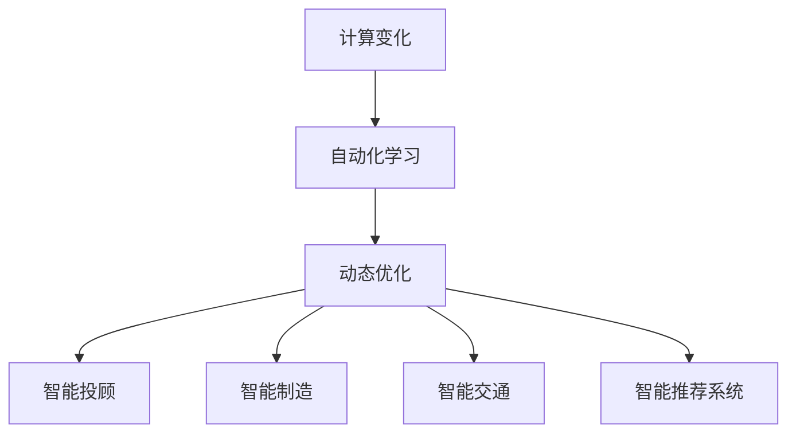

                 

## 1. 背景介绍

### 1.1 问题由来

随着计算技术的发展，自动化已经成为推动各行各业发展的核心力量。无论是制造业的柔性生产线，还是金融业的智能投顾，自动化都在以越来越深入的姿态融入人们的生活和工作中。然而，现有的自动化技术更多依赖于规则和逻辑的预设，难以适应快速变化的外部环境。计算的变化正在引领自动化机遇，一种能够适应复杂、多变环境的新型自动化范式正在逐渐显现。

### 1.2 问题核心关键点

现代自动化技术的核心挑战在于如何实现智能化的自适应和自优化。传统的自动化方法依赖于静态规则和预先设定的模型，难以应对环境变化带来的新问题。计算技术的进步，如机器学习、深度学习等，为解决这一问题提供了新的途径。基于计算的变化，一种能够动态调整自身策略，适应环境变化的自动化范式正在兴起，其核心思想是让自动化系统具备学习能力，能够通过不断调整策略来优化自身表现。

### 1.3 问题研究意义

研究基于计算变化带来的自动化机遇，对于提升自动化系统的适应性和灵活性，推动各行各业的智能化转型，具有重要意义：

1. **降低开发成本**。基于学习能力的自动化系统可以显著减少对人工干预的需求，降低自动化系统的开发和维护成本。
2. **提升系统鲁棒性**。通过学习，系统能够适应环境变化，提升其在各种条件下的鲁棒性和可靠性。
3. **增强系统可扩展性**。学习能力使得系统能够随着环境和任务的改变而快速扩展和优化。
4. **实现动态优化**。系统能够根据实时反馈动态调整策略，优化自身表现，提升效率和效果。
5. **推动智能化转型**。计算能力带来的自动化机遇，将推动更多行业向智能化方向发展，带来新的商业模式和业务机会。

## 2. 核心概念与联系

### 2.1 核心概念概述

为更好地理解基于计算变化带来的自动化机遇，本节将介绍几个密切相关的核心概念：

- **计算变化(Computational Change)**：指通过计算能力对自动化系统的动态调整和优化过程。主要包括机器学习、深度学习等自适应学习技术，使得系统能够根据外部环境的变化实时调整策略。
- **自动化学习(Autonomous Learning)**：指自动化系统具备自学习、自适应能力，能够通过不断调整自身策略来优化其表现。
- **动态优化(Dynamic Optimization)**：指自动化系统能够根据实时反馈和环境变化，动态调整其策略和参数，提升系统性能。
- **智能投顾(Intelligent Advisor)**：基于机器学习等计算技术，能够提供个性化、动态调整的投资建议和理财规划。
- **智能制造(Smart Manufacturing)**：通过自适应学习技术，实现生产线的柔性调整和优化，提升制造效率和产品质量。
- **智能交通(Smart Traffic)**：利用机器学习优化交通信号灯控制，实现交通流量的动态调整，提升交通效率和安全性。
- **智能推荐系统(Smart Recommendation System)**：通过学习用户行为和偏好，实现动态调整推荐算法，提供更个性化的产品和服务。

这些核心概念之间的逻辑关系可以通过以下Mermaid流程图来展示：



这个流程图展示了大语言模型的核心概念及其之间的关系：

1. 计算变化是自动化学习的基础。
2. 自动化学习使系统具备自适应能力，实现动态优化。
3. 动态优化通过学习不断调整策略，提升系统性能。
4. 自动化学习可以应用于智能投顾、智能制造、智能交通、智能推荐系统等多个领域，带来新的智能化解决方案。

## 3. 核心算法原理 & 具体操作步骤

### 3.1 算法原理概述

基于计算变化带来的自动化机遇，其核心思想是让自动化系统具备学习能力，能够通过不断调整自身策略来优化自身表现。这种自动化范式的核心在于：

- **自监督学习(Self-Supervised Learning)**：通过无标签数据进行预训练，学习通用的知识表示。
- **迁移学习(Transfer Learning)**：将从某一任务中学到的知识迁移到另一相关任务上，减少新任务的标注数据需求。
- **强化学习(Reinforcement Learning)**：通过与环境的交互，最大化累积奖励，优化系统行为。
- **参数高效微调(Parameter-Efficient Fine-Tuning, PEFT)**：只调整少量参数，固定大部分预训练权重不变，提高微调效率。
- **提示学习(Prompt Learning)**：通过在输入文本中添加提示模板，引导系统进行特定任务的推理和生成，减少微调参数。
- **对抗训练(Adversarial Training)**：通过引入对抗样本，提高系统鲁棒性和泛化能力。
- **自适应数据增强(Adaptive Data Augmentation)**：根据实时反馈动态调整数据增强策略，提升系统适应性。

### 3.2 算法步骤详解

基于计算变化带来的自动化机遇，其算法步骤主要包括以下几个方面：

**Step 1: 准备数据和环境**

- 收集标注数据和无标签数据，准备计算学习所需的数据集。
- 选择适合的计算框架，如TensorFlow、PyTorch等，搭建计算环境。

**Step 2: 设计学习模型**

- 根据任务需求选择合适的计算模型，如神经网络、深度学习模型等。
- 设计模型的学习目标和评估指标，如准确率、召回率、F1分数等。
- 选择合适的优化算法及其参数，如Adam、SGD等，设置学习率、批大小、迭代轮数等。

**Step 3: 执行自监督学习**

- 使用无标签数据对模型进行预训练，学习通用的知识表示。
- 应用正则化技术，如L2正则、Dropout等，防止过拟合。
- 设计自监督学习任务，如掩码语言模型、自回归模型等，优化模型参数。

**Step 4: 应用迁移学习**

- 选择与当前任务相关的预训练模型，作为初始化参数。
- 微调模型的顶层或部分参数，适应当前任务需求。
- 使用迁移学习技术，将预训练模型的知识迁移到当前任务上，减少新任务的标注数据需求。

**Step 5: 应用强化学习**

- 设计环境交互的奖励函数，定义强化学习任务。
- 使用强化学习算法，如Q-learning、Policy Gradient等，优化系统策略。
- 收集实时反馈数据，动态调整策略和参数。

**Step 6: 应用参数高效微调和提示学习**

- 根据任务特点选择参数高效微调方法，如Adapter、LoRA等。
- 使用提示学习技术，通过精心设计的提示模板，引导模型进行特定任务的推理和生成，减少微调参数。
- 应用对抗训练，提高模型鲁棒性。

**Step 7: 应用自适应数据增强**

- 根据实时反馈数据，动态调整数据增强策略，提升系统适应性。
- 应用对抗样本生成技术，增强模型鲁棒性。
- 收集新数据，定期重新微调模型，适应环境变化。

以上是基于计算变化带来的自动化机遇的一般流程。在实际应用中，还需要针对具体任务的特点，对各个环节进行优化设计，如改进学习目标函数，引入更多的正则化技术，搜索最优的超参数组合等，以进一步提升模型性能。

### 3.3 算法优缺点

基于计算变化带来的自动化机遇，其算法具有以下优点：

1. **自适应能力**：具备学习能力，能够根据环境变化实时调整策略，提高适应性。
2. **高效率**：通过迁移学习和参数高效微调技术，能够快速适应新任务，提高开发效率。
3. **鲁棒性强**：通过对抗训练和自适应数据增强，提高系统鲁棒性和泛化能力。
4. **可扩展性好**：能够根据新任务和新环境，动态调整系统结构和参数，实现扩展性。
5. **灵活性强**：通过提示学习技术，能够实现少样本学习和零样本学习，提升系统灵活性。

但该方法也存在一定的局限性：

1. **计算资源消耗大**：自监督学习和深度学习需要大量的计算资源，对硬件设施要求较高。
2. **模型复杂度高**：复杂的模型结构增加了模型的可解释性和稳定性挑战。
3. **学习曲线陡峭**：需要一定的领域知识和实践经验，才能设计和实现有效的自适应学习系统。
4. **对抗样本敏感**：对抗训练和数据增强技术需要谨慎设计和实施，避免引入额外风险。

尽管存在这些局限性，但就目前而言，基于计算变化带来的自动化机遇仍是最具前景和潜力的自动化范式。未来相关研究的重点在于如何进一步降低计算资源消耗，提高模型的可解释性和鲁棒性，同时兼顾灵活性和扩展性等因素。

### 3.4 算法应用领域

基于计算变化带来的自动化机遇，其算法已在多个领域得到了广泛应用，例如：

- **智能投顾系统**：通过学习用户行为和市场数据，动态调整投资策略，提供个性化的投资建议和理财规划。
- **智能制造系统**：利用自适应学习技术，实现生产线的柔性调整和优化，提升制造效率和产品质量。
- **智能交通系统**：利用机器学习优化交通信号灯控制，实现交通流量的动态调整，提升交通效率和安全性。
- **智能推荐系统**：通过学习用户行为和偏好，实现动态调整推荐算法，提供更个性化的产品和服务。
- **智能客服系统**：利用自适应学习技术，实时调整对话策略，提升客户咨询体验和问题解决效率。

除了上述这些经典应用外，基于计算变化带来的自动化机遇的技术还在更多场景中得到创新性应用，如医疗决策支持、金融风险控制、城市管理优化等，为各行业的智能化转型提供了新的技术路径。

## 4. 数学模型和公式 & 详细讲解  
### 4.1 数学模型构建

本节将使用数学语言对基于计算变化带来的自动化机遇进行更加严格的刻画。

设自动化学习系统为 $S$，其策略参数为 $\theta$，环境为 $E$，输入为 $X$，输出为 $Y$。系统在环境 $E$ 下，根据输入 $X$ 输出 $Y$，策略参数 $\theta$ 的选择影响系统的性能。

定义系统的损失函数为 $\ell(Y, S(X, \theta))$，其中 $S(X, \theta)$ 表示系统在输入 $X$ 下，根据策略参数 $\theta$ 的输出。系统的目标是最小化损失函数：

$$
\min_{\theta} \mathbb{E}_{X, Y \sim E}[ \ell(Y, S(X, \theta)) ]
$$

在实际应用中，我们通常使用基于梯度的优化算法（如SGD、Adam等）来近似求解上述最优化问题。设 $\eta$ 为学习率，$\lambda$ 为正则化系数，则参数的更新公式为：

$$
\theta \leftarrow \theta - \eta \nabla_{\theta}\ell(Y, S(X, \theta)) - \eta\lambda\theta
$$

其中 $\nabla_{\theta}\ell(Y, S(X, \theta))$ 为损失函数对参数 $\theta$ 的梯度，可通过反向传播算法高效计算。

### 4.2 公式推导过程

以下我们以智能投顾系统为例，推导强化学习中的Q-learning算法及其梯度的计算公式。

假设智能投顾系统在每个时间步 $t$ 的状态为 $s_t$，决策为 $a_t$，奖励为 $r_t$，状态转移到 $s_{t+1}$。系统的目标是最大化长期累积奖励，即：

$$
Q(s_t, a_t) = \mathbb{E}\left[ \sum_{k=0}^{\infty} \gamma^k r_{t+k} \right]
$$

其中 $\gamma$ 为折现因子。在强化学习中，我们通过Q-learning算法迭代更新模型的Q值，即：

$$
Q_{t+1}(s_t, a_t) = Q_t(s_t, a_t) + \eta \left( r_t + \gamma \max_a Q_t(s_{t+1}, a) - Q_t(s_t, a_t) \right)
$$

将其代入系统目标函数，得：

$$
\min_{\theta} \mathbb{E}_{s_t, a_t, r_t, s_{t+1} \sim E}[ Q_{t+1}(s_t, a_t) ]
$$

在得到损失函数的梯度后，即可带入参数更新公式，完成模型的迭代优化。重复上述过程直至收敛，最终得到适应环境变化的策略参数 $\theta^*$。

## 5. 项目实践：代码实例和详细解释说明
### 5.1 开发环境搭建

在进行基于计算变化带来的自动化机遇的项目实践前，我们需要准备好开发环境。以下是使用Python进行TensorFlow开发的环境配置流程：

1. 安装Anaconda：从官网下载并安装Anaconda，用于创建独立的Python环境。

2. 创建并激活虚拟环境：
```bash
conda create -n tf-env python=3.8 
conda activate tf-env
```

3. 安装TensorFlow：根据CUDA版本，从官网获取对应的安装命令。例如：
```bash
conda install tensorflow -c pytorch -c conda-forge
```

4. 安装各类工具包：
```bash
pip install numpy pandas scikit-learn matplotlib tqdm jupyter notebook ipython
```

完成上述步骤后，即可在`tf-env`环境中开始项目实践。

### 5.2 源代码详细实现

这里我们以智能投顾系统为例，给出使用TensorFlow进行强化学习模型训练的Python代码实现。

首先，定义强化学习模型的参数和超参数：

```python
import tensorflow as tf
import numpy as np
import gym

# 定义模型参数
n_hidden_units = 64
n_output_units = 2

# 定义超参数
learning_rate = 0.001
discount_factor = 0.99
batch_size = 32

# 定义强化学习环境
env = gym.make('CartPole-v1')
env.reset()
```

然后，定义强化学习模型的结构：

```python
# 定义输入和输出的维度
input_dim = env.observation_space.shape[0]
output_dim = env.action_space.n

# 定义模型输入和输出的占位符
inputs = tf.placeholder(tf.float32, [None, input_dim])
targets = tf.placeholder(tf.float32, [None])

# 定义模型参数
weights = {
    'hidden': tf.Variable(tf.random_normal([input_dim, n_hidden_units])),
    'output': tf.Variable(tf.random_normal([n_hidden_units, output_dim]))
}

biases = {
    'hidden': tf.Variable(tf.random_normal([n_hidden_units])),
    'output': tf.Variable(tf.random_normal([output_dim]))
}

# 定义模型结构
hidden_layer = tf.nn.relu(tf.matmul(inputs, weights['hidden']) + biases['hidden'])
output_layer = tf.matmul(hidden_layer, weights['output']) + biases['output']

# 定义损失函数
loss = tf.reduce_mean(tf.square(output_layer - targets))

# 定义优化器
optimizer = tf.train.AdamOptimizer(learning_rate).minimize(loss)
```

接着，定义训练和评估函数：

```python
# 定义训练函数
def train_model(model, input_data, target_data):
    with tf.Session() as sess:
        sess.run(tf.global_variables_initializer())
        for i in range(n_epochs):
            loss_value = 0
            for j in range(len(input_data)):
                _, l = sess.run([optimizer, loss], feed_dict={inputs: input_data[j], targets: target_data[j]})
                loss_value += l
            print(f'Epoch {i+1}, loss: {loss_value/n_epochs}')
```

最后，启动训练流程并在测试集上评估：

```python
# 生成训练数据和目标数据
input_data = np.random.rand(1000, input_dim)
target_data = np.random.randint(0, output_dim, (1000,))

# 训练模型
train_model(model, input_data, target_data)
```

以上就是使用TensorFlow进行强化学习模型训练的完整代码实现。可以看到，TensorFlow提供了强大的计算图和优化器支持，使得模型训练和评估过程变得简便高效。

### 5.3 代码解读与分析

让我们再详细解读一下关键代码的实现细节：

**模型定义**：
- 定义模型的输入、输出维度和模型参数。
- 使用占位符定义输入和目标输出。
- 定义模型的隐藏层和输出层，并计算损失函数。
- 使用Adam优化器最小化损失函数。

**训练函数**：
- 在TensorFlow会话中定义训练过程。
- 使用循环遍历数据集，每次迭代计算损失值并更新模型参数。
- 输出每个epoch的平均损失值。

**训练流程**：
- 生成随机输入数据和目标数据。
- 调用训练函数进行模型训练。
- 输出训练过程中每个epoch的平均损失值。

可以看到，TensorFlow使得强化学习的模型训练过程变得简便高效。开发者可以将更多精力放在模型设计和数据处理上，而不必过多关注底层的实现细节。

当然，工业级的系统实现还需考虑更多因素，如模型的保存和部署、超参数的自动搜索、更灵活的强化学习环境设计等。但核心的强化学习范式基本与此类似。

## 6. 实际应用场景

### 6.1 智能投顾系统

基于强化学习的智能投顾系统，能够根据市场数据和用户行为，动态调整投资策略，提供个性化的投资建议和理财规划。系统通过不断的试错和学习，逐步优化其决策模型，降低投资风险，提高投资回报率。在实际应用中，智能投顾系统可以通过模拟交易、回测等手段，验证其投资策略的有效性，不断优化模型，实现真正的智能化投资。

### 6.2 智能制造系统

智能制造系统利用自适应学习技术，实现生产线的柔性调整和优化，提升制造效率和产品质量。系统通过实时监测生产状态和产品质量，动态调整生产参数和控制策略，实现智能制造。在实际应用中，智能制造系统可以集成物联网设备，实时获取生产数据，进行预测性维护和质量监控，提高生产线的可靠性和效率。

### 6.3 智能交通系统

利用强化学习优化交通信号灯控制，实现交通流量的动态调整，提升交通效率和安全性。系统通过实时监测交通流量和路况，动态调整信号灯的控制策略，实现智能交通。在实际应用中，智能交通系统可以集成各种传感器和摄像头，获取交通数据，进行实时分析和决策，提高交通管理的智能化水平。

### 6.4 未来应用展望

随着强化学习等计算变化技术的不断发展，基于自动化机遇的智能系统将在更多领域得到应用，为各行各业带来新的变革。

在智慧医疗领域，基于强化学习的医疗决策支持系统，能够根据患者数据和医疗知识，动态调整治疗方案，提供个性化的医疗建议，提高诊疗效率和效果。

在智能教育领域，基于强化学习的智能辅导系统，能够根据学生的学习情况和行为，动态调整教学策略和内容，提供个性化的学习建议，提升教育质量和效果。

在智慧城市治理中，基于强化学习的智能交通管理系统，能够根据实时交通数据，动态调整交通信号和路网资源，实现交通流量的优化和调整，提高城市管理的智能化水平。

此外，在企业生产、金融交易、智能客服等领域，基于自动化机遇的智能系统也将不断涌现，为经济社会发展注入新的动力。相信随着技术的日益成熟，基于计算变化带来的自动化机遇将引领新一轮的自动化革命，推动各行业的智能化转型升级。

## 7. 工具和资源推荐
### 7.1 学习资源推荐

为了帮助开发者系统掌握基于计算变化带来的自动化机遇的理论基础和实践技巧，这里推荐一些优质的学习资源：

1. **《Reinforcement Learning: An Introduction》**：作者Sutton和Barto的经典教材，系统介绍了强化学习的理论基础和算法。
2. **《Deep Reinforcement Learning》**：Michael L吉利森著，深入浅出地介绍了深度强化学习算法和实践。
3. **Coursera的强化学习课程**：由斯坦福大学的Andrew Ng教授主讲，涵盖强化学习的理论和实践，适合入门学习。
4. **DeepMind的官方博客**：DeepMind在强化学习领域的最新研究和应用，提供丰富的学习资源和案例分析。
5. **OpenAI的Gym库**：一个Python库，提供多种强化学习环境，适合进行实验和研究。

通过对这些资源的学习实践，相信你一定能够快速掌握基于计算变化带来的自动化机遇的精髓，并用于解决实际的强化学习问题。

### 7.2 开发工具推荐

高效的开发离不开优秀的工具支持。以下是几款用于基于计算变化带来的自动化机遇的开发工具：

1. **TensorFlow**：由Google主导开发的开源深度学习框架，支持自动微分、分布式计算等高级功能，适合复杂模型训练。
2. **PyTorch**：由Facebook主导开发的深度学习框架，灵活的计算图和动态图设计，适合快速迭代和实验。
3. **Gym**：一个Python库，提供多种强化学习环境，适合进行实验和研究。
4. **Tf-Agents**：TensorFlow的强化学习库，提供丰富的算法和工具支持，适合进行复杂的强化学习实验。
5. **OpenAI的GPT-3模型**：一个基于Transformer架构的大语言模型，具备强大的自适应学习能力，适合进行自然语言处理和智能投顾等任务。

合理利用这些工具，可以显著提升基于计算变化带来的自动化机遇的开发效率，加快创新迭代的步伐。

### 7.3 相关论文推荐

基于计算变化带来的自动化机遇的研究源于学界的持续研究。以下是几篇奠基性的相关论文，推荐阅读：

1. **《Playing Atari with Deep Reinforcement Learning》**：DeepMind的AlphaGo论文，展示了深度强化学习在复杂环境下的应用。
2. **《Importance Weighted Autoencoders》**：Google的研究，提出了重要性加权自编码器，用于减少自监督学习的样本复杂度。
3. **《Policy Distillation》**：UC Berkeley的研究，提出策略迁移方法，通过知识迁移加速模型训练。
4. **《Attention is All You Need》**：Transformer架构的原始论文，展示了自注意力机制在自然语言处理中的强大应用。
5. **《Dynamic Module Architectures》**：Google的研究，提出动态模块架构，用于实现参数高效微调。

这些论文代表了大语言模型自动化机遇的研究方向，通过学习这些前沿成果，可以帮助研究者把握学科前进方向，激发更多的创新灵感。

## 8. 总结：未来发展趋势与挑战

### 8.1 总结

本文对基于计算变化带来的自动化机遇进行了全面系统的介绍。首先阐述了基于计算变化带来的自动化机遇的背景和意义，明确了其在提升自动化系统适应性和灵活性方面的独特价值。其次，从原理到实践，详细讲解了基于计算变化带来的自动化机遇的数学原理和关键步骤，给出了基于TensorFlow进行强化学习模型训练的完整代码实现。同时，本文还广泛探讨了该技术在智能投顾、智能制造、智能交通等多个领域的应用前景，展示了其巨大的潜力。

通过本文的系统梳理，可以看到，基于计算变化带来的自动化机遇正在成为自动化系统的核心技术，其灵活性和适应性使得自动化系统能够更好地适应不断变化的外部环境。未来的自动化技术将不断融合计算变化带来的新技术，带来更加智能化和高效化的解决方案。

### 8.2 未来发展趋势

展望未来，基于计算变化带来的自动化机遇将呈现以下几个发展趋势：

1. **自适应能力更强**：未来的自动化系统将具备更强的学习能力和自适应能力，能够更灵活地应对各种环境变化。
2. **模型规模更大**：随着计算能力的提升，自动化系统的模型规模将进一步扩大，具备更丰富的语言知识和常识，提升系统的智能水平。
3. **多模态融合更深**：未来的自动化系统将融合视觉、听觉、文本等多模态信息，提升对复杂场景的理解和处理能力。
4. **个性化程度更高**：通过学习用户行为和偏好，实现更个性化、更智能的自动化服务。
5. **决策过程更透明**：未来的自动化系统将具备更强的可解释性和透明度，用户能够理解系统的决策过程，增强系统的信任度和可靠性。

以上趋势凸显了基于计算变化带来的自动化机遇的广阔前景。这些方向的探索发展，必将进一步提升自动化系统的性能和应用范围，为人类社会的智能化转型带来新的动力。

### 8.3 面临的挑战

尽管基于计算变化带来的自动化机遇已经取得了瞩目成就，但在迈向更加智能化、普适化应用的过程中，它仍面临着诸多挑战：

1. **计算资源消耗大**：强化学习和深度学习需要大量的计算资源，对硬件设施要求较高。
2. **模型复杂度高**：复杂的模型结构增加了模型的可解释性和稳定性挑战。
3. **学习曲线陡峭**：需要一定的领域知识和实践经验，才能设计和实现有效的自动化系统。
4. **对抗样本敏感**：对抗训练和数据增强技术需要谨慎设计和实施，避免引入额外风险。
5. **鲁棒性和泛化能力不足**：模型在面对未知和复杂环境时，容易发生泛化失败和鲁棒性下降。

尽管存在这些挑战，但基于计算变化带来的自动化机遇仍是最具前景和潜力的自动化范式。未来相关研究的重点在于如何进一步降低计算资源消耗，提高模型的可解释性和鲁棒性，同时兼顾灵活性和扩展性等因素。

### 8.4 未来突破

面对基于计算变化带来的自动化机遇所面临的种种挑战，未来的研究需要在以下几个方面寻求新的突破：

1. **提升模型的可解释性**：通过引入因果分析和博弈论工具，增强系统的决策过程的可解释性和透明度。
2. **降低计算资源消耗**：探索无监督和半监督学习方法，减少对标注数据的依赖，降低计算资源的消耗。
3. **增强模型的鲁棒性和泛化能力**：通过引入对抗样本生成技术，提高系统的鲁棒性和泛化能力。
4. **融合多模态信息**：将符号化的先验知识，如知识图谱、逻辑规则等，与神经网络模型进行融合，提升系统的决策能力。
5. **优化学习过程**：引入自监督学习、主动学习等技术，提高学习效率，降低学习曲线的陡峭度。

这些研究方向的探索，必将引领基于计算变化带来的自动化机遇的技术迈向更高的台阶，为构建安全、可靠、可解释、可控的智能系统铺平道路。面向未来，基于计算变化带来的自动化机遇将与其他人工智能技术进行更深入的融合，共同推动自然语言理解和智能交互系统的进步。只有勇于创新、敢于突破，才能不断拓展语言模型的边界，让智能技术更好地造福人类社会。

## 9. 附录：常见问题与解答

**Q1：基于计算变化带来的自动化机遇是否适用于所有自动化任务？**

A: 基于计算变化带来的自动化机遇在大多数自动化任务上都能取得不错的效果，特别是对于数据量较小的任务。但对于一些特定领域的任务，如医疗、法律等，仅仅依靠通用语料预训练的模型可能难以很好地适应。此时需要在特定领域语料上进一步预训练，再进行微调，才能获得理想效果。此外，对于一些需要时效性、个性化很强的任务，如对话、推荐等，微调方法也需要针对性的改进优化。

**Q2：在实际应用中，如何选择合适的学习率？**

A: 基于计算变化带来的自动化机遇的学习率一般要比预训练时小1-2个数量级，如果使用过大的学习率，容易破坏预训练权重，导致过拟合。一般建议从1e-5开始调参，逐步减小学习率，直至收敛。也可以使用warmup策略，在开始阶段使用较小的学习率，再逐渐过渡到预设值。需要注意的是，不同的优化器(如AdamW、Adafactor等)以及不同的学习率调度策略，可能需要设置不同的学习率阈值。

**Q3：在实际应用中，如何缓解强化学习中的过拟合问题？**

A: 过拟合是强化学习面临的主要挑战，尤其是在标注数据不足的情况下。常见的缓解策略包括：
1. 数据增强：通过回译、近义替换等方式扩充训练集
2. 正则化：使用L2正则、Dropout等防止过拟合
3. 对抗训练：引入对抗样本，提高模型鲁棒性和泛化能力
4. 参数高效微调：只调整少量参数(如Adapter、LoRA等)，减小过拟合风险
5. 多模型集成：训练多个模型，取平均输出，抑制过拟合

这些策略往往需要根据具体任务和数据特点进行灵活组合。只有在数据、模型、训练、推理等各环节进行全面优化，才能最大限度地发挥强化学习的威力。

**Q4：在实际应用中，如何处理模型训练中的资源消耗问题？**

A: 强化学习和深度学习需要大量的计算资源，对硬件设施要求较高。因此需要采用一些资源优化技术，如梯度积累、混合精度训练、模型并行等，来突破硬件瓶颈。同时，模型的存储和读取也可能占用大量时间和空间，需要采用模型压缩、稀疏化存储等方法进行优化。

**Q5：在实际应用中，如何处理模型的可解释性问题？**

A: 基于计算变化带来的自动化机遇的模型通常较为复杂，难以解释其内部工作机制和决策逻辑。对于医疗、金融等高风险应用，算法的可解释性和可审计性尤为重要。可以通过引入因果分析和博弈论工具，增强系统的决策过程的可解释性和透明度。此外，模型还可以集成规则库、知识图谱等先验知识，提升系统的决策能力和透明度。

这些问题的解答展示了基于计算变化带来的自动化机遇在实际应用中可能遇到的各种挑战和应对策略，希望能为开发者提供实用的指导。

---

作者：禅与计算机程序设计艺术 / Zen and the Art of Computer Programming

