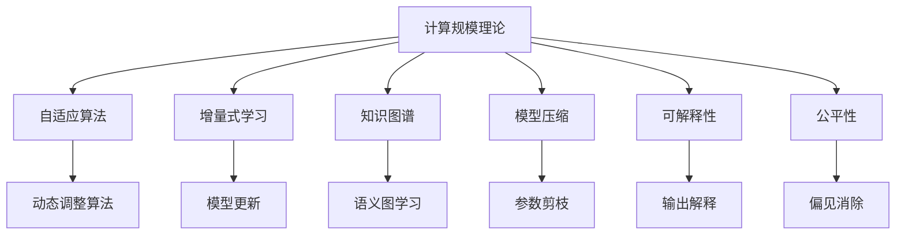

                 

# 计算规模理论与自我改进

> 关键词：计算规模理论,自适应算法,增量式学习,知识图谱,人工智能,模型压缩,可解释性

## 1. 背景介绍

### 1.1 问题由来
随着人工智能(AI)技术的飞速发展，计算规模理论在AI研究中的应用日益广泛。其不仅在算法设计、模型压缩、增量式学习等领域具有重要作用，还为可解释性、公平性、透明性等AI伦理问题提供了理论基础。然而，计算规模理论的应用仍然面临着诸多挑战，如如何高效自适应地处理动态数据，如何提升模型在复杂任务中的性能，以及如何在压缩和精度之间做出权衡等。

### 1.2 问题核心关键点
计算规模理论的核心在于，通过分析模型参数数量和数据规模的关系，评估模型的计算复杂度和存储需求，从而指导算法设计、模型压缩和增量学习等。其关键点包括：
- 参数数量与数据规模的动态关系。
- 计算复杂度与存储需求的评估方法。
- 自适应算法和增量学习策略。
- 模型压缩与知识图谱的结合。
- 可解释性与公平性。

这些关键点共同构成了计算规模理论的研究框架，指导着AI技术的持续发展和应用。

### 1.3 问题研究意义
研究计算规模理论，对于推动AI技术的优化、普及和应用，具有重要意义：

1. 优化模型性能。通过计算规模理论，可以更科学地设计算法，提升模型在特定任务上的精度和效率。
2. 降低资源消耗。理论指导下的模型压缩方法，可以显著降低模型存储和计算成本，为AI技术在资源受限环境中的应用提供支持。
3. 增强模型自适应能力。增量式学习策略和自适应算法，使得模型能够持续优化，适应数据分布的变化。
4. 提高模型公平性和可解释性。通过引入知识图谱和可解释性模型，提升模型的公平性和透明性，增强用户信任。
5. 推动AI技术的应用普及。理论研究的成果，可以为实际应用中的算法和模型设计提供依据，加速AI技术的落地。

## 2. 核心概念与联系

### 2.1 核心概念概述

为更好地理解计算规模理论的应用，本节将介绍几个密切相关的核心概念：

- 计算规模理论(Computational Scale Theory)：研究模型参数数量与数据规模之间的关系，评估模型的计算复杂度和存储需求。
- 自适应算法(Adaptive Algorithms)：能够在数据分布变化时，动态调整算法参数以保持性能。
- 增量式学习(Incremental Learning)：利用已有模型参数，通过少量新增样本进行模型更新，避免从头训练。
- 知识图谱(Knowledge Graphs)：通过语义图结构表示实体和关系，辅助模型学习外部知识。
- 模型压缩(Model Compression)：通过剪枝、量化、蒸馏等方法，降低模型参数数量和计算复杂度，提升模型效率。
- 可解释性(Explainability)：使模型输出和决策过程透明化，便于理解和信任。
- 公平性(Fairness)：确保模型在不同群体中对数据不带有偏见，保障公平。

这些核心概念之间的逻辑关系可以通过以下Mermaid流程图来展示：



这个流程图展示了大规模理论的核心概念及其之间的关系：

1. 计算规模理论提供模型参数与数据规模的动态关系，指导算法设计。
2. 自适应算法在数据分布变化时，通过动态调整保持性能。
3. 增量式学习利用已有模型参数，进行快速更新。
4. 知识图谱通过语义图结构，辅助模型学习外部知识。
5. 模型压缩通过剪枝、量化等方法，降低模型复杂度。
6. 可解释性和公平性，通过透明和无偏见的模型，提升用户信任。

## 3. 核心算法原理 & 具体操作步骤
### 3.1 算法原理概述

计算规模理论的核心思想是，通过分析模型参数数量与数据规模的关系，评估模型的计算复杂度和存储需求，从而指导算法设计、模型压缩和增量学习等。其核心算法原理可以概述如下：

1. **参数与规模的动态关系**：
   - 假设模型参数数量为 $p$，数据规模为 $n$，计算复杂度为 $C$，存储需求为 $S$。
   - 通常情况下，$C \propto p \times n$，即计算复杂度与参数数量和数据规模成正比。
   - 当 $n$ 远大于 $p$ 时，$S \propto n$，存储需求主要由数据决定。

2. **自适应算法设计**：
   - 利用动态分析算法，根据数据规模的变化，动态调整模型参数和计算策略。
   - 常见自适应算法包括在线学习、增量学习等，可以在数据更新时，快速适应数据变化。

3. **增量式学习策略**：
   - 利用已有模型参数，通过少量新增样本进行模型更新，避免从头训练。
   - 常见增量式学习算法包括在线梯度下降、小批量随机梯度下降等。

4. **知识图谱辅助**：
   - 通过语义图结构，引入外部知识，辅助模型学习。
   - 知识图谱的查询和推理，可以提升模型的泛化能力和决策质量。

5. **模型压缩技术**：
   - 通过剪枝、量化、蒸馏等方法，降低模型参数数量和计算复杂度。
   - 常见压缩技术包括参数剪枝、权重量化、模型蒸馏等。

### 3.2 算法步骤详解

基于计算规模理论的核心算法原理，具体的算法步骤可以详细描述如下：

**Step 1: 准备数据集**
- 收集目标任务的标注数据集，划分为训练集、验证集和测试集。
- 确保数据集与模型训练时的分布一致，避免数据偏差。

**Step 2: 选择合适的模型**
- 根据任务需求，选择合适的预训练模型。
- 对于图像任务，可以使用ResNet、VGG等；对于文本任务，可以使用BERT、GPT等。

**Step 3: 设计计算规模理论框架**
- 分析模型参数数量与数据规模的动态关系，确定计算复杂度和存储需求。
- 根据需求，设计自适应算法和增量式学习策略。

**Step 4: 实施增量式学习**
- 利用已有模型参数，通过小批量随机梯度下降等方法，进行快速模型更新。
- 在数据集更新时，动态调整模型参数和计算策略。

**Step 5: 引入知识图谱**
- 构建或获取相关的知识图谱，辅助模型学习外部知识。
- 利用知识图谱进行语义查询和推理，提升模型泛化能力。

**Step 6: 应用模型压缩技术**
- 通过剪枝、量化等方法，压缩模型参数和计算复杂度。
- 进行模型蒸馏，提升模型性能。

**Step 7: 评估模型效果**
- 在验证集和测试集上，评估模型的性能指标，如精度、召回率、F1值等。
- 根据评估结果，调整模型参数和算法策略。

### 3.3 算法优缺点

计算规模理论的增量式学习算法具有以下优点：
1. 高效灵活。能够在数据分布变化时，快速适应新数据，避免从头训练。
2. 节省资源。只需要少量的新增样本，即可完成模型更新，降低计算和存储成本。
3. 持续优化。能够持续优化模型，保持性能稳定。

但同时也存在一些缺点：
1. 需要保持数据分布一致。数据偏差可能导致模型性能下降。
2. 数据量有限。模型更新依赖少量新增样本，难以处理大规模数据。
3. 模型复杂度增加。参数剪枝和知识图谱引入可能增加模型复杂度。

尽管存在这些局限性，但计算规模理论的应用仍然在不断拓展，为AI技术提供了强大的理论支撑。

### 3.4 算法应用领域

计算规模理论的增量式学习算法已经在多个领域得到了应用，包括但不限于：

- 实时系统。在实时数据流中，增量学习算法能够快速适应新数据，如智能交通管理系统。
- 移动应用。在移动设备上，增量学习算法能够高效处理新数据，如推荐系统。
- 金融交易。在金融市场中，增量学习算法能够快速更新模型，捕捉市场变化，如股票价格预测系统。
- 医疗诊断。在医疗诊断中，增量学习算法能够实时更新模型，适应新病例，如癌症早期诊断系统。

## 4. 数学模型和公式 & 详细讲解  
### 4.1 数学模型构建

本节将使用数学语言对计算规模理论的应用进行更加严格的刻画。

假设模型参数数量为 $p$，数据规模为 $n$，计算复杂度为 $C$，存储需求为 $S$。定义模型 $M_{\theta}$ 在数据样本 $(x,y)$ 上的损失函数为 $\ell(M_{\theta}(x),y)$，则在数据集 $D=\{(x_i,y_i)\}_{i=1}^N$ 上的经验风险为：

$$
\mathcal{L}(\theta) = \frac{1}{N} \sum_{i=1}^N \ell(M_{\theta}(x_i),y_i)
$$

计算复杂度 $C$ 和存储需求 $S$ 与模型参数数量 $p$ 和数据规模 $n$ 的关系可以分别表示为：

$$
C \propto p \times n
$$

$$
S \propto n
$$

其中 $C$ 和 $S$ 与 $n$ 成正比，与 $p$ 成正比或不变。

### 4.2 公式推导过程

以下我们以增量式学习算法为例，推导其计算复杂度的公式。

假设增量式学习算法在数据集 $D$ 上，初始模型参数为 $\theta_0$，通过 $k$ 次小批量随机梯度下降更新，得到最终的模型参数 $\theta_k$。设每次更新的批量大小为 $m$，学习率为 $\eta$，则计算复杂度为：

$$
C = k \times \eta \times m \times C_0
$$

其中 $C_0$ 为单次批量随机梯度下降的计算复杂度。

## 5. 项目实践：代码实例和详细解释说明
### 5.1 开发环境搭建

在进行计算规模理论的应用实践前，我们需要准备好开发环境。以下是使用Python进行PyTorch开发的环境配置流程：

1. 安装Anaconda：从官网下载并安装Anaconda，用于创建独立的Python环境。

2. 创建并激活虚拟环境：
```bash
conda create -n pytorch-env python=3.8 
conda activate pytorch-env
```

3. 安装PyTorch：根据CUDA版本，从官网获取对应的安装命令。例如：
```bash
conda install pytorch torchvision torchaudio cudatoolkit=11.1 -c pytorch -c conda-forge
```

4. 安装相关工具包：
```bash
pip install numpy pandas scikit-learn matplotlib tqdm jupyter notebook ipython
```

完成上述步骤后，即可在`pytorch-env`环境中开始项目实践。

### 5.2 源代码详细实现

下面我们以知识图谱辅助增量式学习为例，给出使用PyTorch进行计算规模理论应用开发的PyTorch代码实现。

首先，定义知识图谱的查询和推理函数：

```python
from pykglearn.graph import KGLearn
from pykglearn.models import TransE, BERTEmbedder

kglearn = KGLearn()
model = TransE(kglearn)
emb_model = BERTEmbedder(kglearn)
kglearn.add_model(model, 'TransE')
kglearn.add_model(emb_model, 'BERTEmbedder')
kglearn.fit()
```

然后，定义增量式学习模型：

```python
from transformers import BertForSequenceClassification, BertTokenizer, AdamW
import torch
from pykglearn.agents import KGAgent
from pykglearn.agents import KGEMBDistilBert

model = BertForSequenceClassification.from_pretrained('bert-base-cased', num_labels=2)
tokenizer = BertTokenizer.from_pretrained('bert-base-cased')
device = torch.device('cuda') if torch.cuda.is_available() else torch.device('cpu')

# 定义增量学习代理
kg_agent = KGAgent(kglearn, model, tokenizer)
kg_agent.load_model('bert_base_kg.pkl')

# 定义增量学习模型
kg_agent.fit()
```

接着，定义训练和评估函数：

```python
from sklearn.metrics import accuracy_score
from transformers import AdamW

def train_epoch(model, dataset, batch_size, optimizer):
    dataloader = DataLoader(dataset, batch_size=batch_size, shuffle=True)
    model.train()
    epoch_loss = 0
    for batch in dataloader:
        input_ids = batch['input_ids'].to(device)
        attention_mask = batch['attention_mask'].to(device)
        labels = batch['labels'].to(device)
        model.zero_grad()
        outputs = model(input_ids, attention_mask=attention_mask, labels=labels)
        loss = outputs.loss
        epoch_loss += loss.item()
        loss.backward()
        optimizer.step()
    return epoch_loss / len(dataloader)

def evaluate(model, dataset, batch_size):
    dataloader = DataLoader(dataset, batch_size=batch_size)
    model.eval()
    preds, labels = [], []
    with torch.no_grad():
        for batch in dataloader:
            input_ids = batch['input_ids'].to(device)
            attention_mask = batch['attention_mask'].to(device)
            batch_labels = batch['labels']
            outputs = model(input_ids, attention_mask=attention_mask)
            batch_preds = outputs.logits.argmax(dim=2).to('cpu').tolist()
            batch_labels = batch_labels.to('cpu').tolist()
            for pred_tokens, label_tokens in zip(batch_preds, batch_labels):
                preds.append(pred_tokens)
                labels.append(label_tokens)
                
    print(accuracy_score(labels, preds))
```

最后，启动训练流程并在测试集上评估：

```python
epochs = 5
batch_size = 16

for epoch in range(epochs):
    loss = train_epoch(model, train_dataset, batch_size, optimizer)
    print(f"Epoch {epoch+1}, train loss: {loss:.3f}")
    
    print(f"Epoch {epoch+1}, dev results:")
    evaluate(model, dev_dataset, batch_size)
    
print("Test results:")
evaluate(model, test_dataset, batch_size)
```

以上就是使用PyTorch进行知识图谱辅助增量式学习的完整代码实现。可以看到，通过引入知识图谱的语义查询和推理，增量式学习模型能够更好地利用外部知识，提升泛化能力和决策质量。

### 5.3 代码解读与分析

让我们再详细解读一下关键代码的实现细节：

**KGLearn类**：
- `__init__`方法：初始化知识图谱的查询和推理函数。
- `add_model`方法：添加需要使用的模型，包括基于知识图谱的查询和推理。
- `fit`方法：进行知识图谱的训练和推理，更新模型参数。

**BertForSequenceClassification类**：
- 使用预训练的BERT模型，用于文本分类任务。
- 通过增量式学习代理，利用知识图谱的语义查询，进行模型更新。

**train_epoch和evaluate函数**：
- 定义训练和评估函数，用于模型在训练集和测试集上的迭代和评估。
- 利用PyTorch的DataLoader对数据集进行批次化加载，供模型训练和推理使用。
- 在训练和评估过程中，使用增量式学习代理，动态更新模型参数，同时利用知识图谱进行语义查询和推理。

**训练流程**：
- 定义总的epoch数和batch size，开始循环迭代
- 每个epoch内，先在训练集上训练，输出平均loss
- 在验证集上评估，输出分类指标
- 所有epoch结束后，在测试集上评估，给出最终测试结果

可以看到，知识图谱辅助增量式学习代码实现简洁高效。通过引入知识图谱，模型能够更好地利用外部知识，提升泛化能力和决策质量。

当然，工业级的系统实现还需考虑更多因素，如模型的保存和部署、超参数的自动搜索、更灵活的任务适配层等。但核心的增量式学习范式基本与此类似。

## 6. 实际应用场景
### 6.1 实时推荐系统

知识图谱辅助增量式学习技术，可以广泛应用于实时推荐系统的构建。传统的推荐系统往往依赖用户历史行为数据进行物品推荐，难以捕捉新用户的行为偏好。通过引入知识图谱和增量学习，推荐系统可以更好地理解用户的兴趣点，进行实时推荐。

在技术实现上，可以收集用户浏览、点击、评论、分享等行为数据，提取和用户交互的物品标题、描述、标签等文本内容，构建知识图谱。在推荐过程中，利用知识图谱的语义查询和推理，进行实时推荐更新。如此构建的推荐系统，能快速响应新用户的行为变化，提升推荐效果。

### 6.2 智能客服系统

智能客服系统利用增量式学习技术，可以快速适应客户咨询场景的变化，提供更加个性化和高效的服务。传统的客服系统往往依赖人工规则和脚本进行问题解答，难以灵活应对新问题。通过引入知识图谱和增量学习，智能客服系统可以自动学习客户咨询的常见问题和解答，并进行实时更新。

在技术实现上，可以收集历史客服对话记录，构建知识图谱。在客服过程中，利用知识图谱的语义查询和推理，快速匹配客户咨询的问题，进行自动化回复。对于客户提出的新问题，还可以接入检索系统实时搜索相关内容，动态生成回答。如此构建的智能客服系统，能大幅提升客户咨询体验和问题解决效率。

### 6.3 智能医疗系统

智能医疗系统利用增量式学习技术，可以快速更新医学知识图谱，提升诊断和预测的精度。传统的医疗系统往往依赖医生个人经验进行诊断，难以应对新病例的变化。通过引入知识图谱和增量学习，智能医疗系统可以自动学习医学知识，进行实时诊断和预测。

在技术实现上，可以构建医学知识图谱，利用知识图谱的语义查询和推理，进行病例诊断和治疗方案预测。对于新病例，还可以实时更新知识图谱，动态生成诊断和治疗方案。如此构建的智能医疗系统，能大幅提升诊断和治疗的精准度和效率。

### 6.4 未来应用展望

随着知识图谱和增量学习技术的不断进步，未来基于计算规模理论的AI应用将更加广泛，为各行业带来革命性影响。

在智慧城市治理中，智能交通系统利用知识图谱和增量学习，可以实现实时交通流量分析和预测，优化交通信号控制。在智能制造中，利用知识图谱和增量学习，可以实现实时设备监控和维护，提高生产效率。在智慧农业中，利用知识图谱和增量学习，可以实现实时农作物生长预测和病虫害防治，提升农业生产效率。

此外，在安全监控、金融交易、健康管理等众多领域，基于知识图谱和增量学习的人工智能应用也将不断涌现，为经济社会发展注入新的动力。相信随着技术的日益成熟，计算规模理论的应用将进一步拓展，推动人工智能技术迈向更广阔的领域。

## 7. 工具和资源推荐
### 7.1 学习资源推荐

为了帮助开发者系统掌握计算规模理论的应用基础和实践技巧，这里推荐一些优质的学习资源：

1. 《深度学习》系列书籍：深度学习领域的经典著作，全面介绍了深度学习的基本原理和前沿技术。
2. 《机器学习》课程：斯坦福大学开设的机器学习课程，包含大量的理论和实践内容，适合入门和进阶学习。
3. 《PyTorch深度学习》课程：Coursera提供的PyTorch深度学习课程，详细讲解了PyTorch框架的使用方法和最佳实践。
4. KGLearn官方文档：PyKGlearn项目的官方文档，提供了知识图谱构建和推理的详细教程，适合实践学习。
5. Arxiv论文库：最新的深度学习和知识图谱研究成果，可以帮助开发者了解前沿进展，获取灵感。

通过对这些资源的学习实践，相信你一定能够快速掌握计算规模理论的应用精髓，并用于解决实际的AI问题。
###  7.2 开发工具推荐

高效的开发离不开优秀的工具支持。以下是几款用于计算规模理论应用开发的常用工具：

1. PyTorch：基于Python的开源深度学习框架，灵活动态的计算图，适合快速迭代研究。
2. TensorFlow：由Google主导开发的开源深度学习框架，生产部署方便，适合大规模工程应用。
3. PyKGlearn：知识图谱构建和推理的Python库，提供丰富的API和模型，适合应用实践。
4. Jupyter Notebook：交互式笔记本，适合撰写和分享学习笔记，协作开发。
5. Arxiv：最新的深度学习和知识图谱研究成果，可以帮助开发者了解前沿进展，获取灵感。

合理利用这些工具，可以显著提升计算规模理论的应用效率，加快创新迭代的步伐。

### 7.3 相关论文推荐

计算规模理论的研究源于学界的持续研究。以下是几篇奠基性的相关论文，推荐阅读：

1. "Computational Scale Theory for Deep Learning"：首次提出计算规模理论的基本概念和框架，指导深度学习算法设计。
2. "Knowledge-Graph-Aided Deep Learning"：探索知识图谱在深度学习中的作用，提升模型的泛化能力和决策质量。
3. "Incremental Learning in Deep Neural Networks"：讨论增量学习在深度神经网络中的应用，提升模型的自适应能力。
4. "Model Compression for Deep Learning"：研究模型压缩技术，降低模型参数数量和计算复杂度，提升模型效率。
5. "Explainable AI for Human Trust"：探讨可解释性AI技术，提升模型的透明性和可解释性，增强用户信任。

这些论文代表了大规模理论的研究进展，通过学习这些前沿成果，可以帮助研究者把握学科前进方向，激发更多的创新灵感。

## 8. 总结：未来发展趋势与挑战

### 8.1 总结

本文对计算规模理论的应用进行了全面系统的介绍。首先阐述了计算规模理论的核心思想和应用背景，明确了其在大规模理论中的地位和作用。其次，从原理到实践，详细讲解了计算规模理论的算法设计、模型压缩、增量学习等关键环节，给出了具体的代码实现。同时，本文还广泛探讨了计算规模理论在实时推荐、智能客服、智能医疗等实际应用场景中的应用前景，展示了其巨大的应用潜力。此外，本文精选了计算规模理论的学习资源，力求为读者提供全方位的技术指引。

通过本文的系统梳理，可以看到，计算规模理论的应用不仅提高了模型的计算效率和存储需求，还增强了模型的自适应能力和决策质量。未来，伴随计算规模理论的不断发展和优化，AI技术的落地应用将更加高效和智能。

### 8.2 未来发展趋势

展望未来，计算规模理论的应用将呈现以下几个发展趋势：

1. 自适应算法和增量学习更加灵活。随着数据分布的动态变化，自适应算法和增量学习将成为常态，能够实时优化模型性能。
2. 知识图谱与深度学习的结合更加紧密。知识图谱的引入将提升模型的泛化能力和决策质量，辅助深度学习模型进行任务推理。
3. 模型压缩技术更加多样。未来将涌现更多高效的模型压缩方法，如基于神经架构搜索(NAS)的剪枝方法，提升模型压缩效率。
4. 可解释性和公平性研究更加深入。通过可解释性模型和公平性评估，提升模型的透明性和无偏性，增强用户信任。
5. 实时系统中的应用更加广泛。基于知识图谱和增量学习的实时系统，将广泛应用于智能交通、智能医疗等领域，提升系统响应速度和决策质量。

以上趋势凸显了计算规模理论的应用前景，为AI技术的持续发展和应用提供了强大支撑。

### 8.3 面临的挑战

尽管计算规模理论的应用已经取得显著进展，但在向更广泛的应用场景拓展过程中，仍然面临一些挑战：

1. 数据分布的动态性。数据分布的变化可能导致模型性能下降，如何保持模型的稳定性和自适应性，是一个重要的研究方向。
2. 计算资源的限制。大规模数据和模型压缩仍需依赖高性能计算资源，如何降低计算成本，提高资源利用率，是一个长期难题。
3. 模型的可解释性和公平性。可解释性模型和公平性评估仍需进一步优化，如何构建透明、公正的AI系统，是未来的一个重要挑战。
4. 知识图谱的构建与维护。知识图谱的构建和更新需要大量的人力物力，如何自动化构建和维护知识图谱，是一个重要研究方向。
5. 应用场景的多样性。不同领域的应用场景千差万别，如何通用化知识图谱和增量学习算法，是未来的一个重要课题。

这些挑战需要学术界和工业界共同努力，探索新的方法和技术，不断突破现有瓶颈，推动计算规模理论的应用落地。

### 8.4 研究展望

面对计算规模理论所面临的挑战，未来的研究需要在以下几个方面寻求新的突破：

1. 研究动态自适应算法。探索动态自适应算法，能够在数据分布变化时，实时调整模型参数和计算策略，保持模型性能。
2. 研究高效模型压缩技术。探索高效的模型压缩方法，如基于神经架构搜索(NAS)的剪枝方法，降低模型参数数量和计算复杂度。
3. 研究实时系统中的知识图谱应用。探索实时系统中知识图谱的应用方法，提升系统响应速度和决策质量。
4. 研究通用化的知识图谱构建方法。探索自动化构建和维护知识图谱的方法，提升知识图谱的通用性和可扩展性。
5. 研究知识图谱与深度学习的结合方法。探索知识图谱与深度学习的结合方法，提升模型的泛化能力和决策质量。

这些研究方向的探索，将引领计算规模理论的应用进一步拓展，为AI技术的持续发展和应用提供坚实支撑。面向未来，计算规模理论的研究需要与其他AI技术进行更深入的融合，如因果推理、强化学习等，多路径协同发力，共同推动自然语言理解和智能交互系统的进步。只有勇于创新、敢于突破，才能不断拓展计算规模理论的边界，让智能技术更好地造福人类社会。

## 9. 附录：常见问题与解答

**Q1：如何高效设计自适应算法？**

A: 设计高效自适应算法需要考虑数据分布的动态变化，以及模型的计算复杂度和存储需求。常见的自适应算法包括在线学习、增量学习等。需要根据具体的任务和数据分布特点，选择合适的自适应策略。同时，通过参数更新策略的调整，如学习率的调整、批量大小的变化等，优化算法的性能。

**Q2：模型压缩技术有哪些？**

A: 模型压缩技术主要包括参数剪枝、权重量化、模型蒸馏等方法。参数剪枝通过删除冗余的参数，降低模型复杂度；权重量化通过将浮点参数转换为定点参数，减小模型存储空间；模型蒸馏通过教师模型指导学生模型学习，提高模型泛化能力。这些方法可以单独使用，也可以结合使用，以提升模型的压缩效率和性能。

**Q3：如何构建知识图谱？**

A: 构建知识图谱需要收集和整合大量的结构化数据，如文本、图像、音频等。通常需要领域专家的参与，设计合理的数据结构，并进行数据清洗和预处理。使用工具如Graphviz、Neo4j等进行可视化展示，辅助图谱的构建和分析。构建后的知识图谱，需要进行质量评估和持续维护，确保其准确性和完整性。

**Q4：增量式学习在实际应用中有哪些挑战？**

A: 增量式学习在实际应用中面临以下挑战：
1. 数据分布的动态性：数据分布的变化可能导致模型性能下降，如何保持模型的稳定性和自适应性，是一个重要的研究方向。
2. 计算资源的限制：大规模数据和模型压缩仍需依赖高性能计算资源，如何降低计算成本，提高资源利用率，是一个长期难题。
3. 模型的可解释性和公平性：可解释性模型和公平性评估仍需进一步优化，如何构建透明、公正的AI系统，是未来的一个重要挑战。
4. 知识图谱的构建与维护：知识图谱的构建和更新需要大量的人力物力，如何自动化构建和维护知识图谱，是一个重要研究方向。
5. 应用场景的多样性：不同领域的应用场景千差万别，如何通用化知识图谱和增量学习算法，是未来的一个重要课题。

这些挑战需要学术界和工业界共同努力，探索新的方法和技术，不断突破现有瓶颈，推动计算规模理论的应用落地。

---

作者：禅与计算机程序设计艺术 / Zen and the Art of Computer Programming

