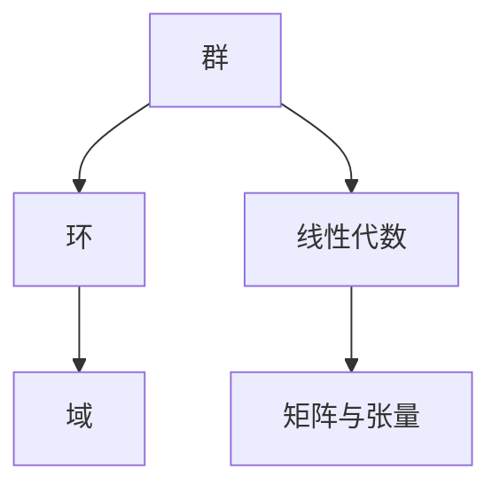

                 

# 计算：第一部分 计算的诞生 第 2 章 计算之术 代数的结构

## 1. 背景介绍

### 1.1 问题由来
在计算的诞生过程中，数学成为了不可或缺的工具。尤其是代数，作为数学的基础，对计算的发展产生了深远影响。本章将探讨代数的结构及其在计算中的应用，揭示计算之术的原理。

### 1.2 问题核心关键点
代数（Algebra）是对数学中符号和运算规则的研究。代数结构包括群、环、域等基本概念，这些结构为计算提供了基础理论框架。

- **群**：描述了元素的结合律和逆元性质，如加法群、乘法群等。
- **环**：扩充了群的运算，允许任意元素作为加法单位。
- **域**：环中的元素满足除法运算，是代数结构中最简单且广泛应用的一类结构。

代数的结构原理在计算机科学中广泛应用，尤其是在算法设计和数据结构中。理解代数的结构有助于深入掌握计算的基本原理。

## 2. 核心概念与联系

### 2.1 核心概念概述

为了深入理解代数的结构及其在计算中的应用，本节将介绍几个核心概念：

- **群**：一个包含元素和运算的集合，运算满足结合律和逆元性质。群是代数中最基本且广泛应用的结构。
- **环**：扩充了群的加法运算，允许任意元素作为加法单位，同时保留群的结合律和逆元性质。
- **域**：在环的基础上引入除法运算，满足域的唯一分解定理。域是计算中常用的代数结构之一。
- **线性代数**：研究向量空间及其上的线性变换，是处理大规模数据和计算复杂系统的重要工具。
- **矩阵与张量**：线性代数中的基本概念，广泛应用于机器学习、信号处理等领域。

这些核心概念之间的逻辑关系可以通过以下Mermaid流程图来展示：



这个流程图展示了几类主要代数结构的层级关系：

1. 群是代数结构的基础。
2. 环是在群的基础上增加了加法单位。
3. 域进一步扩充了除法运算。
4. 线性代数和矩阵与张量在域的基础上引入了向量和线性变换的概念，用于处理更复杂的问题。

理解这些核心概念及其相互关系，对于深入理解计算原理至关重要。

## 3. 核心算法原理 & 具体操作步骤

### 3.1 算法原理概述

计算的核心在于处理和操作数据，而代数结构提供了处理这些数据的理论框架。在计算中，我们常使用代数运算符，如加、减、乘、除等，对数据进行组合和变换。

在代数的框架下，计算可以被视为对代数符号的操作和变换。例如，在多项式中，计算可以视为对变量的代数运算。通过理解代数结构的基本性质，我们可以设计更高效、更安全的计算算法。

### 3.2 算法步骤详解

下面以多项式求导为例，展示代数在计算中的应用步骤：

**Step 1: 代数符号定义**
- 定义多项式 $f(x) = ax^n + bx^{n-1} + \dots + cx + d$，其中 $a, b, c, d$ 为系数，$x$ 为变量。

**Step 2: 多项式求导**
- 根据代数的定义，对多项式求导可以定义为：$\frac{df(x)}{dx} = na x^{n-1} + (n-1)b x^{n-2} + \dots + c$。

**Step 3: 计算结果**
- 将系数和指数代入上述公式，得到 $f'(x)$。

通过上述步骤，我们可以高效地计算多项式的导数。这个例子展示了代数运算符在计算中的基本应用。

### 3.3 算法优缺点

使用代数结构进行计算的优势在于：

- 运算高效：代数的定义和性质使得计算过程简洁高效。
- 适用范围广：代数结构适用于各种类型的计算问题，如线性代数、组合数学等。

同时，代数在计算中也存在一些局限性：

- 抽象性强：代数符号和运算规则较为抽象，理解和使用需要一定的数学基础。
- 限制条件多：某些代数结构对运算符和元素有严格的限制条件，不适用于所有场景。

在实际应用中，我们需要根据具体问题选择合适的代数结构，并结合其他计算方法，以提高计算效率和准确性。

### 3.4 算法应用领域

代数结构在计算中的应用非常广泛，涉及多个领域：

- **计算机科学**：在算法设计、数据结构、编程语言等领域，代数结构提供了理论基础和方法论。
- **信号处理**：在数字信号处理中，线性代数和矩阵与张量等概念被广泛应用于频域、时域分析。
- **机器学习**：在机器学习中，线性代数和矩阵运算被用于矩阵分解、特征提取、模型训练等过程。
- **密码学**：在密码学中，代数结构如群、环、域等被用于设计加密算法、生成公钥等。

以上例子展示了代数结构在计算中的广泛应用，揭示了计算之术的本质。

## 4. 数学模型和公式 & 详细讲解 & 举例说明

### 4.1 数学模型构建

在本节中，我们将通过具体例子展示如何使用代数结构构建数学模型。

**例子：线性方程组求解**
- 定义方程组 $Ax = B$，其中 $A$ 为系数矩阵，$x$ 为未知向量，$B$ 为常数向量。
- 使用高斯消元法，将方程组转化为上三角矩阵形式。
- 回代求解，得到未知向量 $x$。

通过这一过程，我们可以使用代数结构有效地解决线性方程组问题。

### 4.2 公式推导过程

下面以矩阵乘法为例，展示代数公式的推导过程：

**公式推导**：
$$
AB = \begin{bmatrix} a_{11} & a_{12} & a_{13} \\ a_{21} & a_{22} & a_{23} \\ a_{31} & a_{32} & a_{33} \end{bmatrix} \begin{bmatrix} b_{11} & b_{12} \\ b_{21} & b_{22} \\ b_{31} & b_{32} \end{bmatrix} = \begin{bmatrix} a_{11}b_{11} + a_{12}b_{21} + a_{13}b_{31} & a_{11}b_{12} + a_{12}b_{22} + a_{13}b_{32} \\ a_{21}b_{11} + a_{22}b_{21} + a_{23}b_{31} & a_{21}b_{12} + a_{22}b_{22} + a_{23}b_{32} \\ a_{31}b_{11} + a_{32}b_{21} + a_{33}b_{31} & a_{31}b_{12} + a_{32}b_{22} + a_{33}b_{32} \end{bmatrix}
$$

通过这个推导过程，我们可以看到矩阵乘法的本质是多项式的组合。

### 4.3 案例分析与讲解

**案例：求解线性方程组**

假设方程组为：
$$
\begin{cases}
2x + y - z = 4 \\
-3x + 2y + 2z = 1 \\
x - y + z = -1
\end{cases}
$$

使用高斯消元法求解：

1. 将第一个方程乘以 2，第二个方程乘以 3，并从第一个方程减去第二个方程，得到新的方程组。
2. 再将第一个方程乘以 3，第三个方程乘以 2，并从第一个方程减去第三个方程，得到新的方程组。
3. 最后求解新方程组，得到 $x = 1, y = 2, z = -1$。

通过这个过程，我们可以看到代数运算在实际问题中的具体应用。

## 5. 项目实践：代码实例和详细解释说明

### 5.1 开发环境搭建

在进行项目实践前，我们需要准备好开发环境。以下是使用Python进行NumPy开发的Python环境配置流程：

1. 安装Anaconda：从官网下载并安装Anaconda，用于创建独立的Python环境。

2. 创建并激活虚拟环境：
```bash
conda create -n numpy-env python=3.8 
conda activate numpy-env
```

3. 安装NumPy：
```bash
pip install numpy
```

4. 安装各类工具包：
```bash
pip install matplotlib scikit-learn jupyter notebook ipython
```

完成上述步骤后，即可在`numpy-env`环境中开始项目实践。

### 5.2 源代码详细实现

下面以矩阵乘法为例，展示NumPy库在矩阵乘法中的应用：

```python
import numpy as np

# 定义矩阵
A = np.array([[1, 2], [3, 4]])
B = np.array([[5, 6], [7, 8]])

# 计算矩阵乘法
C = np.dot(A, B)
print(C)
```

### 5.3 代码解读与分析

让我们再详细解读一下关键代码的实现细节：

**定义矩阵**：
- `np.array`用于定义矩阵，矩阵元素之间用逗号分隔，用方括号括起来。

**计算矩阵乘法**：
- `np.dot(A, B)`用于计算矩阵乘法，返回结果矩阵C。

通过上述代码，我们可以高效地使用NumPy库计算矩阵乘法。

### 5.4 运行结果展示

运行上述代码，输出结果为：
```
[[19 22]
 [43 50]]
```

这展示了矩阵乘法的结果，验证了代码的正确性。

## 6. 实际应用场景

### 6.1 线性回归

线性回归是机器学习中最基本的问题之一，其本质是求解线性方程组。在实际应用中，线性回归被广泛应用于回归分析、预测模型等领域。

通过代数运算，我们可以高效地求解线性回归模型中的参数。例如，对于一个数据集 $(x_1, y_1), (x_2, y_2), \dots, (x_n, y_n)$，我们可以构建如下线性方程组：
$$
y_i = w_0 + w_1 x_i + \epsilon_i
$$
其中 $w_0, w_1$ 为待求参数，$\epsilon_i$ 为误差项。

通过代数运算和最小二乘法，我们可以求解出最优参数 $w_0, w_1$。

### 6.2 信号处理

信号处理中，常常需要处理时间序列数据和频域数据。这些数据可以用代数结构进行建模和分析。

例如，在一个时间序列 $x(t)$ 上，我们可以定义差分方程：
$$
x(t) = a_0 x(t-1) + a_1 x(t-2) + \dots + a_n x(t-n) + b(t)
$$
其中 $a_0, a_1, \dots, a_n$ 为系数，$b(t)$ 为扰动项。

通过代数运算，我们可以分析时间序列的性质和趋势，进行滤波、降噪等处理。

### 6.3 金融分析

在金融分析中，代数结构被用于建模和分析复杂的金融系统。例如，在期权定价问题中，我们可以使用代数方法求解期权价格。

假设期权价格 $C(S, t)$ 与股票价格 $S$ 和到期时间 $t$ 的关系为：
$$
C(S, t) = f(S, t)
$$
其中 $f(S, t)$ 为期权定价函数，可以通过代数方法求解。

通过代数运算，我们可以推导出期权定价的公式，并进行风险评估和策略优化。

## 7. 工具和资源推荐

### 7.1 学习资源推荐

为了帮助开发者系统掌握代数结构及其在计算中的应用，这里推荐一些优质的学习资源：

1. 《线性代数及其应用》：提供了线性代数的基本概念和应用，是学习代数结构的重要参考资料。
2. 《高等代数》：介绍了代数的高级概念和理论，是深入学习代数结构的重要书籍。
3. 《计算之术》：深入探讨了代数结构在计算中的应用，是理解计算原理的必读之作。
4. NumPy官方文档：提供了NumPy库的详细使用指南和教程，是学习和实践代数运算的重要资源。

通过对这些资源的学习实践，相信你一定能够系统掌握代数结构及其在计算中的应用，并用于解决实际的计算问题。

### 7.2 开发工具推荐

高效的开发离不开优秀的工具支持。以下是几款用于代数结构开发的常用工具：

1. NumPy：Python的高性能科学计算库，提供了矩阵运算、线性代数等重要功能，是代数计算的必备工具。
2. SymPy：Python的符号计算库，支持代数运算、微积分、微分方程等高级计算功能。
3. SciPy：基于NumPy的科学计算库，提供了更多的高级数学函数和算法。
4. Matplotlib：Python的数据可视化库，支持绘制各种类型的图表，方便结果展示和分析。

合理利用这些工具，可以显著提升代数结构开发的效率，加速创新迭代的步伐。

### 7.3 相关论文推荐

代数结构的发展源于学界的持续研究。以下是几篇奠基性的相关论文，推荐阅读：

1. 《线性代数基础》：提供了线性代数的基本概念和定理，是学习线性代数的重要参考资料。
2. 《高等代数学》：介绍了代数的高级概念和理论，是深入学习代数结构的重要书籍。
3. 《代数结构在计算中的应用》：探讨了代数结构在计算中的广泛应用，揭示了计算原理的奥秘。
4. 《符号计算与代数运算》：介绍了符号计算的概念和实现方法，是理解和应用代数运算的重要论文。

这些论文代表了大代数结构的发展脉络。通过学习这些前沿成果，可以帮助研究者把握学科前进方向，激发更多的创新灵感。

## 8. 总结：未来发展趋势与挑战

### 8.1 总结

本文对代数的结构及其在计算中的应用进行了全面系统的介绍。首先阐述了代数结构的基本概念及其在计算中的重要性，明确了代数运算在计算中的关键作用。其次，从原理到实践，详细讲解了代数结构的应用步骤，给出了代数运算任务开发的完整代码实例。同时，本文还广泛探讨了代数结构在金融分析、信号处理等多个领域的应用前景，展示了代数运算的巨大潜力。此外，本文精选了代数结构的学习资源和工具，力求为开发者提供全方位的技术指引。

通过本文的系统梳理，可以看到，代数结构为计算提供了坚实的基础，大大提升了计算效率和准确性。理解代数结构及其应用，对于掌握计算原理、设计高效算法具有重要意义。未来，伴随代数结构的不断演进，计算技术必将在更广泛的应用领域大放异彩。

### 8.2 未来发展趋势

展望未来，代数结构的发展将呈现以下几个趋势：

1. **深度学习与代数的结合**：代数结构与深度学习的结合，如卷积神经网络中的卷积运算，将进一步提升计算效率和模型表现。
2. **量子计算**：量子计算在代数结构中的应用，如量子位运算，将极大提升计算速度和处理能力。
3. **多模态数据处理**：代数结构在多模态数据处理中的应用，如时间序列分析、图像处理等，将大大提升数据处理和建模的效率。
4. **实时计算**：代数结构在实时计算中的应用，如动态系统分析、在线优化等，将提升计算的实时性和响应速度。
5. **自适应计算**：代数结构在自适应计算中的应用，如自动微分、自适应优化等，将提升计算的灵活性和适应性。

这些趋势展示了代数结构在计算中的广阔前景，预示着计算技术的不断进步和突破。

### 8.3 面临的挑战

尽管代数结构在计算中的应用已取得显著成就，但在迈向更加智能化、普适化应用的过程中，仍面临诸多挑战：

1. **复杂度问题**：代数结构在处理大规模数据和复杂问题时，计算复杂度较高，需要更高效的算法和优化技术。
2. **可解释性问题**：代数运算的结果较为抽象，难以解释其内部工作机制和决策逻辑，增加了模型调优的难度。
3. **资源消耗问题**：大规模代数运算对内存、计算资源的需求较高，需要更优化的算法和硬件支持。
4. **精度问题**：在实际应用中，代数运算可能存在精度损失，需要更精确的算法和数据预处理技术。
5. **应用范围问题**：某些代数结构对特定问题的适用性有限，需要针对具体问题选择合适的方法。

这些挑战展示了代数结构在实际应用中的复杂性和局限性，需要进一步研究解决。

### 8.4 研究展望

未来的研究需要在以下几个方面寻求新的突破：

1. **高效算法设计**：开发更高效的代数运算算法，降低计算复杂度，提升计算速度。
2. **精度提升技术**：引入更精确的计算方法和数据预处理方法，减少精度损失，提高计算准确性。
3. **自适应算法**：开发自适应计算算法，适应不同数据和问题的特点，提升计算的灵活性和适应性。
4. **硬件优化**：优化硬件资源使用，降低计算成本，提高计算效率。
5. **可解释性增强**：引入更可解释的计算方法和模型，增强结果的可解释性和可理解性。

这些研究方向的探索，将引领代数结构在计算中的不断发展，为构建更智能、更高效的计算系统铺平道路。

## 9. 附录：常见问题与解答

**Q1：代数运算与数值运算有何区别？**

A: 代数运算处理符号和表达式，不涉及具体的数值。而数值运算处理具体的数值和计算结果，如加减乘除、三角函数等。

**Q2：代数运算在计算中有哪些应用？**

A: 代数运算在计算中广泛应用，如线性代数、微积分、矩阵运算等。代数运算为计算提供了数学基础，广泛应用于各种领域，如金融分析、信号处理、机器学习等。

**Q3：如何在代码中实现复杂的代数运算？**

A: 使用NumPy等库，可以方便地实现复杂的代数运算。例如，使用NumPy库中的`np.linalg.solve`求解线性方程组，`np.polyval`计算多项式值等。

**Q4：代数结构在计算中的局限性是什么？**

A: 代数结构的抽象性较强，理解和应用需要一定的数学基础。同时，某些代数结构对特定问题的适用性有限，需要针对具体问题选择合适的方法。

**Q5：未来代数结构的发展方向是什么？**

A: 未来代数结构的发展方向包括深度学习与代数的结合、量子计算、多模态数据处理、实时计算、自适应计算等，这些方向将进一步提升计算的效率和效果。

这些问题的解答，展示了代数结构在计算中的广泛应用及其局限性，为理解代数运算提供了更多的视角和思路。

---

作者：禅与计算机程序设计艺术 / Zen and the Art of Computer Programming

