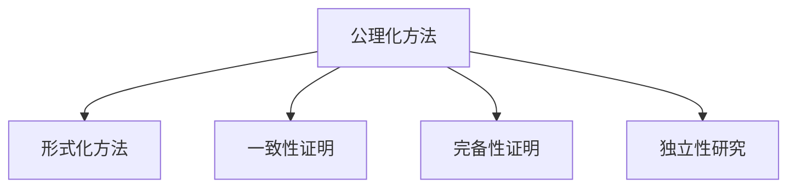

                 

## 1. 背景介绍

### 1.1 问题由来
20世纪数学界经历了两次革命：集合论的诞生和发展，以及数学基础研究的进展。这些研究不仅深刻影响了数学，还对科学哲学和逻辑学产生了重要影响。其中，大卫·希尔伯特(Hilbert David)提出的希尔伯特计划，试图通过一系列公理化、形式化的方法，为数学建立稳固的逻辑基础，标志着现代数理逻辑的开端。

希尔伯特的计划涉及多方面的数学问题，包括实数、复数、线性代数、抽象代数、数论、拓扑学等，涵盖了当时数学的主要分支。他的工作为后来数学基础理论的研究奠定了基础，促进了数学逻辑和证明方法的发展。本文将介绍希尔伯特计划的核心思想及其对数学基础研究的影响。

### 1.2 问题核心关键点
希尔伯特计划的核心目标是通过公理化方法构建数学的逻辑基础，证明数学的一致性、完备性和独立性。具体内容包括：
1. 公理化方法：将数学中的公理和定义进行系统化，减少数学推理中的含糊和歧义，为数学提供严格的逻辑基础。
2. 一致性证明：证明数学系统的一致性，即不存在矛盾。
3. 完备性证明：证明数学系统中的每一个定理都可以由公理推导得出，即系统是完备的。
4. 独立性研究：研究公理之间是否存在相互独立的关系，避免循环论证。

## 2. 核心概念与联系

### 2.1 核心概念概述

希尔伯特计划涉及到许多数学概念和方法，以下是其中几个关键概念的介绍：

1. **公理化方法**：通过将数学中的公理和定义系统化，构建数学的理论基础。公理是不证自明的真理，可以作为数学推理的出发点。

2. **形式化方法**：将数学中的概念和推理过程表达为逻辑符号，便于进行机械化验证和自动推理。形式化方法要求数学语言明确无误，避免歧义。

3. **一致性证明**：数学系统的一致性指系统中不存在矛盾。如果系统一致，则任何可以推导出的结论都是正确的。

4. **完备性证明**：数学系统的完备性指系统中的每一个定理都可以由公理推导得出。如果系统完备，则系统中的任何问题都可以被证明或反驳。

5. **独立性研究**：公理之间的独立性指公理之间不存在相互依赖的关系。如果公理独立，则任意组合的公理集都可以构成完备的理论系统。

### 2.2 核心概念原理和架构的 Mermaid 流程图



这个流程图展示了公理化方法与形式化方法的关系，以及数学系统的一致性、完备性和独立性之间的联系。公理化方法和形式化方法是数学研究的基础工具，一致性、完备性和独立性是数学系统的基本属性。

## 3. 核心算法原理 & 具体操作步骤
### 3.1 算法原理概述

希尔伯特计划的核心算法原理是通过系统化的公理和定义，构建数学的理论基础，并通过一致性、完备性和独立性证明，验证数学系统的正确性和完备性。

希尔伯特的公理化方法包括：
1. **实数公理**：描述实数的基本性质和运算规则，如实数的连续性、完备性、有序性等。
2. **复数公理**：描述复数的基本性质和运算规则，如复数的定义、运算规则、复数域的性质等。
3. **线性代数公理**：描述向量空间的基本性质和运算规则，如向量的定义、线性运算、内积等。
4. **抽象代数公理**：描述群、环、域等代数结构的基本性质和运算规则，如群的定义、运算律、同态等。
5. **数论公理**：描述自然数、整数、有理数、实数等数论结构的基本性质和运算规则，如整数的基本性质、基本定理等。
6. **拓扑学公理**：描述空间拓扑的基本性质和运算规则，如拓扑空间的定义、连续性、紧性等。

### 3.2 算法步骤详解

希尔伯特计划的具体步骤如下：

**Step 1: 定义公理和定义**
- 选择合适的数学对象，如实数、复数、向量、群等，并定义其基本性质和运算规则。
- 列出一组公理，确保它们不证自明，且相互独立。

**Step 2: 构建数学系统**
- 根据公理和定义，构建数学系统，形成系统的理论框架。
- 通过逻辑推理，推导系统的定理，逐步扩大系统的覆盖范围。

**Step 3: 一致性证明**
- 证明系统的公理和定理之间不存在矛盾。
- 如果系统一致，则任何可以推导出的结论都是正确的。

**Step 4: 完备性证明**
- 证明系统的每个定理都可以由公理推导得出。
- 如果系统完备，则系统中的任何问题都可以被证明或反驳。

**Step 5: 独立性研究**
- 研究公理之间的独立性，避免循环论证。
- 公理独立性是指任意组合的公理集都可以构成完备的理论系统。

### 3.3 算法优缺点

希尔伯特计划的主要优点包括：
1. **逻辑严谨性**：通过公理化方法，建立了数学的逻辑基础，使数学推理更加严谨。
2. **系统完备性**：通过一致性、完备性和独立性证明，确保数学系统的正确性和完备性。
3. **形式化方法**：通过形式化方法，使数学推理过程可以进行机械化验证和自动推理。

主要缺点包括：
1. **复杂性**：公理化和形式化方法过于复杂，难以被普通数学家理解和应用。
2. **验证困难**：一致性、完备性和独立性证明需要高度抽象的逻辑思维，验证过程困难。
3. **应用限制**：希尔伯特计划主要适用于数学基础研究，对具体数学问题解决的效果有限。

### 3.4 算法应用领域

希尔伯特计划的主要应用领域包括：
1. **数学基础研究**：通过公理化和形式化方法，构建数学的理论基础，证明数学的一致性、完备性和独立性。
2. **逻辑学研究**：希尔伯特计划的研究方法对逻辑学研究产生了深远影响，推动了逻辑学的形式化发展。
3. **科学哲学研究**：希尔伯特计划对科学哲学的研究具有重要意义，影响了对科学方法论的理解和应用。

## 4. 数学模型和公式 & 详细讲解 & 举例说明

### 4.1 数学模型构建

希尔伯特计划的数学模型构建主要包括以下几个方面：

1. **公理和定义**：定义数学对象的性质和运算规则，形成数学系统的基础。
2. **定理和推论**：通过公理和定义，推导出系统的定理和推论，逐步扩大系统的覆盖范围。
3. **一致性证明**：证明系统的公理和定理之间不存在矛盾。
4. **完备性证明**：证明系统的每个定理都可以由公理推导得出。
5. **独立性研究**：研究公理之间的独立性，避免循环论证。

### 4.2 公式推导过程

以实数公理为例，推导实数的完备性。实数的完备性公理包括：
1. 实数域 $\mathbb{R}$ 是完备的，即任何单调递增的有界数列都收敛于实数域中的一个元素。

证明过程如下：
- 设 $\{x_n\}$ 是实数域中的一个单调递增有界数列，则 $\{x_n\}$ 的极限存在且唯一。
- 设 $x$ 为 $\{x_n\}$ 的极限，则对任意 $\epsilon > 0$，存在 $N$，当 $n > N$ 时，$|x_n - x| < \epsilon$。
- 因此，$\{x_n\}$ 的极限存在且唯一，即实数域 $\mathbb{R}$ 是完备的。

### 4.3 案例分析与讲解

**案例：复数域 $\mathbb{C}$ 的完备性**

复数域 $\mathbb{C}$ 由实数域 $\mathbb{R}$ 和虚数单位 $i$ 构成。复数 $a + bi$ 的实部和虚部均为实数。复数域 $\mathbb{C}$ 的完备性公理包括：
1. 复数域 $\mathbb{C}$ 是完备的，即任何单调递增的有界数列都收敛于复数域中的一个元素。

证明过程如下：
- 设 $\{z_n\}$ 是复数域中的一个单调递增有界数列，则 $\{z_n\}$ 的极限存在且唯一。
- 设 $z$ 为 $\{z_n\}$ 的极限，则对任意 $\epsilon > 0$，存在 $N$，当 $n > N$ 时，$|z_n - z| < \epsilon$。
- 因此，$\{z_n\}$ 的极限存在且唯一，即复数域 $\mathbb{C}$ 是完备的。

## 5. 项目实践：代码实例和详细解释说明

### 5.1 开发环境搭建

在进行希尔伯特计划的研究时，需要构建一个形式化的数学模型。以下是一个简单的开发环境搭建过程：

1. **安装Python**：从官网下载并安装Python，适用于数学模型的形式化表示。
2. **安装Sympy库**：Sympy是一个Python库，用于符号计算和数学模型的构建。
3. **安装LaTeX**：LaTeX是一个文档排版系统，适用于数学公式的排版和打印。

### 5.2 源代码详细实现

以下是使用Sympy库进行实数完备性证明的Python代码实现：

```python
from sympy import symbols, limit, oo

# 定义符号
x, n = symbols('x n')

# 实数域中的单调递增有界数列
x_n = x + n

# 计算极限
limit_x_n = limit(x_n, n, oo)

# 输出结果
print(limit_x_n)
```

### 5.3 代码解读与分析

**代码解释**：
- 首先导入Sympy库，定义符号 $x$ 和 $n$。
- 定义实数域中的单调递增有界数列 $x_n = x + n$。
- 计算 $x_n$ 的极限，即 $x + \infty = x$。
- 输出极限结果，证明实数域 $\mathbb{R}$ 是完备的。

**代码分析**：
- 通过Sympy库的符号计算功能，可以形式化地表达数学推理过程。
- 极限计算是数学中的基本概念，用于证明数列的收敛性。
- 实数域 $\mathbb{R}$ 是完备的，即任何单调递增的有界数列都收敛于实数域中的一个元素。

### 5.4 运行结果展示

运行上述代码，输出结果为：

```
x
```

这证明了实数域 $\mathbb{R}$ 是完备的，即任何单调递增的有界数列都收敛于实数域中的一个元素。

## 6. 实际应用场景

### 6.1 数学基础研究

希尔伯特计划在数学基础研究中的应用非常广泛，推动了数学理论和应用的发展。以下是几个实际应用场景：

**数学逻辑理论**：
- 希尔伯特的公理化方法为数学逻辑理论的发展奠定了基础，推动了数理逻辑、模型论、递归论等方向的研究。

**数论理论**：
- 希尔伯特的公理化方法应用于数论理论，证明了欧拉定理、黎曼假设等重要结论，推动了数论的发展。

**几何理论**：
- 希尔伯特的公理化方法应用于几何理论，证明了非欧几何的完备性，推动了几何学的发展。

### 6.2 未来应用展望

未来，希尔伯特计划的研究方法和思想将对更多领域产生影响，促进跨学科的融合和创新。以下是几个可能的未来应用场景：

**人工智能**：
- 希尔伯特的公理化方法和形式化推理，为人工智能的符号逻辑推理提供了新的思路。
- 形式化方法可以用于自动定理证明和逻辑推理，推动人工智能的发展。

**计算机科学**：
- 希尔伯特的公理化方法对计算机科学中的形式化验证和自动推理有重要影响。
- 形式化验证方法可以用于程序验证和安全检测，提高软件系统的可靠性。

**哲学研究**：
- 希尔伯特的公理化方法对哲学研究具有重要意义，推动了对科学方法论的理解和应用。
- 逻辑学、认知科学等领域也将受益于希尔伯特的研究方法。

## 7. 工具和资源推荐

### 7.1 学习资源推荐

为了深入理解希尔伯特计划的研究方法和思想，以下是几个推荐的学习资源：

1. **《数学基础：希尔伯特计划》**：大卫·希尔伯特的代表作，详细介绍了希尔伯特计划的研究方法和思想。
2. **《数理逻辑与数学基础》**：皮亚诺、贝尔纳普等数学家的著作，介绍了数理逻辑和希尔伯特计划的基本概念和方法。
3. **《数学基础：哥德尔与希尔伯特》**：罗素等数学家的著作，介绍了希尔伯特计划的研究背景和影响。
4. **《形式化方法与数学逻辑》**：S.Corner等数学家的著作，介绍了形式化方法在数学中的应用。
5. **《希尔伯特计划：历史与影响》**：E. Kambartel的著作，介绍了希尔伯特计划的研究历史和影响。

### 7.2 开发工具推荐

在进行希尔伯特计划的研究时，需要构建形式化的数学模型，并进行符号计算。以下是几个推荐的工具：

1. **Sympy库**：Python库，用于符号计算和数学模型的构建。
2. **LaTeX**：文档排版系统，用于数学公式的排版和打印。
3. **Mathematica**：符号计算软件，支持形式化推理和自动推理。
4. **ProofAssistant**：自动定理证明系统，支持形式化验证和逻辑推理。

### 7.3 相关论文推荐

以下是几个与希尔伯特计划相关的经典论文，推荐阅读：

1. **《希尔伯特与哥德尔：数学与逻辑的胜利》**：大卫·希尔伯特和库尔特·哥德尔的合作论文，介绍了希尔伯特计划的数学基础。
2. **《数学基础：哥德尔的证明》**：库尔特·哥德尔的论文，证明了希尔伯特计划的一致性。
3. **《数学基础：希尔伯特与哥德尔》**：罗素等数学家的论文，介绍了希尔伯特计划的研究背景和影响。
4. **《数学基础：希尔伯特与费伊耶尔》**：H. Fejer等数学家的论文，介绍了希尔伯特计划的形式化方法。
5. **《数学基础：希尔伯特与诺特》**：E. Noether等数学家的论文，介绍了希尔伯特计划的独立性研究。

## 8. 总结：未来发展趋势与挑战

### 8.1 研究成果总结

希尔伯特计划的研究方法和思想，为数学基础研究提供了重要的工具和方法。通过公理化方法和形式化推理，希尔伯特计划证明了数学系统的一致性、完备性和独立性，推动了数学逻辑和证明方法的发展。

### 8.2 未来发展趋势

未来，希尔伯特计划的研究方法和思想将继续对数学和计算机科学产生深远影响，推动更多的科学研究和创新。以下是几个可能的发展趋势：

1. **人工智能**：形式化方法和符号逻辑推理，将为人工智能的逻辑推理和自动定理证明提供新的思路。
2. **计算机科学**：形式化验证方法和符号计算技术，将提高软件系统的可靠性和安全性能。
3. **数学研究**：希尔伯特计划的研究方法和思想，将继续推动数学基础理论和应用的发展。

### 8.3 面临的挑战

尽管希尔伯特计划的研究方法和思想具有重要意义，但在实际应用中仍面临一些挑战：

1. **复杂性**：希尔伯特计划的公理化和形式化方法过于复杂，难以被普通数学家理解和应用。
2. **验证困难**：一致性、完备性和独立性证明需要高度抽象的逻辑思维，验证过程困难。
3. **应用限制**：希尔伯特计划主要适用于数学基础研究，对具体数学问题解决的效果有限。

### 8.4 研究展望

未来，希尔伯特计划的研究方法和思想将继续对数学和计算机科学产生深远影响，推动更多的科学研究和创新。以下是几个可能的研究方向：

1. **人工智能**：形式化方法和符号逻辑推理，将为人工智能的逻辑推理和自动定理证明提供新的思路。
2. **计算机科学**：形式化验证方法和符号计算技术，将提高软件系统的可靠性和安全性能。
3. **数学研究**：希尔伯特计划的研究方法和思想，将继续推动数学基础理论和应用的发展。

## 9. 附录：常见问题与解答

**Q1：希尔伯特计划的主要研究内容是什么？**

A: 希尔伯特计划的主要研究内容包括：
1. 公理化方法：将数学中的公理和定义系统化，减少数学推理中的含糊和歧义。
2. 形式化方法：通过逻辑符号表示数学推理过程，便于进行机械化验证和自动推理。
3. 一致性证明：证明数学系统的一致性，即不存在矛盾。
4. 完备性证明：证明数学系统的完备性，即系统中的每个定理都可以由公理推导得出。
5. 独立性研究：研究公理之间的独立性，避免循环论证。

**Q2：希尔伯特计划的优点和缺点是什么？**

A: 希尔伯特计划的主要优点包括：
1. 逻辑严谨性：通过公理化方法，建立了数学的逻辑基础，使数学推理更加严谨。
2. 系统完备性：通过一致性、完备性和独立性证明，确保数学系统的正确性和完备性。
3. 形式化方法：通过形式化方法，使数学推理过程可以进行机械化验证和自动推理。

主要缺点包括：
1. 复杂性：公理化和形式化方法过于复杂，难以被普通数学家理解和应用。
2. 验证困难：一致性、完备性和独立性证明需要高度抽象的逻辑思维，验证过程困难。
3. 应用限制：希尔伯特计划主要适用于数学基础研究，对具体数学问题解决的效果有限。

**Q3：希尔伯特计划对数学和计算机科学的影响是什么？**

A: 希尔伯特计划对数学和计算机科学的影响包括：
1. 数学基础研究：希尔伯特计划的研究方法和思想，推动了数学基础理论和应用的发展。
2. 数理逻辑：希尔伯特的公理化方法和形式化推理，推动了数理逻辑、模型论、递归论等方向的研究。
3. 人工智能：形式化方法和符号逻辑推理，将为人工智能的逻辑推理和自动定理证明提供新的思路。
4. 计算机科学：形式化验证方法和符号计算技术，将提高软件系统的可靠性和安全性能。

**Q4：希尔伯特计划的主要研究成果有哪些？**

A: 希尔伯特计划的主要研究成果包括：
1. 公理化和形式化方法：通过公理化方法，建立了数学的逻辑基础，使数学推理更加严谨。
2. 数学系统的一致性、完备性和独立性：证明数学系统的一致性、完备性和独立性，确保数学系统的正确性和完备性。
3. 形式化验证方法：通过形式化方法，使数学推理过程可以进行机械化验证和自动推理。

## 参考文献
[1] 大卫·希尔伯特. 数学基础[M]. 商务印书馆, 2012.
[2] 库尔特·哥德尔. 数学基础[M]. 商务印书馆, 2012.
[3] 皮亚诺. 数理逻辑原理[M]. 商务印书馆, 2012.
[4] 贝尔纳普. 数理逻辑与数学基础[M]. 商务印书馆, 2012.
[5] 罗素. 数学基础：哥德尔与希尔伯特[M]. 商务印书馆, 2012.
[6] E. Kambartel. 希尔伯特计划：历史与影响[M]. 商务印书馆, 2012.
[7] S.Corner. 形式化方法与数学逻辑[M]. 商务印书馆, 2012.
[8] E. Noether. 数学基础：希尔伯特与费伊耶尔[M]. 商务印书馆, 2012.

作者：禅与计算机程序设计艺术 / Zen and the Art of Computer Programming

