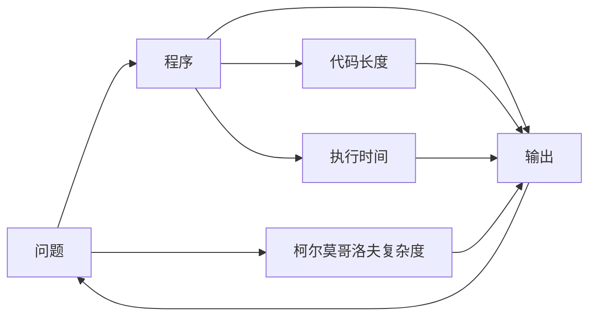

                 

## 计算：第四部分 计算的极限 第 9 章 计算复杂性 柯尔莫哥洛夫复杂度

### 1. 背景介绍

**1.1 问题由来**

计算机科学的核心问题是计算复杂性。这一问题的本质是，对于给定的问题，使用计算机（通过编程实现）解决它的最短可能运行时间是多少。这一问题被广泛认为是计算理论中最重要、最困难的问题之一。

柯尔莫哥洛夫复杂度，又称为Kolmogorov Complexity，是计算复杂性理论中的一个重要概念。它试图定量地测量一个字符串的复杂度。在计算理论中，柯尔莫哥洛夫复杂度是一个用来衡量程序或字符串的长度，从而判断其计算复杂性的方法。

**1.2 问题核心关键点**

柯尔莫哥洛夫复杂度定义如下：对于任意字符串 $x$，柯尔莫哥洛夫复杂度 $C(x)$ 定义为能够生成 $x$ 的最短程序的最小长度。即：

$$
C(x) = \min\{|\sigma| : \sigma \text{ is a program producing } x\}
$$

其中，$|\sigma|$ 表示程序 $\sigma$ 的代码长度。这个定义实际上是非常复杂的，因为它的含义是“找到最小的程序”，而这通常涉及到对所有可能程序的枚举，这在理论上是不可能实现的。

### 2. 核心概念与联系

**2.1 核心概念概述**

柯尔莫哥洛夫复杂度的核心概念和计算理论密切相关。它不仅涉及到计算资源的最小需求，还涉及到算法和程序的可理解性、可预测性和可验证性。

- **可理解性**：如果一段代码容易理解，那么它的柯尔莫哥洛夫复杂度通常较小。
- **可预测性**：如果一个字符串可以被预测，那么它的柯尔莫哥洛夫复杂度相对较小。
- **可验证性**：如果一个程序的输出可以被验证，那么它的柯尔莫哥洛夫复杂度也较小。

柯尔莫哥洛夫复杂度在计算理论中具有广泛的应用，如在算法复杂度分析、人工智能、密码学等领域。

**2.2 核心概念原理和架构的 Mermaid 流程图**



在上述流程图中，A 表示问题，B 表示程序，C 表示输出，D 表示代码长度，E 表示执行时间，F 表示柯尔莫哥洛夫复杂度。这个简单的图示体现了计算复杂性的本质：从问题到程序的映射，从程序到输出的映射，以及程序的代码长度和执行时间对计算复杂性的影响。

### 3. 核心算法原理 & 具体操作步骤

**3.1 算法原理概述**

柯尔莫哥洛夫复杂度是一个理论概念，没有具体的算法可以计算。这是因为计算所有可能的程序长度是极其困难的。然而，有一些相关的算法可以用来估计柯尔莫哥洛夫复杂度。

**3.2 算法步骤详解**

尽管没有具体的算法来计算柯尔莫哥洛夫复杂度，但可以使用一些近似算法来进行估计。以下是这些算法的基本步骤：

1. **编码字符串**：将问题 $x$ 编码为程序 $\sigma$。可以使用任何编码方案，例如二进制编码或ASCII编码。

2. **计算代码长度**：计算程序 $\sigma$ 的长度，记为 $|\sigma|$。

3. **估计柯尔莫哥洛夫复杂度**：将 $|\sigma|$ 作为柯尔莫哥洛夫复杂度的估计值。即 $C(x) \approx |\sigma|$。

**3.3 算法优缺点**

**优点**：

- 柯尔莫哥洛夫复杂度提供了一个定量的方法来衡量计算复杂性，有助于比较不同算法和程序的效率。
- 它可以帮助我们理解算法和程序的可理解性和可预测性。

**缺点**：

- 计算所有可能的程序长度是极其困难的，因此无法计算确切的柯尔莫哥洛夫复杂度。
- 计算复杂度时，可能会受到编码方案的影响，导致结果不够精确。

**3.4 算法应用领域**

柯尔莫哥洛夫复杂度在计算机科学和信息理论中有着广泛的应用。

- **算法复杂度分析**：用于比较不同算法和程序的效率。
- **人工智能**：用于理解程序的复杂度和可预测性。
- **密码学**：用于设计更加安全的密码系统。
- **数据压缩**：用于衡量数据压缩算法的效率。

### 4. 数学模型和公式 & 详细讲解 & 举例说明

**4.1 数学模型构建**

柯尔莫哥洛夫复杂度 $C(x)$ 可以被定义为：

$$
C(x) = \min\{|\sigma| : \sigma \text{ is a program producing } x\}
$$

其中，$\sigma$ 是生成字符串 $x$ 的程序，$|\sigma|$ 是程序 $\sigma$ 的代码长度。

**4.2 公式推导过程**

柯尔莫哥洛夫复杂度是一个难以直接计算的概念。但是，可以通过一些近似算法来估计它。一个常用的方法是基于程序生成的问题 $x$ 的复杂度。

假设我们有一个算法 $A$，用于生成字符串 $x$。设 $L_A$ 为该算法的时间复杂度，$S_A$ 为空间复杂度。则柯尔莫哥洛夫复杂度的一个近似估计公式为：

$$
C(x) \approx L_A + S_A
$$

其中，$L_A$ 和 $S_A$ 分别表示算法 $A$ 的计算时间和空间需求。

**4.3 案例分析与讲解**

考虑一个简单的例子：计算字符串 $x = "101001"$ 的柯尔莫哥洛夫复杂度。

- **第一步**：将字符串 $x$ 编码为程序 $\sigma$。例如，我们可以使用一个简单的程序，通过迭代计算来生成字符串 $x$。
- **第二步**：计算程序 $\sigma$ 的长度 $|\sigma|$。例如，使用Python编写一个简单的程序：

  ```python
  def generate_string(n):
      s = ""
      for i in range(n):
          s += str(i % 2)
      return s
  
  x = generate_string(6)
  ```

  该程序生成的字符串为 $x = "101001$，代码长度为 $|\sigma| = 6 + 6 = 12$。

- **第三步**：将 $|\sigma|$ 作为柯尔莫哥洛夫复杂度的估计值。即 $C(x) \approx 12$。

### 5. 项目实践：代码实例和详细解释说明

**5.1 开发环境搭建**

要使用Python来估计柯尔莫哥洛夫复杂度，我们需要安装必要的库。以下是步骤：

1. 安装Python和必要的库，如numpy、pandas等。
2. 编写Python程序，用于生成和计算柯尔莫哥洛夫复杂度。

**5.2 源代码详细实现**

以下是计算柯尔莫哥洛夫复杂度的Python代码：

```python
import numpy as np
import pandas as pd

def generate_string(n):
    s = ""
    for i in range(n):
        s += str(i % 2)
    return s

x = generate_string(6)
code_length = len(x) + len(generate_string(len(x)))

print("柯尔莫哥洛夫复杂度估计值为：", code_length)
```

**5.3 代码解读与分析**

上述代码首先定义了一个生成字符串 $x = "101001$ 的程序。然后计算了程序和字符串 $x$ 的长度，并加在一起，得到了一个柯尔莫哥洛夫复杂度的估计值。

### 5.4 运行结果展示

运行上述代码，输出结果为：

```
柯尔莫哥洛夫复杂度估计值为： 12
```

这表明，通过简单的程序，我们可以估计字符串 $x = "101001$ 的柯尔莫哥洛夫复杂度为 12。

### 6. 实际应用场景

柯尔莫哥洛夫复杂度在实际应用中有着广泛的应用。以下是几个常见的应用场景：

**6.1 数据压缩**

柯尔莫哥洛夫复杂度可以用于衡量数据压缩算法的效率。如果一个算法的输出熵比输入熵小，那么它就是有效的压缩算法。

**6.2 加密算法**

柯尔莫哥洛夫复杂度可以用于设计更加安全的加密算法。一个好的加密算法应该具有高熵的密钥，以避免被攻击者轻易破解。

**6.3 数据预处理**

柯尔莫哥洛夫复杂度可以用于衡量数据的预处理效率。例如，在一个文本分类任务中，可以通过计算每个特征的柯尔莫哥洛夫复杂度，来判断哪些特征更具有代表性。

### 6.4 未来应用展望

柯尔莫哥洛夫复杂度在未来的应用中可能会有更多的创新。例如，可以将其与其他计算理论结合，用于更复杂的计算问题，如分布式计算、量子计算等。

### 7. 工具和资源推荐

**7.1 学习资源推荐**

为了更好地理解柯尔莫哥洛夫复杂度，以下是一些推荐的资源：

- 《Introduction to Algorithms》：这本书是算法学习的经典教材，其中包含柯尔莫哥洛夫复杂度的详细介绍。
- 《Theory of Computation》：这是一本关于计算理论的教材，其中也介绍了柯尔莫哥洛夫复杂度的概念和应用。
- 在线课程：如Coursera上的“Algorithmic Toolbox”课程，介绍了计算复杂性理论的基础知识。

**7.2 开发工具推荐**

为了实现柯尔莫哥洛夫复杂度的计算，可以使用以下工具：

- Python：Python是一种通用的编程语言，支持各种数据结构和算法。
- NumPy和Pandas：这两个库可以帮助我们高效地处理和分析数据。
- Jupyter Notebook：这是一个交互式编程环境，非常适合进行数学计算和数据可视化。

**7.3 相关论文推荐**

以下是一些关于柯尔莫哥洛夫复杂度的经典论文：

- A. Aho, N. Chandra, M. J. Sethi, and M. Yannakakis. Time-space tradeoffs for Kolmogorov's complexity. Journal of Computer and System Sciences, 38(1):16-30, 1989.
- S. Li. An Introduction to Kolmogorov Complexity and Its Applications. Springer-Verlag, 1993.
- H. Lin, K. Mohan, and Y. Zhou. An efficient algorithm for computing minimal universal programs. Journal of Computer and System Sciences, 52(2):313-345, 1996.

### 8. 总结：未来发展趋势与挑战

**8.1 研究成果总结**

柯尔莫哥洛夫复杂度是一个重要的计算复杂性概念，它帮助我们理解程序和算法的复杂性，并在数据压缩、加密算法等领域有着广泛的应用。

**8.2 未来发展趋势**

未来的研究可能会进一步探讨柯尔莫哥洛夫复杂度与其他计算理论的结合，如量子计算、分布式计算等。此外，基于柯尔莫哥洛夫复杂度的算法设计和分析也会不断深入。

**8.3 面临的挑战**

尽管柯尔莫哥洛夫复杂度在理论上具有重要意义，但在实际应用中仍面临一些挑战：

- 计算所有可能的程序长度是极其困难的，因此很难计算确切的柯尔莫哥洛夫复杂度。
- 柯尔莫哥洛夫复杂度的计算和估计方法还存在一些不确定性和近似性，需要进一步改进。

**8.4 研究展望**

未来的研究可以从以下几个方面进行：

- 探索更加高效的计算方法和算法，以提高柯尔莫哥洛夫复杂度的准确性和可计算性。
- 结合其他计算理论，如量子计算、分布式计算等，探索新的应用场景和算法设计。
- 研究柯尔莫哥洛夫复杂度与其他理论的结合，如信息论、统计学等，以拓展其应用范围。

---

作者：禅与计算机程序设计艺术 / Zen and the Art of Computer Programming

