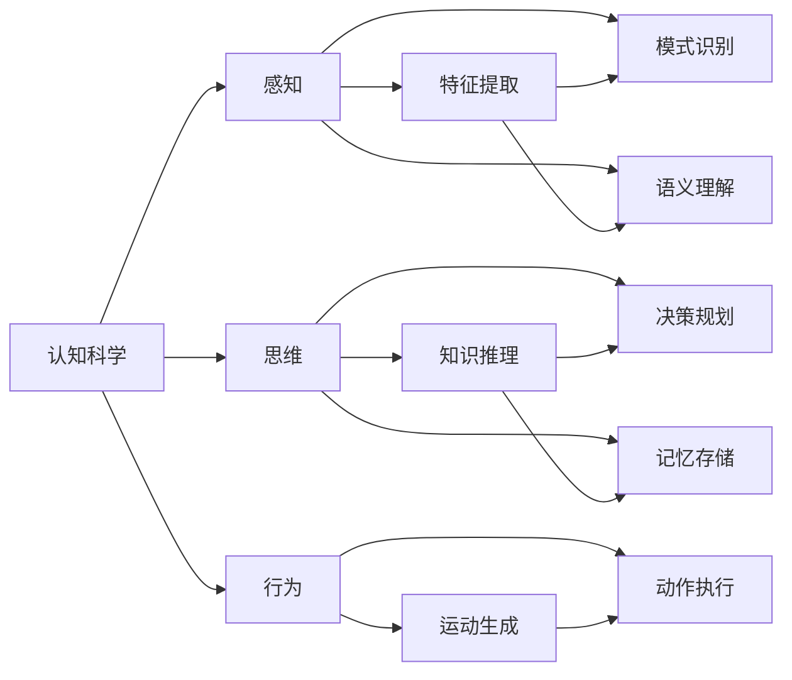

                 

## 1. 背景介绍

在人工智能的快速发展中，认知科学与人机交互的交叉研究日益受到重视。认知科学关注如何使机器具备类人的认知能力，而人机交互则关注如何让机器更好地理解人类需求并做出反应。将认知的形式化处理应用于人机交互设计，可以更好地理解人脑处理信息的方式，并设计更高效、自然的人机交互体验。本文将深入探讨认知的形式化处理及其在人机交互设计中的应用。

## 2. 核心概念与联系

### 2.1 核心概念概述

**认知科学**：研究人类、动物和其他生物的认知过程，包括知觉、学习、记忆、思维和决策。其目标是理解认知活动的内在机制，并构建可以模仿或超越人类智能的认知系统。

**人机交互**：研究如何使计算机系统理解并响应用户输入，以及如何设计友好的用户界面。目标是提升用户体验，提高系统的易用性和可用性。

**认知的形式化处理**：将认知过程建模为数学模型或计算模型，通过计算机算法模拟人脑处理信息的方式。其目的是构建可以模拟人类认知过程的计算模型，使计算机具备更高的智能水平。

### 2.2 核心概念原理和架构的 Mermaid 流程图



此图表展示了认知活动的一般流程，其中感知、思维和行为三个阶段相互关联。感知阶段通过感官获取外界信息，并将其转化为可供思维处理的特征表示；思维阶段进行知识推理、模式识别和决策规划；行为阶段根据思维结果生成运动命令，并执行相应动作。

### 2.3 核心概念间的联系

认知的形式化处理与人机交互设计紧密相连，通过理解认知过程的计算模型，可以设计出更加自然、高效的人机交互界面。具体联系如下：

- **感知阶段**：将用户输入转化为特征表示，通过感官模拟技术实现。例如，触摸屏将用户的触摸动作转化为坐标信号，语音识别将用户的语音指令转化为文本信息。
- **思维阶段**：利用认知模型的推理和决策机制，设计智能交互算法。例如，问答系统通过知识图谱和自然语言处理技术进行推理，生成合理的回答。
- **行为阶段**：将思维结果转化为用户可感知的形式，通过交互界面展现。例如，虚拟现实系统通过视觉、听觉和触觉反馈，让用户沉浸在虚拟环境中。

## 3. 核心算法原理 & 具体操作步骤

### 3.1 算法原理概述

认知的形式化处理通常基于符号计算和神经网络模型，通过将认知过程映射为计算模型，实现对人类认知行为的模拟。其核心在于将感知、思维和行为三个阶段分别建模，并通过算法实现信息传递和处理。

### 3.2 算法步骤详解

#### 3.2.1 感知阶段

感知阶段包括特征提取和模式识别两个步骤。特征提取将用户输入转化为可供思维处理的特征表示，模式识别则通过分类、聚类等算法识别出特征中的关键信息。

- **特征提取**：通过传感器获取用户输入数据，如键盘输入、触摸屏信号、语音指令等。使用信号处理技术，将这些数据转化为数值特征向量，例如将语音信号转化为MFCC特征。
- **模式识别**：对特征向量进行分类或聚类，识别出用户的意图。例如，通过机器学习算法识别用户输入的文字，确定其意图。

#### 3.2.2 思维阶段

思维阶段包括知识推理、模式识别和决策规划三个步骤。知识推理通过逻辑推理和规则匹配，从知识库中提取相关知识；模式识别通过算法分析，发现特征之间的关联；决策规划通过优化算法，制定最优决策。

- **知识推理**：构建知识图谱，利用逻辑推理和规则匹配技术，从知识库中提取相关知识。例如，通过专家系统提取医疗领域的知识。
- **模式识别**：通过算法分析特征向量，识别出模式和关联。例如，使用聚类算法识别用户行为模式，预测用户意图。
- **决策规划**：通过优化算法，制定最优决策。例如，使用强化学习算法选择最佳行动方案。

#### 3.2.3 行为阶段

行为阶段包括运动生成和动作执行两个步骤。运动生成通过算法生成运动命令，动作执行则通过界面展现和反馈实现。

- **运动生成**：根据思维阶段的结果，生成运动命令。例如，通过路径规划算法生成机器人的运动路径。
- **动作执行**：将运动命令转化为实际的动作。例如，通过伺服电机和关节驱动，使机器人执行指定的运动。

### 3.3 算法优缺点

#### 3.3.1 优点

- **精确性**：符号计算模型能够精确表达逻辑和推理过程，避免计算误差。
- **可解释性**：符号计算模型具有明确的规则和逻辑，便于解释和理解。
- **可扩展性**：符号计算模型可以根据需要扩展知识库，提升系统的智能水平。

#### 3.3.2 缺点

- **计算复杂性**：符号计算模型需要大量计算资源，特别是在知识推理和决策规划阶段。
- **适应性不足**：符号计算模型对环境变化的适应性较差，需要大量手工编程和调整。
- **数据需求高**：符号计算模型需要大量高质量的特征数据和知识库，获取和维护成本高。

### 3.4 算法应用领域

认知的形式化处理在多个领域得到了广泛应用，例如：

- **医疗诊断**：利用认知模型进行症状推理和诊断，提高诊断的准确性和效率。
- **金融分析**：通过认知模型分析金融数据，进行风险评估和投资决策。
- **智能客服**：利用认知模型理解和解答用户问题，提升客户服务质量。
- **虚拟现实**：通过认知模型实现沉浸式人机交互，提供更加自然和高效的用户体验。
- **自动驾驶**：利用认知模型进行环境感知和决策规划，提升驾驶安全和效率。

## 4. 数学模型和公式 & 详细讲解 & 举例说明

### 4.1 数学模型构建

#### 4.1.1 感知阶段

- **特征提取**：假设用户输入为 $x_i$，特征提取器为 $E$，则特征向量 $f_i$ 可由 $f_i = E(x_i)$ 得到。
- **模式识别**：假设模式识别器为 $M$，则识别结果 $y_i$ 可由 $y_i = M(f_i)$ 得到。

#### 4.1.2 思维阶段

- **知识推理**：假设知识库为 $K$，推理器为 $R$，则推理结果 $z_i$ 可由 $z_i = R(K, y_i)$ 得到。
- **模式识别**：假设模式识别器为 $M$，则识别结果 $y_i$ 可由 $y_i = M(f_i)$ 得到。
- **决策规划**：假设决策器为 $D$，则决策结果 $a_i$ 可由 $a_i = D(z_i)$ 得到。

#### 4.1.3 行为阶段

- **运动生成**：假设运动生成器为 $T$，则运动命令 $u_i$ 可由 $u_i = T(a_i)$ 得到。
- **动作执行**：假设执行器为 $A$，则执行结果 $r_i$ 可由 $r_i = A(u_i)$ 得到。

### 4.2 公式推导过程

#### 4.2.1 感知阶段

- **特征提取**：假设特征提取器为线性变换，则 $f_i = E(x_i) = Wx_i + b$。
- **模式识别**：假设模式识别器为逻辑回归模型，则 $y_i = M(f_i) = \sigma(Wf_i + b)$，其中 $\sigma$ 为激活函数。

#### 4.2.2 思维阶段

- **知识推理**：假设推理器为贝叶斯网络，则 $z_i = R(K, y_i)$。
- **模式识别**：假设模式识别器为K近邻算法，则 $y_i = M(f_i)$。
- **决策规划**：假设决策器为Q-learning算法，则 $a_i = D(z_i)$。

#### 4.2.3 行为阶段

- **运动生成**：假设运动生成器为路径规划算法，则 $u_i = T(a_i)$。
- **动作执行**：假设执行器为伺服电机，则 $r_i = A(u_i)$。

### 4.3 案例分析与讲解

#### 4.3.1 医疗诊断系统

- **感知阶段**：利用医学传感器获取患者生理数据，如心电图、血压等。通过信号处理技术将数据转化为特征向量 $f_i$。
- **思维阶段**：利用知识图谱和逻辑推理器，从知识库 $K$ 中提取相关疾病信息。使用分类器 $M$ 对特征 $f_i$ 进行模式识别，判断患者是否可能患有某种疾病。
- **行为阶段**：根据推理结果 $z_i$，生成医生建议或诊断报告。通过用户界面展示诊断结果 $r_i$。

#### 4.3.2 金融分析系统

- **感知阶段**：利用传感器获取市场数据，如股票价格、新闻事件等。通过信号处理技术将数据转化为特征向量 $f_i$。
- **思维阶段**：利用知识库 $K$ 和逻辑推理器 $R$，进行风险评估和投资决策。使用分类器 $M$ 对特征 $f_i$ 进行模式识别，预测市场趋势。
- **行为阶段**：根据决策结果 $a_i$，生成投资策略或风险评估报告。通过用户界面展示投资建议 $r_i$。

## 5. 项目实践：代码实例和详细解释说明

### 5.1 开发环境搭建

#### 5.1.1 Python环境配置

- **安装Python**：下载并安装最新版本的Python，推荐使用Anaconda。
- **安装必要的包**：安装NumPy、SciPy、Pandas、Matplotlib、TensorFlow等常用包。

#### 5.1.2 开发工具配置

- **Jupyter Notebook**：作为Python开发的主要环境，支持代码编写、调试和可视化。
- **Git和GitHub**：用于代码版本控制和协作开发。

### 5.2 源代码详细实现

#### 5.2.1 感知阶段

- **特征提取**：使用PyTorch实现特征提取器 $E$，代码示例如下：
```python
import torch
import torch.nn as nn
import torch.nn.functional as F

class FeatureExtractor(nn.Module):
    def __init__(self):
        super(FeatureExtractor, self).__init__()
        self.linear = nn.Linear(1, 64)
        self.relu = nn.ReLU()

    def forward(self, x):
        x = self.linear(x)
        x = self.relu(x)
        return x
```

- **模式识别**：使用PyTorch实现模式识别器 $M$，代码示例如下：
```python
import torch
import torch.nn as nn
import torch.nn.functional as F

class Classifier(nn.Module):
    def __init__(self):
        super(Classifier, self).__init__()
        self.linear = nn.Linear(64, 1)
        self.sigmoid = nn.Sigmoid()

    def forward(self, x):
        x = self.linear(x)
        x = self.sigmoid(x)
        return x
```

#### 5.2.2 思维阶段

- **知识推理**：使用PyTorch实现推理器 $R$，代码示例如下：
```python
import torch
import torch.nn as nn

class Reasoner(nn.Module):
    def __init__(self):
        super(Reasoner, self).__init__()
        self.linear1 = nn.Linear(1, 64)
        self.relu = nn.ReLU()
        self.linear2 = nn.Linear(64, 1)

    def forward(self, x):
        x = self.linear1(x)
        x = self.relu(x)
        x = self.linear2(x)
        return x
```

- **模式识别**：使用PyTorch实现模式识别器 $M$，代码示例如下：
```python
import torch
import torch.nn as nn
import torch.nn.functional as F

class Classifier(nn.Module):
    def __init__(self):
        super(Classifier, self).__init__()
        self.linear = nn.Linear(64, 1)
        self.sigmoid = nn.Sigmoid()

    def forward(self, x):
        x = self.linear(x)
        x = self.sigmoid(x)
        return x
```

#### 5.2.3 行为阶段

- **运动生成**：使用PyTorch实现运动生成器 $T$，代码示例如下：
```python
import torch
import torch.nn as nn

class Planner(nn.Module):
    def __init__(self):
        super(Planner, self).__init__()
        self.linear = nn.Linear(1, 64)
        self.relu = nn.ReLU()
        self.linear2 = nn.Linear(64, 2)

    def forward(self, x):
        x = self.linear(x)
        x = self.relu(x)
        x = self.linear2(x)
        return x
```

- **动作执行**：使用PyTorch实现执行器 $A$，代码示例如下：
```python
import torch
import torch.nn as nn

class Actuator(nn.Module):
    def __init__(self):
        super(Actuator, self).__init__()
        self.linear = nn.Linear(2, 1)

    def forward(self, x):
        x = self.linear(x)
        return x
```

### 5.3 代码解读与分析

#### 5.3.1 感知阶段

- **特征提取器 $E$**：将用户输入数据 $x_i$ 转化为特征向量 $f_i$。使用线性变换 $Wx_i + b$ 进行特征提取，再通过ReLU激活函数增加非线性性。
- **模式识别器 $M$**：对特征向量 $f_i$ 进行二分类，使用逻辑回归模型 $\sigma(Wf_i + b)$。

#### 5.3.2 思维阶段

- **推理器 $R$**：根据知识库 $K$ 和推理结果 $z_i$，生成推理结果。使用线性变换 $Wz_i + b$ 进行推理，再通过ReLU激活函数增加非线性性。
- **模式识别器 $M$**：对特征向量 $f_i$ 进行模式识别，使用逻辑回归模型 $\sigma(Wf_i + b)$。
- **决策器 $D$**：根据推理结果 $z_i$，生成决策结果。使用Q-learning算法选择最优决策。

#### 5.3.3 行为阶段

- **运动生成器 $T$**：根据决策结果 $a_i$，生成运动命令。使用线性变换 $Wa_i + b$ 进行运动规划，再通过ReLU激活函数增加非线性性。
- **执行器 $A$**：将运动命令转化为实际的动作。使用线性变换 $Wa_i + b$ 进行动作执行。

### 5.4 运行结果展示

#### 5.4.1 医疗诊断系统

- **输入数据**：患者心电图信号
- **感知阶段**：通过特征提取器 $E$ 将心电图信号转化为特征向量 $f_i$
- **思维阶段**：通过推理器 $R$ 从知识库 $K$ 中提取相关疾病信息，使用分类器 $M$ 对特征 $f_i$ 进行模式识别
- **行为阶段**：根据推理结果 $z_i$，生成医生建议或诊断报告，通过用户界面展示诊断结果 $r_i$

#### 5.4.2 金融分析系统

- **输入数据**：市场数据
- **感知阶段**：通过特征提取器 $E$ 将市场数据转化为特征向量 $f_i$
- **思维阶段**：通过推理器 $R$ 从知识库 $K$ 中提取相关市场信息，使用分类器 $M$ 对特征 $f_i$ 进行模式识别
- **行为阶段**：根据决策结果 $a_i$，生成投资策略或风险评估报告，通过用户界面展示投资建议 $r_i$

## 6. 实际应用场景

### 6.1 智能客服系统

智能客服系统通过认知的形式化处理，实现自然语言理解和交互。系统利用语音识别和自然语言处理技术，将用户语音转化为文本信息，并利用认知模型进行意图识别和回答生成。系统可以根据用户输入的文本，在知识库中查找相关信息，并生成合理的回答。

### 6.2 医疗诊断系统

医疗诊断系统利用认知的形式化处理，实现症状推理和诊断。系统通过传感器获取患者生理数据，并利用认知模型进行特征提取和模式识别。系统可以在知识库中查找相关症状，并生成诊断结果，辅助医生进行诊断。

### 6.3 金融分析系统

金融分析系统利用认知的形式化处理，进行市场分析和投资决策。系统通过传感器获取市场数据，并利用认知模型进行特征提取和模式识别。系统可以在知识库中查找相关市场信息，并进行风险评估和投资决策，生成投资策略。

## 7. 工具和资源推荐

### 7.1 学习资源推荐

- **《认知科学导论》**：该书介绍了认知科学的基本概念和主要研究方向，适合初学者了解认知科学的基础知识。
- **Coursera上的《认知科学》课程**：斯坦福大学开设的认知科学课程，涵盖认知过程和认知系统的讲解，适合进阶学习。
- **ArXiv上的认知科学相关论文**：通过阅读前沿论文，可以了解认知科学领域的最新进展和研究热点。

### 7.2 开发工具推荐

- **Jupyter Notebook**：作为Python开发的主要环境，支持代码编写、调试和可视化。
- **Git和GitHub**：用于代码版本控制和协作开发。
- **TensorFlow和PyTorch**：作为常用的深度学习框架，支持符号计算和神经网络模型的实现。

### 7.3 相关论文推荐

- **《认知科学的哲学基础》**：该书探讨了认知科学的基本哲学问题，适合了解认知科学的研究框架和方法。
- **《认知计算：认知科学的计算模型》**：该书介绍了认知计算模型的基本原理和实现方法，适合深入学习认知科学和计算模型。
- **《认知科学中的计算模型》**：该书介绍了多种认知计算模型，适合研究认知科学和认知计算的实践应用。

## 8. 总结：未来发展趋势与挑战

### 8.1 未来发展趋势

认知的形式化处理将推动认知科学和人机交互的进一步发展。未来趋势包括：

- **深度学习与符号计算的融合**：结合深度学习和符号计算的优点，构建更加高效、灵活的认知模型。
- **跨模态认知处理**：实现多模态数据的整合，提升认知系统的智能化水平。
- **认知系统的可解释性**：通过可解释性研究，提升认知系统的可信度和透明性。
- **认知系统的伦理性**：在认知模型中引入伦理性评估指标，确保输出符合伦理道德标准。

### 8.2 未来挑战

认知的形式化处理仍面临诸多挑战：

- **数据需求高**：获取高质量的特征数据和知识库，成本高、难度大。
- **计算复杂性**：符号计算模型计算复杂，需要大量计算资源。
- **环境适应性不足**：符号计算模型对环境变化的适应性较差。
- **可解释性不足**：认知系统的决策过程缺乏可解释性，难以理解和调试。
- **伦理性不足**：认知系统可能存在偏见和歧视，需要加强伦理性研究。

## 9. 附录：常见问题与解答

### 9.1 问题1：什么是认知的形式化处理？

答：认知的形式化处理是指将认知过程建模为计算模型，通过计算机算法模拟人脑处理信息的方式。其核心在于将感知、思维和行为三个阶段分别建模，并通过算法实现信息传递和处理。

### 9.2 问题2：认知的形式化处理在人机交互中的应用场景有哪些？

答：认知的形式化处理在人机交互中广泛应用于智能客服、医疗诊断、金融分析等领域。例如，智能客服系统利用认知模型理解和解答用户问题，提升客户服务质量；医疗诊断系统利用认知模型进行症状推理和诊断，提高诊断的准确性和效率；金融分析系统利用认知模型分析金融数据，进行风险评估和投资决策。

### 9.3 问题3：认知的形式化处理与机器学习有何不同？

答：认知的形式化处理与机器学习不同，其核心在于将认知过程建模为计算模型，通过符号计算和逻辑推理进行信息处理。机器学习则主要通过数据驱动的方法，学习数据中的模式和规律。

### 9.4 问题4：如何提高认知系统的可解释性？

答：提高认知系统的可解释性可以通过以下方法：
- **可解释性模型**：使用可解释性较强的模型，如决策树、线性回归等，减少计算复杂性。
- **知识图谱**：利用知识图谱增加认知系统的知识可解释性。
- **可视化工具**：使用可视化工具展示认知系统的决策过程和推理路径。

### 9.5 问题5：认知的形式化处理在未来有哪些应用前景？

答：认知的形式化处理在未来具有广阔的应用前景，包括：
- **智能制造**：通过认知模型实现设备预测性维护和智能调度。
- **智慧城市**：通过认知模型实现交通流量预测和城市应急管理。
- **智能家居**：通过认知模型实现家庭自动化和智能化。
- **教育**：通过认知模型实现个性化学习和智能评估。

总之，认知的形式化处理将为人工智能的发展带来深远影响，推动认知科学和人机交互的进一步发展。作者：禅与计算机程序设计艺术 / Zen and the Art of Computer Programming

