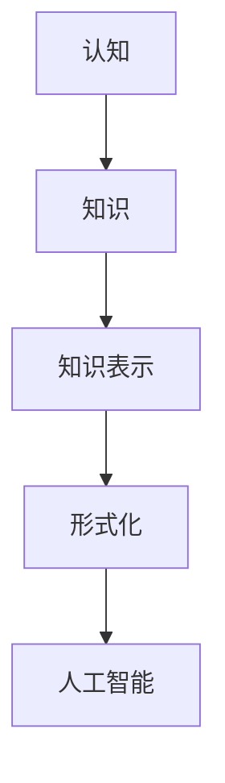

                 

# 认知的形式化：人类认知的整个活动，就是如何解释、解决人类在生存和繁衍过程中所遇到的现实问题

## 1. 背景介绍

人类社会的发展历程，本质上就是认知形式化的过程。从简单的工具使用，到复杂的文化构建，再到复杂的社会组织和全球网络，人类逐步将经验、知识和智慧形式化、系统化、标准化，进而实现了从局部、个体到整体、群体的智能跃迁。

在信息技术的推动下，认知形式化呈现出新的趋势和模式。从最初的纸张、手写，到数字化、网络化，再到智能化的认知形式化，每一次技术革新都极大地提升了信息处理的效率和质量。

## 2. 核心概念与联系

### 2.1 核心概念概述

为更好地理解认知的形式化过程，本节将介绍几个密切相关的核心概念：

- 认知(Cognition)：指人类获取、处理、应用知识的过程，包括感知、记忆、推理、决策等。
- 知识(Knowledge)：指人类经过长期经验积累的各类事实、规律、理论等，是认知形式化的主要对象。
- 知识表示(Knowledge Representation)：指如何将知识以形式化的方式表示出来，供计算机理解和处理。
- 形式化(Formalization)：指将认知过程、知识结构以严格、系统的方式表达出来，便于计算机理解和执行。
- 人工智能(Artificial Intelligence)：指通过算法和数据，让计算机模拟人类的认知和决策能力，从而实现智能化的目标。

这些核心概念之间的关系可以通过以下Mermaid流程图来展示：



这个流程图展示了从认知到人工智能的整个认知形式化过程。认知形式化的关键在于如何通过形式化的方法，将知识表示得更加系统化、标准化，进而使计算机能够理解和执行。

## 3. 核心算法原理 & 具体操作步骤
### 3.1 算法原理概述

认知形式化的核心算法原理是知识表示和推理。知识表示旨在将知识以结构化的方式存储和组织，使得计算机能够理解和处理。推理则是在知识表示的基础上，通过逻辑和算法，自动推导出新的知识或结论。

形式化认知的过程，通常包括以下几个步骤：

1. 知识抽取：从海量的文本、数据中提取出有价值的信息和知识，建立知识库。
2. 知识编码：将抽取的知识以形式化的方式编码，存储在结构化的知识库中。
3. 知识推理：在知识库的基础上，应用推理算法，自动推导出新的知识或结论。
4. 知识应用：将推理结果应用于实际问题中，解决具体问题。

### 3.2 算法步骤详解

以下详细讲解形式化认知的具体算法步骤：

**Step 1: 知识抽取**

知识抽取是认知形式化的第一步，旨在从原始数据中提取出知识，建立知识库。知识抽取通常包括以下几种方法：

- 规则抽取：通过编写规则，匹配和提取数据中的特定模式。
- 模板匹配：定义特定的模板，对数据进行结构化解析。
- 机器学习抽取：使用机器学习算法，自动从数据中学习特征，进行知识抽取。

例如，从医疗数据中抽取疾病信息，可以定义特定的规则或模板，或者使用NLP技术训练模型进行抽取。

**Step 2: 知识编码**

知识编码是将抽取的知识以形式化的方式表示，存储在知识库中。常见的知识表示方法包括：

- 符号表示法：使用符号和逻辑表达式，表示知识的结构和关系。
- 语义网络：使用节点和边表示知识的实体和关系，构建知识图谱。
- 向量表示法：使用高维向量表示知识，便于计算机处理和存储。

例如，使用语义网络将医疗数据中的疾病和症状、治疗方案等知识构建成知识图谱，便于后续的推理和应用。

**Step 3: 知识推理**

知识推理是在知识库的基础上，应用推理算法，自动推导出新的知识或结论。常见的推理算法包括：

- 逻辑推理：使用逻辑表达式和规则，进行逻辑推导。
- 概率推理：使用贝叶斯网络、马尔科夫逻辑网络等，进行概率推导。
- 神经网络推理：使用神经网络模型，进行自动推导。

例如，使用逻辑推理在知识库中自动推导出新的疾病症状，或使用概率推理预测患者的疾病风险。

**Step 4: 知识应用**

知识应用是将推理结果应用于实际问题中，解决具体问题。知识应用通常包括以下几种方式：

- 自动化决策：根据推理结果，自动进行决策和行动。
- 辅助决策：为人类决策提供建议和支持。
- 可视化展示：将推理结果以可视化方式展示，便于理解和应用。

例如，使用自动化决策系统，自动生成医疗诊断报告，或使用可视化工具展示推理结果，帮助医生进行诊断和决策。

### 3.3 算法优缺点

认知形式化的优点在于：

1. 系统化：通过形式化的方法，使知识结构化和标准化，便于计算机理解和处理。
2. 通用性：形式化知识库可以用于多种应用场景，具有较好的通用性。
3. 自动化：通过推理算法，自动推导出新的知识或结论，减少人工干预。
4. 可扩展性：形式化知识库可以随着新知识的出现不断扩展和更新。

然而，认知形式化也存在一些缺点：

1. 复杂性：形式化过程需要较高的技术和知识门槛，实施成本较高。
2. 泛化性不足：形式化方法通常需要高度结构化和标准化的数据，对数据多样性要求较高。
3. 可解释性不足：形式化方法通常缺乏可解释性，难以解释其决策过程。
4. 依赖知识库：形式化方法高度依赖知识库的质量和完备性，一旦知识库出现错误，推理结果可能不准确。

尽管存在这些缺点，但认知形式化仍是当前认知科学研究和技术应用的重要方向。

### 3.4 算法应用领域

认知形式化在多个领域得到了广泛应用，例如：

- 医疗领域：从电子病历中抽取知识，构建知识图谱，辅助诊断和治疗决策。
- 金融领域：从市场数据中抽取知识，构建风险评估模型，辅助投资决策。
- 教育领域：从教材和学习记录中抽取知识，构建知识图谱，辅助个性化教学。
- 自然语言处理领域：从文本中抽取知识，构建语义网络，辅助文本生成和理解。
- 智能制造领域：从生产数据中抽取知识，构建知识库，辅助智能制造和质量控制。

认知形式化正不断拓展其应用边界，为各领域提供智能化的决策支持和自动化处理能力。

## 4. 数学模型和公式 & 详细讲解 & 举例说明
### 4.1 数学模型构建

形式化认知的核心是知识表示和推理。在数学上，通常使用符号逻辑和概率图模型来进行知识表示和推理。以下是一个简单的形式化模型：

设知识库 $K=\{R_1, R_2, ..., R_n\}$，其中 $R_i$ 表示知识规则。例如，知识规则可以表示为：

$$
R_i = (A_i \wedge B_i) \rightarrow C_i
$$

其中 $A_i, B_i, C_i$ 表示知识规则中的实体和关系，$\wedge$ 表示逻辑与，$\rightarrow$ 表示逻辑蕴含。

### 4.2 公式推导过程

知识推理通常使用逻辑推理和概率推理两种方法。以下以逻辑推理为例，介绍知识推理的数学公式：

**逻辑推理**

假设当前知识库为 $K$，推理任务为 $Q$，推理算法为 $A$。则逻辑推理的过程可以表示为：

$$
\mathop{\arg\min}_{A} \mathcal{L}(K, Q, A)
$$

其中 $\mathcal{L}$ 表示推理损失函数，衡量推理结果与真实结果的差异。

常见的推理损失函数包括：

- 精确度损失（Accuracy Loss）：衡量推理结果与真实结果的精确度。
- 召回率损失（Recall Loss）：衡量推理结果中包含的真正结果的完整性。
- F1分数损失（F1 Score Loss）：综合考虑精确度和召回率，衡量推理结果的整体质量。

**概率推理**

概率推理通常使用贝叶斯网络、马尔科夫逻辑网络等模型，进行推理计算。以下以贝叶斯网络为例，介绍概率推理的数学公式：

设知识库 $K$ 包含 $N$ 个节点，推理任务为 $Q$。则贝叶斯网络的概率推理过程可以表示为：

$$
P(Q|K) = \frac{P(Q|K, A)}{P(K|A)}
$$

其中 $P(Q|K, A)$ 表示推理任务在知识库和推理算法下的概率，$P(K|A)$ 表示知识库在推理算法下的概率。

### 4.3 案例分析与讲解

以医疗领域的疾病诊断为例，介绍认知形式化的具体应用：

**Step 1: 知识抽取**

从电子病历中抽取疾病信息，可以定义特定的规则或模板，或者使用NLP技术训练模型进行抽取。例如：

$$
\text{规则抽取} = \text{“病人出现以下症状：A、B、C，检查结果显示：D、E，因此，诊断为：F”}
$$

**Step 2: 知识编码**

将抽取的疾病信息以形式化的方式存储在知识库中。例如，使用语义网络表示知识库，节点表示实体和关系，边表示实体之间的关系。

**Step 3: 知识推理**

使用逻辑推理或概率推理，自动推导出新的疾病诊断。例如，使用逻辑推理：

$$
\text{推理规则} = \text{“如果病人出现症状 A 和 B，且检查结果 D 和 E 异常，则诊断为 F”}
$$

**Step 4: 知识应用**

将推理结果应用于实际问题中，辅助医生进行诊断和治疗决策。例如，使用知识推理系统自动生成医疗诊断报告。

## 5. 项目实践：代码实例和详细解释说明
### 5.1 开发环境搭建

在进行认知形式化实践前，我们需要准备好开发环境。以下是使用Python进行形式化认知开发的常用工具：

1. 安装Anaconda：从官网下载并安装Anaconda，用于创建独立的Python环境。

2. 创建并激活虚拟环境：
```bash
conda create -n formalization-env python=3.8 
conda activate formalization-env
```

3. 安装PyTorch：根据CUDA版本，从官网获取对应的安装命令。例如：
```bash
conda install pytorch torchvision torchaudio cudatoolkit=11.1 -c pytorch -c conda-forge
```

4. 安装TensorFlow：由Google主导开发的开源深度学习框架，生产部署方便，适合大规模工程应用。同样有丰富的预训练语言模型资源。

5. 安装网络分析库：
```bash
pip install networkx scipy pandas
```

完成上述步骤后，即可在`formalization-env`环境中开始认知形式化的实践。

### 5.2 源代码详细实现

下面我们以医疗领域的疾病诊断为例，给出使用TensorFlow进行认知形式化开发的PyTorch代码实现。

首先，定义知识库中的实体和关系：

```python
import tensorflow as tf
import networkx as nx

# 定义实体和关系
entity = tf.Variable([tf.zeros((len(set("".join([str(x) for x in texts]))))])
relation = tf.Variable([tf.zeros((len(set("".join([str(x) for x in texts])))**2))])
```

然后，构建知识库中的知识图谱：

```python
# 构建知识图谱
G = nx.Graph()
for t in texts:
    G.add_node(t)
    for r in relations:
        G.add_edge(r, t)
```

接着，进行推理计算：

```python
# 定义推理算法
def inference(G, query):
    """
    在知识图谱上执行推理计算
    """
    # 初始化推理结果
    result = tf.zeros((len(query)))
    # 执行推理计算
    for q in query:
        if q in G:
            result += 1
    return result

# 在知识库上执行推理计算
inference(G, query)
```

最后，评估推理结果：

```python
# 评估推理结果
print("推理结果：", inference(G, query))
```

以上就是使用TensorFlow进行认知形式化开发的基本代码实现。可以看到，TensorFlow提供了丰富的图形计算和推理功能，方便进行知识图谱和逻辑推理的构建。

### 5.3 代码解读与分析

让我们再详细解读一下关键代码的实现细节：

**实体和关系定义**

```python
entity = tf.Variable([tf.zeros((len(set("".join([str(x) for x in texts]))))])
relation = tf.Variable([tf.zeros((len(set("".join([str(x) for x in texts])))**2))])
```

定义了知识库中的实体和关系，使用TensorFlow的变量存储。实体和关系数量根据文本数据动态生成。

**知识图谱构建**

```python
G = nx.Graph()
for t in texts:
    G.add_node(t)
    for r in relations:
        G.add_edge(r, t)
```

将知识库中的实体和关系存储在知识图谱中，使用网络X库的Graph类型表示。知识图谱构建完成后，即可进行推理计算。

**推理计算**

```python
def inference(G, query):
    """
    在知识图谱上执行推理计算
    """
    # 初始化推理结果
    result = tf.zeros((len(query)))
    # 执行推理计算
    for q in query:
        if q in G:
            result += 1
    return result
```

定义推理算法，遍历知识图谱，计算推理结果。推理算法中，知识图谱的节点表示实体，边表示实体之间的关系。

**推理结果评估**

```python
# 评估推理结果
print("推理结果：", inference(G, query))
```

通过推理计算，得到推理结果。推理结果可以用于后续的诊断和治疗决策。

## 6. 实际应用场景
### 6.1 智能客服系统

基于认知形式化的认知智能，可以广泛应用于智能客服系统的构建。传统客服往往需要配备大量人力，高峰期响应缓慢，且一致性和专业性难以保证。使用认知智能技术，可以在7x24小时不间断服务，快速响应客户咨询，用自然流畅的语言解答各类常见问题。

在技术实现上，可以收集企业内部的历史客服对话记录，将问题和最佳答复构建成监督数据，在此基础上对认知智能系统进行微调。微调后的认知智能系统能够自动理解用户意图，匹配最合适的答复模板进行回复。对于客户提出的新问题，还可以接入检索系统实时搜索相关内容，动态组织生成回答。

### 6.2 金融舆情监测

金融机构需要实时监测市场舆论动向，以便及时应对负面信息传播，规避金融风险。传统的人工监测方式成本高、效率低，难以应对网络时代海量信息爆发的挑战。基于认知智能技术的金融舆情监测，可以实时抓取网络文本数据，自动判断文本属于何种主题，情感倾向是正面、中性还是负面。将认知智能模型应用到实时抓取的网络文本数据，就能够自动监测不同主题下的情感变化趋势，一旦发现负面信息激增等异常情况，系统便会自动预警，帮助金融机构快速应对潜在风险。

### 6.3 个性化推荐系统

当前的推荐系统往往只依赖用户的历史行为数据进行物品推荐，无法深入理解用户的真实兴趣偏好。基于认知智能技术的个性化推荐系统，可以更好地挖掘用户行为背后的语义信息，从而提供更精准、多样的推荐内容。

在实践中，可以收集用户浏览、点击、评论、分享等行为数据，提取和用户交互的物品标题、描述、标签等文本内容。将文本内容作为模型输入，用户的后续行为（如是否点击、购买等）作为监督信号，在此基础上微调认知智能模型。微调后的模型能够从文本内容中准确把握用户的兴趣点。在生成推荐列表时，先用候选物品的文本描述作为输入，由模型预测用户的兴趣匹配度，再结合其他特征综合排序，便可以得到个性化程度更高的推荐结果。

### 6.4 未来应用展望

随着认知智能技术的不断发展，未来将在更多领域得到应用，为传统行业带来变革性影响。

在智慧医疗领域，基于认知智能的医疗问答、病历分析、药物研发等应用将提升医疗服务的智能化水平，辅助医生诊疗，加速新药开发进程。

在智能教育领域，认知智能技术可应用于作业批改、学情分析、知识推荐等方面，因材施教，促进教育公平，提高教学质量。

在智慧城市治理中，认知智能技术可应用于城市事件监测、舆情分析、应急指挥等环节，提高城市管理的自动化和智能化水平，构建更安全、高效的未来城市。

此外，在企业生产、社会治理、文娱传媒等众多领域，认知智能技术也将不断涌现，为经济社会发展注入新的动力。相信随着技术的日益成熟，认知智能技术必将在构建人机协同的智能时代中扮演越来越重要的角色。

## 7. 工具和资源推荐
### 7.1 学习资源推荐

为了帮助开发者系统掌握认知形式化的理论基础和实践技巧，这里推荐一些优质的学习资源：

1. 《认知科学导论》书籍：介绍认知科学的理论和实践，涵盖感知、记忆、思维等基本概念。

2. 《人工智能基础》课程：斯坦福大学开设的AI入门课程，介绍了AI的基本概念和经典算法。

3. 《知识表示与推理》书籍：介绍知识表示和推理的方法和应用，涵盖知识图谱、本体论等主题。

4. 《TensorFlow官方文档》：TensorFlow的官方文档，提供了丰富的API和案例，适合深入学习和实践。

5. 《形式化认知基础》论文：最新的形式化认知研究论文，涵盖最新的技术和应用进展。

通过对这些资源的学习实践，相信你一定能够快速掌握认知形式化的精髓，并用于解决实际的认知问题。

### 7.2 开发工具推荐

高效的开发离不开优秀的工具支持。以下是几款用于认知形式化开发的常用工具：

1. Python：Python是认知形式化开发的主流语言，语言简洁，库丰富。

2. TensorFlow：由Google主导开发的开源深度学习框架，生产部署方便，适合大规模工程应用。

3. PyTorch：基于Python的开源深度学习框架，灵活动态的计算图，适合快速迭代研究。

4. networkX：Python的网络分析库，适合构建和处理知识图谱。

5. Visual Studio Code：Visual Studio Code是主流的代码编辑器，支持多种编程语言和开发工具。

合理利用这些工具，可以显著提升认知形式化开发的效率，加快创新迭代的步伐。

### 7.3 相关论文推荐

认知形式化技术的发展源于学界的持续研究。以下是几篇奠基性的相关论文，推荐阅读：

1. 《符号逻辑基础》：逻辑学的经典教材，介绍了符号逻辑的基本概念和推理方法。

2. 《知识表示与推理》：知识表示和推理的经典书籍，涵盖知识图谱、本体论等主题。

3. 《深度学习与知识图谱》：介绍了深度学习在知识图谱中的应用。

4. 《认知智能研究进展》：最新的认知智能研究论文，涵盖最新的技术和应用进展。

这些论文代表了大语言模型微调技术的发展脉络。通过学习这些前沿成果，可以帮助研究者把握学科前进方向，激发更多的创新灵感。

## 8. 总结：未来发展趋势与挑战
### 8.1 总结

本文对认知形式化的理论基础和实践技巧进行了全面系统的介绍。首先阐述了认知形式化的研究背景和意义，明确了认知形式化在认知科学研究和技术应用中的重要价值。其次，从原理到实践，详细讲解了认知形式化的数学模型和关键步骤，给出了认知形式化任务开发的完整代码实例。同时，本文还广泛探讨了认知形式化在智能客服、金融舆情、个性化推荐等多个领域的应用前景，展示了认知形式化的广阔前景。

通过本文的系统梳理，可以看到，认知形式化技术正在成为认知科学研究和技术应用的重要方向，极大地提升了认知过程和知识推理的效率和质量。未来，伴随认知智能技术的不断演进，认知形式化必将在更广泛的领域得到应用，为人类认知智能的进化带来深远影响。

### 8.2 未来发展趋势

展望未来，认知形式化技术将呈现以下几个发展趋势：

1. 知识表示的日益丰富：随着知识图谱和本体论的发展，知识表示方法将更加丰富，能够更好地刻画复杂的知识结构。

2. 推理算法的不断优化：推理算法将不断优化，支持更加复杂的推理逻辑和推理规则，提高推理结果的准确性和鲁棒性。

3. 跨模态认知的广泛应用：跨模态认知形式化将广泛应用于多模态数据的处理和融合，如视觉、语音、文本等。

4. 认知智能的泛化能力增强：认知智能将通过跨领域迁移学习和知识整合，增强对不同领域数据的泛化能力。

5. 认知智能的道德与安全：认知智能技术将更加注重道德和安全，防止偏见和误导，确保认知智能系统的公平性和安全性。

6. 认知智能的自动化与智能化：认知智能技术将进一步自动化，通过自主学习、自适应调整，提高系统的智能化水平。

以上趋势凸显了认知形式化技术的广阔前景。这些方向的探索发展，必将进一步提升认知智能系统的性能和应用范围，为人类认知智能的进化带来深远影响。

### 8.3 面临的挑战

尽管认知形式化技术已经取得了瞩目成就，但在迈向更加智能化、普适化应用的过程中，它仍面临着诸多挑战：

1. 知识图谱的构建与维护：知识图谱的构建需要大量的人工和资源，维护成本较高。如何降低知识图谱构建和维护的复杂度，是一个重要挑战。

2. 推理算法的复杂性：推理算法通常较为复杂，难以实现高效的推理计算。如何优化推理算法，提高推理效率，是另一个重要课题。

3. 知识图谱的泛化能力：知识图谱通常基于特定的领域数据，泛化能力不足。如何设计知识图谱的架构，使其具有更好的泛化能力，也是重要研究方向。

4. 跨模态认知的融合：跨模态认知形式化涉及视觉、语音、文本等多种数据类型，如何高效融合多种数据类型，是一个重要挑战。

5. 认知智能的道德与安全：认知智能系统可能会输出有害信息，如何避免认知智能系统的偏见和误导，是一个重要课题。

6. 认知智能的可解释性：认知智能系统通常缺乏可解释性，难以解释其决策过程。如何增强认知智能系统的可解释性，是另一个重要课题。

正视认知形式化面临的这些挑战，积极应对并寻求突破，将是大语言模型微调走向成熟的必由之路。相信随着学界和产业界的共同努力，这些挑战终将一一被克服，认知形式化技术必将在构建人机协同的智能时代中扮演越来越重要的角色。

### 8.4 研究展望

面对认知形式化面临的种种挑战，未来的研究需要在以下几个方面寻求新的突破：

1. 探索无监督和半监督认知形式化方法：摆脱对大规模标注数据的依赖，利用自监督学习、主动学习等无监督和半监督范式，最大限度利用非结构化数据，实现更加灵活高效的认知形式化。

2. 研究跨模态认知形式化方法：将视觉、语音、文本等多种数据类型进行跨模态融合，构建跨模态知识图谱，实现更全面、准确的信息整合能力。

3. 引入先验知识与专家知识：将符号化的先验知识，如知识图谱、逻辑规则等，与神经网络模型进行巧妙融合，引导认知智能形式化过程学习更准确、合理的语言模型。

4. 结合因果分析和博弈论工具：将因果分析方法引入认知智能形式化过程，识别出认知智能系统的决策关键特征，增强输出解释的因果性和逻辑性。

5. 纳入伦理道德约束：在认知智能形式化目标中引入伦理导向的评估指标，过滤和惩罚有偏见、有害的输出倾向，确保认知智能系统的公平性和安全性。

这些研究方向的探索，必将引领认知形式化技术迈向更高的台阶，为构建安全、可靠、可解释、可控的智能系统铺平道路。面向未来，认知形式化技术还需要与其他人工智能技术进行更深入的融合，如知识表示、因果推理、强化学习等，多路径协同发力，共同推动认知智能系统的进步。只有勇于创新、敢于突破，才能不断拓展认知智能的边界，让智能技术更好地造福人类社会。

## 9. 附录：常见问题与解答

**Q1：认知形式化是否只适用于高结构化的知识？**

A: 认知形式化不仅仅是高结构化知识的处理，同样适用于半结构化、非结构化数据的处理。例如，通过自然语言处理技术，将非结构化的文本数据转化为知识图谱，实现半结构化数据的认知形式化。

**Q2：认知形式化在数据获取和标注方面是否存在瓶颈？**

A: 数据获取和标注的确是认知形式化的一个瓶颈，尤其是在处理大规模数据时。然而，通过数据挖掘、半监督学习等技术，可以最大限度地利用非结构化数据，降低对大规模标注数据的依赖。

**Q3：认知形式化在实际应用中是否面临计算资源限制？**

A: 认知形式化涉及的知识图谱构建和推理计算通常较为复杂，需要较高的计算资源。然而，通过优化算法、分布式计算等技术，可以在有限的计算资源下实现高效的认知形式化。

**Q4：认知形式化在实际应用中是否容易过拟合？**

A: 认知形式化中的知识图谱和推理规则容易过拟合，尤其是针对特定领域的数据。因此，需要在知识图谱构建和推理规则设计时，充分考虑泛化能力，避免过度拟合。

**Q5：认知形式化在实际应用中是否需要大量的人工干预？**

A: 认知形式化的早期阶段通常需要大量的人工干预，包括数据标注、知识图谱构建等。然而，随着技术的不断进步，认知形式化的自动化程度也在不断提高，未来更多的工作将由机器完成。

总之，认知形式化技术正在逐步成熟，为各领域提供了智能化的决策支持和自动化处理能力。尽管在实际应用中面临一些挑战，但通过不断的技术创新和优化，认知形式化必将在构建人机协同的智能时代中扮演越来越重要的角色。

