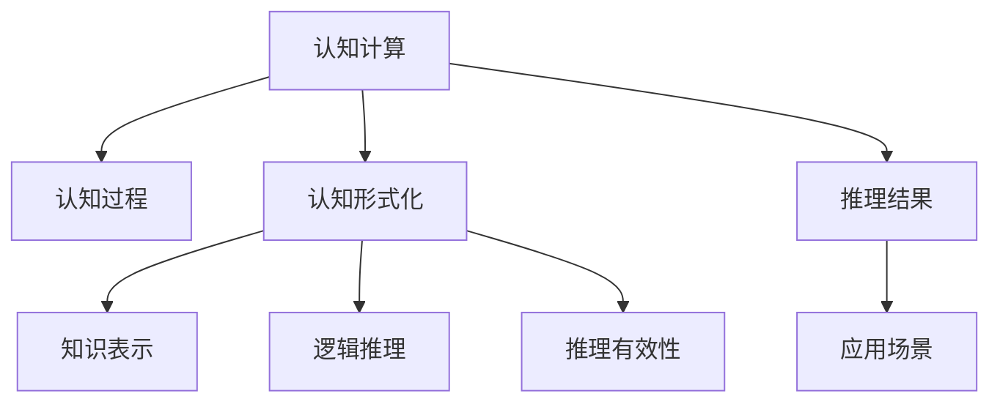

                 

# 认知的形式化：什么是认知形式化

> 关键词：认知形式化, 认知计算, 人工智能, 知识表示, 逻辑推理

## 1. 背景介绍

### 1.1 问题由来
认知计算（Cognitive Computing）是人工智能领域中的一个重要分支，旨在模拟人类认知过程，实现更为复杂的推理和决策。传统人工智能算法主要基于符号推理和概率模型，而认知计算则进一步提升了知识的表达和推理能力。认知计算的一个重要组成部分是认知形式化，即通过形式化的方式，对认知过程进行精确的数学描述和处理。

认知形式化的研究可以追溯到19世纪末的数理逻辑与形式主义哲学，旨在通过精确的形式语言和方法，对人类认知过程进行建模和推理。近年来，随着人工智能技术的快速发展，认知形式化也日益成为人工智能研究的前沿领域之一。

### 1.2 问题核心关键点
认知形式化的核心在于对认知过程的形式化表示和推理。其核心问题是：

- **认知过程的形式化表示**：如何将认知过程（如感知、记忆、推理等）转化为数学公式和逻辑表达式。
- **认知推理算法**：如何通过形式化的推理规则，在计算模型上进行认知推理。
- **知识表示**：如何设计有效的知识表示框架，以支持复杂的认知推理。
- **推理有效性**：如何确保推理结果的逻辑一致性和可解释性。

## 2. 核心概念与联系

### 2.1 核心概念概述

为更好地理解认知形式化，本节将介绍几个密切相关的核心概念：

- **认知计算**：通过模拟人类认知过程，实现更为复杂的推理和决策。包括感知、记忆、推理、学习等认知功能。
- **认知过程**：指人类认知过程中的感知、记忆、推理等基本活动，需要通过形式化的方式进行建模。
- **认知形式化**：通过精确的形式语言和方法，对认知过程进行建模和推理。包括知识表示、逻辑推理、推理有效性等核心内容。
- **知识表示**：设计有效的知识表示框架，如本体论、语义网络等，以支持复杂的认知推理。
- **逻辑推理**：通过形式化的推理规则，在计算模型上进行认知推理。包括演绎推理、归纳推理、模型推理等。
- **推理有效性**：确保推理结果的逻辑一致性和可解释性。

这些核心概念之间的逻辑关系可以通过以下Mermaid流程图来展示：



这个流程图展示了大语言模型的核心概念及其之间的关系：

1. 认知计算通过模拟人类认知过程，实现更为复杂的推理和决策。
2. 认知过程是认知计算的基础，需要通过形式化的方式进行建模。
3. 认知形式化通过精确的形式语言和方法，对认知过程进行建模和推理。
4. 知识表示设计有效的知识表示框架，支持复杂的认知推理。
5. 逻辑推理通过形式化的推理规则，在计算模型上进行认知推理。
6. 推理有效性确保推理结果的逻辑一致性和可解释性。
7. 推理结果最终应用于各种认知计算场景中，提升认知系统的性能。

这些概念共同构成了认知形式化的研究框架，使得我们能够更好地理解和模拟人类认知过程，构建更为智能的认知系统。

## 3. 核心算法原理 & 具体操作步骤
### 3.1 算法原理概述

认知形式化的一个关键技术是知识表示和逻辑推理。其核心思想是：通过精确的形式语言，对认知过程进行数学描述，并利用逻辑推理方法，对认知系统进行推理。

认知形式化主要包括以下几个步骤：

1. **知识获取**：从外界获取知识，并通过形式化的方式进行编码。
2. **知识表示**：设计有效的知识表示框架，如本体论、语义网络等。
3. **逻辑推理**：通过形式化的推理规则，在计算模型上进行认知推理。
4. **推理结果验证**：确保推理结果的逻辑一致性和可解释性。

认知形式化的核心在于将认知过程转化为数学公式和逻辑表达式，并通过逻辑推理方法，对认知系统进行推理。这一过程涉及到知识表示、逻辑推理和推理有效性等核心内容。

### 3.2 算法步骤详解

认知形式化的一般流程如下：

**Step 1: 知识获取**
- 从外界获取知识，包括文本、图像、音频等。
- 将获取的知识转化为形式化的表示，如将自然语言转化为逻辑表达式。

**Step 2: 知识表示**
- 设计有效的知识表示框架，如本体论、语义网络等。
- 将知识表示为形式化的框架，便于后续的推理处理。

**Step 3: 逻辑推理**
- 选择合适的逻辑推理规则，如演绎推理、归纳推理、模型推理等。
- 利用逻辑推理引擎，对知识表示进行推理计算。

**Step 4: 推理结果验证**
- 验证推理结果的逻辑一致性和可解释性。
- 通过反例、一致性检查等方式，确保推理结果的正确性。

**Step 5: 应用场景**
- 将推理结果应用于具体的认知计算场景中。
- 根据推理结果，生成相应的决策和行为。

### 3.3 算法优缺点

认知形式化的主要优点包括：

1. **精确性**：通过形式化的方式对认知过程进行建模，避免了模糊和不一致的问题。
2. **可解释性**：形式化的推理过程具有较高的可解释性，便于理解和调试。
3. **灵活性**：形式化的表示和推理框架具有高度的灵活性，可以适应各种复杂的认知场景。
4. **可扩展性**：形式化的知识表示和推理框架可以轻松扩展，支持更多复杂的功能。

然而，认知形式化也存在一些缺点：

1. **复杂性**：形式化的表示和推理过程较为复杂，需要一定的专业知识。
2. **推理效率**：形式化的推理过程可能较为耗时，特别是在处理大规模知识库时。
3. **领域限制**：不同领域的认知过程需要不同的知识表示和推理方法，需要针对具体领域进行定制化设计。

尽管存在这些局限性，但认知形式化作为一种精确的认知建模和推理方法，具有广阔的应用前景。

### 3.4 算法应用领域

认知形式化已经在多个领域得到了应用，包括：

- **医疗诊断**：利用认知计算和形式化推理，辅助医生进行疾病诊断和决策。
- **智能制造**：通过认知计算和形式化推理，优化生产流程和质量控制。
- **金融风控**：利用认知计算和形式化推理，进行风险评估和决策支持。
- **安全监控**：通过认知计算和形式化推理，进行威胁识别和响应。
- **智能客服**：利用认知计算和形式化推理，提升客服系统的理解和响应能力。
- **教育评估**：利用认知计算和形式化推理，进行学生评估和个性化教学。

## 4. 数学模型和公式 & 详细讲解 & 举例说明

### 4.1 数学模型构建

本节将使用数学语言对认知形式化的方法进行更加严格的刻画。

记认知系统中的知识库为 $K=\{R,\Sigma,\Pi\}$，其中 $R$ 为推理规则集，$\Sigma$ 为知识表示框架，$\Pi$ 为知识库实例。

定义认知系统 $C$ 的推理过程如下：

1. **输入**：输入知识库 $K$ 和推理目标 $T$。
2. **推理步骤**：
   - 使用推理规则 $R$，对知识库 $K$ 进行推理计算。
   - 输出推理结果 $R(K, T)$。

### 4.2 公式推导过程

以下我们以医学领域的认知计算为例，推导认知形式化的逻辑推理过程。

假设知识库 $K$ 中包含以下事实和推理规则：

- 事实1：“如果患者有症状A，则可能患有疾病X”
- 事实2：“如果患者有症状B，则可能患有疾病Y”
- 规则1：“如果患者有症状A且B，则可能患有疾病Z”

定义推理目标 $T$ 为“患者可能患有疾病Z”。

推理过程如下：

1. 根据规则1，推理出“如果患者有症状A且B，则可能患有疾病Z”
2. 根据事实1，推理出“如果患者有症状A，则可能患有疾病X”
3. 根据事实2，推理出“如果患者有症状B，则可能患有疾病Y”

结合以上推理结果，我们可以得出结论：“患者可能患有疾病Z”。

### 4.3 案例分析与讲解

在实际应用中，认知形式化可以用于解决各种复杂问题，例如：

- **医疗诊断**：利用认知计算和形式化推理，辅助医生进行疾病诊断和决策。例如，根据症状和体征，推理出可能的疾病类型。
- **智能制造**：通过认知计算和形式化推理，优化生产流程和质量控制。例如，根据设备状态和生产数据，推理出可能的故障原因和维修方案。
- **金融风控**：利用认知计算和形式化推理，进行风险评估和决策支持。例如，根据交易记录和市场数据，推理出可能的欺诈行为和风险预警。

## 5. 项目实践：代码实例和详细解释说明
### 5.1 开发环境搭建

在进行认知形式化实践前，我们需要准备好开发环境。以下是使用Python进行PyTorch开发的环境配置流程：

1. 安装Anaconda：从官网下载并安装Anaconda，用于创建独立的Python环境。

2. 创建并激活虚拟环境：
```bash
conda create -n pytorch-env python=3.8 
conda activate pytorch-env
```

3. 安装PyTorch：根据CUDA版本，从官网获取对应的安装命令。例如：
```bash
conda install pytorch torchvision torchaudio cudatoolkit=11.1 -c pytorch -c conda-forge
```

4. 安装TensorFlow：由Google主导开发的开源深度学习框架，生产部署方便，适合大规模工程应用。同样有丰富的预训练语言模型资源。

5. 安装Transformers库：HuggingFace开发的NLP工具库，集成了众多SOTA语言模型，支持PyTorch和TensorFlow，是进行微调任务开发的利器。

6. 安装各类工具包：
```bash
pip install numpy pandas scikit-learn matplotlib tqdm jupyter notebook ipython
```

完成上述步骤后，即可在`pytorch-env`环境中开始认知形式化的实践。

### 5.2 源代码详细实现

这里我们以一个简单的逻辑推理模型为例，实现推理规则的建模和推理过程。

首先，定义推理规则：

```python
class Rule:
    def __init__(self, antecedent, consequent):
        self.antecedent = antecedent
        self.consequent = consequent
        
    def apply(self, fact, variable):
        return self.consequent if self.antecedent.apply(fact, variable) else None
```

接着，定义事实表示：

```python
class Fact:
    def __init__(self, variables):
        self.variables = variables
        
    def evaluate(self, variable):
        return self.variables[variable] if variable in self.variables else None
```

然后，定义推理引擎：

```python
class Reasoner:
    def __init__(self, rules):
        self.rules = rules
        
    def apply(self, fact, variable):
        for rule in self.rules:
            consequent = rule.apply(fact, variable)
            if consequent:
                return consequent
        return None
```

最后，实现推理过程：

```python
def infer(reasoner, facts, target):
    for fact in facts:
        consequent = reasoner.apply(fact, target)
        if consequent:
            return consequent
    return None
```

通过上述代码，我们可以实现简单的逻辑推理过程，解决认知形式化中的推理问题。

### 5.3 代码解读与分析

让我们再详细解读一下关键代码的实现细节：

**Rule类**：
- `__init__`方法：定义推理规则的先决条件和结果。
- `apply`方法：根据先决条件和已知事实，计算推理结果。

**Fact类**：
- `__init__`方法：定义事实的变量表示。
- `evaluate`方法：根据变量名，获取事实中的值。

**Reasoner类**：
- `__init__`方法：定义推理引擎的规则集。
- `apply`方法：根据规则和已知事实，计算推理结果。

**infer函数**：
- 定义推理过程，从已知事实出发，逐个应用规则，计算推理结果。

这些代码实现了基本的逻辑推理过程，但实际应用中，认知形式化可能涉及更复杂的知识表示和推理规则。开发者需要根据具体任务，设计相应的知识表示和推理框架，实现复杂的认知计算。

## 6. 实际应用场景
### 6.1 医疗诊断

认知计算在医疗领域有广泛应用，尤其是在辅助诊断和治疗决策中。传统医疗诊断往往依赖医生的经验，但通过认知计算，可以借助大量医学数据和知识库，辅助医生进行更加精准的诊断。

例如，利用认知计算和形式化推理，可以从患者的症状和体征中推理出可能的疾病类型，提供诊断建议。这可以大幅提升诊断的准确性和效率，减少误诊和漏诊的可能性。

### 6.2 智能制造

在制造业中，认知计算可以用于生产过程的优化和故障诊断。例如，通过认知计算和形式化推理，可以从设备状态和生产数据中推理出可能的故障原因，提供维修建议。这可以大幅提升设备的可靠性和生产效率，减少停机时间和维修成本。

### 6.3 金融风控

金融领域中，认知计算可以用于风险评估和欺诈检测。例如，通过认知计算和形式化推理，可以从交易记录和市场数据中推理出可能的欺诈行为，提供预警和处理建议。这可以大幅提升风险控制和欺诈防范能力，保障金融系统的安全稳定。

### 6.4 未来应用展望

未来，认知形式化将在更多领域得到应用，为复杂系统的智能决策提供有力支持。

- **智慧城市**：通过认知计算和形式化推理，优化城市管理和服务，提高城市运行效率和居民生活质量。例如，在交通管理中，利用认知计算和形式化推理，优化交通信号灯控制，减少交通拥堵。
- **智能家居**：通过认知计算和形式化推理，提升家居设备的智能性和个性化。例如，在智能音箱中，利用认知计算和形式化推理，实现语音识别和自然语言理解，提供智能服务和决策建议。
- **智能教育**：通过认知计算和形式化推理，提供个性化学习和教育支持。例如，在智能教学系统中，利用认知计算和形式化推理，根据学生的学习情况，提供个性化的教学方案和评估建议。

## 7. 工具和资源推荐
### 7.1 学习资源推荐

为了帮助开发者系统掌握认知形式化的理论基础和实践技巧，这里推荐一些优质的学习资源：

1. 《认知计算基础》系列博文：由认知计算专家撰写，深入浅出地介绍了认知计算的理论基础和应用实践。

2. 《认知计算》课程：斯坦福大学开设的认知计算课程，涵盖认知计算的基本概念和核心技术，适合入门学习。

3. 《认知计算与人工智能》书籍：详细介绍了认知计算和人工智能技术，包括知识表示、逻辑推理等内容。

4. HuggingFace官方文档：提供丰富的认知计算和知识表示工具，支持多种编程语言和框架，是学习和应用认知计算的重要资源。

5. CLUE开源项目：包含认知计算和知识表示基准数据集，有助于认知计算的研究和实践。

通过对这些资源的学习实践，相信你一定能够快速掌握认知形式化的精髓，并用于解决实际的认知计算问题。

### 7.2 开发工具推荐

高效的开发离不开优秀的工具支持。以下是几款用于认知计算开发的常用工具：

1. PyTorch：基于Python的开源深度学习框架，灵活动态的计算图，适合快速迭代研究。

2. TensorFlow：由Google主导开发的开源深度学习框架，生产部署方便，适合大规模工程应用。

3. TensorFlow Lite：TensorFlow的轻量级版本，支持移动端和嵌入式设备，适合实时推理。

4. Weights & Biases：模型训练的实验跟踪工具，可以记录和可视化模型训练过程中的各项指标，方便对比和调优。

5. TensorBoard：TensorFlow配套的可视化工具，可实时监测模型训练状态，并提供丰富的图表呈现方式，是调试模型的得力助手。

6. Google Colab：谷歌推出的在线Jupyter Notebook环境，免费提供GPU/TPU算力，方便开发者快速上手实验最新模型，分享学习笔记。

合理利用这些工具，可以显著提升认知计算的开发效率，加快创新迭代的步伐。

### 7.3 相关论文推荐

认知形式化已经成为认知计算和人工智能研究的前沿领域之一，以下是几篇奠基性的相关论文，推荐阅读：

1. "Reasoning with Finite Sets of Rules"：J. Minker，1975年，介绍了有限规则推理的逻辑基础和算法。

2. "Knowledge Representation and Reasoning"：J. Kowalski，1988年，详细介绍了知识表示和推理的多种方法。

3. "The Foundation of Logical Theories"：D. Ross，2003年，探讨了逻辑推理的理论基础和算法实现。

4. "Semantic Web Technologies"：T. Sanderson，2011年，介绍了基于语义网的知识表示和推理技术。

5. "Knowledge Graphs"：I. Ullman，2015年，详细介绍了知识图谱的表示和推理方法。

这些论文代表了大语言模型微调技术的发展脉络。通过学习这些前沿成果，可以帮助研究者把握学科前进方向，激发更多的创新灵感。

## 8. 总结：未来发展趋势与挑战
### 8.1 总结

本文对认知形式化的核心概念和方法进行了全面系统的介绍。首先阐述了认知形式化的研究背景和意义，明确了认知形式化在认知计算中的重要地位。其次，从原理到实践，详细讲解了认知形式化的数学模型和操作步骤，给出了认知形式化任务开发的完整代码实例。同时，本文还广泛探讨了认知形式化在医疗、智能制造、金融风控等多个领域的应用前景，展示了认知形式化的广阔前景。此外，本文精选了认知形式化的各类学习资源，力求为读者提供全方位的技术指引。

通过本文的系统梳理，可以看到，认知形式化作为一种精确的认知建模和推理方法，具有广阔的应用前景。未来，伴随认知计算技术的持续演进，认知形式化必将在更多的场景中发挥重要作用，推动人工智能技术在复杂系统的智能决策中取得突破。

### 8.2 未来发展趋势

展望未来，认知形式化将呈现以下几个发展趋势：

1. **认知计算的普及化**：认知计算技术将逐步普及到更多行业和应用场景中，推动智能决策的广泛应用。

2. **认知计算的自动化**：未来的认知计算系统将具备更高的自动化程度，通过智能推理和决策，解决更多复杂问题。

3. **认知计算的个性化**：认知计算系统将能够根据用户需求和偏好，提供更加个性化的智能服务。

4. **认知计算的多模态融合**：未来的认知计算系统将能够融合多种模态的信息，提升综合分析和决策能力。

5. **认知计算的伦理化**：未来的认知计算系统将更加注重伦理和安全，避免偏见和误导性输出。

6. **认知计算的可解释性**：未来的认知计算系统将具备更高的可解释性，方便用户理解和信任。

以上趋势凸显了认知形式化技术的重要性和发展方向。这些方向的探索发展，必将进一步提升认知计算系统的性能和应用范围，为复杂系统的智能决策提供有力支持。

### 8.3 面临的挑战

尽管认知形式化技术已经取得了显著进展，但在迈向更加智能化、普适化应用的过程中，它仍面临诸多挑战：

1. **复杂性**：认知形式化涉及复杂的知识表示和推理规则，需要设计高效的模型和算法。

2. **推理效率**：复杂的推理过程可能导致推理效率低下，特别是在处理大规模知识库时。

3. **领域限制**：不同领域的认知过程需要不同的知识表示和推理方法，需要针对具体领域进行定制化设计。

4. **数据不足**：某些领域的知识表示和推理过程依赖大量的数据，获取高质量的数据可能存在困难。

5. **安全性**：认知计算系统可能面临安全威胁，需要设计安全机制和算法保障。

6. **可解释性**：复杂的认知计算过程需要更高的可解释性，方便用户理解和信任。

7. **伦理问题**：认知计算系统可能存在伦理问题，需要设计伦理导向的评估指标和机制。

这些挑战需要在未来研究中逐步解决，推动认知形式化技术的不断进步。

### 8.4 研究展望

面对认知形式化技术所面临的挑战，未来的研究需要在以下几个方面寻求新的突破：

1. **高效推理算法**：开发高效的推理算法，提升推理效率和准确性。

2. **多模态知识表示**：设计多模态知识表示框架，融合多种信息源，提升认知系统的综合分析能力。

3. **知识图谱构建**：构建大规模知识图谱，支持复杂的知识表示和推理。

4. **认知计算的自动化**：开发自动化的认知计算系统，提升认知系统的自动化程度。

5. **认知计算的可解释性**：设计可解释的认知计算系统，提升系统的透明性和可信度。

6. **认知计算的伦理化**：引入伦理导向的评估指标，确保认知计算系统的公正和安全。

这些研究方向将推动认知形式化技术的不断进步，为复杂系统的智能决策提供有力支持。

## 9. 附录：常见问题与解答
### Q1：认知形式化是否只适用于理论研究？

A: 认知形式化不仅适用于理论研究，也可以在实际应用中发挥重要作用。例如，在医疗诊断、智能制造、金融风控等领域，认知形式化可以用于辅助决策和提升系统性能。

### Q2：认知形式化是否需要丰富的先验知识？

A: 认知形式化需要一定的先验知识，如知识表示框架和推理规则。但可以通过迭代学习和反馈机制，不断更新和优化知识库，提升系统的性能。

### Q3：认知形式化是否适用于所有领域？

A: 认知形式化适用于许多领域，但在某些领域，如文学艺术、文化创意等，可能难以找到合适的知识表示和推理方法。需要根据具体领域进行定制化设计。

### Q4：认知形式化是否易于实现？

A: 认知形式化实现过程较为复杂，需要一定的专业知识和技术基础。但对于某些简单的任务，通过现成的工具和框架，可以快速实现。

### Q5：认知形式化是否适用于大规模知识库？

A: 认知形式化可以应用于大规模知识库，但需要优化推理算法和数据结构，以提升推理效率和准确性。

---

作者：禅与计算机程序设计艺术 / Zen and the Art of Computer Programming

