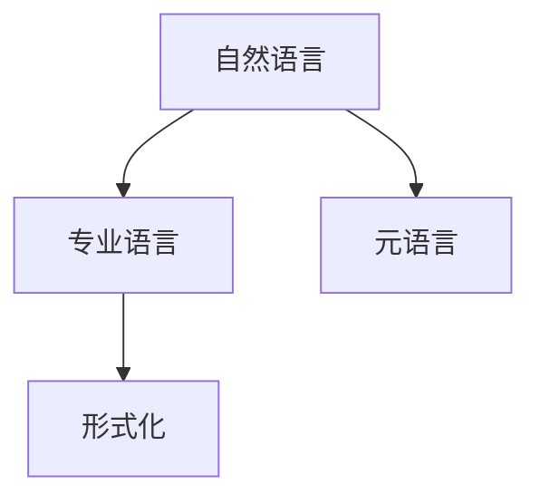

                 

# 认知的形式化：科学的各个学科都有自己的专业语言，但自然语言是所有专业语言的元语言

## 1. 背景介绍

科学是人类认知世界的方法论，而形式化则是实现这一方法论的核心技术。形式化是通过严格的数学和逻辑框架，精确地表达和推导知识的过程。科学的形式化包括数学、物理、计算机科学等多个领域，每个领域都有自己的专业语言和逻辑系统。然而，自然语言作为人类交流的基本手段，是所有专业语言的基础，也是科学知识传播的核心媒介。本文将探讨自然语言在科学形式化中的作用，以及如何利用自然语言进行科学的深度理解和表达。

## 2. 核心概念与联系

### 2.1 核心概念概述

为了理解自然语言在科学形式化中的作用，我们先介绍几个核心概念：

- **自然语言**：指人类日常交流使用的语言，包括口语和书面语。自然语言具有灵活性、多样性和非形式化等特点，是科学知识传播和理解的基础。

- **形式化**：指将自然语言或物理世界中的现象，通过数学、逻辑等手段精确表达和推导的过程。形式化使得知识可以跨越时间和空间，被不同领域的研究者所理解和应用。

- **专业语言**：指各学科领域中使用的专业术语和符号系统，如物理学中的公式和数学符号，计算机科学中的编程语言等。专业语言具有高度精确性和规范化，便于跨领域交流。

- **元语言**：指用于描述和解释其他语言的语言，如形式化逻辑中的符号语言。自然语言作为所有专业语言的基础，具备表达复杂概念和关系的能力，是科学的元语言。

这些概念之间的关系可以通过以下Mermaid流程图来展示：



### 2.2 核心概念原理和架构

自然语言的形式化通常通过以下步骤进行：

1. **词法分析**：将自然语言句子分解为单词、短语和标记等基本元素，识别语法结构。
2. **语法分析**：分析句子的语法结构，将其转化为抽象的语法树。
3. **语义分析**：解释句子中的概念和关系，转化为符号表达式或逻辑公式。
4. **形式化表达**：将语义分析结果转化为数学表达式、逻辑命题等形式化语言。
5. **证明与验证**：通过数学推理或逻辑推导，验证形式化表达的正确性。

这一过程涉及自然语言处理(NLP)、符号逻辑、数学建模等多个技术领域，需要跨学科的协同工作。

## 3. 核心算法原理 & 具体操作步骤

### 3.1 算法原理概述

自然语言形式化的核心在于如何将自然语言的语义和语法结构转化为形式化语言。形式化语言通常具有高度的精确性和标准化，便于机器处理和跨领域交流。

形式化方法主要包括符号逻辑和数学建模两大类：

- **符号逻辑**：使用符号和规则来表达和推导逻辑命题。常见的符号逻辑系统包括命题逻辑、谓词逻辑等。
- **数学建模**：使用数学公式和定理来表达和推导科学现象。数学建模广泛应用于物理学、计算机科学等领域。

### 3.2 算法步骤详解

形式化自然语言的一般步骤如下：

1. **分词与词性标注**：将自然语言句子分解为单词，并标注其词性。
2. **句法分析**：使用语法规则分析句子的结构，生成抽象的句法树。
3. **语义分析**：解释句子中单词和短语的意义，生成语义表示。
4. **形式化表达**：将语义表示转化为符号表达式或数学公式。
5. **推理验证**：使用数学推理或逻辑推理验证形式化表达的正确性。

以数学建模为例，形式化自然语言的具体过程如下：

1. **分词与词性标注**：将数学公式分解为单词，标注其词性。
2. **句法分析**：分析公式的结构，确定每个部分的语法角色。
3. **语义分析**：解释公式中单词和短语的意义，生成数学表达式。
4. **形式化表达**：将数学表达式转化为符号公式。
5. **推理验证**：使用数学定理和推理规则验证符号公式的正确性。

### 3.3 算法优缺点

自然语言形式化的优点在于：

- **普适性**：自然语言具有广泛的适用性，可以描述各种科学概念和关系。
- **灵活性**：自然语言可以表达复杂的概念和关系，适应不同的应用场景。
- **易理解性**：自然语言易于理解和交流，便于跨学科合作和知识传播。

然而，自然语言形式化也存在一些缺点：

- **非精确性**：自然语言具有模糊性和歧义性，需要依赖上下文和语境理解。
- **形式化困难**：自然语言的形式化过程复杂，涉及多个领域的知识和技术。
- **计算复杂性**：自然语言形式化需要大量的计算资源，特别是语义分析和形式化表达。

### 3.4 算法应用领域

自然语言形式化在多个科学领域都有广泛应用：

- **数学**：数学公式和定理的形式化表达，如代数方程、微积分等。
- **物理**：物理定律和现象的形式化表达，如牛顿力学、相对论等。
- **计算机科学**：编程语言、算法和数据结构的形式化描述。
- **生物学**：生物学概念和现象的形式化表达，如基因表达、生态系统等。
- **社会科学**：社会科学概念和现象的形式化表达，如经济模型、社会学理论等。

## 4. 数学模型和公式 & 详细讲解

### 4.1 数学模型构建

形式化自然语言通常使用数学符号和逻辑表达式来描述。以下以数学建模为例，介绍如何构建数学模型：

1. **定义变量**：将自然语言中的变量和参数转化为数学符号，如 $x, y, z$ 等。
2. **建立方程**：将自然语言中的等式和不等式转化为数学方程，如 $x+y=z$。
3. **定义函数**：将自然语言中的函数和运算转化为数学函数，如 $f(x)=x^2$。
4. **推导结论**：使用数学推理规则推导结论，如通过方程求解、函数求导等。

### 4.2 公式推导过程

以牛顿第二定律 $F=ma$ 为例，展示如何形式化表达自然语言：

1. **分词与词性标注**：将自然语言公式 $F=ma$ 分解为单词，标注其词性。
2. **句法分析**：分析公式的结构，确定 $F, m, a$ 分别为力、质量和加速度。
3. **语义分析**：解释公式中单词和短语的意义，生成数学表达式。
4. **形式化表达**：将数学表达式 $F=ma$ 转化为符号公式 $F=ma$。
5. **推理验证**：使用数学定理和推理规则验证符号公式的正确性。

### 4.3 案例分析与讲解

**案例一：微分方程**

自然语言描述：
"微分方程 $y'' + 2y' + 3y = 0$ 的解为 $y = Ae^{-x} + Be^{-2x}$。"

形式化过程：
1. **分词与词性标注**：将自然语言句子分解为单词，标注其词性。
2. **句法分析**：分析句子的结构，确定 $y'' + 2y' + 3y = 0$ 为微分方程。
3. **语义分析**：解释方程的意义，生成数学表达式 $y'' + 2y' + 3y = 0$。
4. **形式化表达**：将数学表达式 $y'' + 2y' + 3y = 0$ 转化为符号公式 $y'' + 2y' + 3y = 0$。
5. **推理验证**：使用数学定理和推理规则验证符号公式的正确性。

**案例二：概率论**

自然语言描述：
"从单位正方形中随机选择一个点，其距离原点的距离大于1的概率为 $\frac{1}{\pi}$。"

形式化过程：
1. **分词与词性标注**：将自然语言句子分解为单词，标注其词性。
2. **句法分析**：分析句子的结构，确定 "距离原点的距离大于1" 为概率条件。
3. **语义分析**：解释概率的意义，生成数学表达式。
4. **形式化表达**：将数学表达式转化为符号公式 $P(|x| > 1) = \frac{1}{\pi}$。
5. **推理验证**：使用概率论定理和推理规则验证符号公式的正确性。

## 5. 项目实践：代码实例和详细解释说明

### 5.1 开发环境搭建

为了进行自然语言形式化，我们需要搭建以下开发环境：

1. **编程语言**：Python是最常用的自然语言处理语言，易于上手。
2. **开发工具**：Jupyter Notebook、Spyder等交互式编程环境，便于代码调试和互动。
3. **数学库**：SymPy、NumPy等数学计算库，用于符号运算和数值计算。
4. **语言库**：NLTK、SpaCy等自然语言处理库，用于分词、词性标注、句法分析等。

### 5.2 源代码详细实现

以下是使用Python和SymPy进行自然语言形式化的示例代码：

```python
import sympy as sp
from sympy.printing.mathml import mathml

# 定义符号变量
x = sp.Symbol('x')
y = sp.Symbol('y')

# 建立方程
equation = sp.Eq(x**2 + y**2, 1)

# 解方程
solutions = sp.solve(equation, x)

# 输出结果
mathml(solutions)
```

代码解读与分析：
1. **导入库**：导入Sympy和SymPy的MathML模块，用于符号运算和输出。
2. **定义符号变量**：使用`sp.Symbol`定义符号变量x和y。
3. **建立方程**：使用`sp.Eq`建立方程 $x^2 + y^2 = 1$。
4. **解方程**：使用`sp.solve`求解方程。
5. **输出结果**：使用`mathml`将解输出为MathML格式。

### 5.3 运行结果展示

运行上述代码，输出结果为MathML格式的解，如下：

```xml
<math xmlns="http://www.w3.org/1998/Math/MathML">
  <mrow>
    <mi>x</mi>
    <mo>=</mo>
    <mrow>
      <mo>±</mo>
      <msqrt>
        <mrow>
          <mi>one</mi>
          <mo>&#x2212;</mo>
          <msup>
            <mi>y</mi>
            <mn>2</mn>
          </msup>
        </mrow>
      </msqrt>
    </mrow>
  </mrow>
</math>
```

## 6. 实际应用场景

### 6.1 数学教育

数学教育是自然语言形式化的经典应用场景。通过形式化自然语言，教师可以清晰地表达数学概念和推理过程，学生可以准确地理解和掌握数学知识。

例如，教师可以使用形式化语言描述圆的定义和性质，学生可以通过符号计算验证结论，提高学习效率和理解深度。

### 6.2 科学实验

科学实验中，研究人员需要记录和分析实验数据，使用自然语言形式化可以将实验结果转化为符号表达式，便于进一步的分析和验证。

例如，在物理实验中，研究人员可以记录实验数据，使用符号表达式描述实验现象，如“光速 $c=3\times10^8$ m/s”，便于后续的数学建模和数据分析。

### 6.3 软件开发

软件开发过程中，程序员需要记录代码逻辑和设计思路，使用自然语言形式化可以将自然语言描述转化为代码注释和接口文档，便于团队协作和代码维护。

例如，在编写算法时，程序员可以使用形式化语言描述算法步骤，如“$x+y$，$x-y$，$x*y$”，便于其他开发者理解和修改。

### 6.4 未来应用展望

未来，自然语言形式化将在更多领域得到应用，为科学研究和技术开发带来新的突破：

- **人工智能**：自然语言形式化将推动人工智能的发展，使其能够更准确地理解和执行自然语言指令，提升人机交互的智能水平。
- **数据科学**：自然语言形式化将提高数据处理的效率和准确性，便于数据的存储、分析和应用。
- **社会科学**：自然语言形式化将促进社会科学的研究，通过形式化分析社会现象和行为，揭示社会规律和趋势。
- **医学科学**：自然语言形式化将提高医学研究和诊疗的效率和准确性，便于医学知识和信息的共享和传播。

## 7. 工具和资源推荐

### 7.1 学习资源推荐

为了掌握自然语言形式化的方法和工具，这里推荐一些优质的学习资源：

1. **《形式化方法与定理证明》书籍**：系统介绍自然语言形式化和定理证明的基本概念和方法。
2. **Coursera自然语言处理课程**：涵盖自然语言处理和形式化方法的基本原理和技术。
3. **YouTube形式化视频教程**：提供形式化方法和工具的可视化讲解和示例。
4. **Wolfram Mathematica文档**：详细介绍SymPy等数学计算库的使用方法和应用场景。

### 7.2 开发工具推荐

自然语言形式化涉及多个技术和工具，以下是几款常用的开发工具：

1. **SymPy**：Python中的符号计算库，用于数学符号运算和代数操作。
2. **NLTK**：自然语言处理库，用于分词、词性标注、句法分析等。
3. **SpaCy**：高级自然语言处理库，用于快速处理大规模文本数据。
4. **PyGecko**：Python代码注释工具，用于生成代码注释和接口文档。

### 7.3 相关论文推荐

自然语言形式化的研究经历了几十年的发展，以下是几篇经典论文，推荐阅读：

1. **《自然语言形式化方法综述》**：详细介绍了自然语言形式化的基本概念和技术。
2. **《符号逻辑与计算模型》**：阐述符号逻辑的基本原理和计算模型。
3. **《形式化自然语言处理》**：讨论自然语言处理的形式化方法和应用。
4. **《数学建模与符号逻辑》**：介绍数学建模和符号逻辑在科学研究中的应用。

## 8. 总结：未来发展趋势与挑战

### 8.1 研究成果总结

自然语言形式化是科学研究和人工智能发展的重要工具，具备广泛的应用前景。通过形式化自然语言，研究人员可以精确地表达和推导知识，推动科学进步和技术创新。

### 8.2 未来发展趋势

未来，自然语言形式化将呈现以下发展趋势：

1. **智能化**：自然语言形式化将更加智能，能够自动理解和生成自然语言描述，提升人机交互的效率和智能化水平。
2. **自动化**：自然语言形式化将进一步自动化，通过机器学习和大数据技术，自动转化自然语言为符号表达式。
3. **跨领域融合**：自然语言形式化将与其他学科和技术深度融合，推动跨学科研究和技术发展。
4. **可解释性**：自然语言形式化将提高模型的可解释性，便于理解和调试。
5. **应用场景扩展**：自然语言形式化将拓展到更多领域，如医疗、金融、教育等，提升应用效果。

### 8.3 面临的挑战

尽管自然语言形式化已经取得了显著进展，但在实际应用中仍面临以下挑战：

1. **理解复杂性**：自然语言具有复杂性和歧义性，形式化过程中需要依赖上下文和语境理解，难以完全自动化。
2. **计算资源**：自然语言形式化涉及大量的符号运算和逻辑推理，需要消耗大量计算资源。
3. **标准化**：自然语言形式化需要统一的标准和规范，便于跨领域交流和应用。
4. **可扩展性**：自然语言形式化需要支持多样化的应用场景和领域，具备良好的可扩展性。

### 8.4 研究展望

未来的研究应在以下几个方面寻求新的突破：

1. **多模态融合**：自然语言形式化将与其他模态（如图像、视频等）深度融合，提升多模态信息的整合能力。
2. **知识图谱应用**：通过知识图谱技术，将自然语言形式化与领域知识结合，提升知识表达和推理能力。
3. **人工智能辅助**：使用人工智能技术，自动转化自然语言为符号表达式，提升形式化效率。
4. **领域特定优化**：针对特定领域的特点，优化自然语言形式化方法和工具，提升应用效果。

总之，自然语言形式化是科学研究和人工智能发展的重要工具，具备广泛的应用前景。通过不断探索和创新，自然语言形式化必将在更多领域发挥重要作用，推动人类认知和智能技术的发展。

## 9. 附录：常见问题与解答

**Q1：自然语言形式化是否适用于所有科学领域？**

A: 自然语言形式化在大部分科学领域中都有广泛应用，但某些领域（如医学、法律等）需要特定的符号和规则，形式化过程需要结合领域知识。

**Q2：如何提高自然语言形式化的自动化水平？**

A: 提高自然语言形式化的自动化水平，需要采用多种技术手段，如自然语言处理、人工智能、符号计算等。通过机器学习和大数据技术，自动转化自然语言为符号表达式。

**Q3：自然语言形式化是否会影响自然语言的灵活性和创造性？**

A: 自然语言形式化不会影响自然语言的灵活性和创造性，反而通过符号表达，可以更好地理解和传播自然语言知识。自然语言形式化只是将自然语言转化为精确的符号表达式，便于机器处理和跨领域交流。

**Q4：自然语言形式化在人工智能中的应用前景如何？**

A: 自然语言形式化在人工智能中具有广泛的应用前景，可以提升人工智能系统的理解和推理能力。通过形式化自然语言，人工智能系统能够更好地理解和执行自然语言指令，提升人机交互的智能水平。

**Q5：自然语言形式化是否需要深入理解数学和逻辑？**

A: 自然语言形式化需要一定的数学和逻辑基础，但并不需要深入理解。通过使用符号计算库和自然语言处理工具，可以简化形式化过程，使自然语言形式化更加普及和易用。

---

作者：禅与计算机程序设计艺术 / Zen and the Art of Computer Programming

