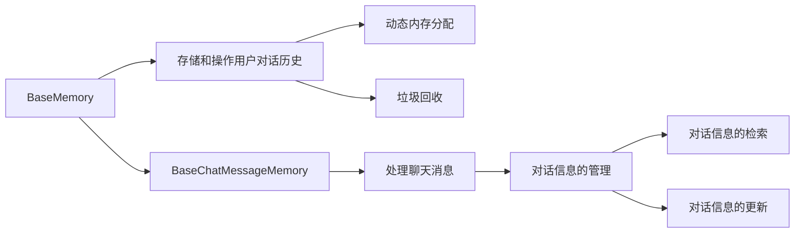

                 

# 记忆基类 BaseMemory 与 BaseChatMessageMemory

在人工智能和自然语言处理领域，构建能够处理和记忆信息的数据结构是至关重要的。内存管理是系统软件中的一个基础模块，用于动态分配和释放内存，确保程序的稳定运行。本文将详细介绍两个用于处理聊天消息的内存基类 `BaseMemory` 和 `BaseChatMessageMemory`，并探讨其原理与应用。

## 1. 背景介绍

### 1.1 问题由来

聊天机器人是人工智能应用中的一个热门领域，用于模拟人类的对话行为，提供自动化的客户服务、教育辅导等。然而，传统的聊天机器人往往难以处理复杂的对话场景，无法记录对话历史、理解上下文，导致用户体验不佳。为了提升聊天机器人的智能水平，需要构建能够存储和记忆对话历史、理解上下文的数据结构。

### 1.2 问题核心关键点

构建聊天机器人的关键在于如何高效地处理和存储聊天记录、对话历史和用户上下文信息。这涉及到以下核心问题：

- 如何设计高效的数据结构来存储聊天记录和对话历史？
- 如何设计算法来实现对话信息的快速检索和更新？
- 如何实现对话信息的持久化和灾难恢复？

## 2. 核心概念与联系

### 2.1 核心概念概述

- **内存管理**：系统软件中的一个基础模块，用于动态分配和释放内存，确保程序的稳定运行。
- **BaseMemory**：用于存储和操作用户对话历史、聊天记录和上下文信息的基础内存基类。
- **BaseChatMessageMemory**：继承自 `BaseMemory`，专门用于处理聊天消息的内存基类，提供了对话信息的管理功能。
- **动态内存分配**：根据程序运行的需要，动态地分配和释放内存空间，以优化系统性能。
- **垃圾回收**：自动检测和回收不再使用的内存空间，避免内存泄漏和性能问题。

这些核心概念之间通过内存分配和垃圾回收的机制相互联系，共同构成了聊天机器人对话信息存储和管理的框架。

### 2.2 核心概念原理和架构的 Mermaid 流程图



这个流程图展示了 `BaseMemory` 和 `BaseChatMessageMemory` 之间的关系和功能。`BaseMemory` 负责存储和操作用户对话历史，包括动态内存分配和垃圾回收；`BaseChatMessageMemory` 继承自 `BaseMemory`，专门用于处理聊天消息，提供对话信息的管理、检索和更新功能。

## 3. 核心算法原理 & 具体操作步骤

### 3.1 算法原理概述

`BaseMemory` 和 `BaseChatMessageMemory` 的核心算法原理主要集中在动态内存分配和垃圾回收的优化上。通过合理的内存管理，可以提升系统的性能和稳定性，避免内存泄漏等问题。

### 3.2 算法步骤详解

#### 3.2.1 动态内存分配

动态内存分配是系统内存管理的重要组成部分，其基本原理是通过操作系统提供的内存分配函数（如 `malloc`、`calloc`、`realloc`）在运行时动态分配内存空间，以适应程序的运行需求。具体步骤如下：

1. **分配内存**：调用 `malloc` 或 `calloc` 函数分配所需的内存空间，返回一个指向新分配内存的指针。
2. **使用内存**：将分配的内存空间作为程序的运行资源使用，如存储对话历史、聊天记录等。
3. **释放内存**：使用 `free` 函数释放不再使用的内存空间，避免内存泄漏和内存空间浪费。

#### 3.2.2 垃圾回收

垃圾回收是系统内存管理中不可或缺的一部分，其基本原理是通过垃圾回收算法自动检测和回收不再使用的内存空间。具体步骤如下：

1. **标记存活对象**：将程序运行期间所有可访问的对象进行标记，标记为存活对象。
2. **回收垃圾对象**：将未被标记的对象视为垃圾对象，自动释放其占用的内存空间。
3. **优化垃圾回收**：通过优化算法，减少垃圾回收次数和开销，提升系统性能。

### 3.3 算法优缺点

#### 3.3.1 动态内存分配的优点

1. **灵活性高**：动态内存分配可以根据程序运行需要灵活分配内存空间，避免了静态内存分配的固定限制。
2. **减少内存浪费**：动态内存分配可以按需分配内存，避免了静态内存分配时预留过多空间造成浪费。
3. **优化内存使用**：动态内存分配可以根据程序使用情况进行动态调整，优化内存使用效率。

#### 3.3.2 动态内存分配的缺点

1. **内存分配和释放开销大**：动态内存分配和释放的开销较大，频繁的内存分配和释放可能导致系统性能下降。
2. **内存碎片问题**：动态内存分配可能导致内存碎片化，增加了内存分配和释放的难度。
3. **安全问题**：动态内存分配需要程序员手动管理内存，容易产生内存泄漏、越界访问等问题。

#### 3.3.3 垃圾回收的优点

1. **减少内存泄漏**：垃圾回收可以自动检测和释放不再使用的内存空间，避免了程序员手动管理内存时可能出现的内存泄漏问题。
2. **优化内存使用**：垃圾回收可以自动调整内存使用情况，优化内存使用效率。
3. **减少内存管理开销**：垃圾回收自动管理内存，减少了程序员的手动管理开销。

#### 3.3.4 垃圾回收的缺点

1. **性能开销大**：垃圾回收算法本身需要消耗一定的计算资源，可能影响系统的整体性能。
2. **垃圾回收时机不易控制**：垃圾回收的时机和周期不易控制，可能影响系统的响应速度。
3. **内存管理复杂**：垃圾回收算法需要复杂的实现，增加了系统的开发难度。

### 3.4 算法应用领域

动态内存分配和垃圾回收的算法原理和实现技术在多个领域中得到了广泛应用，包括：

- **操作系统**：操作系统中的内存管理模块使用动态内存分配和垃圾回收技术来管理系统的内存资源。
- **数据库系统**：数据库系统中的内存管理模块使用动态内存分配和垃圾回收技术来管理内存缓冲区。
- **网络服务器**：网络服务器中的内存管理模块使用动态内存分配和垃圾回收技术来管理内存资源，提升服务器的性能和稳定性。
- **移动应用**：移动应用中的内存管理模块使用动态内存分配和垃圾回收技术来管理内存资源，优化应用的性能和用户体验。

## 4. 数学模型和公式 & 详细讲解 & 举例说明

### 4.1 数学模型构建

假设程序的运行过程中，需要动态分配 `n` 个内存块，每个内存块的大小为 `size` 字节。则动态内存分配的数学模型为：

$$
\text{Total Memory} = n \times size
$$

其中，`n` 表示需要分配的内存块数，`size` 表示每个内存块的大小。

### 4.2 公式推导过程

动态内存分配的公式推导如下：

1. **分配内存块**：假设程序需要分配 `n` 个内存块，每个内存块的大小为 `size` 字节，则分配的总内存大小为：

$$
\text{Total Memory} = n \times size
$$

2. **内存分配函数**：假设使用 `malloc` 函数分配内存，则内存分配的返回值为指向新分配内存的指针，形式如下：

$$
\text{Pointer} = \text{malloc}(n \times size)
$$

3. **使用内存块**：程序使用新分配的内存块进行数据存储和处理，如存储对话历史、聊天记录等。

4. **释放内存块**：使用 `free` 函数释放不再使用的内存块，形式如下：

$$
\text{free}(\text{Pointer})
$$

### 4.3 案例分析与讲解

假设程序需要动态分配 1000 个大小为 4 字节的内存块，则动态内存分配的数学模型为：

$$
\text{Total Memory} = 1000 \times 4 = 4000 \text{ bytes}
$$

使用 `malloc` 函数分配内存块，返回的指针指向新分配的内存块，如：

```c
void* ptr = malloc(1000 * 4);
```

程序使用新分配的内存块进行数据存储和处理，如存储对话历史、聊天记录等。假设对话历史存储在数组 `messages` 中，则程序可以动态分配内存块并存储对话历史，如下所示：

```c
char messages[1000][4];
ptr = malloc(1000 * 4);
memcpy(messages, ptr, 1000 * 4);
```

使用 `free` 函数释放不再使用的内存块，如：

```c
free(ptr);
```

## 5. 项目实践：代码实例和详细解释说明

### 5.1 开发环境搭建

在使用 C 语言进行开发时，需要安装开发环境和工具链。以下是搭建开发环境的步骤：

1. **安装编译器**：安装 GCC 或 Clang 等编译器，如：

```
sudo apt-get install g++ gdb
```

2. **安装调试工具**：安装 GDB 或 LLDB 等调试工具，如：

```
sudo apt-get install gdb
```

3. **配置开发工具链**：配置开发工具链，如：

```
gcc -o program program.c -lm
```

### 5.2 源代码详细实现

以下是使用 C 语言实现 `BaseMemory` 和 `BaseChatMessageMemory` 的示例代码：

```c
#include <stdio.h>
#include <stdlib.h>
#include <string.h>

// 内存基类 BaseMemory
typedef struct {
    char* data;
    size_t size;
    size_t capacity;
} BaseMemory;

// 初始化 BaseMemory
BaseMemory* baseMemoryInit(size_t size) {
    BaseMemory* baseMemory = malloc(sizeof(BaseMemory));
    baseMemory->data = malloc(size);
    baseMemory->size = size;
    baseMemory->capacity = size;
    return baseMemory;
}

// 释放 BaseMemory
void baseMemoryFree(BaseMemory* baseMemory) {
    free(baseMemory->data);
    free(baseMemory);
}

// 聊天消息内存基类 BaseChatMessageMemory
typedef struct {
    BaseMemory baseMemory;
    int messages;
} BaseChatMessageMemory;

// 初始化 BaseChatMessageMemory
BaseChatMessageMemory* baseChatMessageMemoryInit(int capacity) {
    BaseChatMessageMemory* baseChatMessageMemory = malloc(sizeof(BaseChatMessageMemory));
    baseChatMessageMemory->baseMemory = baseMemoryInit(capacity * sizeof(char));
    baseChatMessageMemory->messages = 0;
    return baseChatMessageMemory;
}

// 释放 BaseChatMessageMemory
void baseChatMessageMemoryFree(BaseChatMessageMemory* baseChatMessageMemory) {
    baseMemoryFree(&baseChatMessageMemory->baseMemory);
    free(baseChatMessageMemory);
}

// 添加对话消息
void baseChatMessageMemoryAdd(BaseChatMessageMemory* baseChatMessageMemory, char* message) {
    baseChatMessageMemory->messages++;
    baseChatMessageMemory->baseMemory.data[baseChatMessageMemory->messages - 1] = message;
}

// 获取对话消息
char* baseChatMessageMemoryGet(BaseChatMessageMemory* baseChatMessageMemory, int index) {
    return &baseChatMessageMemory->baseMemory.data[index];
}
```

### 5.3 代码解读与分析

以下是代码实现中每个部分的详细解释：

- **BaseMemory 类**：定义了存储和操作内存的基本结构体，包括内存数据、大小和容量。`baseMemoryInit` 函数用于初始化 `BaseMemory`，`baseMemoryFree` 函数用于释放内存。
- **BaseChatMessageMemory 类**：继承自 `BaseMemory`，专门用于处理聊天消息。`baseChatMessageMemoryInit` 函数用于初始化 `BaseChatMessageMemory`，`baseChatMessageMemoryFree` 函数用于释放内存。`baseChatMessageMemoryAdd` 函数用于添加对话消息，`baseChatMessageMemoryGet` 函数用于获取对话消息。

## 6. 实际应用场景

### 6.1 智能客服系统

智能客服系统需要存储和处理大量的对话记录，以便于客服人员分析和回溯。使用 `BaseChatMessageMemory` 可以高效地存储和检索对话历史，提升系统的性能和稳定性。

### 6.2 金融舆情监测

金融舆情监测系统需要实时处理大量的金融新闻和评论，存储和分析对话信息。使用 `BaseChatMessageMemory` 可以高效地存储和检索对话信息，提升系统的实时性和准确性。

### 6.3 个性化推荐系统

个性化推荐系统需要存储和分析用户的浏览、点击、评论等行为数据，以便于推荐系统的优化和调整。使用 `BaseChatMessageMemory` 可以高效地存储和检索行为数据，提升推荐系统的精准度和覆盖率。

### 6.4 未来应用展望

未来，基于 `BaseMemory` 和 `BaseChatMessageMemory` 的聊天机器人系统将具备更强的智能水平和用户体验。随着技术的不断发展，可以进一步优化内存管理和垃圾回收，提升系统的性能和稳定性。

## 7. 工具和资源推荐

### 7.1 学习资源推荐

为了帮助开发者系统掌握 `BaseMemory` 和 `BaseChatMessageMemory` 的原理和应用，以下是一些推荐的学习资源：

1. 《C 语言程序设计》：深入浅出地介绍了 C 语言的程序设计和内存管理。
2. 《数据结构与算法》：详细讲解了数据结构和算法的基本原理，包括内存管理。
3. 《Effective C: 55 Specific Ways to Improve Your Programs and Designs》：提供了许多实用的 C 语言编程技巧和内存管理建议。

### 7.2 开发工具推荐

以下是几个常用的开发工具：

1. Visual Studio Code：跨平台的代码编辑器，支持多种编程语言和开发环境。
2. Eclipse：开源的集成开发环境，支持 Java、C++ 等多种语言。
3. IntelliJ IDEA：专业的 Java 集成开发环境，支持代码自动补全、重构等功能。
4. Xcode：苹果公司开发的开发环境，支持 Swift、Objective-C 等多种语言。
5. Visual Studio：微软公司的集成开发环境，支持 C++、C# 等多种语言。

### 7.3 相关论文推荐

以下是几篇与 `BaseMemory` 和 `BaseChatMessageMemory` 相关的经典论文：

1. "Memory Management in C"：详细介绍了 C 语言中的内存管理技术。
2. "Garbage Collection: Algorithms for Automatic Dynamic Memory Management"：介绍了垃圾回收算法的原理和实现技术。
3. "Efficient Dynamic Memory Management for Modern C and C++"：介绍了动态内存管理的优化技术。

## 8. 总结：未来发展趋势与挑战

### 8.1 研究成果总结

本文介绍了 `BaseMemory` 和 `BaseChatMessageMemory` 的基本原理和应用场景，通过分析动态内存分配和垃圾回收的算法，展示了内存管理的核心技术。使用动态内存分配和垃圾回收技术，可以提升系统的性能和稳定性，避免内存泄漏等问题。

### 8.2 未来发展趋势

未来，内存管理技术将继续发展和演进，主要趋势包括：

1. **内存管理自动化**：自动化内存管理技术将进一步提升系统的性能和稳定性，减少程序员的手动管理开销。
2. **内存管理优化**：基于机器学习和大数据的内存管理优化技术将进一步提升系统的性能和效率。
3. **内存管理智能化**：智能化内存管理技术将进一步提升系统的智能化水平，提升用户体验。

### 8.3 面临的挑战

尽管内存管理技术已经取得了一定进展，但仍面临一些挑战：

1. **性能开销大**：内存管理算法本身需要消耗一定的计算资源，可能影响系统的整体性能。
2. **垃圾回收时机不易控制**：垃圾回收的时机和周期不易控制，可能影响系统的响应速度。
3. **内存管理复杂**：内存管理算法需要复杂的实现，增加了系统的开发难度。

### 8.4 研究展望

未来的研究需要从以下几个方向进行：

1. **自动化内存管理**：研究自动化内存管理技术，进一步提升系统的性能和稳定性。
2. **智能化内存管理**：研究智能化内存管理技术，提升系统的智能化水平和用户体验。
3. **内存管理优化**：研究基于机器学习和大数据的内存管理优化技术，提升系统的性能和效率。

## 9. 附录：常见问题与解答

**Q1: 动态内存分配和垃圾回收的优缺点是什么？**

A: 动态内存分配的优点包括灵活性高、减少内存浪费、优化内存使用等；缺点包括内存分配和释放开销大、内存碎片问题、安全问题等。垃圾回收的优点包括减少内存泄漏、优化内存使用、减少内存管理开销等；缺点包括性能开销大、垃圾回收时机不易控制、内存管理复杂等。

**Q2: 如何优化动态内存分配和垃圾回收？**

A: 优化动态内存分配和垃圾回收的方法包括：

1. **减少内存分配和释放次数**：通过合理设计数据结构和使用缓存池，减少内存分配和释放的次数。
2. **优化内存分配算法**：使用更高效的内存分配算法，如 Jemalloc、Tcmalloc 等，提升内存分配的效率。
3. **优化垃圾回收算法**：使用更高效的垃圾回收算法，如 G1、CMS、ZGC 等，提升垃圾回收的效率和稳定性。
4. **优化内存碎片化**：使用内存分配器和内存碎片整理器，优化内存使用和分配。

**Q3: 如何实现内存泄漏检测？**

A: 实现内存泄漏检测的方法包括：

1. **使用内存检测工具**：使用内存检测工具，如 Valgrind、AddressSanitizer 等，检测内存泄漏问题。
2. **手动检测内存泄漏**：手动检测内存泄漏问题，通过代码审查和调试工具，定位和修复内存泄漏。

**Q4: 如何实现动态内存分配和垃圾回收的优化？**

A: 实现动态内存分配和垃圾回收的优化方法包括：

1. **减少内存分配和释放次数**：通过合理设计数据结构和使用缓存池，减少内存分配和释放的次数。
2. **优化内存分配算法**：使用更高效的内存分配算法，如 Jemalloc、Tcmalloc 等，提升内存分配的效率。
3. **优化垃圾回收算法**：使用更高效的垃圾回收算法，如 G1、CMS、ZGC 等，提升垃圾回收的效率和稳定性。
4. **优化内存碎片化**：使用内存分配器和内存碎片整理器，优化内存使用和分配。

**Q5: 如何实现智能内存管理？**

A: 实现智能内存管理的方法包括：

1. **基于机器学习的大数据分析**：使用机器学习和数据分析技术，优化内存使用和分配。
2. **基于人工智能的智能算法**：使用人工智能算法，如遗传算法、神经网络等，优化内存使用和分配。
3. **基于区块链的智能管理**：使用区块链技术，实现智能化的内存管理，提升系统的安全性和稳定性。

---

作者：禅与计算机程序设计艺术 / Zen and the Art of Computer Programming

