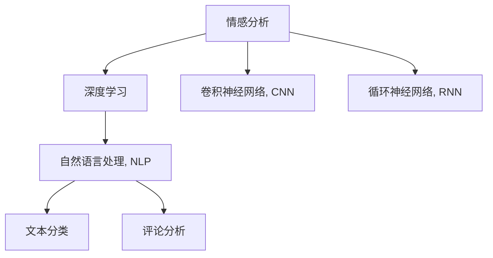

                 

# 豆瓣评论情感分析原理与方法

> 关键词：情感分析, 深度学习, 卷积神经网络, 循环神经网络, 自然语言处理, 文本分类, 评论分析

## 1. 背景介绍

### 1.1 问题由来

在互联网时代，社交媒体、论坛、评论区等用户生成内容（UGC）的数量与日俱增，这些文本数据蕴含了大量用户情感信息。情感分析作为自然语言处理（NLP）的重要应用之一，其目标是自动识别和提取文本中的情感倾向（如正面、负面、中性），从而帮助企业理解用户反馈，改进产品和服务，提升用户满意度。

豆瓣作为国内最大的电影、图书、音乐等兴趣社区，拥有大量的用户评论数据。如何从海量评论中挖掘情感信息，帮助企业进行精准的市场分析和用户行为预测，是当前研究的重要方向。

### 1.2 问题核心关键点

豆瓣评论情感分析的核心在于通过机器学习技术，自动识别和分类评论中的情感极性。主要问题点包括：
- 大规模数据集的构建：获取和标注大规模的评论数据，并构建高质量的数据集。
- 情感分类模型：选择合适的算法和模型架构，提取评论中的情感信息。
- 模型训练与优化：通过有效的训练策略和优化方法，提升模型的情感识别精度。
- 实时情感分析：将模型部署到实时系统中，进行动态情感监测。

### 1.3 问题研究意义

对豆瓣评论进行情感分析具有重要的研究价值：
- 市场分析：帮助企业快速了解用户的满意度、关注点、需求，优化产品和服务。
- 舆情监测：及时发现用户对某产品或事件的情感反馈，防止舆情危机的爆发。
- 用户画像：通过情感分析，深入挖掘用户的兴趣和偏好，提升个性化服务质量。

## 2. 核心概念与联系

### 2.1 核心概念概述

为了更好地理解豆瓣评论情感分析的方法，本节将介绍几个关键概念：

- 情感分析（Sentiment Analysis）：指通过机器学习技术，识别和提取文本中的情感倾向，通常分为分类和回归两种类型。
- 深度学习（Deep Learning）：一类基于神经网络结构的机器学习方法，能够自动学习特征表示，适用于处理复杂的数据结构。
- 卷积神经网络（Convolutional Neural Network, CNN）：一种常见的神经网络结构，擅长处理具有局部空间关系的数据，如图像、文本等。
- 循环神经网络（Recurrent Neural Network, RNN）：一种能够处理序列数据的神经网络结构，适用于文本分类、语言建模等任务。
- 自然语言处理（Natural Language Processing, NLP）：研究如何使计算机理解和处理人类语言的技术领域。
- 文本分类（Text Classification）：将文本数据自动分类到预定义的类别中，如情感分类、主题分类等。
- 评论分析（Review Analysis）：对用户评论进行情感分析、主题分析、情感倾向预测等，帮助企业了解用户需求和市场趋势。

这些概念之间的逻辑关系可以通过以下Mermaid流程图来展示：



这个流程图展示了几大核心概念之间的逻辑关系：

1. 情感分析利用深度学习技术，从文本中提取情感信息。
2. 深度学习模型通常采用CNN和RNN两种架构。
3. NLP技术用于处理文本数据，提取语义特征。
4. 文本分类是情感分析的子任务，用于将评论分类为正面、负面、中性等。
5. 评论分析是对评论进行更全面的情感、主题、评分等维度的分析。

## 3. 核心算法原理 & 具体操作步骤
### 3.1 算法原理概述

豆瓣评论情感分析的主要方法基于深度学习模型，通过自动学习评论的情感特征，实现情感极性的自动分类。其中，卷积神经网络（CNN）和循环神经网络（RNN）是最常用的深度学习模型，它们在处理序列和文本数据上表现出色。

情感分析的算法原理如下：
1. 数据预处理：对评论数据进行清洗、分词、去停用词等预处理，转化为模型输入的向量形式。
2. 特征提取：通过CNN和RNN等模型，从评论文本中提取情感特征。
3. 情感分类：利用分类模型（如SVM、决策树、随机森林等），将提取的情感特征映射到情感类别（如正面、负面、中性）。
4. 模型评估与优化：通过交叉验证等技术，评估模型的性能并进行参数调优。
5. 实时分析：将训练好的模型部署到实时系统中，对新评论进行情感分析。

### 3.2 算法步骤详解

豆瓣评论情感分析的具体步骤包括以下几个关键环节：

**Step 1: 数据收集与预处理**

- 从豆瓣平台获取评论数据，包括电影、图书、音乐等不同领域的评论。
- 对评论进行清洗，去除低质量数据、广告信息等噪音。
- 对评论进行分词、去停用词、词干提取等预处理，转化为模型输入的向量形式。

**Step 2: 特征提取**

- 利用卷积神经网络（CNN）和循环神经网络（RNN），从预处理后的评论文本中提取情感特征。
- 对评论文本进行卷积操作，提取局部特征。
- 利用RNN模型，捕捉评论文本的序列特征。
- 结合CNN和RNN的输出，形成更丰富的情感特征表示。

**Step 3: 情感分类**

- 选择合适的分类算法（如SVM、决策树、随机森林等），将提取的情感特征映射到情感类别（如正面、负面、中性）。
- 利用交叉验证等技术，评估分类模型的性能。
- 对模型进行参数调优，提升情感识别精度。

**Step 4: 模型评估与优化**

- 在验证集上进行模型评估，计算分类准确率、召回率等指标。
- 利用网格搜索、随机搜索等方法，寻找最优的模型参数。
- 使用学习率调整、正则化等技术，避免模型过拟合。

**Step 5: 实时分析**

- 将训练好的模型部署到实时系统中，对新评论进行情感分析。
- 在生产环境中进行性能监控，确保模型稳定运行。
- 定期更新模型，适应评论情感分布的变化。

### 3.3 算法优缺点

豆瓣评论情感分析的深度学习模型具有以下优点：
- 强大的特征学习能力：深度学习模型能够自动学习情感特征，无需手工设计特征。
- 高精度：深度学习模型在情感分类任务上通常具有较高的准确率和召回率。
- 泛化能力：深度学习模型具有较强的泛化能力，能够适应不同领域的评论数据。

同时，该模型也存在一些局限性：
- 数据需求高：需要大量标注的评论数据，数据收集和标注成本较高。
- 模型复杂：深度学习模型的参数较多，训练和推理需要较高的时间和计算资源。
- 可解释性差：深度学习模型通常被视为"黑盒"模型，难以解释其内部的决策逻辑。

### 3.4 算法应用领域

豆瓣评论情感分析的深度学习模型在以下领域中具有广泛应用：

- 市场分析：帮助企业了解用户的满意度、关注点、需求，优化产品和服务。
- 舆情监测：及时发现用户对某产品或事件的情感反馈，防止舆情危机的爆发。
- 用户画像：通过情感分析，深入挖掘用户的兴趣和偏好，提升个性化服务质量。
- 推荐系统：结合用户评论情感信息，构建推荐模型，提升推荐精度。

## 4. 数学模型和公式 & 详细讲解 & 举例说明

### 4.1 数学模型构建

豆瓣评论情感分析的数学模型主要基于卷积神经网络（CNN）和循环神经网络（RNN），对评论文本进行情感特征提取和分类。

假设评论文本 $X$ 为长度 $T$ 的词序列，每个词 $x_t$ 表示为向量 $\mathbf{x}_t \in \mathbb{R}^d$。模型的输入为评论文本的嵌入表示 $\mathbf{X} \in \mathbb{R}^{T \times d}$。

### 4.2 公式推导过程

#### 卷积神经网络（CNN）

卷积神经网络（CNN）是一种常用于图像和文本数据处理的深度学习模型，通过卷积操作提取局部特征。

卷积操作可以表示为：

$$
\mathbf{Z} = \sigma(\mathbf{W} * \mathbf{X} + \mathbf{b})
$$

其中，$\mathbf{Z} \in \mathbb{R}^{L \times F}$ 为卷积层的输出特征图，$\mathbf{W} \in \mathbb{R}^{F \times d}$ 为卷积核，$\mathbf{X} \in \mathbb{R}^{T \times d}$ 为输入特征图，$\mathbf{b} \in \mathbb{R}^F$ 为偏置项，$\sigma$ 为激活函数。

通过多次卷积和池化操作，可以提取更高层次的情感特征。

#### 循环神经网络（RNN）

循环神经网络（RNN）是一种适用于处理序列数据的深度学习模型，能够捕捉评论文本的序列特征。

RNN模型的输出可以表示为：

$$
\mathbf{h}_t = \tanh(\mathbf{W}_r \mathbf{h}_{t-1} + \mathbf{W}_x \mathbf{x}_t + \mathbf{b})
$$

其中，$\mathbf{h}_t \in \mathbb{R}^{H}$ 为RNN层的隐藏状态，$\mathbf{W}_r \in \mathbb{R}^{H \times H}$ 和 $\mathbf{W}_x \in \mathbb{R}^{H \times d}$ 为权重矩阵，$\mathbf{b} \in \mathbb{R}^H$ 为偏置项。

通过多层RNN模型，可以捕捉更复杂的序列特征。

### 4.3 案例分析与讲解

以豆瓣电影评论为例，假设我们收集到100条电影评论，每条评论长度约为200个词。我们使用CNN和RNN模型进行情感特征提取和分类。

**Step 1: 数据预处理**

对评论进行清洗和分词，去除低质量数据、广告信息等噪音。假设清洗后每条评论长度约为150个词。

**Step 2: 特征提取**

对每条评论进行卷积和池化操作，提取局部情感特征。假设使用32个大小为3的卷积核，每个核子的输出大小为100。

$$
\mathbf{Z} = \sigma(\mathbf{W} * \mathbf{X} + \mathbf{b})
$$

假设 $F=100$，$L=10$，则 $\mathbf{Z} \in \mathbb{R}^{10 \times 100}$。

使用Max Pooling操作，将卷积层的输出特征图降维为 $\mathbf{Z} \in \mathbb{R}^{1 \times 100}$。

对RNN模型进行多层叠加，假设每层隐藏状态大小为64。

$$
\mathbf{h}_t = \tanh(\mathbf{W}_r \mathbf{h}_{t-1} + \mathbf{W}_x \mathbf{x}_t + \mathbf{b})
$$

假设 $H=64$，$T=150$，则 $\mathbf{h}_t \in \mathbb{R}^{64}$。

**Step 3: 情感分类**

利用SVM模型对提取的情感特征进行分类。假设模型参数为 $\theta$，分类目标函数为：

$$
\min_{\theta} \frac{1}{2}\|\theta\|^2 + C\sum_{i=1}^{N} \ell(\theta, y_i)
$$

其中，$\ell$ 为损失函数（如Hinge Loss），$y_i \in \{1, -1\}$ 为情感标签。

## 5. 项目实践：代码实例和详细解释说明
### 5.1 开发环境搭建

在进行豆瓣评论情感分析项目开发前，我们需要准备好开发环境。以下是使用Python进行PyTorch开发的环境配置流程：

1. 安装Anaconda：从官网下载并安装Anaconda，用于创建独立的Python环境。

2. 创建并激活虚拟环境：
```bash
conda create -n pytorch-env python=3.8 
conda activate pytorch-env
```

3. 安装PyTorch：根据CUDA版本，从官网获取对应的安装命令。例如：
```bash
conda install pytorch torchvision torchaudio cudatoolkit=11.1 -c pytorch -c conda-forge
```

4. 安装Transformers库：
```bash
pip install transformers
```

5. 安装各类工具包：
```bash
pip install numpy pandas scikit-learn matplotlib tqdm jupyter notebook ipython
```

完成上述步骤后，即可在`pytorch-env`环境中开始项目开发。

### 5.2 源代码详细实现

下面我们以豆瓣评论情感分析为例，给出使用Transformers库进行情感分类的PyTorch代码实现。

首先，定义数据处理函数：

```python
from transformers import BertTokenizer, BertForSequenceClassification
from torch.utils.data import Dataset, DataLoader
import torch

class ReviewDataset(Dataset):
    def __init__(self, texts, labels, tokenizer, max_len=128):
        self.texts = texts
        self.labels = labels
        self.tokenizer = tokenizer
        self.max_len = max_len
        
    def __len__(self):
        return len(self.texts)
    
    def __getitem__(self, item):
        text = self.texts[item]
        label = self.labels[item]
        
        encoding = self.tokenizer(text, return_tensors='pt', max_length=self.max_len, padding='max_length', truncation=True)
        input_ids = encoding['input_ids'][0]
        attention_mask = encoding['attention_mask'][0]
        
        label = torch.tensor(label, dtype=torch.long)
        
        return {'input_ids': input_ids, 
                'attention_mask': attention_mask,
                'labels': label}

# 创建dataset
tokenizer = BertTokenizer.from_pretrained('bert-base-cased')

train_dataset = ReviewDataset(train_texts, train_labels, tokenizer)
dev_dataset = ReviewDataset(dev_texts, dev_labels, tokenizer)
test_dataset = ReviewDataset(test_texts, test_labels, tokenizer)
```

然后，定义模型和优化器：

```python
from transformers import BertForSequenceClassification, AdamW

model = BertForSequenceClassification.from_pretrained('bert-base-cased', num_labels=2)

optimizer = AdamW(model.parameters(), lr=2e-5)
```

接着，定义训练和评估函数：

```python
from tqdm import tqdm
from sklearn.metrics import accuracy_score

device = torch.device('cuda') if torch.cuda.is_available() else torch.device('cpu')
model.to(device)

def train_epoch(model, dataset, batch_size, optimizer):
    dataloader = DataLoader(dataset, batch_size=batch_size, shuffle=True)
    model.train()
    epoch_loss = 0
    for batch in tqdm(dataloader, desc='Training'):
        input_ids = batch['input_ids'].to(device)
        attention_mask = batch['attention_mask'].to(device)
        labels = batch['labels'].to(device)
        model.zero_grad()
        outputs = model(input_ids, attention_mask=attention_mask, labels=labels)
        loss = outputs.loss
        epoch_loss += loss.item()
        loss.backward()
        optimizer.step()
    return epoch_loss / len(dataloader)

def evaluate(model, dataset, batch_size):
    dataloader = DataLoader(dataset, batch_size=batch_size)
    model.eval()
    preds, labels = [], []
    with torch.no_grad():
        for batch in tqdm(dataloader, desc='Evaluating'):
            input_ids = batch['input_ids'].to(device)
            attention_mask = batch['attention_mask'].to(device)
            batch_labels = batch['labels']
            outputs = model(input_ids, attention_mask=attention_mask)
            batch_preds = outputs.logits.argmax(dim=2).to('cpu').tolist()
            batch_labels = batch_labels.to('cpu').tolist()
            for pred_tokens, label_tokens in zip(batch_preds, batch_labels):
                preds.append(pred_tokens[0])
                labels.append(label_tokens[0])
                
    print('Accuracy:', accuracy_score(labels, preds))
```

最后，启动训练流程并在测试集上评估：

```python
epochs = 5
batch_size = 16

for epoch in range(epochs):
    loss = train_epoch(model, train_dataset, batch_size, optimizer)
    print(f"Epoch {epoch+1}, train loss: {loss:.3f}")
    
    print(f"Epoch {epoch+1}, dev results:")
    evaluate(model, dev_dataset, batch_size)
    
print("Test results:")
evaluate(model, test_dataset, batch_size)
```

以上就是使用PyTorch对豆瓣评论进行情感分类的完整代码实现。可以看到，得益于Transformers库的强大封装，我们可以用相对简洁的代码完成BERT模型的加载和情感分类任务。

### 5.3 代码解读与分析

让我们再详细解读一下关键代码的实现细节：

**ReviewDataset类**：
- `__init__`方法：初始化评论文本、标签、分词器等关键组件。
- `__len__`方法：返回数据集的样本数量。
- `__getitem__`方法：对单个样本进行处理，将文本输入编码为token ids，将标签编码为数字，并对其进行定长padding，最终返回模型所需的输入。

**模型和优化器**：
- 使用BertForSequenceClassification从预训练模型Bert中加载情感分类模型。
- 设置AdamW优化器，并设置合适的学习率。

**训练和评估函数**：
- 使用PyTorch的DataLoader对数据集进行批次化加载，供模型训练和推理使用。
- 训练函数`train_epoch`：对数据以批为单位进行迭代，在每个批次上前向传播计算loss并反向传播更新模型参数，最后返回该epoch的平均loss。
- 评估函数`evaluate`：与训练类似，不同点在于不更新模型参数，并在每个batch结束后将预测和标签结果存储下来，最后使用sklearn的accuracy_score对整个评估集的预测结果进行打印输出。

**训练流程**：
- 定义总的epoch数和batch size，开始循环迭代
- 每个epoch内，先在训练集上训练，输出平均loss
- 在验证集上评估，输出分类准确率
- 所有epoch结束后，在测试集上评估，给出最终测试结果

可以看到，PyTorch配合Transformers库使得BERT情感分类的代码实现变得简洁高效。开发者可以将更多精力放在数据处理、模型改进等高层逻辑上，而不必过多关注底层的实现细节。

当然，工业级的系统实现还需考虑更多因素，如模型的保存和部署、超参数的自动搜索、更灵活的任务适配层等。但核心的情感分类范式基本与此类似。

## 6. 实际应用场景
### 6.1 智能客服系统

豆瓣评论情感分析技术可以应用于智能客服系统的构建。智能客服系统通过实时分析用户评论，快速响应用户需求，提供个性化的服务支持。

在技术实现上，可以收集用户的历史评论数据，将评论情感分类为正面、负面、中性，根据情感倾向进行服务响应。对于新评论，实时进行情感分类，动态调整服务策略，提高用户满意度。

### 6.2 产品优化

豆瓣评论情感分析可以应用于产品优化。企业通过分析用户对某产品的评论情感，了解用户满意度、关注点、需求，及时调整产品设计和服务策略。

例如，某企业发现用户在评论中频繁提到产品某功能使用不便，可以迅速优化该功能，提升用户体验。通过情感分析，企业还可以识别出产品的优势和不足，进行精准的市场定位和产品迭代。

### 6.3 舆情监测

豆瓣评论情感分析可以应用于舆情监测。企业通过实时分析用户对某产品或事件的情感反馈，及时发现潜在危机，采取措施进行风险防范。

例如，某企业推出新功能后，大量用户提出负面评论。通过情感分析，企业可以迅速识别出用户的不满点，及时进行问题排查和修复，避免负面舆情的蔓延。

### 6.4 推荐系统

豆瓣评论情感分析可以应用于推荐系统。通过分析用户评论情感信息，结合用户历史行为数据，构建推荐模型，提升推荐精度。

例如，某电商平台通过情感分析，发现某类商品的用户评论情感偏向正面，结合用户历史购买行为，将其推荐给其他用户。通过情感信息，推荐系统可以更准确地把握用户需求，提升推荐效果。

### 6.5 情感词典构建

豆瓣评论情感分析可以应用于情感词典的构建。情感词典是自然语言处理中的基础工具，用于标注情感极性。

通过分析豆瓣评论的情感分布，可以构建更全面、准确的情感词典。例如，对评论中的高频词汇进行情感标注，构建词汇情感词典，用于其他情感分析任务。

## 7. 工具和资源推荐
### 7.1 学习资源推荐

为了帮助开发者系统掌握豆瓣评论情感分析的理论基础和实践技巧，这里推荐一些优质的学习资源：

1. 《深度学习入门：基于Python的理论与实现》系列书籍：由知名深度学习专家编写，详细介绍了深度学习的基本原理和实现方法，适合初学者入门。

2. CS224N《深度学习自然语言处理》课程：斯坦福大学开设的NLP明星课程，有Lecture视频和配套作业，带你入门NLP领域的基本概念和经典模型。

3. 《自然语言处理综述》书籍：综述了NLP领域的经典算法和模型，包括文本分类、情感分析、机器翻译等任务。

4. HuggingFace官方文档：提供了海量预训练模型和完整的微调样例代码，是上手实践的必备资料。

5. EMNLP2019论文集：收录了NLP领域的最新研究成果，可以了解当前情感分析的最新进展和应用场景。

通过对这些资源的学习实践，相信你一定能够快速掌握豆瓣评论情感分析的精髓，并用于解决实际的NLP问题。
###  7.2 开发工具推荐

高效的开发离不开优秀的工具支持。以下是几款用于豆瓣评论情感分析开发的常用工具：

1. PyTorch：基于Python的开源深度学习框架，灵活动态的计算图，适合快速迭代研究。大部分预训练语言模型都有PyTorch版本的实现。

2. TensorFlow：由Google主导开发的开源深度学习框架，生产部署方便，适合大规模工程应用。同样有丰富的预训练语言模型资源。

3. Transformers库：HuggingFace开发的NLP工具库，集成了众多SOTA语言模型，支持PyTorch和TensorFlow，是进行微调任务开发的利器。

4. Weights & Biases：模型训练的实验跟踪工具，可以记录和可视化模型训练过程中的各项指标，方便对比和调优。与主流深度学习框架无缝集成。

5. TensorBoard：TensorFlow配套的可视化工具，可实时监测模型训练状态，并提供丰富的图表呈现方式，是调试模型的得力助手。

6. Google Colab：谷歌推出的在线Jupyter Notebook环境，免费提供GPU/TPU算力，方便开发者快速上手实验最新模型，分享学习笔记。

合理利用这些工具，可以显著提升豆瓣评论情感分析任务的开发效率，加快创新迭代的步伐。

### 7.3 相关论文推荐

豆瓣评论情感分析的深度学习模型在以下领域中具有广泛应用：

1. 市场分析：帮助企业了解用户的满意度、关注点、需求，优化产品和服务。
2. 舆情监测：及时发现用户对某产品或事件的情感反馈，防止舆情危机的爆发。
3. 用户画像：通过情感分析，深入挖掘用户的兴趣和偏好，提升个性化服务质量。
4. 推荐系统：结合用户评论情感信息，构建推荐模型，提升推荐精度。

## 8. 总结：未来发展趋势与挑战
### 8.1 总结

本文对豆瓣评论情感分析方法进行了全面系统的介绍。首先阐述了豆瓣评论情感分析的问题由来、核心关键点和研究意义，明确了情感分析在豆瓣评论中的应用价值。其次，从原理到实践，详细讲解了情感分析的数学模型和关键步骤，给出了情感分析任务开发的完整代码实例。同时，本文还探讨了情感分析在智能客服、产品优化、舆情监测、推荐系统等多个领域的应用前景，展示了情感分析的广泛应用潜力。

通过本文的系统梳理，可以看到，豆瓣评论情感分析技术正在成为NLP领域的重要范式，极大地拓展了文本数据的应用边界，催生了更多的落地场景。

### 8.2 未来发展趋势

展望未来，豆瓣评论情感分析技术将呈现以下几个发展趋势：

1. 模型规模持续增大。随着算力成本的下降和数据规模的扩张，深度学习模型的参数量还将持续增长。超大规模模型蕴含的丰富情感特征，有望支撑更加复杂多变的评论情感分类任务。

2. 情感分类模型更加多样。除了传统的CNN和RNN模型外，未来会涌现更多高性能的情感分类模型，如注意力机制、Transformer等，提升分类精度和泛化能力。

3. 多模态情感分析兴起。当前情感分析主要聚焦于文本数据，未来会进一步拓展到图像、视频、语音等多模态数据情感分析。多模态信息的融合，将显著提升情感分析的鲁棒性和准确性。

4. 实时情感分析成为常态。随着评论数据的实时性需求增加，情感分析技术需要进一步优化模型推理速度，支持低延迟、高吞吐量的实时情感监测。

5. 应用领域不断扩展。除了传统的市场分析、产品优化、舆情监测、推荐系统等，情感分析还将应用于医疗、金融、社交媒体等多个领域，为不同行业提供精准的情感分析服务。

6. 模型可解释性增强。随着模型的复杂性增加，提高情感分析模型的可解释性变得尤为重要。未来的情感分析模型将更注重结果的逻辑解释，提高系统的可信度和可控性。

以上趋势凸显了豆瓣评论情感分析技术的广阔前景。这些方向的探索发展，必将进一步提升情感分析的性能和应用范围，为各行各业带来新的变革。

### 8.3 面临的挑战

尽管豆瓣评论情感分析技术已经取得了瞩目成就，但在迈向更加智能化、普适化应用的过程中，它仍面临着诸多挑战：

1. 数据标注成本高。需要大量标注的评论数据，数据收集和标注成本较高。如何提高数据标注的自动化程度，降低标注成本，是未来的一个重要研究方向。

2. 模型复杂度增加。深度学习模型的参数量较多，训练和推理需要较高的时间和计算资源。如何优化模型结构，降低复杂度，提升训练效率，是未来的一个关键课题。

3. 情感分类精度提升。深度学习模型在情感分类任务上虽然已经取得了较高的精度，但仍需在多领域、多场景下进一步提升分类精度。

4. 多模态数据融合。多模态情感分析需要解决不同模态数据之间的特征对齐和融合问题，是未来的一个技术难点。

5. 实时情感分析的性能优化。实时情感分析需要在保证精度的同时，提升推理速度和系统稳定性，这对模型的优化提出了更高要求。

6. 模型可解释性增强。情感分析模型的复杂性增加，提高模型的可解释性变得尤为重要。如何设计可解释的模型架构，提高系统的可信度和可控性，是未来的一个重要研究方向。

### 8.4 研究展望

面对豆瓣评论情感分析所面临的挑战，未来的研究需要在以下几个方面寻求新的突破：

1. 探索无监督和半监督情感分析方法。摆脱对大规模标注数据的依赖，利用自监督学习、主动学习等无监督和半监督范式，最大限度利用非结构化数据，实现更加灵活高效的情感分析。

2. 研究高效的情感分类模型。开发更加高效的情感分类模型，如Transformer、LSTM等，在保证分类精度的同时，降低模型复杂度，提升训练效率。

3. 引入更多先验知识。将符号化的先验知识，如知识图谱、逻辑规则等，与神经网络模型进行巧妙融合，引导情感分析过程学习更准确、合理的情感特征。

4. 结合因果分析和博弈论工具。将因果分析方法引入情感分析模型，识别出模型决策的关键特征，增强输出解释的因果性和逻辑性。借助博弈论工具刻画人机交互过程，主动探索并规避模型的脆弱点，提高系统稳定性。

5. 纳入伦理道德约束。在模型训练目标中引入伦理导向的评估指标，过滤和惩罚有害的输出倾向。同时加强人工干预和审核，建立模型行为的监管机制，确保输出符合人类价值观和伦理道德。

这些研究方向的探索，必将引领豆瓣评论情感分析技术迈向更高的台阶，为构建安全、可靠、可解释、可控的智能系统铺平道路。面向未来，情感分析技术还需要与其他人工智能技术进行更深入的融合，如知识表示、因果推理、强化学习等，多路径协同发力，共同推动自然语言理解和智能交互系统的进步。只有勇于创新、敢于突破，才能不断拓展情感分析的边界，让智能技术更好地造福人类社会。

## 9. 附录：常见问题与解答

**Q1：如何构建高质量的豆瓣评论数据集？**

A: 构建高质量的豆瓣评论数据集需要经过以下几个步骤：
1. 数据爬取：从豆瓣平台爬取电影、图书、音乐等不同领域的评论数据。
2. 数据清洗：去除低质量数据、广告信息等噪音。
3. 数据标注：对评论进行情感标注，可以手工标注或利用预训练模型进行半自动标注。
4. 数据划分：将数据集划分为训练集、验证集和测试集。

构建高质量的数据集需要耗费大量时间和人力，但这是情感分析任务取得优异性能的关键。

**Q2：如何选择合适的情感分类模型？**

A: 选择合适的情感分类模型需要考虑以下几个因素：
1. 数据特点：根据数据集的大小、复杂度选择合适的模型。数据量较小或特征简单时，可以选择线性模型；数据量较大或特征复杂时，可以选择深度学习模型。
2. 性能需求：根据任务需求选择模型，如分类精度、泛化能力、训练速度等。
3. 资源限制：根据计算资源选择合适的模型，如CPU、GPU等。

常见的情感分类模型包括逻辑回归、SVM、决策树、随机森林、卷积神经网络（CNN）、循环神经网络（RNN）、Transformer等。

**Q3：情感分析模型如何处理评论中的歧义词汇？**

A: 评论中经常存在歧义词汇，如“牛逼”、“尼玛”等，这些词汇在情感分类中可能具有双重含义。处理歧义词汇的方法包括：
1. 情感词典：构建情感词典，标注歧义词汇的情感极性。
2. 上下文分析：利用上下文信息，综合多层次特征，提高分类精度。
3. 语义分析：利用语义分析技术，理解词汇的语义，准确分类。

通过多种方法的结合，可以有效处理评论中的歧义词汇，提升情感分析的准确性和鲁棒性。

**Q4：情感分析模型的可解释性如何提高？**

A: 提高情感分析模型的可解释性可以采取以下方法：
1. 特征可视化：通过可视化情感分析的特征表示，理解模型的决策过程。
2. 模型简化：简化模型结构，减少冗余参数，提高模型的可解释性。
3. 逻辑推理：引入逻辑推理机制，增强模型的可解释性。

通过上述方法，可以更好地理解情感分析模型的决策逻辑，提高系统的可信度和可控性。

**Q5：情感分析模型在实时系统中的应用有哪些？**

A: 情感分析模型在实时系统中的应用包括：
1. 智能客服：通过实时分析用户评论，快速响应用户需求，提供个性化的服务支持。
2. 产品优化：实时分析用户对某产品的评论情感，及时调整产品设计和服务策略。
3. 舆情监测：实时分析用户对某产品或事件的情感反馈，及时发现潜在危机，采取措施进行风险防范。
4. 推荐系统：实时分析用户评论情感信息，构建推荐模型，提升推荐精度。

通过实时情感分析，可以更好地把握用户需求，优化产品和服务，提升用户体验。

---

作者：禅与计算机程序设计艺术 / Zen and the Art of Computer Programming

