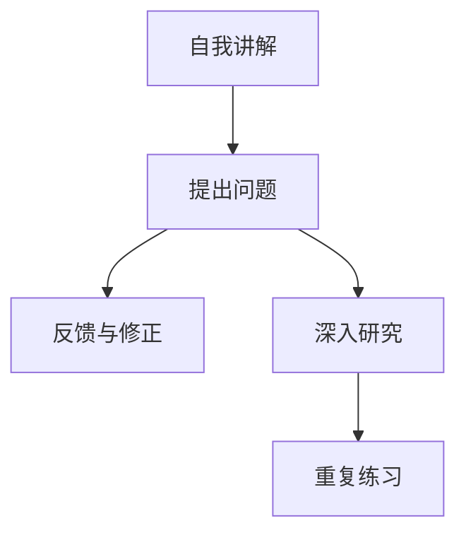

                 

## 1. 背景介绍

在软件开发和工程实践中，团队协作和学习是非常关键的环节。面对快速变化的技术和复杂的业务需求，持续的学习和知识传递显得尤为重要。费曼提问法（Feaman Learning），一种以教为学的学习方法，因其简单易行且效果显著，成为了一种被广泛推崇的学习方式。本文将系统性地介绍费曼提问法，探索其在大团队学习与成长中的应用，并结合具体案例进行分析，希望能为团队学习和知识传递提供参考和借鉴。

## 2. 核心概念与联系

### 2.1 核心概念概述

费曼提问法（Feaman Learning）源自诺贝尔物理学奖得主理查德·费曼（Richard Feynman）的教学经验。该方法强调通过向他人讲解的方式来加深自己的理解和掌握。核心概念包括：

1. **自述法**：主动向他人讲述所学知识，通过讲授过程检验自己的理解和记忆。
2. **提问法**：基于他人的反馈，提出自己不清楚或理解不准确的问题，进一步探究和解答。
3. **简化法**：通过精简语言和逻辑结构，使复杂概念变得易于理解。
4. **复习法**：通过不断复习和应用所学知识，巩固记忆，提高熟练度。

这些核心概念共同构成了费曼提问法的学习框架，旨在通过知识的传授和反馈，提升个人和团队的学习效率和理解深度。

### 2.2 核心概念原理和架构的 Mermaid 流程图(Mermaid 流程节点中不要有括号、逗号等特殊字符)

该流程图展示了费曼提问法的核心流程：

1. **自我讲解**：主动将所学知识讲解给他人，以此检验和巩固自己的理解。
2. **提出问题**：基于讲解过程中的反馈，提出不清楚或理解有误的问题。
3. **反馈与修正**：通过与他人的交流和讨论，解决提出的问题，进一步修正和完善自己的理解。
4. **深入研究**：针对不理解的内容进行深入研究和分析。
5. **重复练习**：通过不断复习和应用，巩固所学知识。

### 2.3 核心概念联系

费曼提问法与现代教育理论中的**构建主义学习理论（Constructivism）**有着密切的联系。构建主义强调学习者通过与环境的互动，在已有知识的基础上构建新的知识结构。费曼提问法通过自我讲解和他人反馈，不断调整和优化自己的认知结构，实现知识的深刻理解和内化。此外，费曼提问法还与**自我效能理论（Self-efficacy theory）**相关联，通过积极的反馈和成功经验，提升学习者的自我效能感和自信心。

## 3. 核心算法原理 & 具体操作步骤

### 3.1 算法原理概述

费曼提问法并不涉及特定的算法或数学模型，而是一种系统性的学习方法。其主要原理是利用知识的传授和反馈，促进个人和团队的学习和成长。核心步骤包括：

1. **自我讲解**：主动将所学知识讲解给他人。
2. **提出问题**：基于讲解过程中的反馈，提出不清楚或理解有误的问题。
3. **反馈与修正**：通过与他人的交流和讨论，解决提出的问题，进一步修正和完善自己的理解。
4. **深入研究**：针对不理解的内容进行深入研究和分析。
5. **重复练习**：通过不断复习和应用，巩固所学知识。

### 3.2 算法步骤详解

1. **准备阶段**：
   - 选择一个需要深入理解的主题或问题。
   - 确定讲解的对象，可以是同事、朋友或其他学习者。
   - 准备讲解所需的材料和工具，如白板、电脑、演示工具等。

2. **讲解阶段**：
   - 主动将所学知识讲解给他人，尽量用简单的语言和逻辑结构。
   - 注重细节和实例，帮助他人更好地理解。
   - 在讲解过程中，随时准备回答听众可能提出的问题。

3. **提问阶段**：
   - 基于听众的反馈，提出自己不清楚或理解有误的问题。
   - 积极听取并分析听众的提问，深入理解问题所在。
   - 将问题归类整理，以便后续深入研究。

4. **反馈与修正阶段**：
   - 与听众或导师进行深入讨论，共同探讨和解决问题。
   - 根据讨论结果，修正和完善自己的理解和认知结构。
   - 记录修正后的理解，形成学习笔记或文档。

5. **深入研究阶段**：
   - 针对不理解的内容进行深入研究和分析，查找相关资料和文献。
   - 尝试从不同的角度和视角理解问题，寻找新的解决方案。
   - 记录研究过程中的思考和发现，形成报告或论文。

6. **重复练习阶段**：
   - 通过不断复习和应用，巩固所学知识。
   - 在新的情境和问题中练习应用所学知识，加深理解和掌握。
   - 定期回顾和总结学习过程，反思改进。

### 3.3 算法优缺点

**优点**：
- **主动学习**：通过主动讲解和提问，提升个人对知识的掌握和理解。
- **双向反馈**：通过与他人的交流和讨论，获取多角度的反馈，弥补自身认知的盲点。
- **强化记忆**：通过不断的复习和应用，巩固记忆，提高熟练度。
- **增强自信心**：通过成功经验和积极的反馈，提升自我效能感和自信心。

**缺点**：
- **时间成本高**：需要投入较多的时间和精力进行讲解和反馈。
- **依赖他人反馈**：依赖他人的反馈进行改进，有时可能难以获取有价值的反馈。
- **可能产生心理负担**：对某些人来说，主动讲解可能会带来一定的心理压力。

### 3.4 算法应用领域

费曼提问法不仅适用于个人学习，也广泛应用于团队学习和知识传递。其应用领域包括：

- **项目管理**：在项目规划和执行过程中，团队成员通过讲解和提问，共同理解和解决项目中的技术和管理问题。
- **代码审查**：在代码审查过程中，开发者通过讲解代码逻辑和设计，帮助他人理解代码，提出改进建议。
- **技术分享**：在技术分享会上，主讲人通过讲解新技术和经验，与听众交流和讨论，共同提升团队的技术水平。
- **知识管理**：在知识管理过程中，团队通过收集和分享讲解笔记和研究报告，建立共享的知识库和文档库。

## 4. 数学模型和公式 & 详细讲解 & 举例说明

### 4.1 数学模型构建

费曼提问法并不涉及具体的数学模型，其核心是通过知识的传授和反馈，促进学习的深化。在实际应用中，可以通过数学模型来辅助分析学习效果。例如，可以使用以下模型来描述学习过程中知识的掌握程度：

$$
P = \alpha C^2
$$

其中，$P$ 为知识掌握程度，$\alpha$ 为常数，$C$ 为学习次数。该模型表明，知识掌握程度与学习次数的平方成正比。

### 4.2 公式推导过程

该模型可以通过以下步骤推导：

1. 假设每次学习后，知识掌握程度增加一个固定的比例 $\delta$。
2. 经过 $n$ 次学习后，知识掌握程度为 $P_n = (1+\delta)^n$。
3. 取对数并简化，得到 $n\log(1+\delta) = \log P$。
4. 当 $n$ 趋近于无穷大时，$\delta$ 趋近于0，即 $P \approx \alpha C^2$。

### 4.3 案例分析与讲解

假设某团队通过费曼提问法学习了新的编程语言框架，学习过程中，团队成员每周进行一次讲解和讨论。每次讲解时间大约为2小时，每次讲解后，团队成员对所学内容的掌握程度提高到前一次的两倍。根据上述模型，经过 $n$ 周学习后，团队成员对新框架的掌握程度 $P$ 可以计算如下：

$$
P = 2^{2n}
$$

当 $n=4$ 时，$P \approx 16$，即团队成员对新框架的掌握程度达到 $16$ 次方。

## 5. 项目实践：代码实例和详细解释说明

### 5.1 开发环境搭建

在实践费曼提问法时，需要搭建适合团队协作和知识分享的环境。以下是一个基于协作平台的实践环境搭建步骤：

1. **选择合适的协作平台**：如Confluence、Notion、Trello等，用于文档管理和任务跟踪。
2. **创建知识库**：建立团队知识库，用于存储和学习讲解笔记、研究报告等。
3. **建立沟通渠道**：使用Slack、Microsoft Teams等工具，建立即时沟通渠道，方便团队成员进行交流和讨论。

### 5.2 源代码详细实现

由于费曼提问法并不涉及特定的代码实现，以下提供一个基于Confluence的实践示例：

1. **创建文档**：在Confluence中创建新的文档，用于记录讲解内容、问题反馈和研究报告。
2. **组织结构**：将文档组织成章节和子章节，便于团队成员按模块进行学习和分享。
3. **定期更新**：团队成员定期更新文档，添加新的讲解内容、讨论问题和研究报告。

### 5.3 代码解读与分析

由于费曼提问法不涉及代码实现，以下提供一个基于知识管理工具的实践示例：

1. **知识库管理**：使用Confluence等知识管理工具，创建和维护团队知识库。
2. **文档化讲解**：团队成员将讲解内容、问题反馈和研究报告整理成文档，上传到知识库中。
3. **搜索和引用**：团队成员通过搜索和引用知识库中的文档，获取所需的学习资源和参考资料。

### 5.4 运行结果展示

费曼提问法的运行结果主要体现在团队成员的知识掌握程度和项目执行效果上。通过持续的讲解和讨论，团队成员能够更深刻地理解和学习新的知识和技能，提升团队的整体能力。以下是一个项目执行效果的展示示例：

- **技术水平提升**：通过讲解和讨论，团队成员的技术水平显著提升，能够更好地理解和应用新的编程语言和框架。
- **项目执行效率提高**：团队成员通过共同学习和讨论，能够更快地解决项目中的技术和管理问题，提升项目执行效率。
- **知识库丰富**：团队的知识库不断丰富，成为团队学习和知识传承的重要资源。

## 6. 实际应用场景

### 6.1 项目管理

费曼提问法在项目管理中应用广泛。通过讲解和讨论，团队成员可以更好地理解和管理项目需求、设计和技术方案。以下是一个项目管理场景的示例：

- **项目规划**：项目经理在项目启动会上讲解项目需求和目标，团队成员提出问题和建议。
- **需求讨论**：团队成员在需求讨论会上讲解需求细节和实现方案，与产品经理进行深入交流和讨论。
- **技术方案**：技术负责人讲解技术方案和架构设计，团队成员提出优化建议。

### 6.2 代码审查

代码审查是软件开发中的重要环节，通过费曼提问法，代码审查可以更加高效和全面。以下是一个代码审查场景的示例：

- **代码讲解**：代码作者在审查会上讲解代码逻辑和设计，与团队成员进行深入交流。
- **问题反馈**：团队成员根据讲解内容，提出代码质量和可读性等方面的问题。
- **优化建议**：代码作者根据反馈，提出优化方案，进行代码改进和重构。

### 6.3 技术分享

技术分享会可以帮助团队成员了解最新的技术趋势和实践经验。通过费曼提问法，技术分享会可以更加有深度和互动性。以下是一个技术分享会的示例：

- **主题讲解**：主讲人讲解新技术或经验，使用白板或PPT展示。
- **互动讨论**：团队成员提出问题，主讲人进行解答和交流。
- **总结和反馈**：技术分享结束后，团队成员总结学习收获，提出改进建议。

### 6.4 未来应用展望

随着人工智能和协作技术的不断发展，费曼提问法在未来将有更广阔的应用前景。以下是对未来应用的展望：

- **AI辅助讲解**：利用AI技术，自动生成讲解内容和问题，提升讲解的覆盖面和质量。
- **远程协作**：通过远程协作工具，打破时间和空间的限制，实现全球范围的知识分享和学习。
- **多模态学习**：结合视频、音频等多模态数据，增强知识的传递和理解。

## 7. 工具和资源推荐

### 7.1 学习资源推荐

为了帮助团队系统掌握费曼提问法，以下是一些推荐的学习资源：

1. **《深度工作：成功人士如何有效管理时间》**：作者卡尔·纽波特（Cal Newport），介绍了如何通过深度工作提升学习效率和工作表现。
2. **《学徒式学习》（Mentoring & Coaching）**：探讨了学徒式学习（Mentoring & Coaching）的方法和技巧，强调了知识传递的重要性和有效性。
3. **Coursera课程《学习如何学习》**：由加州大学圣地亚哥分校（UCSD）教授巴塞罗那的入门级课程，介绍了如何通过有效的学习方法提升学习效果。
4. **TED演讲《费曼学习法》**：知名学习专家约翰·诺勒（John Norris）的演讲，介绍了费曼学习法的具体实践和案例。
5. **《费曼物理学》**：作者理查德·费曼，介绍了他自己的学习方法和经验，对费曼提问法的核心思想进行了深入阐述。

### 7.2 开发工具推荐

以下是一些推荐的开发工具和协作平台，用于费曼提问法的实践：

1. **Confluence**：Atlassian推出的文档协作平台，适合创建和管理知识库，记录和共享讲解笔记和研究报告。
2. **Notion**：一款多功能协作工具，支持文档、任务管理、知识库等多种功能，适合团队协作和学习。
3. **Slack**：一款即时通讯工具，适合团队成员进行即时沟通和交流，建立沟通渠道。
4. **Microsoft Teams**：微软推出的协作平台，支持即时通讯、视频会议、文件共享等多种功能，适合团队协作和学习。
5. **Google Docs**：谷歌提供的文档协作工具，适合团队成员共同编辑和讨论文档。

### 7.3 相关论文推荐

费曼提问法作为一种有效的学习方法，已经被广泛研究和应用。以下是一些相关的论文和文献，供进一步参考：

1. **《费曼学习法：一种有效的学习方法》**：作者卡尔·纽波特（Cal Newport），介绍了费曼学习法的具体实践和案例。
2. **《学徒式学习：知识传递和经验传承》**：探讨了学徒式学习的方法和技巧，强调了知识传递的重要性和有效性。
3. **《深度工作：有效管理时间和精力》**：作者卡尔·纽波特（Cal Newport），介绍了如何通过深度工作提升学习效率和工作表现。
4. **《学习如何学习：有效学习策略》**：探讨了有效的学习策略和方法，强调了知识的构建和应用。
5. **《费曼物理学：一位科学家的自我学习法》**：作者理查德·费曼，介绍了他自己的学习方法和经验，对费曼提问法的核心思想进行了深入阐述。

## 8. 总结：未来发展趋势与挑战

### 8.1 研究成果总结

费曼提问法作为一种有效的学习方法，已被广泛应用于个人学习、团队协作和知识传递。其主要研究成果包括：

- **知识掌握模型**：通过数学模型描述了知识掌握程度与学习次数之间的关系，提供了量化的评估方法。
- **知识传递模型**：通过讲解和讨论，实现了知识的传递和反馈，提升了学习的深度和效果。
- **知识管理模型**：通过创建和维护知识库，实现了知识的共享和传承，提升了团队的整体能力。

### 8.2 未来发展趋势

随着人工智能和协作技术的不断发展，费曼提问法在未来将有更广阔的应用前景。以下是对未来发展的趋势：

- **AI辅助讲解**：利用AI技术，自动生成讲解内容和问题，提升讲解的覆盖面和质量。
- **远程协作**：通过远程协作工具，打破时间和空间的限制，实现全球范围的知识分享和学习。
- **多模态学习**：结合视频、音频等多模态数据，增强知识的传递和理解。

### 8.3 面临的挑战

尽管费曼提问法在学习和知识传递方面具有显著的优势，但在实际应用中仍面临一些挑战：

- **时间成本高**：需要投入较多的时间和精力进行讲解和反馈。
- **依赖他人反馈**：依赖他人的反馈进行改进，有时可能难以获取有价值的反馈。
- **可能产生心理负担**：对某些人来说，主动讲解可能会带来一定的心理压力。

### 8.4 研究展望

未来的研究可以从以下几个方向进行：

- **自动化工具**：开发自动化的讲解和反馈工具，提升费曼提问法的效率和效果。
- **多模态应用**：结合视频、音频等多模态数据，增强知识的传递和理解。
- **社交化互动**：利用社交化平台，促进团队成员之间的互动和讨论，提升学习效果。
- **知识图谱应用**：结合知识图谱技术，实现知识结构化和系统化管理，提升知识传承和应用的效果。

## 9. 附录：常见问题与解答

**Q1：费曼提问法是否适用于所有团队？**

A: 费曼提问法适用于任何规模和类型的团队，尤其是那些需要进行知识共享和学习提升的团队。不过，对于大型复杂的团队，可能需要一些结构化的方法和工具来辅助实施。

**Q2：费曼提问法如何进行时间管理？**

A: 费曼提问法强调的是知识传递和反馈，而不是单纯的时间管理。在实际应用中，可以通过设置学习周期和目标，合理安排时间。例如，每周安排一次团队讲解和讨论会，每次时间控制在2小时内。

**Q3：如何克服费曼提问法中的心理负担？**

A: 心理负担是费曼提问法实施中的一个常见问题。可以通过以下方法缓解：
- **建立支持环境**：建立一个开放、支持的学习环境，鼓励团队成员积极参与。
- **逐步实施**：从小规模、低压力的讲解开始，逐步增加难度和频率，逐步适应。
- **设置目标和奖励**：通过设置具体、可实现的目标和奖励，提升团队成员的动力和自信心。

**Q4：费曼提问法如何结合项目管理？**

A: 费曼提问法可以结合项目管理中的需求讨论和技术方案设计环节，通过讲解和讨论，提升团队成员的理解和协作。例如，在需求讨论会上，团队成员可以讲解需求细节和实现方案，与产品经理进行深入交流和讨论。

**Q5：费曼提问法如何结合代码审查？**

A: 费曼提问法可以结合代码审查中的代码讲解和问题反馈环节，通过讲解和讨论，提升代码质量和可读性。例如，在代码审查会上，代码作者可以讲解代码逻辑和设计，与团队成员进行深入交流，提出优化建议。

**Q6：费曼提问法如何结合技术分享会？**

A: 费曼提问法可以结合技术分享会中的主题讲解和互动讨论环节，通过讲解和讨论，提升技术水平和团队协作。例如，在技术分享会上，主讲人可以讲解新技术或经验，使用白板或PPT展示，团队成员提出问题，主讲人进行解答和交流。

---

作者：禅与计算机程序设计艺术 / Zen and the Art of Computer Programming

