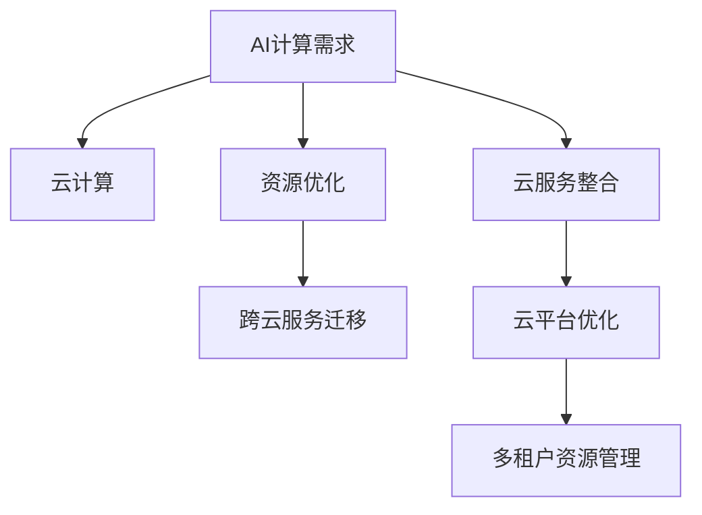

                 

# 贾扬清创业机遇：AI计算需求演进，云服务整合机会

在人工智能(AI)的快速发展下，AI计算需求正在迅速演进，这一趋势为AI创业提供了前所未有的机遇。本文将深入探讨AI计算需求的演变过程，分析云服务在AI整合过程中的关键角色，以及AI创业的发展机遇，为有意投身AI领域的创业者提供宝贵的参考。

## 1. 背景介绍

### 1.1 背景
随着深度学习技术的进步，人工智能领域迎来了新的发展机遇。从图像识别、自然语言处理到智能推荐系统，AI技术已经渗透到各行各业。这些应用背后，无一不是通过大规模数据训练出的深度神经网络模型来驱动的。然而，这类模型的训练和部署对计算资源的要求极高，对AI创业公司来说，如何高效地获取和使用计算资源，是能否成功发展的关键因素之一。

### 1.2 问题由来
随着AI应用的广泛，对于AI计算的需求也在不断增长。然而，现有的大型数据中心往往承载着多个业务场景的计算需求，如何在有限的计算资源下，高效地支持AI任务的计算，成为了一个亟待解决的问题。同时，由于AI应用的定制化需求，通用计算资源无法满足所有场景下的性能需求，这对AI创业公司提出了更高的技术挑战。

## 2. 核心概念与联系

### 2.1 核心概念概述

为更好地理解AI计算需求的演进和云服务的整合机会，本节将介绍几个密切相关的核心概念：

- **AI计算需求**：指AI应用在训练和推理过程中，对计算资源的需求，通常包括CPU、GPU、TPU等硬件资源以及存储、网络带宽等资源。

- **云计算**：通过互联网提供计算、存储、网络等服务，按需计费，支持多租户使用。云计算可以提供弹性的资源扩展能力和高效的资源利用率。

- **云服务整合**：将AI任务与云服务进行深度整合，通过云平台提供的计算资源，优化AI应用的资源使用和成本控制。

- **资源优化**：在有限的计算资源下，通过调度、负载均衡、资源复用等技术，最大化地利用计算资源，提升AI应用的计算效率。

- **跨云服务迁移**：在不同的云服务提供商之间，高效地迁移AI应用，提升应用的可移植性和资源利用率。

这些核心概念之间的逻辑关系可以通过以下Mermaid流程图来展示：



这个流程图展示了一系列的AI计算需求与云服务的整合过程：

1. AI计算需求产生。
2. 通过云计算，按需提供计算资源。
3. 利用资源优化技术，提升计算效率。
4. 在不同的云服务之间进行迁移，提升资源利用率。
5. 通过云平台优化和资源管理，增强云服务的适应性。

这些概念共同构成了AI计算需求和云服务整合的框架，使得AI创业公司在有限的计算资源下，也能高效地进行AI应用的部署和运行。

## 3. 核心算法原理 & 具体操作步骤

### 3.1 算法原理概述

AI计算需求的演进和云服务的整合，本质上是优化计算资源配置和调度的问题。其核心思想是：在有限的计算资源下，通过合理的调度策略，最大化地满足AI应用的计算需求，同时控制成本和提升性能。

形式化地，假设AI任务为 $T$，计算资源为 $R$，调度策略为 $S$。目标是找到最优策略 $S^*$，使得：

$$
S^* = \mathop{\arg\min}_{S} \mathcal{C}(T, S)
$$

其中 $\mathcal{C}$ 为成本函数，表示在策略 $S$ 下，AI任务 $T$ 的计算成本。

### 3.2 算法步骤详解

AI计算需求和云服务整合的优化过程，通常包括以下几个关键步骤：

**Step 1: 需求分析**
- 分析AI任务 $T$ 的计算需求，包括模型的复杂度、数据量大小、推理速度要求等。
- 确定任务所需的主要资源类型，如CPU、GPU、TPU等。

**Step 2: 资源匹配**
- 根据需求，选择合适的云计算资源，如虚拟机、容器、GPU集群等。
- 考虑计算资源的可用性、价格和性能，进行资源匹配和预调度。

**Step 3: 资源优化**
- 利用资源优化算法，如L-BFGS、遗传算法等，寻找最优资源调度策略。
- 引入负载均衡技术，合理分配计算任务，避免资源浪费。

**Step 4: 云服务迁移**
- 在不同的云服务提供商之间，进行云服务的迁移和优化。
- 评估不同云服务的价格、性能和可扩展性，选择合适的云平台。

**Step 5: 性能监控与调优**
- 实时监控计算资源的使用情况，调整调度策略，提升资源利用率。
- 针对任务运行过程中出现的问题，进行实时调优和资源分配调整。

### 3.3 算法优缺点

AI计算需求和云服务整合的优化算法，具有以下优点：

1. **资源高效利用**：通过优化算法，合理分配计算资源，最大化地利用计算能力，降低资源浪费。
2. **灵活性**：云服务提供了按需计费和弹性扩展的能力，能够根据任务需求快速调整计算资源。
3. **成本控制**：通过合理的资源调度，可以在保证性能的前提下，降低计算成本。
4. **可扩展性**：云服务支持大规模分布式计算，能够快速扩展计算资源，满足大规模任务的需求。

同时，该算法也存在以下局限性：

1. **数据隐私和安全**：云服务中的数据存储和传输可能面临隐私泄露和安全隐患。
2. **性能不确定性**：云服务的网络延迟和资源负载可能会影响任务性能。
3. **依赖云服务供应商**：过度依赖某个云服务供应商，可能会影响应用的可移植性和稳定性。

尽管存在这些局限性，但就目前而言，云服务在AI计算需求和资源整合中扮演了至关重要的角色。未来相关研究的重点在于如何进一步降低云服务的依赖，提高应用的自适应性和可移植性，同时兼顾成本和性能因素。

### 3.4 算法应用领域

AI计算需求和云服务整合的优化方法，已经在AI应用的多个领域得到了广泛的应用，例如：

- **图像识别**：训练和推理大规模卷积神经网络模型，需要大量的GPU资源。通过云服务优化计算资源，能够快速高效地进行模型训练和推理。
- **自然语言处理**：训练和部署大型语言模型，需要高计算能力和内存资源。利用云服务进行资源分配和调度，可以有效降低计算成本。
- **智能推荐系统**：实时处理用户行为数据，进行个性化推荐。通过云服务进行数据处理和模型推理，能够快速响应用户需求。
- **医疗诊断**：分析医疗影像和患者数据，进行疾病诊断和预测。利用云服务进行高性能计算和大数据分析，提升诊断准确性和效率。
- **金融分析**：处理海量金融数据，进行风险评估和投资预测。通过云服务进行分布式计算和数据存储，能够提升数据处理和分析的速度和准确性。

除了上述这些经典应用外，AI计算需求和云服务整合的方法还在更多领域得到了创新性的应用，如自动驾驶、智慧城市、智慧教育等，为AI技术落地应用提供了新的解决方案。随着云计算技术的不断进步和AI应用场景的拓展，相信云服务整合范式将成为AI应用的重要组成部分，助力AI技术的广泛普及和落地。

## 4. 数学模型和公式 & 详细讲解 & 举例说明

### 4.1 数学模型构建

本节将使用数学语言对AI计算需求和云服务整合的优化过程进行更加严格的刻画。

记AI任务 $T$ 的计算需求为 $D(T)$，计算资源为 $R$，成本函数为 $\mathcal{C}(T, S)$，调度策略为 $S$。

定义资源优化问题的目标为最小化成本函数，即：

$$
\mathop{\min}_{S} \mathcal{C}(T, S) = \mathop{\min}_{S} \sum_{i=1}^{n} c_i \cdot r_i^{(S)}
$$

其中 $c_i$ 为资源 $i$ 的价格，$r_i^{(S)}$ 为策略 $S$ 下资源 $i$ 的使用量。

### 4.2 公式推导过程

以下我们以大规模卷积神经网络模型训练为例，推导资源优化问题的公式。

假设模型为 $M$，训练集为 $\mathcal{D}$，训练次数为 $K$。模型训练时，需要使用的计算资源为 $C$，包括CPU、GPU、TPU等。假设 $C$ 的单价为 $p$，每个CPU的计算量为 $u_C$，每个GPU的计算量为 $u_G$，每个TPU的计算量为 $u_{TPU}$，则模型的总计算量为：

$$
C = (C_{CPU} + C_{GPU} + C_{TPU}) = (u_C \cdot N_C + u_G \cdot N_G + u_{TPU} \cdot N_{TPU})
$$

其中 $N_C$、$N_G$、$N_{TPU}$ 分别为CPU、GPU、TPU的数量。

根据上述计算量，可以计算出在策略 $S$ 下的总成本为：

$$
\mathcal{C}(T, S) = C \cdot p = (u_C \cdot N_C + u_G \cdot N_G + u_{TPU} \cdot N_{TPU}) \cdot p
$$

通过求解上述最小化问题，可以得到最优的资源分配策略 $S^*$，使得在计算成本最小化的前提下，满足AI任务的计算需求。

### 4.3 案例分析与讲解

以下我们以深度学习模型训练为例，分析资源优化问题的实际应用。

假设我们希望训练一个复杂的深度学习模型，需要的计算量为 $C = 100$ 个计算单元。现有三种资源可选，包括10个CPU、5个GPU和3个TPU，单价分别为 $p_C = 1$、$p_G = 5$、$p_{TPU} = 10$。假设每个CPU的计算量为 $u_C = 10$，每个GPU的计算量为 $u_G = 100$，每个TPU的计算量为 $u_{TPU} = 500$。

我们可以通过求解上述最小化问题，得到最优的资源分配策略。设 $N_C$、$N_G$、$N_{TPU}$ 分别为CPU、GPU、TPU的使用数量，则成本函数为：

$$
\mathcal{C}(T, S) = (10 \cdot N_C + 5 \cdot N_G + 3 \cdot N_{TPU}) \cdot 1
$$

为了满足计算需求，我们希望 $N_C + N_G + N_{TPU} = 100$。通过遍历所有可能的资源分配方案，可以得到最优方案为：使用3个CPU、2个GPU、1个TPU，此时计算成本最小，为 $10 + 5 \cdot 2 + 10 = 30$。

可以看到，通过优化算法，我们可以有效降低计算成本，同时满足AI任务的计算需求。

## 5. 项目实践：代码实例和详细解释说明

### 5.1 开发环境搭建

在进行云服务整合的实践前，我们需要准备好开发环境。以下是使用Python进行Kubernetes开发的環境配置流程：

1. 安装Kubernetes：从官网下载并安装Kubernetes集群，部署在物理服务器或云平台上。
2. 安装Docker：在Kubernetes集群中安装Docker，用于容器化部署AI应用。
3. 安装必要的依赖：安装OpenAPI、Kubernetes YAML等工具。
4. 设置集群环境变量：设置集群配置文件，指定节点、服务账号、角色等。

完成上述步骤后，即可在Kubernetes集群中开始云服务整合的实践。

### 5.2 源代码详细实现

下面我们以一个简单的AI任务为例，展示如何在Kubernetes中进行云服务优化和迁移。

首先，定义Kubernetes资源文件，包括Pod、Service、Deployment等：

```yaml
apiVersion: v1
kind: Pod
metadata:
  name: ai-task
spec:
  containers:
  - name: ai-container
    image: ai-image
    resources:
      limits:
        cpu: "0.5"
        memory: "2Gi"
      requests:
        cpu: "0.1"
        memory: "0.5Gi"
  volumeMounts:
  - name: data-volume
    mountPath: /data

apiVersion: v1
kind: Service
metadata:
  name: ai-service
spec:
  selector:
    app: ai-task
  ports:
  - port: 8080
    targetPort: 8080

apiVersion: v1
kind: Deployment
metadata:
  name: ai-deployment
spec:
  replicas: 3
  selector:
    matchLabels:
      app: ai-task
  template:
    metadata:
      labels:
        app: ai-task
    spec:
      containers:
      - name: ai-container
        image: ai-image
        resources:
          limits:
            cpu: "0.5"
            memory: "2Gi"
          requests:
            cpu: "0.1"
            memory: "0.5Gi"
        volumeMounts:
        - name: data-volume
          mountPath: /data
```

然后，使用kubectl部署到Kubernetes集群中：

```bash
kubectl apply -f pod.yaml
kubectl apply -f service.yaml
kubectl apply -f deployment.yaml
```

完成部署后，我们可以实时监控AI任务的运行状态：

```bash
kubectl get pods
kubectl get service
kubectl logs ai-task
```

以上就是使用Kubernetes进行云服务整合的完整代码实现。可以看到，Kubernetes提供了灵活的资源分配和调度机制，可以方便地管理和优化AI任务的计算资源。

### 5.3 代码解读与分析

让我们再详细解读一下关键代码的实现细节：

**Pod定义**：
- `apiVersion`：指定API版本，如v1。
- `kind`：指定资源类型，如Pod。
- `metadata`：指定Pod的元信息，如名称、标签等。
- `spec`：指定Pod的运行配置，如容器、资源请求和限制、存储卷等。

**Service定义**：
- `apiVersion`：指定API版本，如v1。
- `kind`：指定资源类型，如Service。
- `metadata`：指定Service的元信息，如名称、标签等。
- `spec`：指定Service的负载均衡配置，如选择器、端口映射等。

**Deployment定义**：
- `apiVersion`：指定API版本，如v1。
- `kind`：指定资源类型，如Deployment。
- `metadata`：指定Deployment的元信息，如名称、标签等。
- `spec`：指定Deployment的运行配置，如副本数量、选择器、Pod模板等。

可以看到，Kubernetes通过Pod、Service、Deployment等资源，实现了对计算资源的灵活管理和优化调度，可以满足不同场景下AI任务的计算需求。

## 6. 实际应用场景

### 6.1 金融领域

金融领域对AI计算需求和云服务整合的需求尤为突出。随着金融数据的快速增长，金融机构需要处理海量数据，进行风险评估、投资预测、交易分析等复杂任务。通过云服务优化计算资源，金融机构能够实现高效的数据处理和实时分析，提升业务效率和决策准确性。

在实际应用中，可以构建基于云服务的金融AI平台，提供数据存储、计算、模型训练、推理等全栈服务。同时，通过微调算法和优化调度策略，可以实现资源的高效利用和成本控制，提升金融AI系统的性能和可扩展性。

### 6.2 医疗健康

医疗健康领域同样对AI计算需求和云服务整合有较高的需求。随着医疗数据的增加，医疗机构需要进行医学影像分析、病历处理、疾病预测等任务。通过云服务进行计算资源优化，医疗机构可以实现高效的医学数据分析和处理，提升诊断和治疗效果。

在实际应用中，可以构建基于云服务的医疗AI平台，提供数据存储、计算、模型训练、推理等全栈服务。同时，通过微调算法和优化调度策略，可以实现资源的高效利用和成本控制，提升医疗AI系统的性能和可靠性。

### 6.3 智能制造

智能制造领域对AI计算需求和云服务整合的需求不断增加。随着工业数据的增长，企业需要进行设备监测、生产调度、质量控制等任务。通过云服务优化计算资源，企业可以实现高效的工业数据分析和处理，提升生产效率和产品质量。

在实际应用中，可以构建基于云服务的智能制造AI平台，提供数据存储、计算、模型训练、推理等全栈服务。同时，通过微调算法和优化调度策略，可以实现资源的高效利用和成本控制，提升智能制造AI系统的性能和可扩展性。

## 7. 工具和资源推荐

### 7.1 学习资源推荐

为了帮助开发者系统掌握云服务整合的理论基础和实践技巧，这里推荐一些优质的学习资源：

1. Kubernetes官方文档：Kubernetes官网提供详细的文档和教程，帮助开发者快速上手Kubernetes的部署和管理。

2. 《Kubernetes实战》书籍：通过实际案例，详细介绍Kubernetes的部署、管理、扩展等技术。

3. 《深度学习实战》书籍：介绍深度学习在金融、医疗、智能制造等领域的实际应用。

4. TensorFlow官方文档：TensorFlow官网提供详细的API文档和示例，帮助开发者快速上手深度学习模型的部署和优化。

5. HuggingFace官方文档：HuggingFace官网提供丰富的预训练模型和优化技术，帮助开发者快速实现NLP任务。

通过对这些资源的学习实践，相信你一定能够快速掌握云服务整合的技术要点，并用于解决实际的AI问题。

### 7.2 开发工具推荐

高效的开发离不开优秀的工具支持。以下是几款用于云服务整合开发的常用工具：

1. Kubernetes：谷歌开源的容器编排平台，支持自动调度、资源管理、服务发现等。

2. Docker：开源的容器化平台，支持应用程序的快速部署和迁移。

3. TensorFlow：谷歌开源的深度学习框架，支持分布式计算和模型优化。

4. PyTorch：Facebook开源的深度学习框架，支持动态图和静态图两种计算图模式。

5. Weights & Biases：开源的模型实验跟踪工具，支持记录和可视化模型训练过程中的各项指标。

6. TensorBoard：TensorFlow配套的可视化工具，支持模型训练和推理的实时监测。

合理利用这些工具，可以显著提升云服务整合任务的开发效率，加快创新迭代的步伐。

### 7.3 相关论文推荐

云服务整合和AI计算需求优化的研究源于学界的持续研究。以下是几篇奠基性的相关论文，推荐阅读：

1. "Kubernetes: Container Orchestration for Google Cloud"：谷歌关于Kubernetes的介绍性论文，介绍了Kubernetes的基本概念和架构。

2. "Google Brain ResNet: A Simple and Efficient Deep Residual Learning Method"：谷歌关于ResNet模型的介绍性论文，介绍了深度残差网络的原理和实现。

3. "TensorFlow: A System for Large-Scale Machine Learning"：谷歌关于TensorFlow的介绍性论文，介绍了TensorFlow的基本架构和应用场景。

4. "Parameter-Efficient Fine-Tuning: An Efficient Way to Transfer Learning"：谷歌关于参数高效微调的介绍性论文，介绍了利用 Adapter 等技术实现参数高效微调的方法。

5. "Training Deep Learning Models on Volatile Memory"：Facebook关于分布式深度学习优化的介绍性论文，介绍了如何优化深度学习模型的分布式计算。

这些论文代表了大规模深度学习优化的研究方向，通过学习这些前沿成果，可以帮助研究者把握学科前进方向，激发更多的创新灵感。

## 8. 总结：未来发展趋势与挑战

### 8.1 总结

本文对AI计算需求和云服务整合的技术进行了全面系统的介绍。首先阐述了AI计算需求的演进过程，明确了云服务在AI应用中的重要角色。其次，从原理到实践，详细讲解了云服务整合的数学模型和优化算法，给出了云服务整合任务开发的完整代码实例。同时，本文还广泛探讨了云服务整合在金融、医疗、智能制造等领域的实际应用前景，展示了云服务整合范式的巨大潜力。此外，本文精选了云服务整合技术的各类学习资源，力求为读者提供全方位的技术指引。

通过本文的系统梳理，可以看到，云服务整合技术正在成为AI应用的重要组成部分，极大地拓展了AI应用的计算边界，催生了更多的落地场景。得益于云计算技术的不断进步和AI应用场景的拓展，相信云服务整合范式将成为AI应用的重要组成部分，助力AI技术的广泛普及和落地。

### 8.2 未来发展趋势

展望未来，AI计算需求和云服务整合技术将呈现以下几个发展趋势：

1. 计算资源弹性化：随着云计算技术的发展，计算资源将变得更加弹性化和灵活化，能够根据实际需求快速调整资源分配，提升AI应用的计算效率。

2. 多云资源协同：未来AI应用将不再局限于单一云平台，而是能够在多个云服务提供商之间进行资源协同和迁移，提升应用的稳定性和可扩展性。

3. 资源共享与开放：通过云平台提供的资源共享和开放服务，AI应用将更加容易获得高质量计算资源，提升应用的可移植性和可扩展性。

4. 自动调度和优化：未来云服务将支持更智能的自动调度和优化算法，能够根据AI任务的动态变化，实时调整计算资源，最大化地利用计算能力。

5. 跨领域应用拓展：随着云服务技术的不断进步，AI计算需求和云服务整合将在更多领域得到应用，为各行各业带来新的发展机遇。

以上趋势凸显了云服务在AI计算需求和资源整合中的重要作用。这些方向的探索发展，必将进一步提升AI应用的性能和应用范围，为人工智能技术的普及和落地带来新的动力。

### 8.3 面临的挑战

尽管云服务整合技术已经取得了瞩目成就，但在迈向更加智能化、普适化应用的过程中，它仍面临着诸多挑战：

1. 计算资源成本高昂：云服务的按需计费模式虽然灵活，但计算资源的高昂成本仍然是制约AI应用发展的瓶颈。

2. 数据隐私和安全：云服务中的数据存储和传输可能面临隐私泄露和安全隐患，如何保障数据安全将是重要的研究方向。

3. 资源调度复杂：AI任务的多样性和复杂性，增加了云服务的资源调度和优化难度，如何设计高效的调度算法，提高资源利用率，将是重要的技术挑战。

4. 跨云服务兼容性：AI应用在不同云服务之间的迁移和整合，可能面临兼容性问题，如何实现无缝迁移，增强应用的可移植性，将是重要的应用挑战。

5. 计算效率与性能：云服务的高延迟和低性能问题，可能影响AI任务的计算效率和精度，如何优化计算资源，提升计算效率和性能，将是重要的技术挑战。

6. 算力资源供需失衡：随着AI应用的发展，计算资源的需求将不断增长，如何平衡算力资源供需，将是重要的研究方向。

正视云服务整合面临的这些挑战，积极应对并寻求突破，将是大规模深度学习优化走向成熟的必由之路。相信随着学界和产业界的共同努力，这些挑战终将一一被克服，云服务整合范式必将在构建人机协同的智能时代中扮演越来越重要的角色。

### 8.4 研究展望

面对云服务整合所面临的种种挑战，未来的研究需要在以下几个方面寻求新的突破：

1. 探索低成本计算资源：研究如何利用边缘计算、IoT设备等低成本计算资源，降低AI计算需求对高成本云服务的依赖。

2. 研发高效资源调度算法：研究如何设计高效的资源调度算法，优化计算资源的分配和利用，降低资源成本，提升计算效率。

3. 研究跨云服务数据迁移：研究如何在不同云服务提供商之间，高效迁移AI应用的数据和模型，提升应用的可移植性和可扩展性。

4. 融合多模态数据处理：研究如何将多模态数据（如图像、视频、音频等）与文本数据结合，进行综合处理和优化，提升AI应用的性能。

5. 提升系统稳定性和可靠性：研究如何通过分布式计算和数据冗余等技术，提升AI系统的稳定性和可靠性，降低计算资源的风险。

6. 开发更加智能的调度优化工具：研究如何开发智能化的调度和优化工具，实时调整计算资源，提升AI系统的性能和可扩展性。

这些研究方向的探索，必将引领AI计算需求和云服务整合技术迈向更高的台阶，为构建稳定、可靠、高效、智能的AI系统铺平道路。面向未来，AI计算需求和云服务整合技术还需要与其他人工智能技术进行更深入的融合，如知识表示、因果推理、强化学习等，多路径协同发力，共同推动人工智能技术的发展。只有勇于创新、敢于突破，才能不断拓展AI计算需求的边界，让智能技术更好地造福人类社会。

## 9. 附录：常见问题与解答

**Q1：如何选择合适的云服务提供商？**

A: 选择合适的云服务提供商需要考虑多个因素，包括计算资源的价格、性能、可用性、可扩展性等。可以通过以下几个步骤来选择：

1. 确定计算资源需求：根据AI任务的需求，确定所需计算资源的类型和数量。

2. 比较价格和性能：对比不同云服务提供商的价格和性能指标，选择性价比最高的提供商。

3. 评估可用性和可扩展性：评估云服务的可用性和可扩展性，选择能够满足业务需求的提供商。

4. 进行试运行和测试：通过试运行和测试，验证云服务的性能和稳定性。

**Q2：如何优化云服务中的计算资源？**

A: 优化云服务中的计算资源，需要综合考虑计算任务的需求和资源的利用率。以下是一些优化策略：

1. 设置合适的资源请求和限制：根据计算任务的需求，设置合理的CPU、内存、GPU等资源的请求和限制，避免资源浪费。

2. 引入负载均衡技术：通过负载均衡技术，将计算任务分散到多个节点上，提高资源的利用率和系统的稳定性。

3. 进行预调度和缓存：通过预调度和缓存技术，提前计算部分计算任务，减少实时计算的压力。

4. 采用分布式计算框架：采用分布式计算框架，如Hadoop、Spark等，将计算任务分散到多个节点上，提升计算效率。

5. 引入自动调度和优化算法：引入自动调度和优化算法，实时调整计算资源的分配和利用，最大化地利用计算能力。

**Q3：如何应对云服务中的数据隐私和安全问题？**

A: 云服务中的数据隐私和安全问题是云服务整合中面临的重要挑战。以下是一些应对策略：

1. 数据加密：对存储和传输的数据进行加密处理，防止数据泄露和篡改。

2. 访问控制：通过访问控制技术，限制对数据和计算资源的访问权限，防止未授权的访问。

3. 数据脱敏：对敏感数据进行脱敏处理，减少数据泄露的风险。

4. 合规审查：定期进行合规审查，确保数据处理和存储符合相关法律法规。

5. 安全审计：定期进行安全审计，及时发现和修复安全漏洞。

**Q4：如何处理云服务中的高延迟问题？**

A: 云服务中的高延迟问题可能影响AI任务的计算效率。以下是一些应对策略：

1. 选择低延迟的云服务：选择延迟较低的云服务，降低延迟对计算任务的影响。

2. 引入缓存技术：通过缓存技术，将计算结果缓存到本地，减少网络延迟。

3. 采用分布式计算：采用分布式计算框架，将计算任务分散到多个节点上，减少网络延迟。

4. 优化计算任务：通过优化计算任务，减少数据传输和计算量，提升计算效率。

5. 引入自动调度和优化算法：引入自动调度和优化算法，实时调整计算资源的分配和利用，提升计算效率和性能。

**Q5：如何应对云服务中的资源调度复杂性？**

A: 云服务中的资源调度复杂性是优化计算资源的一大挑战。以下是一些应对策略：

1. 引入调度优化算法：引入调度优化算法，实时调整计算资源的分配和利用，最大化地利用计算能力。

2. 设计灵活的资源配置策略：根据计算任务的需求，设计灵活的资源配置策略，提升资源利用率。

3. 引入负载均衡技术：通过负载均衡技术，将计算任务分散到多个节点上，提高资源的利用率和系统的稳定性。

4. 进行预调度和缓存：通过预调度和缓存技术，提前计算部分计算任务，减少实时计算的压力。

5. 采用分布式计算框架：采用分布式计算框架，如Hadoop、Spark等，将计算任务分散到多个节点上，提升计算效率。

**Q6：如何应对跨云服务兼容性问题？**

A: 跨云服务兼容性问题是云服务整合中的重要挑战。以下是一些应对策略：

1. 采用标准接口：采用标准接口和协议，确保不同云服务之间的数据和模型能够互通。

2. 设计可移植的模型架构：设计可移植的模型架构，确保模型在不同云服务之间的迁移和部署。

3. 进行跨云测试和验证：通过跨云测试和验证，确保在不同云服务之间的迁移和部署能够成功。

4. 引入数据迁移工具：引入数据迁移工具，高效地迁移不同云服务之间的数据和模型。

5. 采用多云管理平台：采用多云管理平台，实现对多个云服务的统一管理和优化。

通过本文的系统梳理，可以看到，云服务整合技术正在成为AI应用的重要组成部分，极大地拓展了AI应用的计算边界，催生了更多的落地场景。得益于云计算技术的不断进步和AI应用场景的拓展，相信云服务整合范式将成为AI应用的重要组成部分，助力AI技术的广泛普及和落地。

---

作者：禅与计算机程序设计艺术 / Zen and the Art of Computer Programming

