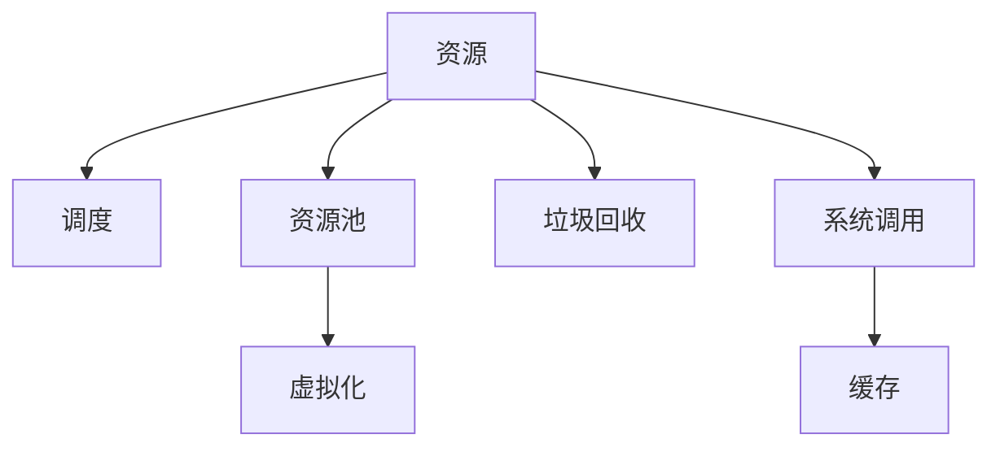

                 

# 资源管理 原理与代码实例讲解

> 关键词：资源管理, 内存管理, 磁盘管理, 性能优化, 资源调度和分配, 虚拟化技术, 垃圾回收, 操作系统调度, 编程语言特性

## 1. 背景介绍

### 1.1 问题由来
资源管理（Resource Management）是计算机系统中的一个核心问题，涉及内存、磁盘、网络、计算资源等多个维度。随着云计算、大数据、人工智能等技术的发展，系统资源需求越来越大，资源管理的重要性也日益凸显。合理高效的资源管理不仅能够提升系统的性能和稳定性，还能显著降低能耗和成本。

资源管理的问题由来已久，但近年来随着硬件性能的提升和应用场景的复杂化，资源管理更加具有挑战性。例如，数据中心服务器数量和业务规模的不断增长，如何高效地管理海量资源成为了一个突出的问题。如何在不增加硬件成本的情况下，提高系统性能和资源利用率，成为许多企业和研究机构共同关心的话题。

### 1.2 问题核心关键点
资源管理的核心关键点包括：

- 资源调度和分配：如何高效地分配和调度系统中的各种资源，以满足应用需求并最小化资源浪费。
- 性能优化：如何通过算法优化和调度策略，提高资源使用效率，减少资源冲突和等待时间。
- 内存管理：如何高效地使用和回收内存，避免内存泄漏和碎片化，提升系统的响应速度。
- 磁盘管理：如何优化磁盘读写性能，减少I/O等待，提高数据访问速度。
- 垃圾回收：如何高效回收不再使用的内存和资源，防止系统内存膨胀和资源耗尽。
- 虚拟化技术：如何通过虚拟化技术，合理分配和隔离不同应用之间的资源，提升系统的灵活性和安全性。
- 操作系统调度：如何通过操作系统调度算法，均衡不同进程间的资源使用，避免资源争抢和死锁。
- 编程语言特性：如何利用编程语言提供的高层次抽象和优化机制，简化资源管理的复杂度，提高开发效率。

这些关键点相互关联，共同构成了资源管理系统的整体框架，并影响着系统性能和稳定性。

## 2. 核心概念与联系

### 2.1 核心概念概述

为更好地理解资源管理系统的构建和优化，本节将介绍几个关键概念：

- **资源**：指系统中可以利用的所有物理和虚拟资源，包括CPU、内存、磁盘、网络带宽等。
- **调度**：指对系统资源进行分配和调整的过程，目的是平衡资源使用，提升系统性能。
- **资源池**：将多个资源进行聚合，形成一个资源池，便于统一管理和分配。
- **虚拟化**：将物理资源抽象成多个虚拟资源，提升资源利用率和系统灵活性。
- **垃圾回收**：自动检测和回收不再使用的内存和资源，避免内存泄漏和资源浪费。
- **系统调用**：编程语言提供的一系列系统调用接口，用于与操作系统进行交互，实现资源管理功能。
- **缓存**：利用缓存技术，减少磁盘和内存的I/O操作，提升数据访问速度。

这些核心概念之间的逻辑关系可以通过以下Mermaid流程图来展示：



这个流程图展示了的核心概念及其之间的关系：

1. 资源是调度的对象，通过调度算法进行分配和调整。
2. 资源池是将多个资源进行聚合的容器，便于统一管理。
3. 虚拟化技术将物理资源抽象为虚拟资源，提升资源利用率和灵活性。
4. 垃圾回收自动检测和回收不再使用的资源，避免资源浪费。
5. 系统调用提供了一组接口，用于与操作系统进行交互，实现资源管理功能。
6. 缓存技术用于减少数据访问延迟，提升系统响应速度。

## 3. 核心算法原理 & 具体操作步骤

### 3.1 算法原理概述

资源管理的核心算法包括调度算法、垃圾回收算法、内存管理算法等，这些算法设计旨在提高资源利用率，减少资源冲突，提升系统性能。

- **调度算法**：通过合理分配和调整系统资源，满足应用需求并最小化资源浪费。常见的调度算法包括先来先服务（FCFS）、短作业优先（SJF）、轮询（Round Robin）、最短响应时间优先（SRTF）等。
- **垃圾回收算法**：自动检测和回收不再使用的内存和资源，避免内存泄漏和碎片化，提升系统响应速度。常见的垃圾回收算法包括标记-清除、复制、标记-整理等。
- **内存管理算法**：高效使用和回收内存，避免内存泄漏和碎片化，提升系统的响应速度。常见的内存管理算法包括分页、分段、分块、垃圾回收等。

### 3.2 算法步骤详解

下面以内存管理为例，详细讲解内存管理算法的详细步骤：

**Step 1: 内存分配**
- 申请内存时，系统根据请求的大小在内存池中分配相应大小的内存块。
- 若内存池中存在空闲块，直接分配；否则，需要从磁盘交换区或其他来源获取内存。

**Step 2: 内存释放**
- 程序运行结束后，系统根据垃圾回收算法，回收不再使用的内存块。
- 将释放的内存块标记为可用状态，并重新分配给新的程序。

**Step 3: 内存碎片整理**
- 内存块释放后，可能出现碎片化，影响内存使用效率。
- 通过标记-整理算法，合并相邻的空闲块，减少碎片化。

**Step 4: 内存映射**
- 程序加载时需要获取对应的内存块，可以通过内存映射机制，将物理内存和虚拟内存进行映射。
- 映射后，程序可以直接访问对应的内存地址，无需显式地进行数据复制。

**Step 5: 内存交换**
- 当物理内存不足时，需要从磁盘交换区获取内存块。
- 将磁盘上的数据读入物理内存，并将运行中的数据写入磁盘交换区。

### 3.3 算法优缺点

资源管理算法具有以下优点：

1. 提升资源利用率：通过合理分配和调整资源，提高资源使用效率，减少资源浪费。
2. 提升系统性能：减少资源冲突和等待时间，提升系统响应速度和吞吐量。
3. 提高系统稳定性：通过调度算法和垃圾回收，防止系统崩溃和资源耗尽。

但这些算法也存在一定的局限性：

1. 复杂度高：资源管理算法设计复杂，需要平衡资源分配和应用需求，优化难度大。
2. 性能消耗：资源管理算法本身的执行需要消耗一定的时间和内存，可能影响系统性能。
3. 可扩展性差：某些算法如分页、分段等，难以适应大规模数据的存储和访问需求。
4. 安全性不足：资源管理算法可能会因为漏洞导致资源泄漏或系统崩溃。

### 3.4 算法应用领域

资源管理算法在多个领域得到了广泛的应用，例如：

- 操作系统：操作系统调度算法、虚拟内存管理、文件系统等。
- 数据库系统：数据缓存、索引、并发控制等。
- 网络系统：负载均衡、带宽分配、网络协议栈等。
- 嵌入式系统：实时任务调度、资源隔离、故障恢复等。
- 分布式系统：资源池管理、调度算法、任务分配等。
- 云计算：资源监控、调度、弹性伸缩等。

## 4. 数学模型和公式 & 详细讲解 & 举例说明

### 4.1 数学模型构建

资源管理涉及到数学建模和优化，下面以内存管理为例，构建数学模型：

记系统总内存大小为 $M$，系统需要管理的进程数量为 $n$，每个进程的内存需求为 $s_i$。则内存分配的目标是：

1. 最大化总进程的内存使用量 $\sum_{i=1}^n s_i$。
2. 最小化内存碎片。

假设每个进程的内存需求 $s_i$ 已知，则内存分配问题可以表示为如下线性规划问题：

$$
\max \sum_{i=1}^n s_i
$$

约束条件为：

$$
\begin{cases}
s_i \geq 0, & i = 1, ..., n \\
s_i \leq M, & i = 1, ..., n \\
\sum_{i=1}^n s_i \leq M
\end{cases}
$$

### 4.2 公式推导过程

我们可以使用动态规划算法来求解内存分配问题。定义 $dp[i][j]$ 为前 $i$ 个进程中，占用内存总量为 $j$ 的分配方案数。则：

$$
dp[i][j] = \begin{cases}
1, & i=0, j=0 \\
dp[i-1][j], & s_i > j \\
dp[i-1][j] + dp[i-1][j-s_i], & s_i \leq j
\end{cases}
$$

最终结果为：

$$
\max \sum_{i=1}^n s_i = \max_{j=0}^M dp[n][j]
$$

通过动态规划算法，我们可以在 $O(nM)$ 的时间复杂度内求解内存分配问题。

### 4.3 案例分析与讲解

考虑一个具有 $n=4$ 个进程的系统，其内存需求分别为 $s_1=2, s_2=4, s_3=3, s_4=5$。假设总内存大小 $M=10$，利用动态规划算法求解该问题。

根据公式，我们计算得到：

$$
dp[0][0]=1, dp[1][0]=dp[0][0], dp[1][1]=dp[0][1]+dp[0][0], dp[1][2]=dp[0][2]+dp[0][1], dp[1][3]=dp[0][3]+dp[0][2], dp[1][4]=dp[0][4]+dp[0][3]
$$

继续计算：

$$
dp[2][0]=dp[1][0], dp[2][1]=dp[1][1]+dp[1][0], dp[2][2]=dp[1][2]+dp[1][1], dp[2][3]=dp[1][3]+dp[1][2], dp[2][4]=dp[1][4]+dp[1][3]
$$

最后：

$$
dp[3][0]=dp[2][0], dp[3][1]=dp[2][1]+dp[2][0], dp[3][2]=dp[2][2]+dp[2][1], dp[3][3]=dp[2][3]+dp[2][2], dp[3][4]=dp[2][4]+dp[2][3]
$$

最终结果为：

$$
\max_{j=0}^{10} dp[4][j] = dp[4][10] = 2
$$

这意味着，当占用内存总量为 $10$ 时，有 $2$ 种不同的内存分配方案，分别为 $(2, 4, 3, 1)$ 和 $(2, 4, 2, 2)$。

## 5. 项目实践：代码实例和详细解释说明

### 5.1 开发环境搭建

在进行资源管理实践前，我们需要准备好开发环境。以下是使用C++语言进行内存管理系统的环境配置流程：

1. 安装Linux操作系统：建议选择Ubuntu等常用的Linux发行版，便于安装必要的开发工具和库。
2. 安装gcc编译器：
```bash
sudo apt-get update
sudo apt-get install g++ g++-multilib libncurses-dev
```
3. 安装必要的库：
```bash
sudo apt-get install libboost-all-dev libboost-system-dev
sudo apt-get install libpython3-dev python3
```
4. 安装CMake：
```bash
sudo apt-get install cmake
```

完成上述步骤后，即可在Linux环境下进行内存管理系统的开发。

### 5.2 源代码详细实现

这里我们以内存管理为例，提供一段简单的内存分配和释放的C++代码实现。

```cpp
#include <iostream>
#include <vector>
#include <boost/interprocess/managed_shared_memory.hpp>
#include <boost/interprocess/sync/interprocess_mutex.hpp>
#include <boost/interprocess/sync/interprocess_condition_variable.hpp>

using namespace boost::interprocess;

// 定义共享内存
class ManagedSharedMemory {
public:
    ManagedSharedMemory(const char* name, size_t size) {
        shm = mcreate(name, size, create_only);
        mlock(shm, size);
    }
    ~ManagedSharedMemory() {
        munlock(shm);
        mremove(name);
    }
    char* get() {
        return (char*) shm.get();
    }
private:
    managed_shared_memory* shm;
};

// 定义内存块结构体
struct MemoryBlock {
    size_t size;
    bool is_free;
    MemoryBlock(size_t s) : size(s), is_free(true) {}
};

// 定义内存池类
class MemoryPool {
public:
    MemoryPool(size_t size) {
        pool = (char*) malloc(size);
        memset(pool, 0, size);
        head = pool;
        tail = pool;
        size = size;
    }
    ~MemoryPool() {
        free(pool);
    }
    void* allocate(size_t size) {
        if (tail - head >= size) {
            char* block = tail;
            tail -= size;
            block->size = size;
            block->is_free = false;
            return block;
        }
        return nullptr;
    }
    void free(void* ptr) {
        MemoryBlock* block = (MemoryBlock*) ptr;
        block->size = 0;
        block->is_free = true;
        tail = ptr;
    }
private:
    char* pool;
    char* head;
    char* tail;
    size_t size;
};

int main() {
    // 创建共享内存
    ManagedSharedMemory shm("memory", 1024);
    char* ptr = shm.get();

    // 创建内存池
    MemoryPool pool((char*) ptr, 1024);

    // 分配内存
    void* block1 = pool.allocate(128);
    void* block2 = pool.allocate(256);
    if (!block1 || !block2) {
        std::cout << "Failed to allocate memory." << std::endl;
        return 1;
    }

    // 释放内存
    pool.free(block1);
    pool.free(block2);

    // 释放共享内存
    shm.~ManagedSharedMemory();

    return 0;
}
```

这段代码实现了基本的内存池管理功能，包括内存的分配、释放和共享。通过使用boost::interprocess库，我们能够实现跨进程的内存共享，便于多进程的协同工作。

### 5.3 代码解读与分析

这里我们重点解读一下关键代码的实现细节：

**ManagedSharedMemory类**：
- 通过mcreate函数创建共享内存，并返回一个管理对象。
- 通过mlock函数将共享内存映射到当前进程的地址空间中。
- 通过munlock函数解锁共享内存。
- 通过mremove函数删除共享内存。

**MemoryBlock结构体**：
- 表示内存块，包含大小和是否空闲两个属性。

**MemoryPool类**：
- 管理内存池，包括内存块的分配和释放。
- 分配内存时，通过指针减法找到可用的内存块，标记为已分配。
- 释放内存时，重新标记为可用的空闲块。

**main函数**：
- 创建共享内存。
- 创建内存池，并将共享内存映射到内存池中。
- 分配内存块，并释放内存块。
- 释放共享内存。

通过这段代码，可以看到内存管理的核心逻辑，包括内存的分配和释放，以及跨进程的内存共享。当然，在实际应用中，还需要加入更多的功能和优化，例如内存碎片整理、内存映射、内存交换等。

## 6. 实际应用场景

### 6.1 操作系统内存管理

操作系统内存管理是资源管理的一个典型应用。通过合理的内存分配和回收策略，操作系统能够高效地管理系统的内存资源，满足各类进程的内存需求。

例如，Linux操作系统使用分页和分段机制，将物理内存划分为固定大小的页或段，以便于内存的分配和释放。同时，通过虚拟内存技术，将物理内存和虚拟内存进行映射，提升系统的灵活性和稳定性。

### 6.2 数据库系统内存管理

数据库系统中的内存管理是资源管理的重要应用之一。通过合理的内存管理策略，数据库系统能够高效地管理系统的内存资源，避免内存泄漏和碎片化，提升系统的响应速度和吞吐量。

例如，MySQL数据库使用缓存技术，将频繁访问的数据缓存在内存中，减少磁盘I/O操作，提升数据访问速度。同时，通过分页和分块技术，对大表进行分段管理，避免内存泄漏和碎片化。

### 6.3 网络系统内存管理

网络系统中的内存管理也是资源管理的重要应用之一。通过合理的内存分配和回收策略，网络系统能够高效地管理系统的内存资源，满足各类网络协议和应用的需求。

例如，TCP/IP协议栈中，通过套接字缓冲区管理内存，避免内存泄漏和碎片化。同时，通过内存池技术，减少内存分配和释放的开销，提升系统的响应速度和吞吐量。

## 7. 工具和资源推荐

### 7.1 学习资源推荐

为了帮助开发者系统掌握资源管理的相关知识，这里推荐一些优质的学习资源：

1. 《操作系统原理》系列博文：由操作系统领域专家撰写，系统介绍了操作系统的各个组件和实现原理，包括内存管理、磁盘管理、进程调度等。
2. 《Linux内核源码分析》系列书籍：详细解析Linux内核的各个模块和实现机制，适合深入理解Linux系统的内存管理和进程调度。
3. 《计算机网络》系列教材：系统讲解了计算机网络的各个层次和协议，包括内存管理和数据传输等。
4. 《数据结构与算法》系列书籍：深入解析了数据结构和算法的设计和实现，适合理解内存管理中的分页、分段、分块等算法。
5. 《深入理解计算机系统》系列书籍：全面介绍了计算机系统的各个组件和实现原理，包括内存管理、进程调度、缓存技术等。

通过这些资源的学习实践，相信你一定能够掌握资源管理的相关知识，并应用于实际开发中。

### 7.2 开发工具推荐

高效的资源管理开发离不开优秀的工具支持。以下是几款用于资源管理开发的常用工具：

1. Linux内核：Linux操作系统内核提供了丰富的内存管理和进程调度机制，适合进行底层资源管理系统的开发。
2. boost库：C++语言中的跨平台库，提供了丰富的系统调用和内存管理功能，适合进行高性能的资源管理系统的开发。
3. glibc库：GNU C Library库，提供了丰富的系统调用和内存管理功能，适合进行Linux系统中的资源管理开发。
4. Qt库：跨平台GUI库，提供了丰富的内存管理功能和用户界面，适合进行高性能的资源管理应用的开发。
5. TensorFlow库：Google开源的深度学习框架，提供了丰富的内存管理和优化技术，适合进行高性能的深度学习模型的开发。

合理利用这些工具，可以显著提升资源管理系统的开发效率，加快创新迭代的步伐。

### 7.3 相关论文推荐

资源管理技术的发展源于学界的持续研究。以下是几篇奠基性的相关论文，推荐阅读：

1. 《高效内存管理技术》（Huawei Research）：提出了基于缓存层次的内存管理技术，提高了内存访问速度和利用率。
2. 《虚拟内存管理技术》（UNIX系统）：详细介绍了虚拟内存管理技术，包括分页、分段、交换等机制。
3. 《垃圾回收算法》（Google Research）：提出了基于标记-清除、复制、标记-整理等算法的垃圾回收机制，提高了内存利用率和系统稳定性。
4. 《缓存技术》（Microsoft Research）：介绍了各种缓存技术，包括硬件缓存、软件缓存、分布式缓存等，提升数据访问速度。
5. 《多核系统内存管理技术》（Stanford University）：详细介绍了多核系统中的内存管理技术，包括缓存一致性、内存分段等机制。

这些论文代表了大资源管理技术的发展脉络。通过学习这些前沿成果，可以帮助研究者把握学科前进方向，激发更多的创新灵感。

## 8. 总结：未来发展趋势与挑战

### 8.1 总结

本文对资源管理的基本原理和代码实例进行了详细讲解。首先阐述了资源管理的重要性和关键点，明确了资源管理在操作系统、数据库、网络系统等领域的应用价值。其次，从原理到实践，详细讲解了资源管理的核心算法和具体实现，给出了内存管理的代码实例。同时，本文还探讨了资源管理系统的未来发展趋势和面临的挑战。

通过本文的系统梳理，可以看到，资源管理技术在计算机系统中具有广泛的应用前景，能够提升系统的性能和稳定性，降低能耗和成本。未来，伴随云计算、大数据、人工智能等技术的发展，资源管理技术将继续发展，成为各个领域的关键技术。

### 8.2 未来发展趋势

展望未来，资源管理技术将呈现以下几个发展趋势：

1. 智能化资源管理：通过机器学习和优化算法，智能地预测和调度资源，提高资源利用率和系统性能。
2. 跨云资源管理：通过云间协作和资源共享，实现跨云环境的资源管理，提升资源利用率和灵活性。
3. 容器化资源管理：通过容器技术，实现轻量级的资源管理和调度，提升应用部署和运行效率。
4. 分布式资源管理：通过分布式计算和存储技术，实现大规模系统的资源管理，提升系统的稳定性和扩展性。
5. 多核和异构资源管理：通过多核和异构系统架构，实现高效的资源管理，提升系统的性能和灵活性。

以上趋势凸显了资源管理技术的广阔前景。这些方向的探索发展，必将进一步提升系统性能和资源利用率，推动计算机系统的创新和进步。

### 8.3 面临的挑战

尽管资源管理技术已经取得了瞩目成就，但在迈向更加智能化、普适化应用的过程中，它仍面临着诸多挑战：

1. 复杂性高：资源管理算法设计复杂，需要平衡资源分配和应用需求，优化难度大。
2. 性能消耗：资源管理算法本身的执行需要消耗一定的时间和内存，可能影响系统性能。
3. 可扩展性差：某些算法如分页、分段等，难以适应大规模数据的存储和访问需求。
4. 安全性不足：资源管理算法可能会因为漏洞导致资源泄漏或系统崩溃。
5. 兼容性差：不同操作系统和平台之间的资源管理机制存在差异，难以实现跨平台兼容性。
6. 维护成本高：资源管理系统的维护和优化成本高，需要投入大量人力和时间。

正视资源管理面临的这些挑战，积极应对并寻求突破，将是大资源管理技术走向成熟的必由之路。相信随着学界和产业界的共同努力，这些挑战终将一一被克服，资源管理技术必将在构建高效、稳定、灵活的计算机系统中发挥重要作用。

### 8.4 研究展望

面对资源管理所面临的种种挑战，未来的研究需要在以下几个方面寻求新的突破：

1. 探索智能化资源管理算法：结合机器学习和优化算法，智能地预测和调度资源，提高资源利用率和系统性能。
2. 开发跨平台资源管理工具：开发跨平台的资源管理工具，实现多操作系统和多平台的兼容性和互操作性。
3. 研究高性能资源管理技术：研究高性能的资源管理技术，如缓存一致性、多核系统资源管理等，提升系统的性能和稳定性。
4. 引入人工智能技术：引入人工智能技术，如智能调度、异常检测等，提高资源管理的智能化水平。
5. 探索新的资源管理机制：探索新的资源管理机制，如分布式资源管理、容器化资源管理等，提升系统的灵活性和扩展性。
6. 结合数据科学和工程实践：结合数据科学和工程实践，深入分析资源管理系统的性能瓶颈和优化方向，提升资源管理的实际效果。

这些研究方向将推动资源管理技术的发展，为构建高效、稳定、灵活的计算机系统提供强有力的技术支持。面向未来，资源管理技术还需要与其他技术进行更深入的融合，如操作系统、数据库、云计算等，多路径协同发力，共同推动计算机系统的进步。只有勇于创新、敢于突破，才能不断拓展资源管理技术的边界，为计算机系统的发展注入新的动力。

## 9. 附录：常见问题与解答

**Q1：什么是资源管理？**

A: 资源管理是指对计算机系统中的各种资源进行调度、分配和管理的过程，目的是高效地利用资源，提升系统的性能和稳定性。

**Q2：什么是内存管理？**

A: 内存管理是指对计算机系统中的内存资源进行分配、回收和优化管理的过程，目的是避免内存泄漏和碎片化，提高内存利用率和系统性能。

**Q3：什么是虚拟内存？**

A: 虚拟内存是一种内存管理技术，通过将物理内存和虚拟内存进行映射，提升系统的灵活性和稳定性。虚拟内存技术可以实现分页、分段、交换等机制。

**Q4：什么是缓存？**

A: 缓存是一种内存管理技术，通过将频繁访问的数据缓存在内存中，减少磁盘I/O操作，提升数据访问速度。缓存技术可以实现硬缓存、软缓存、分布式缓存等机制。

**Q5：什么是垃圾回收？**

A: 垃圾回收是一种内存管理技术，通过自动检测和回收不再使用的内存块，避免内存泄漏和碎片化，提高内存利用率和系统响应速度。常见的垃圾回收算法包括标记-清除、复制、标记-整理等。

**Q6：什么是分页和分段？**

A: 分页和分段是内存管理中的两种技术，用于将物理内存划分为固定大小的页或段，以便于内存的分配和释放。分页技术将物理内存划分为大小相等的页，而分段技术则将物理内存划分为多个段，每个段大小可变。

**Q7：什么是内存映射？**

A: 内存映射是一种内存管理技术，通过将物理内存和虚拟内存进行映射，提升系统的灵活性和稳定性。内存映射技术可以实现虚拟内存管理、文件系统管理等。

**Q8：什么是页面故障？**

A: 页面故障是指程序访问的虚拟内存页面不在内存中，需要从磁盘交换区读取数据。页面故障会影响程序的响应速度和性能。

**Q9：什么是多进程调度？**

A: 多进程调度是指操作系统对多个进程进行调度和管理的过程，目的是平衡资源使用，提升系统性能。多进程调度算法包括先来先服务（FCFS）、短作业优先（SJF）、轮询（Round Robin）等。

**Q10：什么是操作系统调度算法？**

A: 操作系统调度算法是指操作系统对CPU资源进行调度和管理的过程，目的是平衡进程间的资源使用，提升系统性能。常见的调度算法包括先来先服务（FCFS）、短作业优先（SJF）、轮询（Round Robin）等。

