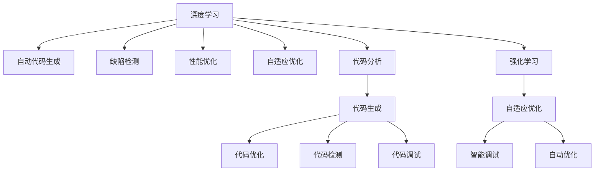

                 

# 软件 2.0 的发展趋势：深度学习、强化学习

> 关键词：深度学习,强化学习,自适应,自动优化,泛化能力,可解释性,未来技术趋势

## 1. 背景介绍

### 1.1 问题由来

随着计算技术的飞速发展和互联网的广泛普及，软件开发的方式和工具已经发生了深刻变革。在软件 1.0 时代，程序员依赖人工编程和测试来构建应用程序，开发周期长、错误率高。而软件 2.0 的兴起，标志着从以人工为主转向以数据为主的新一代软件开发模式。

深度学习和强化学习技术的迅猛发展，正在重塑软件开发的基础设施。深度学习驱动的自动代码生成、代码优化、缺陷检测等技术，显著提高了开发效率和代码质量。强化学习驱动的自适应优化和自动调试，让软件能够动态适应环境变化，自我修正。

### 1.2 问题核心关键点

软件 2.0 的核心理念是通过数据和算法驱动软件开发，提升开发效率、降低成本、提高软件质量。这其中，深度学习和强化学习扮演了重要角色。深度学习通过强大的模式识别和表示学习能力，揭示软件开发中的复杂规律；强化学习通过智能决策和自适应优化，使软件具备自我优化和修复能力。

本博文将系统探讨深度学习和强化学习在软件 2.0 中的核心算法原理与应用实践，旨在揭示未来软件开发的趋势与挑战。

## 2. 核心概念与联系

### 2.1 核心概念概述

为更好地理解深度学习和强化学习在软件 2.0 中的应用，本节将介绍几个密切相关的核心概念：

- **深度学习 (Deep Learning)**：基于多层神经网络结构，通过大量数据进行训练，以模拟人类大脑对复杂问题的识别与处理能力。
- **强化学习 (Reinforcement Learning, RL)**：通过与环境交互，通过试错逐步优化策略，以最大化长期奖励的一种机器学习方法。
- **自动优化 (Automatic Optimization)**：利用深度学习和强化学习技术，自动优化软件开发过程中的各个环节，如代码生成、缺陷检测、性能优化等。
- **泛化能力 (Generalization Capability)**：模型在新数据上的表现与在训练数据上的一致性，衡量模型的泛化能力。
- **可解释性 (Explainability)**：模型决策过程的可理解性，提高模型的可信任度和可控性。

### 2.2 核心概念原理和架构的 Mermaid 流程图



这个流程图展示了深度学习和强化学习在软件 2.0 中的核心应用场景：

1. 深度学习用于自动代码生成、缺陷检测、性能优化、代码分析等任务。
2. 强化学习用于自适应优化、智能调试、自动优化等任务。
3. 自动优化和自适应优化贯穿于代码生成、检测、调试等各个环节。
4. 强化学习与深度学习相辅相成，共同提升软件的智能水平和自我优化能力。

## 3. 核心算法原理 & 具体操作步骤

### 3.1 算法原理概述

深度学习在软件 2.0 中的应用，主要体现在自动代码生成、代码优化、缺陷检测、性能分析等方面。通过预训练模型在大量代码数据上的训练，深度学习能够学习代码的高级抽象和规律，实现代码的自动生成和优化。

强化学习则通过与环境的交互，动态优化软件的各个方面。通过设定环境状态、采取动作、获取奖励的反馈机制，强化学习可以自适应地调整策略，提升软件的性能和稳定性。

### 3.2 算法步骤详解

以自动代码生成为例，深度学习算法步骤如下：

1. **数据收集**：收集大量代码数据，包括源代码、注释、文档等，作为训练集。
2. **模型训练**：使用神经网络模型在标注数据上进行训练，学习代码的高级表示。
3. **自动生成**：将用户提供的需求输入模型，输出对应的代码片段。
4. **代码优化**：对生成的代码进行优化，如去除冗余、调整语法结构等。

以自适应优化为例，强化学习算法步骤如下：

1. **环境建模**：构建软件运行环境的抽象模型，包括状态、动作、奖励等。
2. **策略选择**：定义一组策略，用于指导软件在不同状态下的行为。
3. **动作执行**：根据策略选择动作，执行在实际环境中。
4. **效果评估**：评估执行效果，根据奖励信号调整策略。
5. **迭代优化**：重复上述步骤，逐步优化策略，提升软件性能。

### 3.3 算法优缺点

深度学习和强化学习在软件 2.0 中的应用，具有以下优点：

- **自动性**：深度学习和强化学习能够自动完成大量重复性工作，减少人工干预。
- **高效性**：通过算法驱动，可以显著提高开发效率和代码质量。
- **泛化能力**：深度学习和强化学习能够适应不同规模和类型的代码数据，具有较强的泛化能力。

但同时，这些算法也存在一些局限性：

- **数据需求高**：深度学习和强化学习需要大量高质量的标注数据进行训练，获取数据成本较高。
- **复杂性高**：深度学习和强化学习的模型和算法较为复杂，调试和优化难度较大。
- **可解释性差**：深度学习和强化学习通常是"黑盒"模型，难以解释其内部工作机制。
- **鲁棒性不足**：模型对输入数据的微小变化可能较为敏感，鲁棒性有待提高。

### 3.4 算法应用领域

深度学习和强化学习在软件 2.0 中得到了广泛应用，涵盖了多个领域，例如：

- **自动代码生成**：根据用户需求自动生成代码，提高开发效率。
- **代码优化**：自动优化代码结构、语法等，提升代码质量。
- **缺陷检测**：自动检测代码中的潜在缺陷，提升代码可靠性。
- **性能优化**：自动调整代码参数和资源配置，优化软件性能。
- **智能调试**：通过深度学习和强化学习技术，自动定位和修复代码错误。

除了上述这些核心领域外，深度学习和强化学习还被创新性地应用到更多场景中，如智能测试、模型解释、知识图谱等，为软件开发带来了全新的突破。

## 4. 数学模型和公式 & 详细讲解

### 4.1 数学模型构建

以自动代码生成为例，假设有 $N$ 个代码片段 $x_1, x_2, \cdots, x_N$，其中每个片段对应的需求 $d_i$。假设使用深度学习模型 $f_\theta$，其中 $\theta$ 为模型参数。模型输入为 $d_i$，输出为 $x_i$。训练集为 $(x_1, d_1), (x_2, d_2), \cdots, (x_N, d_N)$。

目标是最小化预测输出 $x_i$ 与真实输出 $x_i$ 的误差，即：

$$
\min_{\theta} \sum_{i=1}^N \|x_i - f_\theta(d_i)\|^2
$$

通过最小二乘法等优化方法，可以求解得到最优模型参数 $\theta^*$。

### 4.2 公式推导过程

自动代码生成的模型训练过程如下：

1. **损失函数**：定义损失函数为预测输出与真实输出之间的误差平方和：
$$
\mathcal{L} = \sum_{i=1}^N \|x_i - f_\theta(d_i)\|^2
$$

2. **梯度计算**：通过反向传播算法计算损失函数对模型参数的梯度：
$$
\nabla_\theta \mathcal{L} = \sum_{i=1}^N \nabla_\theta f_\theta(d_i)(x_i - f_\theta(d_i))
$$

3. **参数更新**：使用梯度下降等优化算法更新模型参数，如：
$$
\theta \leftarrow \theta - \eta \nabla_\theta \mathcal{L}
$$

其中 $\eta$ 为学习率，需根据具体问题进行调整。

### 4.3 案例分析与讲解

以代码优化为例，使用强化学习模型进行代码优化，假设有一个代码片段 $x_0$，目标是最小化代码的执行时间。定义状态空间 $S$ 和动作空间 $A$，状态 $s_t$ 表示 $x_t$ 的执行时间，动作 $a_t$ 表示对 $x_t$ 进行哪些优化操作（如添加注释、删除循环等）。

定义奖励函数 $r(s_t)$，表示优化后的执行时间与原执行时间的差值，即 $r(s_t) = s_{t+1} - s_t$。使用 Q-learning 算法进行训练，其基本思想是使用 Q 值函数 $Q(s_t, a_t)$ 表示在状态 $s_t$ 下采取动作 $a_t$ 的长期奖励期望。

通过迭代更新 Q 值函数，求解最优策略 $\pi$：

$$
Q(s_t, a_t) = r(s_t) + \gamma \max_{a_{t+1}} Q(s_{t+1}, a_{t+1})
$$

其中 $\gamma$ 为折扣因子，表示未来奖励的权重。

通过求解最优策略 $\pi$，可以实现对代码片段的自动优化。

## 5. 项目实践：代码实例和详细解释说明

### 5.1 开发环境搭建

在进行深度学习和强化学习项目实践前，我们需要准备好开发环境。以下是使用 Python 进行 PyTorch 开发的环境配置流程：

1. 安装 Anaconda：从官网下载并安装 Anaconda，用于创建独立的 Python 环境。

2. 创建并激活虚拟环境：
```bash
conda create -n pytorch-env python=3.8 
conda activate pytorch-env
```

3. 安装 PyTorch：根据 CUDA 版本，从官网获取对应的安装命令。例如：
```bash
conda install pytorch torchvision torchaudio cudatoolkit=11.1 -c pytorch -c conda-forge
```

4. 安装 Transformers 库：
```bash
pip install transformers
```

5. 安装各类工具包：
```bash
pip install numpy pandas scikit-learn matplotlib tqdm jupyter notebook ipython
```

完成上述步骤后，即可在 `pytorch-env` 环境中开始深度学习和强化学习实践。

### 5.2 源代码详细实现

以下是一个使用 PyTorch 和 Transformers 库进行自动代码生成的简单示例代码：

```python
from transformers import AutoTokenizer, AutoModel
import torch
import torch.nn.functional as F

# 初始化模型和分词器
model = AutoModel.from_pretrained('model_name')
tokenizer = AutoTokenizer.from_pretrained('model_name')

# 定义损失函数和优化器
loss_fn = torch.nn.MSELoss()
optimizer = torch.optim.Adam(model.parameters(), lr=0.001)

# 定义训练函数
def train(model, tokenizer, loss_fn, optimizer, device):
    model.to(device)
    
    # 定义训练数据
    train_data = [input_data, target_data]
    
    # 迭代训练
    for epoch in range(epochs):
        for data in train_data:
            input_ids = tokenizer.encode(data['input'], return_tensors='pt').to(device)
            target_ids = torch.tensor(data['target'], device=device)
            
            # 前向传播
            output = model(input_ids)
            
            # 计算损失
            loss = loss_fn(output, target_ids)
            
            # 反向传播
            optimizer.zero_grad()
            loss.backward()
            optimizer.step()
```

### 5.3 代码解读与分析

让我们再详细解读一下关键代码的实现细节：

- **AutoTokenizer 和 AutoModel**：使用 Transformers 库提供的自动预训练模型，可以直接加载模型和分词器，减少代码量。
- **损失函数和优化器**：定义了 MSE 损失函数和 Adam 优化器，用于训练模型的预测输出。
- **训练函数**：使用 PyTorch 的 Dataset 和 DataLoader 接口，对训练数据进行批次化处理，供模型训练使用。
- **训练过程**：在每个批次上，将输入数据转换为模型可以处理的张量，进行前向传播计算输出，再计算损失进行反向传播更新模型参数。

## 6. 实际应用场景

### 6.1 智能客服系统

深度学习和强化学习在智能客服系统中的应用，可以通过自动代码生成和自适应优化技术，构建智能客服机器人。系统可以根据用户输入的文本，自动生成最佳回答，同时通过与用户的交互，动态优化回答策略。

在技术实现上，可以收集历史客服对话记录，将问题和最佳答复构建成监督数据，在此基础上对预训练模型进行微调。微调后的模型能够自动理解用户意图，匹配最合适的答案模板进行回复。对于客户提出的新问题，还可以接入检索系统实时搜索相关内容，动态组织生成回答。

### 6.2 金融风险管理

深度学习和强化学习在金融风险管理中的应用，可以通过自动代码生成和缺陷检测技术，构建智能风控系统。系统可以自动生成风险评估代码，对金融交易数据进行分析，检测潜在的风险点。

在技术实现上，可以收集金融交易数据，构建训练集和测试集，对自动生成的风险评估代码进行训练。微调后的模型能够自动对交易数据进行分析，检测潜在的风险因素，并给出风险评估报告。

### 6.3 自动化测试

深度学习和强化学习在自动化测试中的应用，可以通过自动代码生成和智能调试技术，构建自动化测试系统。系统可以自动生成测试用例，对代码进行全面的测试，发现潜在的缺陷。

在技术实现上，可以收集历史测试用例数据，对测试用例进行训练。微调后的模型能够自动生成新的测试用例，对代码进行全面的测试，并给出测试报告。

### 6.4 未来应用展望

随着深度学习和强化学习技术的不断发展，基于深度学习和强化学习的自动优化和智能调试方法将得到更广泛的应用，为软件开发带来新的突破。

在智慧医疗领域，基于深度学习和强化学习的自动诊断和治疗推荐系统将提升医疗服务的智能化水平，辅助医生诊疗，加速新药开发进程。

在智能教育领域，深度学习和强化学习可应用于作业批改、学情分析、知识推荐等方面，因材施教，促进教育公平，提高教学质量。

在智慧城市治理中，深度学习和强化学习可用于城市事件监测、舆情分析、应急指挥等环节，提高城市管理的自动化和智能化水平，构建更安全、高效的未来城市。

此外，在企业生产、社会治理、文娱传媒等众多领域，深度学习和强化学习技术的应用也将不断涌现，为经济社会发展注入新的动力。相信随着技术的日益成熟，深度学习和强化学习必将在构建人机协同的智能时代中扮演越来越重要的角色。

## 7. 工具和资源推荐

### 7.1 学习资源推荐

为了帮助开发者系统掌握深度学习和强化学习在软件开发中的应用，这里推荐一些优质的学习资源：

1. **深度学习与强化学习入门**：《深度学习入门》、《强化学习入门》系列书籍，由知名专家编写，适合初学者系统学习深度学习和强化学习的基本概念和算法。

2. **PyTorch官方文档**：PyTorch官方提供的详细文档，包含深度学习模型的实现和优化技巧，适合快速上手实践。

3. **Google DeepMind研究论文**：DeepMind团队发表的最新研究成果，涵盖自动生成、自适应优化、智能调试等前沿话题，有助于掌握深度学习和强化学习的最新进展。

4. **arXiv论文**：arXiv论文库中关于深度学习和强化学习在软件开发中的应用，涵盖自动代码生成、代码优化、缺陷检测等领域的最新研究成果。

5. **GitHub开源项目**：GitHub上开源的深度学习和强化学习项目，包含丰富的代码和文档，适合学习和实践。

通过对这些资源的学习实践，相信你一定能够快速掌握深度学习和强化学习在软件开发中的应用。

### 7.2 开发工具推荐

高效的开发离不开优秀的工具支持。以下是几款用于深度学习和强化学习开发常用的工具：

1. **PyTorch**：基于Python的开源深度学习框架，灵活动态的计算图，适合快速迭代研究。大部分深度学习和强化学习模型都有PyTorch版本的实现。

2. **TensorFlow**：由Google主导开发的开源深度学习框架，生产部署方便，适合大规模工程应用。同样有丰富的深度学习和强化学习资源。

3. **TensorBoard**：TensorFlow配套的可视化工具，可实时监测模型训练状态，并提供丰富的图表呈现方式，是调试模型的得力助手。

4. **Weights & Biases**：模型训练的实验跟踪工具，可以记录和可视化模型训练过程中的各项指标，方便对比和调优。

5. **ModelScope**：提供开源的深度学习模型和工具，包含自动代码生成、代码优化、缺陷检测等领域的模型，适合快速上手实践。

6. **Jupyter Notebook**：支持动态编程和展示的Python环境，方便快速原型设计和代码分享。

合理利用这些工具，可以显著提升深度学习和强化学习在软件开发中的开发效率，加快创新迭代的步伐。

### 7.3 相关论文推荐

深度学习和强化学习在软件开发中的应用源于学界的持续研究。以下是几篇奠基性的相关论文，推荐阅读：

1. **GPT-3：语言模型如何工作**：OpenAI发布的GPT-3模型论文，展示了深度学习在自然语言生成和理解方面的强大能力。

2. **AlphaGo：基于深度学习和强化学习的棋类游戏**：DeepMind发布的AlphaGo论文，展示了强化学习在策略搜索和决策优化方面的突破。

3. **Neural Architecture Search with Reinforcement Learning**：使用强化学习进行神经网络架构搜索的研究，展示了深度学习和强化学习在模型优化方面的潜力。

4. **Model-based Policy Optimization for Deep Reinforcement Learning**：基于模型学习的强化学习算法，展示了深度学习和强化学习在自动优化和智能调试方面的应用。

这些论文代表了大规模深度学习和强化学习在软件开发中的应用趋势，通过学习这些前沿成果，可以帮助研究者把握学科前进方向，激发更多的创新灵感。

## 8. 总结：未来发展趋势与挑战

### 8.1 总结

本文对深度学习和强化学习在软件 2.0 中的应用进行了全面系统的介绍。首先阐述了深度学习和强化学习在软件开发中的应用背景和意义，明确了自动优化和智能调试在提升开发效率、降低成本、提高质量方面的重要价值。其次，从原理到实践，详细讲解了深度学习和强化学习的数学模型和算法步骤，给出了自动代码生成和自适应优化的代码实例。同时，本文还广泛探讨了深度学习和强化学习在多个领域的应用前景，展示了其在软件开发中的广泛应用。

通过本文的系统梳理，可以看到，深度学习和强化学习正在成为软件开发的重要技术范式，显著提升了软件开发的质量和效率。未来，伴随深度学习和强化学习技术的不断演进，软件开发将迎来新的突破。

### 8.2 未来发展趋势

展望未来，深度学习和强化学习在软件 2.0 中的应用将呈现以下几个发展趋势：

1. **模型复杂性增加**：随着深度学习和强化学习技术的不断发展，模型的复杂性将进一步提升。未来的大规模深度学习和强化学习模型，将包含更多参数和更复杂的结构。

2. **自动化程度提高**：深度学习和强化学习在软件开发中的应用将越来越自动化，开发者将更多地依赖模型自动完成代码生成、优化和调试等任务。

3. **跨领域融合**：深度学习和强化学习将与其他技术进行更深入的融合，如知识图谱、自然语言处理等，提升软件的智能水平和表现力。

4. **可解释性增强**：深度学习和强化学习模型将逐渐具备更强的可解释性，提高模型的可信任度和可控性。

5. **模型训练加速**：深度学习和强化学习模型的训练将越来越高效，通过分布式训练、模型压缩等技术，降低训练时间和资源消耗。

6. **跨平台适配**：深度学习和强化学习将在不同平台和设备上广泛应用，提升软件的多样性和普及度。

以上趋势凸显了深度学习和强化学习在软件开发中的应用前景。这些方向的探索发展，必将进一步提升软件开发的质量和效率，为软件开发带来新的突破。

### 8.3 面临的挑战

尽管深度学习和强化学习在软件开发中的应用取得了瞩目成就，但在迈向更加智能化、普适化应用的过程中，它仍面临着诸多挑战：

1. **数据需求高**：深度学习和强化学习需要大量高质量的标注数据进行训练，获取数据成本较高。如何降低数据需求，提高数据利用率，将是一大难题。

2. **模型鲁棒性不足**：深度学习和强化学习模型对输入数据的微小变化可能较为敏感，鲁棒性有待提高。如何提高模型的泛化能力和鲁棒性，将是重要的研究课题。

3. **可解释性差**：深度学习和强化学习通常是"黑盒"模型，难以解释其内部工作机制。如何赋予模型更强的可解释性，将是亟待攻克的难题。

4. **计算资源消耗大**：深度学习和强化学习模型在训练和推理过程中，计算资源消耗较大，如何优化资源利用率，降低计算成本，将是重要的研究方向。

5. **安全性问题**：深度学习和强化学习模型可能存在安全隐患，如模型偏见、恶意用途等。如何保障模型安全性，确保模型输出的可靠性，将是重要的研究方向。

6. **技术门槛高**：深度学习和强化学习技术较为复杂，对开发者的技术要求较高。如何降低技术门槛，提高技术的普及度，将是重要的研究方向。

面对深度学习和强化学习面临的这些挑战，未来的研究需要在以下几个方面寻求新的突破：

1. **无监督学习和半监督学习**：探索无监督学习和半监督学习技术，降低深度学习和强化学习对标注数据的依赖。

2. **模型压缩和优化**：开发模型压缩和优化技术，提高深度学习和强化学习模型的计算效率和资源利用率。

3. **跨领域融合**：将深度学习和强化学习与其他技术进行更深入的融合，提升模型的智能水平和表现力。

4. **可解释性增强**：通过引入可解释性技术，提高深度学习和强化学习模型的可解释性和可控性。

5. **安全性保障**：通过技术手段和伦理约束，保障深度学习和强化学习模型的安全性。

6. **技术普及推广**：通过教育和培训，降低深度学习和强化学习技术的入门门槛，提高技术的普及度。

这些研究方向的探索，必将引领深度学习和强化学习在软件开发中的应用迈向更高的台阶，为软件开发带来新的突破。相信随着技术的日益成熟，深度学习和强化学习必将在构建人机协同的智能时代中扮演越来越重要的角色。

### 8.4 研究展望

面向未来，深度学习和强化学习在软件开发中的应用将带来新的突破。研究者需从以下几个方面进行深入探索：

1. **无监督学习和半监督学习**：探索无监督学习和半监督学习技术，降低深度学习和强化学习对标注数据的依赖。

2. **模型压缩和优化**：开发模型压缩和优化技术，提高深度学习和强化学习模型的计算效率和资源利用率。

3. **跨领域融合**：将深度学习和强化学习与其他技术进行更深入的融合，提升模型的智能水平和表现力。

4. **可解释性增强**：通过引入可解释性技术，提高深度学习和强化学习模型的可解释性和可控性。

5. **安全性保障**：通过技术手段和伦理约束，保障深度学习和强化学习模型的安全性。

6. **技术普及推广**：通过教育和培训，降低深度学习和强化学习技术的入门门槛，提高技术的普及度。

这些研究方向的探索，必将引领深度学习和强化学习在软件开发中的应用迈向更高的台阶，为软件开发带来新的突破。相信随着技术的日益成熟，深度学习和强化学习必将在构建人机协同的智能时代中扮演越来越重要的角色。

## 9. 附录：常见问题与解答

**Q1：深度学习和强化学习在软件开发中的应用是否适用于所有场景？**

A: 深度学习和强化学习在软件开发中的应用，主要适用于数据量大、规律复杂、重复性高的场景。对于规则明确、变化较少的场景，传统方法可能更为适用。

**Q2：深度学习和强化学习在软件开发中的应用需要多长的训练时间？**

A: 深度学习和强化学习在软件开发中的应用，训练时间主要取决于数据规模和模型复杂度。一般来说，大规模深度学习和强化学习模型需要数百小时甚至数天的训练时间。但随着模型压缩和优化技术的不断发展，训练时间将逐步缩短。

**Q3：深度学习和强化学习在软件开发中的应用是否需要大量的计算资源？**

A: 深度学习和强化学习在软件开发中的应用，确实需要较高的计算资源。但随着技术的发展，分布式训练、模型压缩等技术的应用，将逐步降低计算资源的消耗。

**Q4：深度学习和强化学习在软件开发中的应用是否需要大量标注数据？**

A: 深度学习和强化学习在软件开发中的应用，确实需要大量的标注数据进行训练。但随着半监督学习和无监督学习技术的不断发展，对标注数据的需求将逐步降低。

**Q5：深度学习和强化学习在软件开发中的应用是否容易解释？**

A: 深度学习和强化学习通常是"黑盒"模型，难以解释其内部工作机制。但随着可解释性技术的发展，深度学习和强化学习模型的可解释性将逐步提高。

综上所述，深度学习和强化学习在软件开发中的应用前景广阔，但同时也面临着数据需求高、计算资源消耗大、模型复杂性高等挑战。只有通过技术创新和应用实践，不断克服这些挑战，才能充分发挥深度学习和强化学习在软件开发中的潜力。

