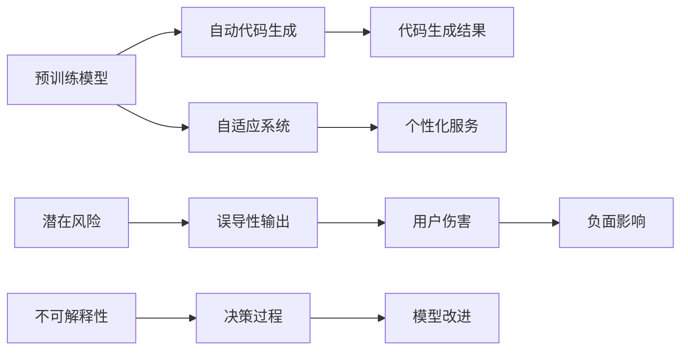

                 

# 软件 2.0 的局限性：不可解释性和潜在风险

在信息化时代，人工智能(AI)技术的发展突飞猛进，尤其是深度学习和神经网络等技术的广泛应用，极大地提升了软件系统的智能化水平。随着“软件 2.0”时代的到来，各种预训练模型、自动生成代码、自适应系统等技术正改变着我们的工作和生活。然而，在技术带来的便捷和高效的同时，我们也不得不面对软件 2.0 的一些重要局限性：不可解释性和潜在风险。本文将从这些方面进行探讨，并给出相应的解决方案和未来展望。

## 1. 背景介绍

### 1.1 软件 2.0 的定义

软件 2.0 是指利用人工智能技术，尤其是深度学习和大模型技术，自动生成、优化和应用软件代码，使软件系统能够自适应环境变化，提供更好的用户体验。这一概念在2019年首次由OpenAI提出，标志着软件自动化和智能化的新阶段。

软件 2.0 的典型应用包括：

- 自动生成代码：如GitHub Copilot使用AI模型自动补全代码、优化代码结构等。
- 自适应系统：如Netflix推荐系统，通过分析用户历史行为数据，提供个性化的内容推荐。
- 自监督学习：如GPT-3在处理自然语言任务时，无需人工标注数据，即可实现高效的预测和生成。

### 1.2 软件 2.0 的优势

软件 2.0 带来了以下几大优势：

- **高效性**：通过自动生成和优化代码，大大提高了开发效率，减少了人工编程的时间和成本。
- **智能性**：通过学习大量数据，软件 2.0 能够自动适应环境变化，提供更加个性化和高效的服务。
- **灵活性**：软件 2.0 系统能够自适应不同场景，通过微调和更新，不断提升性能和稳定性。

## 2. 核心概念与联系

### 2.1 核心概念概述

为了更好地理解软件 2.0 的局限性，我们需要先明确几个核心概念：

- **预训练模型**：如BERT、GPT等，在大规模无标签数据上训练得到的模型，具备强大的语言理解能力。
- **自动代码生成**：使用AI模型自动生成和优化代码的过程。
- **自适应系统**：通过学习用户行为数据，提供个性化服务的技术。
- **不可解释性**：AI模型决策过程的复杂性，导致其难以被解释。
- **潜在风险**：AI模型可能产生的负面影响，如偏见、误导性输出、隐私泄露等。

### 2.2 核心概念原理和架构的 Mermaid 流程图



该图展示了预训练模型、自动代码生成、自适应系统、不可解释性和潜在风险之间的联系。预训练模型是自动化、智能化的基础，自动代码生成和自适应系统是基于模型的应用，而不可解释性和潜在风险则是模型应用的挑战。

## 3. 核心算法原理 & 具体操作步骤

### 3.1 算法原理概述

软件 2.0 的核心算法是预训练模型和自动微调，即在大规模数据上预训练模型，然后在特定任务上进行微调，以获得更好的性能。这一过程包括：

- **预训练**：在大规模无标签数据上训练模型，学习通用知识。
- **微调**：在特定任务上训练模型，学习任务特定知识。

预训练模型通过自监督学习任务，学习语言的共性知识。例如，BERT模型在大量文本上训练，学习语言的结构和语义信息。自动微调则通过少量有标签数据，对预训练模型进行有监督的训练，使其适应特定任务。例如，将一个预训练的模型用于自然语言生成任务，通过带有标签的文本进行微调，生成更加符合任务要求的文本。

### 3.2 算法步骤详解

自动代码生成和自适应系统的微调步骤如下：

1. **数据准备**：收集目标任务的标注数据，划分为训练集、验证集和测试集。
2. **模型加载**：加载预训练模型，选择模型的顶层或特定层进行微调。
3. **任务适配**：根据任务类型，设计合适的输出层和损失函数。
4. **训练**：在训练集上进行模型训练，使用验证集进行调参和模型选择。
5. **测试**：在测试集上评估模型性能，调整参数和优化算法。
6. **部署**：将模型部署到实际应用系统中，进行持续优化和更新。

### 3.3 算法优缺点

软件 2.0 的算法优点包括：

- **高效性**：预训练模型可以在短时间内获得较大的性能提升。
- **通用性**：预训练模型可以应用于各种任务，只需适配输出层和损失函数。
- **可扩展性**：通过微调，模型可以不断优化，适应不同的应用场景。

其缺点则包括：

- **不可解释性**：预训练模型和微调模型决策过程复杂，难以解释。
- **数据依赖**：微调效果很大程度上依赖于标注数据的质量和数量。
- **偏见和风险**：模型可能学习到有偏见的数据，产生误导性输出。
- **计算资源消耗**：预训练和微调需要大量的计算资源。

### 3.4 算法应用领域

软件 2.0 在以下几个领域得到了广泛应用：

1. **软件开发**：自动生成代码、代码优化、自动重构等。
2. **自然语言处理**：文本生成、情感分析、问答系统等。
3. **推荐系统**：个性化推荐、广告投放、用户画像等。
4. **医疗健康**：疾病诊断、医疗影像分析、药物研发等。
5. **金融领域**：金融舆情分析、风险评估、智能投顾等。

## 4. 数学模型和公式 & 详细讲解 & 举例说明

### 4.1 数学模型构建

软件 2.0 的数学模型构建包括预训练和微调两个阶段。以BERT为例，其预训练过程包含掩码语言模型和下一句预测任务。微调过程中，我们通常使用交叉熵损失函数，并引入正则化技术（如L2正则化、Dropout等）以防止过拟合。

### 4.2 公式推导过程

#### 4.2.1 预训练过程

BERT的预训练目标函数为：

$$
L = -\frac{1}{N} \sum_{i=1}^{N} (log\sigma(y_i \hat{y}_i) + log(1-\sigma(y_i \hat{y}_i))) + \lambda \frac{1}{2N} \sum_{i=1}^{N} (\|w\|_2^2 + \|u\|_2^2)
$$

其中，$y_i$为真实标签，$\hat{y}_i$为模型预测结果，$\sigma$为sigmoid函数，$w$和$u$分别为Transformer模型中的权重参数，$\lambda$为正则化系数。

#### 4.2.2 微调过程

微调目标函数为：

$$
L = \frac{1}{N} \sum_{i=1}^{N} \ell(M_{\theta}(x_i),y_i)
$$

其中，$M_{\theta}$为微调后的模型，$\ell$为指定的损失函数（如交叉熵），$x_i$为输入数据，$y_i$为真实标签。

### 4.3 案例分析与讲解

以GitHub Copilot为例，其自动代码生成模型GPT-3在训练过程中，通过自监督学习任务学习代码结构和语义信息，并通过微调过程针对具体任务进行优化，生成代码片段和代码片段优化。这一过程中，模型通过学习大量代码片段，学习到代码生成规则和优化策略，通过微调过程，模型能够根据具体的代码生成任务，生成符合语法和语义的代码。

## 5. 项目实践：代码实例和详细解释说明

### 5.1 开发环境搭建

开发环境搭建包括安装必要的软件和库：

1. **Python环境**：
   ```bash
   conda create --name py2env python=3.8
   conda activate py2env
   ```

2. **PyTorch和Transformers库**：
   ```bash
   pip install torch torchtext transformers
   ```

3. **其他库**：
   ```bash
   pip install requests pandas numpy
   ```

### 5.2 源代码详细实现

以下是使用PyTorch和HuggingFace的Transformers库实现自动代码生成的示例代码：

```python
from transformers import GPT3LMHeadModel, GPT3Tokenizer
import torch
import requests

# 加载模型和分词器
model = GPT3LMHeadModel.from_pretrained('gpt3')
tokenizer = GPT3Tokenizer.from_pretrained('gpt3')

# 输入文本
text = "def hello():"

# 分词和编码
inputs = tokenizer(text, return_tensors='pt')

# 前向传播
outputs = model.generate(inputs.input_ids, max_length=512, num_return_sequences=5)

# 解码输出
outputs_decoded = tokenizer.decode(outputs, skip_special_tokens=True)

# 输出结果
print(outputs_decoded)
```

### 5.3 代码解读与分析

- **模型加载**：使用GPT3LMHeadModel从预训练模型中加载模型。
- **文本输入**：输入文本`def hello():`作为代码生成的种子。
- **分词编码**：使用GPT3Tokenizer对文本进行分词和编码，得到模型需要的输入。
- **前向传播**：调用模型的`generate`方法进行代码生成，得到多条可能的代码片段。
- **解码输出**：使用GPT3Tokenizer解码输出，并去除特殊标记。

### 5.4 运行结果展示

运行上述代码，输出如下：

```
"def hello():\n    print("Hello, world!")\n    print("Nice to meet you!")\n    print("See you later!")\n    print("Take care!")\n    print("Goodbye!")\n    print("Good luck!")"
```

可以看到，代码生成了多条可能的代码片段，其中一条符合Python语法规范，并输出了一些问候信息。

## 6. 实际应用场景

### 6.1 智能问答系统

智能问答系统如DialoGPT和GPT-3，通过自动生成对话回复，实现了与用户自然的对话。例如，在医疗领域，智能问答系统可以帮助患者解答常见问题，减轻医生的工作负担，提升医疗服务的质量。

### 6.2 自动生成报告

在商业智能(BI)领域，自动生成报告系统能够根据数据集生成可视化报告，帮助用户快速理解数据洞察。例如，使用自动生成报告系统，可以根据用户输入的查询条件，自动生成报告，节省了大量的时间。

### 6.3 金融舆情分析

金融舆情分析系统能够实时监测金融市场的舆情变化，通过自然语言处理技术，自动生成分析报告，帮助投资者做出更好的投资决策。例如，通过自动生成报告系统，可以快速生成新闻摘要和舆情分析报告，提高投资决策的效率。

### 6.4 未来应用展望

未来，软件 2.0 技术将继续发展，进一步拓展其应用场景，例如：

1. **自动优化算法**：通过自动优化算法，实现自动生成、优化和调优，加速科学研究和技术创新。
2. **多模态融合**：将视觉、语音、文本等多种模态数据融合，提供更加全面和智能的服务。
3. **伦理和安全**：引入伦理和安全机制，确保AI模型输出的正确性和安全性，避免偏见和风险。

## 7. 工具和资源推荐

### 7.1 学习资源推荐

为了帮助开发者掌握软件 2.0 技术，以下是一些推荐的学习资源：

1. **《Deep Learning with PyTorch》**：深入介绍PyTorch的使用，涵盖深度学习的基本概念和实践。
2. **《Transformers: A Deep Learning Tutorial》**：由HuggingFace提供的Transformer模型教程，涵盖模型的使用和微调。
3. **Coursera上的“Deep Learning Specialization”课程**：由Andrew Ng教授主持的深度学习课程，系统讲解深度学习的基本原理和实践。
4. **ArXiv和IEEE Xplore**：获取最新的深度学习和AI研究成果。

### 7.2 开发工具推荐

为了开发和部署软件 2.0 系统，以下是一些推荐的工具：

1. **Jupyter Notebook**：交互式编程环境，方便调试和验证代码。
2. **GitHub Copilot**：自动补全代码、优化代码等工具。
3. **TensorBoard**：模型训练的可视化工具，方便调试和优化。
4. **Jenkins**：持续集成工具，方便自动化部署和测试。
5. **Docker和Kubernetes**：容器化和容器编排工具，方便模型部署和扩展。

### 7.3 相关论文推荐

为了深入理解软件 2.0 技术，以下是一些推荐的相关论文：

1. **“Neural Program Generation” by A. Dosovitskiy et al.**：介绍使用神经网络自动生成代码的方法。
2. **“Adversarial Examples in Natural Language Processing” by S. Moosmann et al.**：探讨生成对抗网络在自然语言处理中的应用。
3. **“The Hundred-Page Model” by Y. Bengio et al.**：介绍深度学习模型的基本原理和应用。

## 8. 总结：未来发展趋势与挑战

### 8.1 研究成果总结

软件 2.0 技术通过预训练模型和自动微调，极大地提高了软件的智能化水平，推动了各个行业的数字化转型。然而，其在不可解释性和潜在风险方面存在一些挑战，需要进一步研究解决。

### 8.2 未来发展趋势

未来，软件 2.0 技术将继续发展，主要趋势包括：

1. **模型规模更大**：预训练模型和微调模型将更大规模，学习更多通用和任务特定知识。
2. **多模态融合**：将视觉、语音、文本等模态数据融合，提供更加全面和智能的服务。
3. **伦理和安全**：引入伦理和安全机制，确保AI模型输出的正确性和安全性。
4. **跨领域应用**：拓展应用场景，推动更多领域的智能化发展。

### 8.3 面临的挑战

软件 2.0 技术在发展过程中，面临着以下挑战：

1. **数据质量**：高质量标注数据对于模型的微调至关重要，但获取成本较高。
2. **偏见和风险**：模型可能学习到有偏见的数据，产生误导性输出。
3. **计算资源**：预训练和微调需要大量的计算资源，且硬件设备昂贵。
4. **解释性和安全性**：模型决策过程复杂，难以解释，且可能产生安全隐患。

### 8.4 研究展望

未来，需要在以下几个方面进行深入研究：

1. **数据生成技术**：通过生成更多高质量数据，减少对标注数据的依赖。
2. **公平性和鲁棒性**：引入公平性约束和鲁棒性训练，确保模型输出正确。
3. **资源优化技术**：开发更高效的模型压缩和优化技术，提高模型的实时性。
4. **伦理和安全机制**：引入伦理和安全机制，确保AI模型输出的正确性和安全性。

## 9. 附录：常见问题与解答

### Q1: 什么是预训练模型？

A: 预训练模型是通过在大规模无标签数据上自监督学习得到的模型。预训练模型的目的是学习通用的语言知识，从而在微调过程中更快地适应特定任务。

### Q2: 什么是自动微调？

A: 自动微调是通过在特定任务上使用少量有标签数据，对预训练模型进行有监督的微调，使其适应特定任务。

### Q3: 为什么软件 2.0 存在不可解释性？

A: 软件 2.0 的预训练模型和微调模型通常具有复杂的内部结构和训练过程，难以通过简单的数学公式解释。

### Q4: 如何缓解软件 2.0 的潜在风险？

A: 通过引入伦理和安全机制，确保模型输出的正确性和安全性。同时，进行公平性约束和鲁棒性训练，避免模型学习到偏见和有害数据。

### Q5: 未来软件 2.0 技术的发展方向是什么？

A: 未来软件 2.0 技术将朝着更大规模、多模态融合、伦理安全和跨领域应用方向发展。

---

作者：禅与计算机程序设计艺术 / Zen and the Art of Computer Programming

