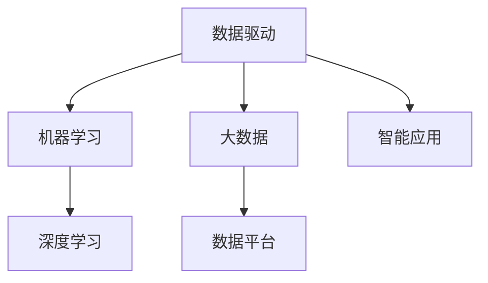

                 

# 软件 2.0 的时代：数据驱动一切

> 关键词：数据驱动, 人工智能, 大数据, 机器学习, 深度学习, 深度学习框架

## 1. 背景介绍

### 1.1 问题由来

软件技术的演进经历了从程序 1.0 到程序 2.0 的革命性转变。在程序 1.0 时代，软件开发主要依赖于程序员的经验和直觉，通过编写代码实现功能。而在程序 2.0 时代，软件开发则转向了数据驱动的范式，即利用大量数据训练机器学习模型，自动发现数据中的规律和模式，从而实现更高效、更智能的软件系统。

随着互联网的普及和物联网设备的广泛应用，大数据正以前所未有的速度产生和积累。据估计，全球每年产生的数据量已达到数百万PB，数据已成为企业最宝贵的资产之一。如何有效管理和利用这些数据，挖掘其潜在价值，成为了企业竞争力的关键。数据驱动的软件开发范式应运而生，成为应对这一挑战的重要工具。

### 1.2 问题核心关键点

数据驱动的软件开发范式，主要依赖于以下几个关键点：

1. 数据获取与清洗：收集、整合和预处理来自不同渠道的数据，确保数据的准确性和完整性。
2. 模型选择与训练：选择合适的机器学习算法和深度学习框架，对数据进行建模和训练，生成智能模型。
3. 模型部署与优化：将训练好的模型部署到实际应用中，持续监测和优化模型的性能。
4. 数据持续学习：通过实时数据流，持续更新和训练模型，保持模型的时效性和适应性。

这些关键点共同构成了数据驱动软件开发的核心框架，使得软件系统能够更好地利用数据资源，提升决策的准确性和自动化程度。

## 2. 核心概念与联系

### 2.1 核心概念概述

为更好地理解数据驱动软件开发的方法论，本节将介绍几个密切相关的核心概念：

- 数据驱动：指通过数据驱动决策，而不是仅依赖经验或直觉的软件开发方法。
- 机器学习：一种利用算法和模型，通过数据自动发现规律和模式，实现预测和决策的计算技术。
- 深度学习：机器学习的一个分支，通过多层神经网络，从数据中自动提取高层次特征，实现更精确的预测和决策。
- 大数据：指通过高速、大量的数据处理和分析，发现隐藏在数据中的规律和知识。
- 数据平台：指集中管理和存储数据的平台，支持数据的采集、清洗、分析和应用。
- 智能应用：指基于数据驱动的决策模型和算法，实现智能自动化处理的应用系统。

这些核心概念之间的逻辑关系可以通过以下Mermaid流程图来展示：



这个流程图展示了几类核心概念之间的关系：

1. 数据驱动是整个软件开发方法论的核心理念。
2. 机器学习和深度学习是实现数据驱动的两种主要技术手段。
3. 大数据是机器学习和深度学习的基础，提供高质量的数据资源。
4. 数据平台是管理和应用大数据的核心工具，支持数据的集中化存储和处理。
5. 智能应用是数据驱动的最终目标，实现自动化、智能化处理。

这些概念共同构成了数据驱动软件开发的方法论，使其能够在数据驱动时代，充分发挥数据资源的价值。

## 3. 核心算法原理 & 具体操作步骤
### 3.1 算法原理概述

数据驱动的软件开发，本质上是一种基于数据的算法驱动方法。其核心思想是通过机器学习算法和深度学习框架，自动从数据中学习规律和模式，生成智能模型。这些模型能够高效地处理和分析大量数据，从而实现更准确的预测和决策。

在实际应用中，数据驱动的软件开发一般包括以下几个步骤：

1. 数据获取与预处理：收集和清洗来自不同渠道的数据，确保数据的准确性和完整性。
2. 特征工程与选择：选择合适的特征，对数据进行特征提取和特征工程，以提高模型的预测能力。
3. 模型选择与训练：选择合适的机器学习或深度学习算法，对数据进行建模和训练，生成智能模型。
4. 模型评估与优化：对训练好的模型进行评估和优化，确保模型在实际应用中能够取得良好的效果。
5. 模型部署与应用：将训练好的模型部署到实际应用中，实现数据的自动化处理和决策。

### 3.2 算法步骤详解

以下是数据驱动软件开发的一般流程：

**Step 1: 数据获取与预处理**
- 收集来自不同渠道的数据，包括结构化数据（如数据库、API）和非结构化数据（如文本、图像、音频）。
- 对数据进行清洗和预处理，去除噪声和异常值，确保数据的准确性和一致性。
- 进行特征提取和特征工程，选择合适的特征，并对数据进行标准化和归一化。

**Step 2: 特征工程与选择**
- 对数据进行特征选择，确定哪些特征对模型预测具有重要影响。
- 对数据进行特征工程，如维度降维、生成新特征等，以提高模型的预测能力。
- 对特征进行编码，如将分类特征编码为独热编码，数值特征进行归一化处理。

**Step 3: 模型选择与训练**
- 选择合适的机器学习算法或深度学习框架，如TensorFlow、PyTorch等。
- 设计训练数据集和验证数据集，按照一定的比例划分为训练集和验证集。
- 设置模型的超参数，如学习率、批大小、迭代轮数等。
- 训练模型，通过反向传播算法更新模型参数，最小化损失函数。
- 在验证集上评估模型性能，根据性能指标调整超参数。

**Step 4: 模型评估与优化**
- 对训练好的模型进行评估，计算准确率、召回率、F1值等指标。
- 使用交叉验证、超参数搜索等方法，进一步优化模型的性能。
- 进行模型诊断，识别模型中存在的问题，如过拟合、欠拟合等。

**Step 5: 模型部署与应用**
- 将训练好的模型部署到实际应用中，实现数据的自动化处理和决策。
- 集成模型到现有的系统架构中，确保系统的稳定性和可靠性。
- 持续监测模型的性能，根据数据流量的变化进行动态调整。

### 3.3 算法优缺点

数据驱动的软件开发具有以下优点：

1. 高效性：自动从数据中学习规律和模式，实现高效的预测和决策。
2. 准确性：通过大量数据的训练，生成高精度的预测模型。
3. 可扩展性：适用于各种数据驱动的应用场景，具有较强的扩展能力。
4. 自动化：通过算法和模型，自动完成数据处理和决策，减少人工干预。

同时，该方法也存在一定的局限性：

1. 数据质量要求高：数据驱动的软件开发依赖于高质量的数据，数据获取和预处理较为复杂。
2. 模型解释性差：许多深度学习模型，如神经网络，具有黑盒性质，难以解释其内部工作机制。
3. 对标注数据依赖：一些高级机器学习算法，如深度学习，需要大量标注数据进行训练，标注成本较高。
4. 模型泛化能力：数据驱动的软件开发依赖于已有数据，对新数据泛化能力可能较差。

尽管存在这些局限性，但就目前而言，数据驱动的软件开发范式已经在大数据时代占据了主导地位，成为数据驱动软件开发的重要方法。未来相关研究的重点在于如何进一步降低数据驱动方法的局限性，提高模型的少样本学习和跨领域迁移能力，同时兼顾可解释性和伦理安全性等因素。

### 3.4 算法应用领域

数据驱动的软件开发范式，已经在诸多领域得到了广泛的应用，如：

- 金融分析：通过数据驱动的算法，实现对金融市场的预测和风险评估。
- 医疗诊断：利用医疗数据，生成智能诊断模型，提高疾病诊断的准确性和效率。
- 智能推荐：通过用户行为数据，生成个性化推荐模型，提高推荐系统的性能。
- 自然语言处理：通过文本数据，生成自然语言处理模型，实现自动化文本分析和生成。
- 图像识别：利用图像数据，生成图像识别模型，实现自动化图像处理和识别。
- 物联网：通过设备数据，生成智能控制系统，实现物联网设备的自动化管理。

除了上述这些经典应用外，数据驱动的软件开发范式还在更多领域不断涌现，为各行各业带来了全新的应用场景和价值提升。

## 4. 数学模型和公式 & 详细讲解 & 举例说明

### 4.1 数学模型构建

在数据驱动的软件开发中，常用的数学模型包括线性回归模型、决策树模型、随机森林模型、神经网络模型等。这里以线性回归模型为例，详细讲解其构建过程。

假设有一组训练数据集 $D=\{(x_i,y_i)\}_{i=1}^N$，其中 $x_i$ 为输入特征向量，$y_i$ 为输出标签。线性回归模型的目标是找到一条线性函数 $f(x)=\theta^T x$，使得模型在训练集上的损失最小化。

损失函数定义为均方误差损失：

$$
J(\theta) = \frac{1}{2N} \sum_{i=1}^N (y_i - f(x_i))^2
$$

其中 $\theta^T$ 为模型参数，$x_i$ 为输入特征向量，$y_i$ 为输出标签。

模型的最小化目标是：

$$
\theta^* = \mathop{\arg\min}_{\theta} J(\theta)
$$

通过梯度下降等优化算法，最小化损失函数，更新模型参数 $\theta$。

### 4.2 公式推导过程

以下是线性回归模型的详细推导过程：

假设有一组训练数据集 $D=\{(x_i,y_i)\}_{i=1}^N$，其中 $x_i$ 为输入特征向量，$y_i$ 为输出标签。线性回归模型的目标是找到一条线性函数 $f(x)=\theta^T x$，使得模型在训练集上的损失最小化。

损失函数定义为均方误差损失：

$$
J(\theta) = \frac{1}{2N} \sum_{i=1}^N (y_i - f(x_i))^2
$$

其中 $\theta^T$ 为模型参数，$x_i$ 为输入特征向量，$y_i$ 为输出标签。

对 $J(\theta)$ 求导，得到参数 $\theta$ 的梯度：

$$
\nabla_{\theta} J(\theta) = \frac{1}{N} \sum_{i=1}^N (y_i - f(x_i)) x_i
$$

根据梯度下降算法，更新模型参数 $\theta$：

$$
\theta \leftarrow \theta - \eta \nabla_{\theta} J(\theta)
$$

其中 $\eta$ 为学习率。

迭代更新模型参数，直至收敛。

### 4.3 案例分析与讲解

以房价预测为例，说明如何使用数据驱动的线性回归模型进行房价预测。

假设有一组训练数据集 $D=\{(x_i,y_i)\}_{i=1}^N$，其中 $x_i$ 为输入特征向量，$y_i$ 为输出标签（房价）。线性回归模型的目标是找到一条线性函数 $f(x)=\theta^T x$，使得模型在训练集上的损失最小化。

在实际应用中，可以通过以下步骤实现：

1. 收集和清洗数据：收集来自不同渠道的房价数据，并进行清洗和预处理。
2. 特征工程：选择特征，如房屋面积、地理位置、房龄等，并进行特征提取和编码。
3. 模型训练：使用训练集数据，训练线性回归模型，得到模型参数 $\theta$。
4. 模型评估：使用验证集数据，评估模型的预测效果，计算准确率、均方误差等指标。
5. 模型部署：将训练好的模型部署到实际应用中，实现房价预测。

通过数据驱动的线性回归模型，可以有效预测房价，为房地产市场提供决策支持。

## 5. 项目实践：代码实例和详细解释说明

### 5.1 开发环境搭建

在进行数据驱动的软件开发项目实践前，我们需要准备好开发环境。以下是使用Python进行PyTorch开发的环境配置流程：

1. 安装Anaconda：从官网下载并安装Anaconda，用于创建独立的Python环境。

2. 创建并激活虚拟环境：
```bash
conda create -n pytorch-env python=3.8 
conda activate pytorch-env
```

3. 安装PyTorch：根据CUDA版本，从官网获取对应的安装命令。例如：
```bash
conda install pytorch torchvision torchaudio cudatoolkit=11.1 -c pytorch -c conda-forge
```

4. 安装TensorFlow：使用以下命令安装TensorFlow：
```bash
pip install tensorflow
```

5. 安装TensorBoard：用于可视化和监控模型的训练过程，是调试模型的得力助手。

6. 安装Keras：作为Python的高层神经网络库，Keras可以快速搭建深度学习模型。

7. 安装scikit-learn：用于数据预处理和模型评估，适合进行机器学习实验。

完成上述步骤后，即可在`pytorch-env`环境中开始项目实践。

### 5.2 源代码详细实现

这里以房价预测为例，说明如何使用数据驱动的线性回归模型进行房价预测。

首先，定义线性回归模型：

```python
import torch
import torch.nn as nn
import torch.optim as optim

class LinearRegression(nn.Module):
    def __init__(self, input_size, output_size):
        super(LinearRegression, self).__init__()
        self.linear = nn.Linear(input_size, output_size)
    
    def forward(self, x):
        return self.linear(x)
```

接着，定义损失函数和优化器：

```python
criterion = nn.MSELoss()
optimizer = optim.SGD(model.parameters(), lr=0.01)
```

然后，定义训练函数：

```python
def train(model, train_loader, criterion, optimizer, epochs):
    model.train()
    for epoch in range(epochs):
        for batch_idx, (data, target) in enumerate(train_loader):
            optimizer.zero_grad()
            output = model(data)
            loss = criterion(output, target)
            loss.backward()
            optimizer.step()
```

最后，训练模型并评估：

```python
train_loader = torch.utils.data.DataLoader(train_dataset, batch_size=32)
test_loader = torch.utils.data.DataLoader(test_dataset, batch_size=32)

model.train()
for epoch in range(epochs):
    train(model, train_loader, criterion, optimizer, epochs)

model.eval()
with torch.no_grad():
    test_loss = 0
    correct = 0
    total = 0
    for data, target in test_loader:
        output = model(data)
        test_loss += criterion(output, target).item()
        _, predicted = output.max(1)
        total += target.size(0)
        correct += predicted.eq(target).sum().item()

print('Test Loss: {:.4f}\nAccuracy: {:.2f}%'.format(test_loss/len(test_loader), 100 * correct/total))
```

以上就是使用PyTorch进行房价预测的完整代码实现。可以看到，得益于TensorFlow和Keras的高层抽象，代码实现相对简洁高效。

### 5.3 代码解读与分析

让我们再详细解读一下关键代码的实现细节：

**LinearRegression类**：
- `__init__`方法：初始化线性回归模型，包括权重和偏置。
- `forward`方法：定义前向传播过程，计算模型输出。

**损失函数和优化器**：
- `criterion`变量：定义均方误差损失函数。
- `optimizer`变量：定义随机梯度下降优化器，学习率为0.01。

**训练函数**：
- `train`函数：定义训练过程，包含前向传播、损失计算、反向传播和参数更新。
- `batch_idx`：批次索引，用于遍历训练数据集。

**测试过程**：
- `test_loader`：定义测试数据集的加载器。
- `test_loss`：定义测试集的损失变量。
- `correct`和`total`：分别用于统计正确预测和总数。

通过以上代码实现，可以简单高效地训练线性回归模型，并进行房价预测。

## 6. 实际应用场景

### 6.1 金融分析

在金融领域，数据驱动的软件开发可以应用于股票预测、风险评估、量化交易等。通过收集和分析金融市场的历史数据，生成预测模型，帮助投资者进行决策。

例如，可以通过收集股票价格、交易量、市值等数据，使用线性回归、随机森林等算法，训练预测模型，预测未来股价的变化。通过实时监控市场数据，动态调整模型参数，实现股票价格的实时预测。

### 6.2 医疗诊断

在医疗领域，数据驱动的软件开发可以应用于疾病诊断、治疗方案推荐、患者风险评估等。通过收集和分析患者的历史数据，生成智能诊断模型，提高疾病诊断的准确性和效率。

例如，可以通过收集患者的病历、实验室检查数据、影像数据等，使用深度学习算法，训练疾病诊断模型，生成疾病的预测和诊断结果。通过实时更新患者数据，持续训练模型，提高诊断的准确性和时效性。

### 6.3 智能推荐

在电商、视频、音乐等推荐场景中，数据驱动的软件开发可以应用于个性化推荐、商品评价分析、用户行为预测等。通过收集和分析用户行为数据，生成个性化推荐模型，提高推荐系统的性能。

例如，可以通过收集用户的浏览历史、购买记录、评价数据等，使用协同过滤、深度学习等算法，训练个性化推荐模型，生成推荐商品列表。通过实时更新用户数据，动态调整推荐模型，实现个性化推荐。

### 6.4 自然语言处理

在自然语言处理领域，数据驱动的软件开发可以应用于文本分类、情感分析、机器翻译等。通过收集和分析自然语言数据，生成文本处理模型，实现自动化的文本分析和生成。

例如，可以通过收集新闻、评论、社交媒体数据等，使用深度学习算法，训练文本分类模型，识别文本的主题和情感。通过实时更新数据，持续训练模型，提高分类和情感分析的准确性。

### 6.5 图像识别

在图像识别领域，数据驱动的软件开发可以应用于图像分类、目标检测、人脸识别等。通过收集和分析图像数据，生成图像识别模型，实现自动化的图像处理和识别。

例如，可以通过收集图像数据，使用深度学习算法，训练图像分类模型，识别图像中的物体类别。通过实时更新数据，动态调整模型，提高分类精度。

## 7. 工具和资源推荐

### 7.1 学习资源推荐

为了帮助开发者系统掌握数据驱动软件开发的技术，这里推荐一些优质的学习资源：

1. 《机器学习》课程（Coursera）：由斯坦福大学Andrew Ng教授讲授，系统讲解机器学习的基本概念和算法。

2. 《深度学习》课程（Coursera）：由加州大学伯克利分校教授讲授，深入讲解深度学习的基本原理和应用。

3. 《Python深度学习》书籍：深度学习领域的经典教材，介绍使用Python进行深度学习的各种技术和工具。

4. TensorFlow官方文档：TensorFlow的官方文档，提供详细的API文档和教程，适合开发者学习TensorFlow的使用方法。

5. PyTorch官方文档：PyTorch的官方文档，提供详细的API文档和教程，适合开发者学习PyTorch的使用方法。

6. Keras官方文档：Keras的官方文档，提供详细的API文档和教程，适合开发者学习Keras的使用方法。

7. scikit-learn官方文档：scikit-learn的官方文档，提供详细的API文档和教程，适合开发者学习scikit-learn的使用方法。

通过对这些资源的学习实践，相信你一定能够快速掌握数据驱动软件开发的技术，并用于解决实际的业务问题。

### 7.2 开发工具推荐

高效的开发离不开优秀的工具支持。以下是几款用于数据驱动软件开发开发的常用工具：

1. Jupyter Notebook：一个交互式的Python开发环境，支持实时显示代码执行结果，适合数据驱动软件开发项目。

2. Anaconda：一个集成了Python、NumPy、SciPy、Pandas等科学计算工具的发行版，适合数据驱动软件开发项目的开发和部署。

3. PyTorch：一个灵活高效的深度学习框架，提供动态计算图和GPU加速功能，适合进行深度学习模型训练和推理。

4. TensorFlow：一个广泛使用的深度学习框架，提供静态计算图和分布式训练功能，适合进行大规模深度学习模型的训练和推理。

5. Keras：一个高层深度学习库，提供简单易用的API，适合进行快速原型开发和模型训练。

6. scikit-learn：一个简单易用的机器学习库，提供多种机器学习算法和工具，适合进行数据预处理和模型评估。

7. TensorBoard：TensorFlow的可视化工具，提供丰富的图表和日志功能，适合进行模型训练的实时监控和调试。

8. Weights & Biases：一个实验跟踪工具，提供实验记录、指标监控和数据可视化功能，适合进行模型训练的实验管理和优化。

合理利用这些工具，可以显著提升数据驱动软件开发的开发效率，加快创新迭代的步伐。

### 7.3 相关论文推荐

数据驱动的软件开发源于学界的持续研究。以下是几篇奠基性的相关论文，推荐阅读：

1. Gradient Descent Methods for Machine Learning (1990)：一篇关于梯度下降算法的经典论文，介绍了梯度下降算法的基本原理和应用。

2. Deep Learning (2015)：一本介绍深度学习的经典书籍，涵盖深度学习的各种技术和应用。

3. ImageNet Classification with Deep Convolutional Neural Networks (2012)：一篇关于深度卷积神经网络的经典论文，展示了深度卷积神经网络在图像分类任务中的强大性能。

4. A Review of Transfer Learning Techniques in Deep Learning (2019)：一篇关于迁移学习的综述论文，介绍了迁移学习的各种技术和应用。

5. GANs Trained by a Two Time-Scale Update Rule Converge to the Naive Mode (2017)：一篇关于对抗生成网络的经典论文，展示了对抗生成网络在图像生成任务中的强大性能。

6. Super-resolution Image Restoration Using Deep Convolutional Neural Networks (2014)：一篇关于超分辨率图像处理的经典论文，展示了深度卷积神经网络在图像处理任务中的强大性能。

这些论文代表了大数据和深度学习技术的发展脉络。通过学习这些前沿成果，可以帮助研究者把握学科前进方向，激发更多的创新灵感。

## 8. 总结：未来发展趋势与挑战

### 8.1 总结

本文对数据驱动软件开发的方法论进行了全面系统的介绍。首先阐述了数据驱动软件开发的核心概念和原理，明确了数据驱动方法在软件开发中的重要性。其次，从算法到实践，详细讲解了数据驱动软件开发的数学模型和关键步骤，给出了数据驱动软件开发项目的完整代码实现。同时，本文还广泛探讨了数据驱动方法在金融分析、医疗诊断、智能推荐等诸多领域的应用前景，展示了数据驱动方法的巨大潜力。此外，本文精选了数据驱动软件开发的各类学习资源，力求为读者提供全方位的技术指引。

通过本文的系统梳理，可以看到，数据驱动软件开发方法正在成为软件开发的重要范式，极大地拓展了软件系统的数据处理能力，提升了决策的准确性和自动化程度。数据驱动的开发范式不仅适用于技术公司，也逐渐被各行各业所接受，为传统行业数字化转型升级提供了新的技术路径。

### 8.2 未来发展趋势

展望未来，数据驱动的软件开发范式将呈现以下几个发展趋势：

1. 自动化：数据驱动的开发方法将更加自动化，智能化的算法和模型将自动完成数据处理和决策，减少人工干预。

2. 智能化：数据驱动的开发方法将更加智能化，通过深度学习等技术，自动发现数据中的规律和模式，实现更高效、更准确的决策。

3. 实时化：数据驱动的开发方法将更加实时化，通过实时数据流，持续更新和训练模型，保持模型的时效性和适应性。

4. 集成化：数据驱动的开发方法将更加集成化，与大数据平台、人工智能系统进行深度融合，实现更全面、更智能的解决方案。

5. 普适化：数据驱动的开发方法将更加普适化，适用于各种数据驱动的应用场景，具有较强的扩展能力。

6. 透明化：数据驱动的开发方法将更加透明化，通过可解释性技术，实现算法的透明和可解释，增强用户的信任感。

以上趋势凸显了数据驱动软件开发方法的广阔前景。这些方向的探索发展，必将进一步提升数据驱动软件开发方法的性能和应用范围，为软件系统带来更强的智能化和自动化能力。

### 8.3 面临的挑战

尽管数据驱动的软件开发范式已经取得了显著进展，但在迈向更加智能化、普适化应用的过程中，它仍面临诸多挑战：

1. 数据质量问题：数据驱动的软件开发依赖于高质量的数据，数据获取和预处理较为复杂。数据质量问题可能影响模型的性能和可靠性。

2. 模型复杂性：深度学习等复杂算法需要大量的计算资源，如何高效地训练和优化模型，是一个重要挑战。

3. 模型泛化能力：数据驱动的软件开发依赖于已有数据，对新数据的泛化能力可能较差，需要进一步探索模型迁移学习等技术。

4. 模型可解释性：许多深度学习模型具有黑盒性质，难以解释其内部工作机制。如何提高模型的可解释性，增强用户信任感，是一个重要课题。

5. 伦理和隐私：数据驱动的软件开发涉及大量个人隐私数据，如何保护用户隐私，是一个重要挑战。

6. 系统稳定性：数据驱动的软件开发需要持续更新和训练模型，如何保证系统的稳定性和可靠性，是一个重要课题。

这些挑战需要在技术、伦理、管理等多个层面进行综合应对，才能使数据驱动的开发方法在实际应用中发挥最大的价值。

### 8.4 研究展望

未来的研究需要在以下几个方面寻求新的突破：

1. 探索自动化算法和模型：通过自动化的算法和模型，自动完成数据处理和决策，减少人工干预。

2. 提高模型的智能化水平：通过深度学习等技术，自动发现数据中的规律和模式，实现更高效、更准确的决策。

3. 探索实时化处理技术：通过实时数据流，持续更新和训练模型，保持模型的时效性和适应性。

4. 探索集成化方法：与大数据平台、人工智能系统进行深度融合，实现更全面、更智能的解决方案。

5. 探索普适化方法：适用于各种数据驱动的应用场景，具有较强的扩展能力。

6. 探索透明化技术：通过可解释性技术，实现算法的透明和可解释，增强用户的信任感。

7. 探索伦理和隐私保护技术：保护用户隐私，增强系统的可解释性和可信度。

8. 探索系统稳定性技术：保证系统的稳定性和可靠性，提高系统的可用性和可靠性。

这些研究方向的探索，必将引领数据驱动软件开发方法的不断进步，为构建智能化的软件系统提供强有力的技术支持。

## 9. 附录：常见问题与解答

**Q1：数据驱动的软件开发是否适用于所有应用场景？**

A: 数据驱动的软件开发范式适用于各种数据驱动的应用场景，具有较强的扩展能力。但对于一些特殊领域的应用，如医疗、法律等，仅仅依赖数据驱动的开发方法可能无法完全解决其复杂性。需要结合其他方法，如领域专家知识、人工干预等，才能取得更好的效果。

**Q2：如何选择适合数据驱动开发的项目？**

A: 选择适合数据驱动开发的项目，需要考虑以下几个因素：

1. 数据可获得性：项目是否有足够的数据，数据是否易于获取和处理。

2. 数据质量：数据是否高质量，数据是否准确、完整、一致。

3. 数据多样性：数据是否具有多样性，是否包含不同的特征和标签。

4. 数据分布：数据是否具有代表性，是否覆盖了不同的数据分布。

5. 数据量：数据是否足够多，是否具有足够的数据量进行训练和验证。

6. 数据隐私：数据是否包含敏感信息，是否需要保护用户隐私。

7. 数据驱动的可行性：数据是否能够充分反映业务需求，是否能够解决业务问题。

8. 成本效益：数据驱动的开发方法是否具有较高的成本效益，是否值得投入人力、物力、财力进行开发。

**Q3：数据驱动的开发方法与传统软件开发方法有何不同？**

A: 数据驱动的开发方法与传统软件开发方法有以下几个不同点：

1. 数据驱动的方法更加依赖数据，而非仅依赖程序员的经验和直觉。

2. 数据驱动的方法需要更多的数据，而非仅依赖小规模的实验数据。

3. 数据驱动的方法需要更多的计算资源，而非仅依赖小规模的计算资源。

4. 数据驱动的方法更加注重模型性能，而非仅注重代码实现。

5. 数据驱动的方法更加注重模型可解释性，而非仅注重模型复杂性。

6. 数据驱动的方法更加注重数据隐私，而非仅注重数据公开。

**Q4：数据驱动的开发方法是否需要人工干预？**

A: 数据驱动的开发方法需要人工干预，但在模型训练和优化过程中，自动化算法可以大大减少人工干预。人工干预主要用于数据收集、数据清洗、模型评估和模型部署等环节。

**Q5：数据驱动的开发方法是否能够完全取代传统软件开发方法？**

A: 数据驱动的开发方法无法完全取代传统软件开发方法，但可以作为传统软件开发方法的有力补充。数据驱动的开发方法适用于数据驱动的应用场景，而传统软件开发方法适用于其他类型的应用场景。

**Q6：如何处理数据驱动开发中的数据质量问题？**

A: 处理数据驱动开发中的数据质量问题，可以从以下几个方面入手：

1. 数据收集：选择可靠的数据源，进行数据收集。

2. 数据清洗：对数据进行清洗和预处理，去除噪声和异常值。

3. 数据标注：对数据进行标注，确保数据的准确性和一致性。

4. 数据增强：对数据进行增强和扩充，提高数据的丰富性。

5. 数据融合：对数据进行融合和整合，提高数据的多样性和代表性。

6. 数据验证：对数据进行验证和评估，确保数据的质量和可靠性。

7. 数据管理：对数据进行管理和维护，确保数据的安全和完整。

通过以上方法，可以有效地处理数据驱动开发中的数据质量问题，提高模型的性能和可靠性。

---

作者：禅与计算机程序设计艺术 / Zen and the Art of Computer Programming

