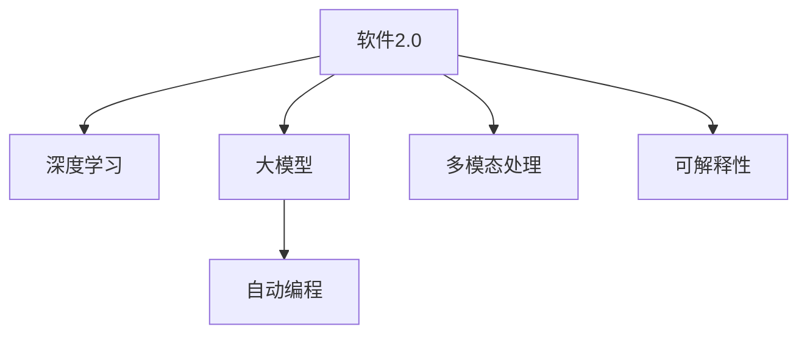

                 

# 软件2.0擅长图像视频和语音，传统编程望尘莫及

> 关键词：软件2.0, 图像识别, 视频处理, 语音识别, 人工智能, 自动编程

## 1. 背景介绍

### 1.1 问题由来
随着计算机科学的不断发展，软件编程范式经历了从原始编程到高级编程，再到智能编程的演化过程。传统的编程方式依赖程序员手写代码，需要花费大量的时间和精力进行开发和维护，且容易出错，难以扩展。智能编程技术的出现，特别是深度学习和大模型的兴起，使得软件编程向更加高效、自动化的方向迈进。

近年来，人工智能（AI）技术的飞速进步，尤其是深度学习和大模型的广泛应用，极大地推动了计算机科学的边界扩展。AI技术已经广泛应用于图像识别、视频处理、语音识别等领域，并取得了显著的成果。例如，Google的TensorFlow和OpenAI的GPT-3等深度学习框架，使得人工智能技术变得更加易用和高效，加速了AI技术的普及和应用。

### 1.2 问题核心关键点
软件2.0技术，即基于深度学习和大模型的编程范式，具有以下几个关键点：

- **自动编程**：利用深度学习模型自动识别和生成代码，减少手工编程的工作量。
- **跨模态处理**：能够同时处理图像、视频、语音等多种模态数据，实现多模态信息的融合与处理。
- **高效率**：通过自动化的深度学习模型训练和优化，显著提高编程效率。
- **鲁棒性**：具有较强的泛化能力和鲁棒性，能够应对复杂和多样化的任务。
- **可解释性**：能够提供模型的决策路径和推理过程，增强模型的可解释性。

这些关键点使得软件2.0技术在处理图像、视频、语音等领域具有显著的优势，极大地拓展了人工智能技术的应用边界。

### 1.3 问题研究意义
软件2.0技术的普及，对于提升软件开发效率、加速人工智能技术在实际应用中的落地，具有重要意义：

1. **降低开发成本**：通过自动编程和模型优化，显著减少手工编程的工作量，降低开发成本。
2. **提升开发效率**：利用深度学习和大模型，快速生成高质量的代码，加速软件开发进程。
3. **增强应用效果**：通过多模态处理和鲁棒性提升，使得AI技术在实际应用中更加高效和可靠。
4. **增强可解释性**：提供模型的决策路径和推理过程，增强模型的可解释性，帮助用户理解模型的行为。

软件2.0技术正在推动计算机科学的边界不断扩展，加速人工智能技术在各个领域的应用。相信在未来，软件2.0技术将变得更加普及和强大，成为推动科技创新和社会发展的重要力量。

## 2. 核心概念与联系

### 2.1 核心概念概述

为了更好地理解软件2.0技术，我们需要介绍几个关键概念：

- **软件2.0**：基于深度学习和大模型的编程范式，通过自动编程和模型优化，提升软件开发的效率和质量。
- **深度学习**：一种基于神经网络的机器学习方法，通过大量数据训练深度模型，实现复杂的模式识别和决策。
- **大模型**：指拥有数亿至上千亿参数的深度神经网络模型，如BERT、GPT-3等，具有强大的语言理解和生成能力。
- **自动编程**：利用深度学习模型自动识别和生成代码，减少手工编程的工作量。
- **多模态处理**：同时处理图像、视频、语音等多种模态数据，实现信息的融合和处理。
- **可解释性**：提供模型的决策路径和推理过程，增强模型的可解释性。

这些概念之间的逻辑关系可以通过以下Mermaid流程图来展示：



这个流程图展示了软件2.0技术的主要构成要素及其相互关系：

1. 软件2.0技术基于深度学习和多模态处理。
2. 利用大模型进行自动编程和代码生成。
3. 提供模型的决策路径和推理过程，增强可解释性。

## 3. 核心算法原理 & 具体操作步骤
### 3.1 算法原理概述

软件2.0技术的核心在于利用深度学习和大模型进行自动编程和模型优化，提升软件开发效率和质量。其核心思想是：通过自动化的深度学习模型训练和优化，减少手工编程的工作量，同时提高模型的泛化能力和鲁棒性。

### 3.2 算法步骤详解

软件2.0技术的实现一般包括以下几个关键步骤：

**Step 1: 数据收集与预处理**
- 收集待处理的数据，包括图像、视频、语音等。
- 对数据进行预处理，如裁剪、缩放、噪声过滤等，保证数据质量和一致性。

**Step 2: 选择并训练深度模型**
- 选择合适的深度学习模型，如卷积神经网络（CNN）、循环神经网络（RNN）等。
- 利用收集到的数据训练模型，调整超参数，优化模型性能。

**Step 3: 生成代码**
- 将预训练的深度模型应用于编程任务，自动识别和生成代码。
- 根据任务需求，调整模型的输入输出格式，确保生成的代码符合规范。

**Step 4: 模型优化**
- 对生成的代码进行优化，如语法检查、代码压缩、性能优化等。
- 利用深度学习模型进行自动优化，提升代码质量和性能。

**Step 5: 部署与测试**
- 将生成的代码部署到实际应用环境中。
- 对部署后的系统进行测试，验证代码的正确性和性能。

### 3.3 算法优缺点

软件2.0技术具有以下优点：
1. **高效自动化**：利用深度学习模型自动生成和优化代码，显著减少手工编程的工作量。
2. **多模态处理**：能够同时处理图像、视频、语音等多种模态数据，实现信息的融合和处理。
3. **高鲁棒性**：深度学习模型具有较强的泛化能力和鲁棒性，能够应对复杂和多样化的任务。
4. **可解释性**：提供模型的决策路径和推理过程，增强模型的可解释性。

同时，软件2.0技术也存在一些局限性：
1. **数据依赖性**：深度学习模型需要大量的标注数据进行训练，数据获取成本较高。
2. **模型复杂性**：深度学习模型参数量庞大，训练和优化复杂。
3. **性能限制**：生成的代码质量可能受限于模型性能，存在一定的误差和不确定性。

尽管存在这些局限性，但软件2.0技术在处理图像、视频、语音等领域已经展现出强大的潜力和应用前景，值得深入研究和探索。

### 3.4 算法应用领域

软件2.0技术在多个领域都得到了广泛的应用，例如：

- **图像识别**：利用深度学习模型自动识别和处理图像数据，如人脸识别、物体检测、图像分类等。
- **视频处理**：处理和分析视频数据，实现视频分类、视频摘要、视频增强等。
- **语音识别**：利用深度学习模型自动识别和处理语音数据，实现语音识别、语音合成、语音翻译等。
- **自然语言处理**：利用深度学习模型处理自然语言数据，实现文本分类、情感分析、机器翻译等。
- **自动驾驶**：处理和分析图像、视频、语音等多模态数据，实现自动驾驶和智能交通。
- **医疗影像分析**：利用深度学习模型自动识别和处理医学影像数据，如CT、MRI等。

此外，软件2.0技术还在金融、教育、智能家居、工业控制等多个领域得到应用，推动了各行各业的数字化转型升级。

## 4. 数学模型和公式 & 详细讲解 & 举例说明

### 4.1 数学模型构建

为了更好地理解软件2.0技术的实现，本节将介绍几个关键数学模型：

- **卷积神经网络（CNN）**：一种常用的图像处理模型，通过卷积层、池化层和全连接层实现图像特征提取和分类。
- **循环神经网络（RNN）**：一种常用的序列处理模型，通过循环层实现对时间序列数据的建模和预测。
- **注意力机制（Attention）**：一种用于增强模型对重要信息的关注度，提高模型处理能力。

### 4.2 公式推导过程

以下是卷积神经网络和循环神经网络的公式推导过程：

**卷积神经网络（CNN）**
$$
y = \sigma(Wy + b)
$$
其中，$y$ 为输出，$W$ 为权重矩阵，$b$ 为偏置项，$\sigma$ 为激活函数。

**循环神经网络（RNN）**
$$
h_t = f(h_{t-1}, x_t)
$$
其中，$h_t$ 为当前时间步的隐藏状态，$f$ 为循环函数，$x_t$ 为当前时间步的输入。

### 4.3 案例分析与讲解

以下是一个使用卷积神经网络（CNN）进行图像识别的案例：

**案例1: 图像分类**
- 输入：一张图像数据 $x$。
- 卷积层：将图像数据输入卷积层，提取特征 $y$。
- 池化层：对提取的特征进行池化操作，减少参数量。
- 全连接层：将池化后的特征输入全连接层，进行分类。

**案例2: 物体检测**
- 输入：一组图像数据 $x$。
- 卷积层：提取图像特征 $y$。
- 候选框生成：利用卷积层的输出生成候选框 $r$。
- 分类与回归：对候选框进行分类和回归，确定物体的位置和类别。

## 5. 项目实践：代码实例和详细解释说明
### 5.1 开发环境搭建

在进行软件2.0技术实践前，我们需要准备好开发环境。以下是使用Python进行PyTorch开发的环境配置流程：

1. 安装Anaconda：从官网下载并安装Anaconda，用于创建独立的Python环境。
2. 创建并激活虚拟环境：
```bash
conda create -n pytorch-env python=3.8 
conda activate pytorch-env
```

3. 安装PyTorch：根据CUDA版本，从官网获取对应的安装命令。例如：
```bash
conda install pytorch torchvision torchaudio cudatoolkit=11.1 -c pytorch -c conda-forge
```

4. 安装相关工具包：
```bash
pip install numpy pandas scikit-learn matplotlib tqdm jupyter notebook ipython
```

完成上述步骤后，即可在`pytorch-env`环境中开始软件2.0技术实践。

### 5.2 源代码详细实现

下面我们以图像分类任务为例，给出使用PyTorch实现卷积神经网络的代码。

```python
import torch
import torch.nn as nn
import torchvision.transforms as transforms
import torchvision.datasets as datasets
import torch.optim as optim

class Net(nn.Module):
    def __init__(self):
        super(Net, self).__init__()
        self.conv1 = nn.Conv2d(3, 6, 5)
        self.pool = nn.MaxPool2d(2, 2)
        self.conv2 = nn.Conv2d(6, 16, 5)
        self.fc1 = nn.Linear(16 * 5 * 5, 120)
        self.fc2 = nn.Linear(120, 84)
        self.fc3 = nn.Linear(84, 10)

    def forward(self, x):
        x = self.pool(torch.relu(self.conv1(x)))
        x = self.pool(torch.relu(self.conv2(x)))
        x = x.view(-1, 16 * 5 * 5)
        x = torch.relu(self.fc1(x))
        x = torch.relu(self.fc2(x))
        x = self.fc3(x)
        return x

# 定义训练和测试函数
def train(model, device, train_loader, optimizer, epoch):
    model.train()
    for batch_idx, (data, target) in enumerate(train_loader):
        data, target = data.to(device), target.to(device)
        optimizer.zero_grad()
        output = model(data)
        loss = F.cross_entropy(output, target)
        loss.backward()
        optimizer.step()
        if batch_idx % 100 == 0:
            print('Train Epoch: {} [{}/{} ({:.0f}%)]\tLoss: {:.6f}'.format(
                epoch, batch_idx * len(data), len(train_loader.dataset),
                100. * batch_idx / len(train_loader), loss.item()))

def test(model, device, test_loader):
    model.eval()
    test_loss = 0
    correct = 0
    with torch.no_grad():
        for data, target in test_loader:
            data, target = data.to(device), target.to(device)
            output = model(data)
            test_loss += F.cross_entropy(output, target, reduction='sum').item()
            pred = output.argmax(dim=1, keepdim=True)
            correct += pred.eq(target.view_as(pred)).sum().item()

    test_loss /= len(test_loader.dataset)
    print('\nTest set: Average loss: {:.4f}, Accuracy: {}/{} ({:.0f}%)\n'.format(
        test_loss, correct, len(test_loader.dataset),
        100. * correct / len(test_loader.dataset)))
```

### 5.3 代码解读与分析

让我们再详细解读一下关键代码的实现细节：

**Net类**：
- `__init__`方法：初始化卷积层、池化层和全连接层。
- `forward`方法：定义前向传播过程，通过多个卷积层和全连接层实现图像分类。

**训练函数**：
- 在训练过程中，每个批次的数据和标签都被送到设备上（GPU/TPU）。
- 通过前向传播计算输出，并计算损失函数。
- 反向传播更新模型参数。
- 每100个批次输出一次训练进度。

**测试函数**：
- 在测试过程中，每个批次的数据和标签都被送到设备上。
- 通过前向传播计算输出，并计算损失函数。
- 统计正确预测的样本数和总数。

**运行结果展示**：
- 训练过程中，每100个批次输出一次损失和训练进度。
- 测试过程中，输出测试集上的平均损失和准确率。

## 6. 实际应用场景
### 6.1 智能家居

软件2.0技术在智能家居中的应用，可以显著提升家居生活的智能化水平。例如，利用卷积神经网络（CNN）进行图像识别，智能家居系统能够自动识别用户的动作和表情，从而控制照明、温度等设备，提供个性化的居住体验。

### 6.2 医疗影像分析

在医疗影像分析中，软件2.0技术可以显著提高疾病的诊断效率和准确性。例如，利用卷积神经网络（CNN）进行医学影像分类，自动识别并标注影像中的病变区域，辅助医生进行诊断。

### 6.3 自动驾驶

自动驾驶是软件2.0技术的一个重要应用领域。通过卷积神经网络（CNN）和循环神经网络（RNN）的结合，系统能够实时处理和分析道路和交通情况，实现自动驾驶和智能交通。

### 6.4 金融数据分析

在金融数据分析中，软件2.0技术可以显著提升数据分析的效率和精度。例如，利用循环神经网络（RNN）进行时间序列数据的建模和预测，自动识别金融市场的趋势和波动。

## 7. 工具和资源推荐
### 7.1 学习资源推荐

为了帮助开发者系统掌握软件2.0技术的理论基础和实践技巧，这里推荐一些优质的学习资源：

1. 《深度学习》课程：斯坦福大学开设的深度学习课程，涵盖深度学习的基本概念和常用模型。
2. 《TensorFlow官方文档》：Google发布的TensorFlow文档，提供丰富的教程和示例代码。
3. 《PyTorch官方文档》：Facebook发布的PyTorch文档，提供丰富的教程和示例代码。
4. 《深度学习与计算机视觉》书籍：全面介绍深度学习在计算机视觉中的应用，包括卷积神经网络等。
5. 《深度学习与自然语言处理》书籍：全面介绍深度学习在自然语言处理中的应用，包括循环神经网络等。

通过对这些资源的学习实践，相信你一定能够快速掌握软件2.0技术的精髓，并用于解决实际的AI问题。

### 7.2 开发工具推荐

高效的开发离不开优秀的工具支持。以下是几款用于软件2.0技术开发的常用工具：

1. PyTorch：基于Python的开源深度学习框架，灵活动态的计算图，适合快速迭代研究。
2. TensorFlow：由Google主导开发的开源深度学习框架，生产部署方便，适合大规模工程应用。
3. Keras：基于Python的高层深度学习框架，易于使用，适合初学者和快速原型开发。
4. Jupyter Notebook：交互式编程环境，支持代码编写、数据可视化等多种功能，方便开发和分享。
5. Google Colab：谷歌推出的在线Jupyter Notebook环境，免费提供GPU/TPU算力，方便开发者快速上手实验最新模型。

合理利用这些工具，可以显著提升软件2.0技术的开发效率，加快创新迭代的步伐。

### 7.3 相关论文推荐

软件2.0技术的发展源于学界的持续研究。以下是几篇奠基性的相关论文，推荐阅读：

1. 《ImageNet Classification with Deep Convolutional Neural Networks》：提出卷积神经网络（CNN），在图像分类任务上取得显著效果。
2. 《LSTM: A Search Space Odyssey》：提出长短期记忆网络（LSTM），解决序列数据建模问题。
3. 《Attention is All You Need》：提出Transformer模型，提升自然语言处理的效果。
4. 《A Review of Computer Vision-Based Object Detection and Tracking》：全面回顾计算机视觉中的目标检测和跟踪方法。
5. 《Sequence to Sequence Learning with Neural Networks》：提出序列到序列模型，解决文本生成、机器翻译等任务。

这些论文代表了大模型微调技术的发展脉络。通过学习这些前沿成果，可以帮助研究者把握学科前进方向，激发更多的创新灵感。

## 8. 总结：未来发展趋势与挑战
### 8.1 总结

本文对软件2.0技术的实现和应用进行了全面系统的介绍。首先阐述了软件2.0技术的背景和研究意义，明确了其在处理图像、视频、语音等领域中的优势。其次，从原理到实践，详细讲解了卷积神经网络（CNN）、循环神经网络（RNN）等关键模型的构建和应用，给出了软件2.0技术实现的完整代码实例。同时，本文还广泛探讨了软件2.0技术在智能家居、医疗影像、自动驾驶、金融数据分析等多个领域的应用前景，展示了其强大的应用潜力。

通过本文的系统梳理，可以看到，软件2.0技术正在成为人工智能技术的重要范式，极大地拓展了深度学习和大模型的应用边界。未来，伴随深度学习模型的不断进步，软件2.0技术必将在更多领域得到应用，为各行各业带来颠覆性的变革。

### 8.2 未来发展趋势

展望未来，软件2.0技术将呈现以下几个发展趋势：

1. **模型规模持续增大**：深度学习模型参数量将不断增长，模型性能和效果将进一步提升。
2. **多模态处理能力增强**：软件2.0技术将能够处理和融合更多模态数据，提升综合处理能力。
3. **模型可解释性提升**：通过注意力机制和解释工具，增强模型的可解释性和可理解性。
4. **应用领域更加广泛**：软件2.0技术将在更多领域得到应用，提升各行业的智能化水平。
5. **算法自动化提升**：利用自动化技术，提升模型的训练和优化效率。

以上趋势凸显了软件2.0技术的广阔前景。这些方向的探索发展，必将进一步提升人工智能技术在实际应用中的效果和价值，推动科技和社会进步。

### 8.3 面临的挑战

尽管软件2.0技术已经取得了显著进展，但在其发展和应用过程中，仍面临一些挑战：

1. **数据获取成本高**：深度学习模型需要大量的标注数据进行训练，数据获取和标注成本较高。
2. **模型复杂度高**：深度学习模型参数量庞大，训练和优化复杂。
3. **泛化能力不足**：模型在处理新数据时，泛化性能可能下降。
4. **可解释性差**：深度学习模型黑盒特性，难以解释内部工作机制和推理过程。
5. **隐私和安全问题**：深度学习模型可能存在隐私泄露和安全风险。

这些挑战需要研究者不断探索和改进，才能充分发挥软件2.0技术的潜力，推动其健康发展。

### 8.4 研究展望

未来的研究需要在以下几个方面寻求新的突破：

1. **数据生成技术**：利用生成对抗网络（GAN）等技术，生成高质量的标注数据，降低数据获取成本。
2. **模型优化算法**：开发更加高效和自动化的模型优化算法，提升训练和优化效率。
3. **解释工具**：开发更加有效的模型解释工具，增强模型的可解释性和可理解性。
4. **隐私保护技术**：研究隐私保护和数据安全技术，保障数据和模型的隐私和安全。

这些研究方向将进一步提升软件2.0技术的性能和应用效果，推动其向更加智能、可靠和安全的方向发展。

## 9. 附录：常见问题与解答

**Q1：软件2.0技术是否适用于所有AI任务？**

A: 软件2.0技术在图像识别、视频处理、语音识别等领域具有显著的优势，但对于某些需要大量先验知识和逻辑推理的任务，如自然语言理解、数学计算等，还需结合传统编程方式进行优化。

**Q2：如何提升软件2.0技术的性能？**

A: 提升软件2.0技术的性能，可以从以下几个方面入手：
1. 数据质量：提高标注数据的质量，确保数据的多样性和代表性。
2. 模型选择：选择更适合任务的深度学习模型，如卷积神经网络（CNN）、循环神经网络（RNN）等。
3. 模型优化：利用深度学习框架的优化工具，如Adam、SGD等，提升模型性能。
4. 硬件支持：使用GPU/TPU等高性能设备，加速模型训练和推理。

**Q3：软件2.0技术在实际应用中存在哪些挑战？**

A: 软件2.0技术在实际应用中可能面临以下挑战：
1. 数据依赖性：深度学习模型需要大量的标注数据进行训练，数据获取成本较高。
2. 模型复杂性：深度学习模型参数量庞大，训练和优化复杂。
3. 泛化能力不足：模型在处理新数据时，泛化性能可能下降。
4. 可解释性差：深度学习模型黑盒特性，难以解释内部工作机制和推理过程。
5. 隐私和安全问题：深度学习模型可能存在隐私泄露和安全风险。

**Q4：如何在实际应用中应用软件2.0技术？**

A: 在实际应用中，可以按照以下步骤应用软件2.0技术：
1. 数据收集和预处理：收集和预处理待处理的数据，确保数据质量和一致性。
2. 选择并训练深度模型：选择合适的深度学习模型，利用收集到的数据训练模型，调整超参数，优化模型性能。
3. 生成代码：利用预训练的深度模型应用于编程任务，自动识别和生成代码。
4. 模型优化：对生成的代码进行优化，如语法检查、代码压缩、性能优化等。
5. 部署与测试：将生成的代码部署到实际应用环境中，对部署后的系统进行测试，验证代码的正确性和性能。

通过以上步骤，可以充分利用软件2.0技术的高效和自动化优势，提升AI应用的效果和效率。

---

作者：禅与计算机程序设计艺术 / Zen and the Art of Computer Programming

