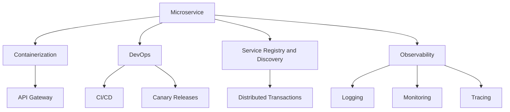

                 

# 软件2.0的微服务架构设计

在软件技术的发展历程中，微服务架构（Microservices Architecture）一直是备受关注的话题。它是一种将大型应用拆分成多个小服务的架构风格，每个小服务独立运行、部署和管理。这种设计理念符合现代软件开发的需求，能够提升系统的灵活性、可扩展性、可维护性和可复用性。随着微服务架构的演进，“软件2.0”（Software 2.0）这一概念应运而生，它强调的是在微服务架构下，软件开发的自动化、智能化、工业化发展方向。本文旨在通过深入浅出的解析，探讨软件2.0中微服务架构的设计原则、关键技术、最佳实践，并展望未来的发展趋势。

## 1. 背景介绍

### 1.1 问题由来

近年来，随着互联网应用的复杂性和需求多样性的提升，传统的单体应用（Monolithic Application）架构逐渐显现出其固有的局限性。单体应用结构紧密耦合，难以进行水平扩展和快速迭代，容易因某一部分故障而导致整个系统宕机。在这样的背景下，微服务架构应运而生，通过将应用拆分成多个小型服务，实现了系统的解耦合与分布式部署。

微服务架构的兴起，为软件开发生命周期带来了革命性的变化，尤其是在容器化技术、DevOps文化、云原生环境的推动下，微服务架构已经成为现代应用架构的主流选择。但是，微服务架构的设计与实施也面临诸多挑战，如服务间通信复杂性、服务治理、数据一致性等，这些问题在传统的单体应用中较少出现。随着软件开发生产力的提升，对微服务架构提出了更高的要求，这促使“软件2.0”理念的诞生，旨在通过技术演进与创新，解决微服务架构的痛点，推动软件开发的自动化、智能化、工业化。

### 1.2 问题核心关键点

软件2.0的微服务架构设计关注的核心关键点包括：
- 自动化持续集成与持续部署（CI/CD）：通过自动化流水线，实现代码的持续集成与部署，减少人工操作带来的错误和延迟。
- 基于容器的微服务：使用容器化技术（如Docker）将微服务打包成独立的应用镜像，实现服务的快速部署与扩展。
- 微服务治理：包括服务发现、配置管理、负载均衡、断路器、限流等，保证微服务的稳定性和可靠性。
- 数据一致性：在微服务架构下，如何保证数据的一致性和完整性，是一个重要的技术挑战。
- 自动化运维：通过自动化工具，实现微服务的监控、日志、告警、恢复等运维工作。

这些关键点共同构成了软件2.0中微服务架构的设计基础，通过技术演进与创新，旨在提升微服务架构的效率、灵活性和可靠性。

## 2. 核心概念与联系

### 2.1 核心概念概述

在软件2.0的微服务架构中，涉及多个核心概念，这些概念相互联系，共同构成了一个完整的微服务生态系统。以下是几个关键概念的介绍：

- **微服务（Microservice）**：独立的、可扩展的、可部署的组件，每个微服务负责特定的业务功能。
- **容器化（Containerization）**：使用容器技术将微服务打包成独立的镜像，便于快速部署和扩展。
- **DevOps文化**：结合软件开发和运维两个环节，实现持续交付和持续部署，提升开发效率和质量。
- **API网关（API Gateway）**：作为微服务之间的通信中心，负责路由、负载均衡、认证等。
- **服务注册与发现（Service Registry and Discovery）**：通过集中管理微服务注册与发现，提升微服务间的互操作性。
- **分布式事务（Distributed Transactions）**：在微服务架构下，如何保证跨服务间数据的一致性和完整性。
- **可观察性（Observability）**：通过监控、日志、追踪等手段，提升微服务系统的可观察性。

这些概念通过互相配合，实现了微服务架构的自动化、智能化和工业化。

### 2.2 核心概念联系

为了更好地理解这些核心概念的联系，我们通过以下Mermaid流程图进行展示：



该流程图展示了微服务架构的关键组件及其相互关系。从微服务开始，通过容器化技术将服务打包成镜像，使用API网关进行通信，通过服务注册与发现实现服务的互操作性，并通过分布式事务保证数据一致性。同时，结合DevOps文化，实现持续集成与持续部署，并通过可观察性手段（如日志、监控、追踪）提升系统的可观察性，确保微服务架构的稳定性和可靠性。

## 3. 核心算法原理 & 具体操作步骤

### 3.1 算法原理概述

软件2.0的微服务架构设计，遵循微服务架构的基本原则，但通过技术演进和创新，实现了自动化、智能化、工业化的目标。在微服务架构设计中，关键算法原理包括以下几个方面：

- **服务拆分**：将单体应用拆分成多个独立的小服务，每个服务独立运行、独立部署、独立扩展。
- **容器化技术**：使用容器化技术将微服务打包成独立的镜像，便于快速部署和扩展。
- **CI/CD流水线**：通过自动化流水线，实现代码的持续集成与持续部署，提升开发效率和质量。
- **服务治理**：包括服务发现、配置管理、负载均衡、断路器、限流等，保证微服务的稳定性和可靠性。
- **自动化运维**：通过自动化工具，实现微服务的监控、日志、告警、恢复等运维工作。

这些算法原理，旨在通过技术演进和创新，提升微服务架构的自动化、智能化和工业化水平。

### 3.2 算法步骤详解

以下是对软件2.0微服务架构设计关键步骤的详细介绍：

**Step 1: 设计微服务架构**
- 明确业务功能，将单体应用拆分为多个独立的服务。
- 根据服务间的依赖关系，合理划分服务边界。

**Step 2: 容器化与编排**
- 使用容器化技术（如Docker）将每个微服务打包成独立的镜像。
- 使用编排工具（如Kubernetes）管理容器编排和部署。

**Step 3: 构建CI/CD流水线**
- 建立持续集成（CI）流程，自动构建、测试代码。
- 建立持续部署（CD）流程，自动部署代码到生产环境。

**Step 4: 实现服务治理**
- 使用服务注册与发现机制，实现服务的集中管理。
- 使用负载均衡、断路器、限流等技术，保证微服务的稳定性和可靠性。

**Step 5: 实现分布式事务**
- 使用分布式事务技术，保证跨服务间数据的一致性和完整性。

**Step 6: 实施自动化运维**
- 使用自动化工具，实现微服务的监控、日志、告警、恢复等运维工作。

**Step 7: 增强可观察性**
- 使用可观察性工具（如Prometheus、Jaeger）监控、追踪和分析微服务系统的运行状态。

通过这些关键步骤，可以有效地构建一个稳定、可靠、高效的微服务架构，满足软件2.0的发展需求。

### 3.3 算法优缺点

软件2.0微服务架构设计具有以下优点：
- 高可扩展性：通过微服务拆分，实现系统的水平扩展和垂直扩展。
- 高可维护性：每个服务独立部署、独立维护，降低故障传播风险。
- 高可靠性：通过服务治理、自动化运维等手段，提升系统的稳定性和可靠性。
- 高生产效率：通过CI/CD流水线，实现自动化部署和持续交付，提升开发效率。

但同时也存在一些缺点：
- 复杂性：微服务架构设计复杂，需要综合考虑服务拆分、服务治理等问题。
- 性能问题：微服务之间的通信可能会影响系统性能，需要合理设计服务间通信机制。
- 数据一致性问题：微服务架构下，如何保证数据一致性是一个重要的技术挑战。

在实际应用中，需要根据具体的业务场景，综合权衡利弊，选择合适的架构设计方案。

### 3.4 算法应用领域

软件2.0的微服务架构设计在多个领域中得到了广泛应用，以下是几个典型的应用场景：

- **电商系统**：电商系统具有高并发、高可用、高扩展的需求，微服务架构能够满足这些需求，提升用户体验和系统稳定性。
- **金融系统**：金融系统涉及复杂的业务流程和多样的数据来源，微服务架构通过服务拆分和分布式部署，提升系统的灵活性和可扩展性。
- **互联网应用**：互联网应用需要快速迭代和扩展，微服务架构能够支持敏捷开发和快速部署。
- **物联网系统**：物联网系统需要处理海量数据和实时通信，微服务架构通过容器化和服务治理，提升系统的可扩展性和可靠性。

以上应用场景展示了微服务架构在实际中的应用价值和广泛适用性。

## 4. 数学模型和公式 & 详细讲解 & 举例说明

### 4.1 数学模型构建

在软件2.0的微服务架构设计中，涉及多个数学模型和公式。以下是几个关键模型的介绍：

- **服务拆分模型**：定义了服务之间的依赖关系和通信机制，模型如下：
  $$
  \begin{aligned}
  &\text{服务 } S_1 \rightarrow \{S_2, S_3, S_4\} \\
  &\text{服务 } S_2 \rightarrow \{S_3, S_5\} \\
  &\text{服务 } S_3 \rightarrow \{S_4, S_5, S_6\} \\
  &\text{服务 } S_4 \rightarrow \{S_5, S_6, S_7\} \\
  \end{aligned}
  $$

- **负载均衡模型**：定义了负载均衡的策略和机制，模型如下：
  $$
  \begin{aligned}
  &\text{负载均衡器 } L \rightarrow \{S_1, S_2, S_3, S_4, S_5, S_6, S_7\} \\
  &\text{负载均衡策略 } P = \text{Round Robin, Least Connections, IP Hash}
  \end{aligned}
  $$

- **分布式事务模型**：定义了分布式事务的机制和策略，模型如下：
  $$
  \begin{aligned}
  &\text{事务 } T = \{S_1, S_2, S_3, S_4\} \\
  &\text{事务协调器 } C \rightarrow \{T_1, T_2, T_3, T_4\}
  \end{aligned}
  $$

- **自动化运维模型**：定义了自动化运维的流程和工具，模型如下：
  $$
  \begin{aligned}
  &\text{监控工具 } M = \{Prometheus, Grafana\} \\
  &\text{日志工具 } L = \{ELK Stack, Fluentd\} \\
  &\text{告警工具 } A = \{PagerDuty, Opsgenie\} \\
  &\text{恢复工具 } R = \{Kubernetes, Helm}
  \end{aligned}
  $$

这些模型和公式，共同构成了软件2.0微服务架构设计的数学基础，通过数学建模，可以实现系统的自动化、智能化、工业化。

### 4.2 公式推导过程

以下是对上述模型和公式的详细推导过程：

**服务拆分模型推导**：
假设一个电商系统由多个服务组成，每个服务负责特定的业务功能。服务拆分模型通过描述服务间的依赖关系和通信机制，定义了服务之间的依赖结构。

**负载均衡模型推导**：
负载均衡模型定义了负载均衡策略，常见的负载均衡策略包括Round Robin、Least Connections、IP Hash等。通过负载均衡模型，可以实现服务的分布式部署和负载均衡。

**分布式事务模型推导**：
分布式事务模型定义了分布式事务的机制和策略，通过事务协调器实现跨服务间的数据一致性和完整性。

**自动化运维模型推导**：
自动化运维模型定义了监控、日志、告警、恢复等运维工具，通过自动化运维模型，可以实现微服务的持续监控和自动化运维。

### 4.3 案例分析与讲解

**案例：电商系统的微服务架构设计**

电商系统具有高并发、高可用、高扩展的需求，通过微服务架构设计，可以实现系统的稳定性和可靠性。

**步骤1: 设计微服务架构**
- 电商系统拆分服务为：订单服务、支付服务、库存服务、物流服务、用户服务、商品服务等。

**步骤2: 容器化与编排**
- 使用Docker容器化每个微服务，并通过Kubernetes进行容器编排和部署。

**步骤3: 构建CI/CD流水线**
- 建立持续集成（CI）流程，自动构建和测试代码。
- 建立持续部署（CD）流程，自动部署代码到生产环境。

**步骤4: 实现服务治理**
- 使用Nginx作为API网关，实现服务的集中管理和负载均衡。
- 使用Consul进行服务注册和发现。

**步骤5: 实现分布式事务**
- 使用TCC（Try-Confirm-Cancel）模式实现分布式事务，确保订单、支付、库存等服务的原子性操作。

**步骤6: 实施自动化运维**
- 使用Prometheus和Grafana进行监控和报警。
- 使用ELK Stack和Fluentd进行日志管理。
- 使用Kubernetes和Helm进行自动恢复和部署。

通过以上步骤，可以构建一个稳定、可靠、高效的电商系统微服务架构。

## 5. 项目实践：代码实例和详细解释说明

### 5.1 开发环境搭建

在软件2.0的微服务架构设计中，开发环境搭建是关键步骤。以下是开发环境搭建的详细步骤：

1. 安装Docker：从官网下载并安装Docker，用于容器化微服务。
2. 安装Kubernetes：从官网下载并安装Kubernetes，用于容器编排和部署。
3. 安装CI/CD工具：安装Jenkins、GitLab CI等工具，实现代码的持续集成和持续部署。
4. 安装服务治理工具：安装Consul、Eureka等工具，实现服务的注册和发现。
5. 安装监控和日志工具：安装Prometheus、Grafana、ELK Stack等工具，实现监控和日志管理。

完成以上步骤后，即可在本地搭建完整的微服务开发环境。

### 5.2 源代码详细实现

以下是一个简单的电商订单服务的源代码实现：

```java
import com.fasterxml.jackson.annotation.JsonProperty;

public class Order {
    private String id;
    private String buyer;
    private String seller;
    private String product;
    private double price;
    private String status;

    public Order(@JsonProperty("id") String id,
                 @JsonProperty("buyer") String buyer,
                 @JsonProperty("seller") String seller,
                 @JsonProperty("product") String product,
                 @JsonProperty("price") double price,
                 @JsonProperty("status") String status) {
        this.id = id;
        this.buyer = buyer;
        this.seller = seller;
        this.product = product;
        this.price = price;
        this.status = status;
    }

    public String getId() {
        return id;
    }

    public String getBuyer() {
        return buyer;
    }

    public String getSeller() {
        return seller;
    }

    public String getProduct() {
        return product;
    }

    public double getPrice() {
        return price;
    }

    public String getStatus() {
        return status;
    }
}
```

### 5.3 代码解读与分析

以上代码实现了一个简单的电商订单服务，包含订单的基本信息。通过接口定义，订单服务能够接收和发送订单信息，实现订单的创建、更新、查询等操作。

在实际应用中，订单服务可能会与其他服务（如支付服务、库存服务等）交互，通过服务注册和发现机制，实现服务间的通信和协作。

## 6. 实际应用场景

### 6.1 智能客服系统

智能客服系统通过微服务架构设计，能够实现高效、可靠、可扩展的智能客服服务。

**步骤1: 设计微服务架构**
- 智能客服系统拆分服务为：语音识别服务、自然语言理解服务、对话管理服务、对话生成服务、消息服务等。

**步骤2: 容器化与编排**
- 使用Docker容器化每个微服务，并通过Kubernetes进行容器编排和部署。

**步骤3: 构建CI/CD流水线**
- 建立持续集成（CI）流程，自动构建和测试代码。
- 建立持续部署（CD）流程，自动部署代码到生产环境。

**步骤4: 实现服务治理**
- 使用Nginx作为API网关，实现服务的集中管理和负载均衡。
- 使用Consul进行服务注册和发现。

**步骤5: 实现分布式事务**
- 使用TCC（Try-Confirm-Cancel）模式实现分布式事务，确保客服对话的原子性操作。

**步骤6: 实施自动化运维**
- 使用Prometheus和Grafana进行监控和报警。
- 使用ELK Stack和Fluentd进行日志管理。
- 使用Kubernetes和Helm进行自动恢复和部署。

通过以上步骤，可以构建一个稳定、可靠、高效的智能客服系统微服务架构。

### 6.2 金融风控系统

金融风控系统涉及复杂的业务流程和多样的数据来源，通过微服务架构设计，可以实现系统的灵活性和可扩展性。

**步骤1: 设计微服务架构**
- 金融风控系统拆分服务为：风险评估服务、反欺诈服务、信用评分服务、合规检查服务等。

**步骤2: 容器化与编排**
- 使用Docker容器化每个微服务，并通过Kubernetes进行容器编排和部署。

**步骤3: 构建CI/CD流水线**
- 建立持续集成（CI）流程，自动构建和测试代码。
- 建立持续部署（CD）流程，自动部署代码到生产环境。

**步骤4: 实现服务治理**
- 使用Nginx作为API网关，实现服务的集中管理和负载均衡。
- 使用Consul进行服务注册和发现。

**步骤5: 实现分布式事务**
- 使用TCC（Try-Confirm-Cancel）模式实现分布式事务，确保风控决策的原子性操作。

**步骤6: 实施自动化运维**
- 使用Prometheus和Grafana进行监控和报警。
- 使用ELK Stack和Fluentd进行日志管理。
- 使用Kubernetes和Helm进行自动恢复和部署。

通过以上步骤，可以构建一个稳定、可靠、高效的金融风控系统微服务架构。

### 6.3 互联网广告系统

互联网广告系统需要快速迭代和扩展，通过微服务架构设计，可以实现系统的敏捷开发和快速部署。

**步骤1: 设计微服务架构**
- 互联网广告系统拆分服务为：广告投放服务、用户画像服务、广告效果评估服务等。

**步骤2: 容器化与编排**
- 使用Docker容器化每个微服务，并通过Kubernetes进行容器编排和部署。

**步骤3: 构建CI/CD流水线**
- 建立持续集成（CI）流程，自动构建和测试代码。
- 建立持续部署（CD）流程，自动部署代码到生产环境。

**步骤4: 实现服务治理**
- 使用Nginx作为API网关，实现服务的集中管理和负载均衡。
- 使用Consul进行服务注册和发现。

**步骤5: 实现分布式事务**
- 使用TCC（Try-Confirm-Cancel）模式实现分布式事务，确保广告投放的原子性操作。

**步骤6: 实施自动化运维**
- 使用Prometheus和Grafana进行监控和报警。
- 使用ELK Stack和Fluentd进行日志管理。
- 使用Kubernetes和Helm进行自动恢复和部署。

通过以上步骤，可以构建一个稳定、可靠、高效的互联网广告系统微服务架构。

## 7. 工具和资源推荐

### 7.1 学习资源推荐

为了帮助开发者系统掌握微服务架构的设计与实施，这里推荐一些优质的学习资源：

1. 《微服务架构之美》：一本介绍微服务架构设计、实施、优化等方面内容的经典书籍，适合初学者和进阶者。
2. 《Spring Cloud实战》：一本介绍Spring Cloud微服务框架的实践指南，涵盖Spring Cloud Config、Eureka、Zuul等核心组件的详细使用。
3. 《Docker实战》：一本介绍Docker容器技术的实战指南，涵盖Docker的安装、使用、管理等方面内容。
4. 《Kubernetes实战》：一本介绍Kubernetes容器编排平台的实战指南，涵盖Kubernetes的安装、使用、管理等方面内容。
5. 《DevOps实践指南》：一本介绍DevOps文化和实践的实战指南，涵盖CI/CD流水线、自动化运维等方面内容。

通过这些资源的学习实践，相信你一定能够掌握微服务架构的设计与实施技能，提升开发效率和系统可靠性。

### 7.2 开发工具推荐

高效的开发离不开优秀的工具支持。以下是几款用于微服务架构开发的常用工具：

1. Jenkins：持续集成和持续部署工具，支持构建、测试、部署等流程自动化。
2. GitLab CI：持续集成和持续部署工具，支持基于Git的代码仓库管理。
3. Kubernetes：容器编排平台，支持大规模微服务的分布式部署和调度。
4. Docker：容器化技术，支持微服务的独立打包和快速部署。
5. Consul：服务注册与发现工具，支持微服务的集中管理和负载均衡。
6. Prometheus：监控和告警工具，支持微服务的实时监控和报警。
7. ELK Stack：日志管理工具，支持微服务的日志采集和分析。

合理利用这些工具，可以显著提升微服务架构的开发效率，加速系统迭代和部署。

### 7.3 相关论文推荐

微服务架构的设计与实施涉及多个领域的理论研究。以下是几篇奠基性的相关论文，推荐阅读：

1. "Microservices: A Service-Oriented Architecture for Rapid and Cost-Effective Development of Large Systems"：这篇文章提出了微服务架构的基本概念和设计原则，奠定了微服务架构的基础。
2. "Building Microservices: Designing Fine-Grained Systems"：这篇文章介绍了微服务架构的设计、实施和优化等方面内容，提供了详细的案例分析。
3. "Automated Software Engineering: Principles, Techniques, and Tools"：这本书全面介绍了软件开发生命周期中的自动化技术，包括持续集成、持续部署、自动化运维等方面内容。
4. "Containerization: A Brief Overview"：这篇文章介绍了容器化技术的原理和优势，适合初学者理解容器化技术的基本概念。
5. "Docker in Practice: Automating the Deployment of Large Systems"：这本书介绍了Docker容器化技术的实践经验，适合开发者掌握Docker的基本使用。
6. "Kubernetes: A Platform for Container Orchestration"：这篇文章介绍了Kubernetes容器编排平台的基本概念和设计原理，适合理解Kubernetes的基本使用。

通过这些论文的学习实践，可以帮助研究者掌握微服务架构的理论基础和实践技巧，推动微服务架构的进一步发展。

## 8. 总结：未来发展趋势与挑战

### 8.1 总结

本文对软件2.0的微服务架构设计进行了全面系统的介绍。首先阐述了微服务架构的基本原则和优势，明确了微服务架构在现代软件开发中的重要地位。其次，从原理到实践，详细讲解了微服务架构的设计方法、关键技术和最佳实践，给出了微服务架构开发的完整代码实例。同时，本文还探讨了微服务架构在实际应用中的广泛场景，展示了微服务架构的强大生命力和应用价值。

通过本文的系统梳理，可以看到，微服务架构是现代软件开发的重要趋势，通过技术演进与创新，可以实现软件的自动化、智能化、工业化。未来，随着微服务架构的持续演进和成熟，将为软件开发带来更多的可能性。

### 8.2 未来发展趋势

展望未来，微服务架构的发展趋势包括以下几个方面：

1. 自动化持续集成与持续部署（CI/CD）：随着DevOps文化的普及，自动化持续集成与持续部署将成为微服务架构的重要组成部分，提升开发效率和系统可靠性。
2. 基于容器的微服务：容器化技术将成为微服务架构的核心支撑，通过容器化技术，实现微服务的快速部署和扩展。
3. 服务治理与自动化运维：服务治理和自动化运维将成为微服务架构的关键组成部分，提升微服务的稳定性和可靠性。
4. 分布式事务与数据一致性：分布式事务和数据一致性将成为微服务架构的关键挑战，通过分布式事务技术，确保跨服务间的数据一致性和完整性。
5. 可观察性：可观察性将成为微服务架构的重要特性，通过监控、日志、追踪等手段，提升微服务系统的可观察性。

这些趋势将推动微服务架构的进一步发展，提升软件开发和部署的自动化、智能化和工业化水平。

### 8.3 面临的挑战

尽管微服务架构在软件开发中已经取得了显著成效，但在迈向更加智能化、普适化应用的过程中，它仍面临着诸多挑战：

1. 服务间通信复杂性：微服务架构下，服务间通信可能会带来系统复杂性，如何优化服务间通信，提升系统性能，是一个重要的技术挑战。
2. 服务治理困难：微服务架构下，服务治理的复杂性增加，如何实现服务的集中管理和负载均衡，是一个重要的技术挑战。
3. 数据一致性问题：微服务架构下，如何保证数据的一致性和完整性，是一个重要的技术挑战。
4. 系统性能瓶颈：微服务架构下，系统性能的瓶颈往往出现在服务间通信和数据一致性等方面，如何优化系统性能，提升系统稳定性，是一个重要的技术挑战。
5. 安全与隐私问题：微服务架构下，系统安全和隐私问题变得更加复杂，如何保障系统安全，保护用户隐私，是一个重要的技术挑战。

这些挑战需要研究者不断探索和创新，才能推动微服务架构的进一步发展。

### 8.4 研究展望

面对微服务架构所面临的挑战，未来的研究需要在以下几个方面寻求新的突破：

1. 微服务间通信优化：探索高效的服务间通信机制，如gRPC、Thrift等，提升系统性能。
2. 微服务治理优化：研究先进的微服务治理技术，如Open Policy Agent、Istio等，提升服务的集中管理和负载均衡。
3. 分布式事务优化：探索先进的分布式事务技术，如Saga、Event Sourcing等，提升跨服务间的数据一致性和完整性。
4. 系统性能优化：研究系统性能优化技术，如异步通信、消息队列等，提升系统的响应速度和吞吐量。
5. 系统安全与隐私保护：研究系统安全与隐私保护技术，如加密、认证、访问控制等，保障系统安全。

这些研究方向的探索，将推动微服务架构的进一步发展，提升软件开发的自动化、智能化和工业化水平。面向未来，微服务架构需要与其他先进技术进行更深入的融合，如知识表示、因果推理、强化学习等，多路径协同发力，共同推动软件开发的进步。

## 9. 附录：常见问题与解答

**Q1: 什么是微服务架构？**

A: 微服务架构是一种将大型应用拆分成多个小服务的架构风格，每个小服务独立运行、独立部署、独立扩展。通过微服务架构，可以实现系统的解耦合与分布式部署，提升系统的灵活性、可扩展性和可维护性。

**Q2: 微服务架构有哪些优点和缺点？**

A: 微服务架构的优点包括高可扩展性、高可维护性、高可靠性等。但同时也存在一些缺点，如系统复杂性增加、服务间通信困难、数据一致性问题等。

**Q3: 微服务架构如何实现自动化持续集成与持续部署（CI/CD）？**

A: 通过构建CI/CD流水线，实现代码的自动构建、测试和部署。常用的CI/CD工具包括Jenkins、GitLab CI等。

**Q4: 微服务架构如何实现基于容器的微服务？**

A: 通过容器化技术（如Docker）将微服务打包成独立的镜像，并通过Kubernetes进行容器编排和部署。

**Q5: 微服务架构如何实现服务治理？**

A: 通过服务注册与发现机制，实现服务的集中管理和负载均衡。常用的服务治理工具包括Consul、Eureka等。

通过以上常见问题的解答，相信读者能够更深入地理解微服务架构的基本概念、核心技术和应用场景，为微服务架构的实施和优化提供参考。

---

作者：禅与计算机程序设计艺术 / Zen and the Art of Computer Programming

