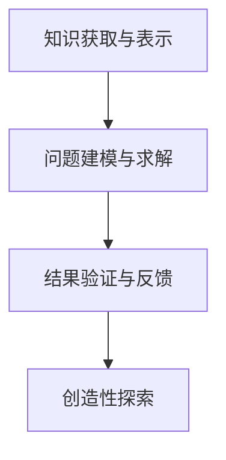

                 

# 释放人类创造力的源泉：人类计算的魅力

> 关键词：人类计算, 人工智能, 机器学习, 深度学习, 神经网络, 计算思维, 智能系统, 创造力, 创造力计算

## 1. 背景介绍

### 1.1 问题由来

在科技日新月异的今天，人工智能（AI）正在以前所未有的速度改变我们的生活方式。从智能家居、无人驾驶，到医疗健康、金融交易，人工智能的应用无处不在。然而，在享受这些便捷的同时，我们也不得不思考一个问题：人类在人工智能时代究竟扮演着什么样的角色？

人类计算，作为人工智能发展的重要驱动力，正逐步展现出其独特的魅力。与传统计算不同，人类计算强调将人类的思维能力与机器计算相结合，充分发挥人类在理解复杂问题、创造新知识方面的优势。这种计算方式不仅能解决复杂的技术问题，还能激发人类创造力的源泉，推动社会和科技的进步。

### 1.2 问题核心关键点

人类计算的核心在于将人类的逻辑思维和创新能力与机器计算结合起来，形成一种新的计算范式。这一过程涉及以下几个关键点：

- **知识获取与表示**：人类通过学习、阅读、实践等方式获取知识，并将其表示为机器可以理解的形式。
- **问题建模与求解**：将现实问题抽象为机器可处理的模型，并通过算法求解。
- **结果验证与反馈**：对计算结果进行验证，并通过反馈机制不断优化模型和算法。
- **创造性探索**：在已有知识的基础上，通过创新思维进行新知识的探索和创造。

本文将深入探讨人类计算的原理、应用以及面临的挑战，希望能为读者提供一些新的见解和思路。

## 2. 核心概念与联系

### 2.1 核心概念概述

人类计算的核心理念是将人类的智慧与机器的计算能力相结合，以解决复杂问题。在这一过程中，需要涉及到以下几个关键概念：

- **知识获取与表示**：这是人类计算的基础。通过学习、阅读、实践等方式获取知识，并将其表示为机器可以理解的形式。
- **问题建模与求解**：将现实问题抽象为机器可处理的模型，并通过算法求解。
- **结果验证与反馈**：对计算结果进行验证，并通过反馈机制不断优化模型和算法。
- **创造性探索**：在已有知识的基础上，通过创新思维进行新知识的探索和创造。

这些概念之间的联系可以通过以下Mermaid流程图来展示：



这个流程图展示了一组概念之间的逻辑关系：

1. 知识获取与表示是问题建模与求解的基础。
2. 问题建模与求解是将现实问题转化为机器可处理形式的过程。
3. 结果验证与反馈是对求解结果的验证和优化，是确保模型和算法准确性的关键。
4. 创造性探索是在已有知识基础上，通过创新思维进行新知识的探索和创造。

这些概念共同构成了人类计算的框架，使人类能够高效地解决复杂问题，并在此基础上进行创造性探索。

## 3. 核心算法原理 & 具体操作步骤
### 3.1 算法原理概述

人类计算的算法原理是基于深度学习和神经网络的研究和应用。深度学习是一种基于多层神经网络的机器学习技术，能够自动从数据中学习到复杂的特征表示，并用于分类、回归、生成等任务。

在深度学习中，数据被输入到神经网络中，通过一系列的层（包括卷积层、池化层、全连接层等）进行处理。每一层都会对输入数据进行一些特定的变换，最终输出结果。这一过程中，神经网络的参数（如权重、偏置等）是通过反向传播算法进行学习的。

### 3.2 算法步骤详解

人类计算的算法步骤可以分为以下几个步骤：

1. **数据准备**：收集和处理数据，准备训练和测试数据集。数据可以是文本、图像、音频等多种形式。
2. **模型选择与设计**：选择适合问题的深度学习模型，并根据问题特点设计模型架构。
3. **训练模型**：将数据输入到模型中，通过反向传播算法训练模型参数，优化模型性能。
4. **结果验证**：使用测试集对训练好的模型进行验证，评估其性能。
5. **模型优化**：根据验证结果，调整模型参数和架构，进一步优化模型性能。
6. **应用与探索**：将优化后的模型应用于实际问题，并在此基础上进行创新性探索。

### 3.3 算法优缺点

人类计算的优点在于其强大的模式识别能力和处理复杂问题的能力。通过深度学习和神经网络，人类可以高效地处理海量数据，并从中提取有价值的信息。同时，人类计算还具有很高的灵活性和创造性，能够根据实际情况进行调整和优化。

然而，人类计算也存在一些缺点：

- **资源消耗高**：深度学习和神经网络需要大量的计算资源和时间，特别是在大规模数据集上训练时。
- **解释性差**：深度学习模型往往是"黑盒"系统，难以解释其内部工作机制和决策逻辑。
- **数据依赖性强**：深度学习模型依赖于大量的标注数据，数据的质量和数量对模型性能有重要影响。
- **对抗攻击脆弱**：深度学习模型容易受到对抗样本的攻击，导致预测结果错误。

### 3.4 算法应用领域

人类计算在多个领域都有广泛的应用，以下是一些典型的应用场景：

- **自然语言处理（NLP）**：如机器翻译、情感分析、文本分类等任务。
- **计算机视觉**：如图像识别、目标检测、图像生成等任务。
- **语音识别**：如语音识别、语音合成等任务。
- **推荐系统**：如电商推荐、新闻推荐等任务。
- **医疗健康**：如疾病诊断、药物研发等任务。
- **金融交易**：如风险预测、量化交易等任务。
- **游戏与娱乐**：如智能博弈、虚拟现实等任务。

这些应用场景展示了人类计算的广泛影响力和巨大的潜力。未来，随着技术的不断发展，人类计算将在更多领域得到应用，带来新的突破和变革。

## 4. 数学模型和公式 & 详细讲解 & 举例说明

### 4.1 数学模型构建

人类计算的数学模型构建主要包括以下几个方面：

- **输入表示**：将输入数据表示为向量或张量形式，便于模型处理。
- **模型定义**：定义神经网络的层、激活函数、损失函数等，构建模型结构。
- **优化算法**：选择合适的优化算法，如梯度下降、Adam等，进行模型训练。

### 4.2 公式推导过程

以一个简单的分类问题为例，假设我们要训练一个二分类模型，输入为 $x$，输出为 $y$。模型的输入表示为 $x$，输出表示为 $y$，使用softmax函数进行预测。模型的损失函数为交叉熵损失，优化算法为Adam。

假设模型包含 $n$ 个神经元，第 $i$ 个神经元的输出为 $a_i$，对应的权重为 $w_i$，偏差为 $b_i$。模型的预测结果为 $y=\sigma(z)$，其中 $z=\sum_i a_i w_i + b_i$，$\sigma$ 为激活函数。

交叉熵损失函数为：

$$
\mathcal{L} = -\frac{1}{N}\sum_{i=1}^N(y_i \log\sigma(z_i) + (1-y_i)\log(1-\sigma(z_i)))
$$

优化目标为最小化损失函数 $\mathcal{L}$。优化过程中，使用梯度下降算法，更新模型参数：

$$
\theta_k \leftarrow \theta_k - \eta \nabla_{\theta_k}\mathcal{L}(\theta_k)
$$

其中 $\eta$ 为学习率，$\nabla_{\theta_k}\mathcal{L}(\theta_k)$ 为损失函数对第 $k$ 个参数的梯度。

### 4.3 案例分析与讲解

以图像分类为例，展示人类计算在实际应用中的过程。

假设我们要训练一个图像分类模型，输入为图像像素值，输出为类别标签。我们可以将每个像素值表示为一个向量，将整个图像表示为一个矩阵。模型可以包含卷积层、池化层、全连接层等，对图像进行处理和分类。

模型的输入表示为 $x \in \mathbb{R}^{m \times n \times 3}$，其中 $m$ 为图像高度，$n$ 为图像宽度，3 为每个像素的 RGB 值。模型的输出表示为 $y \in \mathbb{R}^C$，其中 $C$ 为类别数。

假设模型包含 $n$ 个卷积核，每个卷积核的大小为 $k \times k$，步长为 $s$。卷积操作可以表示为：

$$
a_i = \sum_{j=1}^{n}w_{ij} * x[i:j: s][k-1 : k \times k]
$$

其中 $w_{ij}$ 为卷积核权重，$*$ 为卷积运算符。

池化操作可以采用最大池化或平均池化，对卷积层输出进行下采样，减少参数数量。

全连接层将池化层的输出转换为向量形式，进行分类。

最终，通过交叉熵损失函数和优化算法训练模型，得到最优的权重和偏差。在测试集上评估模型性能，并在此基础上进行优化和改进。

## 5. 项目实践：代码实例和详细解释说明

### 5.1 开发环境搭建

在进行项目实践前，我们需要准备好开发环境。以下是使用Python进行TensorFlow开发的环境配置流程：

1. 安装Anaconda：从官网下载并安装Anaconda，用于创建独立的Python环境。

2. 创建并激活虚拟环境：
```bash
conda create -n tf-env python=3.8 
conda activate tf-env
```

3. 安装TensorFlow：根据CUDA版本，从官网获取对应的安装命令。例如：
```bash
pip install tensorflow==2.6
```

4. 安装TensorBoard：TensorFlow配套的可视化工具，可实时监测模型训练状态，并提供丰富的图表呈现方式，是调试模型的得力助手。

5. 安装Weights & Biases：模型训练的实验跟踪工具，可以记录和可视化模型训练过程中的各项指标，方便对比和调优。与主流深度学习框架无缝集成。

完成上述步骤后，即可在`tf-env`环境中开始项目实践。

### 5.2 源代码详细实现

下面我们以图像分类任务为例，给出使用TensorFlow进行深度学习模型的PyTorch代码实现。

首先，定义模型结构：

```python
import tensorflow as tf
from tensorflow.keras import layers, models

model = models.Sequential([
    layers.Conv2D(32, (3, 3), activation='relu', input_shape=(28, 28, 1)),
    layers.MaxPooling2D((2, 2)),
    layers.Conv2D(64, (3, 3), activation='relu'),
    layers.MaxPooling2D((2, 2)),
    layers.Flatten(),
    layers.Dense(64, activation='relu'),
    layers.Dense(10, activation='softmax')
])
```

然后，定义损失函数和优化器：

```python
loss_fn = tf.keras.losses.SparseCategoricalCrossentropy(from_logits=True)
optimizer = tf.keras.optimizers.Adam(learning_rate=0.001)
```

接着，定义训练和评估函数：

```python
def train_step(images, labels):
    with tf.GradientTape() as tape:
        logits = model(images, training=True)
        loss = loss_fn(labels, logits)
    gradients = tape.gradient(loss, model.trainable_variables)
    optimizer.apply_gradients(zip(gradients, model.trainable_variables))

def evaluate_step(images, labels):
    logits = model(images)
    predictions = tf.argmax(logits, axis=-1)
    accuracy = tf.reduce_mean(tf.cast(tf.equal(predictions, labels), tf.float32))
    return accuracy.numpy()

batch_size = 32

def train_epoch(model, dataset, optimizer, loss_fn):
    model.compile(optimizer=optimizer, loss=loss_fn, metrics=['accuracy'])
    losses = []
    accuracies = []
    for images, labels in dataset:
        train_step(images, labels)
        losses.append(loss_fn(labels, model(images)).numpy())
        accuracies.append(evaluate_step(images, labels))
    return np.mean(losses), np.mean(accuracies)
```

最后，启动训练流程：

```python
epochs = 10

for epoch in range(epochs):
    loss, accuracy = train_epoch(model, train_dataset, optimizer, loss_fn)
    print(f"Epoch {epoch+1}, train loss: {loss:.3f}, train accuracy: {accuracy:.3f}")

    test_loss, test_accuracy = model.evaluate(test_dataset)
    print(f"Epoch {epoch+1}, test loss: {test_loss:.3f}, test accuracy: {test_accuracy:.3f}")
```

以上就是使用TensorFlow对图像分类模型进行深度学习实践的完整代码实现。可以看到，TensorFlow提供了便捷的API和丰富的工具，使得深度学习模型的开发和训练变得简单易行。

### 5.3 代码解读与分析

让我们再详细解读一下关键代码的实现细节：

**模型定义**：
- `Sequential`：定义顺序结构，表示模型的层级关系。
- `Conv2D`：定义卷积层，使用3x3的卷积核，激活函数为ReLU。
- `MaxPooling2D`：定义池化层，使用2x2的最大池化操作。
- `Flatten`：将池化层的输出展平，形成向量。
- `Dense`：定义全连接层，激活函数为ReLU，输出层使用Softmax。

**损失函数和优化器**：
- `SparseCategoricalCrossentropy`：定义交叉熵损失函数，用于多分类任务。
- `Adam`：定义Adam优化器，学习率为0.001。

**训练和评估函数**：
- `train_step`：定义一个训练步骤，使用梯度下降更新模型参数。
- `evaluate_step`：定义一个评估步骤，计算模型在测试集上的准确率。
- `train_epoch`：定义一个训练epoch，循环进行训练和评估，返回平均损失和准确率。

**训练流程**：
- 设置总的epoch数，开始循环迭代。
- 每个epoch内，先进行训练，输出平均损失和准确率。
- 在测试集上评估模型性能，输出平均损失和准确率。

可以看到，TensorFlow提供了高度模块化的接口，使得深度学习模型的开发和训练变得简单高效。开发者只需要关注模型的定义和训练过程，而TensorFlow会自动处理底层计算和优化。

## 6. 实际应用场景

### 6.1 智能医疗诊断

人类计算在医疗领域具有重要应用。通过深度学习和神经网络，可以构建智能医疗诊断系统，辅助医生进行疾病诊断和治疗决策。

例如，在影像诊断中，可以使用卷积神经网络（CNN）对医学影像进行处理和分类。通过训练大量的医学影像数据，模型能够自动学习到影像特征，并准确判断疾病类型。在实际应用中，医生可以将病人的影像数据输入系统，系统自动给出诊断结果和建议，提高诊断效率和准确性。

### 6.2 智能推荐系统

智能推荐系统在电商、新闻、视频等领域广泛应用。通过深度学习和神经网络，可以构建智能推荐系统，为用户推荐个性化内容。

例如，在电商推荐系统中，可以使用循环神经网络（RNN）或Transformer模型对用户行为数据进行处理和建模。通过训练大量的用户行为数据，模型能够自动学习到用户的兴趣偏好，并生成个性化推荐结果。在实际应用中，系统可以根据用户的历史行为和当前需求，实时生成推荐列表，提升用户体验和满意度。

### 6.3 自动驾驶

自动驾驶是人工智能的重要应用方向之一。通过深度学习和神经网络，可以构建自动驾驶系统，实现车辆的自主导航和决策。

例如，在自动驾驶中，可以使用卷积神经网络（CNN）对车辆周围的环境进行感知和理解。通过训练大量的驾驶数据，模型能够自动学习到道路、行人、车辆等关键特征，并生成驾驶策略和指令。在实际应用中，系统可以根据实时环境信息，自动控制车辆行驶，确保行驶安全。

### 6.4 未来应用展望

随着深度学习和神经网络的发展，人类计算的应用领域将不断扩大。未来，人类计算有望在更多领域得到应用，带来新的突破和变革。

在智慧城市治理中，人类计算可以用于城市事件监测、舆情分析、应急指挥等环节，提高城市管理的自动化和智能化水平，构建更安全、高效的未来城市。

在金融交易中，人类计算可以用于风险预测、量化交易等任务，提高金融市场运行的稳定性和效率。

在游戏与娱乐中，人类计算可以用于智能博弈、虚拟现实等任务，提升游戏体验和娱乐价值。

## 7. 工具和资源推荐

### 7.1 学习资源推荐

为了帮助开发者系统掌握人类计算的理论基础和实践技巧，这里推荐一些优质的学习资源：

1. 《深度学习》（Goodfellow et al.）：深度学习领域的经典教材，详细介绍了深度学习的基本概念和算法原理。
2. 《TensorFlow实战》（Bharath Ramsundar, Reza Bosagh Zadeh）：TensorFlow的实战教程，提供了大量的代码示例和实践指导。
3. 《神经网络与深度学习》（Michael Nielsen）：深入浅出地介绍了神经网络和深度学习的原理和应用。
4. Coursera的《深度学习》课程：由斯坦福大学Andrew Ng教授主讲，系统介绍了深度学习的基本概念和实践技巧。
5. Kaggle平台：提供了大量数据集和竞赛，可以帮助开发者进行深度学习实践和技能提升。

通过对这些资源的学习实践，相信你一定能够快速掌握人类计算的精髓，并用于解决实际的深度学习问题。

### 7.2 开发工具推荐

高效的开发离不开优秀的工具支持。以下是几款用于深度学习开发的常用工具：

1. TensorFlow：由Google主导开发的深度学习框架，生产部署方便，适合大规模工程应用。
2. PyTorch：基于Python的开源深度学习框架，灵活动态的计算图，适合快速迭代研究。
3. Weights & Biases：模型训练的实验跟踪工具，可以记录和可视化模型训练过程中的各项指标，方便对比和调优。
4. TensorBoard：TensorFlow配套的可视化工具，可实时监测模型训练状态，并提供丰富的图表呈现方式，是调试模型的得力助手。
5. Jupyter Notebook：免费的交互式编程环境，支持多种编程语言和数据处理库。

合理利用这些工具，可以显著提升深度学习模型的开发效率，加快创新迭代的步伐。

### 7.3 相关论文推荐

人类计算的发展源于学界的持续研究。以下是几篇奠基性的相关论文，推荐阅读：

1. Deep Learning（Ian Goodfellow et al.）：深度学习领域的经典教材，系统介绍了深度学习的原理和应用。
2. Convolutional Neural Networks for Large-Scale Image Recognition（Krizhevsky et al.）：提出了卷积神经网络（CNN）结构，开创了图像识别的新纪元。
3. Rethinking the Inception Architecture for Computer Vision（Szegedy et al.）：提出了Inception结构，优化了卷积神经网络的设计。
4. Attention Is All You Need（Vaswani et al.）：提出了Transformer结构，开启了深度学习中的自注意力机制。
5. ImageNet Classification with Deep Convolutional Neural Networks（Krizhevsky et al.）：开创了大规模图像识别时代，推动了深度学习的进一步发展。

这些论文代表了大规模深度学习的发展脉络。通过学习这些前沿成果，可以帮助研究者把握学科前进方向，激发更多的创新灵感。

## 8. 总结：未来发展趋势与挑战

### 8.1 总结

本文对人类计算的原理、应用以及面临的挑战进行了全面系统的介绍。首先阐述了人类计算的核心理念，明确了其在大数据、复杂问题解决中的独特价值。其次，从原理到实践，详细讲解了深度学习模型的构建和训练过程，给出了深度学习实践的完整代码实例。同时，本文还广泛探讨了人类计算在医疗、推荐、自动驾驶等多个领域的应用前景，展示了其巨大的潜力。

通过本文的系统梳理，可以看到，人类计算作为人工智能的重要驱动力，正在逐步展现出其独特的魅力。这一计算方式不仅能解决复杂的技术问题，还能激发人类创造力的源泉，推动社会和科技的进步。未来，随着技术的不断发展，人类计算将在更多领域得到应用，带来新的突破和变革。

### 8.2 未来发展趋势

展望未来，人类计算将呈现以下几个发展趋势：

1. **深度学习的普及**：深度学习和神经网络技术将逐步普及，更多领域将受益于深度学习的强大模式识别能力和处理复杂问题的能力。
2. **模型的多样化**：随着深度学习技术的不断发展，将涌现更多类型的模型，如卷积神经网络、循环神经网络、Transformer等。
3. **模型训练的高效化**：随着硬件性能的提升和算法优化，深度学习模型的训练和推理效率将显著提高。
4. **跨领域应用**：深度学习技术将逐步应用于更多领域，如医疗、金融、自动驾驶等。
5. **人类与AI的协同**：人类计算将进一步融合人工智能，形成更加高效、智能的计算方式。

以上趋势展示了人类计算的广阔前景。这些方向的探索发展，必将进一步提升深度学习系统的性能和应用范围，为人类创造力的释放和社会的进步带来深远影响。

### 8.3 面临的挑战

尽管人类计算已经取得了显著成就，但在迈向更加智能化、普适化应用的过程中，它仍面临诸多挑战：

1. **数据依赖性强**：深度学习模型依赖于大量的标注数据，数据的质量和数量对模型性能有重要影响。
2. **解释性差**：深度学习模型往往是"黑盒"系统，难以解释其内部工作机制和决策逻辑。
3. **计算资源消耗高**：深度学习和神经网络需要大量的计算资源和时间，特别是在大规模数据集上训练时。
4. **对抗攻击脆弱**：深度学习模型容易受到对抗样本的攻击，导致预测结果错误。
5. **伦理道德问题**：深度学习模型在应用过程中可能产生伦理道德问题，如隐私泄露、歧视等。

正视这些挑战，积极应对并寻求突破，将是大规模深度学习走向成熟的必由之路。

### 8.4 研究展望

面对人类计算面临的挑战，未来的研究需要在以下几个方面寻求新的突破：

1. **无监督学习**：探索无监督学习和自监督学习范式，摆脱对大量标注数据的依赖，提高模型的泛化能力。
2. **模型压缩与加速**：研究模型压缩、稀疏化等技术，优化模型结构，提高推理效率。
3. **可解释性与透明度**：开发可解释性和透明度高的模型，增强模型的信任度和可解释性。
4. **对抗攻击防御**：研究对抗攻击检测和防御技术，提高模型的鲁棒性。
5. **伦理道德约束**：在模型训练和应用过程中，引入伦理道德约束，确保模型的公平性和安全性。

这些研究方向的探索，必将引领人类计算技术迈向更高的台阶，为构建安全、可靠、可解释、可控的智能系统铺平道路。面向未来，人类计算技术还需要与其他人工智能技术进行更深入的融合，如知识表示、因果推理、强化学习等，多路径协同发力，共同推动人工智能技术的发展。

## 9. 附录：常见问题与解答

**Q1：人类计算的核心理念是什么？**

A: 人类计算的核心理念是将人类的智慧与机器计算相结合，通过深度学习和神经网络，解决复杂的技术问题。这种计算方式不仅能解决复杂的技术问题，还能激发人类创造力的源泉，推动社会和科技的进步。

**Q2：人类计算的应用领域有哪些？**

A: 人类计算在多个领域都有广泛的应用，如医疗诊断、智能推荐、自动驾驶等。这些应用展示了人类计算的强大潜力和广泛前景。

**Q3：人类计算面临的挑战有哪些？**

A: 人类计算面临的挑战包括数据依赖性强、模型解释性差、计算资源消耗高、对抗攻击脆弱等。这些挑战需要通过进一步的研究和创新来克服。

**Q4：未来人类计算的发展趋势有哪些？**

A: 未来人类计算将呈现深度学习普及化、模型多样化、高效化、跨领域应用等趋势。这些趋势将进一步推动人类计算技术的进步和应用。

**Q5：如何提高深度学习模型的解释性和透明度？**

A: 提高深度学习模型的解释性和透明度可以从以下几个方面入手：
1. 使用可解释性更高的模型结构，如决策树、线性模型等。
2. 使用可视化工具，如TensorBoard，展示模型内部的计算过程和特征重要性。
3. 开发可解释性算法，如LIME、SHAP等。
4. 引入人类专家的参与，进行模型验证和解释。

这些方法可以帮助提高深度学习模型的解释性和透明度，增强模型的信任度和可解释性。

---

作者：禅与计算机程序设计艺术 / Zen and the Art of Computer Programming

