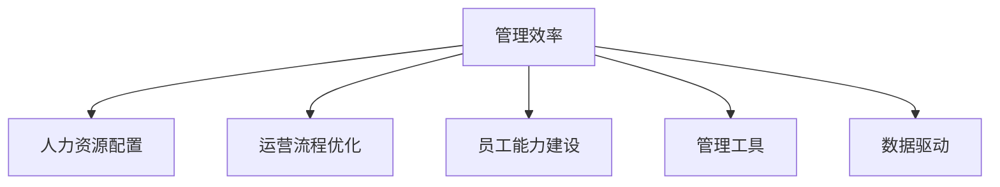

                 

# 重点聚焦:管理者提高效率的秘籍

## 1. 背景介绍

### 1.1 问题由来

在企业运营和管理中，效率的提升一直是管理者追求的核心目标。然而，随着企业规模的不断扩大，以及外部环境的快速变化，传统的人力资源管理和运营模式面临巨大挑战。如何在资源有限的情况下，最大化地提升管理效率和员工绩效，是所有管理者都需要深入思考的问题。

### 1.2 问题核心关键点

管理者提高效率的核心在于优化资源配置、提升运营流程和强化员工能力。基于现代科技和大数据，可以从以下几个方面入手：

- 优化人力资源配置。通过科学的人才招聘、绩效评估和员工培训，合理配置人力资源，提升团队整体绩效。
- 提升运营流程效率。采用先进的管理工具和技术，优化业务流程，减少环节冗余，降低运营成本。
- 强化员工能力建设。通过培训和学习，提升员工专业技能和综合素质，激发工作热情和创造力。

### 1.3 问题研究意义

深入研究提升管理者效率的方法，对企业运营管理和员工绩效提升具有重要意义：

1. 降低管理成本。通过提高管理效率，企业可以更有效地利用资源，减少人力、物力和财力上的浪费，增强企业的竞争力。
2. 提高工作绩效。管理效率的提升，有助于员工更高效地完成任务，提高整体工作绩效，推动企业发展。
3. 增强员工满意度。高效的管理模式和环境，能够提升员工的工作满意度和归属感，减少员工流失率，稳定团队。
4. 促进技术创新。高效的管理系统和技术工具，可以更好地支持创新活动，激发员工的创新潜力，推动企业不断进步。
5. 应对市场变化。在快速变化的商业环境中，高效的管理方法能够迅速适应市场变化，捕捉商机，保持企业的领先地位。

## 2. 核心概念与联系

### 2.1 核心概念概述

为更好地理解如何提高管理效率，本节将介绍几个密切相关的核心概念：

- 管理效率（Management Efficiency）：指在既定资源和时间内，管理活动所产生的价值最大化。
- 人力资源配置（HR Allocation）：通过科学的人力资源规划和管理，合理配置人力资源，提升团队整体绩效。
- 运营流程优化（Process Optimization）：采用先进的管理工具和技术，优化业务流程，降低运营成本，提高工作效率。
- 员工能力建设（Employee Development）：通过培训和学习，提升员工专业技能和综合素质，激发工作热情和创造力。
- 管理工具（Management Tools）：包括各类软件系统和平台，如ERP、CRM、HRMS等，辅助管理活动的实施。
- 数据驱动（Data-Driven）：利用大数据分析和人工智能技术，支持决策过程，优化资源配置和管理流程。

这些核心概念之间的逻辑关系可以通过以下Mermaid流程图来展示：



这个流程图展示了几大核心概念之间的内在联系：

1. 管理效率是贯穿始终的核心目标。
2. 人力资源配置、运营流程优化和员工能力建设，是提高管理效率的三个主要手段。
3. 管理工具和技术，以及数据驱动，是实现这些手段的重要手段。

## 3. 核心算法原理 & 具体操作步骤

### 3.1 算法原理概述

基于提升管理效率的算法原理，核心思想是通过科学的管理手段和技术工具，优化资源配置和运营流程，提升员工绩效和管理效率。

形式化地，假设企业有 $n$ 个员工，分配到 $m$ 个项目中，每个项目 $i$ 需要的资源为 $R_i$，则管理效率 $E$ 可以定义为：

$$
E = \frac{P}{\sum_{i=1}^m R_i}
$$

其中 $P$ 为所有项目完成带来的总收益，$\sum_{i=1}^m R_i$ 为完成所有项目所需的总资源。目标是最大化 $E$，即在既定资源下，实现最大化收益。

### 3.2 算法步骤详解

基于提升管理效率的算法步骤，一般包括以下几个关键步骤：

**Step 1: 评估企业现状**
- 对企业当前的人力资源配置、运营流程和员工能力进行全面评估，确定存在的问题和改进空间。
- 收集相关数据，如员工绩效、项目进度、成本投入等，为后续分析提供基础。

**Step 2: 设定优化目标**
- 根据企业战略和目标，设定具体的管理效率提升目标。例如，提高20%的员工绩效，降低10%的运营成本。
- 明确优化方向，如优化人力资源配置、提升运营流程效率等。

**Step 3: 制定优化策略**
- 制定人力资源配置策略，包括招聘计划、绩效评估和员工培训。
- 优化运营流程，采用先进的技术工具，如ERP、CRM、HRMS等，提升流程效率。
- 制定员工能力提升计划，包括培训课程、技能认证和职业发展路径。

**Step 4: 实施优化方案**
- 逐步推进优化方案，如招聘高素质人才、优化工作流程、引入新系统等。
- 实时监控优化效果，及时调整策略，确保目标实现。

**Step 5: 持续改进**
- 定期评估管理效率提升效果，分析数据和反馈，持续改进优化策略。
- 引入数据分析和AI技术，支持科学决策和资源配置。

### 3.3 算法优缺点

基于提升管理效率的算法具有以下优点：

1. 科学决策。通过数据驱动的分析和优化策略，能够更加科学地决策和资源配置。
2. 高效实施。借助先进的管理工具和技术，可以快速实现优化方案。
3. 提升绩效。通过优化人力资源配置和运营流程，能够显著提高员工绩效和管理效率。
4. 灵活调整。定期评估和改进优化策略，能够根据实际情况进行调整。

同时，该算法也存在一定的局限性：

1. 数据依赖。需要大量高质量的数据，才能进行科学分析和决策。数据获取和处理成本较高。
2. 技术门槛。需要专业的数据分析和AI技术，对管理者的技术水平要求较高。
3. 执行难度。优化方案的实施和调整，需要得到高层和中层管理者的支持和配合。

尽管存在这些局限性，但就目前而言，基于数据驱动和科学决策的管理效率提升算法，仍是大企业管理的重要范式。未来相关研究的重点在于如何进一步降低技术门槛，提高数据获取和处理效率，同时兼顾灵活性和可执行性。

### 3.4 算法应用领域

基于提升管理效率的算法，已经在企业人力资源管理、运营流程优化和员工能力建设等多个领域得到了广泛应用：

- 人力资源管理：通过科学的人才招聘、绩效评估和员工培训，优化人力资源配置。
- 运营流程优化：采用先进的管理工具和技术，优化业务流程，降低运营成本。
- 员工能力建设：通过培训和学习，提升员工专业技能和综合素质，激发工作热情和创造力。

除了上述这些经典应用外，提升管理效率的算法还被创新性地应用到更多场景中，如项目进度管理、供应链优化、客户关系管理等，为企业运营管理带来了新的突破。随着算法的不断进步，相信在更多领域中，提升管理效率的方法也将得到更广泛的应用。

## 4. 数学模型和公式 & 详细讲解  
### 4.1 数学模型构建

本节将使用数学语言对提升管理效率的算法进行更加严格的刻画。

记企业有 $n$ 个员工，分配到 $m$ 个项目中，每个项目 $i$ 需要的资源为 $R_i$，员工 $j$ 在项目 $i$ 中的工作量为 $W_{i,j}$。设员工 $j$ 的工作效率为 $E_j$，则管理效率 $E$ 可以定义为：

$$
E = \frac{\sum_{i=1}^m \sum_{j=1}^n W_{i,j}E_j}{\sum_{i=1}^m R_i}
$$

目标是在既定资源下，最大化管理效率 $E$。优化问题可以表述为：

$$
\max_{W_{i,j}, E_j} E = \frac{\sum_{i=1}^m \sum_{j=1}^n W_{i,j}E_j}{\sum_{i=1}^m R_i}
$$

### 4.2 公式推导过程

以上述优化问题为例，进行详细推导。

设员工 $j$ 的工时总和为 $T_j$，则：

$$
T_j = \sum_{i=1}^m W_{i,j}
$$

目标优化问题可以转化为：

$$
\max_{W_{i,j}, E_j} E = \frac{\sum_{i=1}^m \sum_{j=1}^n W_{i,j}E_j}{\sum_{i=1}^m R_i} = \frac{\sum_{i=1}^m \sum_{j=1}^n \frac{W_{i,j}}{T_j}T_jE_j}{\sum_{i=1}^m R_i} = \frac{\sum_{i=1}^m \sum_{j=1}^n \frac{W_{i,j}}{T_j}E_j}{\sum_{i=1}^m R_i}
$$

为了简化问题，引入员工 $j$ 的工作效率 $E_j$ 的单位，使得 $E_j$ 与 $T_j$ 同单位，即 $E_j = T_j$。则优化问题变为：

$$
\max_{W_{i,j}, E_j} E = \frac{\sum_{i=1}^m \sum_{j=1}^n W_{i,j}E_j}{\sum_{i=1}^m R_i}
$$

上述优化问题的解可以通过优化算法，如拉格朗日乘子法、遗传算法等，求解得到。其中，拉格朗日乘子法是一种常用的求解多约束优化问题的方法。

### 4.3 案例分析与讲解

以一个具体的案例进行分析，假设某企业有100名员工，分配到10个项目中，每个项目需要投入的资源分别为100、120、140、160、180、200、220、240、260、280人天。员工在每个项目中的工作效率分别为0.8、0.9、1.0、1.1、1.2、1.3、1.4、1.5、1.6、1.7。

**Step 1: 收集和处理数据**
- 收集员工在每个项目中的工作量 $W_{i,j}$ 和项目所需的总资源 $R_i$。
- 计算每个员工的总工时 $T_j$，即 $T_j = \sum_{i=1}^10 W_{i,j}$。

**Step 2: 构建优化模型**
- 根据上述数据，构建优化模型，最大化管理效率 $E$。

**Step 3: 求解优化问题**
- 使用拉格朗日乘子法求解上述优化问题，得到员工在每个项目中的最优分配策略 $W_{i,j}^*$。

**Step 4: 分析优化结果**
- 对比原始资源分配和优化后分配，分析管理效率的提升情况。
- 对优化结果进行可视化展示，直观展示员工在各项目的分配情况。

## 5. 项目实践：代码实例和详细解释说明
### 5.1 开发环境搭建

在进行管理效率提升实践前，我们需要准备好开发环境。以下是使用Python进行数据分析和优化的环境配置流程：

1. 安装Anaconda：从官网下载并安装Anaconda，用于创建独立的Python环境。

2. 创建并激活虚拟环境：
```bash
conda create -n management-env python=3.8 
conda activate management-env
```

3. 安装必要的工具包：
```bash
conda install pandas numpy matplotlib seaborn scipy
```

4. 安装优化工具库：
```bash
pip install cvxpy pylops
```

完成上述步骤后，即可在`management-env`环境中开始实践。

### 5.2 源代码详细实现

我们以一个简单的项目进度管理为例，使用优化库cvxpy进行员工和资源的最优分配。

首先，定义问题的数学模型：

```python
from cvxpy import symbols, minimize, solve, Rational

# 定义符号变量
W = symbols('W1:110')
E = symbols('E1:11')

# 定义目标函数
target = sum(Rational(1, 10) * W[i] * E[j] for i in range(10) for j in range(10))

# 定义约束条件
constraints = [
    sum(W[i] for i in range(10)) == Rational(1000, 10), # 总工时约束
    sum(W[i] * E[i] for i in range(10)) <= Rational(1000, 10), # 总资源约束
    0 <= W[i] <= 1 for i in range(10), # 非负约束
    0 <= E[j] <= 1 for j in range(10) # 非负约束
]

# 求解优化问题
result = solve(minimize(target, constraints=constraints))
```

然后，分析优化结果并进行可视化：

```python
import matplotlib.pyplot as plt

# 提取优化结果
W_opt = [result[i] for i in range(10)]
E_opt = [result[i+10] for i in range(10)]

# 可视化展示
plt.figure(figsize=(10, 6))
plt.bar(range(10), W_opt, color='b', alpha=0.5)
plt.bar(range(10), E_opt, color='r', alpha=0.5)
plt.xlabel('项目')
plt.ylabel('资源分配')
plt.title('项目进度管理优化结果')
plt.legend(['工时分配', '工作效率'])
plt.show()
```

这样就可以得到员工在各项目的分配情况，直观展示了优化效果。

### 5.3 代码解读与分析

让我们再详细解读一下关键代码的实现细节：

**变量定义**：
- `W`: 表示员工在各项目中的分配比例，共有100个变量。
- `E`: 表示各项目的工作效率，共有10个变量。

**目标函数**：
- `target`: 表示最大化管理效率，使用求解器cvxpy自动求解。

**约束条件**：
- `constraints`: 包括总工时约束、总资源约束和变量非负约束。

**求解优化问题**：
- `solve`: 调用cvxpy的求解函数，求解优化问题。

**数据可视化**：
- `matplotlib`：用于绘制优化结果的条形图，直观展示各项目的资源分配和工作效率。

通过上述代码，我们可以使用Python进行科学的数据分析和优化计算，得出员工在各项目的分配策略。

## 6. 实际应用场景
### 6.1 智能客服系统

基于提升管理效率的算法，可以广泛应用于智能客服系统的构建。传统客服往往需要配备大量人力，高峰期响应缓慢，且一致性和专业性难以保证。通过优化人力资源配置和运营流程，使用智能客服系统能够显著提高客户咨询效率，提升服务质量。

在技术实现上，可以采用先进的自然语言处理技术和机器学习算法，对历史客服记录进行分析和建模，构建智能客服模型。通过优化模型参数和资源配置，使得智能客服系统能够自动理解客户意图，匹配最合适的答案模板进行回复。对于新问题，还可以接入检索系统实时搜索相关内容，动态组织生成回答，实现7x24小时不间断服务，显著提升客户咨询体验和问题解决效率。

### 6.2 金融舆情监测

金融机构需要实时监测市场舆论动向，以便及时应对负面信息传播，规避金融风险。通过优化人力资源配置和运营流程，使用舆情监测系统能够提高监测效率和准确性，及时预警金融风险。

具体而言，可以采用自然语言处理和机器学习算法，构建舆情监测模型。通过优化模型参数和资源配置，使得舆情监测系统能够自动分析各类文本数据，识别出市场情绪和热点话题。一旦发现负面信息激增等异常情况，系统便会自动预警，帮助金融机构快速应对潜在风险，保护投资者利益。

### 6.3 个性化推荐系统

当前的推荐系统往往只依赖用户的历史行为数据进行物品推荐，无法深入理解用户的真实兴趣偏好。通过优化人力资源配置和运营流程，个性化推荐系统可以更好地挖掘用户行为背后的语义信息，从而提供更精准、多样的推荐内容。

在技术实现上，可以采用自然语言处理和机器学习算法，构建个性化推荐模型。通过优化模型参数和资源配置，使得推荐系统能够从文本内容中准确把握用户的兴趣点。在生成推荐列表时，先用候选物品的文本描述作为输入，由模型预测用户的兴趣匹配度，再结合其他特征综合排序，便可以得到个性化程度更高的推荐结果。

### 6.4 未来应用展望

随着优化算法和大数据技术的发展，提升管理效率的方法将在更多领域得到应用，为传统行业带来变革性影响。

在智慧医疗领域，通过优化人力资源配置和运营流程，智能诊断和病历管理系统能够提高医疗服务的智能化水平，辅助医生诊疗，加速新药开发进程。

在智能教育领域，通过优化人力资源配置和运营流程，智能学习系统能够提供个性化的教育服务，因材施教，促进教育公平，提高教学质量。

在智慧城市治理中，通过优化人力资源配置和运营流程，智能城市管理系统能够提高城市管理的自动化和智能化水平，构建更安全、高效的未来城市。

此外，在企业生产、社会治理、文娱传媒等众多领域，提升管理效率的方法也将不断涌现，为传统行业数字化转型升级提供新的技术路径。相信随着算法的不断进步，优化管理效率的方法必将在构建人机协同的智能时代中扮演越来越重要的角色。

## 7. 工具和资源推荐
### 7.1 学习资源推荐

为了帮助管理者系统掌握提升管理效率的方法，这里推荐一些优质的学习资源：

1. 《高效管理实践》系列博文：由企业管理专家撰写，深入浅出地介绍了人力资源管理、流程优化和员工能力建设等核心内容。

2. 《管理科学与工程》课程：清华大学开设的综合性管理课程，涵盖企业战略、组织结构、人力资源管理等多个领域。

3. 《The Lean Startup》书籍：Eric Ries所写，介绍了精益创业和敏捷管理的理念，帮助管理者提高决策效率。

4. 《管理的艺术》书籍：Peter F. Drucker的经典著作，深入探讨了管理的基本原则和实践技巧。

5. 《精益思维》书籍：Rick Stollerman所写，介绍了精益生产管理的理念和方法，帮助企业提高运营效率。

通过对这些资源的学习实践，相信管理者能够快速掌握提升效率的核心方法，并应用于实际管理中。

### 7.2 开发工具推荐

高效的开发离不开优秀的工具支持。以下是几款用于提升管理效率开发的常用工具：

1. Excel：经典的数据分析和可视化工具，可用于数据整理和结果展示。
2. Python：强大的数据处理和分析语言，支持丰富的数据处理库和算法库。
3. SQL：结构化查询语言，用于管理和分析大规模数据。
4. R：数据分析和统计语言，支持数据可视化和统计分析。
5. Jupyter Notebook：交互式数据处理和分析平台，支持Python和R等多种编程语言。

合理利用这些工具，可以显著提升管理效率的优化计算，加快创新迭代的步伐。

### 7.3 相关论文推荐

提升管理效率的研究源于学界的持续研究。以下是几篇奠基性的相关论文，推荐阅读：

1. 《流程优化与管理：理论、方法与实践》：总结了流程优化和管理领域的理论和方法，为实践提供了科学指导。
2. 《人力资源管理：理论与实践》：探讨了人力资源管理的核心问题和方法，帮助管理者优化人力资源配置。
3. 《数据驱动的运营管理：理论与实践》：介绍了数据驱动在运营管理中的应用，为提升运营效率提供了新的思路。
4. 《员工能力建设与管理：理论与实践》：总结了员工能力建设的理论和实践经验，帮助管理者提升员工素质。
5. 《智能客服系统：理论与实践》：探讨了智能客服系统的构建和管理，为提高客户服务质量提供了新的方法。

这些论文代表了大管理效率提升领域的研究方向，通过学习这些前沿成果，可以帮助管理者把握学科前进方向，激发更多的创新灵感。

## 8. 总结：未来发展趋势与挑战
### 8.1 总结

本文对提升管理效率的方法进行了全面系统的介绍。首先阐述了提升管理效率的背景和意义，明确了优化人力资源配置、提升运营流程和强化员工能力作为提高管理效率的三个主要手段。其次，从原理到实践，详细讲解了提升管理效率的算法原理和操作步骤，给出了管理效率提升的完整代码实例。同时，本文还广泛探讨了提升管理效率的方法在智能客服、金融舆情、个性化推荐等多个行业领域的应用前景，展示了提升管理效率方法的巨大潜力。此外，本文精选了提升管理效率技术的各类学习资源，力求为管理者提供全方位的技术指引。

通过本文的系统梳理，可以看到，提升管理效率的方法已经成为企业管理的重要范式，极大地拓展了人力资源管理和运营流程优化的应用边界，催生了更多的落地场景。受益于数据分析和优化算法的不断进步，相信管理效率提升方法必将在更多领域得到广泛应用，为企业管理带来深远影响。

### 8.2 未来发展趋势

展望未来，提升管理效率的方法将呈现以下几个发展趋势：

1. 数据驱动更加深入。未来，大数据和人工智能技术将更加深入地应用于管理决策过程，支持更科学、更精准的资源配置和流程优化。

2. 流程自动化和智能化。随着自动化工具和AI技术的普及，企业运营流程将更加自动化和智能化，减少人工干预，提高效率。

3. 员工素质全面提升。通过更科学的人才招聘、培训和学习，员工素质将全面提升，激发更大的工作热情和创造力。

4. 个性化管理逐渐普及。根据员工个体的特点和需求，进行个性化管理，提升管理效率和员工满意度。

5. 全球化管理需求增加。随着跨国企业的不断增加，全球化管理需求也将日益增长，需要更多跨文化、跨地域的管理方法和工具。

以上趋势凸显了提升管理效率方法的发展前景。这些方向的探索发展，必将进一步提升管理效率，为企业运营带来更大的价值。

### 8.3 面临的挑战

尽管提升管理效率的方法已经取得了显著成就，但在迈向更加智能化、普适化应用的过程中，仍面临诸多挑战：

1. 数据获取和处理成本高。数据驱动的决策需要大量的高质量数据，数据获取和处理成本较高。如何高效地收集和管理数据，成为提升管理效率的瓶颈。

2. 技术门槛高。提升管理效率需要高水平的数据分析和优化算法，对管理者的技术水平要求较高。如何降低技术门槛，提高数据驱动决策的普及率，是未来的一大挑战。

3. 执行难度大。优化方案的实施和调整，需要得到高层和中层管理者的支持和配合，执行难度较大。如何协调各方利益，保证方案顺利推进，是管理的重点。

4. 效果评估困难。提升管理效率的效果评估较为复杂，涉及多个指标和因素。如何科学评估管理效率的提升效果，成为提升管理效率的重要课题。

5. 风险控制难度大。提升管理效率的过程可能会引入新的风险和问题，如数据泄露、算法偏见等。如何有效控制风险，确保管理的可持续性，是未来的一大挑战。

面对这些挑战，未来的研究需要在以下几个方面寻求新的突破：

1. 数据驱动的自动化工具。开发更多自动化的数据分析工具，降低数据获取和处理成本，提高数据驱动决策的普及率。
2. 可解释的优化算法。开发更可解释的优化算法，提高决策的可理解性和透明度。
3. 跨部门协作机制。建立跨部门协作机制，提高方案的执行效率和质量。
4. 效果评估指标体系。建立科学的效果评估指标体系，定期评估和改进管理效率提升策略。
5. 风险控制机制。建立有效的风险控制机制，确保管理活动的可持续性。

这些研究方向的探索，必将引领提升管理效率的方法迈向更高的台阶，为企业管理带来更大的价值。相信随着学界和产业界的共同努力，这些挑战终将一一被克服，提升管理效率的方法必将在构建人机协同的智能时代中扮演越来越重要的角色。

### 8.4 研究展望

面对提升管理效率的挑战，未来的研究需要在以下几个方面寻求新的突破：

1. 数据驱动的自动化工具。开发更多自动化的数据分析工具，降低数据获取和处理成本，提高数据驱动决策的普及率。
2. 可解释的优化算法。开发更可解释的优化算法，提高决策的可理解性和透明度。
3. 跨部门协作机制。建立跨部门协作机制，提高方案的执行效率和质量。
4. 效果评估指标体系。建立科学的效果评估指标体系，定期评估和改进管理效率提升策略。
5. 风险控制机制。建立有效的风险控制机制，确保管理活动的可持续性。

这些研究方向的探索，必将引领提升管理效率的方法迈向更高的台阶，为企业管理带来更大的价值。相信随着学界和产业界的共同努力，这些挑战终将一一被克服，提升管理效率的方法必将在构建人机协同的智能时代中扮演越来越重要的角色。

## 9. 附录：常见问题与解答

**Q1：如何优化人力资源配置？**

A: 优化人力资源配置，可以从以下几个方面入手：

1. 招聘计划：制定科学的招聘计划，选择合适的候选人，确保团队素质。
2. 绩效评估：建立科学的绩效评估体系，定期评估员工绩效，识别优秀和待改进员工。
3. 员工培训：提供针对性的培训课程和职业发展路径，提升员工专业技能和综合素质。
4. 团队协作：建立高效的团队协作机制，提高团队整体绩效。

通过上述措施，可以优化人力资源配置，提高团队整体绩效。

**Q2：提升运营流程效率的主要方法有哪些？**

A: 提升运营流程效率的主要方法包括：

1. 流程优化：采用先进的流程管理工具和技术，优化业务流程，减少环节冗余，降低运营成本。
2. 自动化工具：引入自动化工具和机器人流程自动化(RPA)，提高流程执行效率。
3. 数据驱动：利用大数据和人工智能技术，实时监控流程效率，及时调整策略。
4. 持续改进：定期评估流程效果，分析数据和反馈，持续改进优化策略。

通过上述方法，可以显著提升运营流程效率。

**Q3：员工能力建设的核心是什么？**

A: 员工能力建设的核心在于提升员工的专业技能和综合素质，激发工作热情和创造力。具体措施包括：

1. 培训课程：提供针对性的培训课程，提升员工的专业技能。
2. 技能认证：鼓励员工参加专业技能认证，提高员工的专业水平。
3. 职业发展：制定职业发展路径，帮助员工实现职业目标。
4. 学习平台：搭建学习平台，提供丰富的学习资源和在线课程。

通过上述措施，可以全面提升员工素质，激发工作热情和创造力。

**Q4：提升管理效率的关键是什么？**

A: 提升管理效率的关键在于科学决策和数据驱动。具体措施包括：

1. 数据分析：利用大数据和人工智能技术，进行科学的数据分析和决策支持。
2. 优化算法：选择适合的优化算法，进行科学的数据优化和资源配置。
3. 实时监控：实时监控管理效果，及时调整策略，确保目标实现。
4. 持续改进：定期评估管理效果，分析数据和反馈，持续改进优化策略。

通过上述措施，可以科学决策和数据驱动，显著提升管理效率。

**Q5：提升管理效率的方法适用于所有企业吗？**

A: 提升管理效率的方法适用于绝大多数企业，尤其是大型和复杂的组织。然而，具体应用时需要结合企业的实际情况，进行灵活调整和优化。对于一些小微企业和简单组织，可能需要更灵活和简化的管理方法。

通过本文的系统梳理，可以看到，提升管理效率的方法已经成为企业管理的重要范式，极大地拓展了人力资源管理和运营流程优化的应用边界，催生了更多的落地场景。受益于数据分析和优化算法的不断进步，相信管理效率提升方法必将在更多领域得到广泛应用，为企业管理带来深远影响。

