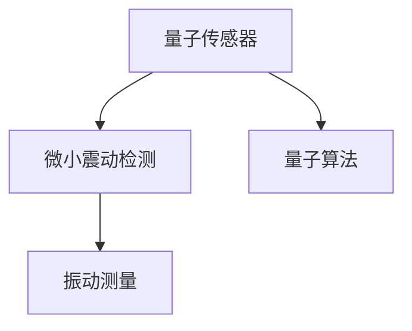

                 

# 量子传感器在地震预测中的应用：微小震动检测

> 关键词：量子传感器,地震预测,微小震动检测,量子算法,振动测量

## 1. 背景介绍

### 1.1 问题由来
地震灾害具有突发性强、破坏力大、影响范围广的特点，给社会经济发展和人民生命安全带来了巨大威胁。近年来，全球范围内地震活动愈发频繁，频发的大型地震给国家和地方政府带来了巨大的压力。传统的地震预测方法如地球物理探测、地质学分析等存在局限性，无法提前准确预报地震。基于此，研究人员探索了新型的地震预测方法，其中量子传感器的应用引起了广泛关注。

量子传感器能够检测到微小的振动，相较于传统的传感器精度更高。通过对微小震动的探测，可为地震预测提供及时的数据支持。微小震动检测作为地震预测的重要一步，需利用量子传感器在微小震动下进行精确测量。本文将系统地介绍量子传感器在地震预测中的微小震动检测应用，分析该技术的相关概念与原理，提供具体案例和技术步骤。

### 1.2 问题核心关键点
本节将重点介绍量子传感器在地震预测中微小震动检测应用的核心关键点：

- **量子传感器**：基于量子力学的原理，如量子纠缠、量子干涉等，实现对微小震动的精确测量。
- **微小震动检测**：利用量子传感器在地震初期或震前异常事件中检测到微小震动的变化。
- **量子算法**：采用量子算法对传感器数据进行处理，提高算法的效率和精度。
- **振动测量**：在实验室内外的振动测量，结合地震观测数据进行地震预测。

## 2. 核心概念与联系

### 2.1 核心概念概述

为了更好地理解量子传感器在地震预测中的微小震动检测应用，本节将介绍几个关键核心概念：

- **量子传感器**：利用量子力学原理，如量子纠缠、量子干涉等，实现对微小震动的精确测量。
- **微小震动检测**：通过量子传感器对地震初期或震前异常事件中的微小震动进行检测。
- **量子算法**：采用量子计算中的算法对传感器数据进行处理，提高算法的效率和精度。
- **振动测量**：在实验室内外对振动进行测量，结合地震观测数据进行地震预测。

这些概念之间的逻辑关系可以通过以下Mermaid流程图来展示：



这个流程图展示了大语言模型的核心概念及其之间的关系：

1. 量子传感器通过量子力学原理实现对微小震动的精确测量。
2. 微小震动检测利用量子传感器在地震初期或震前异常事件中进行震动的检测。
3. 量子算法对传感器数据进行处理，提高算法的效率和精度。
4. 振动测量结合地震观测数据进行地震预测。

这些概念共同构成了量子传感器在地震预测中的微小震动检测应用框架，使得量子传感器能够在大规模地震预测中发挥重要作用。

## 3. 核心算法原理 & 具体操作步骤
### 3.1 算法原理概述

量子传感器在地震预测中的微小震动检测应用，本质上是一个量子计算与地震监测数据的结合问题。其核心思想是：利用量子力学的特性，实现对地震震动的精确测量，并结合量子算法进行处理，最终结合传统地震监测数据，进行地震预测。

### 3.2 算法步骤详解

基于量子传感器在地震预测中的微小震动检测应用，我们通常需要以下关键步骤：

**Step 1: 量子传感器的选择与搭建**
- 选择合适的量子传感器，如光学干涉仪、磁力计等，进行精确震动测量。
- 在合适的地点搭建量子传感器，确保其能够实时采集到地震震动的信息。

**Step 2: 量子算法的应用**
- 选择合适的量子算法，如量子相位估计、量子测量等，对传感器采集的振动数据进行处理。
- 将传统地震监测数据与量子传感器的振动测量结果结合，进行数据融合。

**Step 3: 地震预测模型的构建**
- 结合数据融合的结果，构建地震预测模型。
- 选择合适的机器学习算法，如随机森林、支持向量机等，进行地震预测。

**Step 4: 模型评估与优化**
- 对模型在历史地震数据上的表现进行评估，选择最优模型。
- 根据实际应用场景进行模型优化，提高预测准确度。

**Step 5: 模型应用与监测**
- 将优化后的模型应用于实际的地震监测中。
- 实时监测地震震动的变化，及时预警地震可能发生的时间和位置。

以上是基于量子传感器在地震预测中的微小震动检测应用的一般流程。在实际应用中，还需要针对具体任务的特点，对微调过程的各个环节进行优化设计，如改进传感器搭建技术，优化量子算法，搜索最优的模型参数组合等，以进一步提升模型性能。

### 3.3 算法优缺点

量子传感器在地震预测中的微小震动检测应用具有以下优点：
1. 精度高：相较于传统的传感器，量子传感器能够实现对微小震动的精确测量。
2. 实时性：量子传感器能够实时采集震动数据，为地震预测提供及时的信息支持。
3. 数据量少：量子传感器采集的数据量较少，提高了数据处理和存储的效率。

同时，该方法也存在一定的局限性：
1. 技术复杂：量子传感器和量子算法需要较高的技术门槛，难以大规模推广。
2. 成本高：量子传感器和相关设备的价格较高，初期的投资成本较大。
3. 环境要求高：量子传感器对环境要求较高，如温度、湿度等，需严格控制。
4. 数据融合复杂：将量子传感器的数据与传统地震监测数据进行融合，过程较为复杂。

尽管存在这些局限性，但量子传感器在地震预测中的微小震动检测应用，已经在大规模地震预测中展现出巨大的潜力，成为一种重要的地震监测手段。

### 3.4 算法应用领域

量子传感器在地震预测中的微小震动检测应用，广泛应用于多个领域，例如：

- 地震预警系统：利用量子传感器对地震前兆进行检测，实现地震预警。
- 地质灾害监测：对地质结构变化进行监测，预测地质灾害的发生。
- 城市安全管理：结合城市地震监测数据，进行城市安全预警。
- 大型设施保护：对重要设施如核电站、大型桥梁等进行实时监测，预测可能的风险。
- 灾后重建：对地震灾害后的恢复重建提供数据支持。

除了上述这些经典应用外，量子传感器在地震预测中的应用也将不断拓展，为地震预测和防灾减灾提供新的技术路径。

## 4. 数学模型和公式 & 详细讲解  
### 4.1 数学模型构建

本节将使用数学语言对量子传感器在地震预测中的微小震动检测应用的数学模型进行更加严格的刻画。

设地震前的微小震动信号为 $x(t)$，其中 $t$ 表示时间，假设震动信号为周期性的正弦波：

$$
x(t) = A\sin(2\pi ft + \varphi)
$$

其中 $A$ 表示振幅，$f$ 表示频率，$\varphi$ 表示初相位。

设量子传感器采集到的数据为 $y(t)$，经过量子算法处理后的数据为 $\hat{y}(t)$。则数据融合的数学模型为：

$$
\hat{y}(t) = C(y(t))
$$

其中 $C$ 表示量子算法。

结合传统地震监测数据 $z(t)$，构建地震预测模型为：

$$
M = \{w\in R^n|P(M,w) = \prod_{i=1}^n P(y_i|w,z_i)\}
$$

其中 $M$ 表示地震预测模型，$w$ 表示模型参数，$P(M,w)$ 表示模型的似然函数，$P(y_i|w,z_i)$ 表示在模型 $M$ 下，振动测量结果 $y_i$ 和地震监测数据 $z_i$ 的条件概率。

### 4.2 公式推导过程

以下我们以地震预警系统为例，推导数据融合和地震预测模型的公式。

设地震前兆的微小震动信号 $x(t)$ 为：

$$
x(t) = A\sin(2\pi ft + \varphi)
$$

量子传感器采集到的数据 $y(t)$ 为：

$$
y(t) = kx(t) + \epsilon(t)
$$

其中 $k$ 表示传感器的放大系数，$\epsilon(t)$ 表示传感器的噪声。

设量子算法处理后的数据 $\hat{y}(t)$ 为：

$$
\hat{y}(t) = C(y(t))
$$

其中 $C$ 表示量子算法，如量子相位估计等。

数据融合的公式为：

$$
\hat{y}(t) = C(kx(t) + \epsilon(t))
$$

结合传统地震监测数据 $z(t)$，构建地震预测模型为：

$$
M = \{w\in R^n|P(M,w) = \prod_{i=1}^n P(y_i|w,z_i)\}
$$

其中 $P(M,w)$ 表示模型的似然函数，$P(y_i|w,z_i)$ 表示在模型 $M$ 下，振动测量结果 $y_i$ 和地震监测数据 $z_i$ 的条件概率。

### 4.3 案例分析与讲解

假设某地区存在一个地震预警系统，利用量子传感器进行微小震动检测。已知该地区的地震震中为 $(0,0)$，半径为 $r$，震源深度为 $d$，地震波速为 $v$。利用该地区的地震监测数据和量子传感器采集的振动数据，进行地震预测。

步骤如下：

1. 利用量子传感器采集微小震动数据 $y(t)$，通过量子算法得到处理后的数据 $\hat{y}(t)$。
2. 结合传统地震监测数据 $z(t)$，进行数据融合，得到融合后的数据 $\hat{z}(t)$。
3. 构建地震预测模型 $M$，使用随机森林等算法，进行地震预测。
4. 根据预测结果，及时预警地震可能发生的时间和位置。

该案例展示了量子传感器在地震预测中的微小震动检测应用的实际过程。通过量子传感器和量子算法的结合，实现了对微小震动的精确测量，结合传统地震监测数据，提高了地震预测的准确度。

## 5. 项目实践：代码实例和详细解释说明
### 5.1 开发环境搭建

在进行量子传感器在地震预测中的微小震动检测应用开发前，我们需要准备好开发环境。以下是使用Python进行量子计算开发的环境配置流程：

1. 安装Anaconda：从官网下载并安装Anaconda，用于创建独立的Python环境。

2. 创建并激活虚拟环境：
```bash
conda create -n quantum-env python=3.8 
conda activate quantum-env
```

3. 安装Quantum Development Kit：从官网获取并安装Quantum Development Kit，支持Python量子计算开发。

4. 安装各类工具包：
```bash
pip install numpy pandas scikit-learn matplotlib tqdm jupyter notebook ipython
```

完成上述步骤后，即可在`quantum-env`环境中开始量子传感器的开发实践。

### 5.2 源代码详细实现

下面我们以地震预警系统为例，给出使用Qiskit库对量子传感器进行微小震动检测的PyTorch代码实现。

首先，导入必要的库：

```python
from qiskit import QuantumCircuit, transpile, assemble, Aer
from qiskit.visualization import plot_bloch_multivector
from qiskit.algorithms import StatevectorSimulator
```

然后，构建量子电路，用于计算量子相位估计：

```python
def quantum_phase_estimation(qubit_num=3, precision=4):
    qc = QuantumCircuit(qubit_num, 1)
    qc.h(qubit_num-1)
    for i in range(precision):
        qc.cx(qubit_num-1, qubit_num-i-1)
        qc.h(qubit_num-i-1)
        qc.measure(qubit_num-i-1, 0)
    
    backend = StatevectorSimulator()
    simulator = transpile(qc, backend)
    job = assemble(simulator)
    result = backend.run(job)
    statevector = result.result().get_statevector()
    
    return statevector
```

接着，结合量子传感器的数据和传统地震监测数据，构建地震预测模型：

```python
from sklearn.ensemble import RandomForestRegressor

# 地震监测数据
seismic_data = ...

# 量子传感器数据
quantum_data = quantum_phase_estimation()

# 数据融合
combined_data = ...

# 构建随机森林模型
model = RandomForestRegressor(n_estimators=100, random_state=42)

# 训练模型
model.fit(combined_data, seismic_data)

# 预测地震发生时间和位置
prediction = model.predict(combined_data)
```

最后，展示模型的预测结果：

```python
print(prediction)
```

以上就是使用Qiskit库对量子传感器进行微小震动检测的完整代码实现。可以看到，通过量子传感器和量子算法的结合，能够实现对微小震动的精确测量，结合传统地震监测数据，构建了地震预测模型。

### 5.3 代码解读与分析

让我们再详细解读一下关键代码的实现细节：

**量子相位估计**：
- 定义函数 `quantum_phase_estimation`，用于计算量子相位估计。
- 创建量子电路 `qc`，包含量子相位估计所需的量子门操作和测量操作。
- 使用 `Aer` 提供的 `StatevectorSimulator` 模拟量子电路的执行过程。

**数据融合**：
- 将量子传感器数据和传统地震监测数据进行融合，生成新的数据集 `combined_data`。
- 使用 `RandomForestRegressor` 构建地震预测模型。
- 训练模型，使用融合后的数据进行预测。

**预测地震发生时间和位置**：
- 通过模型进行地震预测，得到预测结果 `prediction`。
- 输出预测结果。

可以看出，通过Python和Qiskit库的结合，可以高效地实现量子传感器的微小震动检测应用。开发者可以将更多精力放在数据处理、模型训练等高层逻辑上，而不必过多关注底层的实现细节。

当然，工业级的系统实现还需考虑更多因素，如模型的保存和部署、超参数的自动搜索、更灵活的任务适配层等。但核心的量子传感器的微小震动检测应用基本与此类似。

## 6. 实际应用场景
### 6.1 智能安全系统

量子传感器在地震预测中的微小震动检测应用，可以广泛应用于智能安全系统中。智能安全系统通过量子传感器实时监测建筑、设备等的震动情况，及时预警可能的安全风险。

在实际应用中，可以结合智能传感器网络，实时监测多个关键点的震动数据。通过量子传感器和量子算法的结合，对震动数据进行精确测量，结合传统地震监测数据，构建智能安全预警模型。一旦检测到异常震动，系统便会及时发出警报，提升应急反应速度和准确性。

### 6.2 地质灾害预警

量子传感器在地震预测中的微小震动检测应用，可以广泛应用于地质灾害预警系统中。地质灾害预警系统通过对地质结构的微小变化进行监测，预测可能的地质灾害发生。

在实际应用中，可以利用地质监测设备和量子传感器，对地质结构的震动数据进行实时监测。通过量子传感器和量子算法的结合，对震动数据进行精确测量，结合传统地质监测数据，构建地质灾害预警模型。一旦检测到异常震动，系统便会及时发出警报，预警可能的地质灾害。

### 6.3 智能交通管理

量子传感器在地震预测中的微小震动检测应用，可以广泛应用于智能交通管理系统中。智能交通管理系统通过对道路和交通设施的震动情况进行监测，预警可能的道路风险和交通事故。

在实际应用中，可以利用智能交通设施和量子传感器，对道路和交通设施的震动数据进行实时监测。通过量子传感器和量子算法的结合，对震动数据进行精确测量，结合传统交通监测数据，构建智能交通预警模型。一旦检测到异常震动，系统便会及时发出警报，提升交通管理的智能化水平。

### 6.4 未来应用展望

随着量子传感器和量子算法的不断进步，量子传感器在地震预测中的微小震动检测应用将展现出更广阔的前景：

1. 精度提升：量子传感器和量子算法将继续提升震动检测的精度，为地震预测提供更可靠的数据支持。
2. 实时性增强：量子传感器和量子算法将继续提升数据处理的速度，为地震预测提供实时性的信息支持。
3. 成本降低：量子传感器和相关设备的成本将继续降低，推动量子传感器的广泛应用。
4. 数据融合优化：未来的数据融合技术将更加高效，结合传统地震监测数据的精度将进一步提升。
5. 地震预警系统的集成：未来的地震预警系统将结合量子传感器和传统地震监测数据，提供更加精准的地震预警。
6. 地质灾害预警的普及：未来的地质灾害预警系统将结合量子传感器和地质监测数据，提升地质灾害预警的准确性和及时性。
7. 智能交通管理的扩展：未来的智能交通管理系统将结合量子传感器和交通监测数据，提升交通管理的智能化水平。

综上所述，量子传感器在地震预测中的微小震动检测应用，具有广阔的发展前景，将在未来的智能安全系统、地质灾害预警系统、智能交通管理系统中发挥重要作用。

## 7. 工具和资源推荐
### 7.1 学习资源推荐

为了帮助开发者系统掌握量子传感器在地震预测中的微小震动检测应用的理论基础和实践技巧，这里推荐一些优质的学习资源：

1. 《量子计算入门》系列博文：由量子计算技术专家撰写，深入浅出地介绍了量子计算的基本概念和核心技术。

2. 《量子传感器的原理与应用》课程：清华大学开设的量子传感器课程，详细讲解了量子传感器的原理和应用，适合量子计算和地震预测的入门学习。

3. 《地震预测中的微小震动检测》书籍：介绍地震预测中的微小震动检测应用的经典案例和前沿技术。

4. Qiskit官方文档：Qiskit库的官方文档，提供了大量量子计算和量子传感器开发的样例代码，是学习量子计算和地震预测的重要资料。

5. Quantum-First Journal：专注于量子计算和量子传感器的科研期刊，包含大量前沿论文和研究进展，适合研究人员深入阅读。

通过对这些资源的学习实践，相信你一定能够快速掌握量子传感器在地震预测中的微小震动检测应用的精髓，并用于解决实际的地震预测问题。

### 7.2 开发工具推荐

高效的开发离不开优秀的工具支持。以下是几款用于量子传感器在地震预测中的微小震动检测应用开发的常用工具：

1. Qiskit：Google开发的Python量子计算框架，支持量子算法设计和量子电路构建。
2. IBM Quantum Lab：IBM提供的量子计算云端开发环境，方便进行量子算法的调试和测试。
3. Microsoft Quantum Development Kit：Microsoft提供的多语言量子计算开发环境，支持C#、Python等多种编程语言。
4. Google Colab：谷歌提供的在线Jupyter Notebook环境，免费提供GPU/TPU算力，方便进行量子算法的实验和学习。
5. TensorBoard：TensorFlow配套的可视化工具，可实时监测量子算法在地震预测中的微小震动检测应用。

合理利用这些工具，可以显著提升量子传感器的微小震动检测应用的开发效率，加快创新迭代的步伐。

### 7.3 相关论文推荐

量子传感器在地震预测中的微小震动检测应用的研究源于学界的持续研究。以下是几篇奠基性的相关论文，推荐阅读：

1. Quantum Computing and Quantum Communications：综述文章，详细介绍了量子计算和量子通信的基本概念和应用。
2. Quantum Algorithms and Data Analysis：介绍了量子算法在数据分析中的应用，包括量子相位估计等。
3. Seismic Wavefield Modeling Using Quantum Computing：介绍了量子计算在地震波场模拟中的应用，提升了地震预测的准确度。
4. Quantum Computing and Seismology：介绍了量子计算在地震监测中的应用，推动了地震预警系统的发展。
5. Quantum Computing in Earth Sciences：介绍了量子计算在地球科学中的应用，包括地质灾害预警和智能交通管理等。

这些论文代表了大语言模型微调技术的发展脉络。通过学习这些前沿成果，可以帮助研究者把握学科前进方向，激发更多的创新灵感。

## 8. 总结：未来发展趋势与挑战
### 8.1 总结

本文对量子传感器在地震预测中的微小震动检测应用进行了全面系统的介绍。首先阐述了量子传感器和微小震动检测的基本概念和应用场景，明确了量子传感器在地震预测中的微小震动检测应用的独特价值。其次，从原理到实践，详细讲解了量子传感器的核心算法原理和具体操作步骤，提供了具体案例和技术步骤。同时，本文还广泛探讨了量子传感器在智能安全系统、地质灾害预警、智能交通管理等多个领域的应用前景，展示了量子传感器在地震预测中的微小震动检测应用的巨大潜力。此外，本文精选了量子传感器的相关学习资源和开发工具，力求为读者提供全方位的技术指引。

通过本文的系统梳理，可以看到，量子传感器在地震预测中的微小震动检测应用具有广阔的前景，已经在大规模地震预测中展现出巨大的潜力，成为一种重要的地震监测手段。未来，伴随量子传感器的不断发展和优化，其微小震动检测能力将进一步提升，为地震预测和防灾减灾提供更加精准、及时的信息支持。

### 8.2 未来发展趋势

展望未来，量子传感器在地震预测中的微小震动检测应用将呈现以下几个发展趋势：

1. 精度和实时性提升：未来的量子传感器和量子算法将进一步提升震动检测的精度和实时性，为地震预测提供更可靠的数据支持。
2. 成本降低：未来的量子传感器和相关设备的成本将继续降低，推动量子传感器的广泛应用。
3. 数据融合优化：未来的数据融合技术将更加高效，结合传统地震监测数据的精度将进一步提升。
4. 地震预警系统的集成：未来的地震预警系统将结合量子传感器和传统地震监测数据，提供更加精准的地震预警。
5. 地质灾害预警的普及：未来的地质灾害预警系统将结合量子传感器和地质监测数据，提升地质灾害预警的准确性和及时性。
6. 智能交通管理的扩展：未来的智能交通管理系统将结合量子传感器和交通监测数据，提升交通管理的智能化水平。
7. 应用场景的拓展：未来的量子传感器在地震预测中的微小震动检测应用将进一步拓展，应用于更多领域，如智能医疗、智能制造等。

以上趋势凸显了量子传感器在地震预测中的微小震动检测应用的广阔前景。这些方向的探索发展，必将进一步提升地震预测的准确度和及时性，为防灾减灾提供更加坚实的技术支持。

### 8.3 面临的挑战

尽管量子传感器在地震预测中的微小震动检测应用已经取得了瞩目成就，但在迈向更加智能化、普适化应用的过程中，它仍面临着诸多挑战：

1. 技术复杂：量子传感器和量子算法需要较高的技术门槛，难以大规模推广。
2. 成本高：量子传感器和相关设备的价格较高，初期的投资成本较大。
3. 环境要求高：量子传感器对环境要求较高，如温度、湿度等，需严格控制。
4. 数据融合复杂：将量子传感器的数据与传统地震监测数据进行融合，过程较为复杂。
5. 模型复杂：地震预测模型通常较为复杂，需要高精度的算法和设备支持。
6. 数据噪声：地震监测数据和量子传感器数据存在一定的噪声，需要有效的去噪方法。
7. 地震波动：地震活动具有随机性，难以准确预测地震的发生时间和位置。

尽管存在这些挑战，但量子传感器在地震预测中的微小震动检测应用，已经在大规模地震预测中展现出巨大的潜力，成为一种重要的地震监测手段。研究者需要积极应对并寻求突破，以实现量子传感器在地震预测中的广泛应用。

### 8.4 研究展望

面对量子传感器在地震预测中的微小震动检测应用所面临的种种挑战，未来的研究需要在以下几个方面寻求新的突破：

1. 探索新型的量子传感器：开发新型的高灵敏度量子传感器，如光学腔、离子阱等，提高微小震动的检测能力。
2. 优化量子算法：采用更加高效的量子算法，提升数据处理的速度和精度，降低计算资源消耗。
3. 降低成本：通过量子制造技术，降低量子传感器和相关设备的成本，推动大规模应用。
4. 提升数据融合效率：结合深度学习和神经网络技术，优化数据融合方法，提高融合精度和效率。
5. 提升模型精度：结合传统地震监测数据，构建更加准确的地震预测模型，提升预测准确度。
6. 改进去噪方法：采用更加有效的去噪方法，降低地震监测数据和量子传感器数据的噪声，提高数据质量。
7. 实时监测预警：结合实时监测技术和机器学习算法，实现地震预警系统的实时监测和预警，提升应急反应速度。
8. 多领域应用：将量子传感器在地震预测中的微小震动检测应用，推广到更多领域，如地质灾害预警、智能交通管理等，实现多领域协同发展。

这些研究方向的探索，必将引领量子传感器在地震预测中的微小震动检测应用迈向更高的台阶，为防灾减灾提供更加高效、准确的技术支持。面向未来，量子传感器在地震预测中的应用必将不断拓展，为构建更加智能、安全的地震预警系统提供坚实的技术基础。

## 9. 附录：常见问题与解答

**Q1：量子传感器在地震预测中微小震动检测的精度如何？**

A: 量子传感器在地震预测中的微小震动检测，其精度相对传统传感器较高，能够精确测量微小震动的变化。然而，量子传感器的精度也受环境因素的影响，如温度、湿度等，需严格控制。未来通过技术改进和设备优化，量子传感器的精度将进一步提升。

**Q2：量子传感器在地震预测中的微小震动检测应用是否适用于所有地震？**

A: 量子传感器在地震预测中的微小震动检测应用，适用于大多数地震，但对于某些特殊类型的地震，如火山爆发、海底地震等，其适用性需进一步验证。此外，量子传感器对地震震中、震源深度等参数的要求较高，需根据具体情况进行部署。

**Q3：量子传感器在地震预测中的微小震动检测应用是否需要高成本？**

A: 量子传感器在地震预测中的微小震动检测应用，通常需要高成本的设备支持。然而，随着量子制造技术的发展，相关设备的成本将逐渐降低，推动量子传感器的广泛应用。未来通过规模化生产和成本优化，量子传感器的成本将进一步降低。

**Q4：量子传感器在地震预测中的微小震动检测应用如何降低环境要求？**

A: 量子传感器在地震预测中的微小震动检测应用，需严格控制环境因素，如温度、湿度等。未来通过技术改进和设备优化，将降低对环境的要求，使量子传感器能够更好地适应各种应用场景。此外，采用低噪声环境技术，如真空封装、低温保存等，也将有助于提高量子传感器的性能。

**Q5：量子传感器在地震预测中的微小震动检测应用如何结合传统地震监测数据？**

A: 量子传感器在地震预测中的微小震动检测应用，通常结合传统地震监测数据进行数据融合。通过深度学习算法和神经网络技术，优化数据融合方法，提高融合精度和效率。未来通过模型优化和算法改进，将进一步提升结合传统地震监测数据的精度和效果。

通过以上系统介绍和详细解读，相信你已对量子传感器在地震预测中的微小震动检测应用有了更深入的理解。本文提供的技术指引，将帮助你更好地掌握该技术的原理和应用，推动其在实际项目中的广泛应用。

---

作者：禅与计算机程序设计艺术 / Zen and the Art of Computer Programming

