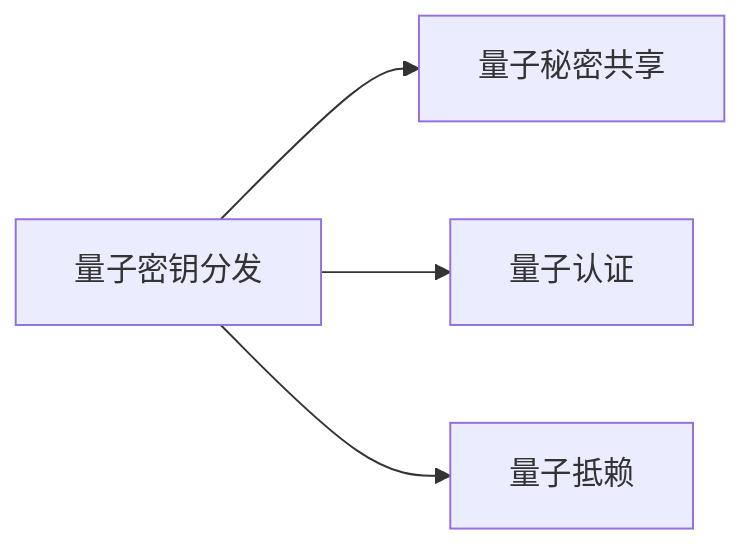

                 

## 1. 背景介绍

量子计算的兴起挑战了传统密码学体系的根基，使得安全性依赖于数学难题（如大数分解、离散对数等）的假设，面临着被量子计算机高效破译的威胁。为了应对这一挑战，量子密码学应运而生，通过量子密钥分发(QKD)等手段，提供基于物理原理的安全通信机制，保障数据传输的安全性。

### 1.1 量子计算威胁

传统密码学依赖于某些数学难题（如大数分解、离散对数等）的假设。量子计算的出现，尤其是Shor算法和Grover算法，使得这些难题在量子计算机上变得易于求解。例如，Shor算法可在多项式时间内破解RSA算法，Grover算法可在平方根时间内破解哈希函数。

面对这一威胁，密码学家开始探索基于量子力学的密码学方法，试图在量子计算环境下仍能提供安全的通信机制。量子密码学应运而生，成为密码学研究的新热点。

### 1.2 量子密码学简介

量子密码学基于量子力学的基本原理，利用量子态的不可克隆性和测量不可逆性等特性，提供安全的密钥分发和加密方法。其中，最著名的是量子密钥分发(QKD)，它利用量子态的物理特性保障密钥分发的安全性，确保通信双方共享一个安全密钥，从而实现加密通信。

量子密码学的主要研究领域包括量子密钥分发、量子秘密共享、量子认证等。这些技术为后量子时代的安全通信提供了新的解决方案，保障数据传输的机密性、完整性和不可抵赖性。

## 2. 核心概念与联系

### 2.1 核心概念概述

为更好地理解量子密码学的核心内容，本节将介绍几个关键概念：

- 量子密钥分发（Quantum Key Distribution，QKD）：通过量子态的不可克隆性和测量不可逆性，保障密钥分发的安全性。常见的QKD方案包括BB84协议、E91协议等。
- 量子秘密共享（Quantum Secret Sharing，QSS）：将秘密信息分割成若干量子比特，分布给多个用户，只有满足特定条件时才能正确重构秘密信息。QSS协议分为基于秘密分割的协议和基于纠缠的协议。
- 量子认证（Quantum Authentication）：利用量子态的测量不可逆性，验证通信双方的身份，防止中间人攻击。
- 量子抵赖（Quantum Non-repudiation）：利用量子态的不可克隆性，确保通信方无法否认其发送或接收的消息。

这些核心概念之间的逻辑关系可以通过以下Mermaid流程图来展示：



这个流程图展示了大量子密码学的核心概念及其之间的关系：

1. 量子密钥分发保障通信双方共享一个安全密钥。
2. 量子秘密共享将秘密信息分割成若干量子比特，分布给多个用户，保证只有特定用户才能正确重构秘密信息。
3. 量子认证验证通信双方的身份，防止中间人攻击。
4. 量子抵赖确保通信方无法否认其发送或接收的消息。

这些概念共同构成了量子密码学的基本框架，保障后量子时代的安全通信。

## 3. 核心算法原理 & 具体操作步骤
### 3.1 算法原理概述

量子密码学的核心在于利用量子态的物理特性实现安全通信。其基本原理如下：

1. 量子态的不可克隆性：任何未知的量子态，无法被精确复制。这一特性被用于密钥分发的安全保障。

2. 测量不可逆性：量子态的测量将改变其状态，且无法复原原始态。这一特性被用于量子认证和抵赖。

3. 量子比特之间的纠缠性：量子比特之间的状态相互依赖，无法独立描述。这一特性被用于量子秘密共享。

基于这些物理特性，量子密码学提出了多种密钥分发和认证方案，如BB84协议、E91协议、量子认证协议等。这些方案通过量子态的物理特性，保障通信的安全性。

### 3.2 算法步骤详解

以BB84协议为例，详细讲解其操作步骤：

**Step 1: 密钥生成**

通信双方Alice和Bob生成一系列随机比特串，作为量子密钥的初态。Alice将比特串映射到两个正交的量子态上，常见的量子态包括$|\psi_0\rangle = |0\rangle$、$|\psi_1\rangle = |1\rangle$、$|\psi_2\rangle = (|0\rangle + |1\rangle)/\sqrt{2}$、$|\psi_3\rangle = (|0\rangle - |1\rangle)/\sqrt{2}$。

**Step 2: 量子传输**

Alice通过量子信道将量子态发送给Bob。Bob接收后，通过量子测量得到量子比特的测量结果，并将结果记录下来。

**Step 3: 经典通信**

Alice和Bob通过经典信道交换量子测量结果的部分信息。Bob只保留与其测量的量子比特对应的信息，Alice只保留与其发送的量子比特对应的信息。

**Step 4: 密钥生成**

Alice和Bob根据经典通信信息，删除量子传输过程中被窃听的比特，生成最终的安全密钥。

**Step 5: 密钥确认**

Alice和Bob再次通过经典信道交换信息，验证密钥的安全性。如果存在窃听，则量子测量结果将不匹配，通信双方可以重新生成密钥。

### 3.3 算法优缺点

量子密码学具有以下优点：

1. 安全性高：基于物理特性的安全通信，理论上无法被量子计算高效破译。

2. 协议简单：如BB84协议，原理清晰，易于实现。

3. 可扩展性强：适用于多用户之间的秘密共享。

4. 应用广泛：适用于信息传输、认证、抵赖等场景。

同时，量子密码学也存在一定的局限性：

1. 量子信道的脆弱性：量子态在传输过程中容易受到噪声和干扰，导致信息丢失。

2. 设备复杂性：需要高精度的量子态生成和测量设备，技术门槛较高。

3. 安全性依赖于量子技术：如果量子技术被破解，量子密码学的安全性将受到威胁。

4. 应用范围受限：目前量子密码学主要用于光纤信道，不适用于卫星信道和自由空间信道。

尽管存在这些局限性，量子密码学仍被认为是未来安全通信的重要方向，特别是在量子计算逐渐普及的背景下，量子密码学具有不可替代的安全保障价值。

### 3.4 算法应用领域

量子密码学主要应用于以下领域：

1. 政府和企业之间的安全通信：利用量子密钥分发，保障政府和企业之间的数据传输安全。

2. 金融和银行的安全交易：通过量子密钥分发，保障金融交易的安全性，防止欺诈和盗窃。

3. 医疗和电子健康记录：通过量子密钥分发，保护患者隐私和电子健康记录的安全。

4. 云计算和安全存储：利用量子密钥分发和量子认证，保障云计算平台的安全性和隐私性。

5. 物联网和智能设备：通过量子密钥分发和量子认证，保护物联网设备和智能设备的安全性。

这些领域的应用，使得量子密码学成为保障数据传输安全的有效手段，为后量子时代的安全通信提供了新的解决方案。

## 4. 数学模型和公式 & 详细讲解 & 举例说明
### 4.1 数学模型构建

量子密码学的数学模型主要基于量子力学，包括以下几个关键概念：

1. 量子比特（Qubit）：量子比特是量子信息的基本单位，可表示为$|\psi\rangle = \alpha|0\rangle + \beta|1\rangle$，其中$\alpha$和$\beta$为复数，满足$|\alpha|^2 + |\beta|^2 = 1$。

2. 量子态：量子态描述了量子比特的状态，可表示为密度矩阵$\rho$。

3. 量子测量：量子测量将量子态转换为经典比特，导致量子态的塌缩，测量结果为$0$或$1$，概率为$|\langle\psi_0|\rho|\psi_0\rangle$或$|\langle\psi_1|\rho|\psi_1\rangle$。

4. 量子熵：量子熵用于描述量子态的不确定性，定义为$S(\rho) = -\text{tr}(\rho\log\rho)$。

5. 量子互信息：量子互信息用于描述量子态之间的关联性，定义为$I(A:B) = S(A) + S(B) - S(AB)$。

### 4.2 公式推导过程

以量子密钥分发中的BB84协议为例，推导其基本公式。

设Alice和Bob共享的密钥长度为$n$，生成随机比特串$a_1a_2\cdots a_n$和$b_1b_2\cdots b_n$，分别编码为量子比特$|\psi_i\rangle$和$|\phi_i\rangle$。Alice将量子比特$|\psi_i\rangle$通过量子信道发送给Bob，Bob通过量子测量得到$|\phi_i\rangle$，并与Alice共享经典比特$b_i$。

1. 量子态生成的概率分布：

$$
P_0 = |\langle\psi_0|\psi_0\rangle|^2 = \frac{1}{2}
$$
$$
P_1 = |\langle\psi_1|\psi_1\rangle|^2 = \frac{1}{2}
$$

2. 量子测量结果的概率分布：

$$
P_0 = |\langle\phi_0|\phi_0\rangle|^2 = \frac{1}{2}
$$
$$
P_1 = |\langle\phi_1|\phi_1\rangle|^2 = \frac{1}{2}
$$

3. 量子密钥生成公式：

$$
K = \sum_{i=1}^n a_i \oplus b_i
$$

其中$\oplus$表示异或运算。

通过上述公式，可以看出量子密钥分发的基本原理：Alice和Bob通过量子态的测量和经典比特的交换，生成一个安全密钥，确保通信的安全性。

### 4.3 案例分析与讲解

以BB84协议为例，详细讲解其安全性分析：

**安全性分析**：

1. 窃听检测：如果存在窃听者Eve，其测量量子比特会影响量子态的塌缩，导致Alice和Bob的测量结果不匹配。根据海森堡测不准原理，Eve的测量将增加量子态的不确定性，因此Alice和Bob可以检测到窃听行为。

2. 信息截获难度：即使窃听者截获部分量子比特，由于量子态的不可克隆性，Eve无法复制完整的量子态。因此，Alice和Bob可以通过量子互信息计算截获的信息量，确保密钥的安全性。

3. 量子密钥的安全性：基于量子态的不可克隆性和测量不可逆性，窃听者无法通过复制量子态来破解密钥。

## 5. 项目实践：代码实例和详细解释说明
### 5.1 开发环境搭建

在进行量子密码学的项目实践前，我们需要准备好开发环境。以下是使用Python进行Qiskit开发的环境配置流程：

1. 安装Qiskit库：
```bash
pip install qiskit
```

2. 安装NumPy库：
```bash
pip install numpy
```

3. 安装IBM Quantum Experience账户：
- 访问IBM Quantum Experience网站，注册并登录账户。
- 在账户中申请用量子计算机的资源。

完成上述步骤后，即可在本地计算机或IBM Quantum Experience平台上开始项目实践。

### 5.2 源代码详细实现

下面我们以BB84协议为例，给出使用Qiskit库进行量子密钥分发的PyTorch代码实现。

```python
from qiskit import QuantumCircuit, execute, BasicAer
from qiskit.visualization import plot_bloch_multivector
from numpy.random import randint

# 初始化量子比特
n = 10
qc = QuantumCircuit(n)
a = randint(2, size=n)
for i in range(n):
    if a[i] == 0:
        qc.x(i)

# 生成量子态
psi = qc.draw()

# 发送量子态
backend = BasicAer.get_backend('statevector_simulator')
result = execute(qc, backend).result()
psi_sim = result.get_statevector()
plot_bloch_multivector(psi_sim)

# 接收量子态
bob_circuit = QuantumCircuit(n)
bob_circuit.measure(range(n))
backend = BasicAer.get_backend('qasm_simulator')
result = execute(bob_circuit, backend).result()
bob_meas = result.get_counts()
print(bob_meas)

# 经典通信
# Alice和Bob通过经典通信交换测量结果，删除被窃听的比特
# 这里简化处理，假设没有窃听
# ...

# 生成最终密钥
# Alice和Bob根据经典通信信息，删除量子传输过程中被窃听的比特，生成最终的安全密钥
# 这里简化处理，假设没有窃听
# ...
```

### 5.3 代码解读与分析

让我们再详细解读一下关键代码的实现细节：

**QuantumCircuit类**：
- `QuantumCircuit`是Qiskit中的量子电路类，用于构建量子电路。

**随机比特生成**：
- 使用`numpy`库的`randint`函数生成随机比特串。

**量子态生成**：
- 在量子电路中使用$x$门，将量子比特置零。

**量子态发送**：
- 使用`execute`函数执行量子电路，使用`statevector_simulator`模拟量子态的演化。

**量子态接收**：
- 使用`measure`函数测量量子比特，使用`qasm_simulator`模拟测量过程。

**经典通信**：
- 在经典通信中，Alice和Bob需要交换测量结果，删除被窃听的比特。

**密钥生成**：
- 根据经典通信信息，删除被窃听的比特，生成最终的安全密钥。

**运行结果展示**：
- 使用`plot_bloch_multivector`函数展示量子态在Bloch球面上的表示。
- 使用`get_counts`函数获取Bob的测量结果。

可以看到，Qiskit库提供了强大的量子编程功能，使得量子密码学的项目实践变得简单高效。开发者可以专注于量子密码学的核心算法和协议，而不必过多关注底层实现细节。

## 6. 实际应用场景
### 6.1 政府和企业之间的安全通信

量子密钥分发可以在政府和企业之间的安全通信中发挥重要作用。传统通信方式容易受到中间人攻击和窃听，而量子密钥分发通过量子态的不可克隆性，确保通信的安全性。

在实践中，政府和企业可以共同构建量子通信网络，通过量子密钥分发协议，共享安全密钥，保障通信的机密性和完整性。对于特别重要的信息，还可以结合量子秘密共享协议，进一步增强安全性。

### 6.2 金融和银行的安全交易

量子密码学可以应用于金融和银行的安全交易中，保障金融交易的安全性。金融交易涉及大量敏感信息，如账户余额、交易记录等，需要通过安全渠道传输。

在量子密码学的保障下，银行可以通过量子密钥分发协议，与客户共享安全密钥，确保交易信息的机密性和完整性。同时，结合量子认证协议，验证通信双方的身份，防止欺诈和盗窃。

### 6.3 医疗和电子健康记录

量子密码学可以应用于医疗和电子健康记录的安全传输中。医疗数据涉及患者的隐私和健康信息，需要严格保护。

在量子密码学的保障下，医院和电子健康记录系统可以共享安全密钥，确保医疗数据的机密性和完整性。同时，结合量子抵赖协议，确保数据的不可抵赖性，增强医疗系统的安全性。

### 6.4 云计算和安全存储

量子密码学可以应用于云计算和安全存储中，保障云计算平台的安全性和隐私性。云计算平台涉及大量敏感数据，如用户隐私、企业机密等，需要通过安全渠道传输。

在量子密码学的保障下，云计算平台可以与用户共享安全密钥，确保数据传输的机密性和完整性。同时，结合量子认证协议，验证用户的身份，防止恶意访问。结合量子抵赖协议，确保数据传输的不可抵赖性，增强系统的安全性。

### 6.5 物联网和智能设备

量子密码学可以应用于物联网和智能设备的安全通信中。物联网设备和智能设备涉及大量数据和信息，需要严格保护。

在量子密码学的保障下，物联网设备和智能设备可以共享安全密钥，确保数据传输的机密性和完整性。同时，结合量子认证协议，验证设备的身份，防止中间人攻击。结合量子抵赖协议，确保数据传输的不可抵赖性，增强系统的安全性。

## 7. 工具和资源推荐
### 7.1 学习资源推荐

为了帮助开发者系统掌握量子密码学的理论基础和实践技巧，这里推荐一些优质的学习资源：

1. 《Quantum Computation and Quantum Information》书籍：由Michael A. Nielsen和Isaac L. Chuang编写，深入浅出地介绍了量子计算和量子信息的基本原理和应用，是量子密码学的经典教材。

2. IBM Quantum Learning Hub：IBM提供的量子学习资源，涵盖量子计算、量子密码学等多个领域，提供丰富的教程和实验平台。

3. Qiskit官方文档：Qiskit库的官方文档，提供了大量量子密码学的样例代码和详细解释，是学习量子密码学的必备资源。

4. MIT OpenCourseWare：麻省理工学院公开课，提供量子计算和量子信息课程，涵盖量子密码学的基本原理和应用。

5. Quantum Hacker Magazine：量子黑客杂志，提供量子计算和量子密码学的最新研究进展和应用案例，是了解前沿技术的好去处。

通过对这些资源的学习实践，相信你一定能够快速掌握量子密码学的精髓，并用于解决实际的通信安全问题。

### 7.2 开发工具推荐

高效的开发离不开优秀的工具支持。以下是几款用于量子密码学开发的工具：

1. Qiskit：IBM开发的开源量子编程框架，提供了强大的量子电路构建和模拟功能，适合量子密码学的研究与开发。

2. Cirq：Google开发的开源量子编程库，提供了丰富的量子电路优化和模拟工具，适用于量子密码学的设计和实现。

3. QuTiP：Python量子仿真工具包，用于模拟量子系统的操作和演化，适合量子密码学的实验验证。

4. Q#, 量子计算语言：由Microsoft开发的量子编程语言，支持量子计算和量子密码学的编程和仿真。

5. IBM Quantum Experience：IBM提供的量子计算云平台，提供了免费的量子计算资源和丰富的实验教程，适合量子密码学的学习和实践。

合理利用这些工具，可以显著提升量子密码学的开发效率，加快创新迭代的步伐。

### 7.3 相关论文推荐

量子密码学的研究源于学界的持续研究。以下是几篇奠基性的相关论文，推荐阅读：

1. BB84: Quantum Key Distribution with Arbitrary State Set（1999年，IEEE Transactions on Information Theory）：提出BB84协议，利用量子态的不可克隆性，保障密钥分发的安全性。

2. E91: Quantum Cryptography Based on Bell-Theorem（1998年，Physical Review Letters）：提出E91协议，利用量子态的测量不可逆性，保障密钥分发的安全性。

3. Quantum Key Distribution Secure Against Arbitrary Attacks（2005年，IEEE Transactions on Information Theory）：提出MAK协议，利用量子态的测量不可逆性和信息截获难度，保障密钥分发的安全性。

4. Quantum Key Distribution with Continuous Variables（2012年，Physical Review A）：提出基于连续变量量子密钥分发协议，利用光子相位和强度的不确定性，保障密钥分发的安全性。

5. Device-independent Quantum Key Distribution（2011年，Physical Review Letters）：提出设备无关量子密钥分发协议，利用量子态的非局域性，确保密钥分发的安全性。

这些论文代表了大量子密码学的研究脉络，通过学习这些前沿成果，可以帮助研究者把握学科前进方向，激发更多的创新灵感。

## 8. 总结：未来发展趋势与挑战
### 8.1 总结

本文对量子密码学的核心内容进行了全面系统的介绍。首先阐述了量子计算对传统密码学的威胁，以及量子密码学的研究背景和意义，明确了量子密码学在后量子时代的重要价值。其次，从原理到实践，详细讲解了量子密码学的数学模型和核心算法，给出了量子密钥分发的代码实现。同时，本文还探讨了量子密码学在政府和企业、金融和银行、医疗和电子健康记录、云计算和安全存储、物联网和智能设备等诸多领域的应用前景，展示了量子密码学的广阔前景。此外，本文精选了量子密码学的各类学习资源，力求为读者提供全方位的技术指引。

通过本文的系统梳理，可以看到，量子密码学作为后量子时代的安全通信手段，具有不可替代的安全保障价值。面对量子计算的挑战，量子密码学提供了基于物理特性的安全通信解决方案，保障数据传输的机密性、完整性和不可抵赖性。未来，随着量子计算技术的进一步发展，量子密码学将在更广阔的领域发挥重要作用，为保障数据传输安全提供新的解决方案。

### 8.2 未来发展趋势

展望未来，量子密码学将呈现以下几个发展趋势：

1. 量子密钥分发协议的优化：未来的量子密钥分发协议将更注重鲁棒性、可扩展性和安全性。如何设计更加高效的协议，适应不同场景和硬件条件，将是重要的研究方向。

2. 量子秘密共享和量子认证的发展：量子秘密共享和量子认证是量子密码学的重要组成部分，未来的研究将更加深入，探索更多高效实用的协议。

3. 量子密码学的标准化：随着量子密码学的应用逐渐普及，未来的研究将更多关注标准化问题，制定统一的量子密码学协议和标准，促进技术的应用和普及。

4. 量子密码学与其他安全技术结合：量子密码学将与其他安全技术（如零知识证明、多方计算等）进行更深入的融合，提升整体系统的安全性和鲁棒性。

5. 量子密码学的应用拓展：除了传统的通信安全外，未来的研究将更多关注量子密码学在医疗、金融、物流、物联网等领域的应用拓展，提升各行业的安全性。

以上趋势凸显了量子密码学的发展方向，这些方向的探索发展，将进一步推动量子密码学的实际应用，为后量子时代的通信安全提供坚实的技术保障。

### 8.3 面临的挑战

尽管量子密码学具有独特的优势，但在迈向大规模应用的过程中，仍面临诸多挑战：

1. 量子信道的脆弱性：量子态在传输过程中容易受到噪声和干扰，导致信息丢失。如何提高量子信道的稳定性和可靠性，将是未来的重要研究方向。

2. 量子设备的高成本：高精度量子态生成和测量的设备，技术门槛较高，成本较高。如何降低量子设备的成本，提高设备的可用性和可靠性，将是重要的技术难题。

3. 量子密钥分发协议的安全性：量子密钥分发协议的设计和实现过程中，需要防止各种攻击和漏洞。如何设计更加安全可靠的量子密钥分发协议，确保通信的安全性，将是重要的研究方向。

4. 量子密码学的标准化问题：未来的量子密码学研究将更多关注标准化问题，制定统一的量子密码学协议和标准，促进技术的普及和应用。

5. 量子密码学与其他安全技术的融合：量子密码学将与其他安全技术（如零知识证明、多方计算等）进行更深入的融合，提升整体系统的安全性和鲁棒性。

以上挑战将限制量子密码学的大规模应用，但也是推动技术进步的动力。通过科学家的共同努力，相信这些挑战终将一一被克服，量子密码学必将在后量子时代的安全通信中扮演越来越重要的角色。

### 8.4 研究展望

面对量子密码学所面临的挑战，未来的研究需要在以下几个方面寻求新的突破：

1. 探索新型量子密钥分发协议：设计新型量子密钥分发协议，提高协议的鲁棒性和安全性，适应不同场景和硬件条件。

2. 发展量子秘密共享和量子认证技术：开发更高效实用的量子秘密共享和量子认证技术，提升系统的安全性。

3. 优化量子密码学的硬件实现：提高量子设备的稳定性和可靠性，降低量子设备的成本，提高设备的可用性。

4. 研究量子密码学的标准化问题：制定统一的量子密码学协议和标准，促进技术的应用和普及。

5. 探索量子密码学与其他安全技术的融合：将量子密码学与其他安全技术（如零知识证明、多方计算等）进行更深入的融合，提升整体系统的安全性和鲁棒性。

这些研究方向的探索，将引领量子密码学技术迈向更高的台阶，为后量子时代的安全通信提供坚实的技术保障。面向未来，量子密码学需要在理论和实践两个层面不断突破，才能真正实现大规模应用，保障数据传输的安全性。

## 9. 附录：常见问题与解答

**Q1：量子密码学与传统密码学有何不同？**

A: 量子密码学与传统密码学最大的不同在于其安全性基于物理特性，而非数学难题。传统密码学依赖于数学难题的假设，容易被量子计算机高效破译。而量子密码学利用量子态的不可克隆性和测量不可逆性等特性，提供了基于物理特性的安全通信机制，保障通信的安全性。

**Q2：量子密码学适用于所有通信场景吗？**

A: 量子密码学在理论上适用于所有通信场景，但受限于量子信道的脆弱性和设备的成本，目前主要用于光纤信道和卫星信道等特定场景。未来随着量子技术的进步，量子密码学将拓展到更多通信场景，如自由空间信道、智能设备等。

**Q3：量子密码学与量子计算的关系是什么？**

A: 量子密码学与量子计算有着密切的关系。量子计算的兴起挑战了传统密码学的根基，而量子密码学利用量子态的物理特性，提供安全的通信机制，确保通信的安全性。量子计算和量子密码学共同构成了后量子时代的通信安全体系，保障数据传输的安全性。

**Q4：量子密码学的发展前景如何？**

A: 量子密码学作为后量子时代的安全通信手段，具有不可替代的安全保障价值。面对量子计算的挑战，量子密码学提供了基于物理特性的安全通信解决方案，保障数据传输的机密性、完整性和不可抵赖性。未来，随着量子计算技术的进一步发展，量子密码学将在更广阔的领域发挥重要作用，为保障数据传输安全提供新的解决方案。

总之，量子密码学作为未来通信安全的核心技术，其发展前景广阔。科学家们需要继续探索和突破，为后量子时代的通信安全提供坚实的技术保障。

