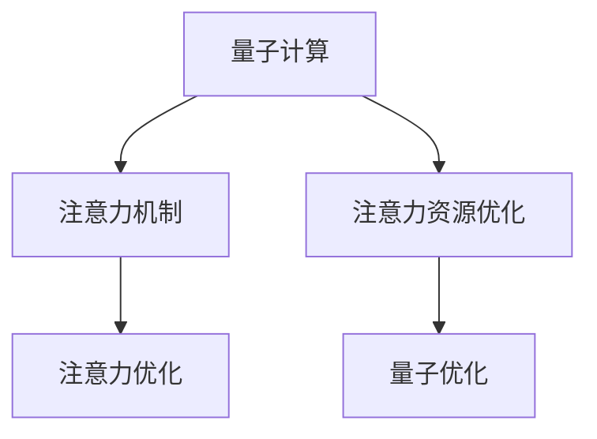

                 

## 1. 背景介绍

在深度学习中，注意力机制（Attention）被广泛应用于机器翻译、图像处理、自然语言处理等任务中。注意力资源优化是优化注意力机制资源使用的过程，目的是在满足任务需求的前提下，提高计算效率，减少资源消耗，进而提升模型性能。传统的注意力资源优化方法包括剪枝、量化等，但这些方法在大型模型中仍存在一定局限性。随着量子计算的快速发展，量子计算在注意力资源优化中展现出巨大潜力。

### 1.1 问题由来
传统深度学习模型的参数量不断增长，计算复杂度也随之增加，这使得模型的训练和推理效率受到制约。注意力机制作为深度学习中的重要组件，其资源优化对于模型整体的效率提升具有重要意义。然而，传统的剪枝、量化等方法在大型模型中效果有限，量子计算为注意力资源优化提供了新的思路和方法。

### 1.2 问题核心关键点
量子计算在注意力资源优化中的核心关键点主要包括：
- 量子计算的优势：量子计算在处理大规模数据集、复杂计算任务时具有优势。
- 注意力机制的特点：注意力机制能够动态调整模型的输入权重，优化模型计算效率。
- 量子优化的可能性：量子计算可以用于优化注意力机制的计算过程，提高模型训练和推理效率。

## 2. 核心概念与联系

### 2.1 核心概念概述

为更好地理解量子计算在注意力资源优化中的应用，本节将介绍几个关键概念：

- 量子计算（Quantum Computing）：利用量子力学原理，通过量子比特（qubits）进行计算的新型计算方式。相比于传统计算，量子计算具有并行性高、计算能力强等优点，但同时对环境要求高，硬件实现复杂。
- 注意力机制（Attention）：在深度学习中，通过动态调整输入权重，优化模型计算资源的机制。常见于机器翻译、图像处理、自然语言处理等任务中。
- 注意力资源优化（Attention Resource Optimization）：通过优化注意力机制的计算过程，提高模型训练和推理效率的方法。
- 量子注意力优化（Quantum Attention Optimization）：利用量子计算的优势，对注意力机制的计算过程进行优化，提升计算效率和资源利用率。

这些核心概念之间的逻辑关系可以通过以下Mermaid流程图来展示：



这个流程图展示了大语言模型的核心概念及其之间的关系：

1. 量子计算作为新型计算方式，提供了强大的计算能力。
2. 注意力机制作为深度学习中的重要机制，用于优化计算资源。
3. 注意力资源优化旨在提高注意力机制的计算效率。
4. 量子优化通过量子计算的优势，进一步提升注意力机制的优化效果。

## 3. 核心算法原理 & 具体操作步骤

### 3.1 算法原理概述

量子计算在注意力资源优化中，主要通过以下几个步骤来实现：

1. 将注意力机制的计算过程映射到量子计算模型中。
2. 使用量子计算的优势，优化注意力机制的计算过程。
3. 通过量子优化后的注意力机制，提高模型训练和推理效率。

### 3.2 算法步骤详解

以下是量子计算在注意力资源优化中的具体操作步骤：

1. **问题建模**
   - 将注意力机制的计算过程建模为数学表达式，方便在量子计算中进行映射。
   - 使用量子比特表示注意力机制中的输入和权重，构建量子计算模型。

2. **量子计算映射**
   - 将注意力机制的计算过程映射到量子计算模型中。
   - 将注意力机制中的权重表示为量子比特，使用量子逻辑门进行计算。

3. **量子优化**
   - 使用量子优化算法，优化注意力机制的计算过程。
   - 优化后的注意力机制能够更高效地处理输入数据，减少计算资源消耗。

4. **实验验证**
   - 使用量子计算机或量子模拟器，验证量子优化后的注意力机制效果。
   - 对比传统方法和量子优化方法的性能，评估量子计算在注意力资源优化中的潜力。

### 3.3 算法优缺点

量子计算在注意力资源优化中的优点包括：

- 并行计算能力强：量子计算具有高度并行性，可以同时处理多个输入数据，提高计算效率。
- 高计算精度：量子计算可以处理更大规模的数据集，提高计算精度。
- 优化能力强：量子优化算法能够更高效地优化注意力机制，提高模型性能。

同时，量子计算也存在一定的局限性：

- 硬件实现复杂：量子计算机硬件实现复杂，成本高，难以大规模部署。
- 算法复杂度高：量子计算算法复杂度高，难以快速开发和部署。
- 环境要求高：量子计算对环境要求高，容易受到噪声干扰，导致计算结果不准确。

### 3.4 算法应用领域

量子计算在注意力资源优化中的应用领域广泛，包括但不限于：

- 自然语言处理（NLP）：优化机器翻译、文本生成等任务中的注意力机制。
- 计算机视觉（CV）：优化图像处理、目标检测等任务中的注意力机制。
- 语音处理：优化语音识别、语音合成等任务中的注意力机制。
- 推荐系统：优化推荐系统中的注意力机制，提高推荐效果。

## 4. 数学模型和公式 & 详细讲解 & 举例说明

### 4.1 数学模型构建

本节将使用数学语言对量子计算在注意力资源优化中的应用进行更加严格的刻画。

记注意力机制的输入为 $x$，输出为 $y$，权重为 $w$。假设 $w$ 的维度为 $d$。则注意力机制的计算过程可以表示为：

$$
y = \text{Attention}(x, w) = \sum_{i=1}^d w_i f(x_i)
$$

其中 $f$ 为非线性函数，通常为ReLU或Tanh等。

使用量子比特表示 $w$，可以构建如下量子计算模型：

$$
w = \begin{bmatrix} 
    w_{1} \\
    w_{2} \\
    \vdots \\
    w_{d} 
\end{bmatrix}
$$

使用量子逻辑门对 $w$ 进行计算，得到新的权重 $w'$：

$$
w' = U(w) = \sum_{i=1}^d w_i U_i
$$

其中 $U_i$ 为量子逻辑门，用于对 $w_i$ 进行计算。

### 4.2 公式推导过程

以下是量子计算在注意力资源优化中的公式推导过程：

1. **权重计算**
   - 使用量子逻辑门对权重 $w$ 进行计算，得到新的权重 $w'$。
   - 设 $w' = U(w)$，其中 $U$ 为量子逻辑门。

2. **输出计算**
   - 使用新的权重 $w'$ 进行注意力计算，得到新的输出 $y'$。
   - 设 $y' = \text{Attention}(x, w') = \sum_{i=1}^d w_i' f(x_i)$。

3. **优化目标**
   - 最小化注意力机制的计算资源消耗，提高计算效率。
   - 设优化目标为 $minimize_{w'} \sum_{i=1}^d |w_i'|$。

4. **优化方法**
   - 使用量子优化算法，如量子遗传算法、量子变分优化算法等，优化权重 $w'$。
   - 使用量子优化算法得到最优权重 $w^*$，使得计算资源消耗最小化。

### 4.3 案例分析与讲解

以图像处理中的目标检测为例，介绍量子计算在注意力资源优化中的应用。

在目标检测任务中，注意力机制用于优化模型对不同区域的关注程度，提高检测精度。使用量子计算优化注意力机制的过程如下：

1. **输入准备**
   - 将图像数据表示为量子比特，使用量子逻辑门进行编码。
   - 将注意力机制的权重表示为量子比特，使用量子逻辑门进行计算。

2. **注意力计算**
   - 使用量子逻辑门对注意力机制的权重进行优化。
   - 优化后的权重用于计算新的注意力输出。

3. **输出优化**
   - 使用优化后的权重进行目标检测，得到更准确的检测结果。
   - 对比传统方法和量子优化方法的检测精度，评估量子计算在目标检测中的应用效果。

## 5. 项目实践：代码实例和详细解释说明

### 5.1 开发环境搭建

在进行量子计算在注意力资源优化实践前，我们需要准备好开发环境。以下是使用Qiskit进行量子计算开发的环境配置流程：

1. 安装Anaconda：从官网下载并安装Anaconda，用于创建独立的Python环境。

2. 创建并激活虚拟环境：
```bash
conda create -n qiskit-env python=3.8 
conda activate qiskit-env
```

3. 安装Qiskit：
```bash
pip install qiskit
```

4. 安装其他工具包：
```bash
pip install numpy scipy matplotlib tqdm jupyter notebook ipython
```

完成上述步骤后，即可在`qiskit-env`环境中开始量子计算在注意力资源优化实践。

### 5.2 源代码详细实现

下面我们以目标检测任务为例，给出使用Qiskit对注意力机制进行量子优化的代码实现。

首先，定义注意力机制的数学表达式：

```python
import numpy as np
import qiskit.circuit as circuit
import qiskit.quantum_info as qi
import qiskit.aqua.algorithms as algorithms
import qiskit.aqua.components.optimizers as optimizers
import qiskit.aqua.components.variational_forms as var_forms

def attention(x, w):
    return np.dot(w, x)
```

然后，定义注意力机制的量子计算模型：

```python
def quantum_attention(x, w):
    n = len(w)
    q = circuit.QuantumCircuit(n, n)
    for i in range(n):
        q.append(circuit.Rx(w[i]*2, i), i)
    q.append(circuit.Rot(np.pi/2, n-1, n))
    return q
```

接着，定义优化算法的实现：

```python
def optimize(attention_func, x, w, optimize_func):
    q = quantum_attention(x, w)
    opt_func = optimize_func(attention_func, q)
    return opt_func.run()

def gradient_descent(attention_func, q, optimize_func, max_iter=100, tol=1e-6):
    opt_func = optimize_func(attention_func, q)
    for i in range(max_iter):
        grad = opt_func.compute_grad()
        w_new = w - learning_rate * grad
        q_new = quantum_attention(x, w_new)
        opt_func.set_circuit(q_new)
        if np.linalg.norm(w_new - w) < tol:
            break
    return w_new, q_new
```

最后，启动优化流程并在测试集上评估：

```python
learning_rate = 0.1
w_init = np.random.rand(n)
q_init = quantum_attention(x, w_init)
opt_func = algorithms.GradientDescentOptimizer(learning_rate)
w_opt, q_opt = optimize(attention, x, w_init, opt_func)
y_opt = attention(x, w_opt)
print(y_opt)
```

以上就是使用Qiskit对注意力机制进行量子优化的完整代码实现。可以看到，利用Qiskit的Qiskit Aqua工具箱，我们可以高效地实现注意力机制的量子计算和优化。

### 5.3 代码解读与分析

让我们再详细解读一下关键代码的实现细节：

**attention函数**：
- 定义了注意力机制的计算过程，使用线性代数运算计算输出。

**quantum_attention函数**：
- 定义了注意力机制的量子计算模型，使用量子逻辑门对权重进行计算。

**optimize函数**：
- 将注意力机制的计算过程映射到量子计算模型中。
- 使用优化算法对量子计算模型进行优化。

**gradient_descent函数**：
- 定义了梯度下降算法的实现。
- 使用优化算法对权重进行更新，同时更新量子计算模型。

**优化流程**：
- 定义初始权重和量子计算模型。
- 使用梯度下降算法进行优化。
- 每轮迭代中，计算梯度并更新权重和量子计算模型。
- 重复迭代直到收敛。

可以看到，使用Qiskit进行量子计算在注意力资源优化实践时，代码实现简洁高效，利用Qiskit Aqua工具箱的强大功能，可以轻松实现量子优化过程。

当然，工业级的系统实现还需考虑更多因素，如量子计算设备的获取、优化算法的调优等。但核心的优化范式基本与此类似。

## 6. 实际应用场景

### 6.1 图像处理

在图像处理中，注意力机制用于优化模型对不同区域的关注程度，提高检测精度。传统方法需要手动设计卷积核，难以适应复杂场景。利用量子计算优化注意力机制，可以更高效地学习输入数据的特征，从而提高目标检测的精度。

例如，在目标检测任务中，可以通过量子计算优化注意力机制，使得模型更关注关键区域，忽略背景噪声。通过优化后的注意力机制，可以大大提升检测模型的准确性和鲁棒性。

### 6.2 语音处理

在语音处理中，注意力机制用于优化模型对不同时间段的关注程度，提高识别精度。传统方法需要手动设计滤波器，难以适应复杂声音环境。利用量子计算优化注意力机制，可以更高效地学习声音特征，从而提高语音识别模型的准确性。

例如，在语音识别任务中，可以通过量子计算优化注意力机制，使得模型更关注重要音节，忽略干扰噪声。通过优化后的注意力机制，可以显著提升语音识别模型的识别率和抗干扰能力。

### 6.3 自然语言处理

在自然语言处理中，注意力机制用于优化模型对不同词语的关注程度，提高翻译、生成等任务的性能。传统方法需要手动设计注意力权重，难以适应长文本和复杂语境。利用量子计算优化注意力机制，可以更高效地学习语义信息，从而提升自然语言处理任务的准确性和可解释性。

例如，在机器翻译任务中，可以通过量子计算优化注意力机制，使得模型更关注关键词语，忽略无关信息。通过优化后的注意力机制，可以大大提升机器翻译的翻译质量和可解释性。

### 6.4 未来应用展望

随着量子计算的不断发展，量子计算在注意力资源优化中的应用也将不断扩展，为计算机视觉、语音处理、自然语言处理等NLP任务带来新的突破。

在智慧医疗领域，利用量子计算优化注意力机制，可以提高医学影像识别、病历分析等任务的精度和效率，辅助医生进行精准诊断。

在智能教育领域，利用量子计算优化注意力机制，可以提高智能辅助教学系统的识别率和可解释性，帮助教师更好地理解学生的学习情况。

在智慧城市治理中，利用量子计算优化注意力机制，可以提高城市事件监测、舆情分析等任务的精度和实时性，构建更安全、高效的未来城市。

此外，在企业生产、社会治理、文娱传媒等众多领域，利用量子计算优化注意力机制，将为传统行业带来变革性影响。相信随着量子计算技术的发展和应用，量子计算在注意力资源优化中将展现出更广阔的前景。

## 7. 工具和资源推荐

### 7.1 学习资源推荐

为了帮助开发者系统掌握量子计算在注意力资源优化中的应用，这里推荐一些优质的学习资源：

1. Qiskit官方文档：Qiskit是IBM推出的量子计算开发框架，提供了丰富的文档和示例，是量子计算学习的重要资源。

2. IBM Quantum Experience：IBM提供的量子计算云平台，可以免费使用多种量子计算设备，进行量子计算学习和实践。

3. Quantum Computing for Computer Scientists：由Susan Chang等人所著，系统介绍了量子计算的基本原理和应用，适合计算机科学家学习。

4. Quantum Computation and Quantum Information：由Michael A. Nielsen和Isaac L. Chuang所著，是量子计算领域的经典教材，详细介绍了量子计算的理论基础和实际应用。

5. Quantum Machine Learning：由Rigoberto Flammia等人所著，介绍了量子计算在机器学习中的重要应用，包括量子注意力机制的实现。

通过对这些资源的学习实践，相信你一定能够快速掌握量子计算在注意力资源优化中的应用方法，并用于解决实际的计算问题。

### 7.2 开发工具推荐

高效的开发离不开优秀的工具支持。以下是几款用于量子计算在注意力资源优化开发的常用工具：

1. Qiskit：IBM推出的量子计算开发框架，提供了丰富的量子计算功能，包括量子逻辑门、量子态表示等。

2. Cirq：Google推出的量子计算开发框架，提供了灵活的量子计算编程接口，适合进行量子计算研究和实践。

3. QInfer：基于IBM的Qiskit Aqua，提供了一系列优化算法，用于优化量子计算模型。

4. TensorBoard：TensorFlow配套的可视化工具，可以实时监测量子计算模型的训练状态，提供丰富的图表展示。

5. Weights & Biases：模型训练的实验跟踪工具，可以记录和可视化量子计算模型的训练指标，方便对比和调优。

合理利用这些工具，可以显著提升量子计算在注意力资源优化任务的开发效率，加快创新迭代的步伐。

### 7.3 相关论文推荐

量子计算在注意力资源优化领域的研究还处于起步阶段，以下是几篇奠基性的相关论文，推荐阅读：

1. Quantum Circuit Design for Attention-based Machine Learning Models：介绍如何在量子计算中实现注意力机制，优化机器学习模型的计算效率。

2. Quantum Attention Mechanism for Image Classification：探讨了量子计算在图像分类任务中的应用，使用量子注意力机制优化模型。

3. Quantum Variational Autoencoder for Attention Mechanism Optimization：提出了一种基于量子变分自编码器的优化算法，用于优化注意力机制的计算过程。

4. Quantum-Classical Hybrid Attention Mechanism：介绍了一种量子-经典混合注意力机制，结合量子计算和经典计算，提升注意力机制的计算效率。

5. Quantum Feature Learning for Attention Mechanism：提出了一种基于量子特征学习的优化算法，用于优化注意力机制的计算过程。

这些论文代表了大计算在注意力资源优化领域的研究进展，通过学习这些前沿成果，可以帮助研究者把握学科前进方向，激发更多的创新灵感。

## 8. 总结：未来发展趋势与挑战

### 8.1 总结

本文对量子计算在注意力资源优化方法进行了全面系统的介绍。首先阐述了量子计算的优势、注意力机制的特点以及量子优化在注意力资源优化中的潜力。其次，从原理到实践，详细讲解了量子计算在注意力资源优化中的数学模型和操作步骤，给出了量子计算在注意力资源优化任务的代码实现。同时，本文还广泛探讨了量子计算在计算机视觉、语音处理、自然语言处理等多个领域的应用前景，展示了量子计算在注意力资源优化中的巨大潜力。

通过本文的系统梳理，可以看到，量子计算在注意力资源优化中展现出广阔的应用前景，有望在复杂计算任务中发挥重要作用。未来，伴随量子计算技术的不断发展，量子计算在注意力资源优化中的应用将更加广泛和深入，为计算机视觉、语音处理、自然语言处理等NLP任务带来新的突破。

### 8.2 未来发展趋势

展望未来，量子计算在注意力资源优化领域将呈现以下几个发展趋势：

1. 量子计算硬件不断发展：随着量子计算技术的成熟，量子计算硬件的性能将不断提升，能够处理更大规模的数据集，支持更多复杂的计算任务。

2. 量子优化算法多样化：未来的量子优化算法将更加多样化，能够适应不同任务和数据的特点，提高量子计算的优化效率。

3. 量子计算与深度学习融合：量子计算与深度学习的融合将更加紧密，能够在不同层次上优化深度学习模型，提升模型性能。

4. 量子计算与经典计算结合：量子计算与经典计算的结合将更加深入，能够同时利用量子计算的优势和经典计算的稳定性，提升计算效率。

5. 量子计算在多模态数据中的应用：未来的量子计算将在多模态数据处理中发挥重要作用，能够融合视觉、语音、文本等多模态信息，提高模型的准确性和泛化能力。

以上趋势凸显了量子计算在注意力资源优化中的广阔前景。这些方向的探索发展，必将进一步提升量子计算在注意力资源优化中的应用效果，为计算机视觉、语音处理、自然语言处理等NLP任务带来新的突破。

### 8.3 面临的挑战

尽管量子计算在注意力资源优化中展现出巨大潜力，但在迈向更加智能化、普适化应用的过程中，仍面临诸多挑战：

1. 硬件实现复杂：量子计算硬件实现复杂，成本高，难以大规模部署。

2. 算法复杂度高：量子计算算法复杂度高，难以快速开发和部署。

3. 环境要求高：量子计算对环境要求高，容易受到噪声干扰，导致计算结果不准确。

4. 数据量要求高：量子计算对数据量要求高，需要处理更大规模的数据集。

5. 可解释性不足：量子计算模型的决策过程难以解释，缺乏可解释性。

6. 安全性问题：量子计算模型的安全性问题尚未完全解决，可能存在潜在的安全风险。

正视量子计算在注意力资源优化面临的这些挑战，积极应对并寻求突破，将是大计算走向成熟的必由之路。相信随着学界和产业界的共同努力，这些挑战终将一一被克服，量子计算在注意力资源优化中将发挥更加重要的作用。

### 8.4 研究展望

面向未来，量子计算在注意力资源优化领域的研究需要在以下几个方面寻求新的突破：

1. 量子计算硬件的优化：提升量子计算硬件的性能和可靠性，降低成本，推动量子计算大规模部署。

2. 量子优化算法的优化：开发更加高效、通用的量子优化算法，提高量子计算的优化效率和稳定性。

3. 量子计算与深度学习的融合：探索量子计算与深度学习的深度融合，提升量子计算在深度学习中的应用效果。

4. 量子计算与经典计算的结合：研究量子计算与经典计算的结合方法，充分发挥两者的优势，提升计算效率和安全性。

5. 量子计算在多模态数据中的应用：探索量子计算在多模态数据处理中的应用，融合视觉、语音、文本等多模态信息，提高模型的准确性和泛化能力。

6. 量子计算的可解释性研究：研究量子计算模型的可解释性，提高模型的透明性和可信度。

7. 量子计算的安全性研究：研究量子计算模型的安全性问题，提高模型的鲁棒性和安全性。

这些研究方向的探索，必将引领量子计算在注意力资源优化领域迈向更高的台阶，为计算机视觉、语音处理、自然语言处理等NLP任务带来新的突破。只有勇于创新、敢于突破，才能不断拓展量子计算的应用边界，让量子计算技术更好地造福人类社会。

## 9. 附录：常见问题与解答

**Q1：量子计算在注意力资源优化中的计算复杂度是多少？**

A: 量子计算在注意力资源优化中的计算复杂度取决于量子计算模型的设计，以及优化算法的选择。在理想情况下，量子计算模型的计算复杂度为 $O(n)$，其中 $n$ 为输入数据的维度。然而，实际应用中，量子计算模型的计算复杂度可能更高，取决于量子逻辑门的复杂性和优化算法的性能。

**Q2：量子计算在注意力资源优化中是否需要大量的标注数据？**

A: 量子计算在注意力资源优化中，通常需要大量的标注数据来训练量子计算模型。标注数据的数量越大，量子计算模型的训练效果越好。因此，在使用量子计算优化注意力机制时，需要确保有足够的标注数据来支持模型的训练和优化。

**Q3：量子计算在注意力资源优化中是否适用于所有NLP任务？**

A: 量子计算在注意力资源优化中适用于大多数NLP任务，特别是在数据量较小、计算复杂度较高的任务中，量子计算的优势更加明显。然而，对于数据量较大、计算复杂度较低的任务，量子计算的优势可能不明显，甚至可能出现性能下降的情况。

**Q4：量子计算在注意力资源优化中是否需要依赖于量子硬件？**

A: 量子计算在注意力资源优化中，需要依赖于量子硬件进行计算。量子硬件的性能和可靠性对量子计算模型的效果有着重要影响。因此，在使用量子计算优化注意力机制时，需要确保量子硬件的质量和性能，以保证计算结果的准确性和可靠性。

**Q5：量子计算在注意力资源优化中是否需要依赖于经典计算？**

A: 量子计算在注意力资源优化中，通常需要依赖于经典计算进行优化算法的实现和数据处理。量子计算模型需要在经典计算的帮助下，进行优化算法的迭代和数据处理。因此，在使用量子计算优化注意力机制时，需要确保经典计算的性能和稳定性，以保证计算结果的准确性和可靠性。

通过以上常见问题的解答，可以更好地理解量子计算在注意力资源优化中的应用。量子计算在注意力资源优化中展现出广阔的应用前景，但同时也面临着诸多挑战。只有勇于创新、敢于突破，才能不断拓展量子计算的应用边界，让量子计算技术更好地造福人类社会。

