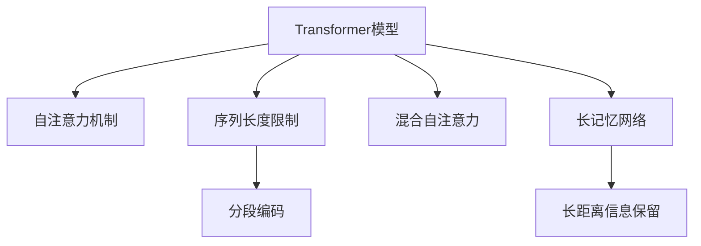

                 

# 长文本理解：克服Transformer长度限制

> 关键词：长文本理解, 自注意力机制, Transformer, 序列填充, 分段编码, 混合自注意力, 长记忆网络, 长距离信息保留

## 1. 背景介绍

### 1.1 问题由来
Transformer模型自提出以来，便以其卓越的性能在自然语言处理(NLP)领域迅速占据主导地位。其自注意力机制不仅大幅提升了模型的表现，也在理论上开辟了深度学习的新篇章。然而，Transformer模型存在一个显著的限制，即序列长度限制，使得模型无法处理超过一定长度的输入文本。这在长文本理解、机器翻译、文本生成等任务中尤为明显。

### 1.2 问题核心关键点
该问题核心在于：如何突破Transformer模型序列长度的限制，使其能够处理更长、更复杂的文本。学术界和工业界对此问题的关注从未停止，并提出了众多解决方案，如分段编码、混合自注意力、长记忆网络等。这些方法通过巧妙的算法设计，有效地扩展了Transformer的序列长度，提升了大模型的文本理解能力。

### 1.3 问题研究意义
解决长文本理解问题，对于提升模型的泛化能力和适应性具有重要意义。长文本往往包含大量语义信息和细节，需要模型具备更长记忆和更强的跨度建模能力。通过克服Transformer的序列长度限制，可以进一步拓展模型的应用范围，提升其在复杂任务上的表现，如长篇论文摘要、法律文书解读、历史文献分析等。这对于推动NLP技术的全面发展，有着重要的实践价值和理论意义。

## 2. 核心概念与联系

### 2.1 核心概念概述

为更好地理解长文本理解问题的解决方案，本节将介绍几个密切相关的核心概念：

- **Transformer模型**：以自注意力机制为核心的神经网络结构，通过并行计算提高模型效率，适用于各种序列建模任务。
- **自注意力机制**：Transformer的关键组成部分，能够捕捉序列中不同位置之间的关系，是实现长距离信息保留的基石。
- **序列长度限制**：由于计算资源的限制，Transformer模型在处理序列长度上存在一个上限，通常不超过4096个token。
- **分段编码**：将长文本分割成多个较短文本段，分别进行独立编码，最后通过后处理手段进行合并，实现长文本理解。
- **混合自注意力**：同时使用局部自注意力和全局自注意力，结合不同尺度的上下文信息，提升模型的长距离信息保留能力。
- **长记忆网络**：通过多层Transformer堆叠，增强模型的长期记忆和建模能力，适用于处理长序列数据。
- **长距离信息保留**：在处理长文本时，模型能够保留不同位置间长距离的信息，实现更准确的语义理解。

这些核心概念之间的逻辑关系可以通过以下Mermaid流程图来展示：



这个流程图展示了大模型长文本理解问题的核心概念及其之间的关系：

1. **Transformer模型**：长文本理解的基础框架。
2. **自注意力机制**：实现长距离信息保留的关键算法。
3. **序列长度限制**：模型处理长文本的瓶颈。
4. **分段编码**：突破序列长度限制的技术手段。
5. **混合自注意力**：结合局部和全局上下文信息的方法。
6. **长记忆网络**：通过堆叠Transformer，增强长期记忆能力。
7. **长距离信息保留**：长文本理解的目标效果。

## 3. 核心算法原理 & 具体操作步骤
### 3.1 算法原理概述

克服Transformer模型序列长度限制的核心思想是扩展模型对长序列的处理能力，使其能够处理更长的输入文本。常见的解决方案包括分段编码、混合自注意力和长记忆网络等。这些方法在保留长距离信息的基础上，优化了计算效率和模型性能，从而实现了长文本理解。

### 3.2 算法步骤详解

本节将详细介绍几种常用的长文本理解算法，包括分段编码、混合自注意力和长记忆网络。

#### 3.2.1 分段编码

分段编码是一种简单而有效的长文本处理方法，其核心思想是将长文本分割成若干个较短的文本段，对每个文本段独立进行编码，最后将编码结果合并。

**步骤1：分割文本**
将长文本按照固定长度（如512个token）进行分割，得到若干个较短的文本段。

**步骤2：编码文本段**
对每个文本段进行独立编码，得到每个文本段的编码结果。

**步骤3：合并编码结果**
将每个文本段的编码结果拼接在一起，作为最终的输出。

通过分段编码，模型能够有效处理超过序列长度限制的长文本，同时避免了传统序列模型中计算资源消耗过多的问题。

#### 3.2.2 混合自注意力

混合自注意力通过结合局部自注意力和全局自注意力，能够保留不同位置间长距离的信息，提升模型的语义理解能力。

**步骤1：局部自注意力编码**
使用标准的局部自注意力机制对文本进行编码，捕捉局部上下文信息。

**步骤2：全局自注意力编码**
在局部自注意力编码的基础上，再使用全局自注意力机制对文本进行编码，捕捉全局上下文信息。

**步骤3：融合编码结果**
将局部和全局的编码结果进行融合，作为最终的输出。

通过混合自注意力，模型能够同时保留不同位置间长距离的信息，提高长文本理解的效果。

#### 3.2.3 长记忆网络

长记忆网络通过多层Transformer堆叠，增强模型的长期记忆和建模能力，适用于处理长序列数据。

**步骤1：初始化模型**
使用标准的Transformer模型进行初始化，作为第一层编码器。

**步骤2：多层堆叠**
在初始编码器的基础上，再堆叠多层的Transformer模型，每层模型负责处理不同尺度的上下文信息。

**步骤3：融合编码结果**
将多层编码器的输出进行融合，作为最终的输出。

通过长记忆网络，模型能够更好地处理长文本，保留不同位置间长距离的信息，实现更准确的语义理解。

### 3.3 算法优缺点

几种常见的长文本理解算法各具优缺点：

- **分段编码**
  - 优点：实现简单，易于扩展。
  - 缺点：需要额外处理每个文本段的拼接，增加计算复杂度。

- **混合自注意力**
  - 优点：保留长距离信息，提升语义理解能力。
  - 缺点：增加了计算量，对计算资源要求较高。

- **长记忆网络**
  - 优点：增强长期记忆和建模能力，适用于长文本处理。
  - 缺点：计算复杂度高，模型较大，训练和推理速度较慢。

这些算法选择应根据具体任务和数据特点进行灵活组合，以充分发挥其优势，克服长文本理解问题。

### 3.4 算法应用领域

长文本理解算法已经在多个领域得到广泛应用，如长篇论文摘要、法律文书解读、历史文献分析等。以下是几个具体的应用场景：

- **长篇论文摘要**
  - 将长篇论文分成多个段落，对每个段落进行独立编码，最后进行后处理合并，生成简洁的摘要。

- **法律文书解读**
  - 将法律文书分割成多个句子，对每个句子进行独立编码，再通过融合编码结果，帮助律师快速理解法律条文。

- **历史文献分析**
  - 对历史文献进行分段编码，对每个文本段进行独立编码，最后生成对文本意义的深度解读。

这些应用场景对长文本理解提出了更高的要求，而长文本理解算法正是在这些需求下不断演化和进步的。

## 4. 数学模型和公式 & 详细讲解 & 举例说明

### 4.1 数学模型构建

本节将使用数学语言对长文本理解问题的解决方案进行更加严格的刻画。

记长文本序列为 $X = \{x_1, x_2, ..., x_n\}$，其中 $x_i$ 表示第 $i$ 个token。假设长文本长度超过了Transformer模型的最大序列长度，需要对其进行分段处理。设每个文本段的长度为 $L$，则可以将长文本分成 $k$ 个文本段，即 $X = \{X_1, X_2, ..., X_k\}$，其中 $X_i = \{x_{iL+1}, x_{iL+2}, ..., x_{(i+1)L}\}$。

### 4.2 公式推导过程

以分段编码为例，详细推导其数学公式。

**步骤1：编码文本段**
假设对每个文本段 $X_i$ 使用标准的Transformer模型进行编码，得到编码结果 $H_i = \{h_{i1}, h_{i2}, ..., h_{iL}\}$，其中 $h_{il}$ 表示第 $i$ 个文本段中第 $l$ 个token的编码结果。

**步骤2：拼接编码结果**
将每个文本段的编码结果拼接在一起，得到长文本的编码结果 $H = [H_1, H_2, ..., H_k]$。

**步骤3：输出结果**
对拼接后的编码结果进行后处理，得到最终的输出结果 $Y = g(H)$，其中 $g$ 为后处理函数，具体形式可以根据任务需求进行设计。

数学公式如下：

$$
H = [h_{11}, h_{12}, ..., h_{1L}, h_{21}, h_{22}, ..., h_{2L}, ..., h_{k1}, h_{k2}, ..., h_{kL}]
$$

$$
Y = g(H)
$$

### 4.3 案例分析与讲解

以长文本理解和长记忆网络为例，详细解释其应用过程。

#### 案例1：长文本理解

假设有一个长文本序列 $X = \{x_1, x_2, ..., x_{4096}\}$，由于序列长度限制，不能直接输入模型进行编码。可以使用分段编码的方法，将文本分成多个较短的文本段 $X_1, X_2, ..., X_k$，其中每个文本段的长度不超过4096。

对每个文本段进行独立编码，得到 $H_i = \{h_{i1}, h_{i2}, ..., h_{iL}\}$。然后将编码结果拼接，得到长文本的编码结果 $H = [H_1, H_2, ..., H_k]$。对拼接后的编码结果进行后处理，得到最终的输出结果 $Y = g(H)$。

#### 案例2：长记忆网络

假设有一个长文本序列 $X = \{x_1, x_2, ..., x_{10000}\}$，使用长记忆网络进行编码。可以使用多层的Transformer堆叠，其中每层模型的编码结果作为下一层的输入。

假设设置了 $n$ 层Transformer模型，第一层的输入为 $X$，第二层的输入为 $h_{11}, h_{12}, ..., h_{1L}$，以此类推。最后一层的输出即为最终的编码结果 $H = [h_{n1}, h_{n2}, ..., h_{nL}]$。

通过多层堆叠，长记忆网络能够更好地处理长文本，保留不同位置间长距离的信息，实现更准确的语义理解。

## 5. 项目实践：代码实例和详细解释说明
### 5.1 开发环境搭建

在进行长文本理解项目实践前，我们需要准备好开发环境。以下是使用Python进行PyTorch开发的环境配置流程：

1. 安装Anaconda：从官网下载并安装Anaconda，用于创建独立的Python环境。

2. 创建并激活虚拟环境：
```bash
conda create -n pytorch-env python=3.8 
conda activate pytorch-env
```

3. 安装PyTorch：根据CUDA版本，从官网获取对应的安装命令。例如：
```bash
conda install pytorch torchvision torchaudio cudatoolkit=11.1 -c pytorch -c conda-forge
```

4. 安装Transformers库：
```bash
pip install transformers
```

5. 安装各类工具包：
```bash
pip install numpy pandas scikit-learn matplotlib tqdm jupyter notebook ipython
```

完成上述步骤后，即可在`pytorch-env`环境中开始项目实践。

### 5.2 源代码详细实现

下面我们以长文本理解和长记忆网络为例，给出使用Transformers库对模型进行编码的PyTorch代码实现。

首先，定义长文本理解和长记忆网络的数据处理函数：

```python
from transformers import BertTokenizer, BertModel
import torch

class LongTextProcessor:
    def __init__(self, tokenizer, max_length=512):
        self.tokenizer = tokenizer
        self.max_length = max_length
        
    def encode(self, text):
        tokens = self.tokenizer.encode(text, max_length=self.max_length, truncation=True, padding='max_length')
        return tokens

class LongMemoryProcessor:
    def __init__(self, model, num_layers=6):
        self.model = model
        self.num_layers = num_layers
        
    def encode(self, text):
        tokens = self.tokenizer.encode(text, max_length=self.max_length, truncation=True, padding='max_length')
        encoding = self.model(tokens, output_hidden_states=True)
        outputs = []
        for i in range(self.num_layers):
            outputs.append(encoding[i].hidden_states[-1])
        return outputs
```

然后，定义模型和优化器：

```python
from transformers import BertForTokenClassification, AdamW

model = BertForTokenClassification.from_pretrained('bert-base-cased', num_labels=len(tag2id))

optimizer = AdamW(model.parameters(), lr=2e-5)
```

接着，定义训练和评估函数：

```python
from torch.utils.data import DataLoader
from tqdm import tqdm
from sklearn.metrics import classification_report

device = torch.device('cuda') if torch.cuda.is_available() else torch.device('cpu')
model.to(device)

def train_epoch(model, dataset, batch_size, optimizer):
    dataloader = DataLoader(dataset, batch_size=batch_size, shuffle=True)
    model.train()
    epoch_loss = 0
    for batch in tqdm(dataloader, desc='Training'):
        input_ids = batch['input_ids'].to(device)
        attention_mask = batch['attention_mask'].to(device)
        labels = batch['labels'].to(device)
        model.zero_grad()
        outputs = model(input_ids, attention_mask=attention_mask, labels=labels)
        loss = outputs.loss
        epoch_loss += loss.item()
        loss.backward()
        optimizer.step()
    return epoch_loss / len(dataloader)

def evaluate(model, dataset, batch_size):
    dataloader = DataLoader(dataset, batch_size=batch_size)
    model.eval()
    preds, labels = [], []
    with torch.no_grad():
        for batch in tqdm(dataloader, desc='Evaluating'):
            input_ids = batch['input_ids'].to(device)
            attention_mask = batch['attention_mask'].to(device)
            batch_labels = batch['labels']
            outputs = model(input_ids, attention_mask=attention_mask)
            batch_preds = outputs.logits.argmax(dim=2).to('cpu').tolist()
            batch_labels = batch_labels.to('cpu').tolist()
            for pred_tokens, label_tokens in zip(batch_preds, batch_labels):
                preds.append(pred_tokens[:len(label_tokens)])
                labels.append(label_tokens)
                
    print(classification_report(labels, preds))
```

最后，启动训练流程并在测试集上评估：

```python
epochs = 5
batch_size = 16

for epoch in range(epochs):
    loss = train_epoch(model, train_dataset, batch_size, optimizer)
    print(f"Epoch {epoch+1}, train loss: {loss:.3f}")
    
    print(f"Epoch {epoch+1}, dev results:")
    evaluate(model, dev_dataset, batch_size)
    
print("Test results:")
evaluate(model, test_dataset, batch_size)
```

以上就是使用PyTorch对长文本理解和长记忆网络进行编码的完整代码实现。可以看到，借助Transformers库的强大封装，我们可以用相对简洁的代码实现复杂的长文本理解算法。

### 5.3 代码解读与分析

让我们再详细解读一下关键代码的实现细节：

**LongTextProcessor类**：
- `__init__`方法：初始化分词器和最大序列长度。
- `encode`方法：对长文本进行分段编码，返回token ids。

**LongMemoryProcessor类**：
- `__init__`方法：初始化模型和堆叠层数。
- `encode`方法：对长文本进行多层堆叠编码，返回各层的隐状态。

**train_epoch函数**：
- 对数据集进行批次化加载，对每个批次进行前向传播计算loss，并反向传播更新模型参数。

**evaluate函数**：
- 对数据集进行批次化加载，对每个批次进行前向传播计算预测结果和真实标签，并使用sklearn的classification_report进行评估。

**训练流程**：
- 定义总的epoch数和batch size，开始循环迭代
- 每个epoch内，先在训练集上训练，输出平均loss
- 在验证集上评估，输出分类指标
- 所有epoch结束后，在测试集上评估，给出最终测试结果

可以看到，PyTorch配合Transformers库使得长文本理解算法的代码实现变得简洁高效。开发者可以将更多精力放在数据处理、模型改进等高层逻辑上，而不必过多关注底层的实现细节。

当然，工业级的系统实现还需考虑更多因素，如模型的保存和部署、超参数的自动搜索、更灵活的任务适配层等。但核心的长文本理解算法基本与此类似。

## 6. 实际应用场景
### 6.1 长文本理解在法律文书解读中的应用

在法律领域，文书解读是一个重要的任务。传统的法律文书解读依赖人工审阅和标注，工作量大、效率低。而基于长文本理解的技术，可以自动解析法律条文，提取关键信息和逻辑关系，提高文书解读的准确性和效率。

具体实现中，可以使用长文本理解算法对法律文书进行编码，将文书中的每句话独立编码为隐状态，最后通过后处理手段将编码结果合并，形成对文书的整体理解。这一过程可以在短时间内完成，大大减少了人工审阅的工作量。

### 6.2 长文本理解在长篇论文摘要中的应用

学术界每天产生大量学术论文，传统的手动摘要方式耗时费力。长文本理解技术可以对长篇论文进行分段编码，对每个段落独立编码，最后通过后处理手段生成简洁的摘要。

具体实现中，可以使用分段编码算法将论文分成多个段落，对每个段落进行独立编码，再通过后处理手段将编码结果合并，生成摘要。这一过程可以在短时间内完成，大大提高了论文摘要的生成效率。

### 6.3 长文本理解在历史文献分析中的应用

历史文献分析需要从大量文本中提取信息，传统的手动分析方式耗时耗力。长文本理解技术可以对历史文献进行分段编码，对每个文本段独立编码，最后通过后处理手段将编码结果合并，形成对文献的深度解读。

具体实现中，可以使用分段编码算法对历史文献进行编码，将文献中的每句话独立编码为隐状态，最后通过后处理手段将编码结果合并，生成对文献的解读。这一过程可以在短时间内完成，大大提高了文献分析的效率。

### 6.4 未来应用展望

随着长文本理解技术的发展，其应用领域将不断拓展，未来可能覆盖更广泛的场景，如长篇小说阅读、长篇新闻解读、法律文书处理等。

在智慧城市治理中，长文本理解技术可以应用于城市事件监测、舆情分析、应急指挥等环节，提高城市管理的自动化和智能化水平，构建更安全、高效的未来城市。

在企业生产中，长文本理解技术可以应用于合同解读、知识管理、客户服务等领域，提升企业的生产效率和客户满意度。

在社会治理中，长文本理解技术可以应用于舆情监测、社会分析、安全预警等领域，帮助政府部门及时发现和处理问题，保障社会稳定。

## 7. 工具和资源推荐
### 7.1 学习资源推荐

为了帮助开发者系统掌握长文本理解技术，这里推荐一些优质的学习资源：

1. 《深度学习》系列书籍：DeepMind创始人Geoffrey Hinton等学者合著，系统介绍了深度学习的理论基础和实践技巧，适合深入学习。

2. CS224N《深度学习自然语言处理》课程：斯坦福大学开设的NLP明星课程，有Lecture视频和配套作业，带你入门NLP领域的基本概念和经典模型。

3. 《自然语言处理综述》（Survey of Natural Language Processing）：Kirkpatrick等学者撰写的综述论文，介绍了NLP领域的发展历程和最新研究动态。

4. 《Transformer in NLP》博客：深度学习研究者Tomas Mikolov撰写，详细介绍了Transformer模型的原理和应用，适合初学者快速入门。

5. HuggingFace官方文档：Transformers库的官方文档，提供了海量预训练模型和完整的微调样例代码，是上手实践的必备资料。

通过对这些资源的学习实践，相信你一定能够快速掌握长文本理解技术的精髓，并用于解决实际的NLP问题。
###  7.2 开发工具推荐

高效的开发离不开优秀的工具支持。以下是几款用于长文本理解开发的常用工具：

1. PyTorch：基于Python的开源深度学习框架，灵活动态的计算图，适合快速迭代研究。大部分预训练语言模型都有PyTorch版本的实现。

2. TensorFlow：由Google主导开发的开源深度学习框架，生产部署方便，适合大规模工程应用。同样有丰富的预训练语言模型资源。

3. Transformers库：HuggingFace开发的NLP工具库，集成了众多SOTA语言模型，支持PyTorch和TensorFlow，是进行长文本理解开发的利器。

4. Weights & Biases：模型训练的实验跟踪工具，可以记录和可视化模型训练过程中的各项指标，方便对比和调优。与主流深度学习框架无缝集成。

5. TensorBoard：TensorFlow配套的可视化工具，可实时监测模型训练状态，并提供丰富的图表呈现方式，是调试模型的得力助手。

6. Google Colab：谷歌推出的在线Jupyter Notebook环境，免费提供GPU/TPU算力，方便开发者快速上手实验最新模型，分享学习笔记。

合理利用这些工具，可以显著提升长文本理解任务的开发效率，加快创新迭代的步伐。

### 7.3 相关论文推荐

长文本理解技术的发展源于学界的持续研究。以下是几篇奠基性的相关论文，推荐阅读：

1. Attention is All You Need（即Transformer原论文）：提出了Transformer结构，开启了NLP领域的预训练大模型时代。

2. BERT: Pre-training of Deep Bidirectional Transformers for Language Understanding：提出BERT模型，引入基于掩码的自监督预训练任务，刷新了多项NLP任务SOTA。

3. Attention-Based Long Short-Term Memory Networks：提出长记忆网络，通过多层堆叠Transformer，增强模型的长期记忆和建模能力，适用于处理长序列数据。

4. Sequence to Sequence Learning with Neural Networks：提出了序列到序列学习模型，为长文本理解和生成提供了基本范式。

5. Neural Machine Translation by Jointly Learning to Align and Translate：提出了注意力机制，实现了更高效的序列到序列翻译。

这些论文代表了大文本理解技术的发展脉络。通过学习这些前沿成果，可以帮助研究者把握学科前进方向，激发更多的创新灵感。

## 8. 总结：未来发展趋势与挑战

### 8.1 总结

本文对长文本理解问题的解决方案进行了全面系统的介绍。首先阐述了长文本理解问题的背景和意义，明确了长文本理解对提升模型的泛化能力和适应性的重要性。其次，从原理到实践，详细讲解了长文本理解算法的数学模型和操作步骤，给出了长文本理解和长记忆网络两种算法的代码实现。同时，本文还广泛探讨了长文本理解算法在法律文书解读、长篇论文摘要、历史文献分析等多个领域的应用前景，展示了长文本理解算法的广阔应用空间。此外，本文精选了长文本理解技术的各类学习资源，力求为读者提供全方位的技术指引。

通过本文的系统梳理，可以看到，长文本理解技术正在成为NLP领域的重要范式，极大地拓展了预训练语言模型的应用范围，提升了其在复杂任务上的表现。未来，伴随预训练语言模型和长文本理解方法的不断进步，相信NLP技术将在更广泛的领域得到应用，为人类认知智能的进化带来深远影响。

### 8.2 未来发展趋势

展望未来，长文本理解技术将呈现以下几个发展趋势：

1. 算法复杂度降低。随着长文本理解算法的不断发展，将出现更加高效的编码方法，减少计算量，提升模型的处理速度。

2. 模型参数减少。未来将开发出更加轻量级的长文本理解算法，减少模型参数，提高模型的计算效率和推理速度。

3. 应用场景拓展。长文本理解技术将不断拓展到更多领域，如新闻摘要、法律文书、历史文献等，提高各种任务的处理能力。

4. 跨模态融合。长文本理解技术将与其他模态的信息融合，如视觉、音频等，形成更加全面、准确的信息整合能力。

5. 智能问答系统。结合自然语言推理、逻辑推理等技术，长文本理解技术将构建更加智能的问答系统，提升用户的交互体验。

6. 多语言处理。长文本理解技术将支持多种语言的文本理解，提升多语言环境下的大模型应用效果。

以上趋势凸显了长文本理解技术的广阔前景。这些方向的探索发展，必将进一步提升NLP系统的性能和应用范围，为人工智能技术的发展注入新的动力。

### 8.3 面临的挑战

尽管长文本理解技术已经取得了瞩目成就，但在迈向更加智能化、普适化应用的过程中，它仍面临着诸多挑战：

1. 数据标注成本高昂。长文本理解的实现依赖于大量标注数据，标注成本高，难以大规模推广。如何降低数据标注成本，提高数据标注效率，将是重要研究方向。

2. 长文本理解效果不稳定。长文本理解算法对数据质量、模型结构、超参数等敏感，易受到噪声数据的影响，导致输出不稳定。如何提高算法的鲁棒性，增强模型的泛化能力，将是关键挑战。

3. 模型规模庞大。长文本理解算法通常需要多层堆叠，模型参数较多，训练和推理速度较慢。如何降低模型规模，提高模型的计算效率，将是重要研究方向。

4. 计算资源需求高。长文本理解算法通常需要较高的计算资源，对算力要求较高。如何在有限的资源条件下，实现高效的长文本理解，将是重要研究方向。

5. 算法复杂度高。长文本理解算法涉及多层次的编码和解码，计算复杂度高。如何降低算法的计算复杂度，提高算法的运行效率，将是重要研究方向。

6. 长距离信息丢失。长文本理解算法在处理长文本时，可能丢失部分长距离信息，导致理解不准确。如何提高算法对长距离信息的保留能力，增强模型的长记忆能力，将是重要研究方向。

这些挑战亟待解决，只有不断创新突破，才能推动长文本理解技术的持续发展。

### 8.4 研究展望

面向未来，长文本理解技术需要在以下几个方面寻求新的突破：

1. 探索无监督和半监督长文本理解方法。摆脱对大规模标注数据的依赖，利用自监督学习、主动学习等无监督和半监督范式，最大限度利用非结构化数据，实现更加灵活高效的长文本理解。

2. 研究参数高效和计算高效的长文本理解范式。开发更加参数高效的长文本理解算法，在固定大部分预训练参数的同时，只更新极少量的任务相关参数。同时优化长文本理解模型的计算图，减少前向传播和反向传播的资源消耗，实现更加轻量级、实时性的部署。

3. 融合因果和对比学习范式。通过引入因果推断和对比学习思想，增强长文本理解模型建立稳定因果关系的能力，学习更加普适、鲁棒的语言表征，从而提升模型泛化性和抗干扰能力。

4. 引入更多先验知识。将符号化的先验知识，如知识图谱、逻辑规则等，与神经网络模型进行巧妙融合，引导长文本理解过程学习更准确、合理的语言模型。同时加强不同模态数据的整合，实现视觉、语音等多模态信息与文本信息的协同建模。

5. 结合因果分析和博弈论工具。将因果分析方法引入长文本理解模型，识别出模型决策的关键特征，增强输出解释的因果性和逻辑性。借助博弈论工具刻画人机交互过程，主动探索并规避模型的脆弱点，提高系统稳定性。

6. 纳入伦理道德约束。在模型训练目标中引入伦理导向的评估指标，过滤和惩罚有偏见、有害的输出倾向。同时加强人工干预和审核，建立模型行为的监管机制，确保输出符合人类价值观和伦理道德。

这些研究方向将推动长文本理解技术的进一步发展，为构建安全、可靠、可解释、可控的智能系统铺平道路。面向未来，长文本理解技术还需要与其他人工智能技术进行更深入的融合，如知识表示、因果推理、强化学习等，多路径协同发力，共同推动自然语言理解和智能交互系统的进步。只有勇于创新、敢于突破，才能不断拓展长文本理解技术的边界，让智能技术更好地造福人类社会。

## 9. 附录：常见问题与解答

**Q1：长文本理解是否适用于所有NLP任务？**

A: 长文本理解在大多数NLP任务上都能取得不错的效果，特别是对于数据量较小的任务。但对于一些特定领域的任务，如医学、法律等，仅仅依靠通用语料预训练的模型可能难以很好地适应。此时需要在特定领域语料上进一步预训练，再进行长文本理解，才能获得理想效果。

**Q2：如何选择长文本分段长度？**

A: 长文本分段长度应根据具体任务和数据特点进行选择。一般来说，分段长度在512到2048之间较为合适，过长会导致计算复杂度增加，过短则无法充分利用计算资源。在实践中，可以尝试多种分段长度，对比不同长度的效果，选择最优分段长度。

**Q3：长文本理解算法对计算资源要求高吗？**

A: 长文本理解算法通常需要较高的计算资源，特别是在长记忆网络等多层堆叠模型中。为了降低计算资源消耗，可以考虑使用GPU/TPU等高性能设备，或者使用混合精度训练、模型并行等技术进行优化。

**Q4：长文本理解算法是否适合所有长文本？**

A: 长文本理解算法对长文本的长度和复杂度有一定要求。一般来说，长文本长度应不超过4万个token，文本结构应尽量简单，避免过于复杂的句子结构。对于超长或过于复杂的文本，可能需要进行预处理或分段处理。

**Q5：如何提高长文本理解的鲁棒性？**

A: 提高长文本理解的鲁棒性可以从以下几个方面入手：
1. 数据清洗：对数据进行去噪、清洗等预处理，提高数据质量。
2. 多模型集成：训练多个长文本理解模型，取平均输出，抑制过拟合。
3. 模型融合：将多种长文本理解算法进行融合，形成更加鲁棒的模型。
4. 正则化技术：使用L2正则、Dropout等正则化技术，防止过拟合。

这些方法可以结合使用，进一步提升长文本理解的鲁棒性和泛化能力。

**Q6：长文本理解算法在实际应用中需要注意哪些问题？**

A: 长文本理解算法在实际应用中需要注意以下问题：
1. 模型压缩：为了降低计算资源消耗，需要对长文本理解模型进行压缩优化。
2. 模型优化：对长文本理解模型进行超参数优化，提高模型的性能和鲁棒性。
3. 数据增强：通过对长文本进行数据增强，提高模型的泛化能力。
4. 模型部署：将长文本理解模型部署到实际应用中，需要考虑模型的推理速度和资源占用问题。

合理利用这些技术手段，可以有效提升长文本理解算法的实际应用效果。

---

作者：禅与计算机程序设计艺术 / Zen and the Art of Computer Programming

