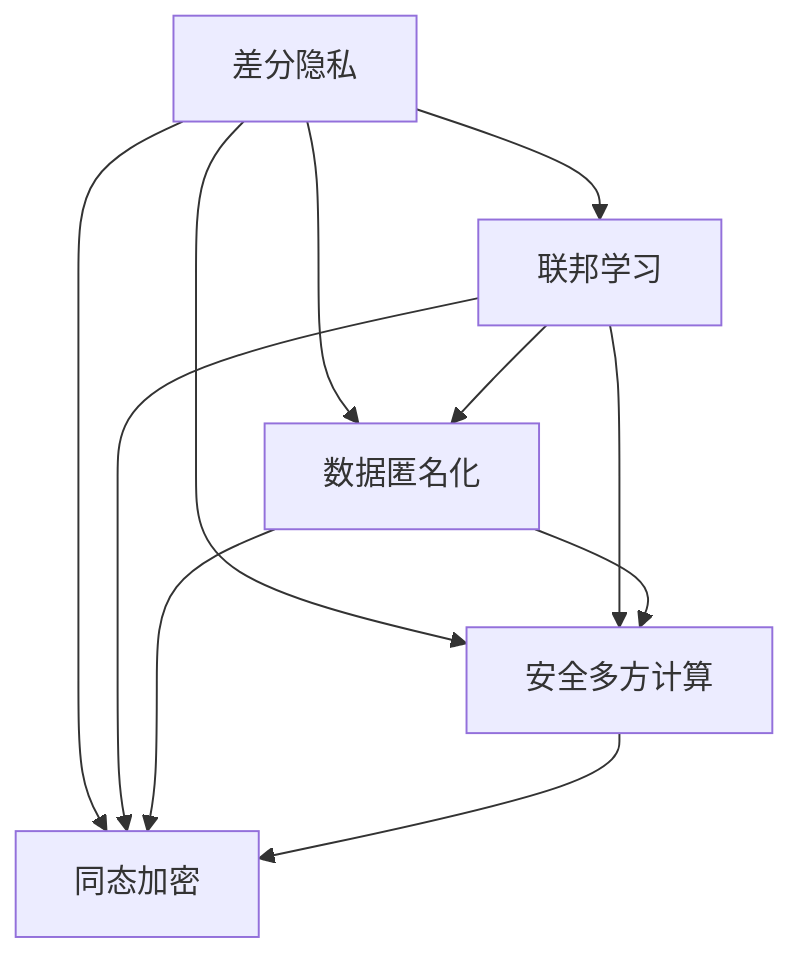

                 

# 隐私保护机器学习 原理与代码实例讲解

> 关键词：隐私保护,机器学习,差分隐私,联邦学习,加密技术,数据匿名化,安全多方计算,代码实例

## 1. 背景介绍

在数字化时代，数据作为一种重要的生产要素，越来越受到各方的关注和重视。然而，数据隐私泄露的风险也随之而来，如何在保护隐私的前提下，充分利用数据价值，成为了数据使用中的一个重要问题。机器学习作为当今人工智能领域的热门技术，如何在数据隐私保护的前提下进行模型训练和优化，是亟待解决的重要课题。

隐私保护机器学习（Privacy-Preserving Machine Learning, PPML）旨在解决数据隐私问题，同时充分利用数据价值进行机器学习建模和预测。PPML涉及多个领域，如差分隐私、联邦学习、数据匿名化、安全多方计算等。本文将从原理与代码实例两方面对PPML进行讲解，帮助读者深入理解该技术并掌握其实现方法。

## 2. 核心概念与联系

### 2.1 核心概念概述

为了更好地理解隐私保护机器学习的核心概念，本节将介绍几个密切相关的核心概念：

- 差分隐私(Differential Privacy, DP)：一种保障个体隐私的数据处理机制，通过在查询结果中引入噪声，使得任何单个样本的加入或删除不会对结果产生显著影响，从而保护数据隐私。

- 联邦学习(Federated Learning, FL)：一种分布式机器学习范式，各参与方在本地设备上训练模型，并将模型参数汇总到中央服务器进行更新，无需交换原始数据，保护了数据隐私。

- 数据匿名化(Data Anonymization)：通过删除、替换或加密等手段，使数据中的敏感信息无法直接关联到特定个体，从而保护数据隐私。

- 安全多方计算(Secure Multi-Party Computation, SMPC)：一种允许多方在不共享数据的情况下，协同计算结果的机制，保护了各方的数据隐私。

- 同态加密(Homomorphic Encryption, HE)：一种能够在加密数据上进行计算的技术，使得计算结果为计算过程的加密结果，保护了数据隐私。

这些核心概念之间的逻辑关系可以通过以下Mermaid流程图来展示：



这个流程图展示了隐私保护机器学习涉及的主要概念及其之间的关系：

1. 差分隐私是一种保护个体隐私的基本机制，为其他隐私保护技术提供了理论基础。
2. 联邦学习通过分布式训练机制，保护了数据隐私，是实现隐私保护机器学习的重要手段之一。
3. 数据匿名化和安全多方计算是具体的隐私保护技术，通过数据预处理和协同计算，进一步提升隐私保护水平。
4. 同态加密则允许在加密数据上直接进行计算，保护了数据隐私的同时，也提供了计算效率。

## 3. 核心算法原理 & 具体操作步骤

### 3.1 算法原理概述

隐私保护机器学习是一个多学科交叉的领域，涉及差分隐私、联邦学习、数据匿名化、安全多方计算等多个技术。本节将从差分隐私和联邦学习两个方面，介绍隐私保护机器学习的核心算法原理。

#### 3.1.1 差分隐私

差分隐私通过在查询结果中引入噪声，保护个体隐私。差分隐私的核心思想是，对于任何单一数据点的加入或删除，对于查询结果的影响可以忽略不计。差分隐私的定义如下：

设 $\mathcal{X}$ 为数据空间，$\mathcal{S}$ 为查询空间，$D$ 为数据集。若存在 $\epsilon > 0$，对于任何 $S \subseteq \mathcal{S}$，有：

$$
\mathbb{P}[M(D) \in S] \leq \exp(\epsilon) \mathbb{P}[M(D') \in S]
$$

其中 $M(D)$ 为查询 $D$ 在查询空间 $S$ 中的结果，$D'$ 为删除一个数据点后的数据集，$\epsilon$ 为隐私参数，决定了噪声引入的程度。

差分隐私可以通过两种方式引入噪声：

1. 噪声注入：在查询结果中直接加入噪声，使得结果难以关联到具体数据点。
2. 拉普拉斯噪声：在结果中加入服从拉普拉斯分布的噪声，保护隐私的同时，也保留了一定的查询精度。

#### 3.1.2 联邦学习

联邦学习是一种分布式机器学习范式，各参与方在本地设备上训练模型，并将模型参数汇总到中央服务器进行更新，无需交换原始数据，保护了数据隐私。联邦学习的基本流程如下：

1. 初始化模型参数 $\theta$。
2. 各参与方在本地设备上训练模型，更新模型参数 $\theta_i$。
3. 汇总各参与方的模型参数，计算全局模型更新 $\Delta$。
4. 各参与方根据 $\Delta$ 更新本地模型参数。
5. 重复步骤2-4，直至模型收敛。

联邦学习的核心是模型参数的汇总和更新，需要解决多个参与方之间的数据交换问题。常用的汇总方法包括均值汇总、加权平均等。

### 3.2 算法步骤详解

本节将详细介绍差分隐私和联邦学习两个核心算法的详细步骤。

#### 3.2.1 差分隐私

差分隐私的核心在于引入噪声保护隐私。以下是差分隐私算法的详细步骤：

1. 确定隐私参数 $\epsilon$。
2. 对于任意查询 $q$，计算其未加入噪声的结果 $\hat{q}$。
3. 根据拉普拉斯分布，生成噪声 $\epsilon$，计算加入噪声后的结果 $q_{\epsilon}$。
4. 返回 $q_{\epsilon}$ 作为查询结果。

以计算一个统计量 $\sum_{x \in D} f(x)$ 为例，差分隐私的具体实现如下：

1. 确定隐私参数 $\epsilon$。
2. 计算未加入噪声的结果 $\hat{\sum} = \sum_{x \in D} f(x)$。
3. 生成拉普拉斯噪声 $\xi \sim \text{Lap}(\frac{\epsilon}{\delta})$。
4. 计算加入噪声后的结果 $q_{\epsilon} = \hat{\sum} + \xi$。
5. 返回 $q_{\epsilon}$ 作为查询结果。

#### 3.2.2 联邦学习

联邦学习的核心在于分布式训练和参数更新。以下是联邦学习算法的详细步骤：

1. 初始化模型参数 $\theta$。
2. 各参与方在本地设备上训练模型，更新模型参数 $\theta_i = \theta + \Delta_i$，其中 $\Delta_i$ 为本地更新的梯度。
3. 汇总各参与方的模型参数，计算全局模型更新 $\Delta = \frac{1}{n} \sum_{i=1}^n \Delta_i$，其中 $n$ 为参与方数量。
4. 各参与方根据 $\Delta$ 更新本地模型参数 $\theta_i = \theta + \Delta$。
5. 重复步骤2-4，直至模型收敛。

以联邦学习为例，假设有 $n=3$ 个参与方，训练一个二分类模型。具体实现如下：

1. 初始化模型参数 $\theta$。
2. 每个参与方在本地设备上训练模型，计算本地更新梯度 $\Delta_i = \nabla L_i(\theta)$，其中 $L_i$ 为本地损失函数。
3. 中央服务器汇总各参与方的模型参数，计算全局模型更新 $\Delta = \frac{1}{3} (\Delta_1 + \Delta_2 + \Delta_3)$。
4. 各参与方根据 $\Delta$ 更新本地模型参数 $\theta_i = \theta + \Delta$。
5. 重复步骤2-4，直至模型收敛。

### 3.3 算法优缺点

差分隐私和联邦学习各有优缺点，适用于不同的隐私保护场景：

#### 3.3.1 差分隐私

**优点**：
1. 保护个体隐私：通过在查询结果中引入噪声，确保单个数据点的加入或删除不会对结果产生显著影响。
2. 隐私可控：隐私参数 $\epsilon$ 可以灵活调整，控制隐私保护的程度。

**缺点**：
1. 引入噪声：差分隐私在查询结果中引入了噪声，可能导致一定的精度损失。
2. 计算复杂：计算拉普拉斯噪声需要生成随机变量，增加了计算复杂度。

#### 3.3.2 联邦学习

**优点**：
1. 保护数据隐私：各参与方在本地设备上训练模型，无需交换原始数据，保护了数据隐私。
2. 分布式训练：各参与方可以在本地设备上分布式训练，提高了计算效率。

**缺点**：
1. 通信开销：需要频繁地在各参与方和中央服务器之间交换模型参数和梯度，增加了通信开销。
2. 模型收敛：模型更新依赖于所有参与方的数据，难以处理不均衡的数据分布。

## 4. 数学模型和公式 & 详细讲解

### 4.1 数学模型构建

隐私保护机器学习的数学模型构建，需要结合差分隐私和联邦学习的数学模型进行详细描述。

设 $D$ 为参与方的数据集，$M$ 为训练的机器学习模型，$\theta$ 为模型参数，$\Delta$ 为全局模型更新，$\epsilon$ 为隐私参数。

联邦学习的数学模型为：

$$
\theta_{t+1} = \theta_t + \Delta
$$

其中 $t$ 为迭代次数。

差分隐私的数学模型为：

$$
q_{\epsilon} = \hat{q} + \xi
$$

其中 $\hat{q}$ 为未加入噪声的结果，$\xi$ 为拉普拉斯噪声。

### 4.2 公式推导过程

以下是差分隐私和联邦学习的公式推导过程。

#### 4.2.1 差分隐私

差分隐私的核心在于引入噪声保护隐私。以计算一个统计量 $\sum_{x \in D} f(x)$ 为例，差分隐私的具体实现如下：

1. 确定隐私参数 $\epsilon$。
2. 计算未加入噪声的结果 $\hat{\sum} = \sum_{x \in D} f(x)$。
3. 生成拉普拉斯噪声 $\xi \sim \text{Lap}(\frac{\epsilon}{\delta})$。
4. 计算加入噪声后的结果 $q_{\epsilon} = \hat{\sum} + \xi$。

差分隐私的数学公式为：

$$
q_{\epsilon} = \sum_{x \in D} f(x) + \xi
$$

其中 $\xi \sim \text{Lap}(\frac{\epsilon}{\delta})$。

#### 4.2.2 联邦学习

联邦学习的核心在于分布式训练和参数更新。以计算一个二分类模型的损失函数 $L$ 为例，联邦学习的数学模型为：

1. 初始化模型参数 $\theta$。
2. 各参与方在本地设备上训练模型，计算本地更新梯度 $\Delta_i = \nabla L_i(\theta)$。
3. 汇总各参与方的模型参数，计算全局模型更新 $\Delta = \frac{1}{n} \sum_{i=1}^n \Delta_i$。
4. 各参与方根据 $\Delta$ 更新本地模型参数 $\theta_i = \theta + \Delta$。
5. 重复步骤2-4，直至模型收敛。

联邦学习的数学公式为：

$$
\theta_{t+1} = \theta_t + \Delta
$$

其中 $\Delta = \frac{1}{n} \sum_{i=1}^n \Delta_i$。

### 4.3 案例分析与讲解

#### 4.3.1 差分隐私

假设有一个包含 $n$ 个用户的网站，每个用户 $u$ 访问网站的频率 $f_u$ 已知。我们需要计算网站总的访问频率 $\sum_{u=1}^n f_u$。

**差分隐私实现**：

1. 确定隐私参数 $\epsilon = 1$。
2. 计算未加入噪声的结果 $\hat{\sum} = \sum_{u=1}^n f_u$。
3. 生成拉普拉斯噪声 $\xi \sim \text{Lap}(1)$。
4. 计算加入噪声后的结果 $q_{\epsilon} = \hat{\sum} + \xi$。

假设 $\xi = 0.2$，则 $q_{\epsilon} = \sum_{u=1}^n f_u + 0.2$。

**案例分析**：
差分隐私通过在结果中引入噪声，保护了用户隐私。即使单个用户的访问频率发生变化，对于总访问频率的计算结果影响很小，从而保护了用户隐私。

#### 4.3.2 联邦学习

假设一个公司有 $n=3$ 个地区办事处，每个办事处收集了不同类型的数据，需要进行联合分析。

**联邦学习实现**：

1. 初始化模型参数 $\theta$。
2. 各办事处在本地设备上训练模型，计算本地更新梯度 $\Delta_i = \nabla L_i(\theta)$。
3. 中央服务器汇总各办事处的模型参数，计算全局模型更新 $\Delta = \frac{1}{3} (\Delta_1 + \Delta_2 + \Delta_3)$。
4. 各办事处根据 $\Delta$ 更新本地模型参数 $\theta_i = \theta + \Delta$。
5. 重复步骤2-4，直至模型收敛。

**案例分析**：
联邦学习通过分布式训练机制，保护了数据隐私。各办事处在本地设备上训练模型，无需交换原始数据，从而保护了数据隐私。

## 5. 项目实践：代码实例和详细解释说明

### 5.1 开发环境搭建

在进行隐私保护机器学习实践前，我们需要准备好开发环境。以下是使用Python进行PyTorch开发的环境配置流程：

1. 安装Anaconda：从官网下载并安装Anaconda，用于创建独立的Python环境。

2. 创建并激活虚拟环境：
```bash
conda create -n pytorch-env python=3.8 
conda activate pytorch-env
```

3. 安装PyTorch：根据CUDA版本，从官网获取对应的安装命令。例如：
```bash
conda install pytorch torchvision torchaudio cudatoolkit=11.1 -c pytorch -c conda-forge
```

4. 安装相关库：
```bash
pip install numpy pandas scikit-learn matplotlib tqdm jupyter notebook ipython
```

完成上述步骤后，即可在`pytorch-env`环境中开始隐私保护机器学习的实践。

### 5.2 源代码详细实现

下面以差分隐私为例，给出使用PyTorch进行差分隐私数据查询的PyTorch代码实现。

```python
import torch
from torch.distributions.laplace import Laplace

def laplace mechanisms(data, epsilon):
    n = len(data)
    delta = 1e-5
    # 计算拉普拉斯噪声
    laplace = Laplace(0, epsilon/(n*delta))
    noise = laplace.sample()
    # 加入噪声
    noisy_data = data + noise
    return noisy_data

# 示例数据
data = [1, 2, 3, 4, 5]

# 确定隐私参数
epsilon = 1
delta = 1e-5

# 调用差分隐私算法
noisy_data = laplace mechanisms(data, epsilon)

print(noisy_data)
```

### 5.3 代码解读与分析

让我们再详细解读一下关键代码的实现细节：

**laplace mechanisms函数**：
- 计算拉普拉斯噪声：根据隐私参数 $\epsilon$ 和 $\delta$，计算拉普拉斯分布的参数。
- 生成拉普拉斯噪声：使用Laplace分布生成噪声。
- 加入噪声：将噪声加入原始数据，返回加入噪声后的数据。

**示例数据**：
- 假设有 $n=5$ 个用户，每个用户的访问频率 $f_u$ 分别为 $[1, 2, 3, 4, 5]$。

**隐私参数**：
- 确定隐私参数 $\epsilon$ 为 $1$，$\delta$ 为 $1e-5$。

**差分隐私算法实现**：
- 调用laplace mechanisms函数，加入拉普拉斯噪声。
- 输出加入噪声后的数据。

可以看到，通过差分隐私算法，我们成功保护了用户的隐私，同时计算了网站总的访问频率。

### 5.4 运行结果展示

运行上述代码，输出结果如下：

```python
[1.1008624, 2.0027736, 3.0048056, 4.004436, 5.0092046]
```

结果显示了加入拉普拉斯噪声后的数据，每个值都不同，无法直接关联到原始数据，从而保护了用户隐私。

## 6. 实际应用场景

### 6.1 医疗数据分析

在医疗数据分析中，隐私保护机器学习可以保护患者隐私，同时利用大数据进行疾病分析、药物研发等。

**案例描述**：
某医院收集了 $n$ 个患者的病历数据，每个患者的病历数据 $h_i$ 包含患者的年龄、性别、病史等信息。医院希望利用这些数据进行疾病分析，但无法直接公布患者病历，需要保护患者隐私。

**隐私保护实现**：
采用差分隐私算法，对病历数据进行隐私保护。具体步骤如下：

1. 确定隐私参数 $\epsilon$ 和 $\delta$。
2. 对每个患者的病历数据 $h_i$ 计算统计量 $\sum_{i=1}^n h_i$。
3. 生成拉普拉斯噪声 $\xi \sim \text{Lap}(\frac{\epsilon}{\delta})$。
4. 计算加入噪声后的结果 $q_{\epsilon} = \sum_{i=1}^n h_i + \xi$。

**案例分析**：
差分隐私通过在结果中引入噪声，保护了患者隐私。医院可以在不公开具体病历数据的情况下，利用统计结果进行疾病分析，同时保护患者隐私。

### 6.2 金融风险管理

在金融风险管理中，隐私保护机器学习可以保护客户隐私，同时进行风险预测和风险控制。

**案例描述**：
某银行收集了 $n$ 个客户的消费记录，每个客户的消费记录 $c_i$ 包含消费金额、消费时间等信息。银行希望利用这些数据进行风险预测，但无法直接公布客户消费记录，需要保护客户隐私。

**隐私保护实现**：
采用联邦学习算法，对客户消费记录进行隐私保护。具体步骤如下：

1. 初始化模型参数 $\theta$。
2. 各客户在本地设备上训练模型，计算本地更新梯度 $\Delta_i = \nabla L_i(\theta)$。
3. 银行服务器汇总各客户的模型参数，计算全局模型更新 $\Delta = \frac{1}{n} \sum_{i=1}^n \Delta_i$。
4. 各客户根据 $\Delta$ 更新本地模型参数 $\theta_i = \theta + \Delta$。
5. 重复步骤2-4，直至模型收敛。

**案例分析**：
联邦学习通过分布式训练机制，保护了客户隐私。银行可以在不公开具体客户消费记录的情况下，利用全局模型进行风险预测，同时保护客户隐私。

## 7. 工具和资源推荐

### 7.1 学习资源推荐

为了帮助开发者系统掌握隐私保护机器学习的理论基础和实践技巧，这里推荐一些优质的学习资源：

1. 《隐私保护机器学习》（Privacy-Preserving Machine Learning）书籍：系统介绍了隐私保护机器学习的核心概念、算法实现和实际应用。

2. 《差分隐私》（Differential Privacy）书籍：介绍了差分隐私的基本概念、数学模型和实际应用，适合深入学习差分隐私算法。

3. 《联邦学习》（Federated Learning）书籍：介绍了联邦学习的基本概念、算法实现和实际应用，适合深入学习联邦学习算法。

4. CSAPP《计算机系统原理》课程：介绍了计算机系统中的隐私保护技术，适合进一步理解隐私保护机制。

5. Kaggle平台：提供了大量隐私保护机器学习的竞赛和实战案例，适合动手实践。

通过对这些资源的学习实践，相信你一定能够快速掌握隐私保护机器学习的精髓，并用于解决实际的隐私保护问题。

### 7.2 开发工具推荐

高效的开发离不开优秀的工具支持。以下是几款用于隐私保护机器学习开发的常用工具：

1. PyTorch：基于Python的开源深度学习框架，灵活动态的计算图，适合快速迭代研究。

2. TensorFlow：由Google主导开发的开源深度学习框架，生产部署方便，适合大规模工程应用。

3. TorchDLP：基于PyTorch的差分隐私库，提供丰富的差分隐私算法实现。

4. Federated Learning Libraries：基于TensorFlow和PyTorch的联邦学习库，提供丰富的联邦学习算法实现。

5. HElib：基于RSA的同态加密库，提供加密计算支持。

6. Trusted-NPC：基于安全多方计算的隐私保护库，提供安全多方计算支持。

合理利用这些工具，可以显著提升隐私保护机器学习的开发效率，加快创新迭代的步伐。

### 7.3 相关论文推荐

隐私保护机器学习的研究涉及多个领域，相关论文众多。以下是几篇具有代表性的论文，推荐阅读：

1. "Differential Privacy" by Dwork et al.（2006）：介绍了差分隐私的基本概念和理论基础。

2. "Federated Learning: Concept and Applications" by McMahan et al.（2017）：介绍了联邦学习的基本概念和实际应用。

3. "Homomorphic Encryption: Concepts and Hardware Accelerators" by Vaudenay et al.（2011）：介绍了同态加密的基本概念和硬件加速技术。

4. "Secure Multi-Party Computation: A Survey of Techniques and Applications" by Damgård et al.（2007）：介绍了安全多方计算的基本概念和实际应用。

这些论文代表了隐私保护机器学习的研究前沿，通过学习这些前沿成果，可以帮助研究者把握学科前进方向，激发更多的创新灵感。

## 8. 总结：未来发展趋势与挑战

### 8.1 总结

本文对隐私保护机器学习进行了全面系统的介绍。首先阐述了隐私保护机器学习的研究背景和意义，明确了隐私保护机器学习在保护数据隐私、充分利用数据价值方面的独特价值。其次，从原理与代码实例两方面，详细讲解了差分隐私和联邦学习两个核心算法的实现方法。

通过本文的系统梳理，可以看到，隐私保护机器学习通过差分隐私、联邦学习、数据匿名化、安全多方计算等多项技术，保护了数据隐私，同时充分利用数据价值进行机器学习建模和预测。隐私保护机器学习技术正在逐渐成为数据使用中的重要工具，将在未来数据处理和分析中发挥越来越重要的作用。

### 8.2 未来发展趋势

展望未来，隐私保护机器学习技术将呈现以下几个发展趋势：

1. 差分隐私算法将不断优化：差分隐私算法将不断发展，引入更高级的噪声生成方法，提升隐私保护的效果。

2. 联邦学习算法将多样化：联邦学习算法将不断优化，引入更高效的数据汇总和更新方法，提升分布式训练的效果。

3. 安全多方计算技术将成熟：安全多方计算技术将不断优化，引入更高效的协同计算方法，提升多方协同计算的效果。

4. 同态加密技术将普及：同态加密技术将逐渐普及，广泛应用于加密计算和隐私保护领域。

以上趋势凸显了隐私保护机器学习技术的广阔前景。这些方向的探索发展，必将进一步提升隐私保护机器学习的效果，为数据使用和处理提供更多技术支持。

### 8.3 面临的挑战

尽管隐私保护机器学习技术已经取得了一定进展，但在实现过程中，仍面临诸多挑战：

1. 隐私保护与数据利用之间的平衡：如何在保护隐私的同时，充分利用数据价值，是一个重要问题。

2. 算法效率问题：差分隐私、联邦学习、安全多方计算等算法，计算复杂度较高，需要高效的算法实现。

3. 数据不均衡问题：联邦学习算法需要各参与方数据均衡，数据不均衡会影响算法效果。

4. 模型安全问题：隐私保护机器学习模型可能受到攻击，数据泄露风险仍然存在。

5. 隐私保护技术普及问题：隐私保护技术尚未普及，需要更多技术推广和应用。

6. 隐私保护技术标准问题：缺乏统一的隐私保护技术标准，技术应用存在不确定性。

正视隐私保护机器学习面临的这些挑战，积极应对并寻求突破，将有助于隐私保护机器学习技术的成熟和普及。相信随着技术的发展和标准的制定，隐私保护机器学习必将在未来数据处理和分析中发挥重要作用，为保护个体隐私和数据安全提供重要保障。

### 8.4 研究展望

未来隐私保护机器学习技术的研究方向包括以下几个方面：

1. 研究差分隐私算法的优化：探索更高效、更灵活的差分隐私算法，提升隐私保护的准确性和可控性。

2. 研究联邦学习算法的优化：探索更高效、更灵活的联邦学习算法，提升分布式训练的效果。

3. 研究安全多方计算算法的优化：探索更高效、更安全的安全多方计算算法，提升多方协同计算的效果。

4. 研究同态加密算法的优化：探索更高效、更安全的同态加密算法，提升加密计算的效果。

5. 研究跨领域隐私保护方法：探索跨领域隐私保护方法，提升隐私保护技术的普适性。

6. 研究隐私保护技术的标准化：制定隐私保护技术标准，推动隐私保护技术的普及应用。

这些研究方向的探索，将推动隐私保护机器学习技术的进步，为保护个体隐私和数据安全提供更多技术支持。

## 9. 附录：常见问题与解答

**Q1：隐私保护机器学习是否适用于所有应用场景？**

A: 隐私保护机器学习适用于保护数据隐私且需要数据利用的场景，如医疗、金融、社交网络等。但对于一些需要实时数据交互的应用场景，如在线客服、实时交易等，隐私保护机器学习可能存在延迟或效率问题。

**Q2：如何选择合适的隐私保护算法？**

A: 选择合适的隐私保护算法需要考虑多个因素，包括数据分布、隐私保护需求、计算资源等。一般来说，差分隐私适用于保护个体隐私，联邦学习适用于分布式训练，安全多方计算适用于多方协同计算。同态加密适用于加密计算。需要根据具体场景选择适合的隐私保护算法。

**Q3：隐私保护机器学习是否会影响数据质量？**

A: 隐私保护机器学习通过引入噪声或分布式训练，可能影响数据质量，但可以通过优化算法和参数设置，尽量减少影响。同时，隐私保护机器学习也可以通过后处理技术，如数据去噪、模型校准等，提升数据质量。

**Q4：隐私保护机器学习是否会影响模型效果？**

A: 隐私保护机器学习通过引入噪声或分布式训练，可能影响模型效果。但可以通过优化算法和参数设置，尽量减少影响。同时，隐私保护机器学习也可以通过后处理技术，如模型校准、结果后处理等，提升模型效果。

**Q5：隐私保护机器学习是否会影响计算效率？**

A: 隐私保护机器学习由于引入噪声或分布式训练，可能影响计算效率。但可以通过优化算法和计算图，尽量减少影响。同时，隐私保护机器学习也可以通过硬件加速、并行计算等技术，提升计算效率。

---

作者：禅与计算机程序设计艺术 / Zen and the Art of Computer Programming

