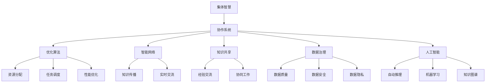

                 

# 集体智慧：探索解决复杂问题的创新路径

> 关键词：集体智慧、创新路径、复杂问题、协作系统、优化算法、智能网络、知识共享、数据治理、人工智能、深度学习

## 1. 背景介绍

在当今这个快速变化、信息爆炸的时代，人类面临的挑战和问题日益复杂。从气候变化、资源短缺、公共卫生，到经济不平等、社会动荡、全球化问题，每一个领域都存在着诸多不确定性和矛盾。解决这些复杂问题，单靠个体的力量显然是不够的，更需要集体的智慧和协作。近年来，随着互联网、大数据、云计算、人工智能等技术的不断进步，我们有机会构建更加开放、协作、智能的集体智慧系统，从根本上提升人类的决策能力和解决问题的效率。本文将系统介绍如何利用这些先进技术，探索解决复杂问题的创新路径，并结合实际案例，展示集体智慧在多个领域的应用。

## 2. 核心概念与联系

### 2.1 核心概念概述

为更好地理解如何通过集体智慧解决复杂问题，本节将介绍几个核心概念：

- **集体智慧**：指通过大规模协作系统，整合人类、机器的智慧，共同解决复杂问题的过程。集体智慧系统通常由分布式计算平台、协作工具、智能算法等组成，支持知识的共享、交流和协作。

- **协作系统**：构建集体智慧的基础设施，包括知识管理平台、协作平台、决策支持系统等。通过这些系统，不同背景、经验的人可以协同工作，共享知识，进行创新。

- **优化算法**：用于解决集体智慧系统中的优化问题，如资源分配、任务调度、性能优化等。常见优化算法包括遗传算法、粒子群算法、蚁群算法、深度强化学习等。

- **智能网络**：指通过先进通信技术构建的、智能化的信息网络，支持知识的快速传播、共享和协同。智能网络使得不同地域、不同背景的人可以实时交流，形成协同工作的高效平台。

- **知识共享**：指通过协作系统促进知识、信息、经验的交流和共享。知识共享是集体智慧的核心，它让不同领域的专家能够相互学习，共同提升解决问题的能力。

- **数据治理**：指对数据源、数据处理、数据分析、数据共享等环节进行规范化管理，确保数据的质量、安全、隐私。数据治理是集体智慧系统的关键，它支撑了高质量的决策和分析。

- **人工智能**：指通过算法和模型，模拟人类智能行为的系统。人工智能技术在集体智慧系统中扮演了重要的角色，如自动推理、机器学习、知识图谱等，使得复杂的决策和分析变得更加高效和精准。

这些核心概念之间的逻辑关系可以通过以下Mermaid流程图来展示：



这个流程图展示了几大核心概念及其之间的关系：

1. 集体智慧系统由协作系统、智能网络、优化算法、人工智能等组件构成，共同实现知识的共享和协同。
2. 协作系统提供平台和工具，支持分布式计算和智能算法，促进知识的交流和共享。
3. 优化算法用于解决资源分配、任务调度等问题，提升系统的整体效率。
4. 智能网络实现知识的高速传播和实时交流，支持协同工作的展开。
5. 知识共享、数据治理和人工智能是集体智慧系统的关键支撑，确保知识的高质量、安全和隐私。

这些概念共同构成了集体智慧系统的基本框架，为其在各个领域的应用提供了坚实的基础。

## 3. 核心算法原理 & 具体操作步骤

### 3.1 算法原理概述

集体智慧系统的核心在于通过协作平台、智能算法等手段，整合和优化人类、机器的智慧，解决复杂问题。该过程一般包括以下几个关键步骤：

1. **数据收集**：从多个渠道收集问题的相关信息，包括数据、文本、图像、视频等。
2. **数据预处理**：清洗、标注数据，进行特征提取和转换，为后续分析做好准备。
3. **协同决策**：通过协作系统，让专家、研究人员、技术人员等多方参与，共同分析和讨论问题。
4. **智能分析**：利用人工智能算法进行数据建模和分析，提出多种解决方案。
5. **优化选择**：通过优化算法，从多种方案中选出最优的解决方案，并进行实施。

### 3.2 算法步骤详解

以下是集体智慧系统的一般流程，包括具体的操作方法：

**Step 1: 数据收集与预处理**

1. **数据来源**：确定问题的数据来源，可以是公开数据库、文献、调查问卷等。
2. **数据收集**：利用爬虫、API等方式自动或手动收集数据。
3. **数据清洗**：去除重复、缺失、噪声等数据，确保数据质量。
4. **特征提取**：提取与问题相关的特征，如关键词、时间戳、地理位置等。
5. **数据转换**：将数据转换为统一的格式，如数值型、时间序列等，便于后续分析。

**Step 2: 协同决策与智能分析**

1. **构建协作平台**：选择或搭建支持协同工作的平台，如Slack、Zoom、JIRA等。
2. **问题定义**：明确问题的目标、范围和关键点，确保所有参与者对问题的理解一致。
3. **讨论与分析**：通过在线讨论、会议、脑图等方式，集思广益，探讨解决方案。
4. **模型训练**：利用人工智能算法，如机器学习、深度学习等，训练预测模型。
5. **结果分析**：分析模型预测结果，生成多个方案，并进行效果评估。

**Step 3: 优化选择与实施**

1. **方案比较**：通过优化算法，如遗传算法、蚁群算法等，从多个方案中选出最优的方案。
2. **风险评估**：评估方案的风险和影响，确定实施计划。
3. **实施方案**：分阶段、分步骤实施方案，确保每个环节的质量和进度。
4. **效果监控**：通过指标监控、反馈机制等方式，实时监控方案的效果，并进行调整。

### 3.3 算法优缺点

集体智慧系统的优点包括：

1. **高效性**：利用智能算法和协同平台，可以快速整合和分析海量数据，生成多种解决方案。
2. **准确性**：通过多领域的专家参与和智能分析，可以提出更加全面和准确的解决方案。
3. **创新性**：打破传统思维定势，通过跨领域、跨学科的协作，激发新的创意和创新。

但集体智慧系统也存在一些局限性：

1. **沟通成本**：多方协作需要沟通和协调，可能会增加工作量和时间成本。
2. **信息过载**：大量数据和信息可能会让人感到信息过载，影响决策效率。
3. **技术门槛**：需要一定的技术背景和专业知识，对普通用户不够友好。
4. **数据隐私**：不同来源的数据可能涉及隐私和敏感信息，需要严格的数据治理措施。
5. **实施难度**：方案的实施可能面临资源、技术、人力等方面的限制，需要综合考虑。

### 3.4 算法应用领域

集体智慧系统已经在多个领域得到了广泛的应用，涵盖了从科学研究到公共管理、从商业决策到医疗健康等多个方面：

- **科学研究**：在气候变化、疾病研究、基因编辑等领域，通过整合全球科学家的数据和智慧，推进科研项目的开展。
- **公共管理**：在城市规划、公共安全、环境保护等方面，利用智能网络和协同系统，优化政策制定和资源分配。
- **商业决策**：在市场营销、供应链管理、金融投资等领域，通过数据分析和专家协作，提升决策的科学性和效率。
- **医疗健康**：在疾病诊断、药物研发、医疗资源调度等方面，利用人工智能和知识共享，提高医疗服务的质量和效率。
- **环境保护**：在生态监测、污染治理、气候变化应对等方面，通过数据分析和专家协作，制定和实施环保政策。
- **社会治理**：在社区管理、公共服务、灾害应对等方面，利用智能网络和协作系统，提高社会治理的智能化水平。

这些应用案例展示了集体智慧系统的强大潜力和广泛适用性，为各个领域的决策和问题解决提供了新的思路和方法。

## 4. 数学模型和公式 & 详细讲解 & 举例说明

### 4.1 数学模型构建

为更好地理解集体智慧系统的运作机制，我们构建一个数学模型来描述该过程。

设问题 $P$ 包含 $n$ 个变量 $x_1, x_2, \cdots, x_n$，目标是找到最优解 $x^*$ 使得目标函数 $f(x)$ 最小化。

假设每个专家 $i$ 给出的解为 $x_i$，其权重为 $w_i$，则专家集成的解为：

$$
x = \sum_{i=1}^n w_i x_i
$$

其中 $w_i$ 为专家 $i$ 的权重，通常基于其经验、贡献、影响力等进行计算。

### 4.2 公式推导过程

我们可以使用加权平均法来计算集成解，其中 $w_i$ 为专家 $i$ 的权重，可以通过专家评估、投票等方式获得。集成解 $x$ 的权重分配方案可以通过以下公式推导：

$$
w_i = \frac{1}{N} \left( \sum_{j=1}^N \frac{1}{1 + \exp(-\frac{\text{similarity}(x_i, x_j)}{\sigma})} \right)
$$

其中，$\text{similarity}(x_i, x_j)$ 表示专家 $i$ 和专家 $j$ 解的相似度，$\sigma$ 为相似度系数，通常取值较小。

### 4.3 案例分析与讲解

以一个简单的多专家协作问题为例，展示加权平均法在集体智慧系统中的应用。

假设问题 $P$ 包含两个变量 $x_1$ 和 $x_2$，三个专家 $A$、$B$、$C$ 分别给出解 $x_A, x_B, x_C$，专家权重分别为 $w_A = 0.4, w_B = 0.3, w_C = 0.3$。

专家给出的解和权重如下：

| 专家 | $x_1$ | $x_2$ | 权重 |
| --- | --- | --- | --- |
| A | 3 | 5 | 0.4 |
| B | 4 | 6 | 0.3 |
| C | 2 | 4 | 0.3 |

计算加权平均解：

$$
x_1 = 0.4 \times 3 + 0.3 \times 4 + 0.3 \times 2 = 3.6
$$

$$
x_2 = 0.4 \times 5 + 0.3 \times 6 + 0.3 \times 4 = 5.2
$$

最终，集成解 $x = (3.6, 5.2)$。

## 5. 项目实践：代码实例和详细解释说明

### 5.1 开发环境搭建

在进行集体智慧系统开发前，我们需要准备好开发环境。以下是使用Python进行Django开发的典型流程：

1. 安装Python：下载并安装Python 3.x版本，建议安装Anaconda。

2. 安装Django：使用以下命令在Python环境中安装Django框架：

   ```bash
   pip install django
   ```

3. 创建虚拟环境：创建一个独立的虚拟环境，以避免和其他项目产生冲突。

   ```bash
   python -m venv venv
   source venv/bin/activate
   ```

4. 安装Django应用：在虚拟环境中安装所需的Django应用。

   ```bash
   pip install django-crispy-forms
   pip install django-debug-toolbar
   ```

5. 编写代码：使用Django的MVC框架，编写模型、视图、模板等代码，实现协作系统的功能。

完成上述步骤后，即可在虚拟环境中进行集体智慧系统的开发。

### 5.2 源代码详细实现

以下是使用Django实现协作平台的代码示例：

```python
from django.views.decorators.csrf import csrf_exempt
from django.shortcuts import render, redirect
from .models import Collaboration, Member
from .forms import CollaborationForm, MemberForm
from django.contrib.auth.decorators import login_required

@login_required
def collaboration_list(request):
    collaborations = Collaboration.objects.all()
    return render(request, 'collaboration_list.html', {'collaborations': collaborations})

@login_required
def collaboration_detail(request, pk):
    collaboration = Collaboration.objects.get(pk=pk)
    members = Member.objects.filter(collaboration=pk)
    return render(request, 'collaboration_detail.html', {'collaboration': collaboration, 'members': members})

@csrf_exempt
@login_required
def collaboration_create(request):
    if request.method == 'POST':
        form = CollaborationForm(request.POST)
        if form.is_valid():
            collaboration = form.save(commit=False)
            collaboration.save()
            return redirect('collaboration_list')
    else:
        form = CollaborationForm()
    return render(request, 'collaboration_create.html', {'form': form})

@csrf_exempt
@login_required
def member_create(request, pk):
    collaboration = Collaboration.objects.get(pk=pk)
    if request.method == 'POST':
        form = MemberForm(request.POST)
        if form.is_valid():
            member = form.save(commit=False)
            member.collaboration = collaboration
            member.save()
            return redirect('collaboration_detail', pk=pk)
    else:
        form = MemberForm()
    return render(request, 'member_create.html', {'form': form, 'collaboration': collaboration})
```

### 5.3 代码解读与分析

下面我们详细解读一下代码实现的关键细节：

**Collaboration模型**：
- `Collaboration`模型代表协作项目，包含协作项目的名称、描述、成员等信息。

**Member模型**：
- `Member`模型代表项目成员，包含成员的名称、角色、贡献等信息。

**协作平台视图**：
- `collaboration_list`视图：展示所有协作项目的列表。
- `collaboration_detail`视图：展示单个协作项目的详细信息和成员列表。
- `collaboration_create`视图：创建新的协作项目。
- `member_create`视图：为单个协作项目添加成员。

**表单处理**：
- `CollaborationForm`：用于创建协作项目的表单。
- `MemberForm`：用于添加协作项目成员的表单。

通过以上代码示例，可以看出Django的MVC框架非常适合构建协作系统，可以轻松地实现数据的存储、展示和处理。

### 5.4 运行结果展示

运行上述代码后，可以在浏览器中访问协作平台，实现协作项目的创建、查看、编辑、删除等功能。具体步骤如下：

1. 在Django项目的根目录下执行以下命令启动开发服务器：

   ```bash
   python manage.py runserver
   ```

2. 在浏览器中输入`http://127.0.0.1:8000`，即可访问协作平台。

3. 通过协作平台，用户可以创建协作项目，邀请成员，讨论问题，进行决策等。

## 6. 实际应用场景

### 6.1 智能决策支持系统

智能决策支持系统利用集体智慧技术，结合人工智能算法和大数据分析，为政府、企业等机构提供决策支持。例如，城市规划部门可以利用智能决策支持系统，根据历史数据和实时信息，优化交通流量、缓解拥堵，提升城市管理效率。

在技术实现上，智能决策支持系统通常包括数据采集、数据预处理、协同决策、模型训练、结果分析等多个模块。通过集成各领域的专家和数据，该系统可以生成多种解决方案，并通过优化算法选出最优方案，辅助决策者做出科学合理的决策。

### 6.2 环境监测与治理

环境保护是一个复杂的多方协作问题，需要跨部门、跨地域的协同工作。通过构建集体智慧系统，可以实时监测环境变化，制定和实施有效的环保措施。

具体而言，可以部署传感器网络，实时采集环境数据，如空气质量、水质、噪音等。利用数据分析和机器学习算法，预测环境变化趋势，并提出多种治理方案。通过集体智慧系统，环保专家、研究人员、技术人员等多方参与，共同评估和选择最优方案，确保治理效果。

### 6.3 金融风险控制

金融行业面临诸多复杂和不确定性，需要利用集体智慧技术，提高风险控制和决策的科学性。例如，银行可以通过集体智慧系统，整合市场数据、客户数据、专家分析等信息，进行风险评估和预测，制定合理的信贷策略。

在实际应用中，银行可以利用机器学习算法，对历史数据进行分析，生成多种风险预测方案。通过集体智慧系统，金融专家和数据科学家共同讨论和评估这些方案，最终选出最优的风险控制策略，并进行实时监控和调整。

### 6.4 未来应用展望

随着技术的不断进步，集体智慧系统将在更多领域得到应用，为人类解决问题提供新的思路和方法。例如，在医疗健康领域，可以利用集体智慧技术，整合医学数据、临床经验、科学研究等信息，提高疾病诊断和治疗方法的科学性。在公共安全领域，可以通过协同平台，整合各方信息，提高应急响应和事件处理能力。

此外，随着区块链技术的发展，集体智慧系统还可以实现去中心化的数据管理和协作，进一步提升系统的透明性和安全性。在人工智能和机器学习的推动下，集体智慧系统将变得更加智能和高效，为解决复杂问题提供更强大的工具和手段。

## 7. 工具和资源推荐

### 7.1 学习资源推荐

为了帮助开发者系统掌握集体智慧技术，这里推荐一些优质的学习资源：

1. **《集体智慧：构建协作系统的理论与实践》**：全面介绍了集体智慧的原理、技术框架和应用案例，适合初学者和进阶开发者。
2. **《大规模协作系统设计与实现》**：详细讲解了协作系统的设计原则、技术选型和实现方法，涵盖数据管理、协同决策等多个方面。
3. **Coursera的“Collaboration Technologies”课程**：由斯坦福大学开设的协作技术课程，涵盖协同工作、知识管理、系统设计等多个方面，适合需要系统学习的人员。
4. **ArXiv上的相关论文**：收集了集体智慧技术的前沿研究和应用案例，包括机器学习、优化算法、协作平台等多个方向。
5. **Github上的开源项目**：如协作平台、智能决策支持系统等，提供了丰富的实践案例和代码示例。

通过这些学习资源，相信你一定能够掌握集体智慧技术的核心思想和实现方法，应用于实际项目中。

### 7.2 开发工具推荐

高效的开发离不开优秀的工具支持。以下是几款用于集体智慧系统开发的常用工具：

1. **Django**：基于Python的开源Web框架，提供MVC架构，支持快速构建协作平台。
2. **Flask**：轻量级的Web框架，灵活性强，适合快速开发和原型设计。
3. **React**：基于组件化的JavaScript库，支持构建交互式的协作界面。
4. **TensorFlow**：开源的机器学习框架，支持深度学习和优化算法，适合复杂问题的分析和预测。
5. **PyTorch**：灵活的深度学习框架，支持高效的模型训练和优化，适合科研和工程应用。
6. **JIRA**：项目管理工具，支持任务分配、进度跟踪、协作讨论等功能，适合团队协作使用。

合理利用这些工具，可以显著提升集体智慧系统的开发效率，加快创新迭代的步伐。

### 7.3 相关论文推荐

集体智慧技术的研究源于学界的持续努力。以下是几篇奠基性的相关论文，推荐阅读：

1. **《集体智慧：分布式数据和计算系统的社会与组织分析》**：提出了集体智慧系统的基本框架和应用场景，为后续研究奠定了基础。
2. **《基于集体智慧的智能决策支持系统设计》**：详细介绍了智能决策支持系统的设计原则和实现方法，涵盖数据预处理、协同决策、优化算法等多个方面。
3. **《多专家协同决策的优化算法研究》**：介绍了多种优化算法在协同决策中的应用，如遗传算法、蚁群算法等，为集体智慧系统的优化提供了理论基础。
4. **《利用人工智能提升集体智慧系统的性能》**：探讨了人工智能技术在集体智慧系统中的应用，如知识图谱、深度学习等，展示了其在实际问题解决中的效果。
5. **《区块链与集体智慧系统的结合》**：介绍了区块链技术在数据治理、智能合约等方面的应用，为集体智慧系统的去中心化管理和安全保障提供了新的思路。

这些论文代表了大规模协作系统的研究脉络，通过学习这些前沿成果，可以帮助研究者把握学科前进方向，激发更多的创新灵感。

## 8. 总结：未来发展趋势与挑战

### 8.1 研究成果总结

本文对集体智慧系统的核心概念、算法原理、具体操作步骤进行了详细讲解，并结合实际案例，展示了其在多个领域的应用。通过系统介绍集体智慧技术，我们认识到该技术在解决复杂问题、提升决策科学性方面的巨大潜力。

### 8.2 未来发展趋势

展望未来，集体智慧系统将在更多领域得到应用，为人类解决问题提供新的思路和方法。以下是几个可能的发展趋势：

1. **智能化水平提升**：随着人工智能和机器学习技术的不断发展，集体智慧系统的智能化水平将进一步提升，能够处理更复杂、更多样化的问题。
2. **去中心化管理**：区块链技术的应用，将使得集体智慧系统实现去中心化管理，提高数据的透明性和安全性。
3. **跨领域融合**：集体智慧系统将与其他技术进行更深入的融合，如物联网、大数据、云计算等，形成更全面、高效的问题解决体系。
4. **人机协作增强**：通过人工智能与人的协作，集体智慧系统能够更好地理解和处理复杂问题，提高决策的科学性和效率。
5. **用户友好设计**：未来集体智慧系统的设计将更加注重用户体验，提供更直观、易用的界面和工具，方便普通用户参与和协作。

### 8.3 面临的挑战

尽管集体智慧系统在多个领域取得了显著成果，但在迈向更加智能化、普适化应用的过程中，仍面临诸多挑战：

1. **数据隐私和安全**：大规模数据共享和协同工作需要严格的数据治理和安全措施，避免数据泄露和滥用。
2. **跨领域协作**：不同领域的专业知识可能存在差异，跨领域协作需要有效的沟通和协调机制。
3. **技术复杂性**：集体智慧系统涉及多种技术，需要开发者具备广泛的知识和技能，对初学者不够友好。
4. **资源和成本**：构建和管理集体智慧系统需要大量的资源和成本，如硬件设备、网络带宽、人员培训等。
5. **文化和社会阻力**：传统的工作模式和思维方式可能阻碍集体智慧系统的推广和应用，需要不断教育和培训。

### 8.4 研究展望

面对集体智慧系统面临的挑战，未来的研究需要在以下几个方面寻求新的突破：

1. **数据隐私保护**：利用区块链和去中心化技术，保障数据的安全和隐私。
2. **跨领域协作机制**：开发更有效的沟通和协作工具，促进不同领域专家的合作。
3. **技术普及和教育**：通过科普和培训，提高开发者和用户的技能水平，降低技术门槛。
4. **成本效益分析**：研究集体智慧系统的经济模型，提高其成本效益比。
5. **文化和社会推动**：通过宣传和教育，改变传统的工作模式和思维方式，推动集体智慧系统的广泛应用。

通过持续的研究和创新，相信集体智慧系统将在未来变得更加智能、高效和普适，为解决复杂问题提供更加强大的工具和手段。

## 9. 附录：常见问题与解答

**Q1：集体智慧系统如何实现跨领域协作？**

A: 集体智慧系统通常通过协同平台、知识管理工具等手段，实现跨领域协作。系统提供实时交流、协作讨论、文档共享等功能，支持不同领域的专家共同工作和交流。此外，系统还可以通过跨学科的数据分析和模型训练，促进知识的融合和创新。

**Q2：集体智慧系统如何处理数据隐私问题？**

A: 数据隐私是集体智慧系统的一个重要挑战。系统通常采用数据匿名化、加密、去中心化存储等技术手段，保护数据的隐私和安全。例如，通过区块链技术实现去中心化存储，确保数据的安全性和不可篡改性。同时，系统还可以采用访问控制、权限管理等手段，限制数据的访问和使用。

**Q3：集体智慧系统如何提高智能化水平？**

A: 提高集体智慧系统的智能化水平，需要引入更多的先进技术和方法。例如，利用深度学习、知识图谱等技术，提升数据分析和推理能力。同时，系统还可以引入自适应学习和持续学习机制，不断从新数据中学习，提升模型的泛化能力和适应性。

**Q4：集体智慧系统如何降低技术复杂性？**

A: 降低集体智慧系统的技术复杂性，需要提高系统的易用性和可访问性。例如，系统可以通过图形界面、可视化工具等，简化操作和分析过程。同时，系统还可以提供用户友好的文档和教程，帮助用户快速上手。此外，系统还可以采用标准化接口和API，降低系统集成和使用的门槛。

**Q5：集体智慧系统如何提高成本效益比？**

A: 提高集体智慧系统的成本效益比，需要优化系统的资源利用和成本控制。例如，通过云计算和分布式计算，降低硬件设备和网络带宽的投入。同时，系统还可以采用数据压缩、模型压缩等技术，减少存储和传输的成本。此外，系统还可以通过优化算法和数据预处理，提高计算效率，减少人力和时间成本。

---

作者：禅与计算机程序设计艺术 / Zen and the Art of Computer Programming

