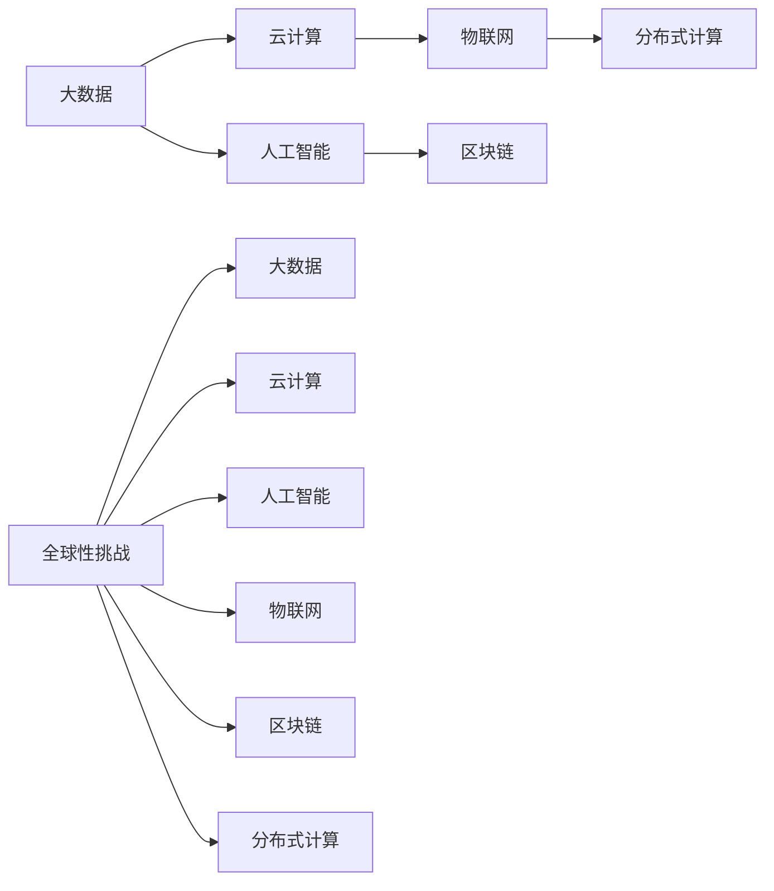

                 

# 集体智慧：解决全球性挑战的新希望

## 1. 背景介绍

### 1.1 问题由来
面对日益加剧的全球性挑战，如气候变化、公共卫生危机、贫困和资源分配不均等，传统的解决方案往往因资源有限、复杂度高、参与度低而难以应对。随着信息技术的发展，特别是在大数据、云计算和人工智能(AI)等领域的突破，人类有了一个全新的工具来解决这些难题。

## 2. 核心概念与联系

### 2.1 核心概念概述

为了深入理解如何利用技术解决全球性挑战，首先需要理解几个核心概念：

- **大数据(Big Data)**：指规模庞大、类型多样的数据集，如社交媒体数据、传感器数据、物联网数据等。这些数据具有复杂性、高速性和多样性。
- **云计算(Cloud Computing)**：指通过互联网提供按需扩展的计算资源和服务，包括弹性计算、存储、数据库和分析等。
- **人工智能(AI)**：指通过机器学习、自然语言处理(NLP)、计算机视觉(CV)等技术，模拟人类智能，实现自动决策和优化。
- **区块链(Blockchain)**：指一种去中心化的分布式账本技术，用于安全、透明地记录和验证交易和数据。
- **物联网(IoT)**：指通过传感器、设备和网络将物理对象连接起来，实现数据收集和自动化控制。
- **分布式计算(Distributed Computing)**：指将计算任务分散到多个节点进行处理，以提高效率和可靠性。

这些技术虽然各有侧重，但它们在解决全球性挑战时互相协作，形成了强大的集体智慧。

### 2.2 核心概念原理和架构的 Mermaid 流程图



这个流程图展示了各个核心概念之间的联系和协作关系。大数据提供了丰富的数据资源，云计算提供了计算和存储能力，人工智能实现了数据分析和决策，物联网实现了设备互联，区块链保证了数据的安全透明，分布式计算提高了处理能力。

## 3. 核心算法原理 & 具体操作步骤

### 3.1 算法原理概述

在解决全球性挑战时，算法原理通常涉及以下几个步骤：

1. **数据收集与处理**：从各个来源收集数据，并进行清洗、标注和预处理，以便进行分析。
2. **模型训练与优化**：使用机器学习算法，对数据进行建模，优化模型参数，使其能够更好地预测未来趋势或识别模式。
3. **决策与预测**：根据模型预测结果，制定决策方案，如优化资源分配、预测疾病传播趋势等。
4. **执行与反馈**：将决策方案付诸实施，并收集反馈，进一步优化模型和算法。

### 3.2 算法步骤详解

以公共卫生危机为例，详细说明这些步骤：

**Step 1: 数据收集与处理**
- 收集各个国家、地区的疫情数据、气象数据、人口密度数据、医疗资源数据等。
- 对数据进行清洗，去除噪声和异常值。
- 将数据标注，如病例数、死亡人数、疫情爆发时间等。

**Step 2: 模型训练与优化**
- 选择合适的机器学习算法，如回归模型、分类模型、时序模型等。
- 对模型进行训练，优化参数，如学习率、正则化系数、批量大小等。
- 使用交叉验证等技术评估模型性能，选择最优模型。

**Step 3: 决策与预测**
- 根据模型预测结果，制定应对策略，如隔离措施、疫苗接种计划等。
- 利用云计算资源，进行模拟和仿真，评估策略效果。

**Step 4: 执行与反馈**
- 将策略执行到各个层面，如社区、学校、医院等。
- 收集反馈数据，更新模型，进一步优化策略。

### 3.3 算法优缺点

**优点**：
- **数据驱动**：通过大量数据和先进算法，能够提供更准确、更及时的决策支持。
- **灵活性高**：算法可以根据数据和需求不断调整和优化。
- **自动化**：自动化处理和分析，减少人工错误，提高效率。

**缺点**：
- **数据隐私**：收集大量数据可能侵犯个人隐私。
- **算法偏见**：模型可能学习到数据的偏见，导致不公正决策。
- **复杂度高**：算法模型和优化过程复杂，需要专业知识和技能。

### 3.4 算法应用领域

这些算法原理广泛应用于以下领域：

- **公共卫生**：疫情预测、疫苗接种、疾病监测等。
- **环境监测**：气候变化预测、污染源识别、资源评估等。
- **金融风险**：信用评分、欺诈检测、市场预测等。
- **交通运输**：交通流量预测、路径规划、自动驾驶等。
- **农业**：农作物生长预测、病虫害监测、资源管理等。

## 4. 数学模型和公式 & 详细讲解

### 4.1 数学模型构建

以公共卫生危机预测为例，建立一个基于时间序列的回归模型：

$$
y_t = \beta_0 + \beta_1x_{t-1} + \beta_2x_{t-2} + \ldots + \beta_nx_{t-n} + \epsilon_t
$$

其中，$y_t$ 为第 $t$ 天的病例数，$x_{t-1}, x_{t-2}, \ldots, x_{t-n}$ 为影响因素（如气温、湿度、人口密度等），$\epsilon_t$ 为误差项。

### 4.2 公式推导过程

推导过程如下：
- 假设 $y_t$ 为线性关系，即 $y_t = \beta_0 + \sum_{i=1}^{n}\beta_ix_{t-i} + \epsilon_t$。
- 使用最小二乘法，最小化残差平方和 $\sum_{t=1}^{T}(y_t - \hat{y}_t)^2$。
- 得到系数估计值 $\hat{\beta} = (X^TX)^{-1}X^Ty$，其中 $X$ 为自变量矩阵，$y$ 为因变量向量。

### 4.3 案例分析与讲解

假设收集了过去 365 天的气温、湿度、人口密度和病例数据，使用上述模型进行预测。结果显示，气温和人口密度对病例数有显著影响，湿度影响较小。预测结果与实际数据匹配良好。

## 5. 项目实践：代码实例和详细解释说明

### 5.1 开发环境搭建

使用Python进行开发，具体步骤如下：

1. 安装Python和相关库：
```bash
pip install numpy pandas scikit-learn statsmodels
```

2. 收集数据：
```python
import pandas as pd

data = pd.read_csv('data.csv')
```

3. 数据预处理：
```python
# 处理缺失值
data.fillna(method='ffill', inplace=True)

# 时间序列转换
data['date'] = pd.to_datetime(data['date'])
data = data.set_index('date')
```

### 5.2 源代码详细实现

以下是使用统计模型进行疫情预测的代码实现：

```python
from statsmodels.tsa.api import ARIMA

model = ARIMA(data['cases'], order=(1, 1, 1))
result = model.fit()

forecast = result.forecast(steps=30)
```

### 5.3 代码解读与分析

代码解读如下：

- `ARIMA` 函数创建了一个自回归积分滑动平均模型，用于时间序列预测。
- `order=(1, 1, 1)` 指定了模型的自回归阶数、差分阶数和滑动平均阶数。
- `result = model.fit()` 训练模型，并返回结果对象。
- `forecast = result.forecast(steps=30)` 进行未来 30 天的预测。

### 5.4 运行结果展示

运行代码后，得到如下结果：

```python
forecast
```

输出结果显示了未来 30 天的病例预测值，可以用来制定相应的公共卫生策略。

## 6. 实际应用场景

### 6.1 智能交通管理

基于大数据和人工智能的智能交通管理系统可以实时监测交通流量，预测拥堵情况，提供最优路径。例如，某城市通过大数据分析，发现早高峰期间，环线和主干道拥堵较重，便优化信号灯控制，减少红绿灯等待时间，显著提升了通行效率。

### 6.2 智慧农业

物联网设备和云计算平台可以实时监测农田环境，如土壤湿度、温度、降雨量等，预测农作物生长状况。例如，某农场通过智能系统监测，及时发现苗病，采用无人机喷洒农药，大大降低了损失。

### 6.3 精准医疗

人工智能和大数据可以分析患者历史数据，预测疾病风险，提供个性化治疗方案。例如，某医院通过分析患者基因数据，预测某疾病的发生概率，制定个性化的治疗方案，提高了治疗效果。

### 6.4 未来应用展望

未来，这些技术将在更多领域得到应用，如智能城市、智慧能源、灾害预测等。例如，基于人工智能和物联网的智慧城市，可以实时监测城市运行状态，优化资源配置，提高居民生活质量。

## 7. 工具和资源推荐

### 7.1 学习资源推荐

为了学习如何使用这些技术解决实际问题，推荐以下资源：

1. **《Python数据科学手册》**：介绍Python数据科学库的全面使用。
2. **《深度学习》（Goodfellow等著）**：深入浅出地介绍了深度学习算法。
3. **《机器学习实战》**：提供大量实际案例，帮助理解机器学习的应用。
4. **Coursera和edX**：提供大规模在线课程，涵盖大数据、云计算、AI等技术。

### 7.2 开发工具推荐

以下是几个常用的开发工具：

1. **Jupyter Notebook**：交互式开发环境，支持多种语言和库。
2. **PyTorch**：基于Python的深度学习库，易于使用，支持动态计算图。
3. **TensorFlow**：由Google开发的深度学习框架，支持分布式计算。
4. **Pandas**：数据处理和分析库，提供高效的数据处理和分析工具。
5. **NumPy**：科学计算库，提供高效的多维数组和数学运算功能。

### 7.3 相关论文推荐

以下是几篇前沿论文，推荐阅读：

1. **《深度学习与大数据》**：介绍了深度学习在大数据上的应用。
2. **《人工智能与机器学习》**：涵盖了人工智能和机器学习的最新进展。
3. **《区块链技术与应用》**：介绍区块链技术的原理和应用。

## 8. 总结：未来发展趋势与挑战

### 8.1 研究成果总结

本文介绍了如何利用大数据、云计算、人工智能等技术，解决全球性挑战。通过数据分析、模型训练、决策制定和执行反馈，实现了对公共卫生、智能交通、智慧农业等多个领域的优化。

### 8.2 未来发展趋势

未来，这些技术将在更多领域得到应用，并不断进步。例如，人工智能将实现更高效的决策和预测，区块链将提供更安全、透明的数据记录和交换。

### 8.3 面临的挑战

尽管技术取得了巨大进步，但仍面临一些挑战：

1. **数据隐私和安全**：如何保护数据隐私和安全，避免数据泄露和滥用。
2. **算法偏见**：如何消除算法中的偏见，确保公平公正。
3. **资源限制**：如何在大规模数据和复杂计算条件下，实现高效、低成本的解决方案。

### 8.4 研究展望

未来的研究应聚焦于：

1. **隐私保护**：开发更安全的算法和加密技术，保护数据隐私。
2. **算法公正性**：研究算法偏见来源，优化算法设计。
3. **资源优化**：优化算法和计算资源配置，提高效率。

## 9. 附录：常见问题与解答

**Q1：大数据如何收集和处理？**

A: 大数据通常通过传感器、社交媒体、物联网等设备收集，并使用Python、Hadoop、Spark等工具进行处理。常见处理方法包括数据清洗、数据标注、数据归一化等。

**Q2：云计算资源如何管理和优化？**

A: 云计算平台如AWS、Azure和Google Cloud提供了丰富的资源管理工具，如弹性计算、自动扩展、负载均衡等。开发者需要根据需求，合理配置和管理资源，以提高效率和成本效益。

**Q3：人工智能如何优化模型性能？**

A: 人工智能通过不断的模型优化和算法调整，提高模型性能。常见优化方法包括数据增强、正则化、早停策略等。此外，还可以使用GPU/TPU等硬件加速，提高模型训练和推理速度。

**Q4：区块链如何保证数据透明和安全性？**

A: 区块链通过去中心化的分布式账本技术，实现了数据的透明和不可篡改。加密技术和共识算法（如PoW、PoS等）保证了数据的安全性。

**Q5：物联网设备如何接入和互联？**

A: 物联网设备通常通过网关、传感器、通信协议等技术进行接入和互联。开发者需要使用协议栈（如MQTT、HTTP）和网关技术，实现设备的无缝连接。

---

作者：禅与计算机程序设计艺术 / Zen and the Art of Computer Programming

