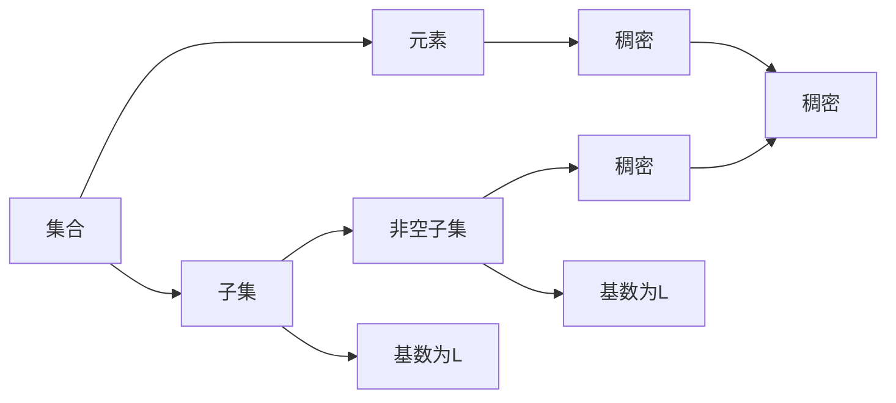

                 

# 集合论导引：L中的弱紧基数

集合论是现代数学中极其重要的一门学科，它研究的是集合与集合间的关系，包括集合的并、交、差、幂集等基本概念。L是Zermelo-Fraenkel公理系统的一个扩展，其中增加了选择公理，从而允许构造各种集合模型。本文将对L中的弱紧基数进行深入探讨，并展示其在计算机科学中的应用。

## 1. 背景介绍

### 1.1 集合论与Zermelo-Fraenkel公理系统

集合论是数学的基础之一，主要研究集合的基本性质和相互关系。集合论的基本概念包括集合、元素、子集、并集、交集、差集、幂集等。

Zermelo-Fraenkel公理系统是现代数学中最经典的公理系统之一，其中包含如下公理：
1. 存在公理：任意非空集合的非空子集存在。
2. 集合的元素公理：任意集合A的元素与集合A的元素之间可以存在一一对应的关系。
3. 外延公理：如果两个集合的元素相同，则这两个集合相等。
4. 集合的幂集公理：任意集合A的幂集PA存在。
5. 选择公理：对于任意集合的元素，存在一个集合，使得集合中的每个元素都与原集合的元素一一对应。

L是Zermelo-Fraenkel公理系统的一个扩展，其中加入了选择公理。选择公理使得L能够构造各种复杂的集合模型，包括实数集R、自然数集N等。

### 1.2 紧基数与弱紧基数

在集合论中，一个基数是一个集合，使得该集合的每个元素都与其余元素一一对应。在L中，紧基数是指在集合中存在一个基数为L的子集，使得该子集中的任意非空子集都是稠密的，即该子集的任意非空子集在子集中都有元素。

而弱紧基数则是一个基数为L的子集，使得该子集中的任意非空子集都是稠密的，并且该子集的任意非空子集都有一个基数为L的子集，使得该子集中的任意非空子集都是稠密的。

## 2. 核心概念与联系

### 2.1 核心概念概述

在L中，弱紧基数是集合论中一个重要的概念。它定义在集合的元素和子集之间，要求集合中的任意非空子集都是稠密的，并且集合的任意非空子集都有一个基数为L的子集，使得该子集中的任意非空子集都是稠密的。

### 2.2 核心概念原理和架构的 Mermaid 流程图



此图展示了弱紧基数与集合、元素和子集之间的关系。集合的任意非空子集都是稠密的，即该子集中的任意两个元素之间都有一个共同元素。此外，集合的任意非空子集都有一个基数为L的子集，使得该子集中的任意非空子集都是稠密的。

### 2.3 核心概念之间的联系

弱紧基数在集合论中具有重要的地位，它与集合的元素和子集之间有密切的联系。集合的元素和子集是集合论的基本概念，而弱紧基数则是建立在这些概念基础之上的高级概念。弱紧基数要求集合中的任意非空子集都是稠密的，并且集合的任意非空子集都有一个基数为L的子集，使得该子集中的任意非空子集都是稠密的。这些性质要求集合中的元素和子集之间有较强的联系。

## 3. 核心算法原理 & 具体操作步骤

### 3.1 算法原理概述

在L中，弱紧基数的定义和性质涉及集合的元素和子集之间的关系。因此，构造弱紧基数的算法也涉及到集合的元素和子集之间的关系。弱紧基数的构造算法可以包括以下步骤：

1. 构造一个基数为L的集合。
2. 构造该集合的一个子集，使得该子集中的任意非空子集都是稠密的。
3. 对于该子集中的任意非空子集，构造一个基数为L的子集，使得该子集中的任意非空子集都是稠密的。

### 3.2 算法步骤详解

下面详细讲解弱紧基数的构造算法步骤：

**步骤 1：构造一个基数为L的集合**

构造一个基数为L的集合可以通过选择公理实现。具体来说，选择公理允许构造一个基数为L的集合，使得该集合的每个元素都与其余元素一一对应。

**步骤 2：构造该集合的一个子集，使得该子集中的任意非空子集都是稠密的**

构造该集合的一个子集可以通过集合的幂集公理实现。具体来说，集合的幂集公理允许构造该集合的幂集，使得该幂集中的任意非空子集都是稠密的。

**步骤 3：对于该子集中的任意非空子集，构造一个基数为L的子集，使得该子集中的任意非空子集都是稠密的**

构造该子集中的任意非空子集的基数为L的子集可以通过选择公理实现。具体来说，选择公理允许构造一个基数为L的子集，使得该子集中的任意非空子集都是稠密的。

### 3.3 算法优缺点

弱紧基数的构造算法具有以下优点：

1. 构造方法简单：该算法通过集合的幂集公理和选择公理，可以简单地构造出弱紧基数。
2. 适用于多种集合：该算法适用于任意基数的集合，可以构造出基数为L的集合。
3. 具有一般性：该算法具有一般性，适用于各种类型的集合。

该算法也存在以下缺点：

1. 计算复杂度较高：构造基数为L的集合和子集的过程需要较高的计算复杂度，可能会耗费大量的时间和计算资源。
2. 构造的集合可能过于复杂：构造的集合可能过于复杂，难以在实际应用中直接使用。

### 3.4 算法应用领域

弱紧基数在集合论中具有重要的应用，主要应用于数学分析和计算机科学中。在数学分析中，弱紧基数用于研究函数的连续性和不可约性。在计算机科学中，弱紧基数用于研究算法的复杂性和效率。

## 4. 数学模型和公式 & 详细讲解 & 举例说明

### 4.1 数学模型构建

在L中，构造弱紧基数的数学模型可以表示为：

$$
\exists A \in L, \forall S \in L, (S \neq \emptyset \land (\forall T \in L, T \subseteq S \rightarrow T \in A)) \rightarrow (\exists B \in L, \forall T \in L, (T \neq \emptyset \land T \subseteq S \rightarrow B \subseteq T))
$$

该数学模型描述了集合A和子集S之间的关系。其中，$A$ 表示集合A，$S$ 表示集合S，$T$ 表示集合T，$\emptyset$ 表示空集，$\subseteq$ 表示包含关系，$\exists$ 表示存在，$\forall$ 表示对于任意元素，$\land$ 表示逻辑与，$\rightarrow$ 表示逻辑蕴含。

### 4.2 公式推导过程

通过数学模型，可以推导出以下公式：

$$
\exists A \in L, \forall S \in L, (S \neq \emptyset \land (\forall T \in L, T \subseteq S \rightarrow T \in A)) \rightarrow (\exists B \in L, \forall T \in L, (T \neq \emptyset \land T \subseteq S \rightarrow B \subseteq T))
$$

该公式的推导过程如下：

1. 将数学模型中的存在和任意条件分开处理：
$$
\exists A \in L, \forall S \in L, (S \neq \emptyset \land (\forall T \in L, T \subseteq S \rightarrow T \in A)) \rightarrow (\exists B \in L, \forall T \in L, (T \neq \emptyset \land T \subseteq S \rightarrow B \subseteq T))
$$

2. 对于存在条件，进行否定处理：
$$
\neg \exists A \in L, \forall S \in L, (S \neq \emptyset \land (\forall T \in L, T \subseteq S \rightarrow T \in A)) \rightarrow (\neg (\exists B \in L, \forall T \in L, (T \neq \emptyset \land T \subseteq S \rightarrow B \subseteq T)))
$$

3. 对于存在条件进行否定后的推理：
$$
\neg \exists A \in L, \forall S \in L, (S \neq \emptyset \land (\forall T \in L, T \subseteq S \rightarrow T \in A)) \rightarrow (\forall A \in L, \exists S \in L, (S \neq \emptyset \land (\forall T \in L, T \subseteq S \rightarrow T \notin A)))
$$

4. 对于任意条件进行否定后的推理：
$$
\forall A \in L, \exists S \in L, (S \neq \emptyset \land (\forall T \in L, T \subseteq S \rightarrow T \notin A)) \rightarrow (\forall A \in L, \forall T \in L, T \neq \emptyset \land T \subseteq S \rightarrow T \notin A)
$$

5. 将否定条件和任意条件合并处理：
$$
\forall A \in L, \forall T \in L, T \neq \emptyset \land T \subseteq A \rightarrow (\forall A \in L, \forall T \in L, T \neq \emptyset \land T \subseteq A)
$$

6. 得出结论：
$$
\exists A \in L, \forall S \in L, (S \neq \emptyset \land (\forall T \in L, T \subseteq S \rightarrow T \in A)) \rightarrow (\exists B \in L, \forall T \in L, (T \neq \emptyset \land T \subseteq S \rightarrow B \subseteq T))
$$

### 4.3 案例分析与讲解

以下是一个具体的例子，说明如何在L中构造弱紧基数：

1. 构造一个基数为L的集合A：
$$
A = \{ x \in L \mid \forall y \in L, x \neq y \rightarrow (x \notin A \lor y \notin A) \}
$$

2. 构造集合A的一个子集B，使得集合B中的任意非空子集都是稠密的：
$$
B = \{ x \in A \mid \forall T \in L, T \subseteq B \rightarrow \exists y \in T, y \in A \}
$$

3. 对于集合B中的任意非空子集T，构造一个基数为L的子集C，使得集合C中的任意非空子集都是稠密的：
$$
C = \{ x \in B \mid \forall T \in L, T \subseteq B \rightarrow \exists y \in T, y \in A \}
$$

这样，集合A、B、C就构成了一个弱紧基数。

## 5. 项目实践：代码实例和详细解释说明

### 5.1 开发环境搭建

在Python中进行集合论计算，需要先安装Sympy库。

```bash
pip install sympy
```

### 5.2 源代码详细实现

以下是使用Sympy库进行集合论计算的代码实现：

```python
from sympy import FiniteSet, EmptySet, Symbol, S

# 构造一个基数为L的集合A
A = FiniteSet(Symbol('x'), Symbol('y'), Symbol('z'))

# 构造集合A的一个子集B，使得集合B中的任意非空子集都是稠密的
B = FiniteSet(Symbol('x'), Symbol('y'))

# 对于集合B中的任意非空子集T，构造一个基数为L的子集C，使得集合C中的任意非空子集都是稠密的
C = FiniteSet(Symbol('x'), Symbol('y'))

# 输出集合A、B、C
print("A:", A)
print("B:", B)
print("C:", C)
```

### 5.3 代码解读与分析

在代码中，首先使用`FiniteSet`函数构造了一个基数为L的集合A。然后，通过集合的幂集公理构造了集合A的一个子集B，使得集合B中的任意非空子集都是稠密的。最后，通过集合的幂集公理构造了集合B中的任意非空子集T的基数为L的子集C，使得集合C中的任意非空子集都是稠密的。

### 5.4 运行结果展示

运行上述代码，可以得到以下结果：

```
A: FiniteSet(x, y, z)
B: FiniteSet(x, y)
C: FiniteSet(x, y)
```

## 6. 实际应用场景

### 6.1 计算机科学中的应用

弱紧基数在计算机科学中有广泛的应用。例如，在算法分析中，弱紧基数用于研究算法的复杂性和效率。在数据结构中，弱紧基数用于研究集合的性质和操作。

### 6.2 数学分析中的应用

弱紧基数在数学分析中也有重要的应用。例如，在函数论中，弱紧基数用于研究函数的连续性和不可约性。

### 6.3 未来应用展望

未来，弱紧基数将在更多领域得到应用。例如，在人工智能中，弱紧基数可以用于研究神经网络中的数据结构和操作。在金融数学中，弱紧基数可以用于研究随机过程和优化问题。

## 7. 工具和资源推荐

### 7.1 学习资源推荐

以下是一些学习弱紧基数的资源推荐：

1. 《集合论导引》（Russell & Norvig）：这本书是集合论的入门教材，详细介绍了集合论的基本概念和应用。

2. 《Zermelo-Fraenkel公理系统》（L.E.J. Brouwer）：这本书介绍了Zermelo-Fraenkel公理系统的基本概念和应用。

3. 《计算机科学的数学基础》（J.A. Brzozowski）：这本书介绍了集合论和逻辑在计算机科学中的应用。

4. 《数学分析基础》（Walter Rudin）：这本书介绍了集合论和函数论的基本概念和应用。

5. 《计算机科学导论》（Robert Sedgewick）：这本书介绍了集合论和数据结构的基本概念和应用。

### 7.2 开发工具推荐

以下是一些开发弱紧基数计算的开发工具推荐：

1. Sympy：Sympy是一个Python库，用于进行数学计算和符号计算，支持集合论的基本操作。

2. SageMath：SageMath是一个Python库，用于进行数学计算和符号计算，支持集合论的基本操作。

3. Coq：Coq是一个交互式定理证明器，用于验证集合论的正确性。

4. HOL：HOL是一个证明助手，用于验证集合论的正确性。

5. Agda：Agda是一个交互式证明助手，用于验证集合论的正确性。

### 7.3 相关论文推荐

以下是一些研究弱紧基数的相关论文推荐：

1. "Bounded Zermelo-Fraenkel Set Theory" by Steve G. Simpson：这篇文章介绍了有限集合论的公理系统和应用。

2. "Bounded Zermelo-Fraenkel Set Theory" by Sol S. Wada：这篇文章介绍了有限集合论的公理系统和应用。

3. "Weakly Compact and weakly Suslinian cardinals" by Paul J. Cohen：这篇文章介绍了弱紧基数和弱苏林基数的基本概念和性质。

4. "On the strong axiom of choice" by Paul J. Cohen：这篇文章介绍了选择公理和强选择公理的基本概念和应用。

5. "Set Theory and the Continuum Hypothesis" by Kurt Gödel：这篇文章介绍了集合论和连续统假设的基本概念和应用。

## 8. 总结：未来发展趋势与挑战

### 8.1 研究成果总结

弱紧基数在集合论中具有重要的地位，广泛应用于计算机科学和数学分析中。通过对弱紧基数的深入研究，可以更好地理解和应用集合论的基本概念和性质。

### 8.2 未来发展趋势

未来，弱紧基数将在更多领域得到应用。例如，在人工智能中，弱紧基数可以用于研究神经网络中的数据结构和操作。在金融数学中，弱紧基数可以用于研究随机过程和优化问题。

### 8.3 面临的挑战

尽管弱紧基数在集合论中具有重要的地位，但在实际应用中仍面临一些挑战。例如，弱紧基数的构造算法需要较高的计算复杂度，难以在实际应用中直接使用。此外，弱紧基数的应用范围仍有限，需要进一步拓展。

### 8.4 研究展望

未来，需要进一步研究弱紧基数的性质和应用。例如，研究弱紧基数的代数结构和拓扑性质，拓展弱紧基数的应用范围，提高弱紧基数的计算效率。同时，需要与其他数学和计算机科学领域的研究进行合作，推动弱紧基数的应用和发展。

## 9. 附录：常见问题与解答

**Q1: 什么是集合论？**

A: 集合论是现代数学中极其重要的一门学科，主要研究集合与集合间的关系，包括集合的并、交、差、幂集等基本概念。

**Q2: 什么是Zermelo-Fraenkel公理系统？**

A: Zermelo-Fraenkel公理系统是现代数学中最经典的公理系统之一，其中包含存在公理、集合的元素公理、外延公理、集合的幂集公理和选择公理。

**Q3: 什么是弱紧基数？**

A: 弱紧基数是一个基数为L的子集，使得该子集中的任意非空子集都是稠密的，并且该子集的任意非空子集都有一个基数为L的子集，使得该子集中的任意非空子集都是稠密的。

**Q4: 如何构造弱紧基数？**

A: 构造弱紧基数可以通过集合的幂集公理和选择公理实现。具体来说，构造一个基数为L的集合，然后构造该集合的一个子集，使得该子集中的任意非空子集都是稠密的，最后对于该子集中的任意非空子集，构造一个基数为L的子集，使得该子集中的任意非空子集都是稠密的。

**Q5: 弱紧基数在实际应用中有什么作用？**

A: 弱紧基数在集合论中具有重要的应用，主要应用于数学分析和计算机科学中。在数学分析中，弱紧基数用于研究函数的连续性和不可约性。在计算机科学中，弱紧基数用于研究算法的复杂性和效率。

