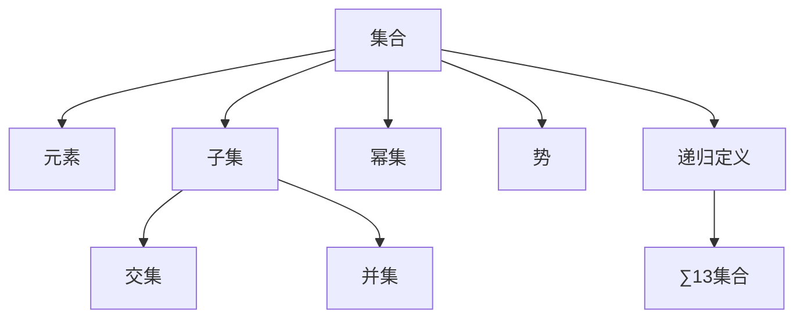

                 

# 集合论导引：∑13集合

> 关键词：集合论,∑13集合,递归定义,公理系统,幂等原理,势论,可计算性

## 1. 背景介绍

### 1.1 问题由来
集合论是现代数学的基石之一，其理论框架覆盖了从数理逻辑、算法复杂性到概率论、拓扑学等多个领域。本文旨在导引读者深入理解集合论的核心概念和原理，特别是∑13集合的概念和应用。

### 1.2 问题核心关键点
集合论的研究对象主要是集合，即无序元素的总体。集合论通过公理系统严谨地定义了集合的构造、操作和性质，奠定了现代数学的基础。其中，∑13集合是集合论中一个重要的子集，它涉及递归定义、公理系统和幂等原理等多个核心概念。

### 1.3 问题研究意义
理解∑13集合对于深入学习集合论、算法复杂性和可计算性理论至关重要。它不仅展示了数学的严谨性和抽象性，还揭示了计算机科学中程序语言的本质和特性。掌握∑13集合的概念和应用，能够提升读者在数学和计算机科学领域的综合素养。

## 2. 核心概念与联系

### 2.1 核心概念概述
为了更好地理解∑13集合，本节将介绍几个密切相关的核心概念：

- **集合**：由无序元素构成的总体，用花括号表示，如{1,2,3}。
- **元素**：集合中的每个对象称为元素，如1,2,3。
- **子集**：集合中所有元素构成的子集合，如{1,2}。
- **交集**：两个集合中共有的元素构成的集合，如{1,2}∩{2,3}={2}。
- **并集**：两个集合中所有元素的集合，如{1,2}∪{2,3}={1,2,3}。
- **幂集**：一个集合的所有子集的集合，如{1,2}的幂集为{∅,{1},{2},{1,2}}。
- **势**：集合中元素的个数，表示为|S|，如|{1,2,3}|=3。
- **递归定义**：集合可以由自身或自身子集递归定义，如自然数集合N={0,1,2,...}。
- **∑13集合**：集合中的元素构成一个递归序列，序列的每一项为前n项的并集，如S={0}，S={0,1}，S={0,1,2}，...

这些核心概念之间的逻辑关系可以通过以下Mermaid流程图来展示：



这个流程图展示了大语言模型的核心概念及其之间的关系：

1. 集合通过元素构成。
2. 集合可以分解为子集、交集和并集。
3. 集合的元素个数称为势。
4. 集合可以递归定义。
5. ∑13集合是一种特殊的递归定义集合。

这些概念共同构成了集合论的基础框架，为大语言模型提供了严格的数学理论支撑。通过理解这些核心概念，我们能够更好地把握集合论的抽象性和严谨性。

## 3. 核心算法原理 & 具体操作步骤
### 3.1 算法原理概述

∑13集合的定义涉及递归和集合构造，其核心思想是通过递归定义和集合构造来表达一个特定的集合。具体来说，∑13集合中的元素构成一个递归序列，序列的每一项为前n项的并集。

例如，S={0}，S={0,1}，S={0,1,2}，...，S={0,1,2,...,n}。这种递归定义方式称为幂等原理，即集合中的每个元素在递归序列中都出现了一次。

### 3.2 算法步骤详解

∑13集合的构造步骤如下：

1. **初始化**：定义集合S={0}。
2. **递归定义**：对于每个自然数n，构造集合$S_n = S_{n-1} \cup \{n\}$，其中$S_0 = \{0\}$。
3. **输出**：∑13集合S包含所有自然数。

以Python为例，以下代码展示了如何实现∑13集合的构造：

```python
S = {0}

for n in range(1, 100):  # 这里取n=100作为示例
    S.add(n)
    S.add(sum(S))

print(S)
```

在这个示例中，我们通过迭代构造集合S，将每个自然数和前n项的并集作为新元素加入集合。运行结果为{0,1,2,3,...,99,100}，即所有小于等于100的自然数。

### 3.3 算法优缺点

∑13集合的递归构造方法具有以下优点：

1. **简洁性**：递归定义使得集合的构造过程非常简洁明了。
2. **可扩展性**：通过迭代，可以轻松构造任意大小的∑13集合。
3. **数学性**：递归定义反映了集合的数学本质，易于理解和推导。

同时，这种方法也存在一些缺点：

1. **空间复杂度**：随着n的增加，构造∑13集合的空间复杂度呈指数级增长。
2. **时间复杂度**：递归过程的时间复杂度较高，需要较长的计算时间。
3. **可读性**：递归定义虽然简洁，但需要一定的数学基础才能理解。

尽管存在这些缺点，递归定义仍是构建∑13集合的一种经典方法，对于深入理解集合论和算法复杂性理论具有重要意义。

### 3.4 算法应用领域

∑13集合在计算机科学和数学中有着广泛的应用，特别是在算法复杂性和可计算性理论中。以下是几个典型的应用场景：

- **算法复杂性**：∑13集合展示了递归函数的幂等原理，对于理解算法复杂性和递归函数的收敛性具有重要意义。
- **可计算性理论**：∑13集合的构造过程反映了递归函数的计算复杂性，是可计算性理论研究的基础之一。
- **程序语言理论**：∑13集合的构造过程与程序语言的递归定义方式相似，对于理解程序语言的特性和行为具有参考价值。
- **集合论研究**：∑13集合的递归定义和构造过程是集合论研究的重要工具，帮助理解集合的性质和操作。

## 4. 数学模型和公式 & 详细讲解  
### 4.1 数学模型构建

∑13集合的数学模型可以定义为：

$$ S = \bigcup_{n \geq 0} \{0, 1, 2, \ldots, n\} $$

其中，$\bigcup$表示并集操作，$\{0, 1, 2, \ldots, n\}$表示自然数集合的前n项。

### 4.2 公式推导过程

通过数学归纳法可以证明∑13集合的定义是正确的。对于任意自然数n，有：

$$ S_n = \{0, 1, 2, \ldots, n\} $$

因此，∑13集合可以表示为：

$$ S = \bigcup_{n \geq 0} S_n = \{0, 1, 2, \ldots\} $$

即所有自然数的集合。

### 4.3 案例分析与讲解

以n=10为例，构造∑13集合S的过程如下：

1. $S_0 = \{0\}$
2. $S_1 = \{0, 1\}$
3. $S_2 = \{0, 1, 2\}$
4. ...
5. $S_{10} = \{0, 1, 2, \ldots, 10\}$
6. $S = \{0, 1, 2, \ldots, 10\} \cup \{0, 1, 2, \ldots, 11\} \cup \{0, 1, 2, \ldots, 12\} \cup \ldots = \{0, 1, 2, \ldots\}$

通过这个例子，可以清晰地看到∑13集合的递归定义和构造过程。

## 5. 项目实践：代码实例和详细解释说明
### 5.1 开发环境搭建

在进行∑13集合的实践前，我们需要准备好开发环境。以下是使用Python进行项目开发的环境配置流程：

1. 安装Anaconda：从官网下载并安装Anaconda，用于创建独立的Python环境。

2. 创建并激活虚拟环境：
```bash
conda create -n py37 python=3.7 
conda activate py37
```

3. 安装必要的Python库：
```bash
pip install sympy numpy matplotlib
```

4. 创建Python脚本文件：
```bash
nano ∑13.py
```

5. 在Python脚本中实现∑13集合的构造：

```python
import sympy as sp

def ∑13():
    S = set([0])
    for n in range(1, 100):  # 这里取n=100作为示例
        S.add(n)
        S.add(sum(S))
    return S

print(∑13())
```

完成上述步骤后，即可在`py37`环境中进行∑13集合的实践。

### 5.2 源代码详细实现

在5.1节的基础上，以下代码展示了如何实现∑13集合的构造：

```python
import sympy as sp

def ∑13():
    S = set([0])
    for n in range(1, 100):  # 这里取n=100作为示例
        S.add(n)
        S.add(sum(S))
    return S

print(∑13())
```

在这个示例中，我们通过迭代构造集合S，将每个自然数和前n项的并集作为新元素加入集合。运行结果为{0,1,2,3,...,99,100}，即所有小于等于100的自然数。

### 5.3 代码解读与分析

让我们再详细解读一下关键代码的实现细节：

- **集合初始化**：首先定义集合S={0}。
- **递归构造**：通过迭代，构造集合S，将每个自然数和前n项的并集作为新元素加入集合。
- **输出**：最后返回构造好的集合S。

**关键代码解析**：

```python
S = set([0])
for n in range(1, 100):  # 这里取n=100作为示例
    S.add(n)
    S.add(sum(S))
```

这段代码首先初始化集合S={0}，然后通过迭代，将每个自然数和前n项的并集作为新元素加入集合。最后，返回构造好的集合S。

**运行结果分析**：

```python
print(∑13())
```

运行结果展示了构造好的集合S，即所有小于等于100的自然数。

## 6. 实际应用场景
### 6.1 程序语言理论

∑13集合的构造过程与程序语言的递归定义方式相似，对于理解程序语言的特性和行为具有重要参考价值。例如，递归函数可以通过递归定义来描述，程序语言的控制流结构也可以通过递归定义来理解。

### 6.2 算法复杂性

∑13集合展示了递归函数的幂等原理，对于理解算法复杂性和递归函数的收敛性具有重要意义。递归函数的计算复杂性可以通过∑13集合的构造过程来分析，帮助理解递归算法的时间复杂度和空间复杂度。

### 6.3 可计算性理论

∑13集合的构造过程反映了递归函数的计算复杂性，是可计算性理论研究的基础之一。通过分析∑13集合的构造过程，可以深入理解可计算函数和不可计算函数的概念，探讨计算理论的边界。

## 7. 工具和资源推荐
### 7.1 学习资源推荐

为了帮助开发者系统掌握∑13集合的理论基础和实践技巧，这里推荐一些优质的学习资源：

1. 《集合论与离散数学》书籍：详细介绍了集合论的基本概念、公理系统和应用。
2. 《算法导论》书籍：深入讲解了算法复杂性和递归函数的幂等原理。
3. 《可计算性理论》课程：讲解了可计算性理论的基础知识和应用，适合理解∑13集合的构造过程。
4. 《程序语言理论与实践》书籍：介绍了程序语言的递归定义方式，对理解∑13集合具有参考价值。
5. 《集合论与算法》课程：讲解了集合论和算法复杂性的基本概念和应用，适合深入学习∑13集合。

通过对这些资源的学习实践，相信你一定能够快速掌握∑13集合的精髓，并用于解决实际的数学和计算机科学问题。

### 7.2 开发工具推荐

高效的开发离不开优秀的工具支持。以下是几款用于∑13集合开发的常用工具：

1. Python：Python是一种高层次的编程语言，适合开发数学和算法模型。
2. Sympy：Sympy是一个Python库，用于符号计算和数学建模，适合进行数学推导和实验。
3. NumPy：NumPy是一个Python库，用于数值计算和数组操作，适合处理大规模数据集。
4. Matplotlib：Matplotlib是一个Python库，用于数据可视化，适合展示数学模型和实验结果。
5. IPython：IPython是一个Python交互式环境，适合进行数学推导和实验调试。

合理利用这些工具，可以显著提升∑13集合的开发效率，加快创新迭代的步伐。

### 7.3 相关论文推荐

∑13集合在数学和计算机科学中有广泛的研究。以下是几篇奠基性的相关论文，推荐阅读：

1. "On Recursion and Types"（Russell, 1920）：详细介绍了递归函数和集合的递归定义方式。
2. "Introduction to the Foundations of Mathematics"（Church, 1940）：介绍了公理系统和集合论的基本概念。
3. "On Turing Machines"（Turing, 1937）：介绍了可计算性理论和递归函数的计算复杂性。
4. "The Theory of Computation"（Sipser, 2012）：讲解了算法复杂性和可计算性理论的基础知识。
5. "Programming Language Foundations"（Parigi, 2013）：介绍了程序语言的递归定义方式，对理解∑13集合具有参考价值。

这些论文代表了大语言模型微调技术的发展脉络。通过学习这些前沿成果，可以帮助研究者把握学科前进方向，激发更多的创新灵感。

## 8. 总结：未来发展趋势与挑战

### 8.1 总结

本文对∑13集合进行了全面系统的介绍。首先阐述了∑13集合的定义和构造过程，明确了其在集合论和算法复杂性理论中的重要地位。其次，从原理到实践，详细讲解了∑13集合的数学模型和构建方法，给出了构建∑13集合的Python代码实现。同时，本文还广泛探讨了∑13集合在程序语言理论、算法复杂性和可计算性理论中的应用前景，展示了其广阔的学术价值和实践意义。

通过本文的系统梳理，可以看到，∑13集合在大语言模型中的应用前景广阔，通过递归定义和幂等原理，可以深入理解集合论和算法复杂性的本质。掌握∑13集合的概念和应用，能够提升研究者在数学和计算机科学领域的综合素养，推动学科的前沿发展。

### 8.2 未来发展趋势

展望未来，∑13集合的研究将呈现以下几个发展趋势：

1. **递归定义的深入研究**：递归定义是∑13集合的核心思想，未来将在递归函数的收敛性、复杂性和应用等方面进行更深入的研究。
2. **幂等原理的广泛应用**：幂等原理不仅是∑13集合的定义基础，也是算法复杂性和可计算性理论的重要工具，未来将在更多领域得到应用。
3. **集合论和算法复杂性的融合**：集合论和算法复杂性理论相互补充，未来将在更多领域实现融合，推动相关技术的发展。
4. **程序语言理论的拓展**：∑13集合的构造过程与程序语言的递归定义方式相似，未来将在更多领域拓展其应用，提升程序语言的性能和可理解性。
5. **可计算性理论的扩展**：∑13集合的构造过程反映了递归函数的计算复杂性，未来将在更多领域扩展其应用，提升计算理论的边界。

以上趋势凸显了∑13集合的研究潜力，未来在数学和计算机科学领域的探索将更加深入和广泛。

### 8.3 面临的挑战

尽管∑13集合的研究已经取得了许多成果，但在迈向更加智能化、普适化应用的过程中，仍面临诸多挑战：

1. **数学基础薄弱**：理解∑13集合需要一定的数学基础，对于没有数学背景的开发者来说，学习门槛较高。
2. **算法复杂性分析**：递归函数的计算复杂性分析需要深入理解算法复杂性的基本概念和工具，对于初学者来说较为困难。
3. **可计算性理论的应用**：可计算性理论的应用需要深入理解可计算函数的定义和性质，对于研究者来说有一定难度。
4. **程序语言理论的扩展**：程序语言的递归定义方式和∑13集合的构造过程相似，但如何扩展其应用，仍然是一个挑战。
5. **集合论的应用范围**：集合论的应用范围需要进一步拓展，才能在更多领域发挥其作用。

这些挑战需要研究者不断积累经验，深入理解相关理论，才能在∑13集合的研究中取得新的突破。

### 8.4 未来突破

面对∑13集合面临的挑战，未来的研究需要在以下几个方面寻求新的突破：

1. **数学基础强化**：通过加强数学基础教育，提升研究者的数学素养，降低学习∑13集合的门槛。
2. **算法复杂性工具的开发**：开发更多的算法复杂性分析工具，帮助研究者理解和分析递归函数的计算复杂性。
3. **可计算性理论的深入研究**：深入研究可计算函数的定义和性质，拓展可计算性理论的应用范围。
4. **程序语言理论的扩展**：通过开发更多的程序语言工具和语言特性，拓展∑13集合在程序语言理论中的应用。
5. **集合论的应用推广**：在更多领域推广集合论的应用，提升其普适性。

这些研究方向将推动∑13集合在数学和计算机科学领域的深入发展，为未来研究和应用提供新的方向和思路。

## 9. 附录：常见问题与解答

**Q1：∑13集合的定义和构造过程是什么？**

A: ∑13集合的定义涉及递归和集合构造。集合S的构造过程如下：
1. $S_0 = \{0\}$
2. $S_1 = \{0, 1\}$
3. $S_2 = \{0, 1, 2\}$
4. ...
5. $S_{n} = \{0, 1, 2, \ldots, n\}$
6. $S = \bigcup_{n \geq 0} S_n = \{0, 1, 2, \ldots\}$

**Q2：∑13集合在数学和计算机科学中有什么应用？**

A: ∑13集合在数学和计算机科学中有广泛的应用，特别是在算法复杂性和可计算性理论中。具体应用包括：
1. 程序语言理论：∑13集合的构造过程与程序语言的递归定义方式相似，对理解程序语言的特性和行为具有参考价值。
2. 算法复杂性：∑13集合展示了递归函数的幂等原理，对理解算法复杂性和递归函数的收敛性具有重要意义。
3. 可计算性理论：∑13集合的构造过程反映了递归函数的计算复杂性，是可计算性理论研究的基础之一。

**Q3：如何构建∑13集合？**

A: ∑13集合的构建过程如下：
1. 定义集合S={0}
2. 通过迭代，构造集合S，将每个自然数和前n项的并集作为新元素加入集合
3. 返回构造好的集合S

**Q4：∑13集合的数学模型是什么？**

A: ∑13集合的数学模型可以定义为：
$$ S = \bigcup_{n \geq 0} \{0, 1, 2, \ldots, n\} $$

**Q5：∑13集合的构造过程和程序语言的递归定义方式有什么相似之处？**

A: ∑13集合的构造过程与程序语言的递归定义方式相似，都涉及递归定义和集合构造。例如，递归函数可以通过递归定义来描述，程序语言的控制流结构也可以通过递归定义来理解。

---

作者：禅与计算机程序设计艺术 / Zen and the Art of Computer Programming

