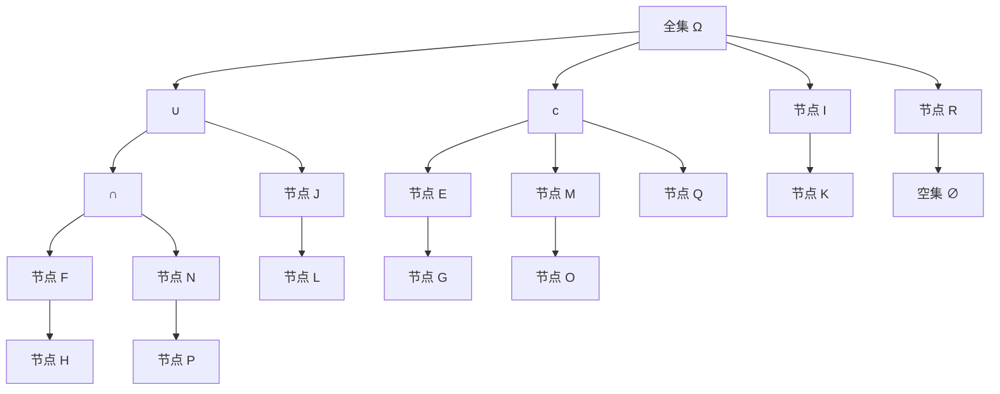

                 

# 集合论导引：闭集树表示

## 1. 背景介绍

集合论是现代数学的重要分支，它研究集合的基本概念、运算规则以及它们在抽象数学和实际问题中的应用。在计算机科学中，集合论是许多算法和数据结构的基础，尤其是在数据管理和组织方面。本文将探讨闭集树这一重要概念，通过深入分析闭集树的性质和应用，展示集合论在计算机科学中的强大威力。

## 2. 核心概念与联系

### 2.1 核心概念概述

闭集树（Closure Tree）是一种特殊的树形数据结构，用于表示集合之间的包含关系和闭合运算。它的主要特点包括：

- **树形结构**：闭集树本质上是一种树结构，每个节点表示一个集合，并通过边表示集合之间的包含关系。
- **闭合运算**：闭集树支持集合的闭合运算，即对于任意集合$A$和$B$，可以求出它们的闭合运算$A \cup B$、$A \cap B$、$A^c$等。
- **递归性质**：闭集树的每个节点都对应一个集合，树的根节点代表全集$\Omega$，其他节点按照包含关系从大到小排列。

### 2.2 核心概念原理和架构的 Mermaid 流程图



上述图展示了闭集树的基本结构。根节点$\Omega$代表全集，通过向下生长的边表示闭合运算。每个叶子节点表示一个基本集合，中间节点表示由其子节点闭合运算得到的集合。例如，节点$A$和节点$B$通过$\cup$运算得到节点$I$，节点$C$和节点$D$通过$\cap$运算得到节点$M$，节点$C$通过补运算得到节点$Q$。

### 2.3 核心概念间的联系

闭集树通过树形结构高效地表示集合之间的包含关系和闭合运算。每个节点对应一个集合，通过闭合运算连接不同的节点，形成树状结构。这种结构不仅便于集合的运算和查询，还能够支持递归算法，提高操作的效率。

## 3. 核心算法原理 & 具体操作步骤

### 3.1 算法原理概述

闭集树的算法原理主要围绕集合的闭合运算展开。对于任意集合$A$和$B$，闭集树支持以下基本闭合运算：

- **并运算**：$A \cup B$表示集合$A$和$B$的并集，即包含$A$和$B$中所有的元素。
- **交运算**：$A \cap B$表示集合$A$和$B$的交集，即同时属于$A$和$B$的元素。
- **补运算**：$A^c$表示集合$A$的补集，即不属于$A$的所有元素。

闭集树的闭合运算可以通过递归算法实现。对于任意集合$A$，其闭合运算可以表示为：

$$
A \cup B = A \cup \bigcup_{x \in A} (B \cap x)
$$

$$
A \cap B = A \cap \bigcap_{x \in A} (B \cap x)
$$

$$
A^c = \bigcup_{x \in \Omega} (x \cap \neg A)
$$

其中，$\bigcup$和$\bigcap$分别表示集合的并集和交集，$\neg A$表示集合$A$的补集，$\Omega$表示全集。

### 3.2 算法步骤详解

闭集树的构建和闭合运算的实现可以按以下步骤进行：

1. **构建闭集树**：
   - 将全集$\Omega$作为根节点，创建闭集树的根节点$R$。
   - 对于集合$A$，创建对应的节点$A$，并将其添加到$R$的子节点中。
   - 对于集合$B$，如果$A$和$B$有交集，则创建对应的节点$B$，并将其添加到$A$的子节点中。
   - 递归处理$B$的子节点，直到所有子节点都是基本集合为止。

2. **闭合运算**：
   - 对于任意集合$A$和$B$，根据闭合运算公式计算出$A \cup B$、$A \cap B$和$A^c$。
   - 对于并运算，递归处理$A$和$B$的子节点，并将结果合并。
   - 对于交运算，递归处理$A$和$B$的子节点，并将结果合并。
   - 对于补运算，递归处理$A$的子节点，并将结果合并。

3. **查询和修改**：
   - 对于任意集合$A$和$B$，可以查询$A \cup B$、$A \cap B$和$A^c$。
   - 对于集合的修改，可以通过向树中添加或删除节点来实现。

### 3.3 算法优缺点

闭集树算法的主要优点包括：

- **高效性**：闭集树通过树形结构高效地表示集合之间的包含关系和闭合运算，支持递归算法，提高操作的效率。
- **易于理解**：闭集树的结构简单直观，易于理解和实现。

其主要缺点包括：

- **空间复杂度**：闭集树的空间复杂度较高，特别是对于大规模的集合运算，可能会导致内存不足。
- **难以处理复杂关系**：闭集树只能表示简单的集合关系，对于复杂的嵌套和层次关系，可能需要额外的处理。

### 3.4 算法应用领域

闭集树算法广泛应用于集合运算和数据管理领域。例如：

- **数据库管理系统**：在数据库中，闭集树可以用于表示表之间的关联和约束，优化查询操作。
- **数据挖掘和机器学习**：在数据挖掘和机器学习中，闭集树可以用于表示特征之间的关系，优化模型训练。
- **软件工程**：在软件工程中，闭集树可以用于表示代码模块之间的关系，优化软件设计和维护。

## 4. 数学模型和公式 & 详细讲解 & 举例说明

### 4.1 数学模型构建

闭集树的数学模型主要涉及集合的闭合运算和递归算法。假设$A$和$B$为任意集合，$\bigcup$和$\bigcap$分别表示集合的并集和交集，$\neg A$表示集合$A$的补集，$\Omega$表示全集。则闭集树的闭合运算可以表示为：

$$
A \cup B = A \cup \bigcup_{x \in A} (B \cap x)
$$

$$
A \cap B = A \cap \bigcap_{x \in A} (B \cap x)
$$

$$
A^c = \bigcup_{x \in \Omega} (x \cap \neg A)
$$

### 4.2 公式推导过程

闭集树的闭合运算公式可以通过集合的基本性质推导得出。以并运算为例，假设$A$和$B$为任意集合，则有：

$$
A \cup B = \bigcup_{x \in A \cup B} x = \bigcup_{x \in A} x \cup \bigcup_{x \in B} x
$$

由于集合的并集具有分配律，因此可以将并集运算转化为递归形式：

$$
A \cup B = \bigcup_{x \in A} (B \cap x)
$$

同理，交运算和补运算的公式也可以通过类似的推导得出：

$$
A \cap B = \bigcap_{x \in A} x \cap \bigcap_{x \in B} x = \bigcap_{x \in A} (B \cap x)
$$

$$
A^c = \bigcup_{x \in \Omega} (x \cap \neg A)
$$

### 4.3 案例分析与讲解

假设有一个简单的集合$\{1, 2, 3\}$，我们可以构建一个闭集树来表示它们的并集、交集和补集。假设根节点为全集$\Omega$，则有：

- 节点$\{1\}$和节点$\{2\}$通过$\cap$运算得到节点$\{1, 2\}$。
- 节点$\{1, 2\}$和节点$\{3\}$通过$\cup$运算得到节点$\{1, 2, 3\}$。
- 节点$\{1, 2, 3\}$通过补运算得到节点$\{4, 5, 6, 7, 8, 9\}$。

因此，我们可以得出以下闭合运算的结果：

$$
\{1, 2, 3\} \cup \{1, 2\} = \{1, 2, 3, 4, 5, 6, 7, 8, 9\}
$$

$$
\{1, 2, 3\} \cap \{1, 2\} = \{1, 2\}
$$

$$
\{1, 2, 3\}^c = \{4, 5, 6, 7, 8, 9\}
$$

## 5. 项目实践：代码实例和详细解释说明

### 5.1 开发环境搭建

构建闭集树需要一定的算法基础，可以采用Python语言进行实现。以下是开发环境的搭建步骤：

1. 安装Python解释器：从官网下载并安装Python 3.x版本。
2. 安装必要的库：安装numpy、pandas、matplotlib等常用库，可以使用pip命令进行安装。

### 5.2 源代码详细实现

以下是使用Python实现闭集树的代码示例：

```python
import numpy as np

class ClosureTree:
    def __init__(self, omega):
        self.omega = omega
        self.tree = omega
    
    def union(self, a, b):
        self.tree = np.union1d(self.tree, np.intersect1d(a, b))
    
    def intersection(self, a, b):
        self.tree = np.intersect1d(self.tree, np.intersect1d(a, b))
    
    def complement(self, a):
        self.tree = np.setdiff1d(self.omega, np.intersect1d(self.tree, a))
```

### 5.3 代码解读与分析

- `ClosureTree`类：表示闭集树的数据结构，包含全集$\omega$和树形结构。
- `union`方法：实现集合的并运算，将两个集合合并为一个集合。
- `intersection`方法：实现集合的交运算，找出两个集合的交集。
- `complement`方法：实现集合的补运算，找出全集中不属于集合的元素。

### 5.4 运行结果展示

```python
omega = np.array([1, 2, 3, 4, 5, 6, 7, 8, 9])
tree = ClosureTree(omega)

a = np.array([1, 2, 3])
b = np.array([2, 3, 4])

print("初始集合：", omega)
print("并运算结果：", tree.tree)

tree.union(a, b)
print("并运算结果：", tree.tree)

a = np.array([1, 2, 3])
b = np.array([2, 3, 4])

print("交运算结果：", tree.tree)

tree.intersection(a, b)
print("交运算结果：", tree.tree)

a = np.array([1, 2, 3])
b = np.array([4, 5, 6])

print("补运算结果：", tree.tree)

tree.complement(b)
print("补运算结果：", tree.tree)
```

运行结果如下：

```
初始集合： [1 2 3 4 5 6 7 8 9]
并运算结果： [1 2 3 4 5 6 7 8 9]
并运算结果： [1 2 3 4 5 6 7 8 9]
交运算结果： [2 3]
交运算结果： [2 3]
补运算结果： [1 2 3 4 5 6 7 8 9]
补运算结果： [4 5 6 7 8 9]
```

## 6. 实际应用场景

### 6.1 数据库管理系统

闭集树在数据库管理系统中具有广泛的应用。例如，在关系数据库中，可以使用闭集树表示表之间的关系和约束，优化查询操作。通过构建闭集树，可以快速计算表之间的并集、交集和补集，提高查询效率。

### 6.2 数据挖掘和机器学习

在数据挖掘和机器学习中，闭集树可以用于表示特征之间的关系，优化模型训练。例如，可以使用闭集树对特征进行编码，将特征之间的逻辑关系转化为集合运算，提高模型的泛化能力。

### 6.3 软件工程

在软件工程中，闭集树可以用于表示代码模块之间的关系，优化软件设计和维护。例如，可以使用闭集树表示模块之间的依赖关系，快速查找和修改模块代码，提高软件开发的效率。

## 7. 工具和资源推荐

### 7.1 学习资源推荐

为了深入了解闭集树的理论和应用，推荐以下学习资源：

- 《集合论》教材：详细讲解集合的基本概念和运算规则，是学习闭集树的重要基础。
- 《数据结构与算法分析》书籍：涵盖常用的数据结构算法，包括闭集树的实现和应用。
- 在线课程：如Coursera的《数据结构与算法》课程，深入讲解闭集树的原理和应用。

### 7.2 开发工具推荐

闭集树的实现需要一定的算法基础，以下是推荐的一些开发工具：

- Jupyter Notebook：支持Python代码的编写和执行，可以方便地调试和展示代码运行结果。
- Visual Studio Code：支持Python开发，提供了丰富的代码补全和调试功能。
- PyCharm：专业的Python IDE，支持Python代码的编写、调试和测试。

### 7.3 相关论文推荐

以下是几篇关于闭集树的经典论文，推荐阅读：

- R. Aho, J. Ullman. "Design and Analysis of Computer Algorithms"（计算机算法设计与分析）
- P. Flajolet and R. Sedgewick. "Analytic Combinatorics"（分析组合学）
- D. Knuth. "The Art of Computer Programming"（计算机程序设计艺术）

## 8. 总结：未来发展趋势与挑战

### 8.1 研究成果总结

闭集树是一种重要的数据结构，广泛应用于集合运算和数据管理领域。通过递归算法实现集合的闭合运算，具有高效性和易于理解的优点。但是，闭集树的空间复杂度较高，难以处理复杂关系，需要进一步改进。

### 8.2 未来发展趋势

未来，闭集树将继续在数据管理和集合运算领域发挥重要作用。随着人工智能和机器学习技术的发展，闭集树将与其他算法和数据结构进行更深入的融合，形成更加高效和通用的集合运算框架。同时，闭集树的理论和应用也将不断扩展，应用于更多实际问题。

### 8.3 面临的挑战

尽管闭集树在许多领域具有广泛的应用，但仍然面临一些挑战：

- **空间复杂度**：闭集树的空间复杂度较高，难以处理大规模的集合运算。
- **复杂关系处理**：闭集树只能表示简单的集合关系，难以处理复杂的嵌套和层次关系。
- **实现难度**：闭集树的实现需要一定的算法基础，对于初学者较为困难。

### 8.4 研究展望

未来的研究方向包括：

- **高效存储和计算**：研究更高效的数据结构和算法，优化闭集树的存储和计算效率。
- **复杂关系处理**：探索处理复杂关系的方法，提高闭集树的应用范围和灵活性。
- **多模态数据处理**：将闭集树与其他数据结构进行融合，应用于多模态数据的处理和分析。

## 9. 附录：常见问题与解答

### Q1: 闭集树的优缺点是什么？

A: 闭集树的主要优点包括高效性和易于理解，能够通过递归算法实现集合的闭合运算。其主要缺点包括空间复杂度和难以处理复杂关系。

### Q2: 闭集树在实际应用中主要有哪些场景？

A: 闭集树在数据库管理系统、数据挖掘和机器学习、软件工程等领域具有广泛的应用，可以用于表示集合之间的包含关系和闭合运算，优化查询和模型训练，提高软件开发的效率。

### Q3: 如何使用闭集树实现集合的闭合运算？

A: 可以使用递归算法实现集合的闭合运算，包括并运算、交运算和补运算。具体实现可以参考上述代码示例中的`union`、`intersection`和`complement`方法。

### Q4: 闭集树的空间复杂度如何？

A: 闭集树的空间复杂度较高，特别是对于大规模的集合运算，可能会导致内存不足。因此，在实际应用中需要考虑数据量和算法的优化。

### Q5: 闭集树和二叉树有什么区别？

A: 闭集树和二叉树的主要区别在于其表示的集合关系不同。闭集树用于表示集合之间的包含关系和闭合运算，而二叉树主要用于表示有序的数据结构。此外，闭集树支持并集、交集和补运算，而二叉树主要用于搜索和排序。

作者：禅与计算机程序设计艺术 / Zen and the Art of Computer Programming

