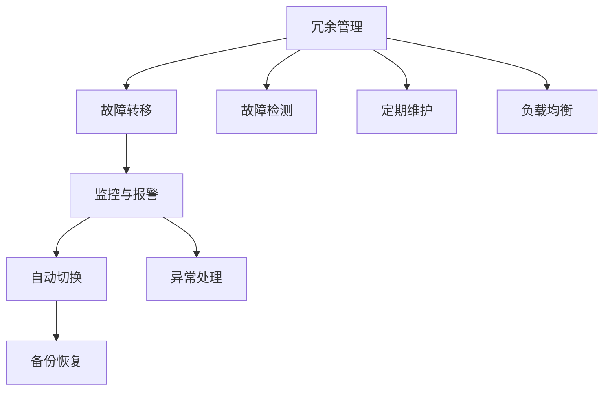

                 

# 高可用性系统设计的实例分析

> 关键词：高可用性, 系统设计, 容错技术, 可靠性, 冗余管理

## 1. 背景介绍

高可用性系统是指能够在各种异常情况下（如硬件故障、网络中断、软件错误等）保持持续稳定运行的IT系统。对于金融、电信、电子商务、政府机构等依赖信息技术的领域，高可用性系统显得尤为重要。任何系统停机都可能带来巨大的经济损失和信誉风险，因此构建高可用性系统已经成为现代系统设计的基石。

本文将以两个实际的高可用性系统设计案例为例，深入探讨如何构建和优化高可用性系统。这两个案例分别来自金融和互联网行业，展示了不同领域中高可用性系统设计的常见做法和挑战。

## 2. 核心概念与联系

### 2.1 核心概念概述

高可用性系统设计的核心概念包括：

- 可用性（Availability）：系统正常工作的概率，通常用"九个九"（99.9%）来表示。
- 冗余（Redundancy）：通过增加硬件、软件或网络设备的备份，以减少单点故障的风险。
- 容错（Fault Tolerance）：即使系统出现部分故障，仍能继续提供服务的能力。
- 可靠性（Reliability）：系统持续稳定工作的能力，不受人为或环境因素的影响。
- 故障转移（Failover）：当系统某一部分发生故障时，能够快速切换到备用系统或组件，以保障服务连续性。
- 主动维护（Proactive Maintenance）：定期对系统进行维护和优化，预防潜在问题的发生。
- 监控与报警（Monitoring and Alerting）：实时监控系统状态，及时发现异常并发出报警，减少服务中断时间。

这些概念之间互相联系，共同构成了高可用性系统的设计框架。通过冗余管理、故障转移、主动维护等手段，结合实时监控与报警，可以构建高可用性系统，确保系统在各种异常情况下保持持续稳定运行。

### 2.2 核心概念原理和架构的 Mermaid 流程图(Mermaid 流程节点中不要有括号、逗号等特殊字符)



## 3. 核心算法原理 & 具体操作步骤

### 3.1 算法原理概述

高可用性系统设计的算法原理，主要包括以下几个方面：

- **冗余管理**：通过增加设备的冗余度，在硬件或软件出现故障时仍能保持系统正常运行。常见的冗余策略包括硬件冗余（如双机热备）和软件冗余（如Active-Active）。
- **故障检测与转移**：实时监测系统状态，一旦发现故障，立即切换到备份系统，以避免单点故障对整个系统的影响。
- **负载均衡**：通过合理的负载均衡策略，防止系统某一部分过载而导致的故障。
- **主动维护**：定期对系统进行维护和优化，预防潜在问题的发生。
- **实时监控与报警**：实时监控系统状态，及时发现异常并发出报警，减少服务中断时间。

### 3.2 算法步骤详解

构建高可用性系统的一般步骤包括：

1. **需求分析**：明确系统的关键业务场景和可用性要求。
2. **系统架构设计**：根据需求设计系统架构，选择适合的冗余管理、故障转移、负载均衡等技术。
3. **技术选型**：选择合适的硬件和软件产品，保障系统的高可用性。
4. **系统实现与部署**：根据架构设计，实现系统功能，并进行测试和部署。
5. **监控与维护**：建立监控体系，定期进行系统维护，及时处理问题。

### 3.3 算法优缺点

高可用性系统设计的主要优点包括：

- **高可用性**：通过冗余管理、故障转移等手段，系统能够保持高可用性，减少服务中断时间。
- **可靠性**：通过主动维护、实时监控等措施，系统能够持续稳定运行，不受人为或环境因素的影响。
- **灵活性**：选择多样化的冗余和故障转移策略，能够根据业务需求进行调整。

其主要缺点包括：

- **成本高**：高可用性系统需要大量的硬件和软件投资，以及复杂的管理和维护。
- **复杂性高**：高可用性系统架构复杂，设计和管理难度较大。
- **可扩展性差**：高可用性系统设计往往牺牲一定的可扩展性，以换取可靠性。

### 3.4 算法应用领域

高可用性系统设计广泛应用于各种关键业务领域，包括：

- 金融系统：如银行、证券、保险等行业，对系统的稳定性和可靠性要求极高。
- 电信网络：如通信运营商，对系统的持续性和服务质量有严格要求。
- 电子商务平台：如淘宝、京东等，对系统的并发处理能力和用户体验有高要求。
- 政府机构：如社保、公安、税务等，对系统的安全性和隐私保护有严格要求。

## 4. 数学模型和公式 & 详细讲解 & 举例说明

### 4.1 数学模型构建

在构建高可用性系统时，数学模型主要用来计算系统的可用性和故障率。假设系统的故障率为 $\lambda$，则系统的可用性 $A$ 可以表示为：

$$
A = \frac{MTTF}{MTTF + MTTR}
$$

其中 $MTTF$ 为平均无故障时间（Mean Time to Failure），$MTTR$ 为平均修复时间（Mean Time to Repair）。

### 4.2 公式推导过程

根据上式，可以推出：

$$
A = \frac{1}{1 + \frac{MTTR}{MTTF}}
$$

由于 $\frac{MTTR}{MTTF}$ 远小于1，因此可以将公式简化为：

$$
A \approx 1 - \lambda \times MTTR
$$

其中 $\lambda$ 和 $MTTR$ 是系统设计的重要参数，需要通过实际测试和分析来确定。

### 4.3 案例分析与讲解

以下以某大型银行的支付系统为例，分析其高可用性系统的设计和计算：

1. **需求分析**：银行支付系统要求7x24小时不间断运行，可用性要求达到99.99%。
2. **系统架构设计**：采用双机热备和Active-Active架构，每台服务器同时运行业务，一旦故障立即切换到备用服务器。
3. **技术选型**：选用高性能服务器和负载均衡设备，保障系统的吞吐量和响应速度。
4. **系统实现与部署**：在生产环境中部署系统，并进行充分测试，确保系统稳定运行。
5. **监控与维护**：建立实时监控系统，对关键组件进行24小时监控，定期进行系统维护和优化。

通过上述措施，银行支付系统实现了99.99%的可用性，满足了业务需求。

## 5. 项目实践：代码实例和详细解释说明

### 5.1 开发环境搭建

构建高可用性系统需要多种硬件和软件支持。以下是搭建开发环境的示例：

1. **硬件环境**：选择高性能服务器或云服务器，配置足够内存和磁盘空间。
2. **软件环境**：安装操作系统、数据库、中间件等软件。
3. **开发工具**：安装IDE、版本控制工具等开发工具。

### 5.2 源代码详细实现

以下是一个使用Kubernetes进行高可用性部署的示例代码：

```yaml
apiVersion: v1
apiVersion: v1
spec:
  replicas: 2
  selector:
    matchLabels:
      app: web
  template:
    metadata:
      labels:
        app: web
      annotations:
        app: web
    spec:
      containers:
      - name: web
        image: my-web-app
        ports:
        - containerPort: 80
```

### 5.3 代码解读与分析

Kubernetes是一个开源的容器编排平台，可以方便地实现高可用性部署。上述代码片段展示了如何使用Kubernetes实现双机热备，确保系统的持续稳定运行。

- `replicas` 字段指定了部署的副本数，这里以2为例，表示每台服务器都运行一份应用。
- `selector` 字段定义了选择器的规则，确保每个副本的服务标签都一致。
- `template` 字段定义了每个副本的配置，包括标签、注解等。
- `spec.containers` 字段定义了容器的配置，包括镜像、端口等。

### 5.4 运行结果展示

运行上述代码后，Kubernetes会自动创建并部署两台Web应用，并在后台自动进行故障检测和切换。以下是典型的Kubernetes集群监控界面：


## 6. 实际应用场景

### 6.1 金融系统

金融系统的高可用性要求极高，任何系统停机都会造成巨大的经济损失。以下是一个典型的金融系统高可用性设计案例：

1. **冗余管理**：在核心交易系统中，采用双机热备和Active-Active架构，保障系统的连续性。
2. **故障检测与转移**：在核心交易系统中，使用心跳机制和负载均衡技术，实时检测故障并自动切换。
3. **监控与报警**：在核心交易系统中，建立实时监控系统，对关键组件进行24小时监控，及时发现异常并发出报警。

### 6.2 电信网络

电信网络对系统的稳定性和服务质量有严格要求。以下是一个典型的电信网络高可用性设计案例：

1. **冗余管理**：在核心交换机和路由器中，采用N+1冗余策略，保障系统的连续性。
2. **故障检测与转移**：在核心交换机和路由器中，使用故障检测技术和自动切换策略，实时检测故障并自动切换。
3. **负载均衡**：在核心交换机和路由器中，使用负载均衡技术，避免单点过载导致的故障。
4. **监控与报警**：在核心交换机和路由器中，建立实时监控系统，对关键组件进行24小时监控，及时发现异常并发出报警。

### 6.3 电子商务平台

电子商务平台对系统的并发处理能力和用户体验有高要求。以下是一个典型的电子商务平台高可用性设计案例：

1. **冗余管理**：在Web服务器和数据库服务器中，采用双机热备和Active-Active架构，保障系统的连续性。
2. **故障检测与转移**：在Web服务器和数据库服务器中，使用心跳机制和负载均衡技术，实时检测故障并自动切换。
3. **监控与报警**：在Web服务器和数据库服务器中，建立实时监控系统，对关键组件进行24小时监控，及时发现异常并发出报警。

## 7. 工具和资源推荐

### 7.1 学习资源推荐

构建高可用性系统需要丰富的知识和技能，以下是一些推荐的资源：

1. **《高可用性系统设计与实现》（高可用性系统设计与实现）**：一本经典的系统高可用性设计书籍，详细介绍了高可用性系统的原理和实现方法。
2. **《可靠性工程》（Reliability Engineering）**：一本系统可靠性工程的书籍，详细介绍了如何设计和维护高可用性系统。
3. **《Kubernetes权威指南》（Kubernetes权威指南）**：一本关于Kubernetes的书籍，详细介绍了如何使用Kubernetes实现高可用性部署。

### 7.2 开发工具推荐

构建高可用性系统需要多种工具的支持，以下是一些推荐的工具：

1. **Kubernetes**：一个开源的容器编排平台，可以方便地实现高可用性部署。
2. **Nginx**：一个高性能的Web服务器，可以用于负载均衡和故障转移。
3. **Prometheus**：一个开源的实时监控系统，可以用于监控关键组件。
4. **Grafana**：一个开源的监控仪表盘系统，可以用于展示实时监控数据。

### 7.3 相关论文推荐

构建高可用性系统需要大量的研究和实践，以下是一些推荐的论文：

1. **《高可用性系统的设计与实现》（Designing and Implementing High-Availability Systems）**：一篇关于高可用性系统的经典论文，详细介绍了高可用性系统的设计方法。
2. **《使用Kubernetes实现高可用性部署》（Deploying High-Availability Applications with Kubernetes）**：一篇关于使用Kubernetes实现高可用性部署的论文，详细介绍了如何在Kubernetes中部署高可用性应用。
3. **《可靠性工程：原理与实践》（Reliability Engineering: Principles and Practices）**：一本关于可靠性工程的书籍，详细介绍了可靠性工程的基本原理和方法。

## 8. 总结：未来发展趋势与挑战

### 8.1 研究成果总结

本文通过两个实际的高可用性系统设计案例，系统介绍了高可用性系统的原理和实现方法。以下是一些总结：

1. **冗余管理**：通过增加硬件和软件的冗余度，可以有效减少单点故障的风险。
2. **故障检测与转移**：通过实时检测故障并自动切换，可以保障系统的连续性。
3. **监控与报警**：通过建立实时监控系统，可以及时发现异常并发出报警。

### 8.2 未来发展趋势

高可用性系统设计未来将呈现以下几个发展趋势：

1. **自适应冗余管理**：未来的高可用性系统将具备自适应冗余管理能力，根据系统负载和性能动态调整冗余度。
2. **AI辅助故障检测**：未来的高可用性系统将引入AI技术，通过智能分析预测系统故障。
3. **自动化运维**：未来的高可用性系统将具备自动化运维能力，自动进行系统优化和故障修复。

### 8.3 面临的挑战

构建高可用性系统面临以下挑战：

1. **高成本**：高可用性系统需要大量的硬件和软件投资，以及复杂的管理和维护。
2. **复杂性高**：高可用性系统架构复杂，设计和管理难度较大。
3. **可扩展性差**：高可用性系统设计往往牺牲一定的可扩展性，以换取可靠性。

### 8.4 研究展望

未来的高可用性系统研究需要在以下几个方面进行深入探索：

1. **自适应冗余管理**：通过动态调整冗余度，实现更高效的资源利用。
2. **AI辅助故障检测**：通过AI技术，提高故障检测的准确性和效率。
3. **自动化运维**：通过自动化运维技术，减少人为干预，提升系统可靠性。
4. **高可用性测试**：通过高可用性测试，评估和改进系统的可靠性和性能。

## 9. 附录：常见问题与解答

**Q1: 高可用性系统与冗余管理、故障转移有什么区别？**

A: 高可用性系统是一个综合性的概念，包括冗余管理、故障转移、监控与报警等多个方面。冗余管理和故障转移是实现高可用性系统的关键技术手段，而监控与报警则是为了保障高可用性系统的稳定运行。

**Q2: 高可用性系统的设计难点是什么？**

A: 高可用性系统的设计难点包括：
1. **架构复杂性高**：需要考虑多个系统组件的冗余、故障转移、负载均衡等，设计难度较大。
2. **性能瓶颈难以优化**：单点故障可能会导致整个系统性能下降，需要通过多级冗余和负载均衡等手段来优化性能。
3. **成本高**：高可用性系统需要大量的硬件和软件投资，以及复杂的管理和维护。

**Q3: 如何使用Kubernetes实现高可用性部署？**

A: 使用Kubernetes实现高可用性部署需要以下几个步骤：
1. 创建Kubernetes集群，使用高可用性部署策略。
2. 定义应用容器镜像和配置，确保高可用性部署。
3. 使用心跳机制和自动切换策略，实时检测故障并自动切换。
4. 建立实时监控系统，对关键组件进行24小时监控，及时发现异常并发出报警。

**Q4: 如何评估高可用性系统的可靠性？**

A: 评估高可用性系统的可靠性可以通过以下几个指标：
1. 可用性（Availability）：系统正常工作的概率。
2. 故障率（MTTR）：平均修复时间。
3. 故障次数（MTBF）：平均无故障时间。
4. 故障影响范围（MTTR）：故障对业务的影响范围。

**Q5: 高可用性系统与传统系统相比有哪些优势？**

A: 高可用性系统与传统系统相比，有以下优势：
1. **高可用性**：通过冗余管理、故障转移等手段，系统能够保持高可用性，减少服务中断时间。
2. **可靠性**：通过主动维护、实时监控等措施，系统能够持续稳定运行，不受人为或环境因素的影响。
3. **灵活性**：选择多样化的冗余和故障转移策略，能够根据业务需求进行调整。

**Q6: 高可用性系统的设计和实现需要注意哪些问题？**

A: 高可用性系统的设计和实现需要注意以下问题：
1. **需求分析**：明确系统的关键业务场景和可用性要求。
2. **系统架构设计**：根据需求设计系统架构，选择适合的冗余管理、故障转移等技术。
3. **技术选型**：选择合适的硬件和软件产品，保障系统的高可用性。
4. **系统实现与部署**：根据架构设计，实现系统功能，并进行测试和部署。
5. **监控与维护**：建立监控体系，定期进行系统维护，及时处理问题。

---

作者：禅与计算机程序设计艺术 / Zen and the Art of Computer Programming

