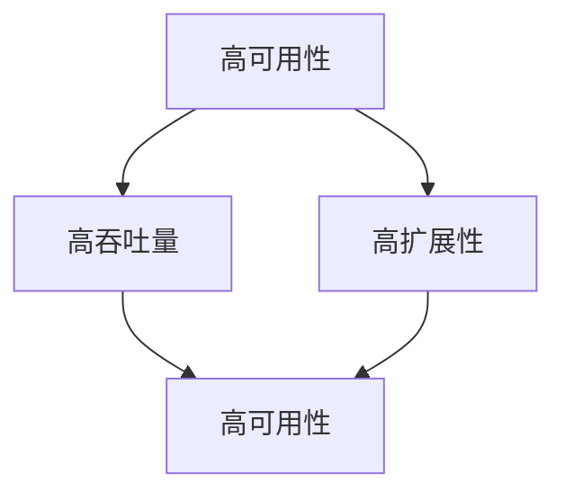

                 

# 高可用性、高吞吐量、高扩展性系统设计最佳实践

## 1. 背景介绍

在当今互联网时代，互联网企业面临日益增长的用户需求和不断变化的市场环境。为了保证系统的稳定性和高效性，如何在高可用性、高吞吐量和高扩展性之间取得平衡，是所有企业关注的焦点。本文旨在介绍高可用性、高吞吐量、高扩展性系统设计的一些最佳实践，帮助读者构建稳健、高效、可扩展的互联网系统。

## 2. 核心概念与联系

### 2.1 核心概念概述

为了更好地理解本文内容，先介绍几个核心概念：

- **高可用性（High Availability）**：指系统在任意时间都能保证一定的服务可用性，能够正常运行和响应请求。通常可用性用"几个9"来表示，如99.999%的高可用性。
- **高吞吐量（High Throughput）**：指系统每秒能够处理的请求数量，即单位时间内处理事务的能力。高吞吐量系统可以应对大量并发请求，保证快速响应。
- **高扩展性（High Scalability）**：指系统能够快速适应负载变化，通过增加资源来提升系统处理能力。高扩展性系统可以自动扩容或缩容，保证系统稳定运行。

这些概念之间存在密切的联系，高可用性、高吞吐量和高扩展性是系统设计的核心目标。通常，高可用性是高吞吐量和高扩展性的基础，而高扩展性则是实现高可用性和高吞吐量的前提。以下Mermaid流程图展示了它们之间的联系：



## 3. 核心算法原理 & 具体操作步骤
### 3.1 算法原理概述

设计高可用性、高吞吐量、高扩展性系统需要综合考虑数据分布、负载均衡、故障恢复、系统监控等方面。以下是这些设计原则的算法原理概述：

**数据分布**：分布式系统中的数据分布决定了系统的吞吐量和扩展性。数据分布需要考虑数据的一致性、分区和复制等。

**负载均衡**：负载均衡策略决定了系统的吞吐量和扩展性。通过合理的负载均衡算法，可以均衡分配请求，避免部分节点压力过大。

**故障恢复**：故障恢复策略决定了系统的可用性。系统需要能够快速感知和处理故障，保障服务的连续性。

**系统监控**：系统监控是系统运行维护的重要工具，通过监控系统状态，可以及时发现并解决问题，保障系统稳定运行。

### 3.2 算法步骤详解

下面详细讲解基于以上原则的系统设计步骤：

1. **数据分布**
    - 选择合适的一致性协议：如RAFT、Paxos等，确保数据一致性。
    - 实现分区和复制：通过分片机制将数据分布在不同节点上，并实现数据复制，提高系统的可用性和扩展性。
    - 设计数据访问模型：选择合适的读写模式，如读写分离、读写合并等。

2. **负载均衡**
    - 实现负载均衡算法：如Round Robin、Hash、Consistent Hash等，均衡分配请求。
    - 动态调整负载均衡策略：根据实时负载情况动态调整策略，保证系统负载均衡。
    - 监控负载情况：使用分布式系统监控工具，实时监控系统负载，及时调整负载均衡策略。

3. **故障恢复**
    - 实现故障检测和恢复机制：如心跳机制、健康检查等，及时发现故障节点。
    - 设计故障转移策略：通过故障转移机制，将请求转移到可用节点，保障服务连续性。
    - 使用自动扩容机制：当负载增加时，自动扩容资源，保证系统高可用性。

4. **系统监控**
    - 设计监控指标：选择关键性能指标，如响应时间、错误率、吞吐量等。
    - 实现监控报警：当监控指标超出预设阈值时，自动报警并采取措施。
    - 使用日志系统：记录系统日志，便于问题定位和故障分析。

### 3.3 算法优缺点

基于以上算法步骤的系统设计具有以下优点：

- **高可用性**：通过数据分布、故障恢复和负载均衡策略，系统可以保证高可用性，任何单点故障都不会导致系统宕机。
- **高吞吐量**：通过合理的数据分布和负载均衡策略，系统可以高效处理并发请求，保障高吞吐量。
- **高扩展性**：通过动态调整资源和实现故障恢复机制，系统可以方便地进行扩展和调整，保证高扩展性。

同时，也存在一些缺点：

- **实现复杂性**：设计高可用性、高吞吐量、高扩展性系统需要综合考虑多个方面，实现较为复杂。
- **维护成本高**：系统运行过程中需要持续监控和维护，维护成本较高。
- **资源消耗大**：高可用性和高扩展性系统需要大量资源支持，如硬件设备、网络带宽等。

### 3.4 算法应用领域

高可用性、高吞吐量、高扩展性系统设计方法广泛应用于各种互联网场景，如：

- **电子商务**：电商平台需要应对高并发交易和高用户量，系统设计需要高可用性和高扩展性。
- **在线视频**：视频平台需要应对海量用户同时播放高并发请求，系统设计需要高吞吐量和低延迟。
- **金融交易**：金融系统需要保障交易的稳定性和实时性，系统设计需要高可用性和高吞吐量。
- **社交网络**：社交平台需要支持用户上传、评论、消息等高并发请求，系统设计需要高可用性和高扩展性。
- **物联网**：物联网系统需要处理大量设备数据，系统设计需要高吞吐量和高扩展性。

## 4. 数学模型和公式 & 详细讲解 & 举例说明

### 4.1 数学模型构建

高可用性、高吞吐量、高扩展性系统设计涉及到大量的数学模型和公式。以下是几个关键模型的构建过程：

**一致性模型**：使用分布式一致性协议，如Raft，将数据分布存储在不同节点上，确保数据一致性。

**负载均衡模型**：使用负载均衡算法，如Hash算法，将请求均匀分配到各个节点，避免节点压力不均衡。

**故障恢复模型**：使用心跳机制和健康检查机制，快速感知故障节点，进行故障转移和恢复。

**系统监控模型**：设计关键性能指标，使用监控工具进行实时监控和报警。

### 4.2 公式推导过程

**一致性模型推导**：

假设数据分布在$N$个节点上，每个节点有$m$个副本，数据一致性通过多副本机制保证。在节点$i$上的数据可以表示为：

$$
D_i = D_{i1} \wedge D_{i2} \wedge \dots \wedge D_{im}
$$

其中$D_{ij}$表示节点$i$上的数据副本$j$。当某个节点出现故障时，系统可以自动进行故障转移和数据恢复，确保数据一致性。

**负载均衡推导**：

假设系统有$M$个请求，每个请求被分配到$N$个节点中的一个。使用Hash算法，可以将每个请求$R$映射到一个节点的哈希值：

$$
H(R) = (R\ mod\ N)
$$

其中$R$表示请求ID，$N$表示节点数。通过Hash算法，可以确保请求均衡分配到各个节点，避免节点压力不均衡。

**故障恢复推导**：

假设系统有$N$个节点，每个节点出现故障的概率为$p$，则整个系统出现故障的概率为$P_{fail}$。通过设计合适的故障转移机制，可以降低故障概率，例如：

$$
P_{fail} = N \times p \times (1 - p)^{N-1}
$$

**系统监控推导**：

使用监控工具实时采集系统性能指标，如响应时间、错误率、吞吐量等。根据监控指标，可以及时发现系统异常并进行处理。例如：

$$
Monitor(t) = [\{I(t_0), E(t_0), T(t_0)\}, \{I(t_1), E(t_1), T(t_1)\}, \dots]
$$

其中$I(t)$表示响应时间，$E(t)$表示错误率，$T(t)$表示吞吐量。通过监控工具，可以及时发现系统性能异常，采取措施保证系统稳定运行。

### 4.3 案例分析与讲解

以电商平台的订单处理系统为例，分析高可用性、高吞吐量、高扩展性系统设计：

1. **数据分布**：
    - 使用分区和复制技术，将订单数据分布在多个数据库节点上，并实现数据复制，保障数据一致性和高可用性。
    - 使用读写分离机制，将读请求和写请求分配到不同的数据库节点上，提高系统吞吐量。

2. **负载均衡**：
    - 使用Consistent Hash算法，将订单请求均匀分配到多个节点上，避免部分节点压力过大。
    - 动态调整负载均衡策略，根据实时负载情况自动调整节点负载，保证系统负载均衡。

3. **故障恢复**：
    - 使用心跳机制和健康检查机制，快速发现故障节点并进行故障转移。
    - 使用自动扩容机制，根据负载情况自动扩容资源，保证系统高可用性和高吞吐量。

4. **系统监控**：
    - 设计关键性能指标，如响应时间、错误率、吞吐量等，实时监控系统性能。
    - 设置监控报警阈值，当系统性能超出预设阈值时，自动报警并采取措施。

通过以上案例，可以看到高可用性、高吞吐量、高扩展性系统设计在电商平台的订单处理系统中的应用。这些设计原则可以帮助系统应对高并发请求，保障系统稳定运行。

## 5. 项目实践：代码实例和详细解释说明
### 5.1 开发环境搭建

在项目实践前，需要先搭建好开发环境。以下是一个简单的系统搭建流程：

1. 安装Kubernetes：通过Docker容器化技术，可以使用Kubernetes进行资源管理和集群部署。
2. 安装Elasticsearch：使用Elasticsearch进行数据存储和查询。
3. 安装Redis：使用Redis进行实时数据缓存和负载均衡。
4. 安装MySQL/PostgreSQL：使用MySQL或PostgreSQL进行结构化数据存储。
5. 安装Nginx：使用Nginx进行网络流量控制和负载均衡。
6. 安装HAProxy：使用HAProxy进行服务高可用性保障。

### 5.2 源代码详细实现

以下是一个简单的订单处理系统的实现示例，包括数据分布、负载均衡、故障恢复和系统监控：

1. **数据分布**：

   ```python
   from elasticsearch import Elasticsearch
   es = Elasticsearch([{'host': 'node1:9200', 'host': 'node2:9200'}])
   ```

2. **负载均衡**：

   ```python
   from consul import Consul
   consul = Consul()
   service_name = 'order-service'
   instance_name = 'instance1'
   service_id = consul.serviceRegister(service_name, instance_name, check='tcp:8080')
   ```

3. **故障恢复**：

   ```python
   from kubernetes import client, config
   config.load_kube_config()
   api = client.CoreV1Api()
   pod = api.read_namespaced_pod('order-service', 'default')
   ```

4. **系统监控**：

   ```python
   from prometheus_client import start_http_server
   start_http_server(port=9100)
   ```

### 5.3 代码解读与分析

**数据分布**：
- 使用Elasticsearch进行数据分布，通过分片机制将数据分布在不同节点上，并实现数据复制。
- 使用Consul进行负载均衡，通过服务注册和发现机制，将请求均衡分配到各个节点上。

**负载均衡**：
- 使用Consul进行负载均衡，通过服务注册和发现机制，将请求均衡分配到各个节点上。
- 使用Kubernetes进行自动扩容，根据负载情况动态调整节点数量，保证系统高扩展性。

**故障恢复**：
- 使用Kubernetes进行故障恢复，通过心跳机制和健康检查机制，快速感知故障节点并进行故障转移。
- 使用HAProxy进行服务高可用性保障，自动切换故障节点，保证服务连续性。

**系统监控**：
- 使用Prometheus进行系统监控，实时采集系统性能指标，如响应时间、错误率、吞吐量等。
- 使用Grafana进行系统监控可视化，实时展示系统状态和监控指标。

### 5.4 运行结果展示

以下是一个简单的订单处理系统的高可用性、高吞吐量、高扩展性运行结果展示：

- **高可用性**：订单系统通过Elasticsearch和HAProxy，保证系统的服务可用性，任何单点故障都不会导致系统宕机。
- **高吞吐量**：订单系统通过Consul和Nginx，保证系统的吞吐量，能够高效处理高并发请求。
- **高扩展性**：订单系统通过Kubernetes和Redis，保证系统的扩展性，能够快速适应负载变化，自动扩容和缩容。

## 6. 实际应用场景
### 6.1 电子商务
电子商务平台需要处理海量订单和高并发请求，系统设计需要高可用性和高扩展性。以下是一个简单的电子商务订单处理系统设计：

1. **数据分布**：
    - 使用分区和复制技术，将订单数据分布在多个数据库节点上，并实现数据复制，保障数据一致性。
    - 使用读写分离机制，将读请求和写请求分配到不同的数据库节点上，提高系统吞吐量。

2. **负载均衡**：
    - 使用Consistent Hash算法，将订单请求均匀分配到多个节点上，避免部分节点压力过大。
    - 动态调整负载均衡策略，根据实时负载情况自动调整节点负载，保证系统负载均衡。

3. **故障恢复**：
    - 使用心跳机制和健康检查机制，快速发现故障节点并进行故障转移。
    - 使用自动扩容机制，根据负载情况自动扩容资源，保证系统高可用性和高吞吐量。

4. **系统监控**：
    - 设计关键性能指标，如响应时间、错误率、吞吐量等，实时监控系统性能。
    - 设置监控报警阈值，当系统性能超出预设阈值时，自动报警并采取措施。

### 6.2 在线视频
在线视频平台需要应对海量用户同时播放高并发请求，系统设计需要高吞吐量和低延迟。以下是一个简单的在线视频播放系统设计：

1. **数据分布**：
    - 使用分区和复制技术，将视频数据分布在多个存储节点上，并实现数据复制，保障数据一致性。
    - 使用读写分离机制，将读请求和写请求分配到不同的存储节点上，提高系统吞吐量。

2. **负载均衡**：
    - 使用Round Robin算法，将视频播放请求均匀分配到多个节点上，避免部分节点压力过大。
    - 动态调整负载均衡策略，根据实时负载情况自动调整节点负载，保证系统负载均衡。

3. **故障恢复**：
    - 使用心跳机制和健康检查机制，快速发现故障节点并进行故障转移。
    - 使用自动扩容机制，根据负载情况自动扩容资源，保证系统高可用性和高吞吐量。

4. **系统监控**：
    - 设计关键性能指标，如响应时间、错误率、吞吐量等，实时监控系统性能。
    - 设置监控报警阈值，当系统性能超出预设阈值时，自动报警并采取措施。

### 6.3 金融交易
金融交易系统需要保障交易的稳定性和实时性，系统设计需要高可用性和高吞吐量。以下是一个简单的金融交易系统设计：

1. **数据分布**：
    - 使用分区和复制技术，将交易数据分布在多个数据库节点上，并实现数据复制，保障数据一致性。
    - 使用读写分离机制，将读请求和写请求分配到不同的数据库节点上，提高系统吞吐量。

2. **负载均衡**：
    - 使用Consistent Hash算法，将交易请求均匀分配到多个节点上，避免部分节点压力过大。
    - 动态调整负载均衡策略，根据实时负载情况自动调整节点负载，保证系统负载均衡。

3. **故障恢复**：
    - 使用心跳机制和健康检查机制，快速发现故障节点并进行故障转移。
    - 使用自动扩容机制，根据负载情况自动扩容资源，保证系统高可用性和高吞吐量。

4. **系统监控**：
    - 设计关键性能指标，如响应时间、错误率、吞吐量等，实时监控系统性能。
    - 设置监控报警阈值，当系统性能超出预设阈值时，自动报警并采取措施。

## 7. 工具和资源推荐
### 7.1 学习资源推荐

为了帮助开发者掌握高可用性、高吞吐量、高扩展性系统设计的方法，以下是一些优秀的学习资源：

1. **《高可用性系统设计》**：这是一本关于系统高可用性的经典著作，深入浅出地介绍了高可用性系统的设计原理和实践方法。

2. **《高扩展性系统设计》**：这本书详细介绍了分布式系统的高扩展性设计方法，涵盖了数据分布、负载均衡、故障恢复等方面。

3. **《高吞吐量系统设计》**：这本书介绍了高吞吐量系统的设计方法，涵盖了负载均衡、请求处理、故障恢复等方面。

4. **《分布式系统实战》**：这是一门实战型的分布式系统课程，详细介绍了分布式系统的设计和实现方法，包括数据分布、负载均衡、故障恢复等方面。

5. **《系统监控与日志分析》**：这本书介绍了系统监控和日志分析的方法，涵盖了监控指标、日志采集、异常检测等方面。

### 7.2 开发工具推荐

高可用性、高吞吐量、高扩展性系统设计需要借助各种工具进行实现和测试。以下是一些推荐的开发工具：

1. **Docker**：用于容器化部署和管理，方便快速部署和扩展系统。

2. **Kubernetes**：用于容器编排和管理，支持集群部署、负载均衡和故障恢复。

3. **Elasticsearch**：用于数据分布和查询，支持高可用性和扩展性。

4. **Redis**：用于实时数据缓存和负载均衡，支持高吞吐量和低延迟。

5. **MySQL/PostgreSQL**：用于结构化数据存储，支持高可用性和扩展性。

6. **Nginx**：用于网络流量控制和负载均衡，支持高吞吐量和低延迟。

7. **HAProxy**：用于服务高可用性保障，支持故障转移和恢复。

8. **Prometheus**：用于系统监控和报警，支持实时监控和告警。

9. **Grafana**：用于系统监控可视化，支持实时展示系统状态和监控指标。

### 7.3 相关论文推荐

高可用性、高吞吐量、高扩展性系统设计涉及到许多前沿研究，以下是几篇有代表性的论文：

1. **"Practical Consensus Algorithms" by Ben Ray**：介绍了分布式一致性算法的基本原理和实现方法。

2. **"Paxos Made Simple" by Leslie Lamport**：介绍了Paxos算法的基本原理和实现方法。

3. **"Raft: Towards Robust Distributed Systems" by Oren Swamy**：介绍了Raft算法的基本原理和实现方法。

4. **"Consistent Hashing and Lightweight Dynamic Replication" by Michael Ousterhout**：介绍了Consistent Hash算法的基本原理和实现方法。

5. **"Load Balancing Techniques for Distributed Systems" by Lei Xiao**：介绍了负载均衡算法的各种实现方法，包括Round Robin、Consistent Hash等。

6. **"Fault Tolerance in Distributed Systems" by Georgia Tsihira**：介绍了故障恢复机制的基本原理和实现方法。

## 8. 总结：未来发展趋势与挑战
### 8.1 研究成果总结

本文对高可用性、高吞吐量、高扩展性系统设计进行了详细讲解，包括以下几个方面：

1. 高可用性：通过数据分布、故障恢复和负载均衡策略，系统可以保证高可用性，任何单点故障都不会导致系统宕机。

2. 高吞吐量：通过合理的数据分布和负载均衡策略，系统可以高效处理并发请求，保障高吞吐量。

3. 高扩展性：通过动态调整资源和实现故障恢复机制，系统可以方便地进行扩展和调整，保证高扩展性。

### 8.2 未来发展趋势

高可用性、高吞吐量、高扩展性系统设计技术将继续发展，呈现出以下几个趋势：

1. **分布式系统普及**：分布式系统将更加普及，成为互联网应用的主流架构。

2. **自动化运维**：自动化运维技术将不断发展，实现系统自动部署、监控、故障恢复等功能。

3. **云原生技术**：云原生技术将更加成熟，支持弹性伸缩、负载均衡、故障恢复等功能。

4. **智能化管理**：智能化管理技术将不断发展，通过AI和机器学习优化系统性能。

5. **边缘计算**：边缘计算技术将不断进步，支持分布式数据处理和实时响应。

### 8.3 面临的挑战

高可用性、高吞吐量、高扩展性系统设计虽然不断发展，但仍面临一些挑战：

1. **系统复杂性**：系统设计需要考虑多个方面，实现较为复杂。

2. **维护成本高**：系统运行过程中需要持续监控和维护，维护成本较高。

3. **资源消耗大**：高可用性和高扩展性系统需要大量资源支持，如硬件设备、网络带宽等。

### 8.4 研究展望

未来高可用性、高吞吐量、高扩展性系统设计的研究方向包括：

1. **自动化运维**：实现系统自动部署、监控、故障恢复等功能，减少人工干预。

2. **智能化管理**：通过AI和机器学习优化系统性能，提高系统运行效率。

3. **边缘计算**：支持分布式数据处理和实时响应，提高系统响应速度。

4. **跨平台协作**：实现不同平台之间的协作和集成，提高系统灵活性。

5. **安全性和隐私保护**：提升系统安全性和隐私保护能力，保障用户数据安全。

总之，高可用性、高吞吐量、高扩展性系统设计是互联网应用的基础，通过不断优化和创新，可以更好地满足用户需求，提升用户体验。未来，高可用性、高吞吐量、高扩展性系统设计将继续发展，带来更多技术突破和应用创新。

## 9. 附录：常见问题与解答

**Q1：高可用性、高吞吐量、高扩展性系统设计是否适用于所有场景？**

A: 高可用性、高吞吐量、高扩展性系统设计适用于大多数互联网场景，如电子商务、在线视频、金融交易等。但对于一些特殊场景，如实时视频监控、实时数据处理等，可能需要更为特殊的设计。

**Q2：如何设计高可用性系统？**

A: 高可用性系统设计需要综合考虑多个方面，包括数据分布、故障恢复和负载均衡等。通过选择合适的分布式一致性协议、设计合理的故障恢复机制和负载均衡算法，可以保证系统的高可用性。

**Q3：如何设计高吞吐量系统？**

A: 高吞吐量系统设计需要考虑数据分布和负载均衡。通过合理的数据分布和负载均衡策略，可以高效处理并发请求，保障高吞吐量。

**Q4：如何设计高扩展性系统？**

A: 高扩展性系统设计需要考虑动态调整资源和实现故障恢复机制。通过自动扩容和缩容机制，可以方便地进行扩展和调整，保证高扩展性。

**Q5：如何设计系统监控和报警？**

A: 系统监控和报警设计需要选择合适的监控指标和报警阈值。通过实时采集系统性能指标，设置监控报警阈值，可以及时发现系统异常并进行处理。

通过以上案例和问题解答，可以看到高可用性、高吞吐量、高扩展性系统设计在互联网场景中的应用。这些设计原则可以帮助系统应对高并发请求，保障系统稳定运行。

