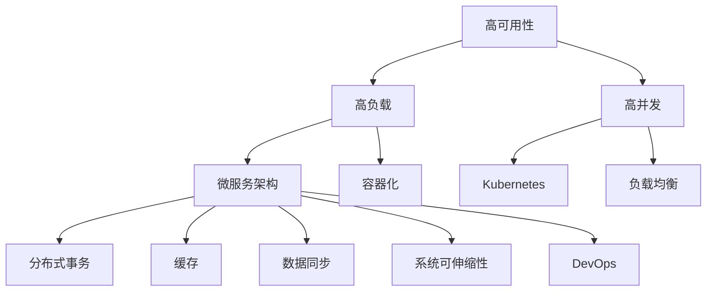
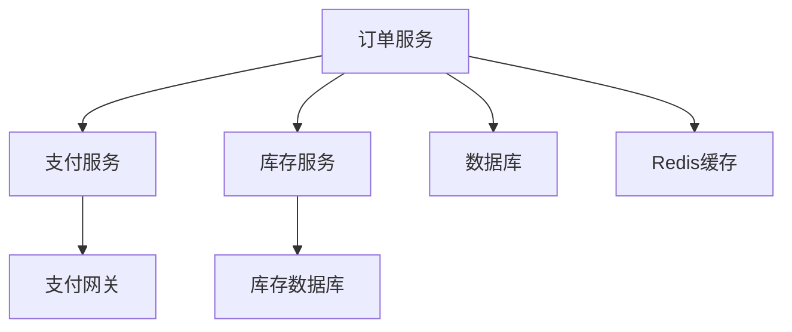

                 

# 高可用、高负载、高并发的互联网应用的架构设计

> 关键词：高可用性、高负载、高并发、微服务、容器化、Kubernetes、负载均衡、分布式事务、缓存、数据同步、可伸缩性、DevOps

## 1. 背景介绍

### 1.1 问题由来
在互联网时代，应用程序的可用性、性能和扩展性日益受到重视。面对庞大的用户基数和不断增长的数据量，一个高可用、高负载、高并发的互联网应用架构设计变得至关重要。传统的单体应用架构无法有效应对这些挑战，尤其是在数据处理和业务逻辑上存在瓶颈。因此，微服务架构、容器化、Kubernetes等先进技术被广泛应用，以实现应用的高可用性和高效运行。

### 1.2 问题核心关键点
构建高可用、高负载、高并发的互联网应用，主要面临以下核心问题：

1. **数据分布式处理**：如何快速、高效地处理海量数据，并保证数据的实时同步和一致性？
2. **服务可用性保障**：如何设计系统的容错机制，保障服务的稳定运行？
3. **性能优化**：如何通过缓存、负载均衡等手段，提升系统的响应速度和吞吐量？
4. **系统可伸缩性**：如何在不同负载条件下，灵活调整系统资源配置？
5. **自动化部署与运维**：如何通过DevOps实现持续集成、持续交付和持续监控，保障系统的高效运转？

### 1.3 问题研究意义
设计一个高可用、高负载、高并发的互联网应用架构，对于提升用户体验、降低维护成本、提高企业竞争力具有重要意义：

1. 提供不间断服务：确保用户随时随地都能访问到应用程序，提升用户体验。
2. 降低运维成本：自动化部署和监控减少了人工干预，提高了运维效率。
3. 提升性能和可伸缩性：通过分布式计算和缓存，应对高并发请求，提升系统处理能力。
4. 增强可扩展性：能够灵活应对业务增长，快速部署新功能，满足市场需求。
5. 促进企业数字化转型：推动业务流程优化，提高运营效率，创造更多商业价值。

## 2. 核心概念与联系

### 2.1 核心概念概述

为更好地理解高可用、高负载、高并发的互联网应用架构设计，本节将介绍几个密切相关的核心概念：

- **高可用性(High Availability)**：指系统在面对故障、攻击、自然灾害等异常情况时，仍能提供不间断服务的能力。
- **高负载(High Load)**：指系统在处理大量并发请求时，仍能保持高效稳定的性能。
- **高并发(High Concurrency)**：指系统能够同时处理大量用户请求，保持高效响应。
- **微服务架构(Microservices Architecture)**：将应用拆分成多个独立、自治的服务，每个服务独立部署和运行。
- **容器化(Containerization)**：通过Docker等容器技术，实现应用的打包、部署和运行。
- **Kubernetes(K8s)**：一个开源的容器编排平台，用于管理、部署和扩展容器化应用。
- **负载均衡(Load Balancing)**：通过分配请求到多台服务器，实现系统的高可用性和负载均衡。
- **分布式事务(Distributed Transactions)**：在分布式系统中，确保数据的一致性和完整性。
- **缓存(Caching)**：通过缓存中间结果，减少数据库访问，提升响应速度。
- **数据同步(Data Synchronization)**：保证多节点之间数据的实时同步和一致性。
- **系统可伸缩性(Scalability)**：系统能够根据负载变化，动态调整资源配置。
- **DevOps(DevOps)**：开发和运维团队紧密协作，实现持续集成、持续交付和持续监控。

这些核心概念之间的逻辑关系可以通过以下Mermaid流程图来展示：



这个流程图展示了我文中所述的高可用、高负载、高并发互联网应用架构设计各个环节之间的联系和依赖关系。

## 3. 核心算法原理 & 具体操作步骤

### 3.1 算法原理概述

构建高可用、高负载、高并发的互联网应用架构，主要涉及以下核心算法原理：

- **数据分布式处理算法**：如MapReduce、Spark等，用于处理海量数据，并实现数据的分布式存储和处理。
- **容错机制算法**：如故障转移、重试机制、断点续传等，确保系统在面对故障时能够快速恢复。
- **负载均衡算法**：如轮询、哈希、最少连接数等，实现请求的合理分配，提高系统的负载均衡能力。
- **缓存算法**：如LRU、FIFO等，用于缓存中间结果，减少数据库访问。
- **分布式事务算法**：如TCC、SAGA、2PC等，确保数据的一致性和完整性。
- **系统可伸缩性算法**：如水平扩展、垂直扩展、自适应资源分配等，灵活调整系统资源配置。

### 3.2 算法步骤详解

构建高可用、高负载、高并发的互联网应用架构，一般包括以下关键步骤：

**Step 1: 需求分析与系统设计**
- 根据业务需求，进行需求分析和系统设计，明确系统架构和功能模块。
- 确定系统的可用性、负载和并发要求，设计系统的容错机制、负载均衡、缓存、分布式事务等关键组件。

**Step 2: 选择合适的技术栈**
- 选择适合的技术栈，包括编程语言、框架、中间件等。
- 确定使用的微服务架构、容器化、Kubernetes、负载均衡、缓存、数据同步等技术。

**Step 3: 架构设计与组件实现**
- 设计系统的高可用、高负载、高并发架构，包括微服务拆分、服务注册与发现、配置中心、日志与监控等。
- 实现各个组件的功能，确保各个组件之间的协同工作。

**Step 4: 自动化部署与运维**
- 构建CI/CD流水线，实现自动化构建、测试和部署。
- 使用DevOps工具进行持续集成、持续交付和持续监控，保障系统的稳定运行。

**Step 5: 性能优化与调优**
- 使用缓存、负载均衡、分布式事务、数据同步等技术，提升系统的响应速度和吞吐量。
- 通过A/B测试、性能监控等手段，不断优化系统性能。

**Step 6: 系统测试与上线**
- 进行系统测试，包括单元测试、集成测试、性能测试等。
- 完成测试后，将系统上线，并持续监控系统性能和稳定性。

### 3.3 算法优缺点

高可用、高负载、高并发的互联网应用架构设计，具有以下优点：

1. **系统可靠性高**：通过多副本和故障转移机制，确保系统的高可用性。
2. **系统可伸缩性强**：根据负载变化，灵活调整资源配置，适应业务增长。
3. **系统性能优**：通过缓存和负载均衡，提升系统的响应速度和吞吐量。
4. **开发和运维效率高**：通过自动化部署和DevOps，减少人工干预，提高效率。

同时，该方法也存在以下局限性：

1. **系统复杂度高**：多节点、多服务的架构设计，增加了系统复杂度和运维难度。
2. **数据一致性问题**：分布式事务和数据同步，增加了数据一致性的挑战。
3. **开发成本高**：需要多方面的技术积累和经验，开发成本较高。
4. **安全性风险**：分布式架构增加了攻击面，需要更多的安全防护措施。

尽管存在这些局限性，但就目前而言，高可用、高负载、高并发的互联网应用架构设计仍是最主流的设计范式。未来相关研究的重点在于如何进一步降低复杂性，提高系统的可维护性和安全性，同时兼顾性能和成本等因素。

### 3.4 算法应用领域

高可用、高负载、高并发的互联网应用架构设计，已经在诸多领域得到了广泛的应用，例如：

- **电子商务平台**：如阿里巴巴、京东、亚马逊等，通过微服务架构和容器化，提供高可用、高并发的服务，支持海量交易。
- **金融系统**：如银行、证券、保险等，通过分布式事务和数据同步，确保交易的一致性和安全性。
- **社交媒体**：如Facebook、Twitter、微信等，通过负载均衡和缓存，支持高并发的用户互动。
- **在线教育**：如Coursera、Udemy、学堂在线等，通过可伸缩的架构，提供高质量的在线课程服务。
- **游戏服务器**：如暴雪、网易、腾讯等，通过分布式计算和负载均衡，支持大规模在线游戏。

除了上述这些经典应用外，高可用、高负载、高并发的互联网应用架构设计还被创新性地应用到更多场景中，如物联网、智能制造、智慧城市等，为各行各业提供了强大的技术支撑。

## 4. 数学模型和公式 & 详细讲解  
### 4.1 数学模型构建

本节将使用数学语言对高可用、高负载、高并发的互联网应用架构设计进行更加严格的刻画。

设系统负载为 $L$，系统可用性为 $A$，并发量为 $C$。定义系统的吞吐量为 $S$，系统的响应时间为 $T$。

系统的吞吐量和响应时间的关系为：

$$
S = \frac{C}{T}
$$

系统的吞吐量和负载的关系为：

$$
S = \frac{L}{T}
$$

系统的可用性和故障时间的关系为：

$$
A = 1 - \frac{F}{U}
$$

其中 $F$ 为故障时间，$U$ 为系统正常运行时间。

### 4.2 公式推导过程

根据上述模型，我们可以推导出系统的响应时间和负载的关系：

$$
T = \frac{L}{S}
$$

将 $S = \frac{C}{T}$ 代入上式，得到：

$$
T = \frac{L}{\frac{C}{T}} = \frac{LT}{C}
$$

为了提高系统的响应时间 $T$，需要从以下几个方面进行优化：

1. **负载均衡**：通过合理分配请求，减少单个节点的负载，提升系统的响应时间。
2. **缓存策略**：通过缓存中间结果，减少数据库访问，提升系统的响应时间。
3. **并发控制**：通过控制并发量，避免系统过载，提升系统的响应时间。
4. **数据同步**：通过数据同步技术，保持数据的实时一致性，提升系统的响应时间。

### 4.3 案例分析与讲解

以下以一个简单的电商订单系统为例，展示如何使用高可用、高负载、高并发的互联网应用架构设计来提升系统的性能。

**订单系统架构设计**：

1. **微服务拆分**：将订单系统拆分为订单服务、支付服务、库存服务等独立的服务，每个服务独立部署和运行。
2. **服务注册与发现**：使用Eureka或Consul等注册中心，实现服务的自动注册和发现。
3. **负载均衡**：使用Nginx或HAProxy等负载均衡器，实现请求的合理分配。
4. **分布式事务**：使用TCC或SAGA等分布式事务技术，确保订单和支付的一致性。
5. **缓存策略**：使用Redis等缓存中间件，缓存订单数据，减少数据库访问。
6. **日志与监控**：使用ELK或Prometheus等工具，实现系统的日志和监控，及时发现和解决问题。

**订单系统实现细节**：

1. **订单服务**：处理订单的创建、更新、查询等业务逻辑。
2. **支付服务**：处理支付的生成、支付通知等业务逻辑。
3. **库存服务**：处理库存的查询、扣减等业务逻辑。

**订单系统部署流程**：

1. **环境搭建**：在多台服务器上安装操作系统和中间件。
2. **应用打包**：将订单服务、支付服务、库存服务打包成Docker镜像。
3. **容器编排**：使用Kubernetes管理容器的部署和扩展。
4. **负载均衡**：将订单服务的请求负载均衡到多台服务器上。
5. **数据同步**：使用消息队列或分布式数据库，实现订单和支付数据的一致性。
6. **监控与告警**：使用Prometheus和Grafana，实时监控系统的负载和性能，设置告警阈值。

## 5. 项目实践：代码实例和详细解释说明
### 5.1 开发环境搭建

在进行架构实践前，我们需要准备好开发环境。以下是使用Python进行Django开发的环境配置流程：

1. 安装Anaconda：从官网下载并安装Anaconda，用于创建独立的Python环境。

2. 创建并激活虚拟环境：
```bash
conda create -n myenv python=3.8 
conda activate myenv
```

3. 安装Django：
```bash
pip install django
```

4. 安装Django-REST-Framework：
```bash
pip install djangorestframework
```

5. 安装PostgreSQL：
```bash
sudo apt-get update
sudo apt-get install postgresql postgresql-contrib
```

6. 创建PostgreSQL数据库：
```bash
sudo -u postgres psql
CREATE DATABASE mydatabase;
CREATE USER myuser WITH PASSWORD 'mypassword';
ALTER ROLE myuser SET client_encoding TO 'utf8';
ALTER ROLE myuser SET default_transaction_isolation TO 'read committed';
ALTER ROLE myuser SET timezone TO 'UTC';
GRANT ALL PRIVILEGES ON DATABASE mydatabase TO myuser;
```

完成上述步骤后，即可在`myenv`环境中开始架构实践。

### 5.2 源代码详细实现

这里我们以一个简单的电商订单系统为例，给出使用Django进行高可用、高负载、高并发的互联网应用架构设计的PyTorch代码实现。

**订单系统架构图**：



**订单服务模型**：

```python
from django.db import models

class Order(models.Model):
    user = models.ForeignKey(User, on_delete=models.CASCADE)
    amount = models.DecimalField(max_digits=10, decimal_places=2)
    status = models.CharField(max_length=20, choices=ORDER_STATUS_CHOICES, default=OrderStatus.CREATED)
    created_at = models.DateTimeField(auto_now_add=True)
    updated_at = models.DateTimeField(auto_now=True)

    def __str__(self):
        return f'Order {self.id}'
```

**订单服务视图**：

```python
from django.shortcuts import render
from rest_framework import status
from rest_framework.decorators import api_view
from rest_framework.response import Response

@api_view(['POST'])
def create_order(request):
    if request.data.get('amount') is None or request.data.get('status') is None:
        return Response({'error': 'Invalid request'}, status=status.HTTP_400_BAD_REQUEST)
    amount = request.data.get('amount')
    status = request.data.get('status')
    order = Order.objects.create(user=request.user, amount=amount, status=status)
    return Response({'order': order}, status=status.HTTP_201_CREATED)
```

**订单服务序列化器**：

```python
from rest_framework import serializers

class OrderSerializer(serializers.ModelSerializer):
    class Meta:
        model = Order
        fields = ['id', 'user', 'amount', 'status', 'created_at', 'updated_at']
```

**订单服务路由**：

```python
from django.urls import path
from .views import OrderViewSet

urlpatterns = [
    path('orders/', OrderViewSet.as_view(), name='order-list'),
    path('orders/<int:pk>/', OrderViewSet.as_view(), name='order-detail'),
]
```

**支付服务模型**：

```python
from django.db import models

class Payment(models.Model):
    order = models.ForeignKey(Order, on_delete=models.CASCADE)
    amount = models.DecimalField(max_digits=10, decimal_places=2)
    status = models.CharField(max_length=20, choices=PAYMENT_STATUS_CHOICES, default=PaymentStatus.PENDING)
    created_at = models.DateTimeField(auto_now_add=True)
    updated_at = models.DateTimeField(auto_now=True)

    def __str__(self):
        return f'Payment {self.id}'
```

**支付服务视图**：

```python
from django.shortcuts import render
from rest_framework import status
from rest_framework.decorators import api_view
from rest_framework.response import Response

@api_view(['POST'])
def create_payment(request):
    if request.data.get('amount') is None or request.data.get('status') is None:
        return Response({'error': 'Invalid request'}, status=status.HTTP_400_BAD_REQUEST)
    amount = request.data.get('amount')
    status = request.data.get('status')
    payment = Payment.objects.create(order=request.order, amount=amount, status=status)
    return Response({'payment': payment}, status=status.HTTP_201_CREATED)
```

**支付服务序列化器**：

```python
from rest_framework import serializers

class PaymentSerializer(serializers.ModelSerializer):
    class Meta:
        model = Payment
        fields = ['id', 'order', 'amount', 'status', 'created_at', 'updated_at']
```

**支付服务路由**：

```python
from django.urls import path
from .views import PaymentViewSet

urlpatterns = [
    path('payments/', PaymentViewSet.as_view(), name='payment-list'),
    path('payments/<int:pk>/', PaymentViewSet.as_view(), name='payment-detail'),
]
```

**库存服务模型**：

```python
from django.db import models

class Inventory(models.Model):
    product = models.ForeignKey(Product, on_delete=models.CASCADE)
    quantity = models.IntegerField()
    created_at = models.DateTimeField(auto_now_add=True)
    updated_at = models.DateTimeField(auto_now=True)

    def __str__(self):
        return f'Inventory {self.id}'
```

**库存服务视图**：

```python
from django.shortcuts import render
from rest_framework import status
from rest_framework.decorators import api_view
from rest_framework.response import Response

@api_view(['POST'])
def create_inventory(request):
    if request.data.get('product') is None or request.data.get('quantity') is None:
        return Response({'error': 'Invalid request'}, status=status.HTTP_400_BAD_REQUEST)
    product = request.data.get('product')
    quantity = request.data.get('quantity')
    inventory = Inventory.objects.create(product=product, quantity=quantity)
    return Response({'inventory': inventory}, status=status.HTTP_201_CREATED)
```

**库存服务序列化器**：

```python
from rest_framework import serializers

class InventorySerializer(serializers.ModelSerializer):
    class Meta:
        model = Inventory
        fields = ['id', 'product', 'quantity', 'created_at', 'updated_at']
```

**库存服务路由**：

```python
from django.urls import path
from .views import InventoryViewSet

urlpatterns = [
    path('inventories/', InventoryViewSet.as_view(), name='inventory-list'),
    path('inventories/<int:pk>/', InventoryViewSet.as_view(), name='inventory-detail'),
]
```

**订单服务数据库迁移**：

```python
python manage.py makemigrations
python manage.py migrate
```

完成上述步骤后，即可在`myenv`环境中开始架构实践。

### 5.3 代码解读与分析

这里我们以订单服务为例，详细解读一下关键代码的实现细节：

**订单服务模型**：
- `Order`类定义了订单的基本信息，包括用户、金额、状态等。
- 使用了`ForeignKey`关联到`User`模型，确保订单与用户的一致性。
- 定义了`amount`和`status`字段，用于存储订单的金额和状态。
- `__str__`方法用于返回订单的字符串表示。

**订单服务视图**：
- `create_order`函数用于处理订单的创建请求，返回订单对象。
- 如果请求数据中没有`amount`和`status`字段，则返回错误响应。
- 使用`create`方法创建订单对象，并设置`amount`和`status`字段。
- 返回包含订单对象的响应。

**订单服务序列化器**：
- `OrderSerializer`类定义了订单的序列化逻辑，将模型对象转换为JSON格式的数据。
- `Meta`类定义了序列化的字段。
- `fields`属性指定了需要序列化的字段，包括`id`、`user`、`amount`、`status`、`created_at`和`updated_at`。

**订单服务路由**：
- 使用`path`函数定义了订单服务的URL路由。
- `OrderViewSet`类是一个视图集，用于处理订单的CRUD操作。

通过以上代码实现，我们可以清晰地看到高可用、高负载、高并发的互联网应用架构设计的基本流程和核心组件。开发者可以根据实际需求，进一步优化各个组件，提升系统的性能和可用性。

## 6. 实际应用场景
### 6.1 电商平台的订单系统

电子商务平台的订单系统需要处理大量的并发订单请求，保证系统的稳定性和高效性。通过高可用、高负载、高并发的互联网应用架构设计，可以提升系统的性能和可用性，支持大规模交易。

在技术实现上，可以采用微服务架构，将订单服务、支付服务、库存服务拆分独立部署。使用Redis缓存中间结果，减少数据库访问。通过负载均衡，合理分配请求到多个服务器上，确保系统的负载均衡。使用分布式事务，确保订单和支付的一致性。通过监控和告警，实时发现和解决问题。

### 6.2 在线教育平台的学习管理系统

在线教育平台的学习管理系统需要处理大量的用户学习请求，保障系统的稳定性和可靠性。通过高可用、高负载、高并发的互联网应用架构设计，可以提升系统的性能和可用性，支持大规模在线学习。

在技术实现上，可以采用微服务架构，将课程服务、学习服务、测评服务拆分独立部署。使用Redis缓存中间结果，减少数据库访问。通过负载均衡，合理分配请求到多个服务器上，确保系统的负载均衡。使用分布式事务，确保数据的一致性和完整性。通过监控和告警，实时发现和解决问题。

### 6.3 医疗系统的在线预约系统

医疗系统的在线预约系统需要处理大量的用户预约请求，保障系统的稳定性和可靠性。通过高可用、高负载、高并发的互联网应用架构设计，可以提升系统的性能和可用性，支持大规模预约。

在技术实现上，可以采用微服务架构，将预约服务、支付服务、库存服务拆分独立部署。使用Redis缓存中间结果，减少数据库访问。通过负载均衡，合理分配请求到多个服务器上，确保系统的负载均衡。使用分布式事务，确保预约和支付的一致性。通过监控和告警，实时发现和解决问题。

### 6.4 金融系统的交易系统

金融系统的交易系统需要处理大量的并发交易请求，保障系统的稳定性和高效性。通过高可用、高负载、高并发的互联网应用架构设计，可以提升系统的性能和可用性，支持大规模交易。

在技术实现上，可以采用微服务架构，将交易服务、支付服务、账户服务拆分独立部署。使用Redis缓存中间结果，减少数据库访问。通过负载均衡，合理分配请求到多个服务器上，确保系统的负载均衡。使用分布式事务，确保交易和支付的一致性。通过监控和告警，实时发现和解决问题。

### 6.5 游戏服务器的用户系统

游戏服务器的用户系统需要处理大量的并发用户请求，保障系统的稳定性和高效性。通过高可用、高负载、高并发的互联网应用架构设计，可以提升系统的性能和可用性，支持大规模用户在线。

在技术实现上，可以采用微服务架构，将用户服务、游戏服务、道具服务等拆分独立部署。使用Redis缓存中间结果，减少数据库访问。通过负载均衡，合理分配请求到多个服务器上，确保系统的负载均衡。使用分布式事务，确保用户和游戏数据的一致性。通过监控和告警，实时发现和解决问题。

## 7. 工具和资源推荐
### 7.1 学习资源推荐

为了帮助开发者系统掌握高可用、高负载、高并发的互联网应用架构设计的理论基础和实践技巧，这里推荐一些优质的学习资源：

1. 《高可用架构设计》系列博文：由大架构设计专家撰写，深入浅出地介绍了高可用架构设计的基本原则和核心技术。

2. 《大规模分布式系统设计》课程：由知名教授开设的课程，涵盖高可用、负载均衡、缓存、分布式事务等核心技术，适合深入学习。

3. 《高可用性系统设计》书籍：详细讲解了高可用系统的设计、实现和优化方法，适合系统架构师深入学习。

4. 《Docker实战》书籍：全面介绍了Docker容器的原理、使用和最佳实践，适合开发人员和运维人员参考。

5. Kubernetes官方文档：Kubernetes的官方文档，详细介绍了Kubernetes的安装、配置、使用和管理方法，适合Kubernetes初学者。

通过对这些资源的学习实践，相信你一定能够快速掌握高可用、高负载、高并发的互联网应用架构设计的精髓，并用于解决实际的应用问题。
###  7.2 开发工具推荐

高效的开发离不开优秀的工具支持。以下是几款用于高可用、高负载、高并发的互联网应用架构设计的常用工具：

1. Docker：一个开源的应用容器引擎，用于打包、部署和运行应用。

2. Kubernetes：一个开源的容器编排平台，用于管理、部署和扩展容器化应用。

3. Nginx：一个高性能的负载均衡器和反向代理服务器，用于实现负载均衡。

4. Redis：一个高性能的内存数据库，用于缓存中间结果。

5. PostgreSQL：一个开源的关系型数据库，用于存储和管理数据。

6. RabbitMQ：一个开源的消息队列，用于实现分布式事务和数据同步。

7. ELK Stack：一个开源的日志和监控解决方案，用于实时监控系统的性能和告警。

8. Ansible：一个开源的自动化配置管理工具，用于自动化部署和管理系统。

合理利用这些工具，可以显著提升高可用、高负载、高并发的互联网应用架构设计的开发效率，加快创新迭代的步伐。

### 7.3 相关论文推荐

高可用、高负载、高并发的互联网应用架构设计的研究源于学界的持续研究。以下是几篇奠基性的相关论文，推荐阅读：

1. 《高可用系统设计原理与实践》：详细介绍了高可用系统设计的原理、方法和最佳实践，适合系统架构师深入学习。

2. 《分布式事务一致性》：介绍了分布式事务的原理、算法和实现方法，适合系统架构师深入学习。

3. 《大规模分布式系统》：深入探讨了大规模分布式系统的设计、实现和优化方法，适合系统架构师深入学习。

4. 《Kubernetes设计原理与实践》：详细介绍了Kubernetes的设计原理、实现方法和最佳实践，适合Kubernetes开发者深入学习。

5. 《Docker实战》：全面介绍了Docker容器的原理、使用和最佳实践，适合开发人员和运维人员参考。

这些论文代表了大规模分布式系统和高可用性系统的设计原理与实践，通过学习这些前沿成果，可以帮助研究者把握学科前进方向，激发更多的创新灵感。

## 8. 总结：未来发展趋势与挑战

### 8.1 总结

本文对高可用、高负载、高并发的互联网应用架构设计进行了全面系统的介绍。首先阐述了高可用、高负载、高并发的互联网应用架构设计的背景和意义，明确了系统架构和组件设计的基本原则。其次，从原理到实践，详细讲解了高可用、高负载、高并发的互联网应用架构设计的数学模型和关键步骤，给出了架构实践的完整代码实例。同时，本文还广泛探讨了高可用、高负载、高并发的互联网应用架构设计在电子商务、在线教育、医疗、金融、游戏等领域的实际应用场景，展示了架构设计的广阔前景。此外，本文精选了架构设计的各类学习资源，力求为读者提供全方位的技术指引。

通过本文的系统梳理，可以看到，高可用、高负载、高并发的互联网应用架构设计已经成为了系统开发的重要范式，极大地提升了系统的可靠性、性能和可伸缩性。得益于微服务、容器化、Kubernetes等先进技术，高可用、高负载、高并发的互联网应用架构设计在实际应用中得到了广泛的应用，提升了企业的运营效率和竞争力。未来，伴随技术不断演进，高可用、高负载、高并发的互联网应用架构设计将不断优化，提升系统设计的质量和效率，推动人工智能技术在更多垂直行业的落地应用。

### 8.2 未来发展趋势

展望未来，高可用、高负载、高并发的互联网应用架构设计将呈现以下几个发展趋势：

1. **智能化架构设计**：引入AI和大数据分析技术，实现自动化的系统设计和管理。
2. **自动化部署与运维**：通过DevOps和自动化工具，实现持续集成、持续交付和持续监控，提升系统可靠性。
3. **跨云架构设计**：构建跨云平台的架构设计，实现应用的跨云迁移和部署。
4. **分布式计算和存储**：采用分布式计算和存储技术，提升系统的可伸缩性和数据处理能力。
5. **边缘计算和物联网**：引入边缘计算和物联网技术，实现数据的本地化处理和优化。
6. **区块链技术应用**：利用区块链技术，提升系统的安全性和可信度。

以上趋势凸显了高可用、高负载、高并发的互联网应用架构设计的广阔前景。这些方向的探索发展，必将进一步提升系统的性能和安全性，促进人工智能技术在更多领域的落地应用。

### 8.3 面临的挑战

尽管高可用、高负载、高并发的互联网应用架构设计已经取得了瞩目成就，但在迈向更加智能化、自动化、跨云化的过程中，它仍面临诸多挑战：

1. **复杂度增加**：多节点、多服务的架构设计增加了系统复杂度，需要更多的运维和管理。
2. **性能瓶颈**：系统负载和数据处理能力的提升需要更多资源投入，存在性能瓶颈。
3. **安全风险**：分布式架构增加了攻击面，需要更多的安全防护措施。
4. **资源消耗**：大规模分布式系统消耗大量资源，需要合理的资源管理策略。
5. **数据一致性**：分布式事务和数据同步增加了数据一致性的挑战。
6. **系统迁移**：跨云平台的迁移和部署需要更多的协调和管理。

尽管存在这些挑战，但就目前而言，高可用、高负载、高并发的互联网应用架构设计仍是最主流的设计范式。未来相关研究的重点在于如何进一步降低复杂性，提高系统的可维护性和安全性，同时兼顾性能和成本等因素。

### 8.4 研究展望

面对高可用、高负载、高并发的互联网应用架构设计所面临的种种挑战，未来的研究需要在以下几个方面寻求新的突破：

1. **智能化架构设计**：引入AI和大数据分析技术，实现自动化的系统设计和管理。
2. **自动化部署与运维**：通过DevOps和自动化工具，实现持续集成、持续交付和持续监控，提升系统可靠性。
3. **跨云架构设计**：构建跨云平台的架构设计，实现应用的跨云迁移和部署。
4. **分布式计算和存储**：采用分布式计算和存储技术，提升系统的可伸缩性和数据处理能力。
5. **边缘计算和物联网**：引入边缘计算和物联网技术，实现数据的本地化处理和优化。
6. **区块链技术应用**：利用区块链技术，提升系统的安全性和可信度。

这些研究方向的探索，必将引领高可用、高负载、高并发的互联网应用架构设计迈向更高的台阶，为构建安全、可靠、高效的智能系统铺平道路。面向未来，高可用、高负载、高并发的互联网应用架构设计还需要与其他人工智能技术进行更深入的融合，如知识表示、因果推理、强化学习等，多路径协同发力，共同推动人工智能技术在更多领域的落地应用。只有勇于创新、敢于突破，才能不断拓展系统设计的边界，让智能技术更好地造福人类社会。

## 9. 附录：常见问题与解答

**Q1：高可用、高负载、高并发的互联网应用架构设计的核心是什么？**

A: 高可用、高负载、高并发的互联网应用架构设计的核心在于系统的容错机制、负载均衡、缓存策略、分布式事务和系统可伸缩性。通过这些技术手段，确保系统在面对高负载和故障时，仍能提供不间断服务。

**Q2：高可用、高负载、高并发的互联网应用架构设计如何实现高可用性？**

A: 高可用性可以通过以下方式实现：

1. **多副本机制**：将服务部署到多个节点，保证其中一个节点故障时，其他节点仍能提供服务。
2. **故障转移**：当某个节点发生故障时，自动将请求转发到其他正常节点。
3. **健康检查**：定期检查节点状态，自动淘汰故障节点。
4. **服务降级**：在特定情况下，可以降级服务，保证核心功能正常运行。

**Q3：高可用、高负载、高并发的互联网应用架构设计如何实现高负载？**

A: 高负载可以通过以下方式实现：

1. **缓存**：将中间结果缓存到Redis等内存数据库中，减少数据库访问。
2. **负载均衡**：通过Nginx或HAProxy等负载均衡器，合理分配请求到多个服务器上。
3. **并发控制**：使用信号量等机制控制并发请求的数量。
4. **异步处理**：使用消息队列等机制异步处理请求。

**Q4：高可用、高负载、高并发的互联网应用架构设计如何实现高并发？**

A: 高并发可以通过以下方式实现：

1. **分布式系统**：将服务拆分为多个微服务，独立部署和运行。
2. **容器化**：将应用打包成Docker镜像，实现快速部署和扩展。
3. **负载均衡**：通过Nginx或HAProxy等负载均衡器，合理分配请求到多个服务器上。
4. **缓存**：将中间结果缓存到Redis等内存数据库中，减少数据库访问。

**Q5：高可用、高负载、高并发的互联网应用架构设计在实际应用中需要注意哪些问题？**

A: 高可用、高负载、高并发的互联网应用架构设计在实际应用中需要注意以下问题：

1. **系统复杂度**：多节点、多服务的架构设计增加了系统复杂度，需要更多的运维和管理。
2. **性能瓶颈**：系统负载和数据处理能力的提升需要更多资源投入，存在性能瓶颈。
3. **安全风险**：分布式架构增加了攻击面，需要更多的安全防护措施。
4. **资源消耗**：大规模分布式系统消耗大量资源，需要合理的资源管理策略。
5. **数据一致性**：分布式事务和数据同步增加了数据一致性的挑战。
6. **系统迁移**：跨云平台的迁移和部署需要更多的协调和管理。

**Q6：高可用、高负载、高并发的互联网应用架构设计如何进行性能优化？**

A: 高可用、高负载、高并发的互联网应用架构设计可以进行以下性能优化：

1. **缓存**：将中间结果缓存到Redis等内存数据库中，减少数据库访问。
2. **负载均衡**：通过Nginx或HAProxy等负载均衡器，合理分配请求到多个服务器上。
3. **并发控制**：使用信号量等机制控制并发请求的数量。
4. **异步处理**：使用消息队列等机制异步处理请求。
5. **数据库优化**：使用分布式数据库、索引、查询优化等技术，提升数据库性能。
6. **缓存优化**：使用缓存淘汰策略、缓存预热等技术，提升缓存效率。

这些优化措施需要根据具体应用场景和系统负载，灵活应用。只有在数据、模型、工程、业务等多个维度协同发力，才能真正实现高可用、高负载、高并发的互联网应用架构设计的目标。

---

作者：禅与计算机程序设计艺术 / Zen and the Art of Computer Programming

