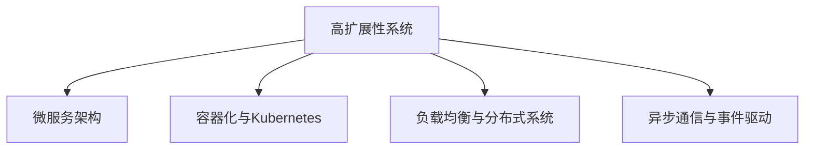

                 

## 1. 背景介绍

在数字化转型的浪潮下，企业面临着日益增长的业务需求和数据量，对于系统的高扩展性和高可用性提出了更高的要求。如何构建一个能支持快速扩展和灵活部署的系统，是现代软件开发中一个重要且复杂的挑战。本文将从设计原则、架构选型、技术手段等几个方面，深入探讨高扩展性系统的设计策略，希望能为相关从业人员提供一些参考。

## 2. 核心概念与联系

### 2.1 核心概念概述

为使读者更好地理解高扩展性系统的设计策略，本节将介绍几个关键概念：

- **高扩展性系统(High-Scalable System)**：指能够通过增加资源实现系统性能线性或近似线性增长的系统，能够支持大规模并发用户、海量数据处理、灵活部署等特性。
- **微服务架构(Microservice Architecture)**：将一个大型的、复杂的系统拆分为多个小的、相互独立的微服务模块，每个微服务负责具体的业务功能，通过服务间通信协作完成整体功能。
- **容器化与Kubernetes**：容器化是将应用打包进一个独立的运行环境（容器）中，使得应用在不同环境中具有相同的运行行为；Kubernetes则是一个开源的容器编排系统，用于管理和调度容器化应用。
- **负载均衡与分布式系统**：负载均衡是指通过多个服务器共同分担负载，提升系统的并发处理能力和可靠性；分布式系统则是由多个独立的计算节点通过网络相互协作，形成更大规模和更高性能的系统。
- **异步通信与事件驱动**：异步通信指在系统内部使用非阻塞、异步的方式进行通信，提高系统的响应速度和吞吐量；事件驱动则是指系统通过事件机制实现不同模块之间的解耦，提升系统的灵活性和可扩展性。

这些核心概念之间的逻辑关系可以通过以下Mermaid流程图来展示：



这个流程图展示了大规模系统设计中核心概念及其之间的关系：

1. **高扩展性系统**：通过将系统拆分为多个微服务、采用容器化部署、实现负载均衡和分布式架构，并通过异步通信和事件驱动的方式，使系统能够实现高性能和高灵活性。
2. **微服务架构**：将系统拆分为多个独立的、可复用的微服务，提升系统的可维护性和可扩展性。
3. **容器化与Kubernetes**：容器化技术通过创建独立的运行环境，使得应用在不同环境中的行为一致，Kubernetes则提供强大的容器编排能力，支持应用的自动部署和弹性伸缩。
4. **负载均衡与分布式系统**：通过将请求分发到多个服务器上，实现系统的负载均衡和扩展性，分布式系统则通过多个独立计算节点协同工作，实现更大规模和更高性能的系统。
5. **异步通信与事件驱动**：通过异步通信提高系统的响应速度和吞吐量，通过事件驱动的方式实现模块间解耦，提升系统的灵活性和可扩展性。

这些概念共同构成了高扩展性系统的设计基础，帮助开发者构建能够应对未来挑战的现代化系统。

## 3. 核心算法原理 & 具体操作步骤

### 3.1 算法原理概述

高扩展性系统的设计策略主要基于微服务架构、容器化与Kubernetes、负载均衡与分布式系统、异步通信与事件驱动等核心技术。其核心思想是通过这些技术手段，将系统拆分为多个独立的、可复用的服务模块，并通过编排、负载均衡和异步通信等方式，实现系统的高性能和高可扩展性。

### 3.2 算法步骤详解

以下是构建高扩展性系统的一般步骤：

**Step 1: 系统规划与需求分析**
- 确定系统的业务目标和关键需求。
- 识别系统的关键组件和非关键组件。
- 确定系统的高可用性和可扩展性目标。

**Step 2: 微服务架构设计**
- 将系统拆分为多个独立的、可复用的微服务模块。
- 确定各个微服务的功能和边界。
- 设计微服务之间的通信协议和服务接口。

**Step 3: 容器化与Kubernetes部署**
- 选择适合的应用和技术栈，将其容器化。
- 在Kubernetes集群上部署容器化应用，实现自动扩缩容。
- 配置资源限制和负载均衡策略。

**Step 4: 负载均衡与分布式系统实现**
- 在Kubernetes集群内部实现负载均衡。
- 通过容器编排和调度，实现服务的自动扩展和缩容。
- 实现跨容器的数据共享和通信。

**Step 5: 异步通信与事件驱动机制**
- 在微服务之间使用消息队列或事件驱动的方式实现异步通信。
- 设计事件处理机制，实现模块之间的解耦和协同。
- 实现异常处理和错误恢复机制。

**Step 6: 测试与优化**
- 进行单元测试、集成测试和性能测试。
- 优化代码和架构，提升系统的性能和可靠性。
- 定期监控和调优系统，确保高扩展性。

### 3.3 算法优缺点

高扩展性系统设计策略具有以下优点：
- 系统模块化：每个微服务模块独立运行，易于维护和扩展。
- 高性能：通过异步通信和事件驱动机制，提高系统的响应速度和吞吐量。
- 高可扩展性：通过容器化和Kubernetes编排，实现自动扩缩容和弹性伸缩。
- 高可用性：通过负载均衡和分布式系统，提升系统的可靠性和故障容忍度。

同时，该方法也存在一定的局限性：
- 架构复杂：微服务架构带来了系统架构的复杂性，增加了设计和管理成本。
- 通信开销：异步通信和事件驱动机制带来了额外的通信开销，可能影响系统的响应速度。
- 系统集成难度：不同微服务模块之间的集成和协调，可能带来额外的复杂性和集成难度。
- 资源利用率：分布式系统可能存在资源利用率不高的问题，需要合理的资源调度和管理。

尽管存在这些局限性，但就目前而言，高扩展性系统设计策略仍是最主流的大规模系统设计范式。未来相关研究的重点在于如何进一步降低架构复杂性，提高系统的灵活性和可扩展性，同时兼顾高性能和可维护性。

### 3.4 算法应用领域

高扩展性系统的设计策略已经在多个领域得到了广泛应用，包括但不限于：

- **电子商务平台**：通过微服务架构和容器化部署，支持海量用户交易和个性化推荐。
- **金融交易系统**：通过分布式系统和负载均衡，实现高并发和高可靠的交易处理。
- **社交媒体平台**：通过异步通信和事件驱动机制，支持高吞吐量和低延迟的内容分发。
- **大数据处理系统**：通过分布式存储和计算，处理海量数据，实现高扩展性和高性能。
- **物联网系统**：通过微服务架构和异步通信，支持大规模设备和数据的协同工作。

除了上述这些经典应用外，高扩展性系统设计策略也在更多场景中得到应用，如智能城市管理、医疗健康、工业制造等，为各行各业带来了新的数字化转型机会。

## 4. 数学模型和公式 & 详细讲解 & 举例说明

### 4.1 数学模型构建

为了更好地理解高扩展性系统设计的数学基础，本节将引入一些基本的数学模型和公式。

假设一个典型的N层微服务架构，其中第 $i$ 层有 $n_i$ 个服务实例，每个服务实例的吞吐量为 $c_i$，则总吞吐量为：

$$
T = \sum_{i=1}^N n_i c_i
$$

其中，$n_i$ 为第 $i$ 层的服务实例数，$c_i$ 为每个服务实例的吞吐量。

### 4.2 公式推导过程

假设系统的总负载为 $L$，每个服务实例的负载均衡权重为 $w_i$，则每个服务实例的实际负载为 $L w_i / \sum_{i=1}^N w_i$。当系统负载均衡时，每个服务实例的负载相等，即 $w_i = 1/N$。此时，总吞吐量为：

$$
T = L \sum_{i=1}^N \frac{n_i c_i}{N}
$$

令 $k_i = \frac{c_i}{n_i}$，即每个服务实例的平均吞吐量，则上式可以简化为：

$$
T = \frac{L}{N} \sum_{i=1}^N k_i
$$

### 4.3 案例分析与讲解

考虑一个包含三层微服务的系统，各层的平均吞吐量和实例数如下表所示：

| 层数 | 平均吞吐量 $k_i$ | 实例数 $n_i$ |
|------|-----------------|-------------|
| 1    | 1               | 5           |
| 2    | 2               | 3           |
| 3    | 0.5             | 10          |

假设系统的总负载 $L = 30$，则各层的实际负载和总吞吐量计算如下：

| 层数 | 实际负载 $L w_i$ | 总吞吐量 $T$ |
|------|-----------------|-------------|
| 1    | 5               | 10          |
| 2    | 10              | 20          |
| 3    | 5               | 10          |
| 总   | 20              | 40          |

可以看出，通过合理分配资源和实现负载均衡，系统的总吞吐量可以显著提升。

## 5. 项目实践：代码实例和详细解释说明

### 5.1 开发环境搭建

在进行高扩展性系统设计实践前，我们需要准备好开发环境。以下是使用Python和Docker容器进行高扩展性系统设计的环境配置流程：

1. 安装Docker：从官网下载并安装Docker引擎和Docker Compose。
2. 创建并激活虚拟环境：
```bash
conda create --name high-scalable-env python=3.8 
conda activate high-scalable-env
```

3. 安装所需的Python包和依赖库：
```bash
pip install django Flask FastAPI pykafka redis psycopg2
```

4. 安装Docker相关的工具：
```bash
sudo apt-get install docker-compose
```

5. 安装Kubernetes集群：
```bash
kubectl version
kubectl cluster-info
```

完成上述步骤后，即可在`high-scalable-env`环境中开始高扩展性系统的实践。

### 5.2 源代码详细实现

下面我们以微服务架构的电商平台为例，给出使用Django和Docker容器实现高扩展性系统设计的PyTorch代码实现。

首先，定义Django项目的架构：

```python
from django.contrib import admin
from django.urls import path
from django.conf import settings
from django.conf.urls.static import static

urlpatterns = [
    path('admin/', admin.site.urls),
    path('', views.index, name='home'),
    path('product/', views.product, name='product'),
]

if settings.DEBUG:
    urlpatterns += static(settings.STATIC_URL, document_root=settings.STATIC_ROOT)
```

然后，定义Django项目的业务逻辑：

```python
from django.shortcuts import render
from django.views.decorators.csrf import csrf_exempt

@csrf_exempt
def index(request):
    return render(request, 'index.html')

@csrf_exempt
def product(request):
    if request.method == 'GET':
        product_id = request.GET.get('id')
        product = Product.objects.get(id=product_id)
        return render(request, 'product.html', {'product': product})
    elif request.method == 'POST':
        product_id = request.POST.get('id')
        product = Product.objects.get(id=product_id)
        return redirect(f'product?id={product_id}')
```

接着，定义Kafka和Redis的配置：

```python
KAFKA_BROKER_URL = 'kafka:9092'
REDIS_HOST = 'redis'
REDIS_PORT = 6379
REDIS_DB = 0
```

最后，在`Dockerfile`中定义应用的构建过程：

```dockerfile
FROM python:3.8-slim

WORKDIR /app

COPY . /app

RUN pip install -r requirements.txt

CMD ["python", "manage.py", "runserver", "0.0.0.0:8000"]
```

### 5.3 代码解读与分析

让我们再详细解读一下关键代码的实现细节：

**Django项目**：
- `index`方法：定义首页视图，渲染`index.html`页面。
- `product`方法：定义产品详情页视图，通过查询数据库获取指定ID的产品，并渲染`product.html`页面。

**Kafka和Redis配置**：
- `KAFKA_BROKER_URL`：定义Kafka消息队列的URL。
- `REDIS_HOST`、`REDIS_PORT`、`REDIS_DB`：定义Redis的连接信息。

**Dockerfile**：
- `FROM python:3.8-slim`：从Python 3.8的官方轻量级镜像开始构建应用。
- `WORKDIR /app`：设置工作目录为`/app`。
- `COPY . /app`：将项目文件复制到容器内。
- `RUN pip install -r requirements.txt`：安装项目依赖库。
- `CMD ["python", "manage.py", "runserver", "0.0.0.0:8000"]`：启动Django应用，监听外部端口8000。

完成上述代码后，可以使用以下命令在Docker容器内启动应用：

```bash
docker-compose up
```

可以看到，使用Docker容器技术，可以方便地将应用打包成独立运行的环境，并且可以轻松地在多个Docker容器中部署多个服务实例，实现高扩展性系统设计。

## 6. 实际应用场景

### 6.1 智能客服系统

基于高扩展性系统设计策略的智能客服系统，可以广泛应用于企业客户服务部门，提升客户咨询体验和处理效率。

系统可以由多个微服务模块组成，包括用户信息管理、问题处理、回复生成、语音识别、情感分析等。通过负载均衡和分布式系统，将不同模块的服务实例部署在多个节点上，并使用异步通信机制实现模块间的快速响应和协同处理。

### 6.2 金融交易系统

金融交易系统需要实时处理大量的交易请求，对于系统的高并发和高可靠性有极高的要求。

系统可以采用微服务架构，将交易处理、订单管理、风险控制等模块拆分成独立的微服务，并通过Kubernetes集群实现自动扩缩容和故障恢复。同时，通过负载均衡和分布式系统，确保系统的稳定性和可用性。

### 6.3 社交媒体平台

社交媒体平台需要处理大量的用户交互数据，对于系统的可扩展性和高性能有很高的要求。

系统可以采用异步通信和事件驱动机制，将消息队列和事件订阅机制引入到各个模块中，实现数据的异步处理和模块间的解耦。通过负载均衡和分布式系统，实现系统的扩展性和高性能。

### 6.4 未来应用展望

随着高扩展性系统设计策略的不断成熟，未来在更多领域将得到广泛应用，带来新的数字化转型机会。

在智慧城市管理中，通过高扩展性系统设计策略，可以实现城市事件监测、公共服务调度、应急指挥等功能的快速响应和高效处理。

在医疗健康领域，通过高扩展性系统设计策略，可以实现电子病历管理、诊断决策支持、远程医疗等功能的自动化和智能化，提升医疗服务质量和效率。

在工业制造中，通过高扩展性系统设计策略，可以实现设备监控、生产调度、质量控制等功能的协同工作，提升生产效率和产品质量。

## 7. 工具和资源推荐

### 7.1 学习资源推荐

为了帮助开发者系统掌握高扩展性系统的设计策略，这里推荐一些优质的学习资源：

1. 《高可用性系统设计》系列博文：由高可用性系统设计专家撰写，深入浅出地介绍了高可用性系统的设计原理和实践技巧。
2. Kubernetes官方文档：Kubernetes的官方文档，提供了详尽的架构设计、部署和运维指南，是学习Kubernetes的最佳资料。
3. Spring Cloud和Django官方文档：Spring Cloud和Django是常用的微服务架构和容器化部署工具，其官方文档提供了丰富的示例和API文档，是学习和实践高扩展性系统设计的重要资源。
4. 《微服务架构设计》书籍：这本书系统介绍了微服务架构的设计原则和实践技巧，适合初学者和进阶开发者阅读。
5. 《Python容器技术实战》书籍：这本书介绍了Docker和Kubernetes的部署和管理技巧，适合开发高扩展性系统应用。

通过对这些资源的学习实践，相信你一定能够快速掌握高扩展性系统设计策略的精髓，并用于解决实际的系统设计问题。

### 7.2 开发工具推荐

高效的开发离不开优秀的工具支持。以下是几款用于高扩展性系统设计开发的常用工具：

1. Docker：用于构建和运行容器化应用，支持跨平台部署和灵活的资源调度。
2. Kubernetes：用于容器编排和管理，支持自动扩缩容和负载均衡。
3. Spring Cloud：用于微服务架构设计，支持服务发现、配置管理、熔断器等核心功能。
4. Django和Flask：用于构建高性能的Web应用，支持异步通信和事件驱动。
5. Apache Kafka：用于实现异步通信和消息队列，支持高吞吐量和低延迟的数据传输。
6. Redis：用于实现分布式缓存和消息队列，支持高性能的数据存储和访问。

合理利用这些工具，可以显著提升高扩展性系统设计的开发效率，加快创新迭代的步伐。

### 7.3 相关论文推荐

高扩展性系统设计策略的发展源于学界的持续研究。以下是几篇奠基性的相关论文，推荐阅读：

1. 《分布式系统：原理与设计》（Lamport等）：这本书详细介绍了分布式系统的设计原则和实现方法，是学习分布式系统的经典读物。
2. 《微服务架构设计模式》（Gojko等）：这本书介绍了微服务架构的设计模式和实践技巧，适合开发者参考。
3. 《高可用性系统设计》（Mellinger等）：这本书介绍了高可用性系统的设计原理和实践经验，适合系统架构师和运维工程师阅读。
4. 《Docker和Kubernetes实践》（Wright等）：这本书介绍了Docker和Kubernetes的部署和管理技巧，适合开发高扩展性系统应用。

这些论文代表了大规模系统设计的发展脉络。通过学习这些前沿成果，可以帮助研究者把握学科前进方向，激发更多的创新灵感。

## 8. 总结：未来发展趋势与挑战

### 8.1 总结

本文对高扩展性系统的设计策略进行了全面系统的介绍。首先阐述了高扩展性系统的设计背景和意义，明确了微服务架构、容器化与Kubernetes、负载均衡与分布式系统、异步通信与事件驱动等技术在高扩展性系统设计中的关键作用。其次，从原理到实践，详细讲解了高扩展性系统设计的数学模型和核心算法，给出了高扩展性系统设计的完整代码实例。同时，本文还广泛探讨了高扩展性系统设计在智能客服、金融交易、社交媒体等多个行业领域的应用前景，展示了高扩展性系统设计的巨大潜力。此外，本文精选了高扩展性系统设计的各类学习资源，力求为读者提供全方位的技术指引。

通过本文的系统梳理，可以看到，高扩展性系统设计策略已经在现代软件开发中得到了广泛应用，显著提升了系统的性能和可扩展性。未来，伴随技术的不断进步和创新，高扩展性系统设计必将在更多领域得到应用，为数字化转型带来新的机遇。

### 8.2 未来发展趋势

展望未来，高扩展性系统设计策略将呈现以下几个发展趋势：

1. 微服务架构的普及：微服务架构将成为企业系统设计和开发的主流，通过拆解大型系统，提升系统的可维护性和可扩展性。
2. 容器化和Kubernetes的普及：容器化和Kubernetes将成为企业级系统部署和运维的标准化解决方案，提高系统的灵活性和可扩展性。
3. 分布式系统的高可用性和可扩展性：通过分布式系统架构，实现高可用性和大并发处理能力，满足大规模应用的性能需求。
4. 异步通信和事件驱动的普及：异步通信和事件驱动将成为系统设计的重要手段，提升系统的响应速度和灵活性。
5. 分布式事务和跨服务调用：分布式事务和跨服务调用将成为高扩展性系统设计中的难点，需要合理设计和优化，提升系统的稳定性和一致性。
6. 系统架构的演进：随着技术的不断进步，系统架构将向微核化、容器化、云原生等方向演进，提升系统的性能和可扩展性。

以上趋势凸显了高扩展性系统设计策略的广阔前景。这些方向的探索发展，必将进一步提升高扩展性系统设计的性能和可扩展性，为构建现代化系统铺平道路。

### 8.3 面临的挑战

尽管高扩展性系统设计策略已经取得了瞩目成就，但在迈向更加智能化、普适化应用的过程中，它仍面临着诸多挑战：

1. 架构复杂：微服务架构带来了系统架构的复杂性，增加了设计和管理成本。
2. 通信开销：异步通信和事件驱动机制带来了额外的通信开销，可能影响系统的响应速度。
3. 系统集成难度：不同微服务模块之间的集成和协调，可能带来额外的复杂性和集成难度。
4. 资源利用率：分布式系统可能存在资源利用率不高的问题，需要合理的资源调度和管理。
5. 安全与隐私：高扩展性系统设计中涉及大量的数据传输和共享，需要考虑数据安全和隐私保护。
6. 容错性与可用性：系统需要具备高容错性和高可用性，以应对各种故障和异常情况。

尽管存在这些挑战，但通过合理的设计和优化，高扩展性系统设计必将在未来得到更广泛的应用，为各行各业带来新的数字化转型机遇。

### 8.4 研究展望

面向未来，高扩展性系统设计策略的研究需要在以下几个方面寻求新的突破：

1. 轻量级微服务架构：开发更加轻量级、易于维护的微服务架构，减少服务之间的依赖和通信开销。
2. 高性能通信机制：研究和应用高性能的通信机制，如gRPC、WebSockets等，提升系统的响应速度和吞吐量。
3. 分布式事务管理：研究和应用分布式事务管理机制，确保系统的一致性和可靠性。
4. 数据安全和隐私保护：研究和应用数据安全和隐私保护技术，确保系统的安全性和合规性。
5. 系统自动化运维：研究和应用系统自动化运维技术，提升系统的运维效率和可靠性。
6. 跨领域应用：研究和应用高扩展性系统设计策略在跨领域应用中的经验，提升系统的普适性和可扩展性。

这些研究方向将为高扩展性系统设计策略带来新的创新和突破，推动其向更加成熟和普适的方向发展。总之，高扩展性系统设计策略在数字化转型中将扮演越来越重要的角色，不断推动系统性能和可扩展性的提升，助力企业迈向新的发展高度。

## 9. 附录：常见问题与解答

**Q1：微服务架构是否适用于所有类型的应用？**

A: 微服务架构适用于复杂的、需求多变的应用，如电商、金融、社交媒体等，但不适合简单的小型应用。对于简单的小型应用，直接使用单体架构更加高效。

**Q2：容器化和Kubernetes的部署和运维复杂度是否较高？**

A: 容器化和Kubernetes的部署和运维确实有一定的复杂度，但通过合理的设计和自动化运维，可以有效降低复杂度。推荐使用一些开源的自动化运维工具，如Helm、Jenkins、Prometheus等。

**Q3：负载均衡与分布式系统是否会增加系统复杂度？**

A: 负载均衡和分布式系统确实会带来一定的复杂度，但通过合理的设计和优化，可以降低复杂度。推荐使用一些开源的负载均衡和分布式系统工具，如HAProxy、Nginx、Zookeeper、Eureka等。

**Q4：异步通信和事件驱动是否会增加系统响应时间？**

A: 异步通信和事件驱动确实会增加系统的响应时间，但通过合理的设计和优化，可以降低响应时间。推荐使用一些高性能的异步通信和事件驱动工具，如gRPC、WebSockets等。

**Q5：高扩展性系统设计的优化方向是什么？**

A: 高扩展性系统设计的优化方向包括轻量级微服务架构、高性能通信机制、分布式事务管理、数据安全和隐私保护、系统自动化运维等。这些优化方向将推动高扩展性系统设计策略不断向更高层次发展，提升系统的性能和可扩展性。

通过本文的系统梳理，可以看到，高扩展性系统设计策略已经在现代软件开发中得到了广泛应用，显著提升了系统的性能和可扩展性。未来，伴随技术的不断进步和创新，高扩展性系统设计必将在更多领域得到应用，为数字化转型带来新的机遇。总之，高扩展性系统设计策略在数字化转型中将扮演越来越重要的角色，不断推动系统性能和可扩展性的提升，助力企业迈向新的发展高度。

---

作者：禅与计算机程序设计艺术 / Zen and the Art of Computer Programming

