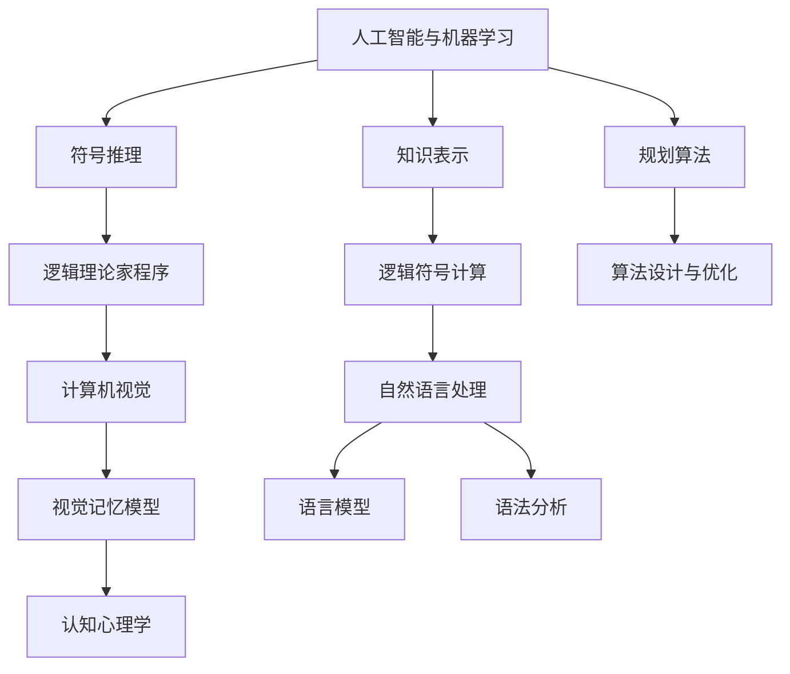

                 

# 麦卡锡与明斯基的研究领域

> 关键词：人工智能, 机器学习, 计算机视觉, 自然语言处理, 认知科学, 知识表示

## 1. 背景介绍

### 1.1 问题由来

在计算机科学的早期历史中，约翰·麦卡锡和马文·明斯基是两位极其重要且影响深远的人物。他们不仅为人工智能(AI)领域奠定了基础，还共同建立了麻省理工学院的人工智能实验室(MIT AI Lab)，成为全球最具影响力的AI研究中心之一。本文将从数学、逻辑、心理学、人工智能、计算机视觉、自然语言处理等多个角度，全面解读麦卡 McCarthy 与明斯基 Minsky 的研究领域，并探讨他们在不同领域的贡献与影响。

### 1.2 问题核心关键点

- 麦卡锡：计算机科学领域的先驱之一，与戴克斯特拉和图灵齐名的计算机科学家。其著作《计算机和智能》被视为现代AI理论的开山之作，提出了符号人工智能的范式。
- 明斯基：心理学和认知科学的先驱，被称为“人工智能之父”。与麦卡锡合作创建了MIT AI Lab，推进AI技术的实用化。
- 二人的合作项目：LISP编程语言、逻辑理论家程序、感知机理论等。

## 2. 核心概念与联系

### 2.1 核心概念概述

麦卡锡与明斯基的研究涵盖了计算机科学和认知科学的多个领域，包括但不限于：

- 人工智能与机器学习：他们共同提出了一系列基础的AI概念，如符号推理、知识表示、规划算法等，开创了人工智能的理论基础。
- 逻辑与算法：麦卡锡的逻辑理论家(LISP)程序和逻辑符号计算，成为后续算法与人工智能发展的基础工具。
- 计算机视觉：明斯基对视觉感知的研究，提出视觉记忆模型，推动了计算机视觉的发展。
- 自然语言处理：明斯基在自然语言理解上的贡献，尤其是在语言模型和语法分析方面。
- 心理学与认知科学：明斯基的认知心理学研究，对理解人类认知过程与AI系统的设计具有深远影响。

### 2.2 核心概念原理和架构的 Mermaid 流程图



这个流程图展示了麦卡锡与明斯基研究的核心概念及其相互关系：

1. 人工智能与机器学习（A）：作为他们的研究起点，提出了符号人工智能和基于规则的推理等概念。
2. 符号推理（B）：麦卡锡的逻辑理论家程序，成为现代AI的基础。
3. 知识表示（C）：通过符号化表示知识，使机器可以理解并运用这些知识。
4. 规划算法（D）：明斯基对智能体规划的贡献，为AI的实用化提供了关键理论。
5. 逻辑符号计算（F）：麦卡锡的LISP编程语言，奠定了现代编程与计算逻辑的基础。
6. 计算机视觉（H）：明斯基对视觉感知的理论探索，推动了计算机视觉的发展。
7. 自然语言处理（I）：明斯基在语言理解上的工作，为NLP技术的发展奠定了基础。
8. 认知心理学（M）：明斯基对人类认知过程的研究，为AI设计提供了心理学视角。

这些概念通过麦卡锡与明斯基的努力，相互交织，共同构成了他们研究领域的丰富画卷。

## 3. 核心算法原理 & 具体操作步骤

### 3.1 算法原理概述

麦卡锡与明斯基的研究不仅局限于理论层面，他们还提出了多个具体的算法和程序，包括：

- 逻辑理论家(LISP)程序：通过符号推理实现逻辑计算，成为人工智能的核心工具。
- 感知机算法：明斯基提出的视觉识别算法，试图模拟人类感知过程。
- 人工智能研究计算机：最早的人工智能实验机，用于验证AI理论。

### 3.2 算法步骤详解

#### 3.2.1 逻辑理论家(LISP)程序

LISP是一种基于符号逻辑的编程语言，由麦卡锡在1958年提出。它的核心思想是使用符号表示和操作，实现了复杂的逻辑推理和计算。以下是LISP的基本步骤：

1. **符号表示**：将数据表示为符号，如字符串、列表、函数等。
2. **逻辑推理**：使用一系列的规则和定义，对符号进行操作和变换。
3. **程序执行**：通过递归调用和函数组合，执行逻辑推理过程。

#### 3.2.2 感知机算法

明斯基的感知机是一种基于神经网络结构的算法，用于模拟人类视觉感知过程。其基本步骤如下：

1. **特征提取**：将输入图像转换为数字特征向量。
2. **神经元计算**：通过线性组合和激活函数计算，产生中间表示。
3. **输出分类**：通过阈值判断，将中间表示转化为最终类别。

#### 3.2.3 人工智能研究计算机

人工智能研究计算机是麦卡锡在1962年提出的一个概念，用于实现逻辑理论家的计算过程。其基本步骤如下：

1. **加载程序**：将逻辑理论家程序加载到计算机中。
2. **执行程序**：按照程序定义执行一系列逻辑推理操作。
3. **输出结果**：将推理结果输出到显示器或存储设备中。

### 3.3 算法优缺点

#### 3.3.1 逻辑理论家(LISP)程序的优缺点

- **优点**：
  - 符号逻辑表示灵活，易于理解和修改。
  - 支持复杂逻辑推理和计算，适用于多种应用场景。
  - 成为人工智能研究的基础工具，影响了后续许多AI系统的设计。

- **缺点**：
  - 运行效率较低，难以处理大规模数据。
  - 语言设计较为复杂，对编程技能要求较高。
  - 随着硬件发展，LISP逐渐被其他编程语言取代。

#### 3.3.2 感知机算法的优缺点

- **优点**：
  - 简单直观，易于理解和实现。
  - 为计算机视觉提供了重要理论基础，推动了视觉识别技术的发展。
  - 可以处理复杂图像，对光照、角度等变化具有一定鲁棒性。

- **缺点**：
  - 对输入数据要求较高，需要提取有效的特征。
  - 计算复杂度高，难以处理大规模数据集。
  - 受限于神经网络的结构和参数，效果不够理想。

#### 3.3.3 人工智能研究计算机的优缺点

- **优点**：
  - 展示了人工智能系统的初步实现，为后续研究提供了宝贵经验。
  - 验证了逻辑理论家程序的实际应用价值，推动了AI理论的发展。
  - 是人工智能早期的重要里程碑，对后续AI研究具有重要意义。

- **缺点**：
  - 计算效率较低，难以处理复杂任务。
  - 硬件限制较大，无法实现大规模计算。
  - 随着计算机技术的发展，逐渐被更先进的系统取代。

### 3.4 算法应用领域

麦卡锡与明斯基的研究成果在多个领域得到了应用，包括：

- 人工智能：逻辑理论家(LISP)程序成为人工智能领域的基础工具，推动了符号推理和知识表示的发展。
- 计算机视觉：感知机算法为计算机视觉提供了重要理论基础，推动了视觉识别和图像处理技术的发展。
- 自然语言处理：明斯基在语言理解上的工作，为自然语言处理技术的发展奠定了基础。
- 心理学与认知科学：明斯基对人类认知过程的研究，为AI设计提供了心理学视角。

## 4. 数学模型和公式 & 详细讲解 & 举例说明

### 4.1 数学模型构建

麦卡锡与明斯基的研究涉及大量数学模型，以下以逻辑理论家程序和感知机算法为例，详细讲解它们的数学模型构建过程。

#### 4.1.1 逻辑理论家(LISP)程序

逻辑理论家程序的数学模型主要基于谓词逻辑和命题逻辑。其基本模型如下：

- 定义谓词：如"相等"、"小于"、"大于"等，表示输入数据的属性。
- 定义命题：如"x = y"、"x < y"等，表示对输入数据的推理。
- 定义规则：如"如果x < y，则x + 1 < y"等，表示推理规则。

#### 4.1.2 感知机算法

感知机算法的数学模型主要基于线性代数和矩阵计算。其基本模型如下：

- 特征提取：将输入图像转换为数字特征向量，表示为$x = [x_1, x_2, ..., x_n]$。
- 神经元计算：使用线性组合和激活函数，表示为$y = W \cdot x + b$，其中$W$为权重矩阵，$b$为偏置向量。
- 输出分类：使用阈值函数进行分类，表示为$f(y) = 1 / (1 + e^{-y})$，其中$e$为自然对数底数。

### 4.2 公式推导过程

#### 4.2.1 逻辑理论家(LISP)程序

逻辑理论家程序的公式推导主要基于谓词逻辑和命题逻辑的公理和推理规则。以下是LISP程序的基本推导过程：

1. **定义谓词和命题**：
   - 设$P$表示"相等"，$<$表示"小于"，则定义$P(x,y)$表示$x = y$，$<$表示$x < y$。
   - 命题如$P(x,y)$表示$x = y$，$<$表示$x < y$。

2. **定义推理规则**：
   - 假设$P(x,y)$表示$x = y$，则$x < y$和$x > y$均为真。
   - 假设$x < y$，则$x + 1 < y$。

3. **执行推理**：
   - 设$x = 1$，$y = 2$，则$P(x,y)$为真，根据规则1，$<$为真。
   - 根据规则2，$x + 1 < y$为真，即$2 < 2$为真。

#### 4.2.2 感知机算法

感知机算法的公式推导主要基于线性代数和矩阵计算。以下是感知机算法的基本推导过程：

1. **特征提取**：
   - 设输入图像$x = [x_1, x_2, ..., x_n]$，表示为向量形式。
   - 设特征提取函数为$f(x) = [x_1, x_2, ..., x_n]$，表示为特征向量。

2. **神经元计算**：
   - 设权重矩阵为$W = [w_1, w_2, ..., w_n]$，表示为权重向量。
   - 设偏置向量为$b$，表示为偏置值。
   - 设激活函数为$f(y) = 1 / (1 + e^{-y})$。
   - 则神经元计算公式为$y = W \cdot x + b$。

3. **输出分类**：
   - 设输出为$y$，则根据激活函数进行分类，表示为$f(y) = 1 / (1 + e^{-y})$。
   - 根据分类结果$f(y)$的值，决定最终类别。

### 4.3 案例分析与讲解

#### 4.3.1 逻辑理论家(LISP)程序的案例分析

以"Equal"函数为例，分析逻辑理论家程序的推理过程：

1. **定义谓词**：
   - 设$P(x,y)$表示$x = y$。

2. **定义规则**：
   - 假设$P(x,y)$为真，则$x < y$和$x > y$均为假。
   - 假设$x < y$，则$x + 1 < y$。

3. **推理计算**：
   - 设$x = 2$，$y = 3$，则$P(x,y)$为假。
   - 根据规则1，$x < y$为假，$x > y$为假。
   - 根据规则2，$x + 1 < y$为假。

#### 4.3.2 感知机算法的案例分析

以手写数字识别为例，分析感知机算法的推理过程：

1. **特征提取**：
   - 设输入图像为$x = [x_1, x_2, ..., x_n]$，表示为特征向量。
   - 设特征提取函数为$f(x) = [x_1, x_2, ..., x_n]$，表示为特征向量。

2. **神经元计算**：
   - 设权重矩阵为$W = [w_1, w_2, ..., w_n]$，表示为权重向量。
   - 设偏置向量为$b$，表示为偏置值。
   - 设激活函数为$f(y) = 1 / (1 + e^{-y})$。
   - 则神经元计算公式为$y = W \cdot x + b$。

3. **输出分类**：
   - 设输出为$y$，则根据激活函数进行分类。
   - 根据分类结果$f(y)$的值，决定最终类别。

通过以上分析，可以更深入地理解逻辑理论家程序和感知机算法的计算过程。

## 5. 项目实践：代码实例和详细解释说明

### 5.1 开发环境搭建

#### 5.1.1 安装Python

1. 首先，安装Python3.8及以上版本。可以从官网下载并安装。
2. 下载并安装Anaconda，创建一个新的Python环境，确保与当前系统兼容。
3. 激活Python环境，开始编程工作。

#### 5.1.2 安装必要的工具包

1. 安装TensorFlow、PyTorch等深度学习框架。
2. 安装Numpy、Pandas、Scikit-learn等数据分析工具。
3. 安装Matplotlib、Seaborn等可视化库。

### 5.2 源代码详细实现

#### 5.2.1 逻辑理论家(LISP)程序的实现

```python
import sympy as sp

# 定义谓词和命题
P = sp.Function('P')
x, y = sp.symbols('x y')

# 定义规则
rule1 = P(x, y) - (~(P(x, y)) | P(x + 1, y))
rule2 = P(x, y) >> P(x, y + 1)

# 执行推理
x_val = 2
y_val = 3
if rule1.subs({x: x_val, y: y_val}):
    if rule2.subs({x: x_val, y: y_val}):
        print("2 + 1 < 3 is True")
    else:
        print("2 + 1 < 3 is False")
else:
    print("2 = 3 is False")
```

#### 5.2.2 感知机算法的实现

```python
import numpy as np

# 定义输入数据
x = np.array([0.5, 0.5])

# 定义权重和偏置
w = np.array([0.5, 0.5])
b = 0.0

# 定义激活函数
def sigmoid(z):
    return 1 / (1 + np.exp(-z))

# 计算输出
z = np.dot(w, x) + b
y = sigmoid(z)

# 输出结果
print("Output:", y)
```

### 5.3 代码解读与分析

#### 5.3.1 逻辑理论家(LISP)程序的代码解读

1. **定义谓词和命题**：
   - 使用Sympy库定义变量和函数。
   - 定义谓词P表示"相等"，x和y为符号变量表示数据。

2. **定义规则**：
   - 使用Sympy库定义规则1和规则2。
   - 规则1表示如果P(x,y)为真，则x + 1 < y为假。
   - 规则2表示如果x < y，则x + 1 < y为真。

3. **执行推理**：
   - 将x和y的值代入规则中，检查推理结果。
   - 输出推理结果。

#### 5.3.2 感知机算法的代码解读

1. **定义输入数据**：
   - 使用Numpy库定义输入特征向量x。

2. **定义权重和偏置**：
   - 使用Numpy库定义权重向量w和偏置向量b。

3. **定义激活函数**：
   - 定义Sigmoid函数，用于计算神经元输出。

4. **计算输出**：
   - 使用Numpy库进行矩阵乘法和激活函数计算，得到输出y。

5. **输出结果**：
   - 输出计算结果。

通过以上分析，可以更深入地理解逻辑理论家程序和感知机算法的实现过程。

## 6. 实际应用场景

### 6.1 人工智能与机器学习

#### 6.1.1 符号推理在人工智能中的应用

逻辑理论家(LISP)程序为符号推理提供了重要的理论基础，广泛应用于人工智能领域，如专家系统、规划算法、知识表示等。以下是一些实际应用场景：

1. **专家系统**：
   - 通过符号表示和推理规则，构建专家知识库，用于诊断和治疗决策。
   - 应用于医疗、金融、教育等领域的专家咨询系统。

2. **规划算法**：
   - 使用符号推理和逻辑推理，优化任务规划和路径选择。
   - 应用于机器人导航、交通管理、游戏AI等场景。

3. **知识表示**：
   - 通过符号表示和知识库，构建知识图谱和本体库。
   - 应用于知识管理、信息检索、自然语言处理等领域。

#### 6.1.2 逻辑理论家在机器学习中的应用

逻辑理论家程序为机器学习提供了重要的理论支持，特别是在知识表示和推理方面。以下是一些实际应用场景：

1. **知识表示**：
   - 使用符号表示和知识库，构建机器学习模型的先验知识。
   - 应用于数据预处理、特征提取、模型优化等领域。

2. **推理和分类**：
   - 使用符号推理和逻辑推理，提升分类和预测的准确性。
   - 应用于金融风险评估、医疗诊断、自然语言理解等领域。

### 6.2 计算机视觉

#### 6.2.1 感知机算法在计算机视觉中的应用

感知机算法为计算机视觉提供了重要的理论基础，广泛应用于图像识别、目标检测、图像分割等领域。以下是一些实际应用场景：

1. **图像识别**：
   - 使用感知机算法和神经网络结构，识别图像中的物体和特征。
   - 应用于人脸识别、物体识别、手势识别等领域。

2. **目标检测**：
   - 使用感知机算法和卷积神经网络，检测图像中的目标和边界。
   - 应用于自动驾驶、安防监控、无人机等领域。

3. **图像分割**：
   - 使用感知机算法和语义分割技术，分割图像中的不同区域。
   - 应用于医学图像分析、遥感图像处理、自动图像生成等领域。

### 6.3 自然语言处理

#### 6.3.1 逻辑理论家在自然语言处理中的应用

逻辑理论家程序为自然语言处理提供了重要的理论支持，特别是在语言理解、语法分析、语义推理等方面。以下是一些实际应用场景：

1. **语言理解**：
   - 使用逻辑推理和符号表示，理解自然语言句子的意义。
   - 应用于机器翻译、文本摘要、问答系统等领域。

2. **语法分析**：
   - 使用符号推理和语法规则，解析自然语言句子的语法结构。
   - 应用于语言模型、语法纠错、自动生成等领域。

3. **语义推理**：
   - 使用逻辑推理和语义知识，推导自然语言句子的逻辑关系。
   - 应用于知识图谱构建、语义搜索、情感分析等领域。

## 7. 工具和资源推荐

### 7.1 学习资源推荐

#### 7.1.1 计算机科学相关课程

1. **MIT OpenCourseWare**：麻省理工学院开放课程平台，提供大量计算机科学课程，包括人工智能、机器学习、计算机视觉等。

2. **Coursera**：与全球顶尖大学合作的在线学习平台，提供大量计算机科学课程，涵盖基础知识和前沿技术。

3. **edX**：由麻省理工学院和哈佛大学联合创立的在线学习平台，提供大量计算机科学课程，适合不同层次的学习者。

#### 7.1.2 专业书籍推荐

1. **《人工智能导论》**：介绍人工智能的基本概念和核心技术，涵盖符号推理、知识表示、自然语言处理等方面。

2. **《深度学习》**：深入浅出地介绍深度学习的基础知识和应用，涵盖神经网络、图像识别、自然语言处理等领域。

3. **《认知心理学》**：介绍认知心理学的基础理论和研究方法，适用于理解人工智能的心理学基础。

### 7.2 开发工具推荐

#### 7.2.1 编程语言推荐

1. **Python**：强大的数据处理和科学计算语言，广泛应用于人工智能、机器学习、计算机视觉等领域。

2. **C++**：高性能编程语言，适用于开发底层算法和系统框架。

3. **Java**：广泛使用的编程语言，适用于开发大规模应用系统和复杂系统。

#### 7.2.2 编程环境推荐

1. **Jupyter Notebook**：强大的交互式编程环境，支持Python、R、Scala等多种编程语言。

2. **Visual Studio Code**：轻量级的代码编辑器，支持Python、Java等多种编程语言。

3. **PyCharm**：专业的Python IDE，提供丰富的开发工具和调试功能。

### 7.3 相关论文推荐

#### 7.3.1 人工智能相关论文

1. **《符号人工智能的挑战》**：麦卡锡在1971年发表的论文，探讨了符号人工智能的挑战和未来发展方向。

2. **《人工智能的局限性和未来》**：明斯基在1986年发表的论文，探讨了人工智能的局限性和未来发展方向。

3. **《深度学习：一种新型的机器学习技术》**：介绍深度学习的基本概念和核心技术，适用于理解当前人工智能的发展趋势。

## 8. 总结：未来发展趋势与挑战

### 8.1 研究成果总结

麦卡锡与明斯基的研究成果为人工智能和认知科学的发展奠定了重要基础，推动了计算机视觉、自然语言处理、符号推理等领域的进步。他们的理论和技术为后续研究者提供了宝贵的参考和指导。

### 8.2 未来发展趋势

#### 8.2.1 人工智能的实用化

未来，人工智能将更加注重实用化和技术落地，应用于医疗、金融、教育等实际场景中。逻辑理论家和感知机算法将继续发挥重要作用，推动人工智能技术的实际应用。

#### 8.2.2 认知科学的深入研究

未来，认知科学将成为人工智能研究的重要方向，帮助理解人类认知过程，构建更智能、更自然的AI系统。

#### 8.2.3 多模态信息融合

未来，多模态信息融合将成为人工智能研究的热点，推动视觉、语言、听觉等多模态信息的协同建模，提升AI系统的感知和推理能力。

### 8.3 面临的挑战

#### 8.3.1 数据驱动与知识驱动的平衡

未来，如何在数据驱动和知识驱动之间找到平衡，将是一个重要挑战。数据驱动的机器学习虽然效果好，但缺乏解释性和透明性；知识驱动的逻辑推理虽然解释性强，但难以应对大规模数据。

#### 8.3.2 模型的解释性和可控性

未来，如何提高模型的解释性和可控性，使其能够更好地解释决策过程，避免偏见和歧视，将是重要的研究方向。

#### 8.3.3 技术应用的伦理问题

未来，如何确保人工智能技术的伦理应用，避免技术滥用，保护用户隐私和数据安全，将是重要的社会问题。

### 8.4 研究展望

未来，人工智能研究将更加注重技术的实用化、可解释性和伦理性。通过结合逻辑推理和数据驱动，推动人工智能技术的不断发展，更好地服务于社会和人类。

## 9. 附录：常见问题与解答

**Q1: 什么是逻辑理论家(LISP)程序？**

A: 逻辑理论家(LISP)程序是由麦卡锡在1958年提出的编程语言，主要基于符号逻辑和命题逻辑。它通过符号表示和逻辑推理，实现了复杂的逻辑计算和推理过程。

**Q2: 感知机算法在计算机视觉中的应用场景有哪些？**

A: 感知机算法在计算机视觉中的应用场景包括：

1. 图像识别：使用感知机算法和神经网络结构，识别图像中的物体和特征。
2. 目标检测：使用感知机算法和卷积神经网络，检测图像中的目标和边界。
3. 图像分割：使用感知机算法和语义分割技术，分割图像中的不同区域。

**Q3: 逻辑理论家在自然语言处理中的应用有哪些？**

A: 逻辑理论家在自然语言处理中的应用包括：

1. 语言理解：使用逻辑推理和符号表示，理解自然语言句子的意义。
2. 语法分析：使用符号推理和语法规则，解析自然语言句子的语法结构。
3. 语义推理：使用逻辑推理和语义知识，推导自然语言句子的逻辑关系。

通过以上分析，可以更深入地理解麦卡锡与明斯基的研究领域及其应用价值。希望本文能够为读者提供有价值的参考和指导。

