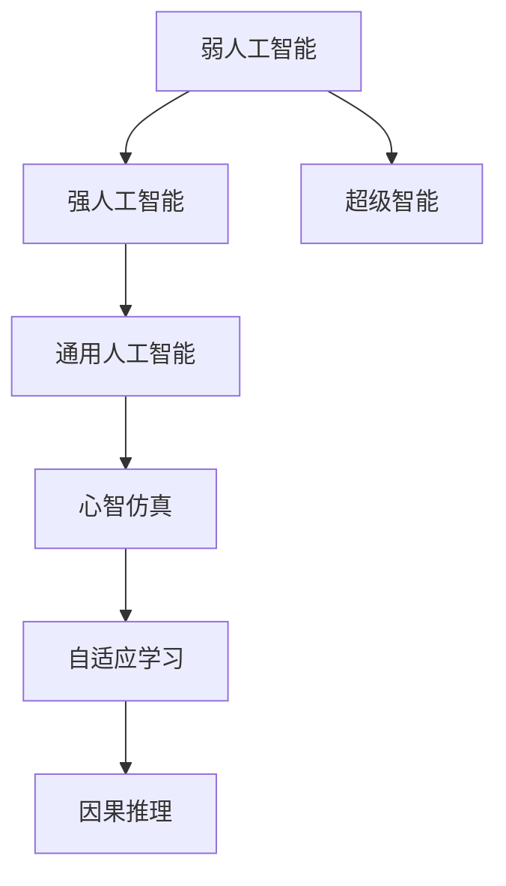

                 

# AGI：人工智能的皇冠明珠

## 1. 背景介绍

### 1.1 问题由来

人工智能（Artificial Intelligence，AI）作为科技发展的重要里程碑，在计算机视觉、自然语言处理、机器人等领域取得了举世瞩目的进展。然而，AI的发展并非一路坦途，始终伴随着各种挑战和质疑。其中，通用人工智能（Artificial General Intelligence，AGI）这一目标，更是令无数研究者和工程从业者为之倾倒。

AGI，即机器具备完全的智能，能像人类一样自主学习、理解复杂环境、解决多种复杂问题。这一概念自上世纪50年代首次被提出以来，一直是AI研究的核心焦点。但要实现AGI，还有一段漫长的道路要走。

### 1.2 问题核心关键点

实现AGI的核心关键点在于以下几个方面：

1. **广泛知识与常识的掌握**：AGI应具备对各种领域的广泛知识，并能够基于这些知识进行推理、归纳和综合。
2. **智能泛化能力**：能对新的输入数据进行有效的泛化，适应新的环境和任务。
3. **自主学习与自我改进**：能够通过自我反馈进行持续学习和改进。
4. **创造力与创新能力**：能在不完全依赖已有知识的情况下，提出新的理论、算法或产品。
5. **情感与社交能力**：具备理解人类情感、进行社交互动的能力。
6. **伦理与社会责任感**：具有人类的伦理和社会责任感，能为社会带来正面影响。

这些关键点不仅对AGI的构建提出了严苛的要求，也反映了人类对AI发展的长远期待。

## 2. 核心概念与联系

### 2.1 核心概念概述

为更好地理解AGI构建的理论基础和实践技术，本节将介绍几个密切相关的核心概念：

- **人工智能（AI）**：指利用计算机系统实现智能行为的技术，涵盖感知、理解、学习、推理、规划等能力。
- **弱人工智能（Narrow AI）**：指在特定领域具有特定能力的人工智能，如语音识别、图像识别等。
- **强人工智能（Strong AI）**：指具备人类智能水平的AI，能像人类一样进行各种思考和行为。
- **超级智能（Superintelligence）**：指AI在某些方面超越人类智慧的水平。
- **心智仿真（Mind Simulation）**：指通过计算机模拟人类思维和感知过程，构建AGI。
- **自适应学习（Adaptive Learning）**：指AI能够根据环境变化和经验进行自我调整和适应。
- **因果推理（Causal Reasoning）**：指AI能够理解并推导因果关系，进行合理决策。

这些核心概念之间的逻辑关系可以通过以下Mermaid流程图来展示：



这个流程图展示了一系列从弱人工智能到通用人工智能的发展路径和关键技术：

1. 弱人工智能通过专精特定领域的任务，逐步积累经验，并向上扩展到强人工智能。
2. 强人工智能具备了广泛的知识和自我学习能力，可能进一步发展成超级智能。
3. 超级智能可能会超越人类智慧，具备更高的自主性、创造力和智能水平。
4. 通用人工智能是AI发展的终极目标，具备强人工智能所具备的全部智能特征，并能够自主学习和推理。
5. 心智仿真和自适应学习、因果推理等技术，是构建通用人工智能的重要手段。

## 3. 核心算法原理 & 具体操作步骤
### 3.1 算法原理概述

构建AGI的算法原理主要基于以下几个方面：

- **强化学习**：通过与环境交互，通过不断试错和学习，提升AI的决策和行为能力。
- **因果推理**：通过因果图、决策树等方法，理解输入数据中的因果关系，进行合理推理。
- **自适应学习**：通过自我反馈和迭代优化，适应不同的环境和任务。
- **深度学习**：利用多层神经网络，学习复杂的非线性映射关系，提升AI的感知和理解能力。
- **知识表示与图谱**：通过符号化、本体论等方法，构建和利用结构化知识库，增强AI的理解和推理能力。
- **逻辑推理与定理证明**：利用逻辑推理工具，进行形式化的证明和推理，增强AI的逻辑严密性和可信度。
- **认知仿真与模拟**：通过模拟人脑的工作机制，构建AI的认知模型，提升其理解和推理能力。

这些算法和技术的综合应用，旨在构建具备多领域知识、复杂推理和自我学习能力的AI系统。

### 3.2 算法步骤详解

基于AGI构建的算法步骤一般包括以下几个关键环节：

**Step 1: 知识获取与整合**

- **知识表示**：利用符号化、语义网等方法，构建知识库，将领域内的专业知识结构化。
- **知识注入**：将知识库中的知识注入到AI模型中，增强其理解力和推理能力。
- **知识更新**：随着环境变化和经验积累，动态更新知识库，增强AI的学习能力和泛化能力。

**Step 2: 智能推理与决策**

- **因果推理**：利用因果图、决策树等方法，理解输入数据的因果关系，进行合理推理。
- **逻辑推理**：利用逻辑推理工具，进行形式化的证明和推理，增强AI的逻辑严密性和可信度。
- **强化学习**：通过与环境交互，不断试错和优化，提升AI的决策和行为能力。

**Step 3: 自适应学习与优化**

- **反馈机制**：构建自我反馈机制，根据AI的行为和环境反馈，不断调整和优化其策略。
- **迭代优化**：通过多次迭代训练，逐步提升AI的学习能力和决策水平。
- **模型微调**：根据新任务和新环境，动态调整和微调模型，提高其适应性和泛化能力。

**Step 4: 评估与验证**

- **性能评估**：利用标准评估指标，对AI模型进行性能评估，如精度、召回率、F1值等。
- **实际应用**：将AI模型应用于实际场景，进行充分验证和测试，确保其可靠性和有效性。
- **持续改进**：根据实际应用中的反馈，持续改进AI模型，提升其性能和适应性。

### 3.3 算法优缺点

构建AGI的算法具有以下优点：

1. **广泛适应性**：能够适应各种环境和任务，具备广泛的智能能力。
2. **自主学习**：能够自主学习和自我优化，具备自我适应能力。
3. **泛化能力强**：具备强泛化能力，能够在新的环境和任务下高效工作。
4. **推理准确**：利用因果推理和逻辑推理，进行准确的决策和行为。
5. **知识表示能力强**：能够利用符号化知识库，增强理解和推理能力。

然而，构建AGI的算法也存在一定的局限性：

1. **复杂性高**：构建AGI需要整合多种算法和技术，技术复杂度高，实现难度大。
2. **资源需求大**：需要大量的计算资源和存储资源，对硬件设备要求高。
3. **伦理和社会问题**：AGI的自主决策和行为可能带来伦理和社会问题，需要谨慎设计。
4. **安全性问题**：AGI的行为和决策可能带来不可预测的风险，需要加强安全性设计。
5. **知识局限性**：当前的知识库和算法可能存在局限性，无法完全覆盖所有领域的知识。

尽管存在这些局限性，但就目前而言，构建AGI的算法是大势所趋，具有巨大的潜力和价值。未来相关研究的重点在于如何进一步降低实现难度，提高AGI的可解释性和安全性，同时兼顾其伦理和社会责任。

### 3.4 算法应用领域

AGI的构建技术已经在多个领域得到了应用，并取得了显著的成效：

- **智能机器人**：利用AGI构建自主决策能力的机器人，能完成复杂的作业和交互任务。
- **自然语言处理**：基于AGI的NLP系统，能进行多轮对话、情感分析、机器翻译等任务。
- **医疗诊断**：利用AGI进行疾病诊断、医疗咨询、个性化治疗等。
- **金融分析**：利用AGI进行市场预测、风险评估、自动化交易等。
- **教育培训**：基于AGI的教育系统，能进行个性化教学、智能评估、智能辅导等。
- **智慧城市**：利用AGI构建智能监控、智能调度、智能决策等系统，提升城市管理水平。
- **游戏娱乐**：构建具备智能决策能力的虚拟角色，提升游戏的趣味性和可玩性。

除了上述这些典型应用外，AGI的构建技术还将广泛应用于更多的领域，为各行各业带来变革性影响。

## 4. 数学模型和公式 & 详细讲解  
### 4.1 数学模型构建

构建AGI的数学模型涉及多个领域，包括强化学习、因果推理、逻辑推理等。本节将以强化学习为例，介绍其数学模型构建。

设环境为 $\mathcal{E}$，行动空间为 $\mathcal{A}$，状态空间为 $\mathcal{S}$，状态转移概率为 $P$，奖赏函数为 $R$。则强化学习问题的数学模型可以表示为：

$$
\max_{\pi} \sum_{t=1}^{\infty} \gamma^{t-1} R(s_t, a_t)
$$

其中，$\pi$ 为策略函数，$\gamma$ 为折扣因子。目标是通过学习策略 $\pi$，最大化长期的累积奖赏。

### 4.2 公式推导过程

以下是强化学习问题的数学推导过程：

1. **贝尔曼方程**：

$$
V^{\pi}(s) = \max_{a} \left[ R(s, a) + \gamma \sum_{s'} P(s'|s, a) V^{\pi}(s') \right]
$$

其中 $V^{\pi}(s)$ 为策略 $\pi$ 下的状态价值函数，表示在状态 $s$ 下，采取策略 $\pi$ 的长期累积奖赏。

2. **动态规划**：

$$
V^{\pi}(s) = \max_{a} \left[ R(s, a) + \gamma \sum_{s'} P(s'|s, a) V^{\pi}(s') \right]
$$

该公式通过迭代计算，逐步逼近最优策略 $\pi^*$ 下的状态价值函数 $V^{\pi^*}(s)$。

3. **策略迭代**：

$$
\pi^*(a|s) = \frac{\exp(\sum_{s'} P(s'|s, a) \log V^{\pi}(s'))}{\sum_{a'} \exp(\sum_{s'} P(s'|s, a') \log V^{\pi}(s'))}
$$

该公式通过不断迭代，逐步逼近最优策略 $\pi^*$。

### 4.3 案例分析与讲解

以AlphaGo为例，介绍强化学习在AGI构建中的应用。

AlphaGo通过深度学习和强化学习相结合的方式，构建了具备自我学习和决策能力的围棋AI。其核心算法包括：

- **深度神经网络**：用于学习和表示围棋棋盘状态。
- **蒙特卡罗树搜索**：用于选择最优下棋策略。
- **强化学习**：通过与人类对弈，不断调整和优化策略。

AlphaGo的构建过程展示了强化学习在AGI构建中的重要作用。通过自我对弈和经验反馈，AlphaGo逐步提升了其决策能力，并最终战胜了世界冠军。

## 5. 项目实践：代码实例和详细解释说明
### 5.1 开发环境搭建

在进行AGI构建实践前，我们需要准备好开发环境。以下是使用Python进行PyTorch开发的环境配置流程：

1. 安装Anaconda：从官网下载并安装Anaconda，用于创建独立的Python环境。

2. 创建并激活虚拟环境：
```bash
conda create -n pytorch-env python=3.8 
conda activate pytorch-env
```

3. 安装PyTorch：根据CUDA版本，从官网获取对应的安装命令。例如：
```bash
conda install pytorch torchvision torchaudio cudatoolkit=11.1 -c pytorch -c conda-forge
```

4. 安装各类工具包：
```bash
pip install numpy pandas scikit-learn matplotlib tqdm jupyter notebook ipython
```

完成上述步骤后，即可在`pytorch-env`环境中开始AGI构建实践。

### 5.2 源代码详细实现

下面我们以强化学习为例，给出使用PyTorch实现强化学习的代码实现。

首先，定义强化学习的环境和策略函数：

```python
import gym
import torch
import torch.nn as nn
import torch.optim as optim

class Environment:
    def __init__(self, env_name):
        self.env = gym.make(env_name)
        self.state_dim = self.env.observation_space.shape[0]
        self.action_dim = self.env.action_space.n
        self.gamma = 0.99

    def reset(self):
        return self.env.reset()

    def step(self, action):
        next_state, reward, done, _ = self.env.step(action)
        next_state = torch.tensor([next_state], dtype=torch.float32)
        reward = torch.tensor([reward], dtype=torch.float32)
        done = torch.tensor([done], dtype=torch.float32)
        return next_state, reward, done

class Policy(nn.Module):
    def __init__(self, state_dim, action_dim):
        super(Policy, self).__init__()
        self.fc1 = nn.Linear(state_dim, 32)
        self.fc2 = nn.Linear(32, action_dim)
        self.epsilon = 0.1

    def forward(self, state):
        x = self.fc1(state)
        x = torch.relu(x)
        x = self.fc2(x)
        x = torch.softmax(x, dim=0)
        return x

# 创建环境
env = Environment('CartPole-v1')
state_dim = env.state_dim
action_dim = env.action_dim

# 定义模型
policy = Policy(state_dim, action_dim)
optimizer = optim.Adam(policy.parameters(), lr=0.001)
```

然后，定义训练函数：

```python
def train_policy(policy, env, num_episodes, max_steps):
    for episode in range(num_episodes):
        state = env.reset()
        done = False
        total_reward = 0
        for t in range(max_steps):
            if done:
                break
            action_probs = policy(torch.tensor([state], dtype=torch.float32))
            action = np.random.choice(np.arange(action_dim), p=action_probs.numpy()[0])
            next_state, reward, done, _ = env.step(action)
            state = torch.tensor([next_state], dtype=torch.float32)
            total_reward += reward
            optimizer.zero_grad()
            log_probs = torch.log(prob)
            loss = -torch.mean(log_probs * reward)
            loss.backward()
            optimizer.step()
        print(f"Episode {episode+1}, Total Reward: {total_reward:.2f}")
    return policy
```

最后，启动训练流程：

```python
num_episodes = 1000
max_steps = 1000
policy = train_policy(policy, env, num_episodes, max_steps)
```

以上就是使用PyTorch实现强化学习的完整代码实现。可以看到，利用PyTorch的高效自动微分功能，代码实现非常简单。

### 5.3 代码解读与分析

让我们再详细解读一下关键代码的实现细节：

**Environment类**：
- `__init__`方法：初始化环境，获取状态和动作空间的维度，设置折扣因子。
- `reset`方法：重置环境状态。
- `step`方法：执行一步行动，返回下一状态、奖励和是否完成标志。

**Policy类**：
- `__init__`方法：定义策略函数，包含两个全连接层，用于将状态映射到动作概率。
- `forward`方法：通过前向传播计算动作概率。

**训练函数**：
- 在每个 episode 中，进行固定步数的交互。
- 每一步中，根据策略函数计算动作概率，选择动作，并更新模型参数。
- 计算 reward，并反向传播更新模型参数。
- 打印每轮 episode 的总奖励。

以上代码展示了强化学习的基本流程，通过不断迭代训练，逐步优化策略函数，提升决策能力。

## 6. 实际应用场景
### 6.1 智能机器人

基于AGI构建的智能机器人，能够自主进行复杂的作业和交互任务。例如，在工厂中，智能机器人可以自主规划路径、避开障碍物、完成装配和搬运等工作。通过与工人进行交互，智能机器人还能进行问答、对话、指令执行等任务，提升生产效率和安全性。

### 6.2 医疗诊断

利用AGI构建的智能诊断系统，能够分析医疗影像、病历记录等数据，提供诊断建议和个性化治疗方案。例如，通过图像识别和自然语言处理技术，系统能够自动分析患者的病历，推荐最适合的治疗方案。

### 6.3 金融分析

利用AGI构建的智能分析系统，能够进行市场预测、风险评估、自动化交易等任务。例如，通过分析历史数据和市场动态，系统能够预测股市趋势，帮助投资者做出更准确的投资决策。

### 6.4 教育培训

基于AGI的教育系统，能够进行个性化教学、智能评估、智能辅导等。例如，通过分析学生的学习记录和行为数据，系统能够提供个性化的学习建议，提高学习效果和兴趣。

### 6.5 智慧城市

利用AGI构建的智慧城市系统，能够进行智能监控、智能调度、智能决策等。例如，通过分析交通数据和天气信息，系统能够优化交通流量，提高道路通行效率。

### 6.6 游戏娱乐

构建具备智能决策能力的虚拟角色，提升游戏的趣味性和可玩性。例如，通过强化学习和自然语言处理技术，系统能够生成更加智能和互动的NPC角色，增强游戏体验。

## 7. 工具和资源推荐
### 7.1 学习资源推荐

为了帮助开发者系统掌握AGI构建的理论基础和实践技巧，这里推荐一些优质的学习资源：

1. 《Deep Reinforcement Learning》书籍：由DeepMind科学家撰写的经典著作，介绍了强化学习的理论基础和实践方法。

2. 《Artificial Intelligence: A Modern Approach》书籍：斯坦福大学的经典教材，系统介绍了AI的基本概念和应用技术。

3. CS230N《AI序列课程》：斯坦福大学的高级AI课程，涵盖强化学习、深度学习、自然语言处理等多个领域。

4. Google DeepMind网站：深度学习与强化学习的前沿研究论文和开源项目，提供丰富的学习资源。

5. OpenAI网站：AI和强化学习的最新研究进展和开源项目，提供丰富的学习资源。

通过这些资源的学习实践，相信你一定能够快速掌握AGI构建的精髓，并用于解决实际的AI问题。

### 7.2 开发工具推荐

高效的开发离不开优秀的工具支持。以下是几款用于AGI构建开发的常用工具：

1. PyTorch：基于Python的开源深度学习框架，灵活动态的计算图，适合快速迭代研究。

2. TensorFlow：由Google主导开发的开源深度学习框架，生产部署方便，适合大规模工程应用。

3. OpenAI Gym：用于模拟和训练强化学习模型的环境库，包含多种模拟环境和预训练模型。

4. Weights & Biases：模型训练的实验跟踪工具，可以记录和可视化模型训练过程中的各项指标，方便对比和调优。

5. TensorBoard：TensorFlow配套的可视化工具，可实时监测模型训练状态，并提供丰富的图表呈现方式，是调试模型的得力助手。

6. Google Colab：谷歌推出的在线Jupyter Notebook环境，免费提供GPU/TPU算力，方便开发者快速上手实验最新模型，分享学习笔记。

合理利用这些工具，可以显著提升AGI构建任务的开发效率，加快创新迭代的步伐。

### 7.3 相关论文推荐

AGI的构建涉及多种前沿技术，以下是几篇奠基性的相关论文，推荐阅读：

1. DeepMind AlphaGo论文：介绍AlphaGo的设计思想和训练过程，展示了强化学习在AGI构建中的应用。

2. GPT系列论文：介绍基于语言模型的AGI构建方法，展示了预训练语言模型在NLP任务中的强大能力。

3. OpenAI Codex论文：介绍基于自监督学习的AGI构建方法，展示了预训练语言模型在代码生成任务中的表现。

4. Turing Machine Theory：介绍图灵机的理论基础和计算能力，探讨AGI的计算能力和局限性。

5. AI Ethics：探讨AI技术的伦理和社会影响，提出AGI构建的伦理指导原则。

这些论文代表了大AGI构建技术的发展脉络。通过学习这些前沿成果，可以帮助研究者把握学科前进方向，激发更多的创新灵感。

## 8. 总结：未来发展趋势与挑战

### 8.1 总结

本文对AGI构建进行了全面系统的介绍。首先阐述了AGI的概念和构建的核心关键点，明确了AGI在人工智能发展中的重要地位。其次，从原理到实践，详细讲解了AGI构建的数学模型和算法步骤，给出了AGI构建任务开发的完整代码实例。同时，本文还广泛探讨了AGI构建技术在智能机器人、医疗诊断、金融分析等多个领域的应用前景，展示了AGI构建技术的广阔前景。最后，本文精选了AGI构建技术的各类学习资源，力求为读者提供全方位的技术指引。

通过本文的系统梳理，可以看到，AGI构建技术正在成为AI研究的前沿方向，极大地拓展了人工智能的应用边界，催生了更多的落地场景。AGI的构建为AI技术的发展带来了新的可能，也为实现人类智能的伟大梦想奠定了坚实基础。

### 8.2 未来发展趋势

展望未来，AGI构建技术将呈现以下几个发展趋势：

1. **多模态融合**：将视觉、语音、文本等多种模态的数据融合，构建更加全面、立体的AI系统。
2. **自适应学习**：通过自我反馈和迭代优化，适应不同的环境和任务，提升AI的灵活性和智能水平。
3. **因果推理**：利用因果图、决策树等方法，理解输入数据中的因果关系，进行合理推理。
4. **深度学习**：利用多层神经网络，学习复杂的非线性映射关系，提升AI的感知和理解能力。
5. **知识表示与图谱**：通过符号化、本体论等方法，构建和利用结构化知识库，增强AI的理解和推理能力。
6. **逻辑推理与定理证明**：利用逻辑推理工具，进行形式化的证明和推理，增强AI的逻辑严密性和可信度。
7. **认知仿真与模拟**：通过模拟人脑的工作机制，构建AI的认知模型，提升其理解和推理能力。

以上趋势凸显了AGI构建技术的广阔前景。这些方向的探索发展，必将进一步提升AGI系统的性能和适应性，为构建安全、可靠、可解释、可控的智能系统铺平道路。

### 8.3 面临的挑战

尽管AGI构建技术已经取得了瞩目成就，但在迈向更加智能化、普适化应用的过程中，它仍面临着诸多挑战：

1. **数据瓶颈**：构建AGI需要大量的数据进行训练和优化，但当前数据的获取和标注成本高昂，限制了AGI的发展。
2. **计算资源需求高**：AGI构建需要大量的计算资源和存储资源，对硬件设备要求高，制约了AGI的部署和应用。
3. **安全性问题**：AGI的自主决策和行为可能带来不可预测的风险，需要加强安全性设计。
4. **伦理与社会问题**：AGI的行为和决策可能带来伦理和社会问题，需要谨慎设计，确保其符合社会价值观和伦理规范。
5. **知识局限性**：当前的知识库和算法可能存在局限性，无法完全覆盖所有领域的知识。
6. **算法复杂性**：AGI构建技术涉及多种前沿算法和技术，技术复杂度高，实现难度大。

尽管存在这些挑战，但就目前而言，构建AGI的算法是大势所趋，具有巨大的潜力和价值。未来相关研究的重点在于如何进一步降低实现难度，提高AGI的可解释性和安全性，同时兼顾其伦理和社会责任。

### 8.4 研究展望

面对AGI构建面临的种种挑战，未来的研究需要在以下几个方面寻求新的突破：

1. **无监督和半监督学习**：摆脱对大规模标注数据的依赖，利用自监督学习、主动学习等无监督和半监督范式，最大限度利用非结构化数据，实现更加灵活高效的AGI构建。
2. **知识图谱与本体论**：构建和利用结构化知识库，增强AGI的理解和推理能力。
3. **多模态融合**：将视觉、语音、文本等多种模态的数据融合，构建更加全面、立体的AI系统。
4. **自适应学习**：通过自我反馈和迭代优化，适应不同的环境和任务，提升AI的灵活性和智能水平。
5. **因果推理**：利用因果图、决策树等方法，理解输入数据中的因果关系，进行合理推理。
6. **深度学习**：利用多层神经网络，学习复杂的非线性映射关系，提升AI的感知和理解能力。
7. **认知仿真与模拟**：通过模拟人脑的工作机制，构建AI的认知模型，提升其理解和推理能力。

这些研究方向的探索，必将引领AGI构建技术迈向更高的台阶，为构建安全、可靠、可解释、可控的智能系统铺平道路。面向未来，AGI构建技术还需要与其他人工智能技术进行更深入的融合，如知识表示、因果推理、强化学习等，多路径协同发力，共同推动自然语言理解和智能交互系统的进步。只有勇于创新、敢于突破，才能不断拓展AGI的边界，让智能技术更好地造福人类社会。

## 9. 附录：常见问题与解答

**Q1：AGI构建是否需要海量数据？**

A: 构建AGI需要大量的数据进行训练和优化，但并非仅依赖数据量。数据的质量和多样性也非常重要。通过数据增强、多模态融合等技术，可以在一定程度上弥补数据不足的问题。

**Q2：AGI构建是否需要高性能硬件？**

A: AGI构建需要大量的计算资源和存储资源，对硬件设备要求高。目前，GPU/TPU等高性能设备是必不可少的，但通过模型剪枝、分布式训练等技术，可以在一定程度上降低硬件需求。

**Q3：AGI构建是否需要大量标注数据？**

A: AGI构建需要大量的标注数据进行训练和优化，但可以通过无监督和半监督学习等技术，最大限度利用非结构化数据，减少对标注数据的依赖。

**Q4：AGI构建是否需要多学科知识？**

A: AGI构建需要整合多种前沿技术，如深度学习、强化学习、因果推理等。跨学科的知识融合将为AGI的构建提供强大的技术支撑。

**Q5：AGI构建是否需要伦理和社会责任？**

A: AGI的自主决策和行为可能带来伦理和社会问题，需要谨慎设计，确保其符合社会价值观和伦理规范。如何在AGI构建中兼顾伦理和社会责任，是未来研究的重要方向。

这些问题的解答展示了AGI构建面临的复杂性和挑战，但也凸显了其巨大的潜力和价值。通过不断探索和优化，相信AGI构建技术将为人类智能的发展带来新的突破，构建更加智能、安全和可靠的AI系统。

---

作者：禅与计算机程序设计艺术 / Zen and the Art of Computer Programming

