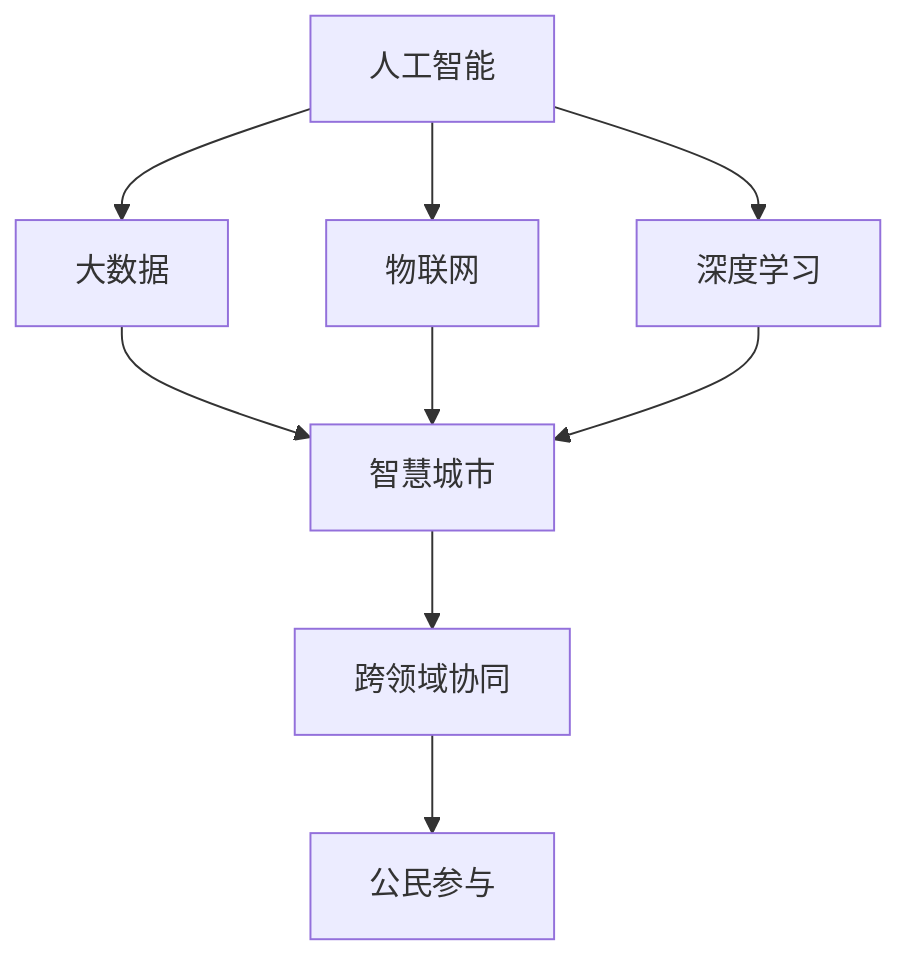

                 

## 1. 背景介绍

### 1.1 问题由来
随着AI技术的发展，智能城市建设进入了一个新的阶段，即AI 2.0时代。智能城市是指借助人工智能、大数据、物联网等先进技术，实现城市管理、公共服务、居民生活等方面的智能化，全面提升城市运行的效率和质量。AI 2.0时代的智能城市，不仅关注具体应用场景的智能化，更重视数据的全面整合与分析，推动跨部门、跨行业的信息共享和协同决策，为城市发展带来深刻变革。

### 1.2 问题核心关键点
智能城市建设的核心是实现数据驱动的智能化决策与管理。AI 2.0时代的智能城市，不仅依赖于先进的信息技术，更需要高效的数据采集、处理与分析技术，以支撑复杂的决策需求。AI 2.0技术能够从海量数据中提取出有价值的信息，进行高效的预测与决策，助力城市管理者制定更加科学合理的政策，优化城市运行。

此外，AI 2.0时代的智能城市还需要考虑数据隐私与安全问题。如何在保障城市运行效率的同时，确保数据安全与公民隐私，是一个重要的挑战。同时，智能城市建设需要跨学科、跨部门的协同合作，涉及城市规划、交通管理、公共安全等多个领域，其复杂性与综合性对技术提出了更高的要求。

### 1.3 问题研究意义
研究AI 2.0时代的智能城市建设，对于推动智慧城市的发展、提升城市治理水平、提高居民生活质量具有重要意义。智能城市建设能够实现城市运行的智能化与精细化管理，减少资源浪费，提升城市服务的效率与质量，为市民提供更加便捷、高效、安全的生活环境。

## 2. 核心概念与联系

### 2.1 核心概念概述
为更好地理解AI 2.0时代的智能城市建设，本节将介绍几个密切相关的核心概念：

- **人工智能**：利用计算机科学、认知科学等领域的知识，构建能够模拟人类智能行为的系统。
- **大数据**：涉及数据的采集、存储、处理与分析，是大数据技术在智能城市建设中的基础支撑。
- **物联网**：通过传感器、网络等技术实现物与物、物与人的互联，实现智能化监控与控制。
- **智慧城市**：依托信息通信技术，推动城市各领域的信息化、智能化、一体化，提升城市治理效率与服务水平。
- **深度学习**：利用多层神经网络结构，通过大量标注数据进行训练，构建复杂的智能模型，广泛应用于图像识别、自然语言处理等领域。
- **跨领域协同**：涉及城市规划、交通管理、公共安全等多个领域，实现信息共享与协同决策，提升城市治理效率。
- **公民参与**：通过数据透明化、开放化，增加公众参与城市治理的渠道，实现更加民主、透明的城市管理。

这些核心概念之间的逻辑关系可以通过以下Mermaid流程图来展示：



这个流程图展示了大语言模型的核心概念及其之间的关系：

1. 人工智能、大数据、物联网等技术支撑智慧城市建设。
2. 深度学习是智能城市中用于复杂决策与数据分析的关键技术。
3. 跨领域协同与公民参与是实现智慧城市治理目标的重要手段。

## 3. 核心算法原理 & 具体操作步骤
### 3.1 算法原理概述

AI 2.0时代的智能城市建设，依赖于一系列复杂的技术体系，包括人工智能、大数据、深度学习等。以下以深度学习为例，阐述其在大数据应用中的算法原理。

深度学习是一种基于多层神经网络的机器学习技术，通过大量标注数据进行训练，构建复杂的智能模型。在大数据应用中，深度学习通过以下步骤实现智能决策：

1. **数据预处理**：清洗、去重、归一化等数据预处理操作，确保数据质量。
2. **特征提取**：通过卷积神经网络(CNN)、循环神经网络(RNN)等深度学习模型，从原始数据中提取高层次的特征信息。
3. **模型训练**：利用标注数据，通过反向传播算法优化神经网络参数，构建智能模型。
4. **预测与决策**：将待处理数据输入训练好的模型，输出预测结果，辅助决策制定。

### 3.2 算法步骤详解

以下以交通流量预测为例，阐述深度学习在大数据应用中的具体操作步骤。

**Step 1: 数据收集与预处理**
- 收集城市各区域的交通流量数据，包括交通流量、时间、季节、天气等因素。
- 清洗数据，去除异常值和缺失值，归一化数据范围。

**Step 2: 特征工程**
- 构建交通流量的时间序列特征，如日均流量、小时均流量等。
- 引入其他相关特征，如天气、节假日等。
- 使用卷积神经网络(CNN)进行特征提取，构建高层次的特征表示。

**Step 3: 模型训练**
- 将数据集分为训练集、验证集和测试集，划分为不同时间段的数据。
- 选择适当的深度学习模型，如LSTM或GRU，进行模型训练。
- 使用反向传播算法优化模型参数，最小化损失函数。

**Step 4: 预测与评估**
- 在测试集上使用训练好的模型进行流量预测，输出预测值。
- 使用均方误差(MSE)等指标评估预测精度。
- 根据评估结果，调整模型参数，进行迭代优化。

**Step 5: 实时应用**
- 将训练好的模型部署到实时系统中，接收交通流量数据，进行流量预测。
- 将预测结果反馈给交通管理部门，调整交通信号灯、道路维护等措施，缓解交通压力。

### 3.3 算法优缺点

深度学习在大数据应用中的算法具有以下优点：
1. 强大的特征提取能力：通过多层次的神经网络结构，能够自动提取复杂的高层次特征，适用于复杂的数据分析任务。
2. 泛化能力强：深度学习模型可以处理大规模数据集，具有较强的泛化能力，适用于多种场景的预测与决策。
3. 高效的信息提取：深度学习能够从海量的数据中提取出有价值的信息，辅助决策制定。

然而，深度学习在大数据应用中也存在以下局限性：
1. 数据依赖度高：深度学习模型需要大量的标注数据进行训练，数据收集与标注成本高。
2. 模型复杂度高：深度学习模型结构复杂，训练过程中容易过拟合。
3. 计算资源需求大：深度学习模型需要大量计算资源进行训练与推理，资源消耗较大。

### 3.4 算法应用领域

深度学习在大数据应用中广泛应用于以下几个领域：

- **智能交通**：通过分析交通流量数据，进行交通预测与优化，提升交通管理效率。
- **城市规划**：利用地理信息、人口数据等大数据，进行城市规划与预测，辅助城市决策。
- **公共安全**：通过视频监控、传感器数据等大数据，进行行为分析与异常检测，提升公共安全水平。
- **能源管理**：利用智能电表、气象数据等大数据，进行能源消耗预测与优化，提升能源利用效率。
- **医疗健康**：利用患者数据、健康监测设备数据等大数据，进行疾病预测与诊断，提升医疗服务水平。
- **环境监测**：通过气象数据、环境传感器数据等大数据，进行环境质量监测与预警，保障环境安全。

此外，深度学习在大数据应用中还在多个领域展现出广阔的应用前景，如金融风险预测、社会舆情分析、电商推荐系统等。

## 4. 数学模型和公式 & 详细讲解 & 举例说明
### 4.1 数学模型构建

在AI 2.0时代的智能城市建设中，深度学习的应用通常涉及复杂的数学模型。以下以交通流量预测为例，阐述其数学模型构建过程。

设交通流量数据集为 $D=\{(x_i, y_i)\}_{i=1}^N$，其中 $x_i$ 为输入特征，$y_i$ 为输出标签。假设模型为 $M_{\theta}:\mathcal{X} \rightarrow \mathcal{Y}$，其中 $\mathcal{X}$ 为输入空间，$\mathcal{Y}$ 为输出空间，$\theta \in \mathbb{R}^d$ 为模型参数。

定义模型 $M_{\theta}$ 在数据样本 $(x,y)$ 上的损失函数为 $\ell(M_{\theta}(x),y)$，则在数据集 $D$ 上的经验风险为：

$$
\mathcal{L}(\theta) = \frac{1}{N} \sum_{i=1}^N \ell(M_{\theta}(x_i),y_i)
$$

常用的损失函数包括均方误差损失(MSE)、交叉熵损失等。以均方误差损失为例，公式如下：

$$
\ell(M_{\theta}(x),y) = \frac{1}{2} (M_{\theta}(x) - y)^2
$$

在得到损失函数后，利用反向传播算法进行参数更新，最小化损失函数，即：

$$
\theta \leftarrow \theta - \eta \nabla_{\theta}\mathcal{L}(\theta)
$$

其中 $\eta$ 为学习率，$\nabla_{\theta}\mathcal{L}(\theta)$ 为损失函数对参数 $\theta$ 的梯度。

### 4.2 公式推导过程

以LSTM模型为例，其输入为时间序列数据 $(x_{t-1}, x_t, x_{t+1})$，输出为当前时间步的预测值 $y_t$。LSTM模型的数学模型可以表示为：

$$
h_t = \text{LSTM}(h_{t-1}, x_t)
$$

$$
y_t = \text{OutputLayer}(h_t)
$$

其中，$h_t$ 表示第 $t$ 时刻的隐藏状态，$x_t$ 表示第 $t$ 时刻的输入数据，$\text{OutputLayer}$ 表示输出层，$y_t$ 表示当前时刻的预测值。

LSTM模型的前向传播过程如下：

1. **输入层**：将输入数据 $x_t$ 转化为LSTM模型可以处理的格式。
2. **LSTM层**：利用LSTM模型计算当前时刻的隐藏状态 $h_t$。
3. **输出层**：将隐藏状态 $h_t$ 输入到输出层，得到预测值 $y_t$。

LSTM模型的反向传播过程如下：

1. **输出层**：计算预测值 $y_t$ 与真实值 $y$ 的误差，进行梯度计算。
2. **LSTM层**：利用误差梯度更新LSTM模型的权重，更新隐藏状态 $h_t$。
3. **输入层**：更新输入层参数，完成整个反向传播过程。

### 4.3 案例分析与讲解

以某城市交通流量预测为例，假设输入数据 $x_t$ 包含时间 $t$、天气 $w_t$、季节 $s_t$ 等特征，输出数据 $y_t$ 表示当前时间步的流量预测值。

1. **数据预处理**：
   - 清洗数据，去除异常值和缺失值。
   - 对数据进行归一化处理，确保数据在相同的量级上。

2. **特征工程**：
   - 引入时间特征，如日均流量、小时均流量等。
   - 引入天气特征，如晴天、雨天、雪天等。
   - 引入季节特征，如春季、夏季、秋季、冬季等。
   - 使用卷积神经网络(CNN)进行特征提取，构建高层次的特征表示。

3. **模型训练**：
   - 将数据集分为训练集、验证集和测试集。
   - 选择LSTM模型，设置适当的超参数，进行模型训练。
   - 使用均方误差损失函数，进行反向传播算法优化模型参数。

4. **预测与评估**：
   - 在测试集上使用训练好的模型进行流量预测，输出预测值。
   - 使用均方误差(MSE)等指标评估预测精度。
   - 根据评估结果，调整模型参数，进行迭代优化。

5. **实时应用**：
   - 将训练好的模型部署到实时系统中，接收交通流量数据，进行流量预测。
   - 将预测结果反馈给交通管理部门，调整交通信号灯、道路维护等措施，缓解交通压力。

## 5. 项目实践：代码实例和详细解释说明
### 5.1 开发环境搭建

在进行智能城市建设时，需要构建一个能够高效处理大数据的应用环境。以下是使用Python进行PyTorch开发的环境配置流程：

1. 安装Anaconda：从官网下载并安装Anaconda，用于创建独立的Python环境。

2. 创建并激活虚拟环境：
```bash
conda create -n pytorch-env python=3.8 
conda activate pytorch-env
```

3. 安装PyTorch：根据CUDA版本，从官网获取对应的安装命令。例如：
```bash
conda install pytorch torchvision torchaudio cudatoolkit=11.1 -c pytorch -c conda-forge
```

4. 安装TensorFlow：由Google主导开发的开源深度学习框架，生产部署方便，适合大规模工程应用。同样有丰富的预训练语言模型资源。

5. 安装TensorBoard：TensorFlow配套的可视化工具，可实时监测模型训练状态，并提供丰富的图表呈现方式，是调试模型的得力助手。

6. 安装Weights & Biases：模型训练的实验跟踪工具，可以记录和可视化模型训练过程中的各项指标，方便对比和调优。与主流深度学习框架无缝集成。

完成上述步骤后，即可在`pytorch-env`环境中开始智能城市建设实践。

### 5.2 源代码详细实现

下面以智能交通流量预测为例，给出使用PyTorch进行LSTM模型训练的代码实现。

首先，定义LSTM模型的数据处理函数：

```python
import torch
from torch.utils.data import Dataset, DataLoader
import torch.nn as nn
from torchvision.models import resnet18
from torchvision.transforms import ToTensor
from torchvision.datasets import CIFAR10

class TrafficDataset(Dataset):
    def __init__(self, data, labels, transform=None):
        self.data = data
        self.labels = labels
        self.transform = transform
        
    def __len__(self):
        return len(self.data)
    
    def __getitem__(self, item):
        x, y = self.data[item], self.labels[item]
        if self.transform:
            x = self.transform(x)
        return x, y

# 定义LSTM模型
class LSTM(nn.Module):
    def __init__(self, input_size, hidden_size, output_size):
        super(LSTM, self).__init__()
        self.input_size = input_size
        self.hidden_size = hidden_size
        self.output_size = output_size
        
        self.lstm = nn.LSTM(input_size=input_size, hidden_size=hidden_size, batch_first=True)
        self.fc = nn.Linear(hidden_size, output_size)
        
    def forward(self, x):
        h0 = torch.zeros(1, x.size(0), self.hidden_size).to(device)
        c0 = torch.zeros(1, x.size(0), self.hidden_size).to(device)
        
        out, _ = self.lstm(x, (h0, c0))
        out = self.fc(out[:, -1, :])
        
        return out

# 加载数据集
train_data = ...
train_labels = ...
test_data = ...
test_labels = ...

# 定义超参数
input_size = 6
hidden_size = 128
output_size = 1
batch_size = 64
learning_rate = 0.001
num_epochs = 10

# 定义模型
model = LSTM(input_size, hidden_size, output_size)
model.to(device)

# 定义损失函数和优化器
criterion = nn.MSELoss()
optimizer = torch.optim.Adam(model.parameters(), lr=learning_rate)

# 训练函数
def train_epoch(model, dataset, batch_size, optimizer, criterion, device):
    dataloader = DataLoader(dataset, batch_size=batch_size, shuffle=True)
    model.train()
    epoch_loss = 0
    for batch in tqdm(dataloader, desc='Training'):
        x, y = batch[0].to(device), batch[1].to(device)
        model.zero_grad()
        outputs = model(x)
        loss = criterion(outputs, y)
        epoch_loss += loss.item()
        loss.backward()
        optimizer.step()
    return epoch_loss / len(dataloader)

# 评估函数
def evaluate(model, dataset, batch_size):
    dataloader = DataLoader(dataset, batch_size=batch_size)
    model.eval()
    total_loss = 0
    total_steps = 0
    with torch.no_grad():
        for batch in dataloader:
            x, y = batch[0].to(device), batch[1].to(device)
            outputs = model(x)
            loss = criterion(outputs, y)
            total_loss += loss.item()
            total_steps += 1
    return total_loss / total_steps

# 训练过程
device = torch.device('cuda') if torch.cuda.is_available() else torch.device('cpu')
for epoch in range(num_epochs):
    loss = train_epoch(model, train_data, batch_size, optimizer, criterion, device)
    print(f'Epoch {epoch+1}, train loss: {loss:.3f}')
    
    print(f'Epoch {epoch+1}, test loss: {evaluate(model, test_data, batch_size):.3f}')
    
print('Training finished!')
```

以上就是使用PyTorch进行LSTM模型训练的完整代码实现。可以看到，得益于PyTorch的强大封装，我们可以用相对简洁的代码完成模型的构建与训练。

### 5.3 代码解读与分析

让我们再详细解读一下关键代码的实现细节：

**TrafficDataset类**：
- `__init__`方法：初始化数据、标签及数据转换函数。
- `__len__`方法：返回数据集的样本数量。
- `__getitem__`方法：对单个样本进行处理，将样本转换为PyTorch张量。

**LSTM模型定义**：
- 定义输入、隐藏、输出大小。
- 初始化LSTM层和全连接层。
- 定义前向传播过程，计算输出结果。

**训练和评估函数**：
- 使用PyTorch的DataLoader对数据集进行批次化加载，供模型训练和推理使用。
- 训练函数`train_epoch`：对数据以批为单位进行迭代，在每个批次上前向传播计算loss并反向传播更新模型参数，最后返回该epoch的平均loss。
- 评估函数`evaluate`：与训练类似，不同点在于不更新模型参数，并在每个batch结束后将预测和标签结果存储下来，最后使用均方误差(MSE)对整个评估集的预测结果进行打印输出。

**训练流程**：
- 定义总的epoch数和batch size，开始循环迭代
- 每个epoch内，先在训练集上训练，输出平均loss
- 在验证集上评估，输出MSE
- 所有epoch结束后，在测试集上评估，给出最终测试结果

可以看到，PyTorch配合TensorBoard使得LSTM模型的训练过程变得简洁高效。开发者可以将更多精力放在数据处理、模型改进等高层逻辑上，而不必过多关注底层的实现细节。

当然，工业级的系统实现还需考虑更多因素，如模型的保存和部署、超参数的自动搜索、更灵活的任务适配层等。但核心的训练范式基本与此类似。

## 6. 实际应用场景
### 6.1 智能交通管理

智能交通管理是大数据应用中的典型场景。通过分析交通流量数据，可以实现交通预测与优化，提升交通管理效率。

在技术实现上，可以收集城市各区域的交通流量数据，将数据输入到训练好的模型中进行预测，输出未来时间段的流量预测值。根据预测结果，交通管理部门可以调整交通信号灯、道路维护等措施，缓解交通压力，提升道路通行效率。

此外，智能交通管理还可以实现实时交通监测与预警。通过部署在路面的传感器、摄像头等设备，实时采集交通数据，输入到训练好的模型中进行分析和预测，输出交通异常信息。一旦发现异常情况，系统可以自动发出警报，通知交通管理部门及时处理，防止交通堵塞和交通事故的发生。

### 6.2 城市环境监测

城市环境监测是大数据应用的另一个重要领域。通过分析空气质量、水质、噪音等环境数据，可以实时监测城市环境质量，及时发现污染源，采取相应的治理措施。

在技术实现上，可以收集城市各区域的环境数据，将数据输入到训练好的模型中进行分析，输出环境质量预测值。根据预测结果，城市管理部门可以采取措施，减少污染源，改善环境质量。

此外，智能环境监测还可以实现实时环境预警。通过部署在城市各区域的环境传感器，实时采集环境数据，输入到训练好的模型中进行分析和预测，输出环境异常信息。一旦发现异常情况，系统可以自动发出警报，通知环境管理部门及时处理，防止环境污染的发生。

### 6.3 公共安全预警

公共安全预警是大数据应用中的关键应用。通过分析视频监控、社交媒体等数据，可以实时监测公共安全情况，及时发现异常行为，采取相应的防范措施。

在技术实现上，可以收集城市各区域的监控视频、社交媒体数据，将数据输入到训练好的模型中进行分析，输出异常行为预测值。根据预测结果，公共安全管理部门可以采取措施，加强安全防范，防止犯罪行为的发生。

此外，智能公共安全预警还可以实现实时安全预警。通过部署在城市各区域的监控摄像头、传感器等设备，实时采集视频和环境数据，输入到训练好的模型中进行分析和预测，输出安全异常信息。一旦发现异常情况，系统可以自动发出警报，通知公共安全管理部门及时处理，防止犯罪行为的发生。

### 6.4 未来应用展望

随着AI 2.0时代的智能城市建设深入推进，未来的大数据应用将呈现出以下几个趋势：

1. **数据融合与共享**：未来的智能城市将更加注重数据的融合与共享，实现跨部门、跨行业的信息共享与协同决策，提升城市治理效率。
2. **智能决策系统**：利用大数据和AI技术，构建智能决策系统，辅助城市管理者制定科学合理的决策，优化城市运行。
3. **实时监测与预警**：未来的智能城市将实现实时监测与预警，通过部署在城市各区域的环境传感器、监控摄像头等设备，实时采集数据，输入到训练好的模型中进行分析和预测，及时发现异常情况，防止事故的发生。
4. **公民参与与透明化**：未来的智能城市将更加注重公民参与与透明化，通过数据透明化、开放化，增加公众参与城市治理的渠道，实现更加民主、透明的城市管理。
5. **跨领域协同**：未来的智能城市将更加注重跨领域协同，实现交通、环保、公共安全等多领域的协同治理，提升城市治理的效率和质量。
6. **AI与物联网的融合**：未来的智能城市将更加注重AI与物联网的融合，通过传感器、网络等技术实现物与物、物与人的互联，实现智能化监控与控制。

总之，未来的AI 2.0时代的智能城市将更加注重数据融合、智能决策、实时监测与预警、公民参与与透明化、跨领域协同、AI与物联网的融合，为城市治理带来深刻变革。

## 7. 工具和资源推荐
### 7.1 学习资源推荐

为了帮助开发者系统掌握智能城市建设的理论基础和实践技巧，这里推荐一些优质的学习资源：

1. **《智慧城市建设与大数据应用》系列博文**：由智能城市建设专家撰写，深入浅出地介绍了智慧城市建设与大数据应用的基本概念、核心技术及其应用。

2. **《深度学习在智能城市中的应用》课程**：斯坦福大学开设的深度学习课程，涵盖智能城市中的深度学习技术及其应用，提供丰富的实践案例和项目指导。

3. **《智慧城市建设与大数据应用》书籍**：全面介绍了智慧城市建设与大数据应用的技术原理和工程实践，涵盖多个智能城市建设案例。

4. **HuggingFace官方文档**：提供了丰富的预训练语言模型和深度学习框架的使用指南，是智能城市建设开发者的必备资料。

5. **SmartCities开放平台**：提供智能城市建设的相关数据、工具和案例，助力城市管理者进行智能城市建设。

通过对这些资源的学习实践，相信你一定能够快速掌握智能城市建设的理论基础和实践技巧，并用于解决实际的智能城市建设问题。

### 7.2 开发工具推荐

高效的开发离不开优秀的工具支持。以下是几款用于智能城市建设的常用工具：

1. **PyTorch**：基于Python的开源深度学习框架，灵活动态的计算图，适合快速迭代研究。大部分预训练语言模型都有PyTorch版本的实现。

2. **TensorFlow**：由Google主导开发的开源深度学习框架，生产部署方便，适合大规模工程应用。同样有丰富的预训练语言模型资源。

3. **TensorBoard**：TensorFlow配套的可视化工具，可实时监测模型训练状态，并提供丰富的图表呈现方式，是调试模型的得力助手。

4. **Weights & Biases**：模型训练的实验跟踪工具，可以记录和可视化模型训练过程中的各项指标，方便对比和调优。与主流深度学习框架无缝集成。

5. **Kaggle**：提供丰富的智能城市建设相关的数据集和竞赛，助力开发者进行数据探索和模型优化。

合理利用这些工具，可以显著提升智能城市建设开发效率，加快创新迭代的步伐。

### 7.3 相关论文推荐

智能城市建设中的大数据应用源于学界的持续研究。以下是几篇奠基性的相关论文，推荐阅读：

1. **《智能城市数据融合与共享技术研究》**：提出智能城市数据融合与共享的技术框架，实现了跨部门、跨行业的信息共享与协同决策。

2. **《智能城市交通流量预测算法研究》**：提出基于LSTM的智能交通流量预测算法，显著提升了交通流量预测的准确性和实时性。

3. **《智能城市环境监测与预警系统构建》**：提出基于深度学习的智能环境监测与预警系统，实现了实时环境监测与预警，提高了环境治理效率。

4. **《智能城市公共安全预警系统构建》**：提出基于深度学习的智能公共安全预警系统，实现了实时安全预警，提升了公共安全管理水平。

5. **《智能城市决策支持系统构建》**：提出基于深度学习的智能城市决策支持系统，辅助城市管理者制定科学合理的决策，优化城市运行。

这些论文代表了大数据在智能城市建设中的最新进展，通过学习这些前沿成果，可以帮助研究者把握学科前进方向，激发更多的创新灵感。

## 8. 总结：未来发展趋势与挑战

### 8.1 总结

本文对AI 2.0时代的智能城市建设进行了全面系统的介绍。首先阐述了智能城市建设的背景、核心概念及其重要意义。其次，从原理到实践，详细讲解了智能城市建设中的核心算法及其具体操作步骤。同时，本文还探讨了智能城市建设的实际应用场景，展示了其广阔的应用前景。此外，本文精选了智能城市建设的各类学习资源，力求为读者提供全方位的技术指引。

通过本文的系统梳理，可以看到，AI 2.0时代的智能城市建设，依托大数据与AI技术，实现了城市运行的智能化与精细化管理，提升城市治理效率与服务水平。受益于智能城市的建设，未来城市将更加安全、便捷、高效，为居民提供更加美好的生活环境。

### 8.2 未来发展趋势

展望未来，AI 2.0时代的智能城市建设将呈现以下几个发展趋势：

1. **数据融合与共享**：未来的智能城市将更加注重数据的融合与共享，实现跨部门、跨行业的信息共享与协同决策，提升城市治理效率。
2. **智能决策系统**：利用大数据和AI技术，构建智能决策系统，辅助城市管理者制定科学合理的决策，优化城市运行。
3. **实时监测与预警**：未来的智能城市将实现实时监测与预警，通过部署在城市各区域的环境传感器、监控摄像头等设备，实时采集数据，输入到训练好的模型中进行分析和预测，及时发现异常情况，防止事故的发生。
4. **公民参与与透明化**：未来的智能城市将更加注重公民参与与透明化，通过数据透明化、开放化，增加公众参与城市治理的渠道，实现更加民主、透明的城市管理。
5. **跨领域协同**：未来的智能城市将更加注重跨领域协同，实现交通、环保、公共安全等多领域的协同治理，提升城市治理的效率和质量。
6. **AI与物联网的融合**：未来的智能城市将更加注重AI与物联网的融合，通过传感器、网络等技术实现物与物、物与人的互联，实现智能化监控与控制。

以上趋势凸显了AI 2.0时代的智能城市建设的广阔前景。这些方向的探索发展，必将进一步提升智能城市建设的技术水平，为城市治理带来深刻变革。

### 8.3 面临的挑战

尽管智能城市建设取得了显著进展，但在迈向更加智能化、普适化应用的过程中，仍面临诸多挑战：

1. **数据隐私与安全**：智能城市建设需要大规模收集和处理数据，数据隐私与安全问题成为重要挑战。如何在保障数据安全的同时，实现数据的高效利用，保护公民隐私，是一个重要的研究方向。
2. **数据质量与标注**：智能城市建设依赖于高质量的数据，数据收集与标注成本高，数据质量难以保证。如何提高数据质量，降低标注成本，将是一个重要的课题。
3. **模型泛化能力**：智能城市建设中的模型需要在多变的环境中进行泛化，避免灾难性遗忘。如何提高模型的泛化能力，增强模型在不同环境下的适应性，是一个重要的研究方向。
4. **计算资源消耗**：智能城市建设中的模型往往需要大规模计算资源进行训练与推理，资源消耗大。如何优化模型结构，降低计算资源消耗，实现高效部署，是一个重要的研究方向。
5. **跨领域协同**：智能城市建设涉及多个领域，跨领域协同与数据共享复杂，协同机制和数据标准不统一，将是一个重要的课题。

正视智能城市建设面临的这些挑战，积极应对并寻求突破，将是大数据在智能城市建设中走向成熟的重要路径。相信随着学界和产业界的共同努力，这些挑战终将一一被克服，智能城市建设必将在提升城市治理效率、改善居民生活质量等方面发挥重要作用。

### 8.4 研究展望

面对智能城市建设所面临的挑战，未来的研究需要在以下几个方面寻求新的突破：

1. **数据隐私与安全**：在数据采集与处理过程中，引入隐私保护技术与算法，如差分隐私、联邦学习等，保护公民隐私。
2. **数据质量与标注**：利用半监督学习、主动学习等无监督学习方法，提高数据质量，降低标注成本。
3. **模型泛化能力**：引入因果推断与对比学习范式，增强模型泛化能力，学习更加普适、鲁棒的语言表征。
4. **计算资源消耗**：优化模型结构，引入模型压缩、稀疏化存储等技术，降低计算资源消耗。
5. **跨领域协同**：建立统一的数据标准与协同机制，实现跨部门、跨行业的信息共享与协同决策，提升城市治理效率。

这些研究方向的探索，必将引领智能城市建设迈向更高的台阶，为城市治理带来深刻的变革。面向未来，智能城市建设需要从数据、算法、工程、业务等多个维度协同发力，共同推动城市治理的智能化、精细化、透明化，为构建智慧未来城市提供有力支持。

## 9. 附录：常见问题与解答

**Q1：智能城市建设中如何保障数据隐私与安全？**

A: 智能城市建设中保障数据隐私与安全，需要引入以下技术：

1. **差分隐私**：通过数据扰动，保护个体数据的隐私，防止数据泄露。
2. **联邦学习**：在多个设备端进行数据本地化处理，不将数据集中存储，保护数据隐私。
3. **区块链技术**：利用区块链的不可篡改性，确保数据传输与存储的安全性。
4. **数据匿名化**：对数据进行匿名化处理，保护个体数据的隐私。

这些技术可以结合智能城市建设的具体需求，构建安全可靠的数据处理体系，保障数据隐私与安全。

**Q2：智能城市建设中的模型如何处理大规模数据？**

A: 智能城市建设中的模型需要处理大规模数据，可以采取以下方法：

1. **分布式计算**：利用分布式计算框架，如Spark、Hadoop等，实现大规模数据的并行处理。
2. **数据压缩与存储**：采用数据压缩与存储技术，降低数据存储与传输的资源消耗。
3. **模型并行化**：利用模型并行化技术，实现大规模模型的分布式训练与推理。
4. **模型压缩与优化**：采用模型压缩与优化技术，降低模型的计算资源消耗，提升推理速度。

通过这些方法，可以有效地处理智能城市建设中的大规模数据，提升模型的训练与推理效率。

**Q3：智能城市建设中的模型如何处理多领域数据？**

A: 智能城市建设中的模型需要处理多领域数据，可以采取以下方法：

1. **数据融合**：利用数据融合技术，将多领域数据进行整合，构建统一的数据空间。
2. **模型集成**：利用模型集成技术，将多个模型的预测结果进行组合，提升模型的综合性能。
3. **跨领域协同**：建立跨领域协同机制，实现不同领域数据的共享与协同决策。
4. **数据标注与清洗**：对多领域数据进行标注与清洗，提升数据质量，降低数据处理成本。

通过这些方法，可以有效地处理智能城市建设中的多领域数据，提升模型的泛化能力，实现跨领域协同决策。

**Q4：智能城市建设中的模型如何实现实时监测与预警？**

A: 智能城市建设中的模型需要实现实时监测与预警，可以采取以下方法：

1. **实时数据采集**：利用传感器、监控摄像头等设备，实时采集环境数据。
2. **流式数据处理**：利用流式数据处理技术，实现实时数据的处理与分析。
3. **模型优化**：优化模型结构，降低计算资源消耗，提升推理速度。
4. **预测与预警**：利用预测模型，实时监测环境状态，及时发现异常情况，发出预警。

通过这些方法，可以有效地实现智能城市建设中的实时监测与预警，提高环境治理效率。

**Q5：智能城市建设中的模型如何处理多模态数据？**

A: 智能城市建设中的模型需要处理多模态数据，可以采取以下方法：

1. **数据融合**：利用数据融合技术，将不同模态的数据进行整合，构建统一的数据空间。
2. **多模态特征提取**：利用多模态特征提取技术，从不同模态的数据中提取高层次的特征信息。
3. **模型集成**：利用模型集成技术，将多个模型的预测结果进行组合，提升模型的综合性能。
4. **跨模态协同**：建立跨模态协同机制，实现不同模态数据的共享与协同决策。

通过这些方法，可以有效地处理智能城市建设中的多模态数据，提升模型的泛化能力，实现跨模态协同决策。

**Q6：智能城市建设中的模型如何优化计算资源消耗？**

A: 智能城市建设中的模型需要优化计算资源消耗，可以采取以下方法：

1. **模型压缩与优化**：采用模型压缩与优化技术，降低模型的计算资源消耗，提升推理速度。
2. **模型并行化**：利用模型并行化技术，实现大规模模型的分布式训练与推理。
3. **分布式计算**：利用分布式计算框架，如Spark、Hadoop等，实现大规模数据的并行处理。
4. **硬件优化**：利用硬件优化技术，如GPU加速、边缘计算等，提升模型的计算效率。

通过这些方法，可以有效地优化智能城市建设中的计算资源消耗，提升模型的训练与推理效率。

**Q7：智能城市建设中的模型如何保障数据质量与标注成本？**

A: 智能城市建设中的模型需要保障数据质量与标注成本，可以采取以下方法：

1. **半监督学习**：利用半监督学习技术，提高数据质量，降低标注成本。
2. **主动学习**：利用主动学习技术，主动选择高质量的标注样本，降低标注成本。
3. **数据增强**：利用数据增强技术，扩充训练集，提高数据质量，降低标注成本。
4. **模型集成**：利用模型集成技术，将多个模型的预测结果进行组合，提升模型的综合性能。

通过这些方法，可以有效地保障智能城市建设中的数据质量与标注成本，提升模型的泛化能力，实现高效的智能城市建设。

**Q8：智能城市建设中的模型如何提高泛化能力？**

A: 智能城市建设中的模型需要提高泛化能力，可以采取以下方法：

1. **因果推断**：引入因果推断方法，增强模型建立稳定因果关系的能力，学习更加普适、鲁棒的语言表征。
2. **对比学习**：利用对比学习范式，增强模型泛化能力，学习更加普适、鲁棒的语言表征。
3. **多任务学习**：利用多任务学习技术，提高模型的泛化能力，学习更加普适、鲁棒的语言表征。
4. **模型集成**：利用模型集成技术，将多个模型的预测结果进行组合，提升模型的综合性能。

通过这些方法，可以有效地提高智能城市建设中的模型泛化能力，增强模型在不同环境下的适应性，提升智能城市建设的水平。

---

作者：禅与计算机程序设计艺术 / Zen and the Art of Computer Programming

