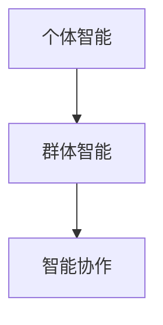

                 

## 1. 背景介绍

### 1.1 问题由来

随着人工智能(AI)技术的迅猛发展，AI agent在各个领域的应用越来越广泛，从工业控制、金融交易到医疗诊断、智能交通。AI agent不仅需要具备个体智能，即能够独立完成特定任务，还需要具备群体智能和智能协作能力，即能够与外界环境和其他AI agent进行互动与协作，共同完成复杂的任务。

在实际应用中，单一AI agent可能难以应对复杂、多变的环境，需要通过群体智能和智能协作，利用其他AI agent的知识和能力，提高整体系统的鲁棒性和适应性。例如，在自动驾驶场景中，单个车辆可能难以完全理解复杂的城市道路环境，需要通过与其他车辆和交通系统的协作，实现安全的交通决策。

因此，理解和掌握AI agent的个体智能、群体智能和智能协作机制，对于构建智能、高效的系统至关重要。本文将从这“三驾马车”入手，系统性地介绍AI agent的智能构成与实现方法。

### 1.2 问题核心关键点

AI agent的智能构成包括个体智能、群体智能和智能协作三个方面。这三者之间的联系与差异，以及如何通过技术手段实现其结合，是本文的核心问题。

1. **个体智能**：指AI agent能够独立处理特定任务的能力。这通常依赖于机器学习模型的训练和优化，使其具备一定的认知和决策能力。
2. **群体智能**：指AI agent能够与外界环境和其他AI agent进行互动，共同完成复杂任务的能力。这涉及多智能体系统的设计和管理，需要考虑通信、协同优化等问题。
3. **智能协作**：指AI agent能够通过信息共享、任务分解等方式，与其他AI agent协同工作，实现任务的高效完成。这涉及分布式计算和协同优化算法的设计。

## 2. 核心概念与联系

### 2.1 核心概念概述

为更好地理解AI agent的智能构成，本节将介绍几个关键概念：

- **个体智能**：指AI agent独立处理特定任务的能力。
- **群体智能**：指AI agent与外界环境和其他AI agent进行互动，共同完成复杂任务的能力。
- **智能协作**：指AI agent通过信息共享、任务分解等方式，与其他AI agent协同工作，实现任务高效完成的能力。

这些概念之间的联系可以通过以下Mermaid流程图来展示：



这个流程图展示了个体智能、群体智能和智能协作之间的逻辑关系：

1. 个体智能是群体智能和智能协作的基础。
2. 群体智能依赖于个体智能，通过个体间的信息共享和协同优化实现。
3. 智能协作是在群体智能的基础上，进一步优化任务完成效率。

## 3. 核心算法原理 & 具体操作步骤

### 3.1 算法原理概述

AI agent的智能构成涉及多个方面的算法和技术，包括但不限于机器学习、多智能体系统、协同优化算法等。其核心原理可以归纳为以下几点：

1. **个体智能算法**：包括强化学习、神经网络等方法，用于训练AI agent处理特定任务的能力。
2. **群体智能算法**：包括分布式算法、协同优化算法等，用于设计和管理多智能体系统，实现信息共享和协同决策。
3. **智能协作算法**：包括信息共享、任务分解等方法，用于优化多智能体间的协同工作，提高整体系统效率。

### 3.2 算法步骤详解

AI agent的智能构成涉及多个算法的步骤，包括数据采集、模型训练、协同优化等。以下以强化学习为例，详细介绍AI agent个体智能的实现步骤：

**Step 1: 数据采集**

AI agent需要采集环境数据和行为数据，用于训练和优化模型。数据采集可以通过传感器、摄像头等设备进行，也可以从已有数据集中提取。

**Step 2: 模型训练**

选择适当的强化学习算法，如Q-learning、SARSA等，设计状态-动作-奖励(即SAR)模型，进行模型训练。通过不断迭代，优化模型参数，使其能够最大化累计奖励。

**Step 3: 行为决策**

训练好的AI agent模型能够在特定状态下选择最优动作，完成特定任务。例如，在自动驾驶中，AI agent可以实时感知环境，通过模型决策，选择最佳的行驶路线。

### 3.3 算法优缺点

AI agent的智能构成涉及多个算法的应用，每种算法有其自身的优缺点：

- **个体智能算法**：
  - **优点**：算法简单，易于实现，适用于处理特定任务。
  - **缺点**：对环境的复杂性和多样性敏感，容易陷入局部最优解。
  
- **群体智能算法**：
  - **优点**：能够充分利用多智能体的知识和能力，实现复杂的协同决策。
  - **缺点**：设计和实现复杂，容易出现通信瓶颈和协同失败等问题。
  
- **智能协作算法**：
  - **优点**：能够提高整体系统效率，实现任务的高效完成。
  - **缺点**：算法复杂，需要考虑信息共享和任务分解等问题。

### 3.4 算法应用领域

AI agent的智能构成广泛应用于各个领域，包括但不限于：

- **智能交通**：通过自动驾驶技术，提高交通安全和效率。
- **金融交易**：通过AI算法，实现智能交易和风险控制。
- **医疗诊断**：通过AI agent协同工作，提高诊断准确性和效率。
- **工业控制**：通过AI agent优化生产流程，提高生产效率。
- **智能客服**：通过AI agent处理客户咨询，提高服务质量。

## 4. 数学模型和公式 & 详细讲解 & 举例说明

### 4.1 数学模型构建

以下以强化学习为例，介绍AI agent个体智能的数学模型构建：

- **状态-动作-奖励模型(SAR)**：
  $$
  S_t, A_t, R_t = (S_0, A_0, R_0), S_t \in \mathcal{S}, A_t \in \mathcal{A}, R_t \in [0, 1]
  $$
  其中 $S_t$ 表示当前状态，$A_t$ 表示当前动作，$R_t$ 表示当前奖励。

- **状态转移模型**：
  $$
  S_{t+1} = f(S_t, A_t)
  $$
  其中 $f$ 表示状态转移函数，用于描述状态随动作的演化。

- **累计奖励模型**：
  $$
  G_t = \sum_{k=t}^{\infty} \gamma^k R_k
  $$
  其中 $\gamma \in [0, 1]$ 表示折扣因子，$G_t$ 表示从当前状态开始，未来所有奖励的累计值。

### 4.2 公式推导过程

以下推导强化学习中Q-learning算法的公式：

- **Q值函数**：
  $$
  Q(s, a) = r + \gamma \max_{a'} Q(s', a')
  $$
  其中 $Q(s, a)$ 表示在状态 $s$ 下，采取动作 $a$ 的Q值。

- **Q-learning更新公式**：
  $$
  Q(s_t, a_t) \leftarrow Q(s_t, a_t) + \alpha [r_t + \gamma \max_{a'} Q(s_{t+1}, a') - Q(s_t, a_t)]
  $$
  其中 $\alpha$ 表示学习率，$r_t$ 表示当前奖励，$s_t, a_t, s_{t+1}$ 分别表示当前状态、当前动作和下一个状态。

### 4.3 案例分析与讲解

以自动驾驶为例，分析强化学习在AI agent个体智能中的应用：

1. **状态定义**：车辆当前位置、速度、周围障碍物等。
2. **动作定义**：加速、减速、左转、右转等。
3. **奖励定义**：安全到达终点、避免碰撞等。

AI agent通过强化学习算法，不断优化策略，在复杂的城市道路环境中，学习出最优的驾驶行为。

## 5. 项目实践：代码实例和详细解释说明

### 5.1 开发环境搭建

要进行AI agent的开发实践，首先需要准备好开发环境。以下是使用Python和OpenAI Gym进行强化学习实验的开发环境配置流程：

1. 安装Anaconda：从官网下载并安装Anaconda，用于创建独立的Python环境。
2. 创建并激活虚拟环境：
```bash
conda create -n reinforcement-env python=3.8 
conda activate reinforcement-env
```
3. 安装必要的库：
```bash
pip install numpy matplotlib gym
```
4. 安装OpenAI Gym：
```bash
pip install gym[atari]
```
完成上述步骤后，即可在`reinforcement-env`环境中进行强化学习实验。

### 5.2 源代码详细实现

以下是一个使用Q-learning算法进行自动驾驶AI agent训练的Python代码实现：

```python
import gym
import numpy as np

env = gym.make('CartPole-v1')

# 定义Q值函数
def q_value(state, action):
    return np.zeros_like(env.action_space.sample())

# 定义Q-learning更新函数
def q_learning(env, num_episodes, learning_rate=0.1, discount_factor=0.9):
    Q = np.zeros((env.observation_space.shape[0], env.action_space.n))

    for episode in range(num_episodes):
        state = env.reset()
        done = False
        while not done:
            action = env.action_space.sample()
            next_state, reward, done, _ = env.step(action)
            Q[state, action] += learning_rate * (reward + discount_factor * np.max(Q[next_state]) - Q[state, action])
            state = next_state

    return Q

# 运行强化学习实验
Q = q_learning(env, 1000)
```

这段代码首先定义了一个简化版的自动驾驶环境（CartPole），并使用Q-learning算法进行AI agent的训练。代码中定义了Q值函数和Q-learning更新函数，并通过循环迭代，不断更新Q值，直到达到预设的训练次数。

### 5.3 代码解读与分析

让我们再详细解读一下关键代码的实现细节：

- **gym库**：用于创建模拟环境，方便进行强化学习实验。
- **Q值函数**：定义Q值函数，初始化为全零。
- **Q-learning更新函数**：在每轮训练中，根据当前状态和动作，更新Q值。
- **训练过程**：循环迭代进行Q-learning更新，直到达到预设的训练次数。

这段代码虽然简单，但涵盖了强化学习实验的各个关键步骤，包括环境构建、状态定义、动作选择、奖励计算等。通过不断迭代Q-learning更新公式，模型能够逐步优化策略，实现最优的决策行为。

## 6. 实际应用场景

### 6.1 智能交通

基于AI agent的群体智能和智能协作技术，智能交通系统可以显著提高交通效率和安全。例如，通过自动驾驶车辆协同工作，实现交通流量优化和避障决策。

在实际应用中，可以通过多智能体系统设计，实现车辆之间的信息共享和协同优化。例如，车辆之间通过V2V通信，共享道路信息，协同规避障碍物，提高整体系统的鲁棒性。

### 6.2 金融交易

AI agent在金融交易中，可以通过群体智能和智能协作，实现智能交易和风险控制。例如，通过多智能体协同决策，自动生成交易策略，实时调整资产配置，降低风险。

在金融交易系统中，AI agent可以通过群体智能算法，设计协同优化模型，实现不同智能体的知识共享和协同决策。例如，通过分布式算法，每个AI agent实时处理市场数据，协同生成交易策略，实现最优的资产配置。

### 6.3 医疗诊断

基于AI agent的群体智能和智能协作技术，医疗诊断系统可以显著提高诊断准确性和效率。例如，通过多智能体协同工作，实现复杂病例的联合诊断和治疗决策。

在医疗诊断系统中，AI agent可以通过多智能体系统设计，实现医生之间的知识共享和协同决策。例如，通过信息共享平台，医生之间可以实时共享诊断结果和医疗知识，协同制定治疗方案。

### 6.4 未来应用展望

随着AI agent技术的不断发展，其在群体智能和智能协作方面的应用前景广阔。未来，AI agent将在更多领域得到应用，为人类社会带来深刻变革：

- **智能制造**：通过AI agent协同工作，实现智能生产线和柔性制造。
- **智能城市**：通过AI agent协同决策，实现智慧城市管理和环境监测。
- **智能教育**：通过AI agent协同工作，实现个性化教育和学习推荐。

## 7. 工具和资源推荐

### 7.1 学习资源推荐

为了帮助开发者系统掌握AI agent的智能构成与实现方法，这里推荐一些优质的学习资源：

1. 《强化学习基础》：由斯坦福大学教授主讲的视频课程，详细介绍了强化学习的理论基础和实际应用。
2. 《多智能体系统》：由MIT教授编写的教材，系统介绍了多智能体系统的设计和实现方法。
3. 《分布式算法》：由MIT教授编写的教材，介绍了分布式算法的设计和管理。
4. 《协同优化算法》：由ICML2019大会论文集中的优秀论文合集，涵盖协同优化的最新研究成果。

通过对这些资源的学习实践，相信你一定能够快速掌握AI agent的智能构成与实现方法，并用于解决实际的智能系统问题。

### 7.2 开发工具推荐

高效的开发离不开优秀的工具支持。以下是几款用于AI agent开发的工具：

1. OpenAI Gym：用于创建模拟环境和进行强化学习实验。
2. TensorFlow和PyTorch：深度学习框架，支持多智能体系统和分布式计算。
3. TensorBoard：用于可视化模型训练过程和结果。
4. Jupyter Notebook：用于编写和分享代码，方便实验记录和分享。

合理利用这些工具，可以显著提升AI agent的开发效率，加速创新迭代的步伐。

### 7.3 相关论文推荐

AI agent的智能构成涉及众多领域的最新研究成果，以下是几篇奠基性的相关论文，推荐阅读：

1. AlphaGo：通过多智能体协同优化，实现了围棋领域的突破。
2. V-TRADER：通过多智能体协同决策，实现了金融交易系统的优化。
3. Multi-Agent POMDP：通过多智能体系统设计，实现了复杂环境的智能决策。
4. DDPG：通过分布式深度强化学习，实现了复杂系统的协同优化。

这些论文代表了大规模智能系统的发展脉络。通过学习这些前沿成果，可以帮助研究者把握学科前进方向，激发更多的创新灵感。

## 8. 总结：未来发展趋势与挑战

### 8.1 总结

本文对AI agent的智能构成进行了全面系统的介绍。首先阐述了AI agent的智能构成包括个体智能、群体智能和智能协作三个方面，明确了这些智能构成之间的联系与差异。其次，从原理到实践，详细讲解了AI agent个体智能、群体智能和智能协作的实现方法，给出了强化学习的完整代码实现。同时，本文还探讨了AI agent在智能交通、金融交易、医疗诊断等领域的实际应用，展示了AI agent技术的广阔前景。最后，本文精选了AI agent技术的各类学习资源，力求为读者提供全方位的技术指引。

通过本文的系统梳理，可以看到，AI agent的智能构成涉及多个算法的应用，其核心原理可以归纳为强化学习、多智能体系统、协同优化算法等。这些智能构成通过技术手段的结合，可以构建出高效、智能的系统，为各行各业带来深刻的变革。未来，伴随AI agent技术的不断演进，相信其在群体智能和智能协作方面的应用将更加广泛，进一步推动人工智能技术的落地应用。

### 8.2 未来发展趋势

展望未来，AI agent的智能构成将呈现以下几个发展趋势：

1. **多模态智能**：AI agent将融合视觉、语音、文本等多种模态信息，实现更全面的智能决策。
2. **自适应智能**：AI agent将具备自适应学习能力，根据环境和任务的变化，动态调整策略和行为。
3. **联邦学习**：AI agent将通过联邦学习技术，实现跨设备、跨系统的协同优化。
4. **可解释性**：AI agent将具备更强的可解释性，增强决策过程的透明度和可信度。
5. **伦理与安全**：AI agent将结合伦理和安全技术，确保其决策过程符合道德标准，避免有害行为。

这些趋势凸显了AI agent技术的广阔前景。这些方向的探索发展，必将进一步提升AI agent系统的智能水平，为人类社会带来更广泛的影响。

### 8.3 面临的挑战

尽管AI agent技术已经取得了瞩目成就，但在迈向更加智能化、普适化应用的过程中，它仍面临着诸多挑战：

1. **数据隐私与安全性**：AI agent系统需要处理大量敏感数据，如何确保数据隐私和安全是一个重要问题。
2. **模型复杂性与计算资源**：AI agent系统通常需要复杂的模型和大量的计算资源，如何优化模型和资源配置是一个重要问题。
3. **可解释性与可信度**：AI agent系统需要具备更强的可解释性，如何确保其决策过程透明可信是一个重要问题。
4. **伦理与道德**：AI agent系统需要符合伦理和道德标准，如何设计符合人类价值观的决策机制是一个重要问题。
5. **跨领域适应性**：AI agent系统需要在不同的领域和场景中具备适应性，如何设计和实现跨领域智能是一个重要问题。

这些挑战需要学界和产业界的共同努力，通过技术创新和政策引导，逐步克服。

### 8.4 研究展望

面对AI agent技术面临的挑战，未来的研究需要在以下几个方面寻求新的突破：

1. **多模态智能技术**：开发更高效的多模态融合算法，实现跨模态信息的整合。
2. **自适应智能算法**：开发更智能的自适应学习算法，实现动态调整策略和行为。
3. **联邦学习技术**：探索更高效的联邦学习算法，实现跨设备、跨系统的协同优化。
4. **可解释性技术**：开发更强的可解释性算法，增强决策过程的透明度和可信度。
5. **伦理与安全技术**：结合伦理和安全技术，设计符合人类价值观的决策机制。

这些研究方向的探索，必将引领AI agent技术迈向更高的台阶，为构建安全、可靠、可解释、可控的智能系统铺平道路。面向未来，AI agent技术还需要与其他人工智能技术进行更深入的融合，如知识表示、因果推理、强化学习等，多路径协同发力，共同推动人工智能技术的进步。只有勇于创新、敢于突破，才能不断拓展AI agent的边界，让智能技术更好地造福人类社会。

## 9. 附录：常见问题与解答

**Q1：AI agent的个体智能、群体智能和智能协作是如何相互关联的？**

A: AI agent的个体智能、群体智能和智能协作是相互关联的，共同构成了AI agent的智能构成。个体智能是群体智能和智能协作的基础，群体智能依赖于个体智能，通过个体间的信息共享和协同优化实现。智能协作是在群体智能的基础上，进一步优化任务完成效率，实现任务的协同工作。

**Q2：如何训练一个高效的AI agent？**

A: 训练一个高效的AI agent，需要综合考虑以下几个方面：
1. 选择合适的模型和算法，如强化学习、神经网络等。
2. 设计合适的状态和动作空间，使其与任务需求相匹配。
3. 设定合适的奖励函数，引导AI agent学习最优策略。
4. 设计合适的更新策略，如Q-learning、SARSA等，进行模型训练。
5. 在训练过程中，不断迭代优化模型参数，确保收敛。

**Q3：AI agent在实际应用中需要注意哪些问题？**

A: AI agent在实际应用中，需要注意以下几个问题：
1. 数据隐私与安全：确保数据隐私和安全，避免数据泄露和滥用。
2. 模型复杂性与计算资源：优化模型和资源配置，确保高效运行。
3. 可解释性与可信度：增强决策过程的透明度和可信度，确保公平性和公正性。
4. 伦理与道德：设计符合人类价值观的决策机制，避免有害行为。
5. 跨领域适应性：确保AI agent在不同领域和场景中的适应性，避免泛化能力不足。

这些问题是AI agent技术应用过程中需要重点考虑的，需要在技术实现和政策设计中得到充分解决。

---

作者：禅与计算机程序设计艺术 / Zen and the Art of Computer Programming

