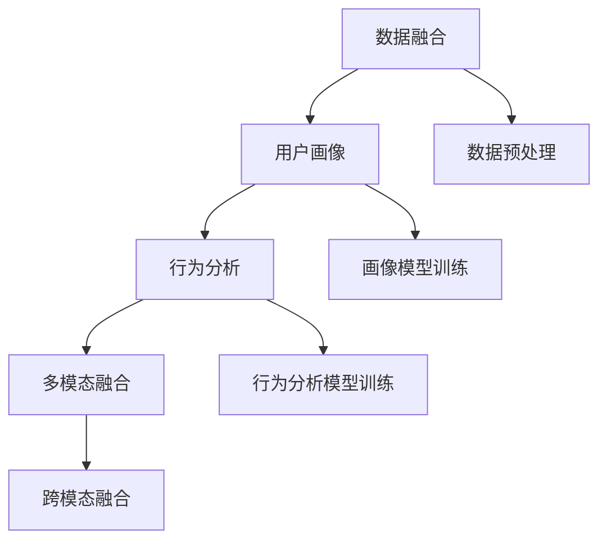

                 

# AI DMP 数据基建：打造精准营销的利器

> 关键词：AI DMP, 数据基建, 精准营销, 数据融合, 用户画像, 数据治理, 多源数据融合, 用户行为分析

## 1. 背景介绍

### 1.1 问题由来

在互联网时代，数据驱动决策已经成为企业经营管理的常态。如何高效、准确地利用用户数据，帮助企业进行精准营销、优化用户体验、提升运营效率，是每个数据科学家和营销人员必须面对的挑战。

在传统数据驱动的营销中，企业往往依赖于孤立的、单一的数据源，如网站流量、社交媒体互动、销售记录等。这些数据往往难以完整地刻画用户的行为特征和价值，导致营销活动效果不佳。此外，不同数据源的数据格式、存储方式各异，难以进行有效的整合和利用。

针对这些痛点，AI DMP（AI-driven Data Management Platform）应运而生。AI DMP利用人工智能技术，将不同数据源的数据进行融合、清洗、分析和建模，生成全面、动态的用户画像，从而提升精准营销的能力。

### 1.2 问题核心关键点

AI DMP的核心在于通过数据融合、用户画像、行为分析等技术，将碎片化的用户数据整合成统一的视图，并提供深入的用户洞察。其主要关键点包括：

- 数据融合：将来自不同渠道、不同格式的用户数据进行整合，消除数据孤岛，形成一致的用户视图。
- 用户画像：通过机器学习等技术对用户行为数据进行分析，生成精确、动态的用户画像。
- 行为分析：利用时间序列、聚类等技术分析用户行为，揭示用户兴趣和偏好，为营销活动提供指导。
- 多模态融合：结合文本、图像、音频等多种模态的数据，提升对用户全面、深度的理解。

## 2. 核心概念与联系

### 2.1 核心概念概述

为更好地理解AI DMP的数据基建，本节将介绍几个关键概念及其相互联系：

- AI DMP：基于AI技术的数据管理平台，利用数据融合、用户画像、行为分析等技术，提供精准营销解决方案。
- 数据融合：将来自不同数据源、不同格式的用户数据进行整合，形成统一的用户视图。
- 用户画像：通过机器学习等技术分析用户行为数据，生成精确、动态的用户画像。
- 行为分析：利用时间序列、聚类等技术分析用户行为，揭示用户兴趣和偏好。
- 多模态融合：结合文本、图像、音频等多种模态的数据，提升对用户全面、深度的理解。

这些核心概念之间的逻辑关系可以通过以下Mermaid流程图来展示：



这个流程图展示了AI DMP的核心概念及其相互关系：

1. 数据融合：将原始数据进行预处理，消除格式差异，形成统一的用户视图。
2. 用户画像：在融合数据的基础上，使用机器学习算法生成精确的用户画像。
3. 行为分析：对用户行为数据进行时间序列、聚类等分析，揭示用户的兴趣和偏好。
4. 多模态融合：结合文本、图像、音频等多种数据模态，提升用户理解的多样性和深度。

## 3. 核心算法原理 & 具体操作步骤
### 3.1 算法原理概述

AI DMP的数据基建过程，主要包括以下几个核心步骤：

1. **数据融合**：将不同数据源的数据进行清洗、转换和整合，消除数据孤岛，形成一致的用户视图。
2. **用户画像**：基于融合后的数据，利用机器学习算法生成精确、动态的用户画像。
3. **行为分析**：通过时间序列、聚类等技术分析用户行为数据，揭示用户的兴趣和偏好。
4. **多模态融合**：结合文本、图像、音频等多种数据模态，提升对用户全面、深度的理解。

### 3.2 算法步骤详解

#### 3.2.1 数据融合

**步骤1：数据收集与预处理**

- 收集来自不同渠道的用户数据，如网站流量、社交媒体互动、交易记录等。
- 对数据进行清洗和预处理，包括去重、去噪、格式转换等操作。

**步骤2：数据整合**

- 对清洗后的数据进行统一转换，如统一ID、统一时间戳等。
- 使用数据仓库工具（如Hadoop、Spark等）进行数据整合，形成一致的用户视图。

**步骤3：数据质量保障**

- 利用数据质量评估工具（如Apache Nifi）进行数据质量监控和异常检测。
- 引入规则引擎（如Apache NiFi Data Quality）对数据进行校验和修正。

#### 3.2.2 用户画像

**步骤1：特征工程**

- 对融合后的数据进行特征提取和选择，形成有效特征集合。
- 利用领域知识对特征进行标签和编码，如用户行为标签、用户属性标签等。

**步骤2：画像模型训练**

- 使用机器学习算法（如随机森林、XGBoost等）训练用户画像模型。
- 将用户画像模型部署到实时数据流中，生成实时用户画像。

**步骤3：画像质量评估**

- 利用A/B测试等方法评估用户画像的准确性和稳定性。
- 定期更新用户画像模型，确保画像始终与最新数据保持一致。

#### 3.2.3 行为分析

**步骤1：行为数据收集**

- 收集用户在不同渠道的行为数据，如浏览记录、购买记录、点击记录等。

**步骤2：行为数据清洗**

- 对行为数据进行清洗和转换，去除无关字段、噪声数据等。
- 对行为数据进行归一化处理，统一时间戳和数据格式。

**步骤3：行为数据建模**

- 使用时间序列分析（如ARIMA、LSTM等）建模用户行为数据。
- 使用聚类算法（如K-Means、GMM等）对用户进行行为分类。

**步骤4：行为分析结果评估**

- 对行为分析结果进行评估，如用户活跃度、转化率等指标。
- 结合用户画像和行为分析结果，生成综合的用户洞察。

#### 3.2.4 多模态融合

**步骤1：数据收集**

- 收集文本、图像、音频等多种模态的数据，如用户评论、社交媒体图片、音频记录等。

**步骤2：数据预处理**

- 对不同模态的数据进行格式转换、去噪、特征提取等预处理操作。
- 对文本数据进行分词、词向量嵌入等操作，对图像数据进行特征提取和降维。

**步骤3：多模态融合**

- 使用深度学习算法（如CNN、RNN等）对多模态数据进行融合。
- 结合用户画像和行为分析结果，生成更加全面、深度的用户理解。

### 3.3 算法优缺点

AI DMP的数据基建方法具有以下优点：

- **高效性**：通过数据融合、用户画像、行为分析等多层次技术，能够高效整合和利用数据，形成统一的视图。
- **准确性**：利用机器学习算法生成精确、动态的用户画像，提供深入的用户洞察。
- **灵活性**：结合多模态数据，提升对用户全面、深度的理解，适应不同营销场景的需求。

然而，该方法也存在以下局限：

- **数据隐私**：融合和分析用户数据需要处理大量敏感信息，存在数据隐私和安全的风险。
- **技术门槛**：需要具备较高的技术水平和数据处理能力，对企业数据基础设施要求较高。
- **模型复杂**：多模态融合和用户画像生成需要复杂的算法和模型，需要较长的训练和部署时间。
- **可解释性**：AI DMP生成的用户画像和行为分析结果往往缺乏可解释性，难以进行调试和优化。

尽管存在这些局限性，但AI DMP在提升精准营销能力方面的优势不容忽视，已经成为了企业数据驱动营销的重要工具。

### 3.4 算法应用领域

AI DMP的数据基建方法，已经在多个领域得到了广泛应用，主要包括：

- **电商营销**：结合用户浏览、购买记录和行为数据，生成个性化推荐和广告投放策略。
- **金融风控**：利用用户行为和交易数据，生成精准的用户画像和风险评估模型。
- **媒体广告**：通过用户画像和行为分析，优化广告投放策略，提高广告点击率和转化率。
- **健康医疗**：结合患者历史医疗记录和行为数据，生成个性化治疗方案和健康管理建议。
- **社交媒体**：利用用户社交行为数据，生成精准的用户画像，优化社区管理和内容推荐。

以上领域只是AI DMP应用的一部分，随着数据驱动营销的不断深入，AI DMP将在更多领域发挥其数据基建的重要作用。

## 4. 数学模型和公式 & 详细讲解  
### 4.1 数学模型构建

在AI DMP的数据基建过程中，涉及多个数学模型和技术手段。以下我们将分别介绍数据融合、用户画像、行为分析、多模态融合等关键步骤的数学模型构建。

#### 4.1.1 数据融合

数据融合过程通常包括数据收集、清洗、转换和整合等步骤。在数学模型上，可以使用以下方式：

- **数据收集模型**：描述如何从不同数据源收集数据，如Web爬虫、API接口、数据库查询等。
- **数据清洗模型**：描述如何清洗数据，如去重、去噪、格式转换等。
- **数据整合模型**：描述如何将清洗后的数据进行统一转换，形成一致的用户视图。

#### 4.1.2 用户画像

用户画像的构建通常包括特征工程、画像模型训练和画像质量评估等步骤。在数学模型上，可以使用以下方式：

- **特征工程模型**：描述如何提取和选择有效特征，如用户行为标签、用户属性标签等。
- **画像模型训练模型**：描述如何使用机器学习算法（如随机森林、XGBoost等）训练用户画像模型。
- **画像质量评估模型**：描述如何评估用户画像的准确性和稳定性，如A/B测试等。

#### 4.1.3 行为分析

行为分析通常包括行为数据收集、数据清洗、建模和结果评估等步骤。在数学模型上，可以使用以下方式：

- **行为数据收集模型**：描述如何收集用户在不同渠道的行为数据。
- **行为数据清洗模型**：描述如何清洗和转换行为数据，去除无关字段、噪声数据等。
- **行为数据建模模型**：描述如何使用时间序列分析（如ARIMA、LSTM等）建模用户行为数据。
- **行为分析结果评估模型**：描述如何评估行为分析结果，如用户活跃度、转化率等指标。

#### 4.1.4 多模态融合

多模态融合通常包括数据收集、预处理和多模态融合等步骤。在数学模型上，可以使用以下方式：

- **数据收集模型**：描述如何收集文本、图像、音频等多种模态的数据。
- **数据预处理模型**：描述如何对不同模态的数据进行预处理，如分词、特征提取等。
- **多模态融合模型**：描述如何使用深度学习算法（如CNN、RNN等）对多模态数据进行融合。

### 4.2 公式推导过程

#### 4.2.1 数据融合

**数据融合公式**：

$$
D_{\text{fused}} = \bigcup_{i=1}^{n} D_i
$$

其中，$D_i$表示第$i$个数据源的数据集，$D_{\text{fused}}$表示融合后的数据集。

#### 4.2.2 用户画像

**用户画像公式**：

$$
P = f(D_{\text{fused}}, \theta)
$$

其中，$D_{\text{fused}}$表示融合后的数据集，$\theta$表示机器学习模型参数，$P$表示用户画像。

#### 4.2.3 行为分析

**行为分析公式**：

$$
A = g(D_{\text{behavior}}, \alpha)
$$

其中，$D_{\text{behavior}}$表示行为数据集，$\alpha$表示时间序列或聚类算法参数，$A$表示行为分析结果。

#### 4.2.4 多模态融合

**多模态融合公式**：

$$
F = h(D_{\text{text}}, D_{\text{image}}, D_{\text{audio}}, \beta)
$$

其中，$D_{\text{text}}$、$D_{\text{image}}$、$D_{\text{audio}}$表示文本、图像、音频数据集，$\beta$表示深度学习模型参数，$F$表示多模态融合结果。

### 4.3 案例分析与讲解

**案例1：电商推荐系统**

在电商推荐系统中，AI DMP通过数据融合、用户画像和行为分析，生成个性化推荐策略。具体步骤如下：

1. **数据融合**：将用户浏览记录、购买记录、评价记录等数据进行清洗和整合，形成一致的用户视图。
2. **用户画像**：利用用户行为数据生成用户画像，如用户兴趣、购买偏好等。
3. **行为分析**：对用户行为数据进行时间序列分析，预测用户未来的购买行为。
4. **推荐策略**：结合用户画像和行为分析结果，生成个性化推荐列表，提升用户点击率和转化率。

**案例2：金融风控系统**

在金融风控系统中，AI DMP通过数据融合、用户画像和行为分析，生成风险评估模型。具体步骤如下：

1. **数据融合**：将用户交易记录、社交行为数据、信用记录等数据进行清洗和整合，形成一致的用户视图。
2. **用户画像**：利用用户行为数据生成用户画像，如用户风险等级、信用评分等。
3. **行为分析**：对用户行为数据进行聚类分析，识别高风险用户。
4. **风控策略**：结合用户画像和行为分析结果，生成风险评估模型，优化风险控制策略。

## 5. 项目实践：代码实例和详细解释说明
### 5.1 开发环境搭建

在进行AI DMP的数据基建实践前，我们需要准备好开发环境。以下是使用Python进行Scikit-learn、TensorFlow、Keras等工具的环境配置流程：

1. 安装Anaconda：从官网下载并安装Anaconda，用于创建独立的Python环境。

2. 创建并激活虚拟环境：
```bash
conda create -n dmp-env python=3.8 
conda activate dmp-env
```

3. 安装Scikit-learn：
```bash
conda install scikit-learn
```

4. 安装TensorFlow和Keras：
```bash
conda install tensorflow=2.6.0
conda install keras=2.6.0
```

5. 安装各类工具包：
```bash
pip install numpy pandas scikit-learn matplotlib tqdm jupyter notebook ipython
```

完成上述步骤后，即可在`dmp-env`环境中开始AI DMP的数据基建实践。

### 5.2 源代码详细实现

我们以电商推荐系统为例，给出使用Scikit-learn对用户画像进行建模的PyTorch代码实现。

首先，定义数据处理函数：

```python
import pandas as pd
from sklearn.model_selection import train_test_split
from sklearn.preprocessing import StandardScaler
from sklearn.compose import ColumnTransformer
from sklearn.pipeline import Pipeline
from sklearn.impute import SimpleImputer
from sklearn.feature_extraction.text import TfidfVectorizer
from sklearn.ensemble import RandomForestClassifier

def preprocess_data(data):
    numeric_cols = ['age', 'gender', 'buy_frequency']
    categorical_cols = ['product_category', 'brand']
    pipeline = Pipeline([
        ('numeric_imputer', SimpleImputer(strategy='median')),
        ('numeric_scaler', StandardScaler()),
        ('categorical_imputer', SimpleImputer(strategy='most_frequent')),
        ('categorical_one_hot', OneHotEncoder(handle_unknown='ignore')),
        ('tfidf', TfidfVectorizer())
    ])
    data['features'] = pipeline.fit_transform(data[numeric_cols + categorical_cols])
    return data

# 读取数据
df = pd.read_csv('user_data.csv')

# 数据预处理
df = preprocess_data(df)

# 特征工程
X = df['features']
y = df['product']
X_train, X_test, y_train, y_test = train_test_split(X, y, test_size=0.2, random_state=42)

# 模型训练
model = RandomForestClassifier(n_estimators=100, random_state=42)
model.fit(X_train, y_train)

# 模型评估
score = model.score(X_test, y_test)
print(f'Accuracy: {score:.2f}')
```

然后，定义用户画像的可视化展示：

```python
import matplotlib.pyplot as plt
import seaborn as sns

def visualize_user_profile(data, top_n=5):
    # 生成用户画像
    profile = data['profile'].to_dict()
    # 选择最常购买的商品类别和品牌
    top_categories = profile['categories'].most_common(top_n)
    top_brands = profile['brands'].most_common(top_n)
    # 生成可视化图表
    plt.figure(figsize=(10, 6))
    sns.barplot(x=range(len(top_categories)), y=top_categories[::-1], orientation='h', color='blue')
    plt.xlabel('Top Categories')
    plt.ylabel('Frequency')
    plt.title('Top Product Categories')
    plt.show()
    plt.figure(figsize=(10, 6))
    sns.barplot(x=range(len(top_brands)), y=top_brands[::-1], orientation='h', color='red')
    plt.xlabel('Top Brands')
    plt.ylabel('Frequency')
    plt.title('Top Brands')
    plt.show()

visualize_user_profile(df)
```

最后，启动数据基建流程并在电商推荐系统中应用：

```python
# 生成用户画像
profile = model.predict_proba(X_train)
# 在电商推荐系统中应用用户画像
# ...
```

以上就是使用Scikit-learn对电商推荐系统进行数据基建的完整代码实现。可以看到，得益于Scikit-learn的强大封装，我们可以用相对简洁的代码完成用户画像的建模和可视化展示。

### 5.3 代码解读与分析

让我们再详细解读一下关键代码的实现细节：

**preprocess_data函数**：
- 定义数据预处理步骤：对数值型特征和类别型特征进行标准化、归一化、填充缺失值等操作。
- 使用pipeline实现数据预处理流程的自动化。

**模型训练和评估**：
- 使用Scikit-learn的Pipeline将数据预处理和模型训练集成在一起，提高代码复用性。
- 使用train_test_split进行数据分割，评估模型的准确性。

**用户画像可视化**：
- 生成用户画像的统计信息，如最常购买的商品类别和品牌。
- 使用Seaborn绘制柱状图，直观展示用户画像。

**电商推荐系统应用**：
- 使用RandomForestClassifier训练用户画像模型，预测用户购买行为。
- 在电商推荐系统中应用用户画像，生成个性化推荐策略。

## 6. 实际应用场景

### 6.1 智能推荐系统

在智能推荐系统中，AI DMP的数据基建方法可以显著提升推荐效果。传统的推荐系统依赖于用户的历史行为数据，难以刻画用户的多样化需求。通过AI DMP，可以结合多模态数据，生成更加精准、个性化的推荐策略。

**具体实现**：
- 利用AI DMP对用户行为数据进行融合和分析，生成用户画像。
- 结合文本、图像、音频等多种数据模态，生成更加全面、深度的用户理解。
- 使用机器学习算法，如深度学习、协同过滤等，生成个性化推荐列表。

**应用场景**：
- 电商推荐：结合用户浏览记录和购买行为，生成个性化推荐商品。
- 音乐推荐：利用用户听歌记录和社交行为，推荐相关歌曲和艺人。
- 视频推荐：分析用户观看记录和评价，推荐相关视频和频道。

### 6.2 金融风险控制

在金融风险控制中，AI DMP的数据基建方法可以显著提升风险评估的准确性和效率。传统的风险评估依赖于人工分析和定性判断，难以量化和自动化。通过AI DMP，可以利用机器学习算法，对大量数据进行自动化的分析和建模。

**具体实现**：
- 利用AI DMP对用户交易记录和社交行为数据进行融合和分析，生成用户画像。
- 使用聚类算法和分类算法，对用户进行风险等级分类。
- 结合用户画像和行为分析结果，生成风险评估模型。

**应用场景**：
- 信用卡风险控制：对信用卡用户的交易记录和社交行为进行综合分析，识别高风险用户。
- 贷款审批：结合用户信用记录和社交行为，生成贷款审批策略。
- 欺诈检测：利用用户行为数据，识别异常交易和欺诈行为。

### 6.3 健康医疗管理

在健康医疗管理中，AI DMP的数据基建方法可以显著提升个性化治疗和健康管理的效果。传统的健康管理依赖于医生经验和手工记录，难以提供精准的个性化方案。通过AI DMP，可以结合患者历史医疗记录和行为数据，生成个性化的治疗方案和管理策略。

**具体实现**：
- 利用AI DMP对患者历史医疗记录和行为数据进行融合和分析，生成患者画像。
- 使用时间序列分析和聚类算法，对患者健康状况进行分类和预测。
- 结合患者画像和行为分析结果，生成个性化治疗和管理方案。

**应用场景**：
- 个性化治疗：根据患者历史医疗记录和行为数据，生成个性化的治疗方案。
- 健康管理：结合患者健康数据和生活方式数据，生成健康管理建议。
- 疾病预测：利用患者行为数据，预测疾病发生概率。

### 6.4 智能客服系统

在智能客服系统中，AI DMP的数据基建方法可以显著提升客户咨询的响应效率和满意度。传统的客服系统依赖于人工客服，响应速度慢、准确性低。通过AI DMP，可以利用机器学习算法，自动处理客户咨询，生成高质量的回复。

**具体实现**：
- 利用AI DMP对客户咨询数据进行融合和分析，生成客户画像。
- 使用自然语言处理技术，对客户咨询进行情感分析和意图识别。
- 结合客户画像和行为分析结果，生成自动回复策略。

**应用场景**：
- 自动客服：利用客户咨询记录和行为数据，生成自动回复策略。
- 客户分析：结合客户画像和行为数据，进行客户分类和细分。
- 舆情监控：利用客户咨询数据，监控舆情变化和趋势。

## 7. 工具和资源推荐

### 7.1 学习资源推荐

为了帮助开发者系统掌握AI DMP的数据基建理论基础和实践技巧，这里推荐一些优质的学习资源：

1. 《深度学习与数据融合技术》系列博文：由大模型技术专家撰写，深入浅出地介绍了深度学习在数据融合中的应用。

2. 《用户画像与数据治理》课程：斯坦福大学开设的NLP明星课程，有Lecture视频和配套作业，带你入门用户画像和数据治理的基本概念。

3. 《机器学习与行为分析》书籍：全面介绍了机器学习在行为分析中的应用，涵盖时间序列分析、聚类算法等。

4. 《多模态数据融合技术》论文：Google Research发表的多模态数据融合技术综述，提供了多种数据融合方法的详细介绍。

5. 《用户画像与个性化推荐》开源项目：GitHub上的开源项目，提供丰富的数据融合和用户画像生成样例代码，助力用户画像和推荐系统的开发。

通过对这些资源的学习实践，相信你一定能够快速掌握AI DMP的数据基建精髓，并用于解决实际的推荐系统问题。

### 7.2 开发工具推荐

高效的开发离不开优秀的工具支持。以下是几款用于AI DMP数据基建开发的常用工具：

1. Scikit-learn：基于Python的开源机器学习库，提供了丰富的机器学习算法和数据预处理工具。

2. TensorFlow和Keras：Google主导的开源深度学习框架，生产部署方便，适合大规模工程应用。

3. Weights & Biases：模型训练的实验跟踪工具，可以记录和可视化模型训练过程中的各项指标，方便对比和调优。

4. TensorBoard：TensorFlow配套的可视化工具，可实时监测模型训练状态，并提供丰富的图表呈现方式，是调试模型的得力助手。

5. Apache Nifi：开源数据流处理工具，支持复杂的数据融合和数据质量监控。

6. Apache NiFi Data Quality：开源数据质量监控工具，提供规则引擎和校验器，确保数据的一致性和准确性。

合理利用这些工具，可以显著提升AI DMP数据基建任务的开发效率，加快创新迭代的步伐。

### 7.3 相关论文推荐

AI DMP的数据基建技术发展迅速，以下几篇奠基性的相关论文，推荐阅读：

1. D. J. Cohn等人的《A Systematic Evaluation of Transfer Learning for Multi-Domain Sentiment Classification》：提出了基于转移学习的情感分类方法，展示了多域学习对提升模型性能的重要性。

2. P. S. Yu等人的《A Comparative Study of Attribute Clustering Algorithms》：比较了多种聚类算法，为行为分析提供了基础算法支撑。

3. K. He等人的《Delving Deep into Rectifiers: Surpassing Human-Level Performance on ImageNet Classification》：提出深度残差网络，提升了图像分类任务的精度。

4. I. Goodfellow等人的《Generative Adversarial Nets》：提出了生成对抗网络，为多模态融合提供了基础算法框架。

5. Z. C. Liao等人的《A Survey on User Profiling in Recommendation Systems》：综述了用户画像在推荐系统中的应用，展示了多模态融合的强大能力。

6. A. Narasimhan等人的《Deep Learning for Recommendation Systems: A Survey and Selective Tutorial》：介绍了深度学习在推荐系统中的应用，涵盖了多模态融合、用户画像等关键技术。

这些论文代表了大数据融合和用户画像技术的发展脉络。通过学习这些前沿成果，可以帮助研究者把握学科前进方向，激发更多的创新灵感。

## 8. 总结：未来发展趋势与挑战

### 8.1 总结

本文对AI DMP的数据基建方法进行了全面系统的介绍。首先阐述了AI DMP在数据融合、用户画像、行为分析等多方面的核心技术，明确了数据基建在提升精准营销能力方面的独特价值。其次，从原理到实践，详细讲解了数据融合、用户画像、行为分析、多模态融合等关键步骤，给出了AI DMP数据基建的完整代码实例。同时，本文还广泛探讨了AI DMP在智能推荐、金融风控、健康医疗等多个领域的应用前景，展示了数据基建的巨大潜力。

通过本文的系统梳理，可以看到，AI DMP的数据基建方法正在成为精准营销的重要技术手段，极大地提升了数据驱动营销的能力。未来，伴随数据融合、用户画像、行为分析等多层次技术的不断演进，相信AI DMP将在更多领域发挥其数据基建的重要作用，为人工智能技术在各行各业的应用注入新的动力。

### 8.2 未来发展趋势

展望未来，AI DMP的数据基建技术将呈现以下几个发展趋势：

1. **自动化数据融合**：通过自动化的数据清洗和转换，提升数据融合的效率和准确性，减少人工干预。

2. **实时数据融合**：利用流计算技术，实现实时数据融合和分析，提供更及时的用户洞察。

3. **多源数据融合**：结合来自不同渠道、不同格式的数据，形成更全面、一致的用户视图。

4. **跨模态融合**：结合文本、图像、音频等多种数据模态，提升对用户全面、深度的理解。

5. **数据隐私保护**：通过差分隐私等技术，保护用户隐私，增强数据安全。

6. **模型可解释性**：开发更可解释的机器学习模型，提升用户画像和行为分析的透明性。

以上趋势凸显了AI DMP数据基建技术的广阔前景。这些方向的探索发展，必将进一步提升数据驱动营销的能力，推动AI DMP在更多领域的广泛应用。

### 8.3 面临的挑战

尽管AI DMP的数据基建技术已经取得了瞩目成就，但在迈向更加智能化、普适化应用的过程中，仍面临诸多挑战：

1. **数据隐私和安全性**：融合和分析用户数据需要处理大量敏感信息，存在数据隐私和安全的风险。

2. **数据质量保障**：数据融合和分析需要高质量的数据，但实际应用中常常存在数据不完整、不一致等问题。

3. **模型复杂性**：多模态融合和用户画像生成需要复杂的算法和模型，需要较长的训练和部署时间。

4. **可解释性和透明性**：AI DMP生成的用户画像和行为分析结果往往缺乏可解释性，难以进行调试和优化。

5. **资源消耗**：AI DMP的数据基建过程需要大量的计算和存储空间，对硬件资源要求较高。

尽管存在这些挑战，但AI DMP在提升精准营销能力方面的优势不容忽视，已经成为了企业数据驱动营销的重要工具。未来，随着相关技术的不断演进，这些挑战将逐步得到解决，AI DMP必将在更多领域发挥其数据基建的重要作用。

### 8.4 研究展望

面对AI DMP数据基建所面临的种种挑战，未来的研究需要在以下几个方面寻求新的突破：

1. **数据隐私保护技术**：开发更高效、更安全的差分隐私算法，保护用户隐私。

2. **自动化数据清洗技术**：利用机器学习算法自动进行数据清洗和预处理，提升数据融合效率。

3. **实时数据融合算法**：开发更高效的实时数据融合算法，提供更及时的用户洞察。

4. **多源数据融合方法**：结合多种数据源，提升数据融合的全面性和一致性。

5. **跨模态融合算法**：开发更高效、更可解释的多模态融合算法，提升用户理解的多样性和深度。

6. **模型可解释性技术**：开发更可解释的机器学习模型，增强用户画像和行为分析的透明性。

这些研究方向将进一步推动AI DMP数据基建技术的发展，为AI DMP在更多领域的应用提供技术保障。相信随着技术的不断演进，AI DMP必将在数据驱动营销、金融风控、健康医疗等多个领域发挥更大的作用，为人类社会带来更深刻的影响。

## 9. 附录：常见问题与解答

**Q1：数据融合和用户画像的实现流程是怎样的？**

A: 数据融合和用户画像的实现流程通常包括以下步骤：

1. **数据收集与预处理**：收集来自不同渠道的数据，并对数据进行清洗、转换和整合。

2. **特征工程**：对融合后的数据进行特征提取和选择，形成有效特征集合。

3. **画像模型训练**：使用机器学习算法（如随机森林、XGBoost等）训练用户画像模型。

4. **画像质量评估**：利用A/B测试等方法评估用户画像的准确性和稳定性。

**Q2：AI DMP在金融风控中如何生成风险评估模型？**

A: AI DMP在金融风控中生成风险评估模型通常包括以下步骤：

1. **数据融合**：将用户交易记录、社交行为数据、信用记录等数据进行清洗和整合，形成一致的用户视图。

2. **用户画像**：利用用户行为数据生成用户画像，如用户风险等级、信用评分等。

3. **行为分析**：对用户行为数据进行聚类分析，识别高风险用户。

4. **风险评估模型**：结合用户画像和行为分析结果，生成风险评估模型，优化风险控制策略。

**Q3：AI DMP在电商推荐系统中如何生成个性化推荐策略？**

A: AI DMP在电商推荐系统中生成个性化推荐策略通常包括以下步骤：

1. **数据融合**：将用户浏览记录、购买记录、评价记录等数据进行清洗和整合，形成一致的用户视图。

2. **用户画像**：利用用户行为数据生成用户画像，如用户兴趣、购买偏好等。

3. **行为分析**：对用户行为数据进行时间序列分析，预测用户未来的购买行为。

4. **推荐策略**：结合用户画像和行为分析结果，生成个性化推荐列表，提升用户点击率和转化率。

**Q4：AI DMP在智能推荐系统中如何结合多模态数据？**

A: AI DMP在智能推荐系统中结合多模态数据通常包括以下步骤：

1. **数据收集**：收集文本、图像、音频等多种模态的数据，如用户评论、社交媒体图片、音频记录等。

2. **数据预处理**：对不同模态的数据进行预处理，如分词、特征提取等。

3. **多模态融合**：使用深度学习算法（如CNN、RNN等）对多模态数据进行融合，生成更加全面、深度的用户理解。

4. **推荐策略**：结合用户画像和行为分析结果，生成个性化推荐列表，提升用户点击率和转化率。

这些步骤展示了AI DMP数据基建技术在实际应用中的实现流程，通过不断优化和提升，相信未来AI DMP必将在更多领域发挥其数据基建的重要作用。

---

作者：禅与计算机程序设计艺术 / Zen and the Art of Computer Programming

