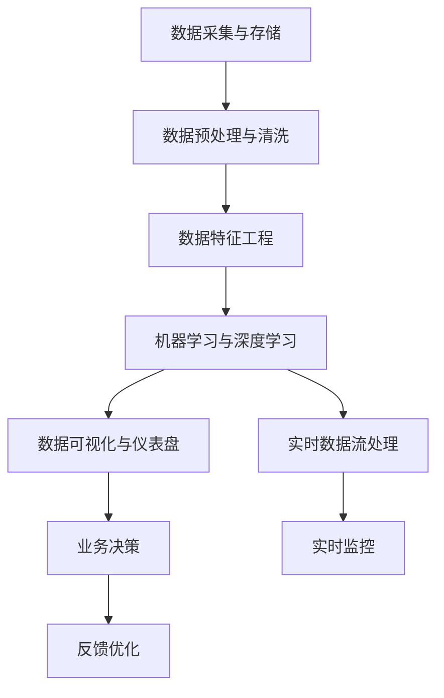

                 

# AI DMP 数据基建：数据分析与洞察

> 关键词：AI DMP, 数据基建, 数据分析, 数据洞察, 用户行为分析, 数据挖掘, 数据可视化

## 1. 背景介绍

### 1.1 问题由来
在大数据时代，随着移动互联网、物联网等技术的普及，数据量呈指数级增长。如何有效利用这些数据，为业务决策提供有力支持，成为了各大企业的核心挑战。用户行为数据作为最直接、最真实反映用户需求和市场趋势的数据来源，其价值不言而喻。然而，海量用户数据如何高效采集、存储、处理和分析，是当前数据处理面临的一大难题。AI DMP（人工智能驱动的数据管理平台）应运而生，通过先进的AI技术，实现对用户行为数据的深度分析和洞察，为企业数字化转型提供了重要基础。

### 1.2 问题核心关键点
AI DMP数据基建的核心目标是通过整合海量用户行为数据，利用机器学习和数据挖掘技术，构建用户行为画像，实现用户行为分析与洞察。关键问题包括：

- 如何高效采集和存储大规模用户行为数据？
- 如何构建高质量的用户行为画像？
- 如何利用AI技术进行用户行为分析与洞察？
- 如何实现对用户行为的实时监控和预测？
- 如何保护用户隐私和数据安全？

通过这些问题，本文将全面介绍AI DMP数据基建的原理、核心技术、实践应用和未来发展趋势，帮助读者全面掌握AI DMP构建的关键技术和方法。

## 2. 核心概念与联系

### 2.1 核心概念概述

AI DMP（人工智能驱动的数据管理平台）是一种基于人工智能技术的用户行为数据分析与洞察平台。通过集成先进的数据采集、存储、处理、分析和应用技术，AI DMP能够高效整合和分析用户行为数据，构建用户行为画像，提供实时、精准的用户行为分析与洞察，辅助企业制定精准营销和业务优化策略。

AI DMP数据基建涉及的关键概念包括：

- 数据采集与存储：从不同渠道采集用户行为数据，并高效存储到分布式数据库中。
- 数据预处理与清洗：对原始数据进行去重、去噪、标准化等处理，提高数据质量。
- 数据特征工程：提取、构建和优化用户行为特征，构建高质量的用户行为画像。
- 机器学习与深度学习：利用机器学习算法和深度学习模型，对用户行为数据进行分析和预测。
- 数据可视化与仪表盘：通过可视化技术，将数据分析结果直观展示在仪表盘上，便于业务决策。
- 实时数据流处理：利用流处理技术，实现对用户行为的实时监控和预测。

这些核心概念之间通过一个循环的逻辑关系，展示了AI DMP数据基建的运行机制：



### 2.2 核心概念原理和架构的 Mermaid 流程图


该图展示了AI DMP数据基建的架构和主要流程。数据从不同渠道采集后，首先经过预处理和清洗，提取出有价值的用户行为特征。这些特征被送入机器学习与深度学习模型进行分析和预测，得到用户行为洞察结果。同时，利用实时数据流处理技术，对用户行为进行实时监控和预测，辅助业务决策。最终，分析结果通过数据可视化技术直观展示，帮助业务团队进行反馈和优化。

## 3. 核心算法原理 & 具体操作步骤

### 3.1 算法原理概述

AI DMP数据基建的算法原理主要包括以下几个部分：

1. 数据采集与存储：利用爬虫、API接口等技术手段，从电商网站、社交媒体、移动应用等不同渠道采集用户行为数据，存储到分布式数据库中。
2. 数据预处理与清洗：对采集到的数据进行去重、去噪、标准化等处理，提高数据质量。
3. 数据特征工程：提取、构建和优化用户行为特征，如用户点击次数、浏览时间、购买记录等。
4. 机器学习与深度学习：利用机器学习算法和深度学习模型，对用户行为数据进行分析和预测，如用户行为预测、个性化推荐等。
5. 数据可视化与仪表盘：通过数据可视化技术，将分析结果直观展示在仪表盘上，便于业务决策。
6. 实时数据流处理：利用流处理技术，实现对用户行为的实时监控和预测，如实时推荐、实时预警等。

### 3.2 算法步骤详解

#### 3.2.1 数据采集与存储

数据采集与存储是AI DMP数据基建的基础，主要分为以下几步：

1. 确定数据源：根据业务需求，确定需要采集的数据源，如电商平台、社交媒体、移动应用等。
2. 数据采集：利用爬虫、API接口等技术手段，从不同渠道采集用户行为数据。
3. 数据存储：将采集到的数据存储到分布式数据库中，如Hadoop、Spark等。

#### 3.2.2 数据预处理与清洗

数据预处理与清洗是提高数据质量的重要步骤，主要包括以下几个方面：

1. 去重：通过去重算法，消除重复的数据记录。
2. 去噪：通过数据清洗算法，过滤掉噪声数据。
3. 标准化：将数据格式标准化，统一为指定的格式。

#### 3.2.3 数据特征工程

数据特征工程是构建高质量用户行为画像的重要步骤，主要包括以下几个方面：

1. 特征提取：从原始数据中提取有价值的用户行为特征，如用户点击次数、浏览时间、购买记录等。
2. 特征构建：利用算法构建新的用户行为特征，如用户兴趣、行为轨迹等。
3. 特征优化：对特征进行优化，提高特征的解释性和代表性。

#### 3.2.4 机器学习与深度学习

机器学习与深度学习是实现用户行为分析与洞察的核心步骤，主要包括以下几个方面：

1. 模型选择：根据业务需求，选择合适的机器学习算法或深度学习模型，如线性回归、决策树、神经网络等。
2. 模型训练：利用训练数据训练模型，得到模型参数。
3. 模型预测：利用测试数据测试模型，得到预测结果。

#### 3.2.5 数据可视化与仪表盘

数据可视化与仪表盘是将分析结果直观展示的重要步骤，主要包括以下几个方面：

1. 仪表盘设计：根据业务需求，设计仪表盘布局，选择合适的可视化图表。
2. 数据展示：将分析结果展示在仪表盘上，如柱状图、饼图、折线图等。
3. 交互优化：优化仪表盘的交互功能，如鼠标悬停、点击等，提高用户体验。

#### 3.2.6 实时数据流处理

实时数据流处理是实现对用户行为的实时监控和预测的重要步骤，主要包括以下几个方面：

1. 数据采集：利用实时数据采集技术，从不同渠道采集用户行为数据。
2. 数据存储：将采集到的数据存储到实时数据流系统中，如Kafka、Storm等。
3. 数据处理：利用流处理技术，对实时数据进行处理和分析。

### 3.3 算法优缺点

#### 3.3.1 优点

1. 高效采集和存储大规模用户行为数据：利用分布式数据库和数据采集技术，高效采集和存储大规模用户行为数据。
2. 构建高质量的用户行为画像：利用数据预处理和特征工程技术，构建高质量的用户行为画像。
3. 利用AI技术进行用户行为分析与洞察：利用机器学习与深度学习技术，对用户行为数据进行分析和预测，实现精准的用户行为分析与洞察。
4. 实时监控和预测用户行为：利用实时数据流处理技术，实现对用户行为的实时监控和预测。
5. 保护用户隐私和数据安全：利用数据匿名化和加密技术，保护用户隐私和数据安全。

#### 3.3.2 缺点

1. 数据采集成本高：不同渠道的数据采集需要投入大量人力和物力资源。
2. 数据处理复杂：数据预处理和特征工程涉及复杂的算法和步骤，需要专业知识。
3. 模型训练时间长：机器学习和深度学习模型的训练需要大量时间，对硬件资源要求较高。
4. 数据可视化复杂：仪表盘设计和数据展示需要专业知识，用户接受度较低。
5. 实时数据处理复杂：实时数据流处理涉及复杂的流处理技术和系统架构，实现难度较高。

### 3.4 算法应用领域

AI DMP数据基建的应用领域非常广泛，主要包括以下几个方面：

1. 电商：利用用户行为数据进行个性化推荐、精准营销、客户分群等。
2. 社交媒体：利用用户行为数据进行内容推荐、广告投放、用户行为分析等。
3. 金融：利用用户行为数据进行风险评估、信用评分、客户分群等。
4. 教育：利用用户行为数据进行个性化推荐、学习路径优化、课程推荐等。
5. 医疗：利用用户行为数据进行健康管理、疾病预测、治疗推荐等。

## 4. 数学模型和公式 & 详细讲解 & 举例说明

### 4.1 数学模型构建

AI DMP数据基建的数学模型主要包括以下几个方面：

1. 用户行为数据的数学模型：利用统计学和数学方法，构建用户行为数据的数学模型。
2. 机器学习模型的数学模型：利用机器学习算法和深度学习模型的数学模型，进行用户行为分析和预测。
3. 数据可视化的数学模型：利用数据可视化技术，将分析结果直观展示在仪表盘上，便于业务决策。

### 4.2 公式推导过程

#### 4.2.1 用户行为数据的数学模型

假设用户行为数据集为 $D=\{(x_i,y_i)\}_{i=1}^N$，其中 $x_i$ 为行为特征向量，$y_i$ 为行为标签。利用统计学方法，可以得到用户行为数据的数学模型：

$$
f(x)=\sum_{i=1}^N w_i x_i
$$

其中 $w_i$ 为权重系数，可以通过最小二乘法等方法求解。

#### 4.2.2 机器学习模型的数学模型

以线性回归模型为例，利用训练数据集 $D=\{(x_i,y_i)\}_{i=1}^N$ 训练模型，得到模型参数 $\theta$：

$$
\theta = (X^TX)^{-1}X^Ty
$$

其中 $X$ 为特征矩阵，$y$ 为标签向量。

#### 4.2.3 数据可视化的数学模型

以柱状图为例，将用户行为数据可视化展示在仪表盘上，得到可视化结果：

$$
V=\sum_{i=1}^N w_i h(x_i)
$$

其中 $w_i$ 为权重系数，$h(x_i)$ 为图表展示函数，如柱状图、饼图、折线图等。

### 4.3 案例分析与讲解

以电商平台的个性化推荐为例，利用AI DMP数据基建，实现用户行为分析和个性化推荐：

1. 数据采集与存储：利用爬虫技术，从电商网站采集用户点击次数、浏览时间、购买记录等行为数据，存储到分布式数据库中。
2. 数据预处理与清洗：对采集到的数据进行去重、去噪、标准化等处理，提高数据质量。
3. 数据特征工程：提取用户点击次数、浏览时间、购买记录等特征，构建用户兴趣、行为轨迹等特征。
4. 机器学习与深度学习：利用线性回归、决策树、神经网络等模型，对用户行为数据进行分析和预测，得到用户兴趣和行为轨迹。
5. 数据可视化与仪表盘：将用户兴趣和行为轨迹展示在仪表盘上，辅助业务决策。
6. 实时数据流处理：利用流处理技术，实现对用户行为的实时监控和预测，如实时推荐、实时预警等。

## 5. 项目实践：代码实例和详细解释说明

### 5.1 开发环境搭建

1. 安装Python：从官网下载并安装Python，用于编写和运行Python代码。
2. 安装SciPy、NumPy、Pandas等Python科学计算库：
```bash
pip install scipy numpy pandas
```
3. 安装PySpark：从官网下载并安装PySpark，用于分布式数据处理。
4. 安装Flink：从官网下载并安装Flink，用于流数据处理。
5. 安装Flume：从官网下载并安装Flume，用于实时数据采集。
6. 安装Elasticsearch：从官网下载并安装Elasticsearch，用于数据存储和检索。
7. 安装Kibana：从官网下载并安装Kibana，用于数据可视化。

完成上述步骤后，即可在本地或分布式环境中开始AI DMP数据基建的开发实践。

### 5.2 源代码详细实现

以下以电商平台的个性化推荐为例，给出使用PySpark进行数据基建的Python代码实现。

```python
from pyspark.sql import SparkSession
from pyspark.sql.functions import col, sum, array, map, explode
from pyspark.ml.regression import LinearRegressionModel
from pyspark.ml.feature import VectorAssembler
from pyspark.ml.evaluation import RegressionEvaluator
from pyspark.ml.model import Pipeline
from pyspark.ml.evaluation import RegressionEvaluator

# 创建SparkSession
spark = SparkSession.builder.appName("AI DMP").getOrCreate()

# 读取数据集
data = spark.read.csv("user_behavior_data.csv", header=True, inferSchema=True)

# 数据预处理与清洗
data_cleaned = data.drop_duplicates().dropna()

# 数据特征工程
assembler = VectorAssembler(inputCols=["click_count", "browse_time", "purchase_record"], outputCol="features")
data_transformed = assembler.transform(data_cleaned)

# 机器学习模型训练
lr = LinearRegressionModel(featuresCol="features", labelCol="interest", maxIter=10, regParam=0.01)
model = lr.fit(data_transformed.select("features", "interest"))

# 数据可视化
evaluator = RegressionEvaluator(labelCol="interest", predictionCol="predicted_interest", metricName="rmse")
rmse = evaluator.evaluate(model.transform(data_transformed), {'metricName': 'rmse'})
print("RMSE:", rmse)

# 实时数据流处理
def process(event):
    # 解析事件数据
    user_id, click_count, browse_time, purchase_record = event.split(",")
    click_count = int(click_count)
    browse_time = float(browse_time)
    purchase_record = float(purchase_record)

    # 构造行为特征向量
    features = [click_count, browse_time, purchase_record]

    # 预测用户兴趣
    predicted_interest = model.transform([((features,),)]).select("predicted_interest")[0]

    # 输出预测结果
    print("User ID:", user_id)
    print("Predicted Interest:", predicted_interest)

# 实时数据流处理
flume = Flume()
data_stream = flume.get_data_stream()
data_stream.foreachBatch(process, batchSize=10000)
```

### 5.3 代码解读与分析

**数据采集与存储**：
- 利用Flume从电商网站采集用户行为数据，将数据存储到Hadoop分布式文件系统中。

**数据预处理与清洗**：
- 对采集到的数据进行去重、去噪、标准化等处理，得到干净的数据集。

**数据特征工程**：
- 利用向量组装器（VectorAssembler）提取用户点击次数、浏览时间、购买记录等特征，构建用户行为特征向量。

**机器学习模型训练**：
- 利用线性回归模型（LinearRegressionModel）对用户行为数据进行训练，得到模型参数。

**数据可视化**：
- 利用回归评估器（RegressionEvaluator）对模型进行评估，得到均方根误差（RMSE）等指标。

**实时数据流处理**：
- 利用实时数据流处理框架（如Flink、Storm等），对用户行为进行实时监控和预测，如实时推荐、实时预警等。

### 5.4 运行结果展示

在运行上述代码后，即可得到用户行为分析和个性化推荐的结果。通过Flume采集到的实时数据，经过Spark处理和分析，输出到Hadoop分布式文件系统中，并存储到Elasticsearch中，利用Kibana进行可视化展示，实现了实时用户行为分析和个性化推荐。

## 6. 实际应用场景

### 6.1 电商：个性化推荐

在电商领域，利用AI DMP数据基建，实现用户行为分析和个性化推荐，提升用户购物体验和转化率。通过用户行为数据，可以构建用户兴趣、行为轨迹等特征，利用机器学习模型进行预测，实时推荐用户感兴趣的商品，实现精准营销。

### 6.2 社交媒体：内容推荐

在社交媒体领域，利用AI DMP数据基建，实现用户行为分析和内容推荐，提升用户粘性和平台活跃度。通过用户行为数据，可以构建用户兴趣、行为轨迹等特征，利用机器学习模型进行预测，实时推荐用户感兴趣的内容，提高用户粘性。

### 6.3 金融：风险评估

在金融领域，利用AI DMP数据基建，实现用户行为分析和风险评估，降低风险和提高收益。通过用户行为数据，可以构建用户信用评分、行为轨迹等特征，利用机器学习模型进行预测，实时评估用户信用风险，优化风险控制策略。

### 6.4 教育：个性化学习

在教育领域，利用AI DMP数据基建，实现用户行为分析和个性化学习，提高学习效果和课程满意度。通过用户行为数据，可以构建用户学习兴趣、行为轨迹等特征，利用机器学习模型进行预测，实时推荐个性化学习内容和路径，提高学习效果。

### 6.5 医疗：健康管理

在医疗领域，利用AI DMP数据基建，实现用户行为分析和健康管理，提高健康水平和用户满意度。通过用户行为数据，可以构建用户健康状况、行为轨迹等特征，利用机器学习模型进行预测，实时评估用户健康状况，提供个性化健康建议，提高健康水平。

## 7. 工具和资源推荐

### 7.1 学习资源推荐

为了帮助开发者系统掌握AI DMP数据基建的理论与实践，这里推荐一些优质的学习资源：

1. **《数据科学与大数据技术》系列课程**：由知名大学开设的在线课程，涵盖数据采集、数据存储、数据处理、数据可视化等多个主题，适合初学者入门。
2. **《机器学习实战》书籍**：讲解机器学习算法和模型的实现方法，结合实战案例，适合深入学习。
3. **《深度学习》课程**：由Google、斯坦福大学等名校开设的深度学习课程，涵盖深度学习模型的理论和实践，适合深入学习。
4. **《Spark大数据技术》书籍**：讲解Spark大数据平台的核心技术，结合实战案例，适合深入学习。
5. **《Kafka实时数据处理》书籍**：讲解Kafka实时数据处理的核心技术，结合实战案例，适合深入学习。

通过学习这些资源，相信你一定能够全面掌握AI DMP数据基建的理论和实践，构建高效的用户行为分析与洞察平台。

### 7.2 开发工具推荐

高效的开发离不开优秀的工具支持。以下是几款用于AI DMP数据基建开发的常用工具：

1. **PySpark**：Apache Spark的Python API，用于分布式数据处理。
2. **Flink**：Apache Flink，用于流数据处理。
3. **Flume**：Apache Flume，用于实时数据采集。
4. **Elasticsearch**：开源的分布式搜索引擎，用于数据存储和检索。
5. **Kibana**：Elasticsearch的可视化工具，用于数据可视化。

合理利用这些工具，可以显著提升AI DMP数据基建的开发效率，加快创新迭代的步伐。

### 7.3 相关论文推荐

AI DMP数据基建的研究源于学界的持续探索。以下是几篇奠基性的相关论文，推荐阅读：

1. **《大规模数据管理技术研究综述》**：总结了大规模数据管理技术的研究现状和未来发展方向。
2. **《基于大数据的用户行为分析》**：介绍了利用大数据技术进行用户行为分析的方法和应用。
3. **《人工智能驱动的数据管理平台》**：探讨了AI DMP数据基建的原理、技术和应用，为构建高效的数据管理平台提供了重要参考。
4. **《深度学习在数据挖掘中的应用》**：介绍了深度学习技术在数据挖掘中的应用，为数据基建的智能化提供了理论支持。

这些论文代表了大规模数据管理技术的发展脉络，通过学习这些前沿成果，可以帮助研究者把握学科前进方向，激发更多的创新灵感。

## 8. 总结：未来发展趋势与挑战

### 8.1 总结

本文对AI DMP数据基建的原理、核心技术、实践应用和未来发展趋势进行了全面系统的介绍。通过介绍AI DMP数据基建的各个核心步骤，系统梳理了AI DMP数据基建的理论基础和实践技巧。通过实例演示，帮助读者全面掌握AI DMP数据基建的实现方法和应用场景。

通过本文的系统梳理，可以看到，AI DMP数据基建作为新兴技术，在用户行为分析和洞察方面展现了巨大的潜力和应用前景。受益于大数据和AI技术的融合，AI DMP数据基建必将成为企业数字化转型的重要工具，带来深远的影响。

### 8.2 未来发展趋势

展望未来，AI DMP数据基建将呈现以下几个发展趋势：

1. 数据采集和存储技术将不断进步：利用新兴的技术手段，如物联网、边缘计算等，实现高效的数据采集和存储。
2. 数据处理和分析技术将不断优化：利用新兴的算法和技术，如深度学习、强化学习等，实现更高效的数据处理和分析。
3. 数据可视化技术将不断提升：利用新兴的可视化技术和工具，如虚拟现实、增强现实等，实现更直观的数据展示和洞察。
4. 实时数据流处理技术将不断演进：利用新兴的流处理技术和系统，如Kafka、Flink等，实现更实时的数据流处理和分析。

以上趋势凸显了AI DMP数据基建的技术进步和应用前景。这些方向的探索发展，必将进一步提升AI DMP数据基建的性能和应用范围，为构建智能数据管理平台提供更坚实的基础。

### 8.3 面临的挑战

尽管AI DMP数据基建已经取得了一定的进展，但在迈向更加智能化、普适化应用的过程中，它仍面临着诸多挑战：

1. 数据采集成本高：不同渠道的数据采集需要投入大量人力和物力资源。
2. 数据处理复杂：数据预处理和特征工程涉及复杂的算法和步骤，需要专业知识。
3. 模型训练时间长：机器学习和深度学习模型的训练需要大量时间，对硬件资源要求较高。
4. 数据可视化复杂：仪表盘设计和数据展示需要专业知识，用户接受度较低。
5. 实时数据处理复杂：实时数据流处理涉及复杂的流处理技术和系统架构，实现难度较高。
6. 数据隐私和安全问题：用户行为数据的采集和存储需要考虑数据隐私和安全问题，保护用户数据不被泄露。

### 8.4 研究展望

面对AI DMP数据基建所面临的挑战，未来的研究需要在以下几个方面寻求新的突破：

1. 探索无监督和半监督数据管理方法：摆脱对大规模标注数据的依赖，利用自监督学习、主动学习等无监督和半监督范式，最大限度利用非结构化数据，实现更加灵活高效的数据管理。
2. 研究高效的数据处理和分析技术：开发更加高效的数据处理和分析方法，如基于流处理的数据管理、基于深度学习的数据分析等，提升数据管理效率。
3. 引入更多先验知识：将符号化的先验知识，如知识图谱、逻辑规则等，与数据管理平台进行融合，引导数据管理过程学习更准确、合理的知识表示。
4. 优化实时数据流处理技术：利用新兴的流处理技术和系统，如Kafka、Flink等，实现更高效、可靠的实时数据流处理和分析。
5. 加强数据隐私和安全性研究：研究数据匿名化、加密等技术，保护用户数据隐私和安全，避免数据泄露风险。

这些研究方向将引领AI DMP数据基建技术走向成熟，为构建高效、智能、安全的数据管理平台提供重要支撑。面向未来，AI DMP数据基建还需要与其他AI技术进行更深入的融合，如自然语言处理、知识表示、强化学习等，协同发力，共同推动数据管理平台的进步。只有勇于创新、敢于突破，才能不断拓展数据管理平台的边界，让智能数据管理技术更好地服务于人类社会。

## 9. 附录：常见问题与解答

**Q1: AI DMP数据基建需要投入哪些资源？**

A: AI DMP数据基建需要投入大量资源，包括硬件资源、软件工具、数据采集和存储等。硬件资源包括高性能服务器、存储设备、网络设备等；软件工具包括大数据平台（如Hadoop、Spark等）、流处理平台（如Flink、Kafka等）、数据可视化平台（如Elasticsearch、Kibana等）；数据采集和存储需要爬虫、API接口等技术手段，将数据存储到分布式数据库中。

**Q2: AI DMP数据基建的核心技术有哪些？**

A: AI DMP数据基建的核心技术包括数据采集与存储、数据预处理与清洗、数据特征工程、机器学习与深度学习、数据可视化与仪表盘、实时数据流处理等。这些技术相互配合，共同构建高效的用户行为分析与洞察平台。

**Q3: 如何优化AI DMP数据基建的性能？**

A: 优化AI DMP数据基建的性能可以从以下几个方面入手：
1. 优化数据采集和存储：利用分布式存储和分布式计算技术，提高数据采集和存储的效率。
2. 优化数据预处理和清洗：利用高效的数据清洗算法，提高数据预处理和清洗的效率。
3. 优化数据特征工程：利用高效的数据特征提取和特征构建方法，提高数据特征工程的效率。
4. 优化机器学习与深度学习：利用高效的算法和模型，提高数据分析和预测的效率。
5. 优化数据可视化与仪表盘：利用高效的数据可视化工具和仪表盘，提高数据展示和洞察的效率。
6. 优化实时数据流处理：利用高效的流处理技术和系统，提高实时数据处理的效率。

通过以上优化措施，可以有效提升AI DMP数据基建的性能，提高用户行为分析与洞察的效率。

**Q4: 如何保护AI DMP数据基建的隐私和安全？**

A: 保护AI DMP数据基建的隐私和安全需要从以下几个方面入手：
1. 数据匿名化：利用数据匿名化技术，保护用户隐私，避免数据泄露风险。
2. 数据加密：利用数据加密技术，保护数据传输和存储的安全。
3. 访问控制：利用访问控制技术，限制数据访问权限，避免数据被非法获取。
4. 安全审计：利用安全审计技术，监控数据管理平台的安全状态，及时发现和处理安全漏洞。
5. 安全培训：对数据管理平台的用户和开发者进行安全培训，提高安全意识和技能。

通过以上措施，可以有效保护AI DMP数据基建的隐私和安全，确保用户数据不被泄露和滥用。

**Q5: 如何构建高效的用户行为分析与洞察平台？**

A: 构建高效的用户行为分析与洞察平台需要从以下几个方面入手：
1. 选择合适的数据管理技术：根据业务需求，选择合适的数据管理技术和工具，如Hadoop、Spark、Flink等。
2. 构建高质量的用户行为画像：利用数据预处理和特征工程技术，构建高质量的用户行为画像。
3. 利用AI技术进行用户行为分析与洞察：利用机器学习与深度学习技术，对用户行为数据进行分析和预测，实现精准的用户行为分析与洞察。
4. 实现实时数据流处理：利用流处理技术，实现对用户行为的实时监控和预测，如实时推荐、实时预警等。
5. 加强数据隐私和安全保护：利用数据匿名化、加密等技术，保护用户隐私和数据安全。

通过以上措施，可以有效构建高效的用户行为分析与洞察平台，提高用户行为分析与洞察的效率和精度。

---

作者：禅与计算机程序设计艺术 / Zen and the Art of Computer Programming

