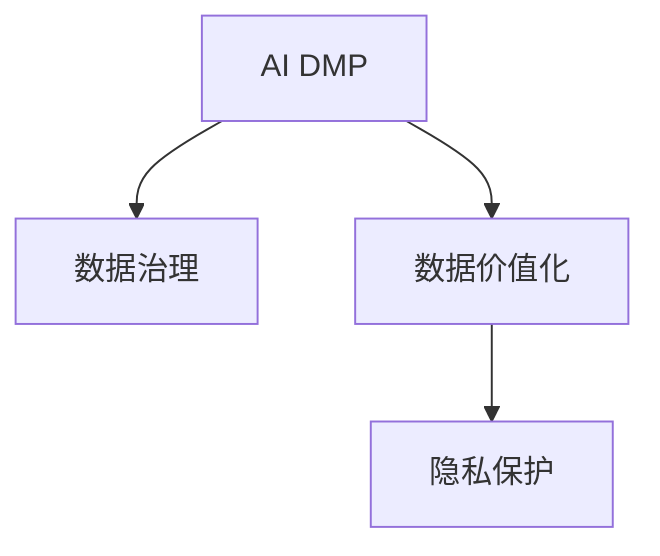

                 

# AI DMP 数据基建：数据应用与价值挖掘

> 关键词：数据治理，AI技术，数据价值挖掘，数据平台，AI DMP，隐私保护

## 1. 背景介绍

### 1.1 问题由来
随着互联网和移动互联网的飞速发展，数据已经成为各类机构的重要资产。然而，数据的多样性和复杂性，使得数据治理和应用面临巨大挑战。传统的技术手段无法满足数据复杂场景下的高效管理和利用需求。

在这样的背景下，AI驱动的数据管理系统(AI Data Management Platform，简称AI DMP)应运而生。AI DMP利用AI技术，将大数据、知识图谱、NLP、深度学习等先进技术融入数据治理和价值挖掘过程中，赋能数据驱动的决策分析，帮助各类机构实现数据资产的最大化利用。

AI DMP的兴起，标志着数据管理迈入了自动化、智能化的新阶段，其核心在于通过高效的数据基建，实现数据应用价值的最大化，助力各类业务场景的智能化升级。

### 1.2 问题核心关键点
AI DMP的核心思想是通过数据治理和价值挖掘，推动数据驱动的决策分析，赋能各类机构的数据资产管理和智能化应用。其核心要素包括：

- **数据治理**：构建数据质量管理体系，提升数据资产的规范性和可用性。
- **AI技术应用**：利用机器学习、深度学习等技术，挖掘数据内在价值，驱动业务创新。
- **数据价值化**：通过数据分析和算法优化，实现数据资产的商业变现和应用价值最大化。
- **隐私保护**：在数据应用过程中，保护用户隐私，确保数据使用的合规性和安全性。

## 2. 核心概念与联系

### 2.1 核心概念概述

为更好地理解AI DMP的基本框架，本节将介绍几个核心概念：

- **AI DMP**：AI驱动的数据管理系统，通过AI技术，实现数据治理和价值挖掘，驱动业务创新。
- **数据治理**：包括数据质量管理、元数据管理、数据安全管理、数据质量监控等，旨在提升数据资产的可用性和规范性。
- **数据价值化**：通过数据清洗、特征工程、模型训练、实时计算等环节，挖掘数据的内在价值，驱动商业变现和应用场景创新。
- **隐私保护**：在数据处理和应用过程中，保护用户隐私，遵循法律法规，确保数据使用的合规性和安全性。

这些核心概念之间的逻辑关系可以通过以下Mermaid流程图来展示：



这个流程图展示了AI DMP的基本框架：

1. 数据治理是AI DMP的基础，保障数据质量和规范性。
2. 数据价值化是AI DMP的核心，通过数据驱动的决策分析，提升业务价值。
3. 隐私保护是AI DMP的底线，确保数据使用的合规性和安全性。

这些概念共同构成了AI DMP的基本框架，使其能够实现数据资产的最大化利用，驱动各类业务场景的智能化升级。

## 3. 核心算法原理 & 具体操作步骤
### 3.1 算法原理概述

AI DMP的核心算法原理可以概括为“数据治理 + AI技术 + 数据价值化”，旨在通过高效的数据基建，实现数据应用价值的最大化。

具体而言，AI DMP的算法原理包括以下几个关键步骤：

1. **数据治理**：对数据进行清洗、归一、去重、标注等操作，提升数据质量。
2. **AI技术应用**：利用机器学习、深度学习等技术，挖掘数据的内在价值，进行模式识别、趋势预测、用户画像等分析。
3. **数据价值化**：将AI技术应用结果转化为可操作的数据应用策略，驱动业务创新和决策优化。
4. **隐私保护**：在数据处理和应用过程中，遵循法律法规，保护用户隐私。

### 3.2 算法步骤详解

AI DMP的核心算法步骤主要包括：

**Step 1: 数据收集与整理**

- 收集各类数据源，包括社交媒体、网站访问日志、移动应用行为等。
- 对原始数据进行初步清洗，去除噪声、缺失值、异常值等，提升数据质量。
- 对数据进行归一化和特征工程，提升特征表达能力和数据可解释性。

**Step 2: 数据标注与标注管理**

- 利用NLP技术，对数据进行自动标注，提升标注效率和准确性。
- 对标注结果进行质量控制和复审，确保标注数据的可靠性和一致性。
- 对标注数据进行管理和维护，建立标注数据仓库，供后续分析和应用使用。

**Step 3: AI模型训练与优化**

- 利用机器学习、深度学习等技术，训练预测模型，如分类模型、回归模型、聚类模型等。
- 对模型进行调参和优化，提升模型准确性和泛化能力。
- 利用模型进行特征提取、模式识别、趋势预测、用户画像等分析。

**Step 4: 数据价值化与策略生成**

- 将AI模型应用结果转化为可操作的数据应用策略，如个性化推荐、广告投放、客户细分等。
- 利用数据驱动的决策分析，提升业务效果和商业价值。
- 定期评估数据应用效果，根据业务需求调整数据应用策略。

**Step 5: 隐私保护与合规**

- 在数据处理和应用过程中，遵循数据隐私保护法规，如GDPR、CCPA等。
- 采用隐私保护技术，如差分隐私、联邦学习、加密技术等，确保数据使用的合规性和安全性。
- 建立数据隐私审计和监控机制，确保数据使用的透明性和可追溯性。

### 3.3 算法优缺点

AI DMP的算法具有以下优点：

- 高效自动化：AI DMP利用自动化技术，提升数据处理效率，降低人力成本。
- 全面智能化：AI DMP融合机器学习和深度学习技术，挖掘数据内在价值，驱动业务创新。
- 业务驱动：AI DMP紧密结合业务需求，提升数据应用效果和商业价值。
- 合规性保障：AI DMP采用隐私保护技术，确保数据使用的合规性和安全性。

同时，该算法也存在一些局限性：

- 数据质量依赖：AI DMP的效果很大程度上依赖数据质量，数据噪声和异常值可能影响分析结果。
- 技术门槛较高：AI DMP涉及多种先进技术，需要高水平的技术团队进行开发和维护。
- 资源需求大：AI DMP需要高性能计算资源，硬件成本较高。
- 隐私保护挑战：如何在数据应用过程中保护用户隐私，仍然是一大挑战。

尽管存在这些局限性，AI DMP依然是大数据时代的重要技术手段，其高效、智能、合规的优势，使得其在各类业务场景中具有广泛应用前景。

### 3.4 算法应用领域

AI DMP的应用领域涵盖了众多行业，包括但不限于以下几个方面：

- **电商**：通过用户行为数据分析，个性化推荐商品，提升用户体验和转化率。
- **金融**：利用用户数据进行风险评估和客户细分，优化贷款审批流程，提升业务效果。
- **广告**：根据用户兴趣和行为数据，精准投放广告，提升广告效果和ROI。
- **社交媒体**：通过用户互动数据分析，优化社区内容推荐，提升用户活跃度和留存率。
- **医疗健康**：利用患者健康数据，提供个性化诊疗方案，提升医疗服务质量。
- **能源管理**：通过能源数据监测和分析，优化能源管理策略，降低能源消耗和成本。

AI DMP的大规模应用，极大地提升了各类机构的数据治理水平，推动了数据驱动的业务创新和决策优化，具有广泛的应用前景和巨大的市场潜力。

## 4. 数学模型和公式 & 详细讲解 & 举例说明

### 4.1 数学模型构建

AI DMP的数学模型主要分为数据治理、AI模型训练和数据价值化三个部分。以下是各部分的数学模型构建：

**数据治理**

- **数据清洗**：利用数据清洗算法，去除噪声和异常值。例如，可以使用基于统计学的方法（如均值、方差、标准差等）进行数据预处理。
- **数据归一化**：将数据转化为标准化的形式，如Z-score标准化。例如，设数据集 $\mathcal{X}=\{x_i\}_{i=1}^N$，则其标准化公式为：
  $$
  x_i^* = \frac{x_i - \mu}{\sigma}
  $$
  其中 $\mu$ 为数据均值，$\sigma$ 为数据标准差。

**AI模型训练**

- **分类模型**：利用逻辑回归、决策树、支持向量机等算法进行训练。例如，设训练数据集为 $\mathcal{D}=\{(x_i,y_i)\}_{i=1}^N$，其中 $y_i \in \{0,1\}$，则逻辑回归模型的目标函数为：
  $$
  \min_{w,b} \frac{1}{N}\sum_{i=1}^N l(y_i, f(x_i;w,b))
  $$
  其中 $f(x_i;w,b) = g(w^T \varphi(x_i) + b)$，$g(z) = \frac{1}{1+\exp(-z)}$ 为sigmoid函数，$w,b$ 为模型参数。
- **回归模型**：利用线性回归、随机森林等算法进行训练。例如，设训练数据集为 $\mathcal{D}=\{(x_i,y_i)\}_{i=1}^N$，则线性回归模型的目标函数为：
  $$
  \min_{w,b} \frac{1}{N}\sum_{i=1}^N (y_i - f(x_i;w,b))^2
  $$
  其中 $f(x_i;w,b) = w^T x_i + b$，$w,b$ 为模型参数。

**数据价值化**

- **用户画像生成**：通过K-means、PCA等聚类算法，将用户划分为不同群体，生成用户画像。例如，设用户特征集为 $\mathcal{X}=\{x_i\}_{i=1}^N$，则K-means算法的目标函数为：
  $$
  \min_{C,z} \sum_{i=1}^N \min_{c \in C} ||x_i - \mu_c||^2
  $$
  其中 $C$ 为聚类中心，$z_i$ 为每个样本的聚类标签，$\mu_c$ 为第 $c$ 个聚类中心。
- **推荐系统**：利用协同过滤、内容推荐等算法，生成个性化推荐结果。例如，设用户-物品矩阵为 $R$，用户特征集为 $\mathcal{X}=\{x_i\}_{i=1}^N$，物品特征集为 $\mathcal{Y}=\{y_i\}_{i=1}^M$，则协同过滤推荐模型的目标函数为：
  $$
  \min_{\hat{R}} \sum_{i=1}^N \sum_{j=1}^M (r_{ij} - \hat{r}_{ij})^2
  $$
  其中 $r_{ij}$ 为真实评分，$\hat{r}_{ij}$ 为预测评分。

### 4.2 公式推导过程

接下来，我们将以用户画像生成为例，详细推导K-means算法的过程。

设用户特征集为 $\mathcal{X}=\{x_i\}_{i=1}^N$，其中每个样本 $x_i$ 为一个 $d$ 维向量，目标是将这些样本划分为 $K$ 个不同的聚类。K-means算法的核心思想是通过迭代优化，将样本 $x_i$ 分配到最近的聚类中心 $\mu_c$，然后更新聚类中心，直到收敛为止。

**算法步骤**：

1. 随机初始化 $K$ 个聚类中心 $\mu_1, \mu_2, \ldots, \mu_K$。
2. 对于每个样本 $x_i$，计算其到各聚类中心的距离 $d_i(c) = ||x_i - \mu_c||$，分配到最近的聚类 $c_i$。
3. 更新聚类中心：
   $$
   \mu_c = \frac{1}{n_c} \sum_{i \in c} x_i
   $$
   其中 $n_c$ 为第 $c$ 个聚类中样本的数量。
4. 重复步骤2和步骤3，直到聚类中心不再变化或达到预设的迭代次数。

**推导过程**：

1. **聚类分配**：设 $x_i$ 分配到第 $c$ 个聚类，则目标函数可以写为：
   $$
   \min_{z} \sum_{i=1}^N d_i(c_i)^2
   $$
2. **聚类中心更新**：目标函数可以进一步展开为：
   $$
   \min_{\mu_1, \mu_2, \ldots, \mu_K} \sum_{i=1}^N ||x_i - \mu_{c_i}||^2
   $$
   其中 $c_i$ 为样本 $x_i$ 分配到的聚类。
3. **坐标下降法**：可以通过坐标下降法求解该优化问题。将目标函数对每个聚类中心的坐标求偏导数，得到更新公式：
   $$
   \mu_c = \frac{1}{n_c} \sum_{i \in c} x_i
   $$
   其中 $n_c$ 为第 $c$ 个聚类中样本的数量。

通过上述推导，我们可以看到K-means算法通过迭代优化，实现了用户聚类的目标，为后续的用户画像生成提供了基础。

### 4.3 案例分析与讲解

假设某电商公司想要通过用户行为数据进行用户细分，提升个性化推荐效果。具体流程如下：

1. **数据收集**：收集用户点击、浏览、购买等行为数据，作为训练集。
2. **数据清洗**：去除异常值和噪声数据，对数据进行归一化和标准化。
3. **用户聚类**：利用K-means算法对用户进行聚类，生成用户画像。
4. **推荐模型训练**：利用协同过滤算法，训练个性化推荐模型，生成推荐结果。
5. **业务应用**：将推荐结果应用于电商平台的个性化推荐系统，提升用户体验和转化率。

在这个过程中，AI DMP通过高效的数据治理和智能化的AI技术，实现了数据价值最大化，为电商公司带来了显著的业务提升。

## 5. 项目实践：代码实例和详细解释说明

### 5.1 开发环境搭建

在进行AI DMP项目实践前，我们需要准备好开发环境。以下是使用Python进行Scikit-learn和TensorFlow开发的环境配置流程：

1. 安装Anaconda：从官网下载并安装Anaconda，用于创建独立的Python环境。

2. 创建并激活虚拟环境：
```bash
conda create -n ai_dmp_env python=3.8 
conda activate ai_dmp_env
```

3. 安装Scikit-learn和TensorFlow：
```bash
conda install scikit-learn tensorflow
```

4. 安装各类工具包：
```bash
pip install numpy pandas scikit-learn matplotlib tqdm jupyter notebook ipython
```

完成上述步骤后，即可在`ai_dmp_env`环境中开始AI DMP项目实践。

### 5.2 源代码详细实现

以下是使用Scikit-learn库对K-means算法进行用户聚类的PyTorch代码实现。

首先，定义用户特征集和聚类数：

```python
from sklearn.cluster import KMeans
import numpy as np

# 用户特征集
X = np.array([[0, 0], [1, 1], [1, 0], [0, 1], [1, 1], [0, 0], [0, 1], [1, 0]])

# 聚类数
K = 2
```

然后，定义K-means模型并进行聚类：

```python
# 初始化聚类中心
kmeans = KMeans(n_clusters=K, random_state=0)

# 聚类
kmeans.fit(X)
```

接着，输出聚类结果和聚类中心：

```python
# 聚类结果
y_pred = kmeans.predict(X)
print(y_pred)

# 聚类中心
print(kmeans.cluster_centers_)
```

以上就是使用Scikit-learn对K-means算法进行用户聚类的完整代码实现。可以看到，Scikit-learn提供了简单易用的接口，帮助我们快速实现聚类算法。

### 5.3 代码解读与分析

让我们再详细解读一下关键代码的实现细节：

**数据集定义**：
- 使用NumPy库定义用户特征集 $X$，每个样本 $x_i$ 表示为一个二维向量。
- 设定聚类数为 $K=2$，表示将用户分为两个群体。

**K-means模型初始化**：
- 使用Scikit-learn的KMeans类初始化K-means模型，设定聚类数为 $K$。
- 指定随机种子为0，确保每次运行结果一致。

**聚类过程**：
- 调用KMeans模型的fit方法，对用户特征集 $X$ 进行聚类。
- 通过predict方法，得到每个样本的聚类标签 $y_{pred}$。

**聚类中心输出**：
- 使用cluster_centers_属性，输出每个聚类中心的坐标。

通过上述代码，我们可以看到Scikit-learn库在实现K-means算法方面的简洁和高效，使得开发者能够快速实现用户聚类功能。

## 6. 实际应用场景
### 6.1 智能客服系统

AI DMP在智能客服系统中得到了广泛应用。智能客服系统利用用户行为数据，通过用户聚类和个性化推荐，为用户提供快速、准确的响应。

具体而言，智能客服系统可以收集用户的历史查询记录、浏览历史、购买记录等数据，利用AI DMP进行用户聚类和个性化推荐，生成相应的回答和推荐商品。通过不断优化推荐结果和回答内容，智能客服系统能够更好地满足用户需求，提升用户满意度。

### 6.2 金融风险评估

金融领域需要实时评估用户风险，智能风控系统利用用户行为数据，通过AI DMP进行用户聚类和风险评估，提升风险控制效果。

智能风控系统可以收集用户的贷款申请记录、消费记录、社交媒体行为等数据，利用AI DMP进行用户聚类和风险评估，生成用户风险评分。根据用户风险评分，智能风控系统能够更加准确地判断贷款申请的风险等级，优化贷款审批流程。

### 6.3 电商个性化推荐

电商企业需要提升用户体验和转化率，个性化推荐系统利用用户行为数据，通过AI DMP进行用户聚类和推荐，提升推荐效果。

个性化推荐系统可以收集用户点击、浏览、购买等行为数据，利用AI DMP进行用户聚类和推荐，生成个性化推荐结果。通过不断优化推荐算法和用户聚类，电商企业能够更好地满足用户需求，提升用户粘性和购买转化率。

### 6.4 未来应用展望

随着AI DMP技术的不断发展，其在各类业务场景中的应用将更加广泛和深入。未来，AI DMP有望在更多领域实现智能化升级，提升业务效果和用户体验。

在智慧医疗领域，AI DMP可以用于患者健康数据分析，提供个性化诊疗方案，提升医疗服务质量。在智能制造领域，AI DMP可以用于设备状态监测和预测维护，提升生产效率和设备可靠性。在智慧交通领域，AI DMP可以用于车辆行为数据分析，提升交通安全和出行效率。

总之，AI DMP在未来将会有更广阔的应用前景，为各类业务场景带来新的发展机遇。

## 7. 工具和资源推荐
### 7.1 学习资源推荐

为了帮助开发者系统掌握AI DMP的基本原理和应用实践，这里推荐一些优质的学习资源：

1. 《Python机器学习》：详细介绍了Scikit-learn库的使用方法和经典算法，是学习AI DMP数据治理和机器学习算法的必备资源。
2. 《深度学习》：由Ian Goodfellow等学者合著，全面介绍了深度学习的基本原理和经典算法，是学习AI DMP中深度学习应用的必备资源。
3. 《机器学习实战》：通过大量实例和代码实现，帮助读者深入理解机器学习算法在实际应用中的使用方法。
4. 《K-means算法原理及实现》：详细介绍了K-means算法的原理和实现方法，是学习AI DMP中聚类算法的必备资源。
5. 《数据治理与质量管理》：介绍了数据治理的基本概念和实践方法，是学习AI DMP中数据治理的必备资源。

通过对这些资源的学习实践，相信你一定能够快速掌握AI DMP的基本原理和应用实践，并用于解决实际的业务问题。

### 7.2 开发工具推荐

高效的开发离不开优秀的工具支持。以下是几款用于AI DMP开发的常用工具：

1. Python：作为AI DMP开发的主流语言，Python具备丰富的科学计算库和数据分析库，支持各类机器学习算法。
2. Scikit-learn：基于Python的机器学习库，提供了多种经典的机器学习算法，包括回归、分类、聚类等，是学习AI DMP中数据治理和机器学习算法的必备工具。
3. TensorFlow：由Google开发的深度学习框架，支持分布式计算和GPU加速，是学习AI DMP中深度学习应用的必备工具。
4. PyTorch：基于Python的深度学习框架，支持动态图和GPU加速，是学习AI DMP中深度学习应用的可选工具。
5. Jupyter Notebook：基于Python的交互式编程环境，支持代码、数据、文档的融合展示，是学习AI DMP中算法实现和数据可视化的必备工具。

合理利用这些工具，可以显著提升AI DMP开发的效率，加快创新迭代的步伐。

### 7.3 相关论文推荐

AI DMP的研究涉及多个领域，以下是几篇奠基性的相关论文，推荐阅读：

1. "Data Mining Algorithms: A Survey" by Jiawei Han：介绍了多种数据挖掘算法的原理和实现方法，是学习AI DMP中数据治理和数据挖掘技术的必备资源。
2. "Deep Learning" by Ian Goodfellow, Yoshua Bengio, Aaron Courville：全面介绍了深度学习的基本原理和经典算法，是学习AI DMP中深度学习应用的必备资源。
3. "Machine Learning: A Probabilistic Perspective" by Kevin P. Murphy：介绍了机器学习的基本原理和算法，涵盖了多种机器学习算法的实现方法和应用案例，是学习AI DMP中机器学习算法的必备资源。
4. "K-means: Theory and Applications" by P.P. Hubert：详细介绍了K-means算法的原理和实现方法，是学习AI DMP中聚类算法的必备资源。
5. "Data Governance: Principles and Practices" by Christopher T. Waters：介绍了数据治理的基本概念和实践方法，是学习AI DMP中数据治理的必备资源。

这些论文代表了大数据时代数据治理和机器学习技术的发展脉络，通过学习这些前沿成果，可以帮助研究者把握学科前进方向，激发更多的创新灵感。

## 8. 总结：未来发展趋势与挑战

### 8.1 总结

本文对AI DMP的基本原理和应用实践进行了全面系统的介绍。首先阐述了AI DMP的基本概念和研究背景，明确了其在大数据时代的重要意义。其次，从数据治理、AI技术应用、数据价值化等方面，详细讲解了AI DMP的算法原理和操作步骤，给出了AI DMP项目开发的完整代码实现。同时，本文还探讨了AI DMP在智能客服、金融风控、电商推荐等实际业务场景中的应用，展示了AI DMP的广阔应用前景。此外，本文还精选了AI DMP相关的学习资源、开发工具和研究论文，力求为读者提供全方位的技术指引。

通过本文的系统梳理，可以看到，AI DMP通过高效的数据治理和智能化的AI技术，实现了数据应用价值的最大化，赋能各类机构的数据资产管理和智能化应用。其高效、智能、合规的优势，使得其在各类业务场景中具有广泛应用前景。

### 8.2 未来发展趋势

展望未来，AI DMP将呈现以下几个发展趋势：

1. **自动化程度提升**：随着AI技术的发展，AI DMP的自动化程度将不断提高，数据治理和价值化过程将更加智能化和自动化。
2. **跨领域融合**：AI DMP将与其他AI技术进行更深入的融合，如知识图谱、因果推理、强化学习等，协同发力，提升数据治理和价值化的效果。
3. **隐私保护加强**：AI DMP将更加注重数据隐私保护，采用先进的隐私保护技术，确保数据使用的合规性和安全性。
4. **数据治理标准化**：AI DMP将逐步向标准化和规范化发展，构建统一的数据治理标准和流程，提升数据治理的规范性和可操作性。
5. **边缘计算应用**：AI DMP将引入边缘计算技术，实现数据治理和价值化的实时化、本地化，提升数据处理效率和用户体验。

这些趋势将推动AI DMP技术向更加高效、智能、安全的方向发展，为各类业务场景带来新的创新机遇。

### 8.3 面临的挑战

尽管AI DMP技术不断发展，但在实际应用过程中仍面临一些挑战：

1. **数据质量问题**：数据的多样性和复杂性使得数据治理面临巨大挑战，如何提升数据质量和规范性，仍是一大难题。
2. **模型复杂性**：AI DMP涉及多种AI技术，模型复杂性高，如何优化模型结构，提高模型可解释性和可维护性，仍是一大挑战。
3. **隐私保护难度**：在数据处理和应用过程中，如何保护用户隐私，遵循法律法规，仍是一大挑战。
4. **资源消耗大**：AI DMP涉及大量计算资源，硬件成本较高，如何在有限的资源条件下，提升数据治理和价值化效果，仍是一大挑战。
5. **跨领域应用难度**：AI DMP在不同业务场景中的应用，需要针对具体场景进行定制化开发，如何实现跨领域的通用性和灵活性，仍是一大挑战。

尽管存在这些挑战，AI DMP技术的不断发展，使其在各类业务场景中具有广泛应用前景。通过不断探索和创新，AI DMP必将在未来的发展中取得更多突破。

### 8.4 研究展望

未来，AI DMP的研究可以从以下几个方向进行探索：

1. **跨领域知识融合**：将跨领域知识与AI DMP进行融合，提升数据治理和价值化的效果。例如，将医学知识与AI DMP结合，提升医疗数据治理和价值化的效果。
2. **隐私保护技术创新**：引入新的隐私保护技术，如差分隐私、联邦学习等，确保数据使用的合规性和安全性。
3. **实时化应用研究**：引入边缘计算技术，实现数据治理和价值化的实时化、本地化，提升数据处理效率和用户体验。
4. **模型可解释性研究**：开发更高效的模型可解释技术，提升AI DMP中AI模型的可解释性和可维护性。
5. **数据治理标准化研究**：构建统一的数据治理标准和流程，提升数据治理的规范性和可操作性。

这些研究方向将推动AI DMP技术向更加高效、智能、安全的方向发展，为各类业务场景带来新的创新机遇。

## 9. 附录：常见问题与解答

**Q1：AI DMP是否适用于所有数据治理场景？**

A: AI DMP适用于大多数数据治理场景，但并不适用于所有数据治理需求。对于结构化数据和高频交易数据等场景，AI DMP可能面临数据治理的挑战。此外，AI DMP的实现需要较高的技术水平和资源投入，对于小型企业而言，可能存在一定的门槛。

**Q2：AI DMP是否可以应用于所有业务场景？**

A: AI DMP可以应用于大多数业务场景，但不同业务场景的数据治理和价值化需求各不相同。AI DMP需要根据具体业务需求进行定制化开发，才能发挥最佳效果。例如，电商推荐系统中的个性化推荐，与金融风控系统中的风险评估，其数据治理和价值化的方法有所不同。

**Q3：AI DMP中涉及哪些AI技术？**

A: AI DMP涉及多种AI技术，包括机器学习、深度学习、自然语言处理、知识图谱等。这些技术相互配合，共同实现数据治理和价值化的目标。

**Q4：AI DMP中的数据隐私保护有哪些措施？**

A: AI DMP中的数据隐私保护措施包括差分隐私、联邦学习、加密技术等。通过这些技术，可以在保护用户隐私的同时，实现数据治理和价值化。

**Q5：AI DMP的实现需要哪些技术工具？**

A: AI DMP的实现需要多种技术工具，包括Python、Scikit-learn、TensorFlow、PyTorch等。这些工具可以高效地实现AI DMP中的各种算法和数据处理流程。

通过对这些常见问题的解答，相信你一定能够更加全面地理解AI DMP的基本概念和应用实践，并用于解决实际的业务问题。

---

作者：禅与计算机程序设计艺术 / Zen and the Art of Computer Programming

