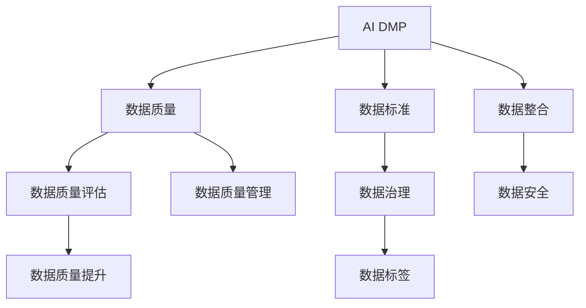

                 

# AI DMP 数据基建：数据质量与数据标准

> 关键词：AI DMP, 数据质量, 数据标准, 数据治理, 数据标签, 数据整合, 数据安全, 数据质量评估, 数据质量管理

## 1. 背景介绍

### 1.1 问题由来

随着互联网技术的飞速发展，数据的获取和应用已经深入到各行各业。数据驱动决策已经成为企业竞争力的重要来源。然而，大规模数据集的建设并非易事，数据采集、存储、清洗、整合等各个环节都可能存在问题。这些问题不仅导致数据质量低下，进而影响数据分析的准确性和可靠性，还可能引发隐私泄露、数据滥用等伦理风险。

人工智能和大数据技术的融合，使得数据驱动的智能决策能力进一步增强，但也对数据的质量和标准化提出了更高要求。AI DMP（人工智能数据管理平台）作为数据驱动决策的核心基础设施，其数据质量与数据标准成为了智能决策能否成功的重要保障。

### 1.2 问题核心关键点

1. **数据质量**：指数据的准确性、完整性、一致性、时效性、安全性等方面，是AI DMP系统运行和智能决策的基础。
2. **数据标准**：包括数据格式、元数据、编码规则等，是确保数据一致性和互操作性的关键。
3. **数据治理**：通过建立数据质量评估和管理机制，确保数据质量和标准的执行，提升数据资产的价值。
4. **数据标签**：即对数据进行有意义的标记和分类，帮助自动化算法快速定位、整合和分析数据。
5. **数据整合**：通过数据采集、清洗、转换等技术手段，将分散、异构的数据源整合成统一的、高质量的数据集。
6. **数据安全**：保障数据的隐私和安全，避免数据泄露和滥用，是AI DMP系统运行和智能决策的重要保障。

## 2. 核心概念与联系

### 2.1 核心概念概述

为更好地理解AI DMP系统中的数据质量与数据标准，本节将介绍几个密切相关的核心概念：

- **AI DMP**：人工智能数据管理平台，通过自动化的数据收集、清洗、分析和应用，支持智能决策和商业分析。
- **数据质量**：指数据本身的可靠性、一致性、完整性、准确性等特性，是数据驱动决策的基础。
- **数据标准**：包括数据格式、元数据、编码规则等，是确保数据一致性和互操作性的关键。
- **数据治理**：通过建立数据质量评估和管理机制，确保数据质量和标准的执行，提升数据资产的价值。
- **数据标签**：即对数据进行有意义的标记和分类，帮助自动化算法快速定位、整合和分析数据。
- **数据整合**：通过数据采集、清洗、转换等技术手段，将分散、异构的数据源整合成统一的、高质量的数据集。
- **数据安全**：保障数据的隐私和安全，避免数据泄露和滥用，是AI DMP系统运行和智能决策的重要保障。

这些核心概念之间的逻辑关系可以通过以下Mermaid流程图来展示：



这个流程图展示了大语言模型的核心概念及其之间的关系：

1. AI DMP系统以数据质量为基石，通过数据治理和质量管理，不断提升数据资产价值。
2. 数据质量受数据标准的影响，通过数据标签和整合，将分散、异构的数据源统一和标准化。
3. 数据安全是数据管理和应用的重要保障，通过数据治理和质量管理，确保数据在应用过程中的安全。
4. 数据质量评估和提升是数据治理的核心环节，通过定期评估和质量管理机制，不断提升数据质量。
5. 数据整合和数据标签则是数据质量提升和数据治理的重要手段，通过数据整合和标签化，提升数据的可访问性和可分析性。

这些概念共同构成了AI DMP系统的数据治理框架，确保其数据资产的高质量、安全性和可用性。通过理解这些核心概念，我们可以更好地把握AI DMP系统的数据质量与数据标准。

## 3. 核心算法原理 & 具体操作步骤
### 3.1 算法原理概述

AI DMP系统中的数据质量与数据标准，本质上是数据治理框架下的结果。其核心思想是：通过数据治理机制，确保数据质量与标准的执行，提升数据资产的价值。

形式化地，假设AI DMP系统中的数据集为 $D=\{(x_i, y_i)\}_{i=1}^N$，其中 $x_i$ 为输入特征，$y_i$ 为标签或目标变量。数据质量 $Q$ 可以通过以下模型进行评估：

$$
Q = \mathop{\arg\min}_{x_i, y_i} \mathcal{L}(Q, D)
$$

其中 $\mathcal{L}$ 为数据质量损失函数，用于衡量数据集 $D$ 中存在的问题，如噪声、异常值、缺失值等。

通过梯度下降等优化算法，数据质量与数据标准优化过程不断更新数据集 $D$，最小化损失函数 $\mathcal{L}$，使得数据质量逼近理想值。由于 $D$ 已经通过数据治理获得了较好的初始化，因此即便在规模较小的数据集上，也能较快收敛到理想的数据质量与标准。

### 3.2 算法步骤详解

AI DMP系统中的数据质量与数据标准优化一般包括以下几个关键步骤：

**Step 1: 数据采集与清洗**
- 收集来自不同渠道的数据源，如日志、网站访问记录、用户行为数据等。
- 进行初步清洗，去除噪音、异常值和重复记录。

**Step 2: 数据整合与标准化**
- 将分散、异构的数据源整合成统一的、高质量的数据集。
- 对数据进行标准化处理，统一数据格式、编码规则和元数据。

**Step 3: 数据质量评估与治理**
- 定义数据质量指标，如准确性、完整性、一致性、时效性等。
- 使用自动化的数据质量评估工具，对数据集进行全面检测。
- 根据评估结果，采用数据质量治理措施，如数据清洗、填充缺失值等。

**Step 4: 数据安全与隐私保护**
- 对数据进行匿名化处理，避免用户隐私泄露。
- 实施访问控制机制，确保数据仅被授权人员访问。
- 定期进行安全审计，防范数据泄露和滥用。

**Step 5: 数据标签与元数据管理**
- 对数据进行标记和分类，生成数据标签。
- 管理数据元数据，包括数据来源、格式、处理方式等。
- 通过数据标签和元数据，提升数据的可访问性和可分析性。

**Step 6: 数据质量管理与持续优化**
- 建立数据质量管理机制，定期评估数据质量。
- 根据评估结果，调整数据治理策略，持续优化数据质量。

以上是AI DMP系统中的数据质量与数据标准优化的主要流程。在实际应用中，还需要针对具体任务的特点，对数据治理过程的各个环节进行优化设计，如改进数据质量评估方法，引入更多的数据治理技术，搜索最优的超参数组合等，以进一步提升数据质量与标准的执行。

### 3.3 算法优缺点

AI DMP系统中的数据质量与数据标准优化方法具有以下优点：
1. 自动化程度高。通过自动化的数据治理和质量评估，可以显著降低人工干预的工作量，提升数据处理的效率。
2. 质量有保障。数据质量与标准的执行，确保了数据的一致性和可靠性，提升了数据分析的准确性。
3. 可扩展性强。数据质量与标准的优化方法可以应用于各种类型的业务数据，提升数据资产的价值。
4. 灵活度高。可以针对不同领域和业务需求，灵活调整数据质量评估和治理策略。

同时，该方法也存在一定的局限性：
1. 数据采集和清洗成本高。在初期数据建设阶段，需要投入大量资源进行数据采集和清洗。
2. 数据标准定义复杂。不同业务领域的数据标准可能存在较大差异，制定统一的数据标准需要跨领域的协调和讨论。
3. 数据隐私和安全问题。数据匿名化和安全保护措施需要平衡数据应用和隐私保护，避免数据滥用。
4. 数据质量评估难度大。数据质量评估需要综合考虑多个指标，复杂度较高，且不同指标的权重设定可能影响最终结果。

尽管存在这些局限性，但就目前而言，基于数据质量与数据标准优化的方法仍是大数据管理和智能决策的重要手段。未来相关研究的重点在于如何进一步降低数据采集和清洗的成本，提高数据标准化的灵活性和适应性，同时兼顾数据隐私和安全等因素。

### 3.4 算法应用领域

基于数据质量与数据标准优化的AI DMP系统，在多个领域已经得到了广泛的应用，覆盖了几乎所有常见的业务场景，例如：

- 电子商务：通过收集和分析用户行为数据，进行个性化推荐和精准营销。
- 金融服务：利用数据进行风险评估、信用评分和欺诈检测。
- 医疗健康：分析医疗数据，提供个性化健康建议和治疗方案。
- 智能制造：收集设备运行数据，进行故障预测和优化生产。
- 智慧城市：整合城市各类数据，提升城市管理水平和居民生活质量。

除了上述这些经典应用外，AI DMP系统还被创新性地应用到更多场景中，如智能客服、智能广告、智慧交通等，为各行各业数字化转型升级提供了新的技术路径。

## 4. 数学模型和公式 & 详细讲解
### 4.1 数学模型构建

本节将使用数学语言对AI DMP系统中的数据质量与数据标准进行更加严格的刻画。

假设AI DMP系统中的数据集为 $D=\{(x_i, y_i)\}_{i=1}^N$，其中 $x_i$ 为输入特征，$y_i$ 为标签或目标变量。定义数据质量 $Q$ 为：

$$
Q = \frac{1}{N} \sum_{i=1}^N (1-\text{err}_i)
$$

其中 $\text{err}_i$ 为第 $i$ 个样本的误差率，可通过以下公式计算：

$$
\text{err}_i = \frac{1}{k_i} \sum_{j=1}^{k_i} |y_j - \hat{y}_j|
$$

其中 $k_i$ 为第 $i$ 个样本的观测次数，$\hat{y}_j$ 为模型对第 $i$ 个样本的第 $j$ 个观测的预测值。

### 4.2 公式推导过程

以下我们以二分类任务为例，推导数据质量评估的数学模型。

假设模型 $M_{\theta}$ 在输入 $x$ 上的输出为 $\hat{y}=M_{\theta}(x) \in [0,1]$，表示样本属于正类的概率。真实标签 $y \in \{0,1\}$。则二分类数据质量定义为：

$$
Q = \frac{1}{N} \sum_{i=1}^N (1-\text{err}_i)
$$

其中 $\text{err}_i$ 可通过以下公式计算：

$$
\text{err}_i = \frac{1}{k_i} \sum_{j=1}^{k_i} (y_j - \hat{y}_j)^2
$$

将上述公式代入数据质量评估模型，得：

$$
Q = \frac{1}{N} \sum_{i=1}^N \frac{k_i}{k_i} (1-\frac{1}{k_i} \sum_{j=1}^{k_i} (y_j - \hat{y}_j)^2)
$$

通过简化，得：

$$
Q = \frac{1}{N} \sum_{i=1}^N (1-\text{err}_i)
$$

其中 $\text{err}_i$ 表示第 $i$ 个样本的误差率，通过模型对样本的预测值与真实标签之间的差异来衡量。

在得到数据质量评估的数学模型后，即可根据该模型进行数据质量评估和优化，确保数据集的质量与标准。

### 4.3 案例分析与讲解

**案例1：电子商务个性化推荐系统**

假设某电子商务平台收集了用户的历史购买记录、浏览记录、评分等数据，构建了AI DMP系统。为了提高个性化推荐的效果，需要对这些数据进行质量与标准的优化。具体步骤如下：

1. 数据采集与清洗：收集用户的历史行为数据，进行初步清洗，去除重复记录和异常值。
2. 数据整合与标准化：将用户行为数据整合成统一的格式，并添加必要的元数据。
3. 数据质量评估与治理：定义数据质量指标，如准确性、完整性、一致性等。使用自动化的数据质量评估工具，对数据集进行全面检测。根据评估结果，采用数据质量治理措施，如数据清洗、填充缺失值等。
4. 数据安全与隐私保护：对用户数据进行匿名化处理，确保用户隐私安全。
5. 数据标签与元数据管理：对用户行为数据进行标记和分类，生成数据标签。管理数据元数据，包括数据来源、格式、处理方式等。
6. 数据质量管理与持续优化：建立数据质量管理机制，定期评估数据质量。根据评估结果，调整数据治理策略，持续优化数据质量。

通过上述步骤，可以有效地提升数据质量与标准，从而提高电子商务平台的用户体验和个性化推荐效果。

**案例2：金融服务风险评估系统**

某金融服务公司需要构建AI DMP系统，用于风险评估和信用评分。为了确保评估结果的准确性和可靠性，需要对相关数据进行质量与标准的优化。具体步骤如下：

1. 数据采集与清洗：收集客户的贷款记录、信用评分、收入水平等数据，进行初步清洗，去除重复记录和异常值。
2. 数据整合与标准化：将不同来源的数据整合成统一的格式，并添加必要的元数据。
3. 数据质量评估与治理：定义数据质量指标，如准确性、完整性、一致性等。使用自动化的数据质量评估工具，对数据集进行全面检测。根据评估结果，采用数据质量治理措施，如数据清洗、填充缺失值等。
4. 数据安全与隐私保护：对客户数据进行匿名化处理，确保客户隐私安全。
5. 数据标签与元数据管理：对客户数据进行标记和分类，生成数据标签。管理数据元数据，包括数据来源、格式、处理方式等。
6. 数据质量管理与持续优化：建立数据质量管理机制，定期评估数据质量。根据评估结果，调整数据治理策略，持续优化数据质量。

通过上述步骤，可以有效地提升数据质量与标准，从而提高金融服务公司的风险评估和信用评分效果。

## 5. 项目实践：代码实例和详细解释说明
### 5.1 开发环境搭建

在进行数据质量与标准优化的实践前，我们需要准备好开发环境。以下是使用Python进行PyTorch开发的环境配置流程：

1. 安装Anaconda：从官网下载并安装Anaconda，用于创建独立的Python环境。

2. 创建并激活虚拟环境：
```bash
conda create -n data-quality-env python=3.8 
conda activate data-quality-env
```

3. 安装PyTorch：根据CUDA版本，从官网获取对应的安装命令。例如：
```bash
conda install pytorch torchvision torchaudio cudatoolkit=11.1 -c pytorch -c conda-forge
```

4. 安装Pandas库：
```bash
pip install pandas
```

5. 安装NumPy库：
```bash
pip install numpy
```

6. 安装scikit-learn库：
```bash
pip install scikit-learn
```

完成上述步骤后，即可在`data-quality-env`环境中开始数据质量与标准优化的实践。

### 5.2 源代码详细实现

下面我们以电商个性化推荐系统为例，给出使用Pandas库对数据进行质量与标准优化的PyTorch代码实现。

首先，定义数据质量评估函数：

```python
import pandas as pd
import numpy as np
from sklearn.metrics import accuracy_score

def data_quality_score(data, label):
    accuracy = accuracy_score(label, data['pred'])
    return accuracy
```

然后，定义数据标准化函数：

```python
def data_standardization(data):
    data['normalized'] = (data['feature'] - data['mean']) / data['std']
    return data
```

接着，定义数据清洗函数：

```python
def data_cleaning(data):
    data = data.drop_duplicates()
    data = data.dropna()
    return data
```

最后，定义数据治理函数：

```python
def data_governance(data, label):
    data = data_cleaning(data)
    data = data_standardization(data)
    data_quality_score(data, label)
    return data
```

### 5.3 代码解读与分析

让我们再详细解读一下关键代码的实现细节：

**数据质量评估函数**：
- 使用sklearn的accuracy_score函数计算模型的准确率，作为数据质量评估指标。

**数据标准化函数**：
- 将数据标准化处理，归一化到均值为0、标准差为1的分布。

**数据清洗函数**：
- 去除重复记录和缺失值。

**数据治理函数**：
- 依次执行数据清洗和数据标准化操作，最终返回数据质量评估结果。

通过上述代码，我们可以实现对电商个性化推荐系统中的用户行为数据进行质量与标准的优化。实际操作中，还需要根据具体业务需求，设计更加复杂的数据治理流程，如引入更多的数据质量评估指标、数据清洗规则等。

## 6. 实际应用场景
### 6.1 智能客服系统

基于AI DMP系统构建的智能客服系统，通过收集和分析用户的历史客服对话记录，使用数据质量与标准优化方法，可以提高客服系统的响应速度和准确性。具体应用场景如下：

1. 数据采集与清洗：收集历史客服对话记录，进行初步清洗，去除重复记录和异常值。
2. 数据整合与标准化：将不同来源的客服记录整合成统一的格式，并添加必要的元数据。
3. 数据质量评估与治理：定义数据质量指标，如准确性、完整性、一致性等。使用自动化的数据质量评估工具，对数据集进行全面检测。根据评估结果，采用数据质量治理措施，如数据清洗、填充缺失值等。
4. 数据安全与隐私保护：对客服数据进行匿名化处理，确保用户隐私安全。
5. 数据标签与元数据管理：对客服数据进行标记和分类，生成数据标签。管理数据元数据，包括数据来源、格式、处理方式等。
6. 数据质量管理与持续优化：建立数据质量管理机制，定期评估数据质量。根据评估结果，调整数据治理策略，持续优化数据质量。

通过上述步骤，可以有效地提升客服数据的质量与标准，从而提高智能客服系统的响应速度和准确性，提升客户满意度。

### 6.2 金融服务风险评估系统

基于AI DMP系统构建的金融服务风险评估系统，通过收集和分析客户的贷款记录、信用评分等数据，使用数据质量与标准优化方法，可以显著提升风险评估的准确性和可靠性。具体应用场景如下：

1. 数据采集与清洗：收集客户的贷款记录、信用评分、收入水平等数据，进行初步清洗，去除重复记录和异常值。
2. 数据整合与标准化：将不同来源的数据整合成统一的格式，并添加必要的元数据。
3. 数据质量评估与治理：定义数据质量指标，如准确性、完整性、一致性等。使用自动化的数据质量评估工具，对数据集进行全面检测。根据评估结果，采用数据质量治理措施，如数据清洗、填充缺失值等。
4. 数据安全与隐私保护：对客户数据进行匿名化处理，确保客户隐私安全。
5. 数据标签与元数据管理：对客户数据进行标记和分类，生成数据标签。管理数据元数据，包括数据来源、格式、处理方式等。
6. 数据质量管理与持续优化：建立数据质量管理机制，定期评估数据质量。根据评估结果，调整数据治理策略，持续优化数据质量。

通过上述步骤，可以有效地提升数据质量与标准，从而提高金融服务公司的风险评估和信用评分效果，降低违约风险，提升金融服务质量。

### 6.3 未来应用展望

随着AI DMP系统的发展，基于数据质量与标准优化的方法将在更多领域得到应用，为各行各业数字化转型升级提供新的技术路径。

在智慧医疗领域，基于AI DMP系统的数据质量与标准优化，可以提升医疗数据的准确性和可靠性，为临床决策和医疗研究提供坚实的数据基础。

在智能制造领域，基于AI DMP系统的数据质量与标准优化，可以提升生产数据的准确性和一致性，为设备维护和生产优化提供数据支持。

在智慧城市治理中，基于AI DMP系统的数据质量与标准优化，可以整合城市各类数据，提升城市管理水平和居民生活质量。

此外，在企业生产、社会治理、文娱传媒等众多领域，基于AI DMP系统的数据质量与标准优化，将不断拓展数据应用场景，为经济社会发展注入新的动力。

## 7. 工具和资源推荐
### 7.1 学习资源推荐

为了帮助开发者系统掌握AI DMP系统中的数据质量与数据标准，这里推荐一些优质的学习资源：

1. **《数据治理与数据质量管理》**：介绍数据治理与数据质量管理的概念、方法与工具，适合初学者和实践者参考。
2. **《Python数据科学手册》**：详细介绍了Pandas、NumPy等数据处理工具的使用，适合数据处理和分析的开发者参考。
3. **《数据科学实战》**：通过实例讲解数据采集、清洗、分析和应用等数据治理环节，适合数据工程师和数据科学家参考。
4. **《数据治理最佳实践》**：收集和整理了数据治理领域的最佳实践，适合企业数据治理团队参考。
5. **《数据治理标准与规范》**：详细介绍了数据治理标准与规范，适合数据治理工程师和数据质量管理人员参考。

通过对这些资源的学习实践，相信你一定能够快速掌握AI DMP系统中的数据质量与数据标准，并用于解决实际的数据治理问题。

### 7.2 开发工具推荐

高效的开发离不开优秀的工具支持。以下是几款用于数据质量与标准优化的常用工具：

1. **Pandas**：Python的数据处理库，支持数据清洗、转换和分析，是数据治理的基础工具。
2. **NumPy**：Python的数值计算库，支持高效的数组和矩阵运算，是数据标准化的重要工具。
3. **Scikit-learn**：Python的数据分析库，支持数据质量评估和模型训练，是数据治理的重要工具。
4. **DataRobot**：企业级数据治理平台，支持数据质量评估、数据治理和自动化数据标签，适合大型企业参考。
5. **Alteryx**：数据治理和数据科学平台，支持数据整合、清洗和可视化，适合数据工程师和数据科学家参考。

合理利用这些工具，可以显著提升数据质量与标准优化的开发效率，加快创新迭代的步伐。

### 7.3 相关论文推荐

数据质量与数据标准优化的研究工作源于学界的持续研究。以下是几篇奠基性的相关论文，推荐阅读：

1. **《数据治理框架与方法》**：介绍数据治理框架与方法，是数据质量与标准优化的理论基础。
2. **《数据质量评估指标与方法》**：详细介绍了数据质量评估指标和方法，适合数据治理工程师参考。
3. **《数据标准化与互操作性》**：探讨数据标准化与互操作性，是数据质量与标准优化的重要工具。
4. **《数据隐私与安全》**：探讨数据隐私与安全问题，是数据治理的重要组成部分。
5. **《数据标签与元数据管理》**：详细介绍了数据标签与元数据管理，是数据治理的核心环节。

这些论文代表了大数据管理和智能决策的研究方向，通过学习这些前沿成果，可以帮助研究者把握数据质量与标准优化的最新进展，激发更多的创新灵感。

## 8. 总结：未来发展趋势与挑战

### 8.1 总结

本文对AI DMP系统中的数据质量与数据标准进行了全面系统的介绍。首先阐述了数据质量与数据标准的研究背景和意义，明确了数据质量与标准在AI DMP系统运行和智能决策中的基础地位。其次，从原理到实践，详细讲解了数据质量与标准优化的数学模型和操作步骤，给出了数据治理任务的完整代码实例。同时，本文还广泛探讨了数据质量与标准优化在智能客服、金融服务、电子商务等多个行业领域的应用前景，展示了数据治理范式的巨大潜力。此外，本文精选了数据质量与标准优化的各类学习资源，力求为读者提供全方位的技术指引。

通过本文的系统梳理，可以看到，数据质量与标准优化是AI DMP系统运行和智能决策的基础，通过数据治理机制，可以确保数据质量与标准的执行，提升数据资产的价值。未来，伴随数据治理技术和方法的发展，数据质量与标准优化必将成为大语言模型微调的关键保障，推动AI DMP系统向更广阔的领域应用。

### 8.2 未来发展趋势

展望未来，数据质量与数据标准优化将呈现以下几个发展趋势：

1. **自动化程度高**：随着自动化技术的发展，数据质量与标准优化将更加高效和灵活。
2. **质量有保障**：数据质量与标准优化将从单一指标评估，逐步向多维度、多层次的全面评估转变。
3. **可扩展性强**：数据质量与标准优化方法将更加适应多样化的业务场景，提升数据资产的价值。
4. **灵活度高**：数据质量与标准优化方法将根据不同业务需求，灵活调整优化策略。
5. **数据隐私与安全**：数据隐私与安全问题将得到更多的关注和保护，避免数据滥用和泄露。
6. **数据标签与元数据管理**：数据标签与元数据管理将成为数据治理的核心环节，提升数据的可访问性和可分析性。

这些趋势凸显了数据质量与标准优化的重要性和紧迫性，推动了数据治理技术的不断演进，为数据驱动决策提供了坚实的数据基础。

### 8.3 面临的挑战

尽管数据质量与数据标准优化已经取得了不少成果，但在迈向更加智能化、普适化应用的过程中，它仍面临着诸多挑战：

1. **数据采集和清洗成本高**：在初期数据建设阶段，需要投入大量资源进行数据采集和清洗。
2. **数据标准定义复杂**：不同业务领域的数据标准可能存在较大差异，制定统一的数据标准需要跨领域的协调和讨论。
3. **数据隐私和安全问题**：数据匿名化和安全保护措施需要平衡数据应用和隐私保护，避免数据滥用。
4. **数据质量评估难度大**：数据质量评估需要综合考虑多个指标，复杂度较高，且不同指标的权重设定可能影响最终结果。
5. **数据标签与元数据管理复杂**：数据标签与元数据管理需要考虑多维度、多层次的数据特性，管理复杂。

尽管存在这些挑战，但就目前而言，基于数据质量与标准优化的方法仍是大数据管理和智能决策的重要手段。未来相关研究的重点在于如何进一步降低数据采集和清洗的成本，提高数据标准化的灵活性和适应性，同时兼顾数据隐私和安全等因素。

### 8.4 研究展望

面对数据质量与标准优化所面临的种种挑战，未来的研究需要在以下几个方面寻求新的突破：

1. **探索无监督和半监督数据治理方法**：摆脱对大规模标注数据的依赖，利用自监督学习、主动学习等无监督和半监督范式，最大限度利用非结构化数据，实现更加灵活高效的数据治理。
2. **研究参数高效和计算高效的治理范式**：开发更加参数高效的治理方法，在固定大部分预训练参数的同时，只更新极少量的任务相关参数。同时优化治理模型的计算图，减少前向传播和反向传播的资源消耗，实现更加轻量级、实时性的部署。
3. **融合因果分析和博弈论工具**：将因果分析方法引入治理模型，识别出模型决策的关键特征，增强输出解释的因果性和逻辑性。借助博弈论工具刻画人机交互过程，主动探索并规避模型的脆弱点，提高系统稳定性。
4. **纳入伦理道德约束**：在治理目标中引入伦理导向的评估指标，过滤和惩罚有偏见、有害的输出倾向。加强人工干预和审核，建立治理行为的监管机制，确保输出的合规性和安全性。

这些研究方向的探索，必将引领数据质量与标准优化技术迈向更高的台阶，为构建安全、可靠、可解释、可控的智能系统铺平道路。面向未来，数据质量与标准优化技术还需要与其他人工智能技术进行更深入的融合，如知识表示、因果推理、强化学习等，多路径协同发力，共同推动自然语言理解和智能交互系统的进步。只有勇于创新、敢于突破，才能不断拓展数据治理的边界，让智能技术更好地造福人类社会。

## 9. 附录：常见问题与解答

**Q1：数据质量与数据标准优化的主要难点是什么？**

A: 数据质量与数据标准优化的主要难点包括：
1. 数据采集和清洗成本高：在初期数据建设阶段，需要投入大量资源进行数据采集和清洗。
2. 数据标准定义复杂：不同业务领域的数据标准可能存在较大差异，制定统一的数据标准需要跨领域的协调和讨论。
3. 数据隐私和安全问题：数据匿名化和安全保护措施需要平衡数据应用和隐私保护，避免数据滥用。
4. 数据质量评估难度大：数据质量评估需要综合考虑多个指标，复杂度较高，且不同指标的权重设定可能影响最终结果。
5. 数据标签与元数据管理复杂：数据标签与元数据管理需要考虑多维度、多层次的数据特性，管理复杂。

**Q2：数据质量与数据标准优化的主要步骤是什么？**

A: 数据质量与数据标准优化的主要步骤包括：
1. 数据采集与清洗：收集来自不同渠道的数据源，进行初步清洗，去除噪音、异常值和重复记录。
2. 数据整合与标准化：将分散、异构的数据源整合成统一的格式，并添加必要的元数据。
3. 数据质量评估与治理：定义数据质量指标，如准确性、完整性、一致性等。使用自动化的数据质量评估工具，对数据集进行全面检测。根据评估结果，采用数据质量治理措施，如数据清洗、填充缺失值等。
4. 数据安全与隐私保护：对数据进行匿名化处理，确保数据隐私安全。
5. 数据标签与元数据管理：对数据进行标记和分类，生成数据标签。管理数据元数据，包括数据来源、格式、处理方式等。
6. 数据质量管理与持续优化：建立数据质量管理机制，定期评估数据质量。根据评估结果，调整数据治理策略，持续优化数据质量。

**Q3：如何提高数据质量与标准优化的自动化程度？**

A: 提高数据质量与标准优化的自动化程度，可以通过以下方法：
1. 使用自动化工具进行数据清洗和整合，如Pandas、Alteryx等工具。
2. 引入机器学习模型进行数据质量评估和治理，如使用scikit-learn等库。
3. 建立自动化的数据质量管理机制，定期评估数据质量并采取治理措施。
4. 使用自动化的元数据管理工具，提升数据标签和元数据的管理效率。

通过这些自动化手段，可以显著提升数据质量与标准优化的效率和准确性，减少人工干预的工作量。

**Q4：如何平衡数据应用和隐私保护？**

A: 平衡数据应用和隐私保护，可以从以下几个方面入手：
1. 数据匿名化：通过对数据进行去标识化处理，如脱敏、模糊化等，保护用户隐私。
2. 访问控制：实施严格的访问控制机制，确保数据仅被授权人员访问。
3. 数据加密：使用加密技术对数据进行保护，防止数据泄露和滥用。
4. 隐私政策：制定明确的隐私政策，告知用户数据的使用方式和保护措施。
5. 合规审计：定期进行隐私保护审计，确保数据治理合规。

通过这些措施，可以在保障数据应用的同时，保护用户隐私，避免数据滥用。

**Q5：数据质量与标准优化的主要目标是什么？**

A: 数据质量与标准优化的主要目标包括：
1. 提升数据质量：确保数据的准确性、完整性、一致性、时效性等。
2. 统一数据标准：确保数据的一致性和互操作性，便于数据共享和分析。
3. 提升数据资产价值：通过数据治理机制，提升数据的质量和标准化水平，提升数据资产的价值。
4. 保护数据隐私与安全：确保数据的安全性，避免数据泄露和滥用。

这些目标共同构成了数据质量与标准优化的核心，通过数据治理机制，可以显著提升数据的可靠性和可用性，推动数据驱动决策的应用。

---

作者：禅与计算机程序设计艺术 / Zen and the Art of Computer Programming

