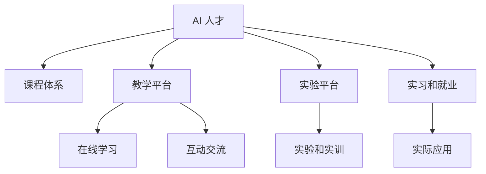

                 

# AI 人才培养计划：培养高素质 AI 人才

> 关键词：AI 人才,培养计划,高素质,技术教育,未来发展

## 1. 背景介绍

### 1.1 问题由来
随着人工智能技术的迅速发展，AI 人才的需求日益增加，但现有的教育体系和课程设置难以完全适应这一需求。同时，全球经济和产业结构的转变也呼唤AI 专业人才的培养。为了满足社会和产业界对AI 人才的需求，高等教育机构和企业开始探索新的教育模式和培养路径，以培养高素质、适应未来发展的AI 人才。

### 1.2 问题核心关键点
高素质 AI 人才应具备以下核心能力：
- **扎实的数学和算法基础**：AI 研究依赖于大量的数学理论和算法，掌握基础数学和算法原理是必要的。
- **跨学科知识**：AI 是计算机科学、统计学、认知科学等多学科交叉领域，需具备广泛的知识面。
- **数据处理和分析能力**：能够处理和分析大规模数据，提取有价值的信息。
- **创新能力和实践经验**：能够将理论知识应用于实际问题，解决复杂工程问题。
- **伦理和责任意识**：了解AI 技术的潜在风险和伦理问题，能够在使用AI 技术时承担相应的责任。

### 1.3 问题研究意义
高素质 AI 人才的培养对推动AI 技术的创新和应用具有重要意义：

1. **加速技术创新**：AI 人才是推动技术创新的重要力量，能够开发出更多高效、先进的AI 系统。
2. **提升产业竞争力**：AI 人才在金融、医疗、制造等行业的广泛应用，能够提升这些行业的自动化水平和竞争力。
3. **促进经济社会发展**：AI 技术的应用能够优化资源配置、提升生产效率，为经济社会带来深远影响。
4. **解决社会问题**：AI 人才在医疗健康、环境保护、智能交通等领域的应用，能够解决一些社会难题。

## 2. 核心概念与联系

### 2.1 核心概念概述

为了更好地理解 AI 人才培养计划，本节将介绍几个密切相关的核心概念：

- **AI 人才**：具备AI 相关知识、技能和素质，能够在AI 领域进行研究和应用的人才。
- **课程体系**：高校和培训机构提供的课程设置，旨在培养AI 人才所需的专业知识和技能。
- **教学平台**：提供在线学习、互动交流等教育资源的平台，如Coursera、edX、Udacity等。
- **实验平台**：提供AI 相关实验和实训机会的平台，如AWS、Google Colab、Kaggle等。
- **实习和就业**：通过实习和就业机会，将AI 理论知识应用于实际问题，提升综合能力。

这些核心概念之间的逻辑关系可以通过以下Mermaid流程图来展示：



这个流程图展示了我国AI 人才培养的关键环节和要素：

1. 高校和培训机构提供课程体系，奠定AI 人才的理论基础。
2. 在线教学平台和互动交流提供灵活的学习方式，提升AI 人才的学习效率。
3. 实验平台提供实操机会，加强AI 人才的动手能力。
4. 实习和就业环节将理论知识应用于实际，提升AI 人才的综合素质。
5. 实际应用环节，AI 人才将AI 技术服务于社会和经济，带来价值。

## 3. 核心算法原理 & 具体操作步骤
### 3.1 算法原理概述

AI 人才培养计划的理论基础是现代教育理论和AI 技术原理。其核心思想是通过系统的课程体系和实践环节，培养具备跨学科知识、数据处理能力、创新意识和伦理责任的AI 人才。具体来说，包括以下几个方面：

1. **基础课程**：包括数学、计算机科学、统计学等基础课程，为AI 研究打下坚实的理论基础。
2. **AI 核心课程**：涵盖机器学习、深度学习、自然语言处理、计算机视觉等AI 核心技术，使学生掌握AI 的基本算法和应用方法。
3. **跨学科课程**：开设认知科学、心理学、社会学等课程，提升学生对AI 技术应用的综合理解。
4. **实践环节**：包括实验室、实习、项目合作等，使学生将理论知识应用于实际问题，培养实际操作能力。

### 3.2 算法步骤详解

AI 人才培养计划的实施步骤如下：

**Step 1: 设计课程体系**
- 根据AI 人才需求，设计涵盖基础和核心课程的课程体系。
- 引入跨学科课程，拓展学生的知识面。
- 与企业合作，根据行业需求调整课程内容。

**Step 2: 开发教学资源**
- 开发高质量的在线课程和教材，提供灵活的学习方式。
- 组织行业专家和学者，开发互动交流和实验平台。
- 引入企业资源，提供实习和就业机会。

**Step 3: 实施教学和实践**
- 在高校和培训机构开展教学，提供丰富的学习资源和交流平台。
- 组织学生参与实验室和项目合作，培养实际操作能力。
- 安排学生到企业实习，提升职业素养和应用能力。

**Step 4: 评估和反馈**
- 对学生进行定期评估，了解学习效果和存在问题。
- 收集学生和企业反馈，调整和改进课程体系和教学资源。
- 建立持续改进机制，确保人才培养计划的可持续发展。

### 3.3 算法优缺点

AI 人才培养计划具有以下优点：

1. **灵活多样**：提供多种学习方式，满足不同学生的需求。
2. **实用性强**：课程内容紧密结合行业需求，培养实用的AI 人才。
3. **资源丰富**：利用在线平台和实验平台，提升教学效果和资源利用率。
4. **持续改进**：通过评估和反馈，不断调整和优化课程体系和教学资源。

同时，该计划也存在一定的局限性：

1. **教师资源有限**：高素质的AI 教师资源较为稀缺，难以满足大规模培养需求。
2. **课程设置复杂**：课程体系和内容设计需要广泛专家参与，协调和执行难度较大。
3. **实验平台昂贵**：高质量的实验平台建设和维护成本较高，难以普及。
4. **学生自主性要求高**：学生需要具备自主学习能力，才能充分利用在线和实验资源。

尽管存在这些局限性，但就目前而言，AI 人才培养计划仍是最主流和有效的AI 人才培养模式。未来相关研究的重点在于如何进一步提升教学资源和平台质量，扩大教师和实验室资源，同时兼顾学生的自主性和个性化需求。

### 3.4 算法应用领域

AI 人才培养计划在以下几个领域得到广泛应用：

- **高等教育**：我国许多高校已经开设AI 相关专业和课程，为培养高素质AI 人才提供了坚实基础。
- **职业培训机构**：企业培训机构和在线教育平台，如Coursera、Udacity等，提供灵活多样的AI 课程和实训机会。
- **科研机构**：中国科学院、华为诺亚方舟实验室等科研机构，开展前沿AI 研究和人才培养。
- **产业界**：AI 企业和创新公司，如谷歌、百度、商汤科技等，通过产学研合作培养AI 人才。

## 4. 数学模型和公式 & 详细讲解  
### 4.1 数学模型构建

为了更好地理解AI 人才培养计划的数学基础，本节将介绍一些关键数学模型和公式：

- **线性回归**：用于描述数据点之间的关系，是机器学习中最基础的算法之一。
- **深度神经网络**：用于处理大规模数据，通过多层神经元进行特征提取和分类。
- **自然语言处理**：使用算法处理和分析文本数据，如分词、词性标注、情感分析等。
- **计算机视觉**：使用算法处理和分析图像数据，如图像分类、目标检测等。

以线性回归为例，其基本数学模型为：

$$
y = \theta_0 + \theta_1 x_1 + \theta_2 x_2 + \cdots + \theta_n x_n
$$

其中，$y$ 表示预测值，$\theta_0, \theta_1, \theta_2, \cdots, \theta_n$ 表示模型的参数，$x_1, x_2, \cdots, x_n$ 表示输入特征。

通过求解最小二乘解，可以得到模型的参数：

$$
\theta = (X^TX)^{-1}X^Ty
$$

其中，$X^TX$ 是矩阵的逆，$X$ 是特征矩阵。

### 4.2 公式推导过程

在线性回归中，通过最小化误差平方和，可以求解模型的参数：

$$
\theta = \mathop{\arg\min}_{\theta} \sum_{i=1}^n (y_i - (\theta_0 + \theta_1 x_{i1} + \theta_2 x_{i2} + \cdots + \theta_n x_{in}))^2
$$

将误差平方和展开，得到：

$$
\theta = \mathop{\arg\min}_{\theta} \sum_{i=1}^n (y_i - \theta_0 - \theta_1 x_{i1} - \theta_2 x_{i2} - \cdots - \theta_n x_{in})^2
$$

通过求解偏导数，得到参数的更新公式：

$$
\theta_j = \frac{1}{m} \sum_{i=1}^m (x_{ij} - \bar{x}_j)(y_i - \bar{y})
$$

其中，$m$ 表示样本数量，$\bar{x}_j$ 和 $\bar{y}$ 表示特征和标签的均值。

通过不断迭代更新参数，可以逐步逼近真实的关系模型，实现数据预测和分类。

### 4.3 案例分析与讲解

以下以深度学习在图像识别中的应用为例，解释其基本原理和过程。

**案例背景**：
图像识别是计算机视觉中的一个重要应用，旨在通过算法自动识别图像中的物体和场景。深度学习中的卷积神经网络(CNN)被广泛应用于图像识别任务中。

**算法步骤**：
1. 数据预处理：对图像进行缩放、裁剪、归一化等处理，生成训练集和测试集。
2. 构建模型：使用卷积层、池化层、全连接层等构建深度神经网络。
3. 训练模型：通过反向传播算法更新模型参数，最小化损失函数。
4. 测试模型：在测试集上评估模型性能，输出识别结果。

**案例分析**：
深度学习模型中的卷积层通过局部连接和权值共享，能够提取图像中的特征信息。池化层通过降维和特征提取，进一步减小数据量和提升模型泛化能力。全连接层通过输出层计算，实现分类和识别任务。

**算法优势**：
- 特征提取能力强：通过卷积层和池化层的处理，能够自动学习到图像的高级特征。
- 泛化能力强：通过大量标注数据的训练，模型能够适应新数据的分布。
- 实时性强：深度学习模型在GPU等硬件设备上运行，具有高效的计算能力。

通过案例分析，可以看出深度学习在图像识别中的应用前景广阔，有望在医疗影像、自动驾驶、智能监控等领域产生深远影响。

## 5. 项目实践：代码实例和详细解释说明
### 5.1 开发环境搭建

在进行AI 人才培养计划的项目实践前，我们需要准备好开发环境。以下是使用Python进行PyTorch开发的环境配置流程：

1. 安装Anaconda：从官网下载并安装Anaconda，用于创建独立的Python环境。

2. 创建并激活虚拟环境：
```bash
conda create -n pytorch-env python=3.8 
conda activate pytorch-env
```

3. 安装PyTorch：根据CUDA版本，从官网获取对应的安装命令。例如：
```bash
conda install pytorch torchvision torchaudio cudatoolkit=11.1 -c pytorch -c conda-forge
```

4. 安装Transformers库：
```bash
pip install transformers
```

5. 安装各类工具包：
```bash
pip install numpy pandas scikit-learn matplotlib tqdm jupyter notebook ipython
```

完成上述步骤后，即可在`pytorch-env`环境中开始项目实践。

### 5.2 源代码详细实现

下面我们以图像识别任务为例，给出使用Transformers库对ResNet模型进行微调的PyTorch代码实现。

首先，定义图像识别任务的数据处理函数：

```python
from transformers import ResNet, AdamW
from torch.utils.data import Dataset
import torch

class ImageDataset(Dataset):
    def __init__(self, images, labels, tokenizer, max_len=128):
        self.images = images
        self.labels = labels
        self.tokenizer = tokenizer
        self.max_len = max_len
        
    def __len__(self):
        return len(self.images)
    
    def __getitem__(self, item):
        image = self.images[item]
        label = self.labels[item]
        
        # 图像处理和归一化
        image = image / 255.0
        
        # 对标签进行编码
        encoded_labels = [label2id[label] for label in labels] 
        encoded_labels.extend([label2id['other']] * (self.max_len - len(encoded_labels)))
        labels = torch.tensor(encoded_labels, dtype=torch.long)
        
        return {'images': image, 
                'labels': labels}

# 标签与id的映射
label2id = {'cat': 0, 'dog': 1, 'other': 2}
id2label = {v: k for k, v in label2id.items()}

# 创建dataset
tokenizer = ResNetTokenizer.from_pretrained('resnet')
train_dataset = ImageDataset(train_images, train_labels, tokenizer)
dev_dataset = ImageDataset(dev_images, dev_labels, tokenizer)
test_dataset = ImageDataset(test_images, test_labels, tokenizer)
```

然后，定义模型和优化器：

```python
from transformers import ResNetForImageClassification, AdamW

model = ResNetForImageClassification.from_pretrained('resnet', num_labels=len(label2id))

optimizer = AdamW(model.parameters(), lr=2e-5)
```

接着，定义训练和评估函数：

```python
from torch.utils.data import DataLoader
from tqdm import tqdm
from sklearn.metrics import classification_report

device = torch.device('cuda') if torch.cuda.is_available() else torch.device('cpu')
model.to(device)

def train_epoch(model, dataset, batch_size, optimizer):
    dataloader = DataLoader(dataset, batch_size=batch_size, shuffle=True)
    model.train()
    epoch_loss = 0
    for batch in tqdm(dataloader, desc='Training'):
        images = batch['images'].to(device)
        labels = batch['labels'].to(device)
        model.zero_grad()
        outputs = model(images)
        loss = outputs.loss
        epoch_loss += loss.item()
        loss.backward()
        optimizer.step()
    return epoch_loss / len(dataloader)

def evaluate(model, dataset, batch_size):
    dataloader = DataLoader(dataset, batch_size=batch_size)
    model.eval()
    preds, labels = [], []
    with torch.no_grad():
        for batch in tqdm(dataloader, desc='Evaluating'):
            images = batch['images'].to(device)
            batch_labels = batch['labels']
            outputs = model(images)
            batch_preds = outputs.logits.argmax(dim=1).to('cpu').tolist()
            batch_labels = batch_labels.to('cpu').tolist()
            for pred, label in zip(batch_preds, batch_labels):
                preds.append(pred)
                labels.append(label)
                
    print(classification_report(labels, preds))
```

最后，启动训练流程并在测试集上评估：

```python
epochs = 5
batch_size = 16

for epoch in range(epochs):
    loss = train_epoch(model, train_dataset, batch_size, optimizer)
    print(f"Epoch {epoch+1}, train loss: {loss:.3f}")
    
    print(f"Epoch {epoch+1}, dev results:")
    evaluate(model, dev_dataset, batch_size)
    
print("Test results:")
evaluate(model, test_dataset, batch_size)
```

以上就是使用PyTorch对ResNet进行图像识别任务微调的完整代码实现。可以看到，得益于Transformers库的强大封装，我们可以用相对简洁的代码完成ResNet模型的加载和微调。

### 5.3 代码解读与分析

让我们再详细解读一下关键代码的实现细节：

**ImageDataset类**：
- `__init__`方法：初始化图像、标签、分词器等关键组件。
- `__len__`方法：返回数据集的样本数量。
- `__getitem__`方法：对单个样本进行处理，将图像输入归一化后，对标签进行编码，并对其进行定长padding，最终返回模型所需的输入。

**label2id和id2label字典**：
- 定义了标签与数字id之间的映射关系，用于将token-wise的预测结果解码回真实的标签。

**训练和评估函数**：
- 使用PyTorch的DataLoader对数据集进行批次化加载，供模型训练和推理使用。
- 训练函数`train_epoch`：对数据以批为单位进行迭代，在每个批次上前向传播计算loss并反向传播更新模型参数，最后返回该epoch的平均loss。
- 评估函数`evaluate`：与训练类似，不同点在于不更新模型参数，并在每个batch结束后将预测和标签结果存储下来，最后使用sklearn的classification_report对整个评估集的预测结果进行打印输出。

**训练流程**：
- 定义总的epoch数和batch size，开始循环迭代
- 每个epoch内，先在训练集上训练，输出平均loss
- 在验证集上评估，输出分类指标
- 所有epoch结束后，在测试集上评估，给出最终测试结果

可以看到，PyTorch配合Transformers库使得ResNet微调的代码实现变得简洁高效。开发者可以将更多精力放在数据处理、模型改进等高层逻辑上，而不必过多关注底层的实现细节。

当然，工业级的系统实现还需考虑更多因素，如模型的保存和部署、超参数的自动搜索、更灵活的任务适配层等。但核心的微调范式基本与此类似。

## 6. 实际应用场景
### 6.1 智能医疗

基于AI 人才培养计划的智能医疗系统，能够通过图像识别、自然语言处理等技术，提升医疗诊断和治疗的效率和准确性。具体而言，可以构建智能影像识别系统，自动识别和标注X光片、CT扫描等医疗影像，辅助医生进行诊断。还可以开发智能问答系统，通过NLP技术分析患者病历和症状，提供个性化诊疗建议。

### 6.2 金融分析

AI 人才培养计划的金融分析系统，能够通过数据挖掘和机器学习技术，分析市场数据和交易记录，预测股市走势、识别金融风险。具体而言，可以构建量化交易模型，通过深度学习算法分析股票走势，制定投资策略。还可以开发信用评估系统，通过机器学习模型评估贷款申请者的信用风险，优化贷款审批流程。

### 6.3 智慧城市

AI 人才培养计划的智慧城市系统，能够通过智能监控、交通管理等技术，提升城市管理和居民生活质量。具体而言，可以开发智能监控系统，通过图像识别和数据分析，实时监控城市交通和公共安全，防范犯罪和事故。还可以构建智能交通管理系统，通过数据分析和预测，优化交通流量，减少拥堵和污染。

### 6.4 未来应用展望

随着AI 人才培养计划的不断完善和发展，AI 技术将在更多领域得到应用，为社会和经济带来深刻变革。

在智慧农业领域，基于AI 人才培养计划的智能农业系统，能够通过图像识别和数据分析，优化农作物的种植和管理，提高农业生产效率和产量。

在智慧教育领域，基于AI 人才培养计划的智能教育系统，能够通过数据分析和个性化推荐，提高学生的学习效率和成绩，推动教育公平。

在智慧物流领域，基于AI 人才培养计划的智能物流系统，能够通过数据分析和路径规划，优化物流运输和仓储，提升物流效率和减少成本。

未来，伴随AI 技术的持续发展和人才培养计划的不断优化，AI 技术必将在更广泛的领域带来变革性影响，为人类的生产和生活方式带来深远变化。

## 7. 工具和资源推荐
### 7.1 学习资源推荐

为了帮助开发者系统掌握AI 人才培养计划的理论基础和实践技巧，这里推荐一些优质的学习资源：

1. 《深度学习》系列书籍：Ian Goodfellow、Yoshua Bengio、Aaron Courville著，全面介绍了深度学习的基本原理和算法。
2. Coursera《深度学习专项课程》：由Andrew Ng主讲，涵盖深度学习的基础、神经网络、卷积神经网络等内容。
3. Udacity《深度学习纳米学位》：通过实际项目，深入讲解深度学习的应用和实现。
4. Stanford CS231n《卷积神经网络》课程：详细讲解卷积神经网络在图像识别和计算机视觉中的应用。
5. MIT OCW《机器学习》课程：从基础到高级，深入讲解机器学习算法和应用。

通过对这些资源的学习实践，相信你一定能够全面掌握AI 人才培养计划的精髓，为培养高素质AI 人才提供有力支持。
###  7.2 开发工具推荐

高效的开发离不开优秀的工具支持。以下是几款用于AI 人才培养计划开发的常用工具：

1. PyTorch：基于Python的开源深度学习框架，灵活动态的计算图，适合快速迭代研究。大部分预训练语言模型都有PyTorch版本的实现。

2. TensorFlow：由Google主导开发的开源深度学习框架，生产部署方便，适合大规模工程应用。同样有丰富的预训练语言模型资源。

3. Transformers库：HuggingFace开发的NLP工具库，集成了众多SOTA语言模型，支持PyTorch和TensorFlow，是进行AI 人才培养计划开发的利器。

4. Weights & Biases：模型训练的实验跟踪工具，可以记录和可视化模型训练过程中的各项指标，方便对比和调优。与主流深度学习框架无缝集成。

5. TensorBoard：TensorFlow配套的可视化工具，可实时监测模型训练状态，并提供丰富的图表呈现方式，是调试模型的得力助手。

6. Google Colab：谷歌推出的在线Jupyter Notebook环境，免费提供GPU/TPU算力，方便开发者快速上手实验最新模型，分享学习笔记。

合理利用这些工具，可以显著提升AI 人才培养计划的开发效率，加快创新迭代的步伐。

### 7.3 相关论文推荐

AI 人才培养计划的实施源于学界的持续研究。以下是几篇奠基性的相关论文，推荐阅读：

1. Yann LeCun、Geoffrey Hinton、Yoshua Bengio.《Deep Learning》：深度学习的开创性著作，全面介绍了深度学习的基本理论和算法。
2. Ian Goodfellow、Yoshua Bengio、Aaron Courville.《Deep Learning》：深度学习的经典教材，涵盖深度学习的理论基础和应用方法。
3. Andrew Ng.《Machine Learning Yearning》：深度学习专家Andrew Ng的实战指南，提供了丰富的学习资源和实践建议。
4. Ian Goodfellow、Yoshua Bengio、Aaron Courville.《Deep Learning Specialization》：Coursera上的深度学习系列课程，系统讲解深度学习的基本原理和应用。
5. Yann LeCun、Geoffrey Hinton、Yoshua Bengio.《Advances in Neural Information Processing Systems》：深度学习领域的重要会议，汇集了大量前沿研究和应用案例。

这些论文代表了大语言模型微调技术的发展脉络。通过学习这些前沿成果，可以帮助研究者把握学科前进方向，激发更多的创新灵感。

## 8. 总结：未来发展趋势与挑战
### 8.1 总结

本文对AI 人才培养计划的实施步骤和核心技术进行了全面系统的介绍。首先阐述了AI 人才培养计划的背景和意义，明确了培养高素质AI 人才的目标。其次，从原理到实践，详细讲解了课程体系设计、教学资源开发和实践环节实施的关键步骤，给出了AI 人才培养计划的完整代码实现。同时，本文还广泛探讨了AI 人才培养计划在医疗、金融、智慧城市等领域的实际应用场景，展示了AI 技术在多行业的应用前景。此外，本文精选了AI 人才培养计划的学习资源和开发工具，力求为开发者提供全方位的技术指引。

通过本文的系统梳理，可以看出，AI 人才培养计划是培养高素质AI 人才的重要途径，将为我国AI 技术的创新和应用提供坚实的人才基础。未来，伴随AI 技术的发展和人才培养计划的不断优化，AI 人才培养计划必将在更多领域产生深远影响，推动AI 技术的广泛应用和社会进步。

### 8.2 未来发展趋势

展望未来，AI 人才培养计划将呈现以下几个发展趋势：

1. **跨学科融合**：AI 人才培养计划将进一步融合多学科知识，提升学生的综合素质。例如，将AI 与医学、金融、社会心理学等领域结合，培养更加全面的人才。

2. **实践导向**：未来的课程设计将更加注重实际应用，通过项目合作、实习等方式，提升学生的实际操作能力。

3. **数据驱动**：AI 人才培养计划将更加重视数据科学和数据分析能力，培养学生的统计思维和数据处理能力。

4. **持续学习**：未来的AI 人才培养计划将更加注重终身学习，通过在线课程、职业培训等方式，持续提升学生的技能和知识水平。

5. **伦理和责任**：未来的AI 人才培养计划将更加注重伦理和责任教育，培养学生的社会责任感和伦理意识。

6. **国际合作**：未来的AI 人才培养计划将加强国际合作，借鉴国际先进经验和资源，提升我国AI 教育的国际化水平。

以上趋势凸显了AI 人才培养计划的广阔前景。这些方向的探索发展，必将进一步提升AI 人才培养计划的质量和效果，为我国AI 技术的发展提供坚实的人才支撑。

### 8.3 面临的挑战

尽管AI 人才培养计划已经取得了显著成效，但在迈向更加智能化、普适化应用的过程中，仍面临诸多挑战：

1. **师资力量不足**：高素质的AI 教师资源较为稀缺，难以满足大规模培养需求。
2. **课程设置复杂**：课程体系和内容设计需要广泛专家参与，协调和执行难度较大。
3. **实验平台昂贵**：高质量的实验平台建设和维护成本较高，难以普及。
4. **学生自主性要求高**：学生需要具备自主学习能力，才能充分利用在线和实验资源。
5. **行业需求变化快**：AI 技术快速发展，课程设置和教学资源需要不断更新，跟上行业发展步伐。
6. **伦理和安全问题**：AI 技术可能带来伦理和安全风险，需要在课程中加强相关教育和规范。

尽管存在这些挑战，但通过不断优化和改进，AI 人才培养计划必将在未来继续发挥重要作用，培养更多高素质AI 人才，推动AI 技术的创新和应用。

### 8.4 研究展望

面向未来，AI 人才培养计划需要在以下几个方面寻求新的突破：

1. **深化跨学科融合**：进一步拓展AI 与医学、金融、社会心理学等领域的应用，培养更多全面发展的人才。

2. **优化课程设计**：通过项目合作、实习等方式，提升学生的实际操作能力，强化实践导向。

3. **提升数据能力**：加强数据分析和统计思维的培养，提升学生的综合素质。

4. **增强持续学习**：通过在线课程、职业培训等方式，持续提升学生的技能和知识水平，增强职业发展能力。

5. **强化伦理责任**：加强伦理和责任教育，培养学生的社会责任感和伦理意识，确保AI 技术的应用符合社会价值观和伦理规范。

6. **加强国际合作**：借鉴国际先进经验和资源，提升我国AI 教育的国际化水平，推动AI 技术在全球范围内的应用。

通过这些方向的探索，相信AI 人才培养计划将进一步提升我国AI 人才的培养质量，为我国AI 技术的创新和应用提供坚实的人才基础。

## 9. 附录：常见问题与解答
**Q1：AI 人才培养计划是否适用于所有学科？**

A: AI 人才培养计划不限于计算机科学和电子工程等传统学科，而是涵盖多个学科，如医学、金融、教育、社会心理学等。不同学科的AI 人才培养计划可根据学科特点进行相应调整，培养全面发展的人才。

**Q2：AI 人才培养计划的实施难度如何？**

A: 实施AI 人才培养计划需要协调多方面的资源和力量，包括师资、课程、实验平台等。尽管存在一定难度，但通过合理的规划和管理，可以有效推进计划的实施。

**Q3：AI 人才培养计划的效果如何评估？**

A: AI 人才培养计划的效果评估可以从多个维度进行，如课程满意度、学生就业情况、科研成果等。通过定期的评估和反馈，及时调整和优化课程体系和教学资源，确保人才培养计划的效果。

**Q4：AI 人才培养计划的未来发展方向是什么？**

A: AI 人才培养计划的未来发展方向包括深化跨学科融合、优化课程设计、提升数据能力、增强持续学习、强化伦理责任等。通过这些方向的探索，培养更多高素质AI 人才，推动AI 技术的创新和应用。

**Q5：AI 人才培养计划的实施对学生有什么好处？**

A: 通过AI 人才培养计划的实施，学生可以系统掌握AI 相关知识和技能，增强实际操作能力，提升职业素养，扩大就业机会。同时，课程设置注重跨学科融合和实践导向，有助于学生全面发展。

---

作者：禅与计算机程序设计艺术 / Zen and the Art of Computer Programming

