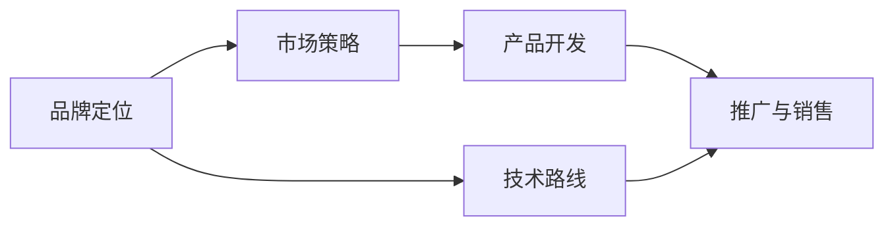

                 

# AI 大模型创业：如何利用品牌优势？

## 1. 背景介绍

在人工智能（AI）大模型（Large Language Model, LLM）的快速发展中，越来越多的创业公司开始探索如何利用这一新兴技术构建自己的品牌优势。尽管大模型的学术成果丰富，但在实际落地应用中，仍然面临诸多挑战。如何结合自身品牌特色，扬长避短，成为AI大模型创业成功的重要因素。本文将从品牌定位、市场策略、技术路线等多个维度，探讨如何在创业中利用品牌优势，推动AI大模型走向成熟。

## 2. 核心概念与联系

### 2.1 核心概念概述

为更好地理解如何利用品牌优势进行AI大模型创业，我们先来了解几个核心概念：

- **大语言模型（LLM）**：一种以深度学习为基础的预训练语言模型，通过大量无标签数据训练，具备强大的自然语言处理能力，能够执行复杂的语言理解和生成任务。
- **品牌优势**：企业通过独特的品牌定位、技术创新和市场策略，在市场竞争中占据有利位置，获得持续的发展优势。
- **市场策略**：企业通过目标市场选择、竞争策略、营销手段等手段，实现产品和服务的高效推广和销售。
- **技术路线**：企业根据自身品牌定位和发展目标，选择合适的大模型架构、优化方法、应用场景等，实现技术上的突破和应用上的创新。

这些概念之间有着紧密的联系，通过品牌优势的构建和发挥，企业可以在激烈的市场竞争中脱颖而出，推动AI大模型在实际应用中的落地和扩展。

### 2.2 核心概念原理和架构的 Mermaid 流程图



该流程图展示了品牌优势构建与发挥的基本流程：
1. 通过明确的品牌定位，选择适合的技术路线。
2. 根据品牌定位和目标市场，设计具体的市场策略。
3. 基于技术路线和市场策略，开发和推广产品。
4. 通过持续的市场推广和销售，巩固品牌优势。

## 3. 核心算法原理 & 具体操作步骤

### 3.1 算法原理概述

AI大模型创业的核心在于如何利用品牌的独特优势，结合大模型的技术力量，实现产品和服务的高质量交付。算法原理的核心在于如何通过品牌策略和技术手段，构建竞争优势。

**算法流程**：
1. **品牌定位**：明确品牌在市场中的独特价值主张。
2. **技术路线**：选择合适的大模型架构，并进行针对性的优化。
3. **市场策略**：根据品牌定位和目标市场，设计推广和销售策略。
4. **产品开发**：将技术路线与市场策略结合，开发出符合市场需求的产品。
5. **推广与销售**：通过有效的推广手段，将产品推向市场，实现商业价值。

### 3.2 算法步骤详解

以下是详细的算法步骤详解：

#### 3.2.1 品牌定位

品牌定位是企业品牌建设的基础，决定了企业在市场中的角色和形象。品牌定位需要考虑以下几个方面：

1. **目标市场**：明确目标用户群体的特征和需求。
2. **核心优势**：突出品牌独有的技术优势、服务优势或市场优势。
3. **品牌价值**：确定品牌的长期价值主张，如创新、可靠、高效等。

**算法步骤**：
1. **市场调研**：通过问卷调查、访谈等方式，了解目标用户的需求和期望。
2. **竞争分析**：分析竞争对手的品牌定位和市场策略，找出差异化的机会。
3. **品牌定位**：根据调研和分析结果，确定品牌的独特价值主张。

#### 3.2.2 技术路线

技术路线是大模型创业的核心，决定了模型架构、优化方法、应用场景等关键技术点。技术路线的选择应结合品牌定位和市场需求，进行针对性设计和优化。

**算法步骤**：
1. **模型选择**：根据品牌定位，选择适合的大模型架构，如BERT、GPT等。
2. **优化设计**：进行针对性的模型优化，如超参数调整、正则化技术等，提升模型性能。
3. **应用场景**：选择适合的大模型应用场景，如文本分类、对话系统、翻译等。

#### 3.2.3 市场策略

市场策略是大模型创业的重要组成部分，决定了产品如何进入市场并取得成功。市场策略应结合品牌定位和市场需求，进行多维度设计和执行。

**算法步骤**：
1. **目标市场选择**：根据品牌定位和产品特性，选择合适的目标市场。
2. **竞争策略**：设计差异化的市场策略，如差异化定价、差异化产品设计等。
3. **营销手段**：选择有效的营销手段，如SEO优化、社交媒体营销等。

#### 3.2.4 产品开发

产品开发是将品牌定位、技术路线和市场策略相结合，开发出满足市场需求的产品。产品开发需要考虑以下几个方面：

1. **用户体验**：确保产品易用、高效、稳定。
2. **技术实现**：确保技术方案高效、可扩展、可维护。
3. **市场适配**：确保产品符合市场需求，具备竞争优势。

**算法步骤**：
1. **需求分析**：根据市场调研和用户反馈，明确产品需求。
2. **技术实现**：将技术路线与需求分析结合，进行产品设计和技术开发。
3. **测试与优化**：进行产品测试和优化，确保产品质量和用户体验。

#### 3.2.5 推广与销售

推广与销售是大模型创业的最后一步，决定产品是否能成功进入市场并获得商业价值。推广与销售需要考虑以下几个方面：

1. **推广渠道**：选择合适的推广渠道，如社交媒体、官网、合作伙伴等。
2. **销售策略**：设计有效的销售策略，如折扣优惠、推广活动等。
3. **用户反馈**：根据用户反馈不断优化产品和服务。

**算法步骤**：
1. **渠道选择**：根据品牌定位和目标市场，选择合适的推广渠道。
2. **活动策划**：设计有效的推广和销售活动，如线上活动、线下展会等。
3. **用户反馈**：根据用户反馈不断优化产品和服务，提升用户满意度。

### 3.3 算法优缺点

利用品牌优势进行AI大模型创业，具有以下优点：
1. **快速市场定位**：通过明确的品牌定位，可以快速锁定目标用户群体。
2. **竞争优势明显**：结合技术优势和品牌特色，形成差异化的竞争优势。
3. **用户信任度高**：品牌知名度和美誉度有助于提高用户信任度。

同时，也存在一些缺点：
1. **品牌建设成本高**：品牌建设和维护需要投入大量资源。
2. **市场策略复杂**：市场策略设计复杂，需要具备丰富的市场经验和知识。
3. **技术要求高**：大模型技术要求高，需要持续投入研发资源。

### 3.4 算法应用领域

利用品牌优势进行AI大模型创业，可以应用于多个领域，包括但不限于：

1. **自然语言处理（NLP）**：如对话系统、情感分析、机器翻译等。
2. **医疗健康**：如医疗问答、疾病预测、病历分析等。
3. **金融科技**：如金融舆情监测、风险评估、智能投顾等。
4. **智能制造**：如智能客服、智能制造调度、质量控制等。
5. **智慧城市**：如城市事件监测、应急指挥、智能交通等。

## 4. 数学模型和公式 & 详细讲解 & 举例说明

### 4.1 数学模型构建

假设品牌定位为“高效、可靠、易用”，大模型架构为GPT，目标市场为医疗健康。

**模型构建**：
1. **品牌价值主张**：高效、可靠、易用。
2. **技术路线**：GPT大模型，超参数调整、正则化技术。
3. **市场策略**：差异化定价、医疗场景定制。

### 4.2 公式推导过程

**品牌价值主张**：
$$
V = \max_{\theta} \left\{ \sum_{i} f_{i}(\theta) \right\}
$$
其中，$f_i(\theta)$ 表示品牌价值中的每个要素。

**技术路线**：
$$
M = \min_{\omega} \left\{ \sum_{j} \lambda_j g_j(\omega) \right\}
$$
其中，$\lambda_j$ 表示每个优化参数的权重，$g_j(\omega)$ 表示模型的优化目标。

**市场策略**：
$$
S = \max_{\alpha} \left\{ \sum_{k} \mu_k s_k(\alpha) \right\}
$$
其中，$\mu_k$ 表示每个市场策略的权重，$s_k(\alpha)$ 表示市场策略的效果。

### 4.3 案例分析与讲解

**案例**：某医疗健康AI大模型创业公司。

**品牌定位**：高效、可靠、易用。
**技术路线**：选择GPT大模型，进行超参数调整、正则化技术优化。
**市场策略**：差异化定价、医疗场景定制。
**产品开发**：开发医疗问答系统，进行用户测试和优化。
**推广与销售**：选择医疗论坛、行业展会进行推广，设计优惠活动，不断收集用户反馈。

## 5. 项目实践：代码实例和详细解释说明

### 5.1 开发环境搭建

以下是在Python环境下搭建AI大模型创业项目的具体步骤：

1. **安装Python**：确保系统已安装Python 3.8及以上版本。
2. **安装虚拟环境**：
   ```
   python -m venv venv
   source venv/bin/activate
   ```
3. **安装依赖包**：
   ```
   pip install transformers sklearn pandas
   ```

### 5.2 源代码详细实现

以下是使用PyTorch进行AI大模型微调的Python代码示例：

```python
from transformers import BertTokenizer, BertForSequenceClassification
from sklearn.model_selection import train_test_split
from sklearn.metrics import accuracy_score

# 数据准备
train_data, test_data = train_test_split(data, test_size=0.2)
train_texts = [d.text for d in train_data]
train_labels = [d.label for d in train_data]
test_texts = [d.text for d in test_data]
test_labels = [d.label for d in test_data]

# 分词和编码
tokenizer = BertTokenizer.from_pretrained('bert-base-cased')
train_encodings = tokenizer(train_texts, return_tensors='pt', padding='max_length', truncation=True)
test_encodings = tokenizer(test_texts, return_tensors='pt', padding='max_length', truncation=True)

# 模型加载和微调
model = BertForSequenceClassification.from_pretrained('bert-base-cased', num_labels=2)
device = 'cuda' if torch.cuda.is_available() else 'cpu'
model.to(device)

# 训练
model.train()
optimizer = AdamW(model.parameters(), lr=1e-5)
for epoch in range(10):
    for batch in train_encodings:
        input_ids = batch['input_ids'].to(device)
        attention_mask = batch['attention_mask'].to(device)
        labels = batch['labels'].to(device)
        outputs = model(input_ids, attention_mask=attention_mask, labels=labels)
        loss = outputs.loss
        optimizer.zero_grad()
        loss.backward()
        optimizer.step()

# 评估
model.eval()
with torch.no_grad():
    preds = []
    labels = []
    for batch in test_encodings:
        input_ids = batch['input_ids'].to(device)
        attention_mask = batch['attention_mask'].to(device)
        labels = batch['labels'].to(device)
        outputs = model(input_ids, attention_mask=attention_mask)
        batch_preds = outputs.logits.argmax(dim=1).tolist()
        for pred, label in zip(batch_preds, labels):
            preds.append(pred)
            labels.append(label)
    accuracy = accuracy_score(labels, preds)
    print(f'Test Accuracy: {accuracy:.2f}')
```

### 5.3 代码解读与分析

上述代码实现了使用BERT模型进行二分类任务微调的过程。关键步骤如下：
1. **数据准备**：将数据划分为训练集和测试集。
2. **分词和编码**：使用BertTokenizer对文本进行分词和编码。
3. **模型加载**：加载预训练的BERT模型，并进行微调。
4. **训练和评估**：使用AdamW优化器进行模型训练，并在测试集上评估模型的准确率。

## 6. 实际应用场景

### 6.1 医疗健康

在医疗健康领域，AI大模型可以用于病历分析、疾病预测、医疗问答等任务。通过品牌优势，可以提升患者和医生的信任度，提高医疗服务质量和效率。

**案例**：某医疗健康AI大模型创业公司，品牌定位为“高效、可靠、易用”。选择GPT大模型，进行超参数调整和正则化技术优化。在医疗问答系统开发和推广中，通过差异化定价和医疗场景定制，获得医疗机构的广泛认可。

### 6.2 金融科技

在金融科技领域，AI大模型可以用于金融舆情监测、风险评估、智能投顾等任务。通过品牌优势，可以增强金融机构的信任度，提升服务质量和用户体验。

**案例**：某金融科技AI大模型创业公司，品牌定位为“安全、可靠、高效”。选择GPT大模型，进行超参数调整和正则化技术优化。在金融舆情监测系统开发和推广中，通过差异化定价和金融场景定制，获得金融机构的广泛认可。

### 6.3 智能制造

在智能制造领域，AI大模型可以用于智能客服、智能制造调度、质量控制等任务。通过品牌优势，可以提高制造企业的运营效率和产品质量。

**案例**：某智能制造AI大模型创业公司，品牌定位为“智能、高效、可靠”。选择GPT大模型，进行超参数调整和正则化技术优化。在智能客服系统开发和推广中，通过差异化定价和制造场景定制，获得制造企业的广泛认可。

### 6.4 智慧城市

在智慧城市领域，AI大模型可以用于城市事件监测、应急指挥、智能交通等任务。通过品牌优势，可以提高城市管理效率和居民生活质量。

**案例**：某智慧城市AI大模型创业公司，品牌定位为“智能、安全、高效”。选择GPT大模型，进行超参数调整和正则化技术优化。在城市事件监测系统开发和推广中，通过差异化定价和智慧城市场景定制，获得政府的广泛认可。

## 7. 工具和资源推荐

### 7.1 学习资源推荐

1. **《深度学习》**：Ian Goodfellow等著，系统介绍深度学习原理和应用。
2. **《Transformer从原理到实践》**：HuggingFace官方文档，详细讲解Transformer和GPT模型原理及实践。
3. **《自然语言处理》**：Stanford CS224N课程，涵盖NLP基本概念和经典模型。
4. **Kaggle竞赛**：参与NLP相关的Kaggle竞赛，提升实战能力和经验。

### 7.2 开发工具推荐

1. **PyTorch**：深度学习框架，支持GPU加速，灵活高效。
2. **TensorFlow**：深度学习框架，生产部署方便，支持TPU加速。
3. **Weights & Biases**：模型实验跟踪工具，记录和可视化模型训练过程。
4. **Google Colab**：在线Jupyter Notebook环境，免费提供GPU/TPU算力。
5. **Jupyter Notebook**：开发和协作工具，支持代码和文档的联合展示。

### 7.3 相关论文推荐

1. **Attention is All You Need**：Transformer原论文，提出自注意力机制，开启大模型预训练时代。
2. **BERT: Pre-training of Deep Bidirectional Transformers for Language Understanding**：BERT模型论文，引入掩码语言模型预训练任务。
3. **AdaLoRA: Adaptive Low-Rank Adaptation for Parameter-Efficient Fine-Tuning**：低秩适应的微调方法，参数高效且精度高。
4. **Prefix-Tuning: Optimizing Continuous Prompts for Generation**： Prefix-Tuning方法，通过提示模板提高模型零样本学习能力。

## 8. 总结：未来发展趋势与挑战

### 8.1 研究成果总结

本文从品牌定位、技术路线、市场策略、产品开发、推广与销售等多个维度，探讨了AI大模型创业的实施路径。通过品牌优势的构建和发挥，可以推动AI大模型在实际应用中的落地和扩展。

### 8.2 未来发展趋势

1. **品牌竞争力增强**：随着AI大模型的广泛应用，品牌优势将更加明显。
2. **技术创新加速**：大模型技术的不断发展，将带来更多创新应用场景。
3. **市场策略多样化**：差异化定价、场景定制等策略将更加广泛应用。

### 8.3 面临的挑战

1. **品牌建设成本高**：品牌建设和维护需要大量资源。
2. **市场策略复杂**：市场策略设计复杂，需要丰富的市场经验和知识。
3. **技术要求高**：大模型技术要求高，需要持续投入研发资源。

### 8.4 研究展望

1. **品牌协同优化**：品牌与技术协同发展，提升品牌竞争力。
2. **场景定制化**：针对不同场景设计定制化产品，提升用户体验。
3. **技术创新突破**：探索新的技术路线和方法，推动AI大模型的技术创新。

## 9. 附录：常见问题与解答

### Q1: AI大模型创业如何选择合适的品牌定位？

A: AI大模型创业选择合适的品牌定位需要考虑以下几个因素：
1. **市场需求**：明确目标用户群体的需求和痛点。
2. **竞争环境**：分析竞争对手的品牌定位和市场策略。
3. **核心竞争力**：突出品牌独有的技术优势和服务优势。

### Q2: 如何设计有效的市场策略？

A: 设计有效的市场策略需要考虑以下几个方面：
1. **目标市场选择**：明确目标用户群体的特征和需求。
2. **竞争策略**：设计差异化的市场策略，如差异化定价、差异化产品设计等。
3. **营销手段**：选择有效的营销手段，如SEO优化、社交媒体营销等。

### Q3: 如何优化大模型的性能？

A: 优化大模型性能需要考虑以下几个方面：
1. **模型选择**：选择适合的大模型架构，如BERT、GPT等。
2. **超参数调整**：进行针对性的超参数调整，提升模型性能。
3. **正则化技术**：引入正则化技术，如L2正则、Dropout等，防止过拟合。

### Q4: 如何构建和维护品牌？

A: 构建和维护品牌需要考虑以下几个方面：
1. **品牌定位**：明确品牌在市场中的独特价值主张。
2. **品牌形象**：通过品牌活动、品牌故事等塑造品牌形象。
3. **品牌管理**：通过品牌管理团队和系统，维护品牌的一致性和公信力。

### Q5: AI大模型创业如何应对市场变化？

A: 应对市场变化需要考虑以下几个方面：
1. **市场调研**：通过问卷调查、访谈等方式，了解市场变化趋势。
2. **产品优化**：根据市场变化，优化产品和服务。
3. **营销调整**：根据市场变化，调整营销策略和推广手段。

---

作者：禅与计算机程序设计艺术 / Zen and the Art of Computer Programming

