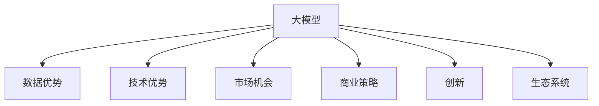

                 

# AI 大模型创业：如何利用平台优势？

> 关键词：大模型创业,平台优势,数据优势,技术优势,市场机会,商业策略,创新,实践案例,发展路径

## 1. 背景介绍

### 1.1 问题由来
近年来，随着深度学习技术和大模型能力的飞速发展，AI领域涌现出了一批新型创业公司，它们依托于大模型的强大实力，迅速攻占市场，颠覆了传统IT企业和传统的解决方案提供商。在如火如荼的大模型创业浪潮中，大模型企业需要更好地发挥平台优势，构建生态，提供解决方案，以实现市场突破和长远发展。

### 1.2 问题核心关键点
目前，大模型企业面临的挑战包括如何充分利用平台优势，构建生态系统，并提供优质的解决方案。这需要综合考虑数据的优势、技术的优势、市场的现状和趋势，以及创新的商业模式。

### 1.3 问题研究意义
研究大模型企业的创业策略，有助于了解如何充分利用大模型的技术和数据优势，构建良性的商业生态，推动AI技术落地应用，促进AI技术的市场化进程，并为后续的创业企业提供借鉴和参考。

## 2. 核心概念与联系

### 2.1 核心概念概述

为更好地理解大模型创业的策略，本节将介绍几个核心概念：

- 大模型(Large Model)：指使用大规模数据和复杂模型进行训练的深度学习模型，如BERT、GPT等，这些模型通常具有较强的通用性和泛化能力。
- 平台优势(Platform Advantage)：指企业通过构建基础平台，整合数据、技术、市场等资源，提供全面解决方案的能力。
- 数据优势(Data Advantage)：指企业通过掌握海量高质量数据，提升模型训练的深度和泛化能力。
- 技术优势(Technology Advantage)：指企业通过开发高效的模型训练和推理算法，优化模型性能，提升模型适用性。
- 市场机会(Market Opportunity)：指企业通过精准定位目标市场，挖掘需求，提供匹配的解决方案。
- 商业策略(Business Strategy)：指企业通过制定合理的定价、推广和销售策略，最大化市场和用户价值。
- 创新(Innovation)：指企业通过不断研发新产品和新技术，保持市场领先地位。
- 生态系统(Ecosystem)：指企业通过合作与共享，构建生态圈，提供全面的解决方案。

这些核心概念之间的逻辑关系可以通过以下Mermaid流程图来展示：



这个流程图展示了大模型创业的关键概念及其之间的关系：

1. 大模型作为核心竞争力，是创业的基础。
2. 数据优势和技术优势提升模型的性能和泛化能力。
3. 市场机会和商业策略影响创业的成功与否。
4. 创新驱动持续发展，生态系统构建综合竞争优势。

这些概念共同构成了大模型创业的平台基础，帮助企业实现市场突破和长期发展。

## 3. 核心算法原理 & 具体操作步骤
### 3.1 算法原理概述

大模型创业的核心在于利用平台优势，提供优质的解决方案。这需要构建一个综合的数据和技术平台，通过整合平台优势、数据优势、技术优势等，提供全方位的市场支持。

### 3.2 算法步骤详解

大模型创业的典型步骤包括：

**Step 1: 数据平台构建**
- 收集、清洗、标注大量高质量的数据集，如图像、文本、语音等，形成丰富的数据集池。
- 建立高效的数据处理和存储系统，如大数据平台Hadoop、云存储系统AWS S3等。

**Step 2: 技术平台开发**
- 开发高效的数据处理和模型训练工具，如TensorFlow、PyTorch等，提供模型训练的API接口。
- 实现高效的模型推理和部署系统，如TensorFlow Serving、MXNet等，优化模型的推理速度和资源占用。

**Step 3: 生态系统构建**
- 整合第三方API接口，如语言模型、视觉模型、NLP工具等，提供一站式解决方案。
- 建立开发者社区，提供技术支持、文档和代码示例，促进开发者之间的交流和协作。

**Step 4: 市场机会挖掘**
- 通过市场调研，了解用户需求和痛点，精准定位目标市场。
- 开发针对性的解决方案，如医疗、金融、教育等行业应用。

**Step 5: 商业策略制定**
- 制定合理的价格策略，平衡成本和收益。
- 推广和销售策略，包括线上营销、展会参展、合作伙伴等。

**Step 6: 创新持续推动**
- 研发新技术和新产品，保持技术领先。
- 不断改进平台功能，提升用户体验。

### 3.3 算法优缺点

大模型创业的优势在于可以利用平台优势，整合资源，提供全面解决方案。其缺点主要在于：

1. 初始投资大：搭建数据和技术平台需要大量的初始投资。
2. 技术门槛高：需要具备强大的技术实力，才能构建和维护高水平平台。
3. 市场竞争激烈：需要不断创新，才能在激烈的市场竞争中脱颖而出。

### 3.4 算法应用领域

大模型创业适用于多个领域，如医疗、金融、教育、物流、零售等。以下是几个典型应用案例：

- 医疗领域：开发基于深度学习的诊断和治疗方案，利用大模型进行疾病预测和诊断。
- 金融领域：使用大模型进行风险评估和信用评分，提升金融服务的智能化和个性化。
- 教育领域：提供个性化学习推荐和智能辅导，提升教育效果。
- 零售领域：通过深度学习分析用户行为，进行精准营销和库存管理。
- 物流领域：利用大模型进行路径优化和配送调度，提升物流效率。

这些领域的应用展示了大模型创业的广泛性和潜力。

## 4. 数学模型和公式 & 详细讲解  
### 4.1 数学模型构建

假设有一个通用的AI大模型平台，其核心模型为 $M_{\theta}$，其中 $\theta$ 为模型参数。数据平台上的数据集为 $D=\{(x_i,y_i)\}_{i=1}^N$，$x_i$ 为输入，$y_i$ 为标签。

定义模型在数据集上的损失函数为 $\mathcal{L}(M_{\theta},D)$，其中：

$$
\mathcal{L}(M_{\theta},D) = \frac{1}{N} \sum_{i=1}^N \ell(M_{\theta}(x_i),y_i)
$$

其中 $\ell$ 为损失函数，通常为交叉熵损失或均方误差损失。

### 4.2 公式推导过程

以分类任务为例，损失函数为：

$$
\ell(M_{\theta}(x_i),y_i) = -[y_i\log M_{\theta}(x_i)+(1-y_i)\log(1-M_{\theta}(x_i))]
$$

将 $M_{\theta}(x_i)$ 表示为模型的输出概率，即可得：

$$
\mathcal{L}(M_{\theta},D) = -\frac{1}{N} \sum_{i=1}^N [y_i\log M_{\theta}(x_i)+(1-y_i)\log(1-M_{\theta}(x_i))]
$$

通过梯度下降算法，最小化损失函数：

$$
\theta \leftarrow \theta - \eta \nabla_{\theta}\mathcal{L}(\theta) - \eta\lambda\theta
$$

其中 $\eta$ 为学习率，$\lambda$ 为正则化系数。

### 4.3 案例分析与讲解

假设某公司开发了一个基于BERT大模型的医疗诊断系统。其核心算法步骤如下：

1. 收集并标注大规模医疗数据集，用于训练BERT模型。
2. 搭建数据平台，提供数据存储和处理服务。
3. 构建技术平台，使用TensorFlow训练和部署模型。
4. 开发医疗领域的应用场景，如疾病诊断、治疗方案推荐等。
5. 制定商业策略，推广解决方案，占领市场。

案例展示了如何利用大模型平台优势，构建医疗领域的解决方案，推动健康医疗产业的发展。

## 5. 项目实践：代码实例和详细解释说明
### 5.1 开发环境搭建

在进行大模型创业实践前，我们需要准备好开发环境。以下是使用Python进行PyTorch开发的环境配置流程：

1. 安装Anaconda：从官网下载并安装Anaconda，用于创建独立的Python环境。

2. 创建并激活虚拟环境：
```bash
conda create -n pytorch-env python=3.8 
conda activate pytorch-env
```

3. 安装PyTorch：根据CUDA版本，从官网获取对应的安装命令。例如：
```bash
conda install pytorch torchvision torchaudio cudatoolkit=11.1 -c pytorch -c conda-forge
```

4. 安装Transformers库：
```bash
pip install transformers
```

5. 安装各类工具包：
```bash
pip install numpy pandas scikit-learn matplotlib tqdm jupyter notebook ipython
```

完成上述步骤后，即可在`pytorch-env`环境中开始创业实践。

### 5.2 源代码详细实现

这里我们以一个医疗诊断项目为例，展示大模型创业的完整代码实现。

首先，定义医疗诊断的数据处理函数：

```python
from transformers import BertTokenizer
from torch.utils.data import Dataset
import torch

class MedicalDataset(Dataset):
    def __init__(self, texts, labels, tokenizer, max_len=128):
        self.texts = texts
        self.labels = labels
        self.tokenizer = tokenizer
        self.max_len = max_len
        
    def __len__(self):
        return len(self.texts)
    
    def __getitem__(self, item):
        text = self.texts[item]
        label = self.labels[item]
        
        encoding = self.tokenizer(text, return_tensors='pt', max_length=self.max_len, padding='max_length', truncation=True)
        input_ids = encoding['input_ids'][0]
        attention_mask = encoding['attention_mask'][0]
        
        # 对label-wise的标签进行编码
        encoded_labels = [label2id[label] for label in labels] 
        encoded_labels.extend([label2id['O']] * (self.max_len - len(encoded_labels)))
        labels = torch.tensor(encoded_labels, dtype=torch.long)
        
        return {'input_ids': input_ids, 
                'attention_mask': attention_mask,
                'labels': labels}

# 标签与id的映射
label2id = {'O': 0, 'B-DISEASE': 1, 'I-DISEASE': 2, 'B-TREATMENT': 3, 'I-TREATMENT': 4}
id2label = {v: k for k, v in label2id.items()}

# 创建dataset
tokenizer = BertTokenizer.from_pretrained('bert-base-cased')

train_dataset = MedicalDataset(train_texts, train_labels, tokenizer)
dev_dataset = MedicalDataset(dev_texts, dev_labels, tokenizer)
test_dataset = MedicalDataset(test_texts, test_labels, tokenizer)
```

然后，定义模型和优化器：

```python
from transformers import BertForTokenClassification, AdamW

model = BertForTokenClassification.from_pretrained('bert-base-cased', num_labels=len(label2id))

optimizer = AdamW(model.parameters(), lr=2e-5)
```

接着，定义训练和评估函数：

```python
from torch.utils.data import DataLoader
from tqdm import tqdm
from sklearn.metrics import classification_report

device = torch.device('cuda') if torch.cuda.is_available() else torch.device('cpu')
model.to(device)

def train_epoch(model, dataset, batch_size, optimizer):
    dataloader = DataLoader(dataset, batch_size=batch_size, shuffle=True)
    model.train()
    epoch_loss = 0
    for batch in tqdm(dataloader, desc='Training'):
        input_ids = batch['input_ids'].to(device)
        attention_mask = batch['attention_mask'].to(device)
        labels = batch['labels'].to(device)
        model.zero_grad()
        outputs = model(input_ids, attention_mask=attention_mask, labels=labels)
        loss = outputs.loss
        epoch_loss += loss.item()
        loss.backward()
        optimizer.step()
    return epoch_loss / len(dataloader)

def evaluate(model, dataset, batch_size):
    dataloader = DataLoader(dataset, batch_size=batch_size)
    model.eval()
    preds, labels = [], []
    with torch.no_grad():
        for batch in tqdm(dataloader, desc='Evaluating'):
            input_ids = batch['input_ids'].to(device)
            attention_mask = batch['attention_mask'].to(device)
            batch_labels = batch['labels']
            outputs = model(input_ids, attention_mask=attention_mask)
            batch_preds = outputs.logits.argmax(dim=2).to('cpu').tolist()
            batch_labels = batch_labels.to('cpu').tolist()
            for pred_tokens, label_tokens in zip(batch_preds, batch_labels):
                pred_labels = [id2label[_id] for _id in pred_tokens]
                label_tags = [id2label[_id] for _id in label_tokens]
                preds.append(pred_labels[:len(label_tags)])
                labels.append(label_tags)
                
    print(classification_report(labels, preds))
```

最后，启动训练流程并在测试集上评估：

```python
epochs = 5
batch_size = 16

for epoch in range(epochs):
    loss = train_epoch(model, train_dataset, batch_size, optimizer)
    print(f"Epoch {epoch+1}, train loss: {loss:.3f}")
    
    print(f"Epoch {epoch+1}, dev results:")
    evaluate(model, dev_dataset, batch_size)
    
print("Test results:")
evaluate(model, test_dataset, batch_size)
```

以上就是使用PyTorch对BERT进行医疗诊断任务微调的完整代码实现。可以看到，得益于Transformers库的强大封装，我们可以用相对简洁的代码完成BERT模型的加载和微调。

### 5.3 代码解读与分析

让我们再详细解读一下关键代码的实现细节：

**MedicalDataset类**：
- `__init__`方法：初始化文本、标签、分词器等关键组件。
- `__len__`方法：返回数据集的样本数量。
- `__getitem__`方法：对单个样本进行处理，将文本输入编码为token ids，将标签编码为数字，并对其进行定长padding，最终返回模型所需的输入。

**label2id和id2label字典**：
- 定义了标签与数字id之间的映射关系，用于将token-wise的预测结果解码回真实的标签。

**训练和评估函数**：
- 使用PyTorch的DataLoader对数据集进行批次化加载，供模型训练和推理使用。
- 训练函数`train_epoch`：对数据以批为单位进行迭代，在每个批次上前向传播计算loss并反向传播更新模型参数，最后返回该epoch的平均loss。
- 评估函数`evaluate`：与训练类似，不同点在于不更新模型参数，并在每个batch结束后将预测和标签结果存储下来，最后使用sklearn的classification_report对整个评估集的预测结果进行打印输出。

**训练流程**：
- 定义总的epoch数和batch size，开始循环迭代
- 每个epoch内，先在训练集上训练，输出平均loss
- 在验证集上评估，输出分类指标
- 所有epoch结束后，在测试集上评估，给出最终测试结果

可以看到，PyTorch配合Transformers库使得BERT微调的代码实现变得简洁高效。开发者可以将更多精力放在数据处理、模型改进等高层逻辑上，而不必过多关注底层的实现细节。

当然，工业级的系统实现还需考虑更多因素，如模型的保存和部署、超参数的自动搜索、更灵活的任务适配层等。但核心的微调范式基本与此类似。

## 6. 实际应用场景
### 6.1 智能客服系统

基于大模型创业的对话技术，可以广泛应用于智能客服系统的构建。传统客服往往需要配备大量人力，高峰期响应缓慢，且一致性和专业性难以保证。而使用大模型创业开发的对话模型，可以7x24小时不间断服务，快速响应客户咨询，用自然流畅的语言解答各类常见问题。

在技术实现上，可以收集企业内部的历史客服对话记录，将问题和最佳答复构建成监督数据，在此基础上对预训练对话模型进行微调。微调后的对话模型能够自动理解用户意图，匹配最合适的答案模板进行回复。对于客户提出的新问题，还可以接入检索系统实时搜索相关内容，动态组织生成回答。如此构建的智能客服系统，能大幅提升客户咨询体验和问题解决效率。

### 6.2 金融舆情监测

金融机构需要实时监测市场舆论动向，以便及时应对负面信息传播，规避金融风险。传统的人工监测方式成本高、效率低，难以应对网络时代海量信息爆发的挑战。基于大模型创业的文本分类和情感分析技术，为金融舆情监测提供了新的解决方案。

具体而言，可以收集金融领域相关的新闻、报道、评论等文本数据，并对其进行主题标注和情感标注。在此基础上对预训练语言模型进行微调，使其能够自动判断文本属于何种主题，情感倾向是正面、中性还是负面。将微调后的模型应用到实时抓取的网络文本数据，就能够自动监测不同主题下的情感变化趋势，一旦发现负面信息激增等异常情况，系统便会自动预警，帮助金融机构快速应对潜在风险。

### 6.3 个性化推荐系统

当前的推荐系统往往只依赖用户的历史行为数据进行物品推荐，无法深入理解用户的真实兴趣偏好。基于大模型创业的个性化推荐系统可以更好地挖掘用户行为背后的语义信息，从而提供更精准、多样的推荐内容。

在实践中，可以收集用户浏览、点击、评论、分享等行为数据，提取和用户交互的物品标题、描述、标签等文本内容。将文本内容作为模型输入，用户的后续行为（如是否点击、购买等）作为监督信号，在此基础上微调预训练语言模型。微调后的模型能够从文本内容中准确把握用户的兴趣点。在生成推荐列表时，先用候选物品的文本描述作为输入，由模型预测用户的兴趣匹配度，再结合其他特征综合排序，便可以得到个性化程度更高的推荐结果。

### 6.4 未来应用展望

随着大模型创业技术的发展，基于微调的方法将在更多领域得到应用，为传统行业带来变革性影响。

在智慧医疗领域，基于大模型创业的诊断和治疗方案，提升医疗服务的智能化和个性化。

在智能教育领域，大模型创业开发的个性化学习推荐和智能辅导，提升教育效果。

在智慧城市治理中，大模型创业构建的智能应急指挥系统，提高城市管理的自动化和智能化水平，构建更安全、高效的未来城市。

此外，在企业生产、社会治理、文娱传媒等众多领域，大模型创业技术也将不断涌现，为NLP技术带来新的突破。相信随着预训练语言模型和微调方法的持续演进，基于大模型创业的微调方法必将在构建人机协同的智能时代中扮演越来越重要的角色。

## 7. 工具和资源推荐
### 7.1 学习资源推荐

为了帮助开发者系统掌握大模型创业的理论基础和实践技巧，这里推荐一些优质的学习资源：

1. 《Transformer从原理到实践》系列博文：由大模型技术专家撰写，深入浅出地介绍了Transformer原理、BERT模型、创业策略等前沿话题。

2. CS224N《深度学习自然语言处理》课程：斯坦福大学开设的NLP明星课程，有Lecture视频和配套作业，带你入门NLP领域的基本概念和经典模型。

3. 《Natural Language Processing with Transformers》书籍：Transformers库的作者所著，全面介绍了如何使用Transformers库进行NLP任务开发，包括创业策略在内的诸多范式。

4. HuggingFace官方文档：Transformers库的官方文档，提供了海量预训练模型和完整的微调样例代码，是创业实践的必备资料。

5. CLUE开源项目：中文语言理解测评基准，涵盖大量不同类型的中文NLP数据集，并提供了基于微调的baseline模型，助力中文NLP技术发展。

通过对这些资源的学习实践，相信你一定能够快速掌握大模型创业的精髓，并用于解决实际的NLP问题。

### 7.2 开发工具推荐

高效的开发离不开优秀的工具支持。以下是几款用于大模型创业开发的常用工具：

1. PyTorch：基于Python的开源深度学习框架，灵活动态的计算图，适合快速迭代研究。大部分预训练语言模型都有PyTorch版本的实现。

2. TensorFlow：由Google主导开发的开源深度学习框架，生产部署方便，适合大规模工程应用。同样有丰富的预训练语言模型资源。

3. Transformers库：HuggingFace开发的NLP工具库，集成了众多SOTA语言模型，支持PyTorch和TensorFlow，是创业实践开发的利器。

4. Weights & Biases：模型训练的实验跟踪工具，可以记录和可视化模型训练过程中的各项指标，方便对比和调优。与主流深度学习框架无缝集成。

5. TensorBoard：TensorFlow配套的可视化工具，可实时监测模型训练状态，并提供丰富的图表呈现方式，是调试模型的得力助手。

6. Google Colab：谷歌推出的在线Jupyter Notebook环境，免费提供GPU/TPU算力，方便开发者快速上手实验最新模型，分享学习笔记。

合理利用这些工具，可以显著提升大模型创业任务的开发效率，加快创新迭代的步伐。

### 7.3 相关论文推荐

大模型创业技术的发展源于学界的持续研究。以下是几篇奠基性的相关论文，推荐阅读：

1. Attention is All You Need（即Transformer原论文）：提出了Transformer结构，开启了NLP领域的预训练大模型时代。

2. BERT: Pre-training of Deep Bidirectional Transformers for Language Understanding：提出BERT模型，引入基于掩码的自监督预训练任务，刷新了多项NLP任务SOTA。

3. Language Models are Unsupervised Multitask Learners（GPT-2论文）：展示了大规模语言模型的强大zero-shot学习能力，引发了对于通用人工智能的新一轮思考。

4. Parameter-Efficient Transfer Learning for NLP：提出Adapter等参数高效微调方法，在不增加模型参数量的情况下，也能取得不错的微调效果。

5. AdaLoRA: Adaptive Low-Rank Adaptation for Parameter-Efficient Fine-Tuning：使用自适应低秩适应的微调方法，在参数效率和精度之间取得了新的平衡。

6. Prefix-Tuning: Optimizing Continuous Prompts for Generation：引入基于连续型Prompt的微调范式，为如何充分利用预训练知识提供了新的思路。

这些论文代表了大模型创业技术的发展脉络。通过学习这些前沿成果，可以帮助研究者把握学科前进方向，激发更多的创新灵感。

## 8. 总结：未来发展趋势与挑战

### 8.1 总结

本文对基于大模型的AI创业策略进行了全面系统的介绍。首先阐述了大模型创业的背景和意义，明确了创业过程中数据、技术、市场和商业策略的相互关系。其次，从原理到实践，详细讲解了创业的核心算法步骤，并给出了微调任务开发的完整代码实例。同时，本文还广泛探讨了创业技术在多个行业领域的应用前景，展示了其广阔的市场机会。

通过本文的系统梳理，可以看到，基于大模型的AI创业技术正在快速发展，利用平台优势和数据优势，提供优质解决方案，推动AI技术落地应用，加速AI技术的产业化进程。未来，随着大模型技术和应用的不断成熟，AI创业企业必将在更广阔的领域拓展市场，造福更多行业和用户。

### 8.2 未来发展趋势

展望未来，AI大模型创业技术将呈现以下几个发展趋势：

1. 平台能力持续提升。随着数据和算力的不断增长，大模型平台的计算能力和数据规模将持续提升，提供更加高效、强大的服务。

2. 应用场景日益广泛。AI大模型创业技术将逐步渗透到各行各业，推动智能化转型，提升用户体验。

3. 生态系统不断完善。通过构建多方合作、资源共享的生态系统，推动AI技术的进一步发展和落地应用。

4. 技术创新持续推进。随着技术的不断进步，AI创业企业将不断推出新产品，推动技术前沿。

5. 行业标准逐步形成。行业标准的制定将有助于规范市场行为，提升AI技术的市场竞争力。

6. 伦理道德日益重视。在技术应用过程中，将更加注重伦理道德的考量，保障用户隐私和安全。

以上趋势凸显了AI大模型创业技术的广阔前景。这些方向的探索发展，必将进一步提升AI创业企业的市场竞争力和技术实力。

### 8.3 面临的挑战

尽管AI大模型创业技术已经取得了瞩目成就，但在迈向更加智能化、普适化应用的过程中，它仍面临着诸多挑战：

1. 数据质量瓶颈。数据质量的好坏直接影响模型的性能，高质量数据的获取和标注成本较高。

2. 计算资源瓶颈。大模型训练和推理需要大量的计算资源，如何高效利用资源成为一大难题。

3. 技术门槛高。AI大模型创业需要强大的技术实力，需要高水平的工程师和科学家。

4. 市场竞争激烈。AI大模型创业市场竞争激烈，需要不断创新，才能在激烈的市场竞争中脱颖而出。

5. 商业模式待优化。如何通过合理的商业模式，平衡成本和收益，实现商业可持续性，是创业企业需要不断探索的问题。

6. 伦理道德风险。AI大模型创业技术需要考虑伦理道德问题，避免对用户造成伤害。

### 8.4 研究展望

面向未来，AI大模型创业技术需要在以下几个方面寻求新的突破：

1. 多模态数据融合。将视觉、语音等多模态数据与文本数据结合，提升模型的综合能力。

2. 跨领域知识迁移。通过迁移学习，将知识在不同领域之间进行迁移，提升模型的泛化能力。

3. 可解释性增强。通过提高模型的可解释性，增强用户对模型的信任和接受度。

4. 自动化水平提升。通过自动化模型训练和优化，降低人力成本，提升模型训练效率。

5. 资源利用优化。通过优化计算资源利用，提高模型训练和推理的效率。

6. 模型压缩与优化。通过模型压缩和优化，减小模型的存储和计算开销，提高模型性能。

这些研究方向的探索，必将引领AI大模型创业技术迈向更高的台阶，为构建安全、可靠、可解释、可控的智能系统铺平道路。面向未来，AI大模型创业技术还需要与其他人工智能技术进行更深入的融合，如知识表示、因果推理、强化学习等，多路径协同发力，共同推动自然语言理解和智能交互系统的进步。只有勇于创新、敢于突破，才能不断拓展语言模型的边界，让智能技术更好地造福人类社会。

## 9. 附录：常见问题与解答

**Q1：大模型创业如何获取高质量数据？**

A: 高质量数据是构建大模型平台的基础，需要通过多种方式获取。
1. 公开数据集：利用公开的、大规模的语料库，如Wikipedia、中文维基等。
2. 行业数据：合作企业或第三方机构，获取行业相关的数据。
3. 爬虫抓取：通过爬虫技术获取网络上的数据，如新闻、评论等。
4. 众包标注：利用众包平台，对数据进行标注，获取高质量的标注数据。

**Q2：大模型创业初期投资巨大，如何获取融资？**

A: 获取融资是创业的重要环节，以下是几种常用的方法：
1. 天使投资：寻找有潜力的天使投资人，通过演示和讨论获得资金支持。
2. 风投机构：向风投机构提交商业计划书，争取投资。
3. Kaggle比赛：参加Kaggle等数据科学竞赛，通过优异成绩吸引投资人关注。
4. 众筹平台：在众筹平台上发布融资需求，吸引社会公众投资。
5. 企业合作：与有需求的企业合作，提供定制化解决方案，获取项目支持。

**Q3：大模型创业过程中，如何规避法律风险？**

A: 法律风险是创业过程中需要注意的重要问题，以下是几种规避方法：
1. 数据隐私保护：遵守数据隐私保护法律法规，保护用户隐私。
2. 知识产权保护：申请专利和技术保密，保护公司核心技术。
3. 合同合规：签订合理的合同，明确权利和义务。
4. 法律咨询：聘请法律顾问，提供专业的法律咨询和指导。
5. 合规运营：遵守行业规范，保持合法合规运营。

**Q4：大模型创业如何构建健康的生态系统？**

A: 健康的生态系统是企业长久发展的关键，以下是几种构建方法：
1. 合作伙伴：与其他企业和机构建立合作伙伴关系，共同开发和推广。
2. 开发者社区：建立开发者社区，提供技术支持、文档和代码示例，促进开发者之间的交流和协作。
3. 开源项目：发布开源项目，吸引更多的开发者参与。
4. 标准化接口：提供标准化接口，方便第三方应用集成。
5. 用户反馈：收集用户反馈，不断改进产品和服务。

**Q5：大模型创业如何提高市场竞争力？**

A: 提高市场竞争力是创业企业的核心目标，以下是几种有效方法：
1. 产品差异化：开发独特的产品和解决方案，满足用户需求。
2. 客户服务：提供优质的客户服务，提升用户体验。
3. 品牌建设：通过营销和公关活动，提升品牌知名度和影响力。
4. 创新能力：持续研发新技术和新产品，保持技术领先。
5. 合作联盟：与其他企业或机构建立合作联盟，共同推动市场发展。

通过以上回答，可以帮助你更好地理解大模型创业的过程和挑战，从而在实际应用中取得更好的效果。希望本文对你的创业之路有所帮助，祝你在AI大模型创业的道路上取得成功！

---

作者：禅与计算机程序设计艺术 / Zen and the Art of Computer Programming

