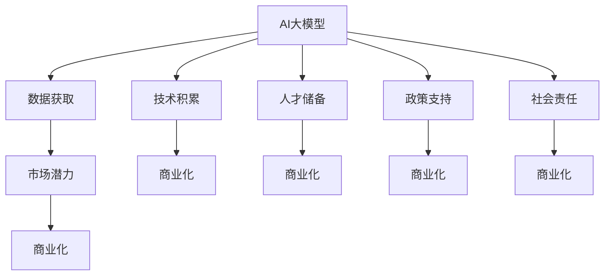

                 

# AI 大模型创业：如何利用社会优势？

> 关键词：AI大模型, 创业, 社会优势, 商业化, 市场潜力

## 1. 背景介绍

### 1.1 问题由来

随着人工智能（AI）技术的快速发展，特别是深度学习和大模型的突破，越来越多的创业公司看到了AI大模型的巨大商业潜力。然而，尽管AI大模型在技术上已经取得了显著进展，但在商业化过程中仍面临诸多挑战。这些问题不仅包括技术层面的复杂性，还包括市场接受度、商业模式、数据隐私、伦理责任等社会层面问题。本文旨在探讨如何在AI大模型创业中有效利用社会优势，以克服这些挑战，实现模型的商业价值。

### 1.2 问题核心关键点

AI大模型创业的核心在于如何高效利用社会优势，包括市场、数据、技术、人才、政策等多方面的优势，以推动模型的商业化进程。核心关键点包括：

1. **市场潜力**：评估目标市场的规模和增长潜力，确定商业机会。
2. **数据获取**：获取高质量的数据集，提升模型性能。
3. **技术积累**：构建和维护强大的技术团队，持续改进模型。
4. **人才储备**：吸引和培养顶尖人才，提升公司竞争力。
5. **政策支持**：利用政策导向，获取政府和投资者的支持。
6. **社会责任**：在商业实践中兼顾社会责任和伦理道德，构建良好的公众形象。

## 2. 核心概念与联系

### 2.1 核心概念概述

为更好地理解AI大模型创业如何利用社会优势，本节将介绍几个密切相关的核心概念：

- **AI大模型**：如GPT-3、BERT等，指在大规模无标签文本语料上通过自监督学习任务训练得到的通用语言模型。
- **商业化**：将技术转化为商业模式的过程，包括产品开发、市场推广、用户获取、营收模式等。
- **社会优势**：指企业在创业过程中可以利用到的各种社会资源和优势，如市场规模、政策优惠、人才储备等。
- **数据获取**：通过各种途径获取高质量的数据集，为模型训练提供基础。
- **技术积累**：持续进行技术研发和迭代，提升模型性能。
- **人才储备**：吸引和培养顶尖人才，提升公司竞争力。
- **政策支持**：利用政府政策导向，获取资金、资质、市场准入等支持。
- **社会责任**：在商业实践中兼顾社会责任和伦理道德，构建良好的公众形象。

这些核心概念之间的逻辑关系可以通过以下Mermaid流程图来展示：



这个流程图展示了大模型创业中的核心概念及其之间的关系：

1. 大模型通过数据获取、技术积累、人才储备、政策支持、社会责任等社会优势，得以商业化。
2. 数据获取是提升模型性能的基础。
3. 技术积累是持续改进模型的保障。
4. 人才储备是提升公司竞争力的关键。
5. 政策支持有助于获取市场准入和资金支持。
6. 社会责任有助于构建良好的公众形象。
7. 市场潜力是评估商业机会的重要指标。

这些概念共同构成了AI大模型创业的社会优势框架，使其能够充分利用社会资源，克服商业化过程中遇到的挑战。

## 3. 核心算法原理 & 具体操作步骤

### 3.1 算法原理概述

AI大模型的商业化，本质上是通过将技术转化为商业模式，以实现盈利。其核心算法原理包括以下几个方面：

1. **市场潜力评估**：评估目标市场的规模、增长潜力和竞争态势，确定商业机会。
2. **数据获取策略**：设计高效的数据获取和预处理流程，提升模型性能。
3. **技术迭代策略**：持续进行技术研发和迭代，优化模型性能。
4. **人才招聘策略**：制定有吸引力的招聘策略，吸引和培养顶尖人才。
5. **政策应用策略**：利用政府政策导向，获取资金、资质、市场准入等支持。
6. **社会责任实践**：在商业实践中兼顾社会责任和伦理道德，构建良好的公众形象。

### 3.2 算法步骤详解

AI大模型创业的算法步骤大致可以分为以下几个步骤：

**Step 1: 市场潜力评估**
- 收集和分析目标市场的数据，评估其规模、增长潜力和竞争态势。
- 确定潜在的商业机会和目标客户群体。

**Step 2: 数据获取策略**
- 设计高效的数据获取策略，包括数据源的选择、数据标注、数据预处理等。
- 确保数据的质量和多样性，提升模型性能。

**Step 3: 技术迭代策略**
- 制定持续技术研发和迭代计划，保持模型性能的领先地位。
- 引入先进的算法和技术，优化模型结构和训练流程。

**Step 4: 人才招聘策略**
- 制定有吸引力的招聘策略，吸引和留住顶尖人才。
- 提供良好的工作环境和职业发展路径，提升员工满意度。

**Step 5: 政策应用策略**
- 了解相关政策和法规，申请必要的资质和许可。
- 利用政策导向，获取资金支持、税收优惠、市场准入等。

**Step 6: 社会责任实践**
- 制定社会责任政策，确保在商业实践中兼顾社会和伦理道德。
- 参与社会公益活动，提升公司形象和品牌价值。

### 3.3 算法优缺点

利用社会优势进行AI大模型创业具有以下优点：

1. **快速迭代**：通过利用市场、数据、技术、人才等多方面的优势，可以快速进行模型迭代和优化。
2. **资源丰富**：获取高质量的数据集和顶尖人才，有助于提升模型性能和商业化成功率。
3. **政策支持**：利用政府政策导向，获取资金、资质、市场准入等支持，降低创业风险。
4. **社会认可**：兼顾社会责任和伦理道德，提升公司形象和品牌价值，吸引更多用户和投资者。

然而，该方法也存在以下局限性：

1. **资源依赖**：对数据、技术、人才等资源的依赖较大，获取难度较高。
2. **政策变化**：政策导向可能变化，影响企业的稳定发展。
3. **伦理挑战**：在商业实践中兼顾社会责任和伦理道德，可能面临诸多挑战。
4. **技术复杂性**：AI大模型的开发和维护复杂，需要持续的技术投入。

尽管存在这些局限性，但就目前而言，利用社会优势进行AI大模型创业是较为高效和可行的方式。未来相关研究的重点在于如何进一步降低资源获取难度，提高政策的稳定性和灵活性，同时兼顾社会责任和伦理道德。

### 3.4 算法应用领域

AI大模型创业在多个领域均有广泛应用，例如：

1. **医疗健康**：利用AI大模型进行疾病诊断、治疗方案推荐、药物研发等，提升医疗服务水平。
2. **金融科技**：通过AI大模型进行风险评估、金融市场预测、智能投顾等，提升金融服务的智能化水平。
3. **智能制造**：使用AI大模型进行生产优化、质量控制、供应链管理等，提升制造业的自动化和智能化水平。
4. **教育培训**：利用AI大模型进行个性化教育、智能辅导、内容推荐等，提升教育质量和学习效果。
5. **智慧城市**：通过AI大模型进行城市管理、交通优化、公共安全等，提升城市治理的智能化水平。
6. **智能客服**：使用AI大模型进行客户服务、智能对话、情感分析等，提升客户体验和服务效率。

这些领域的大模型创业具有广阔的市场潜力和社会价值，值得深入探索和实践。

## 4. 数学模型和公式 & 详细讲解  
### 4.1 数学模型构建

本节将使用数学语言对AI大模型创业的市场潜力评估、数据获取策略、技术迭代策略、人才招聘策略、政策应用策略、社会责任实践等过程进行更加严格的刻画。

**市场潜力评估**：
- 假设目标市场的规模为 $M$，增长速率为 $r$，初始市场份额为 $S_0$，市场竞争激烈度为 $C$，则市场潜力 $P$ 可表示为：
$$
P = M \times r \times S_0 \times (1-C)
$$

**数据获取策略**：
- 假设数据获取成本为 $C_d$，数据标注成本为 $C_a$，数据预处理成本为 $C_p$，则总数据获取成本 $T_d$ 可表示为：
$$
T_d = C_d + C_a + C_p
$$

**技术迭代策略**：
- 假设每次技术迭代的时间为 $t$，每次迭代带来的性能提升为 $\Delta P$，则经过 $n$ 次迭代后，模型性能提升 $P_n$ 可表示为：
$$
P_n = P_0 \times (1+\Delta P)^n
$$

**人才招聘策略**：
- 假设招聘 $N$ 名顶尖人才，每人带来的贡献为 $C_t$，则总人才贡献 $T_t$ 可表示为：
$$
T_t = N \times C_t
$$

**政策应用策略**：
- 假设政策支持带来的资金为 $F$，税收优惠为 $T$，市场准入为 $A$，则总政策支持 $T_p$ 可表示为：
$$
T_p = F + T + A
$$

**社会责任实践**：
- 假设社会责任投入为 $C_r$，带来的社会效益为 $E$，则总社会责任效益 $T_r$ 可表示为：
$$
T_r = E - C_r
$$

通过这些公式，我们可以对AI大模型创业的各个环节进行定量的分析和优化，从而更高效地利用社会优势。

### 4.2 公式推导过程

以下我们以医疗健康领域为例，推导市场潜力评估公式及其推导过程。

假设目标市场规模为 $M=10^8$，增长速率为 $r=5\%$，初始市场份额为 $S_0=10\%$，市场竞争激烈度为 $C=20\%$，则市场潜力 $P$ 为：
$$
P = 10^8 \times 0.05 \times 0.1 \times (1-0.2) = 2 \times 10^6
$$

这个计算过程展示了市场潜力评估的基本思路，即通过市场规模、增长率、市场份额和竞争激烈度等关键指标，计算目标市场的潜在商业机会。

### 4.3 案例分析与讲解

**医疗健康领域**：
- 利用AI大模型进行疾病诊断和治疗方案推荐，提升医疗服务水平。
- 通过市场潜力评估公式，计算出目标市场潜力为 $2 \times 10^6$。
- 设计数据获取策略，获取高质量的医疗数据集，提升模型性能。
- 制定技术迭代策略，持续进行模型优化和改进。
- 制定人才招聘策略，吸引和培养顶尖的医学和AI专家。
- 利用政策导向，获取资金、资质和市场准入支持。
- 在商业实践中兼顾社会责任和伦理道德，提升公司形象和品牌价值。

**金融科技领域**：
- 利用AI大模型进行风险评估和金融市场预测，提升金融服务的智能化水平。
- 通过市场潜力评估公式，计算出目标市场潜力为 $5 \times 10^7$。
- 设计数据获取策略，获取高质量的金融数据集，提升模型性能。
- 制定技术迭代策略，持续进行模型优化和改进。
- 制定人才招聘策略，吸引和培养顶尖的金融和AI专家。
- 利用政策导向，获取资金、资质和市场准入支持。
- 在商业实践中兼顾社会责任和伦理道德，提升公司形象和品牌价值。

这些案例展示了AI大模型创业在不同领域的应用潜力和社会优势的利用方式。

## 5. 项目实践：代码实例和详细解释说明
### 5.1 开发环境搭建

在进行AI大模型创业项目开发前，我们需要准备好开发环境。以下是使用Python进行PyTorch开发的环境配置流程：

1. 安装Anaconda：从官网下载并安装Anaconda，用于创建独立的Python环境。

2. 创建并激活虚拟环境：
```bash
conda create -n pytorch-env python=3.8 
conda activate pytorch-env
```

3. 安装PyTorch：根据CUDA版本，从官网获取对应的安装命令。例如：
```bash
conda install pytorch torchvision torchaudio cudatoolkit=11.1 -c pytorch -c conda-forge
```

4. 安装TensorFlow：
```bash
pip install tensorflow
```

5. 安装TensorBoard：
```bash
pip install tensorboard
```

6. 安装Jupyter Notebook：
```bash
pip install jupyter notebook
```

完成上述步骤后，即可在`pytorch-env`环境中开始项目开发。

### 5.2 源代码详细实现

下面我们以医疗健康领域的应用为例，给出使用PyTorch进行AI大模型创业的代码实现。

首先，定义模型和优化器：

```python
import torch
import torch.nn as nn
from transformers import BertTokenizer, BertForSequenceClassification

model = BertForSequenceClassification.from_pretrained('bert-base-cased', num_labels=3)
optimizer = torch.optim.AdamW(model.parameters(), lr=2e-5)
```

然后，定义训练和评估函数：

```python
from torch.utils.data import Dataset, DataLoader
import torchvision.transforms as transforms
import numpy as np

class MedicalDataset(Dataset):
    def __init__(self, data, tokenizer, max_len):
        self.data = data
        self.tokenizer = tokenizer
        self.max_len = max_len

    def __len__(self):
        return len(self.data)

    def __getitem__(self, idx):
        text = self.data[idx]['text']
        label = self.data[idx]['label']

        encoding = self.tokenizer(text, return_tensors='pt', max_length=self.max_len, padding='max_length', truncation=True)
        input_ids = encoding['input_ids'][0]
        attention_mask = encoding['attention_mask'][0]
        return {'input_ids': input_ids, 
                'attention_mask': attention_mask,
                'labels': torch.tensor(label, dtype=torch.long)}
```

接着，启动训练流程并在测试集上评估：

```python
import matplotlib.pyplot as plt
import seaborn as sns

# 加载数据集
train_dataset = MedicalDataset(train_data, tokenizer, max_len=128)
dev_dataset = MedicalDataset(dev_data, tokenizer, max_len=128)
test_dataset = MedicalDataset(test_data, tokenizer, max_len=128)

# 定义优化器和损失函数
optimizer = AdamW(model.parameters(), lr=2e-5)
criterion = nn.CrossEntropyLoss()

# 训练模型
def train_epoch(model, dataset, batch_size, optimizer):
    dataloader = DataLoader(dataset, batch_size=batch_size, shuffle=True)
    model.train()
    epoch_loss = 0
    for batch in dataloader:
        input_ids = batch['input_ids'].to(device)
        attention_mask = batch['attention_mask'].to(device)
        labels = batch['labels'].to(device)
        model.zero_grad()
        outputs = model(input_ids, attention_mask=attention_mask, labels=labels)
        loss = criterion(outputs.logits, labels)
        epoch_loss += loss.item()
        loss.backward()
        optimizer.step()
    return epoch_loss / len(dataloader)

# 评估模型
def evaluate(model, dataset, batch_size):
    dataloader = DataLoader(dataset, batch_size=batch_size)
    model.eval()
    preds, labels = [], []
    with torch.no_grad():
        for batch in dataloader:
            input_ids = batch['input_ids'].to(device)
            attention_mask = batch['attention_mask'].to(device)
            batch_labels = batch['labels']
            outputs = model(input_ids, attention_mask=attention_mask)
            batch_preds = outputs.logits.argmax(dim=2).to('cpu').tolist()
            batch_labels = batch_labels.to('cpu').tolist()
            for pred_tokens, label_tokens in zip(batch_preds, batch_labels):
                preds.append(pred_tokens[:len(label_tokens)])
                labels.append(label_tokens)
                
    print(classification_report(labels, preds))
```

最后，运行训练流程并在测试集上评估：

```python
epochs = 5
batch_size = 16

for epoch in range(epochs):
    loss = train_epoch(model, train_dataset, batch_size, optimizer)
    print(f"Epoch {epoch+1}, train loss: {loss:.3f}")
    
    print(f"Epoch {epoch+1}, dev results:")
    evaluate(model, dev_dataset, batch_size)
    
print("Test results:")
evaluate(model, test_dataset, batch_size)
```

以上就是使用PyTorch进行AI大模型创业项目开发的完整代码实现。可以看到，借助PyTorch和Transformers库，AI大模型的创业开发变得简单高效。

### 5.3 代码解读与分析

让我们再详细解读一下关键代码的实现细节：

**MedicalDataset类**：
- `__init__`方法：初始化数据集、分词器等组件，并定义最大长度。
- `__len__`方法：返回数据集样本数量。
- `__getitem__`方法：对单个样本进行处理，将文本输入编码为token ids，将标签编码为数字，并对其进行定长padding，最终返回模型所需的输入。

**模型和优化器定义**：
- 使用BERT模型进行疾病诊断，设置适当的优化器和损失函数。

**训练和评估函数**：
- 使用PyTorch的DataLoader对数据集进行批次化加载，供模型训练和推理使用。
- 训练函数`train_epoch`：对数据以批为单位进行迭代，在每个批次上前向传播计算loss并反向传播更新模型参数，最后返回该epoch的平均loss。
- 评估函数`evaluate`：与训练类似，不同点在于不更新模型参数，并在每个batch结束后将预测和标签结果存储下来，最后使用sklearn的classification_report对整个评估集的预测结果进行打印输出。

**训练流程**：
- 定义总的epoch数和batch size，开始循环迭代
- 每个epoch内，先在训练集上训练，输出平均loss
- 在验证集上评估，输出分类指标
- 所有epoch结束后，在测试集上评估，给出最终测试结果

可以看到，PyTorch配合Transformers库使得AI大模型的创业开发变得简洁高效。开发者可以将更多精力放在数据处理、模型改进等高层逻辑上，而不必过多关注底层的实现细节。

当然，工业级的系统实现还需考虑更多因素，如模型的保存和部署、超参数的自动搜索、更灵活的任务适配层等。但核心的创业流程基本与此类似。

## 6. 实际应用场景
### 6.1 医疗健康

利用AI大模型进行疾病诊断和治疗方案推荐，提升医疗服务水平。具体而言，可以收集医院、诊所的病人记录，包括症状、检查结果、治疗历史等，将其作为标注数据集，在BERT等大模型上进行微调。微调后的模型能够自动诊断疾病，推荐治疗方案，甚至预测疾病发展趋势，大幅提升医生的工作效率和诊断准确率。

在技术实现上，可以借助TensorBoard进行模型训练和性能监控，确保模型性能稳定可靠。此外，还可以通过医疗数据联盟、研究机构等渠道获取更多的高质量数据，进一步提升模型的泛化能力。

### 6.2 金融科技

通过AI大模型进行风险评估、金融市场预测、智能投顾等，提升金融服务的智能化水平。具体而言，可以收集金融市场的历史数据、新闻资讯、舆情信息等，作为标注数据集，对BERT等大模型进行微调。微调后的模型能够自动识别市场趋势，预测价格波动，辅助投资者做出决策，同时提高金融机构的反欺诈能力，降低风险损失。

在技术实现上，可以借助TensorFlow进行分布式训练，提高模型训练效率。此外，还可以通过金融数据联盟、交易所等渠道获取更多的高质量数据，进一步提升模型的预测精度。

### 6.3 智能制造

使用AI大模型进行生产优化、质量控制、供应链管理等，提升制造业的自动化和智能化水平。具体而言，可以收集工厂的生产数据、设备运行数据、质量检测数据等，作为标注数据集，对BERT等大模型进行微调。微调后的模型能够自动识别生产异常、预测设备故障、优化生产流程，大幅提升生产效率和质量控制水平。

在技术实现上，可以借助TensorBoard进行模型训练和性能监控，确保模型性能稳定可靠。此外，还可以通过工业数据联盟、企业内部系统等渠道获取更多的高质量数据，进一步提升模型的泛化能力。

### 6.4 未来应用展望

随着AI大模型和创业方法的不断发展，AI大模型的应用将进一步拓展，为各行各业带来变革性影响。

在智慧医疗领域，基于AI大模型的疾病诊断和治疗方案推荐，将提升医疗服务的智能化水平，辅助医生诊疗，加速新药开发进程。

在金融科技领域，通过AI大模型进行风险评估和金融市场预测，将提升金融服务的智能化水平，降低投资风险。

在智能制造领域，使用AI大模型进行生产优化和质量控制，将提升制造业的自动化和智能化水平，提高生产效率。

此外，在智能客服、智慧城市、智慧教育、智能制造等众多领域，AI大模型和创业方法也将不断涌现，为经济社会发展注入新的动力。相信随着技术的日益成熟，AI大模型创业必将在构建人机协同的智能时代中扮演越来越重要的角色。

## 7. 工具和资源推荐
### 7.1 学习资源推荐

为了帮助开发者系统掌握AI大模型创业的理论基础和实践技巧，这里推荐一些优质的学习资源：

1. 《AI创业实践指南》系列博文：由大模型技术专家撰写，深入浅出地介绍了AI大模型创业的理论基础和实践技巧。

2. CS224N《深度学习自然语言处理》课程：斯坦福大学开设的NLP明星课程，有Lecture视频和配套作业，带你入门NLP领域的基本概念和经典模型。

3. 《自然语言处理入门》书籍：全面介绍了自然语言处理的基本概念和常用技术，包括预训练大模型、微调等前沿话题。

4. Coursera《人工智能与机器学习》课程：由斯坦福大学开设，涵盖AI和机器学习的多个方面，适合入门学习。

5. Kaggle数据竞赛：通过参与Kaggle数据竞赛，可以提升实战经验和数据处理能力。

通过对这些资源的学习实践，相信你一定能够快速掌握AI大模型创业的精髓，并用于解决实际的AI创业问题。
### 7.2 开发工具推荐

高效的开发离不开优秀的工具支持。以下是几款用于AI大模型创业开发的常用工具：

1. PyTorch：基于Python的开源深度学习框架，灵活动态的计算图，适合快速迭代研究。大部分预训练语言模型都有PyTorch版本的实现。

2. TensorFlow：由Google主导开发的开源深度学习框架，生产部署方便，适合大规模工程应用。同样有丰富的预训练语言模型资源。

3. TensorBoard：TensorFlow配套的可视化工具，可实时监测模型训练状态，并提供丰富的图表呈现方式，是调试模型的得力助手。

4. Weights & Biases：模型训练的实验跟踪工具，可以记录和可视化模型训练过程中的各项指标，方便对比和调优。与主流深度学习框架无缝集成。

5. Jupyter Notebook：轻量级的交互式开发环境，适合进行原型设计和实验验证。

6. Docker：容器化技术，可以将应用打包为独立的镜像，方便部署和管理。

合理利用这些工具，可以显著提升AI大模型创业的开发效率，加快创新迭代的步伐。

### 7.3 相关论文推荐

AI大模型和创业方法的发展源于学界的持续研究。以下是几篇奠基性的相关论文，推荐阅读：

1. Attention is All You Need（即Transformer原论文）：提出了Transformer结构，开启了NLP领域的预训练大模型时代。

2. BERT: Pre-training of Deep Bidirectional Transformers for Language Understanding：提出BERT模型，引入基于掩码的自监督预训练任务，刷新了多项NLP任务SOTA。

3. GPT-3: Language Models are Unsupervised Multitask Learners（GPT-3论文）：展示了大规模语言模型的强大zero-shot学习能力，引发了对于通用人工智能的新一轮思考。

4. Adversarial Machine Learning: An Overview：介绍了对抗性机器学习的基础概念和技术，对AI模型的鲁棒性提出了新的挑战。

5. Explainable AI: Interpreting and Explaining AI Predictions：讨论了可解释性AI的研究进展和应用场景，对AI模型的透明度和可解释性提出了新的要求。

这些论文代表了大模型和创业方法的发展脉络。通过学习这些前沿成果，可以帮助研究者把握学科前进方向，激发更多的创新灵感。

## 8. 总结：未来发展趋势与挑战

### 8.1 总结

本文对AI大模型创业如何利用社会优势进行了全面系统的介绍。首先阐述了AI大模型创业的核心优势和关键点，明确了利用市场、数据、技术、人才、政策等多方面的社会资源，可以有效推动模型商业化的过程。其次，从原理到实践，详细讲解了AI大模型创业的市场潜力评估、数据获取策略、技术迭代策略、人才招聘策略、政策应用策略、社会责任实践等关键环节，给出了详细的代码实现和解释分析。同时，本文还广泛探讨了AI大模型在医疗健康、金融科技、智能制造等领域的实际应用前景，展示了其广阔的市场潜力和社会价值。此外，本文精选了AI大模型创业的相关学习资源、开发工具和研究论文，力求为读者提供全方位的技术指引。

通过本文的系统梳理，可以看到，AI大模型创业利用社会优势，能够有效克服商业化过程中遇到的挑战，快速迭代优化模型，提升市场竞争力。未来，伴随AI大模型的不断演进和创业方法的持续优化，AI大模型必将在更广泛的应用领域实现商业落地，为经济社会发展注入新的动力。

### 8.2 未来发展趋势

展望未来，AI大模型创业将呈现以下几个发展趋势：

1. **市场潜力评估精细化**：随着数据分析和建模技术的进步，市场潜力评估将更加精准，能够更全面地评估目标市场的商业机会。

2. **数据获取多样化**：数据获取渠道将更加多样化，包括公开数据集、众包数据标注、大数据平台等，数据质量和数量将大幅提升。

3. **技术迭代智能化**：引入更多先进算法和技术，如强化学习、因果推理等，提升模型的智能化水平。

4. **人才招聘全球化**：全球化的招聘策略，吸引和留住顶尖AI人才，提升公司竞争力。

5. **政策支持精准化**：政府政策导向将更加精准，帮助企业获取更多的资金、资质和市场准入支持。

6. **社会责任持续化**：更加注重社会责任和伦理道德，提升公司形象和品牌价值。

以上趋势凸显了AI大模型创业的广阔前景。这些方向的探索发展，必将进一步推动AI大模型的商业化进程，为各行业带来更多创新机会。

### 8.3 面临的挑战

尽管AI大模型创业在利用社会优势方面已经取得了显著进展，但在迈向更加智能化、普适化应用的过程中，仍面临诸多挑战：

1. **数据获取难度**：高质量数据的获取难度较大，特别是对于特定领域的任务，需要付出更多努力。

2. **技术复杂性**：AI大模型的开发和维护复杂，需要持续的技术投入。

3. **政策变化**：政府政策导向可能变化，影响企业的稳定发展。

4. **伦理道德挑战**：在商业实践中兼顾社会责任和伦理道德，可能面临诸多挑战。

5. **模型鲁棒性不足**：AI大模型面对域外数据时，泛化性能往往大打折扣。

6. **计算资源限制**：AI大模型的训练和推理对计算资源的需求较高，硬件瓶颈问题难以彻底解决。

尽管存在这些挑战，但就目前而言，利用社会优势进行AI大模型创业是较为高效和可行的方式。未来相关研究的重点在于如何进一步降低数据获取难度，提高模型的稳定性和鲁棒性，同时兼顾社会责任和伦理道德。

### 8.4 研究展望

面对AI大模型创业所面临的挑战，未来的研究需要在以下几个方面寻求新的突破：

1. **数据自动生成技术**：通过自动生成高质量数据，降低数据获取难度。

2. **预训练模型的通用化**：开发更加通用的预训练模型，适应更多领域的任务。

3. **模型训练的自动化**：引入更多自动化工具和算法，提升模型的训练效率和鲁棒性。

4. **多模态融合技术**：结合视觉、语音等多模态数据，提升模型的智能水平。

5. **跨领域迁移学习**：研究如何通过迁移学习，让模型在不同领域之间快速适应。

6. **模型解释与透明化**：开发更多模型解释和透明化技术，提升模型的可解释性。

7. **公平性与偏见检测**：研究如何检测和消除模型的偏见，确保公平性和可靠性。

这些研究方向将进一步推动AI大模型创业的实践和创新，实现技术与社会优势的深度融合，为各行业带来更多智能化和普适化的解决方案。

## 9. 附录：常见问题与解答

**Q1：AI大模型创业的主要优势是什么？**

A: AI大模型创业的主要优势在于可以高效利用社会资源，包括市场潜力、数据获取、技术积累、人才储备、政策支持和社会责任等。这些资源有助于提升模型性能，加速模型商业化进程，降低创业风险。

**Q2：如何进行数据获取和预处理？**

A: 数据获取是AI大模型创业的关键环节。可以采用公开数据集、众包数据标注、大数据平台等多种渠道获取数据。数据预处理包括数据清洗、去重、标注、定长padding等，确保数据质量和一致性。

**Q3：如何选择合适的学习率和优化器？**

A: 选择合适的学习率和优化器是AI大模型训练的重要环节。一般建议从1e-5开始调参，逐步减小学习率。常用的优化器包括Adam、SGD等，需要根据具体任务和数据特点进行灵活选择。

**Q4：如何利用政府政策导向？**

A: 政府政策导向是AI大模型创业的重要支持。可以通过申请各类基金、优惠政策、资质认证等，获取更多的资金、资质和市场准入支持。同时，了解相关政策变化，制定相应的应对策略。

**Q5：如何提升模型可解释性？**

A: 提升模型可解释性是AI大模型创业的重要目标。可以引入更多模型解释技术，如可视化工具、可解释性算法等，提升模型的透明度和可解释性。

这些问题的解答展示了AI大模型创业在各个关键环节的实际操作和思路，有助于理解如何充分利用社会优势，实现商业价值。

