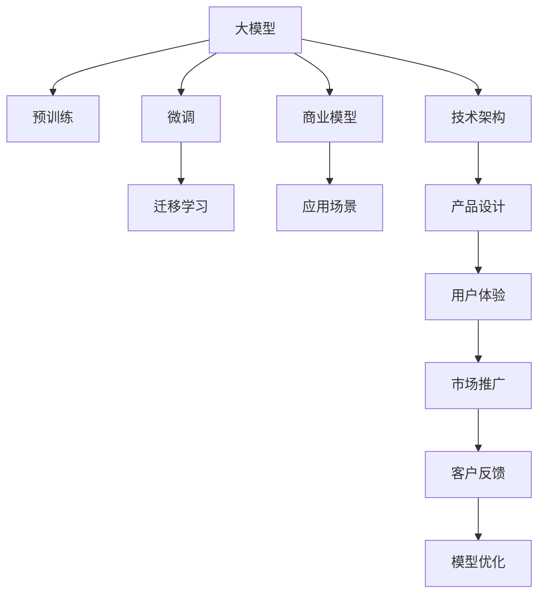

                 

# AI 大模型创业：如何利用科技优势？

> 关键词：AI创业、大模型、科技优势、技术架构、创业策略、商业模型、应用场景、市场趋势

## 1. 背景介绍

### 1.1 问题由来
随着人工智能技术的飞速发展，大模型成为了AI创业的核心理念。大模型，如GPT-3、BERT等，具备惊人的语言处理能力，能够理解和生成人类语言，为各种应用场景提供了强大的支撑。然而，尽管大模型技术已经取得巨大成功，将其实际落地和转化为商业价值的过程仍充满挑战。

### 1.2 问题核心关键点
大模型创业的核心在于如何利用AI技术的优势，构建可行的商业模式，实现从技术到产品的转化。这需要深度理解大模型的技术原理和实际应用场景，探索合适的商业模式，以及实现高效的商业变现。本文将从大模型的技术原理、应用场景和商业策略三个方面入手，探讨如何利用科技优势进行创业。

## 2. 核心概念与联系

### 2.1 核心概念概述

- **大模型(Large Model)**：指基于Transformer架构，使用大规模无标签数据预训练得到的通用语言模型，如GPT-3、BERT等。大模型通过自监督学习任务获得广泛的语言知识和常识。

- **预训练(Pre-training)**：指在无标签数据上通过自监督任务训练大模型的过程，使其具备通用语言处理能力。预训练是构建大模型的基础步骤。

- **微调(Fine-tuning)**：指在大模型的基础上，使用下游任务的少量标注数据进行有监督训练，以优化模型在该任务上的性能。微调是大模型应用的核心环节。

- **迁移学习(Transfer Learning)**：指利用预训练模型的知识，在小规模数据上实现快速训练和高性能表现。大模型创业的许多应用场景都属于迁移学习范式。

- **商业模型(Business Model)**：指企业通过产品或服务获取收入的方式，包括订阅、按需付费、广告等。商业模型是大模型创业成功的关键。

- **应用场景(Application Scenario)**：指大模型技术能够被实际应用的具体领域，如自然语言处理、医疗、金融等。

### 2.2 核心概念原理和架构的 Mermaid 流程图



这个流程图展示了大模型创业的各个关键环节和它们之间的联系：

1. 大模型通过预训练获得通用语言能力。
2. 通过微调适配特定任务，提升模型性能。
3. 利用迁移学习加速新任务的学习。
4. 构建商业模型，实现收入。
5. 在特定应用场景中实现产品化和市场推广。
6. 通过技术架构和产品设计提升用户体验。
7. 收集客户反馈，不断优化模型和产品。

## 3. 核心算法原理 & 具体操作步骤

### 3.1 算法原理概述

大模型创业的核心是利用预训练模型的通用能力，结合特定任务的需求，进行微调，形成能够满足商业需求的产品。这一过程包括技术研发、产品设计、市场推广等多个环节。

### 3.2 算法步骤详解

**Step 1: 技术研发**
- 选择合适的大模型作为基础。目前最流行的是基于Transformer架构的BERT和GPT系列模型。
- 设计预训练任务。如自监督语言模型、掩码语言模型等。
- 在大规模无标签数据上训练预训练模型。

**Step 2: 微调适配**
- 收集下游任务的少量标注数据。
- 在预训练模型的基础上，添加任务适配层和损失函数。
- 使用优化器和小学习率进行微调训练。
- 在验证集上评估模型性能，进行参数调整。

**Step 3: 产品设计**
- 根据微调后的模型，设计具体的产品功能。
- 选择合适的技术架构，如分布式训练、推理加速等。
- 设计产品界面和用户体验。

**Step 4: 市场推广**
- 收集用户反馈，优化产品功能。
- 通过广告、免费试用、合作等方式推广产品。
- 根据用户需求，持续迭代优化模型。

### 3.3 算法优缺点

**优点：**
- 通用性强。大模型在各种任务上都能取得较好效果，适合快速进入多个应用场景。
- 技术门槛较低。利用开源预训练模型，可以显著降低技术开发成本。
- 适应性强。根据特定任务需求进行微调，灵活性高。

**缺点：**
- 对标注数据依赖高。微调效果受数据质量影响大。
- 模型规模大，硬件资源需求高。
- 微调过程复杂，需要持续优化。

### 3.4 算法应用领域

大模型技术在众多领域都有广泛应用，以下是几个典型应用场景：

- **自然语言处理(NLP)**：如文本分类、问答、摘要生成等。
- **医疗健康**：如病历分析、医学知识库构建等。
- **金融科技**：如情感分析、文本生成、风险评估等。
- **教育培训**：如个性化推荐、智能答疑、在线教育等。
- **法律咨询**：如合同审查、案情分析、法律文档生成等。

## 4. 数学模型和公式 & 详细讲解 & 举例说明

### 4.1 数学模型构建

假设有一个基于大模型的文本分类任务，使用微调进行模型训练。

设模型输入为文本序列 $x=(x_1,x_2,...,x_n)$，输出为标签序列 $y=(y_1,y_2,...,y_n)$。使用Softmax回归作为输出层，损失函数为交叉熵损失：

$$
\ell(y,\hat{y}) = -\sum_{i=1}^n y_i \log \hat{y}_i
$$

其中 $\hat{y}_i = \sigma(W^Ty_i+b)$，$\sigma$ 为sigmoid函数。模型参数包括权重矩阵 $W$ 和偏置向量 $b$。

### 4.2 公式推导过程

首先，定义模型的前向传播函数：

$$
h = \text{Transformer}_{\theta}(x)
$$

其中 $\text{Transformer}_{\theta}$ 表示预训练模型。

然后，定义模型的损失函数：

$$
\mathcal{L}(\theta) = -\frac{1}{N} \sum_{i=1}^N \ell(y_i,\hat{y}_i)
$$

其中 $\hat{y}_i = \text{Softmax}(W_{out}h_i + b_{out})$。

### 4.3 案例分析与讲解

以BERT模型为例，其文本分类微调过程如下：

1. 使用BERT模型作为预训练基础。
2. 在少量标注数据上，设计分类任务。
3. 添加线性分类层和交叉熵损失函数。
4. 使用Adam优化器，设置小学习率。
5. 在验证集上评估模型，调整超参数。
6. 最终在测试集上测试模型性能。

## 5. 项目实践：代码实例和详细解释说明

### 5.1 开发环境搭建

使用Python和PyTorch搭建开发环境：

```bash
conda create -n ai-env python=3.8
conda activate ai-env
pip install torch torchvision torchaudio transformers transformers
```

### 5.2 源代码详细实现

以下是一个使用BERT进行文本分类的Python代码示例：

```python
import torch
import torch.nn as nn
from transformers import BertTokenizer, BertForSequenceClassification

class BERTTextClassifier(nn.Module):
    def __init__(self, num_labels):
        super(BERTTextClassifier, self).__init__()
        self.num_labels = num_labels
        self.bert = BertForSequenceClassification.from_pretrained('bert-base-cased', num_labels=num_labels)
        self.dropout = nn.Dropout(0.1)
        self.fc = nn.Linear(self.bert.config.hidden_size, num_labels)
        
    def forward(self, input_ids, attention_mask, labels=None):
        outputs = self.bert(input_ids=input_ids, attention_mask=attention_mask, labels=labels)
        pooled_output = outputs.pooler_output
        pooled_output = self.dropout(pooled_output)
        logits = self.fc(pooled_output)
        return logits

# 准备数据集和标签
tokenizer = BertTokenizer.from_pretrained('bert-base-cased')
train_data, train_labels = ...
dev_data, dev_labels = ...
test_data, test_labels = ...

# 构建模型
model = BERTTextClassifier(num_labels=2)

# 定义损失函数和优化器
criterion = nn.CrossEntropyLoss()
optimizer = torch.optim.Adam(model.parameters(), lr=1e-5)

# 训练模型
for epoch in range(10):
    model.train()
    for input_ids, attention_mask, labels in train_data:
        optimizer.zero_grad()
        logits = model(input_ids, attention_mask, labels)
        loss = criterion(logits, labels)
        loss.backward()
        optimizer.step()

    # 在验证集上评估模型
    model.eval()
    with torch.no_grad():
        acc = 0
        for input_ids, attention_mask, labels in dev_data:
            logits = model(input_ids, attention_mask)
            preds = torch.argmax(logits, dim=1)
            acc += (preds == labels).sum().item() / len(labels)
    print(f"Epoch {epoch+1}, dev acc: {acc}")
```

### 5.3 代码解读与分析

- 首先定义了一个BERT文本分类模型，继承自PyTorch的`nn.Module`类。
- 使用`BertForSequenceClassification`从预训练的BERT模型中加载权重。
- 添加线性层和Dropout层，进行最后的分类。
- 在训练过程中，使用Adam优化器，设置小学习率。
- 在验证集上计算准确率，评估模型性能。

## 6. 实际应用场景

### 6.1 智能客服系统

基于大模型的智能客服系统，能够处理大量客户咨询，提升客户满意度，降低人工成本。具体实现如下：

1. 收集历史客服对话数据，标注问题类别和最佳答复。
2. 使用微调后的BERT模型进行对话生成。
3. 引入检索系统，实时搜索相关知识库，生成个性化答复。
4. 用户反馈优化模型和对话模板。

### 6.2 金融舆情监测

在金融领域，通过微调BERT模型进行舆情监测，可及时发现负面信息，规避风险。具体实现如下：

1. 收集金融新闻、报道和评论数据。
2. 使用微调模型自动标注情感倾向和主题。
3. 构建实时监测系统，实时评估舆情变化。
4. 自动触发预警，帮助决策者快速应对。

### 6.3 个性化推荐系统

利用微调BERT模型进行个性化推荐，可以提升推荐系统的准确性和用户满意度。具体实现如下：

1. 收集用户浏览、点击、评论等数据。
2. 使用微调模型预测用户兴趣点。
3. 构建推荐算法，根据用户行为和模型预测生成推荐列表。
4. 持续优化模型和算法，提高推荐效果。

## 7. 工具和资源推荐

### 7.1 学习资源推荐

1. **自然语言处理基石**：深度学习与自然语言处理基础，涵盖文本表示、词向量、RNN、Transformer等基础概念。
2. **Transformers官方文档**：提供全面详细的API文档和教程，适合快速上手。
3. **《深度学习》书籍**：由Ian Goodfellow等撰写，深度讲解深度学习原理和应用。
4. **《Python深度学习》书籍**：适合初学者的实战指南，涵盖TensorFlow、PyTorch等主流框架。
5. **Kaggle竞赛平台**：提供海量数据集和竞赛，帮助实践学习和模型优化。

### 7.2 开发工具推荐

1. **PyTorch**：灵活高效，适合研究和快速迭代。
2. **TensorFlow**：强大的计算图框架，支持大规模模型训练。
3. **Transformers库**：提供预训练模型和微调接口，降低开发门槛。
4. **TensorBoard**：实时监测模型训练状态，可视化图表展示。
5. **Weights & Biases**：模型训练记录和可视化工具，方便调优。

### 7.3 相关论文推荐

1. **BERT: Pre-training of Deep Bidirectional Transformers for Language Understanding**：BERT的预训练方法及其在NLP任务上的应用。
2. **GPT-3: Language Models are Unsupervised Multitask Learners**：GPT-3的预训练方法和零样本学习能力。
3. **Transformers: A State-of-the-Art Texture Recognition Approach**：Transformer在视觉任务上的应用。
4. **AdaLoRA: Adaptive Low-Rank Adaptation for Parameter-Efficient Fine-Tuning**：高效微调方法，减少参数更新。
5. **AdaPrompt: A Unified Framework for Automatic Prompt Engineering**：自动生成提示，提升零样本学习效果。

## 8. 总结：未来发展趋势与挑战

### 8.1 总结

本文系统介绍了大模型创业的原理、步骤和实际应用。通过技术研发、微调适配和产品设计等多个环节，利用大模型的技术优势，可以构建多样化的产品，实现商业变现。

### 8.2 未来发展趋势

1. **技术迭代加速**：随着硬件性能提升和算法优化，大模型将具备更强的通用性和性能。
2. **商业模型多元化**：从单一的订阅模式，向按需付费、广告等多种模式转变。
3. **应用场景多样化**：大模型技术将进入更多垂直领域，如医疗、法律、教育等。
4. **数据驱动优化**：利用用户反馈和数据，持续优化模型和产品。

### 8.3 面临的挑战

1. **技术开发难度高**：大模型技术复杂，开发周期长。
2. **数据获取难度大**：标注数据成本高，难以获取高质量数据。
3. **商业变现难度大**：用户需求多样，如何实现高效变现。

### 8.4 研究展望

1. **优化模型架构**：设计更加高效、轻量级的模型架构，提高性能和计算效率。
2. **引入更多先验知识**：利用外部知识库，提升模型推理能力。
3. **增强可解释性**：通过因果分析和博弈论等方法，增强模型的可解释性。
4. **优化用户体验**：通过技术架构和产品设计，提升用户体验。

## 9. 附录：常见问题与解答

**Q1: 大模型创业是否需要大量的标注数据？**

A: 需要，但可以通过数据增强和迁移学习等方式，减少标注数据的需求。

**Q2: 大模型的推理速度是否足够快？**

A: 取决于硬件和模型架构，需要进行优化才能满足实际应用需求。

**Q3: 如何评估大模型的性能？**

A: 通常使用准确率、召回率、F1值等指标进行评估。

**Q4: 大模型创业的难点有哪些？**

A: 技术开发难度高，数据获取难度大，商业变现难度大。

**Q5: 大模型的商业应用前景如何？**

A: 非常广阔，覆盖自然语言处理、医疗、金融等多个领域。

---

作者：禅与计算机程序设计艺术 / Zen and the Art of Computer Programming

