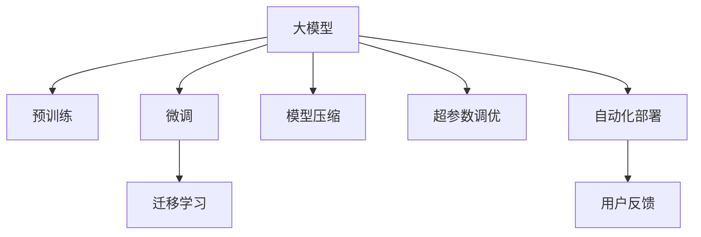

                 

# AI 大模型创业：如何利用竞争优势？

在人工智能(AI)迅猛发展的当下，大模型(AI Large Models)因其强大的计算能力和广泛的应用前景，成为创业者和投资者的热切关注焦点。如何在大模型创业中脱颖而出，把握竞争优势，成为各大公司、研究团队和独立开发者关注的重中之重。本文从背景介绍、核心概念与联系、核心算法原理、项目实践、实际应用场景等多个角度，深入探讨大模型创业的策略和技巧，希望能为读者提供宝贵的思路和启示。

## 1. 背景介绍

### 1.1 问题由来
随着深度学习技术的不断进步，大模型成为AI领域的一个重要趋势。这些模型通常拥有数十亿甚至百亿级别的参数，具有强大的计算能力和泛化能力，能够在图像识别、自然语言处理、语音识别等多个领域取得优异的性能。大模型的典型代表包括GPT、BERT、ResNet等。

然而，尽管大模型具备强大的能力，其开发和维护的成本相对较高。创业团队如何在有限的资源下，充分利用大模型的优势，构建有竞争力的产品和服务，是创业过程中必须面对的挑战。本文将从多个方面深入分析大模型创业的策略和技巧。

### 1.2 问题核心关键点
大模型创业的核心在于如何合理利用模型优势，同时降低开发成本。具体而言，包括以下几个关键点：
1. **数据获取与处理**：如何高效获取高质量数据，是大模型创业中最重要的环节之一。数据集的质量直接影响模型的训练效果。
2. **模型选择与训练**：选择适合业务需求的大模型，并对其进行优化训练，是提升模型性能的关键步骤。
3. **应用场景设计**：根据实际需求，设计合适的应用场景，合理运用大模型的能力，实现业务目标。
4. **技术团队建设**：组建具有专业技能的技术团队，保证模型开发和应用实施的高效和稳定。
5. **市场推广与用户教育**：如何有效推广产品，提升用户对大模型的认知和使用体验，是大模型创业成功的关键因素。

这些关键点不仅影响着大模型创业的成功与否，还决定了创业公司在激烈市场竞争中的生存和发展能力。

## 2. 核心概念与联系

### 2.1 核心概念概述

为了更好地理解大模型创业的核心概念，本文将介绍几个关键概念及其相互关系：

- **大模型(AI Large Models)**：指具有数十亿甚至百亿级别参数的深度学习模型，如GPT、BERT、ResNet等。
- **预训练(Pre-training)**：在大规模无标签数据上训练模型，学习通用特征表示的过程。
- **微调(Fine-tuning)**：在大规模预训练模型的基础上，针对特定任务进行有标签数据上的训练，优化模型性能。
- **迁移学习(Transfer Learning)**：通过在不同任务间共享预训练模型，提高模型泛化能力和性能。
- **模型压缩(Compression)**：通过剪枝、量化等方法，减少模型参数量，提升模型推理速度和资源效率。
- **超参数调优(Hyperparameter Tuning)**：通过调整模型训练的超参数，优化模型性能。
- **自动化部署(Auto-deployment)**：通过自动化工具，简化模型部署和应用过程。
- **用户反馈(User Feedback)**：通过用户反馈和数据分析，不断优化模型和应用体验。

这些概念之间具有紧密的联系，共同构成了大模型创业的基础框架。以下通过Mermaid流程图展示了这些概念之间的联系：



## 3. 核心算法原理 & 具体操作步骤
### 3.1 算法原理概述

大模型创业的核心在于如何高效利用大模型的优势，同时降低开发成本。主要依赖以下几个步骤：

1. **数据获取与处理**：收集与业务需求相关的数据集，并进行预处理，包括数据清洗、数据增强等。
2. **模型选择与训练**：选择合适的预训练模型，并对其进行微调或迁移学习，以适应具体业务需求。
3. **应用场景设计**：根据业务需求，设计合适的应用场景，将大模型应用于实际问题中。
4. **技术团队建设**：组建具有专业技能的技术团队，确保模型开发和应用的高效和稳定。
5. **市场推广与用户教育**：通过有效的市场推广和用户教育，提升用户对大模型的认知和使用体验。

### 3.2 算法步骤详解

以下是具体的大模型创业详细步骤：

**Step 1: 数据获取与处理**
- 确定业务需求，明确需要收集的数据类型和规模。
- 采用爬虫、API接口等手段获取数据。
- 对数据进行预处理，包括数据清洗、去重、标注等步骤。
- 使用数据增强技术，如数据扩充、随机噪声等，丰富训练数据。

**Step 2: 模型选择与训练**
- 根据业务需求选择合适的预训练模型，如GPT、BERT、ResNet等。
- 对预训练模型进行微调或迁移学习，以适应具体任务。
- 设计合适的损失函数和优化算法，优化模型参数。
- 调整超参数，如学习率、批大小等，以提升模型性能。

**Step 3: 应用场景设计**
- 分析业务需求，确定大模型的具体应用场景，如图像识别、自然语言处理等。
- 设计输入输出接口，确保模型与业务系统无缝对接。
- 设计用户界面，提升用户体验和满意度。

**Step 4: 技术团队建设**
- 招募具有深度学习、自然语言处理等专业技能的技术人员。
- 组建数据科学团队，负责数据处理和模型训练。
- 建立开发和运维团队，确保模型的高效运行和维护。

**Step 5: 市场推广与用户教育**
- 制定市场推广策略，通过社交媒体、技术博客等方式提升品牌知名度。
- 设计用户教育材料，如使用手册、在线教程等，帮助用户了解和掌握大模型的使用方法。
- 收集用户反馈，不断优化产品和服务，提升用户体验。

### 3.3 算法优缺点

大模型创业的优点包括：
1. **高效性能**：大模型在图像识别、自然语言处理等方面具备强大的性能优势，能够快速处理复杂任务。
2. **广泛应用**：大模型可以应用于多个领域，如医疗、金融、教育等，拓展业务范围。
3. **自动化部署**：通过自动化部署工具，简化模型部署和应用过程，提升开发效率。

但同时，大模型创业也面临一些挑战：
1. **高开发成本**：大模型开发和维护成本相对较高，需要投入大量的人力物力。
2. **数据获取困难**：高质量数据集的获取和处理相对困难，影响模型训练效果。
3. **模型泛化能力有限**：大模型在不同业务场景下的泛化能力有限，需要进行微调或迁移学习。
4. **用户教育成本高**：用户对大模型的认知和使用体验提升需要时间和成本。

## 4. 数学模型和公式 & 详细讲解  
### 4.1 数学模型构建

在大模型创业中，选择合适的数学模型和公式，对于模型性能的提升和应用场景的设计至关重要。以下是一些常用的数学模型和公式：

- **交叉熵损失函数**：用于分类任务，计算模型预测结果与实际标签之间的差异。
- **均方误差损失函数**：用于回归任务，计算模型预测结果与实际标签之间的差异。
- **数据增强技术**：通过随机旋转、缩放、翻转等技术，扩充训练数据集，提升模型泛化能力。
- **正则化技术**：通过L1、L2正则化等方法，防止模型过拟合。
- **迁移学习公式**：通过在预训练模型的基础上进行微调，优化模型在特定任务上的性能。

### 4.2 公式推导过程

以交叉熵损失函数为例，推导过程如下：

假设模型对样本 $x$ 的预测结果为 $p$，真实标签为 $y$。则交叉熵损失函数 $\ell$ 定义为：

$$
\ell(p,y) = -y\log p + (1-y)\log(1-p)
$$

将损失函数扩展到整个数据集上，得到经验风险：

$$
\mathcal{L} = \frac{1}{N}\sum_{i=1}^N \ell(p_i,y_i)
$$

其中 $p_i$ 和 $y_i$ 分别为样本 $i$ 的预测结果和真实标签。

在实际应用中，交叉熵损失函数常用于分类任务，通过最小化损失函数，优化模型预测结果，使其更接近真实标签。

### 4.3 案例分析与讲解

以自然语言处理(NLP)任务为例，分析如何利用大模型进行文本分类。

假设我们要对电影评论进行情感分类，即判断评论是正面还是负面。选取大规模无标签的电影评论作为预训练数据，对BERT模型进行预训练。然后，选取有标签的评论数据，对BERT模型进行微调，以适应情感分类任务。

具体步骤如下：
1. **数据准备**：收集有标签的电影评论数据集，划分为训练集、验证集和测试集。
2. **模型选择**：选择BERT作为预训练模型，并对其进行微调。
3. **模型训练**：在训练集上训练模型，调整学习率、批大小等超参数，优化模型性能。
4. **模型评估**：在验证集上评估模型性能，选择最优模型。
5. **模型应用**：在测试集上测试模型效果，部署模型。

通过上述步骤，我们能够在情感分类任务中，利用大模型实现高精度的文本分类。

## 5. 项目实践：代码实例和详细解释说明
### 5.1 开发环境搭建

为了高效开发和部署大模型，需要选择合适的开发环境。以下是一些常用的开发环境搭建方法：

1. **Python环境配置**：
   - 安装Anaconda，创建一个独立的Python环境。
   - 安装TensorFlow、PyTorch等深度学习框架。
   - 安装相关数据处理和可视化工具，如NumPy、Pandas、Matplotlib等。

2. **容器化部署**：
   - 使用Docker容器化大模型项目，确保部署环境的一致性。
   - 使用Kubernetes进行容器化应用部署，提升系统稳定性和扩展性。

### 5.2 源代码详细实现

以下是一个使用PyTorch实现BERT模型微调的代码示例：

```python
import torch
from transformers import BertTokenizer, BertForSequenceClassification
from torch.utils.data import DataLoader
from sklearn.metrics import accuracy_score

# 数据准备
tokenizer = BertTokenizer.from_pretrained('bert-base-uncased')
train_dataset = ...
train_loader = DataLoader(train_dataset, batch_size=32, shuffle=True)

# 模型选择与训练
model = BertForSequenceClassification.from_pretrained('bert-base-uncased', num_labels=2)
optimizer = torch.optim.Adam(model.parameters(), lr=1e-5)
criterion = torch.nn.CrossEntropyLoss()

# 模型训练
device = torch.device('cuda' if torch.cuda.is_available() else 'cpu')
model.to(device)
for epoch in range(5):
    for batch in train_loader:
        inputs, labels = batch
        inputs = inputs.to(device)
        labels = labels.to(device)
        outputs = model(inputs)
        loss = criterion(outputs, labels)
        optimizer.zero_grad()
        loss.backward()
        optimizer.step()

# 模型评估
test_dataset = ...
test_loader = DataLoader(test_dataset, batch_size=32, shuffle=False)
model.eval()
test_loss = 0
correct = 0
with torch.no_grad():
    for batch in test_loader:
        inputs, labels = batch
        inputs = inputs.to(device)
        labels = labels.to(device)
        outputs = model(inputs)
        loss = criterion(outputs, labels)
        test_loss += loss.item()
        _, preds = torch.max(outputs, dim=1)
        correct += torch.sum(preds == labels.data)

accuracy = correct / len(test_dataset)
print('Accuracy: {:.2f}%'.format(accuracy * 100))
```

### 5.3 代码解读与分析

上述代码实现了一个简单的BERT模型微调过程，包括以下关键步骤：

1. **数据准备**：通过BertTokenizer对文本进行分词，并转换为模型可以处理的格式。
2. **模型选择与训练**：选择合适的预训练模型，并对其进行微调，以适应情感分类任务。
3. **模型训练**：在训练集上训练模型，最小化交叉熵损失函数，优化模型参数。
4. **模型评估**：在测试集上评估模型性能，计算准确率。

## 6. 实际应用场景
### 6.1 医疗影像分析

在医疗影像分析中，大模型可以用于图像分类、病变检测等任务。通过微调大模型，可以快速实现高效、准确的医疗影像分析系统。

具体应用如下：
1. **数据获取**：收集大量的医疗影像数据，并进行标注。
2. **模型选择与训练**：选择适合医疗影像任务的预训练模型，如ResNet、DenseNet等，对其进行微调。
3. **应用场景设计**：设计影像分类、病变检测等应用场景，将大模型应用于实际问题中。
4. **技术团队建设**：组建数据科学和医学影像处理团队，确保模型开发和应用的高效和稳定。
5. **市场推广与用户教育**：通过医疗机构的合作推广，提升用户对大模型的认知和使用体验。

### 6.2 智能推荐系统

智能推荐系统是大模型在电商、新闻、视频等多个领域的重要应用之一。通过微调大模型，可以构建个性化推荐系统，提升用户体验和转化率。

具体应用如下：
1. **数据获取**：收集用户行为数据、商品信息等数据。
2. **模型选择与训练**：选择适合推荐任务的预训练模型，如BERT、GPT等，对其进行微调。
3. **应用场景设计**：设计商品推荐、内容推荐等应用场景，将大模型应用于实际问题中。
4. **技术团队建设**：组建数据科学和推荐算法团队，确保模型开发和应用的高效和稳定。
5. **市场推广与用户教育**：通过APP、网页等方式推广系统，提升用户对推荐系统的认知和使用体验。

### 6.3 自然语言生成

自然语言生成(NLG)是大模型在内容创作、自动翻译等任务中的重要应用之一。通过微调大模型，可以生成高质量的文本内容，提升内容创作效率和质量。

具体应用如下：
1. **数据获取**：收集大量的文本数据，并进行标注。
2. **模型选择与训练**：选择适合自然语言生成任务的预训练模型，如GPT、T5等，对其进行微调。
3. **应用场景设计**：设计文本生成、自动翻译等应用场景，将大模型应用于实际问题中。
4. **技术团队建设**：组建自然语言处理和生成团队，确保模型开发和应用的高效和稳定。
5. **市场推广与用户教育**：通过网站、博客等方式推广系统，提升用户对大模型的认知和使用体验。

### 6.4 未来应用展望

未来，大模型将在更多领域得到应用，为各行各业带来变革性影响：

- **智能制造**：在制造业中，大模型可以用于预测设备故障、优化生产流程等任务，提升生产效率和产品质量。
- **智能交通**：在交通领域，大模型可以用于智能驾驶、路况预测等任务，提升交通安全和出行效率。
- **智慧城市**：在智慧城市建设中，大模型可以用于城市事件监测、舆情分析等任务，提升城市管理的自动化和智能化水平。
- **金融科技**：在金融领域，大模型可以用于风险评估、欺诈检测等任务，提升金融服务的可靠性和安全性。

随着大模型的不断发展，其应用场景将更加广泛，为各行各业带来新的机遇和挑战。

## 7. 工具和资源推荐
### 7.1 学习资源推荐

为了帮助开发者系统掌握大模型创业的理论基础和实践技巧，以下是一些优质的学习资源：

1. **深度学习入门书籍**：如《深度学习》（Ian Goodfellow等著）、《Python深度学习》（Francois Chollet等著），是深度学习领域的经典入门书籍。
2. **大模型开源项目**：如TensorFlow、PyTorch等，提供了丰富的预训练模型和训练样例，方便开发者快速上手。
3. **在线课程和教程**：如Coursera上的深度学习课程、Udacity上的深度学习专业课程等，提供了系统的学习和实践机会。
4. **技术博客和社区**：如Kaggle、GitHub等平台，汇聚了大量的开源项目和教程，是学习和交流的好去处。
5. **学术会议和期刊**：如NeurIPS、ICML等会议，以及JMLR、IEEE TNN等期刊，提供了最新的研究和进展，推动技术发展。

通过对这些资源的深入学习，相信你一定能够掌握大模型创业的核心技能，实现技术突破和业务成功。

### 7.2 开发工具推荐

高效开发离不开优秀的工具支持。以下是几款用于大模型创业开发的常用工具：

1. **TensorFlow**：由Google主导开发的开源深度学习框架，生产部署方便，适合大规模工程应用。
2. **PyTorch**：由Facebook开发的深度学习框架，灵活高效，适合快速迭代研究。
3. **Jupyter Notebook**：强大的交互式编程工具，支持多语言编程，方便快速开发和调试。
4. **Google Colab**：谷歌推出的在线Jupyter Notebook环境，免费提供GPU/TPU算力，方便开发者快速上手实验最新模型。
5. **GitHub**：代码托管和版本控制平台，方便开发者协作开发和版本管理。

合理利用这些工具，可以显著提升大模型创业的开发效率，加速技术创新和业务发展。

### 7.3 相关论文推荐

大模型和创业研究源于学界的持续研究。以下是几篇奠基性的相关论文，推荐阅读：

1. **Attention is All You Need**：提出Transformer结构，开启了NLP领域的预训练大模型时代。
2. **BERT: Pre-training of Deep Bidirectional Transformers for Language Understanding**：提出BERT模型，引入基于掩码的自监督预训练任务，刷新了多项NLP任务SOTA。
3. **Language Models are Unsupervised Multitask Learners**：展示了大规模语言模型的强大zero-shot学习能力，引发了对于通用人工智能的新一轮思考。
4. **Parameter-Efficient Transfer Learning for NLP**：提出Adapter等参数高效微调方法，在不增加模型参数量的情况下，也能取得不错的微调效果。
5. **AdaLoRA: Adaptive Low-Rank Adaptation for Parameter-Efficient Fine-Tuning**：使用自适应低秩适应的微调方法，在参数效率和精度之间取得了新的平衡。
6. **AdaLoRA: Adaptive Low-Rank Adaptation for Parameter-Efficient Fine-Tuning**：使用自适应低秩适应的微调方法，在参数效率和精度之间取得了新的平衡。

这些论文代表了大模型创业的发展脉络。通过学习这些前沿成果，可以帮助研究者把握学科前进方向，激发更多的创新灵感。

## 8. 总结：未来发展趋势与挑战
### 8.1 研究成果总结

本文从背景介绍、核心概念与联系、核心算法原理、项目实践、实际应用场景等多个角度，深入探讨了大模型创业的策略和技巧。通过系统的分析，我们看到了大模型创业的广阔前景和潜在挑战。

### 8.2 未来发展趋势

展望未来，大模型创业将呈现以下几个发展趋势：

1. **模型规模持续增大**：随着算力成本的下降和数据规模的扩张，预训练语言模型的参数量还将持续增长。超大规模语言模型蕴含的丰富语言知识，有望支撑更加复杂多变的下游任务微调。
2. **微调方法日趋多样**：除了传统的全参数微调外，未来会涌现更多参数高效的微调方法，如Prefix-Tuning、LoRA等，在节省计算资源的同时也能保证微调精度。
3. **持续学习成为常态**：随着数据分布的不断变化，微调模型也需要持续学习新知识以保持性能。如何在不遗忘原有知识的同时，高效吸收新样本信息，将成为重要的研究课题。
4. **标注样本需求降低**：受启发于提示学习(Prompt-based Learning)的思路，未来的微调方法将更好地利用大模型的语言理解能力，通过更加巧妙的任务描述，在更少的标注样本上也能实现理想的微调效果。
5. **多模态微调崛起**：当前的微调主要聚焦于纯文本数据，未来会进一步拓展到图像、视频、语音等多模态数据微调。多模态信息的融合，将显著提升语言模型对现实世界的理解和建模能力。
6. **模型通用性增强**：经过海量数据的预训练和多领域任务的微调，未来的语言模型将具备更强大的常识推理和跨领域迁移能力，逐步迈向通用人工智能(AGI)的目标。

以上趋势凸显了大模型创业的广阔前景。这些方向的探索发展，必将进一步提升NLP系统的性能和应用范围，为人类认知智能的进化带来深远影响。

### 8.3 面临的挑战

尽管大模型创业已经取得了瞩目成就，但在迈向更加智能化、普适化应用的过程中，仍面临诸多挑战：

1. **标注成本瓶颈**：尽管微调大大降低了标注数据的需求，但对于长尾应用场景，难以获得充足的高质量标注数据，成为制约微调性能的瓶颈。如何进一步降低微调对标注样本的依赖，将是一大难题。
2. **模型鲁棒性不足**：当前微调模型面对域外数据时，泛化性能往往大打折扣。对于测试样本的微小扰动，微调模型的预测也容易发生波动。如何提高微调模型的鲁棒性，避免灾难性遗忘，还需要更多理论和实践的积累。
3. **推理效率有待提高**：大规模语言模型虽然精度高，但在实际部署时往往面临推理速度慢、内存占用大等效率问题。如何在保证性能的同时，简化模型结构，提升推理速度，优化资源占用，将是重要的优化方向。
4. **可解释性亟需加强**：当前微调模型更像是"黑盒"系统，难以解释其内部工作机制和决策逻辑。对于医疗、金融等高风险应用，算法的可解释性和可审计性尤为重要。如何赋予微调模型更强的可解释性，将是亟待攻克的难题。
5. **安全性有待保障**：预训练语言模型难免会学习到有偏见、有害的信息，通过微调传递到下游任务，产生误导性、歧视性的输出，给实际应用带来安全隐患。如何从数据和算法层面消除模型偏见，避免恶意用途，确保输出的安全性，也将是重要的研究课题。
6. **知识整合能力不足**：现有的微调模型往往局限于任务内数据，难以灵活吸收和运用更广泛的先验知识。如何让微调过程更好地与外部知识库、规则库等专家知识结合，形成更加全面、准确的信息整合能力，还有很大的想象空间。

正视微调面临的这些挑战，积极应对并寻求突破，将是大模型创业走向成熟的必由之路。相信随着学界和产业界的共同努力，这些挑战终将一一被克服，大模型创业必将在构建人机协同的智能时代中扮演越来越重要的角色。

### 8.4 研究展望

面向未来，大模型创业的研究需要在以下几个方面寻求新的突破：

1. **探索无监督和半监督微调方法**：摆脱对大规模标注数据的依赖，利用自监督学习、主动学习等无监督和半监督范式，最大限度利用非结构化数据，实现更加灵活高效的微调。
2. **研究参数高效和计算高效的微调范式**：开发更加参数高效的微调方法，在固定大部分预训练参数的同时，只更新极少量的任务相关参数。同时优化微调模型的计算图，减少前向传播和反向传播的资源消耗，实现更加轻量级、实时性的部署。
3. **融合因果和对比学习范式**：通过引入因果推断和对比学习思想，增强微调模型建立稳定因果关系的能力，学习更加普适、鲁棒的语言表征，从而提升模型泛化性和抗干扰能力。
4. **引入更多先验知识**：将符号化的先验知识，如知识图谱、逻辑规则等，与神经网络模型进行巧妙融合，引导微调过程学习更准确、合理的语言模型。同时加强不同模态数据的整合，实现视觉、语音等多模态信息与文本信息的协同建模。
5. **结合因果分析和博弈论工具**：将因果分析方法引入微调模型，识别出模型决策的关键特征，增强输出解释的因果性和逻辑性。借助博弈论工具刻画人机交互过程，主动探索并规避模型的脆弱点，提高系统稳定性。
6. **纳入伦理道德约束**：在模型训练目标中引入伦理导向的评估指标，过滤和惩罚有偏见、有害的输出倾向。同时加强人工干预和审核，建立模型行为的监管机制，确保输出符合人类价值观和伦理道德。

这些研究方向的探索，必将引领大模型创业技术迈向更高的台阶，为构建安全、可靠、可解释、可控的智能系统铺平道路。面向未来，大模型创业需要与其他人工智能技术进行更深入的融合，如知识表示、因果推理、强化学习等，多路径协同发力，共同推动自然语言理解和智能交互系统的进步。只有勇于创新、敢于突破，才能不断拓展语言模型的边界，让智能技术更好地造福人类社会。

## 9. 附录：常见问题与解答

**Q1：大模型创业是否适用于所有NLP任务？**

A: 大模型创业在大多数NLP任务上都能取得不错的效果，特别是对于数据量较小的任务。但对于一些特定领域的任务，如医学、法律等，仅仅依靠通用语料预训练的模型可能难以很好地适应。此时需要在特定领域语料上进一步预训练，再进行微调，才能获得理想效果。此外，对于一些需要时效性、个性化很强的任务，如对话、推荐等，微调方法也需要针对性的改进优化。

**Q2：微调过程中如何选择合适的学习率？**

A: 微调的学习率一般要比预训练时小1-2个数量级，如果使用过大的学习率，容易破坏预训练权重，导致过拟合。一般建议从1e-5开始调参，逐步减小学习率，直至收敛。也可以使用warmup策略，在开始阶段使用较小的学习率，再逐渐过渡到预设值。需要注意的是，不同的优化器(如AdamW、Adafactor等)以及不同的学习率调度策略，可能需要设置不同的学习率阈值。

**Q3：采用大模型微调时会面临哪些资源瓶颈？**

A: 目前主流的预训练大模型动辄以亿计的参数规模，对算力、内存、存储都提出了很高的要求。GPU/TPU等高性能设备是必不可少的，但即便如此，超大批次的训练和推理也可能遇到显存不足的问题。因此需要采用一些资源优化技术，如梯度积累、混合精度训练、模型并行等，来突破硬件瓶颈。同时，模型的存储和读取也可能占用大量时间和空间，需要采用模型压缩、稀疏化存储等方法进行优化。

**Q4：如何缓解微调过程中的过拟合问题？**

A: 过拟合是微调面临的主要挑战，尤其是在标注数据不足的情况下。常见的缓解策略包括：
1. 数据增强：通过回译、近义替换等方式扩充训练集
2. 正则化：使用L2正则、Dropout、Early Stopping等避免过拟合
3. 对抗训练：引入对抗样本，提高模型鲁棒性
4. 参数高效微调：只调整少量参数(如Adapter、Prefix等)，减小过拟合风险
5. 多模型集成：训练多个微调模型，取平均输出，抑制过拟合

这些策略往往需要根据具体任务和数据特点进行灵活组合。只有在数据、模型、训练、推理等各环节进行全面优化，才能最大限度地发挥大模型微调的威力。

**Q5：微调模型在落地部署时需要注意哪些问题？**

A: 将微调模型转化为实际应用，还需要考虑以下因素：
1. 模型裁剪：去除不必要的层和参数，减小模型尺寸，加快推理速度
2. 量化加速：将浮点模型转为定点模型，压缩存储空间，提高计算效率
3. 服务化封装：将模型封装为标准化服务接口，便于集成调用
4. 弹性伸缩：根据请求流量动态调整资源配置，平衡服务质量和成本
5. 监控告警：实时采集系统指标，设置异常告警阈值，确保服务稳定性
6. 安全防护：采用访问鉴权、数据脱敏等措施，保障数据和模型安全

大模型微调为NLP应用开启了广阔的想象空间，但如何将强大的性能转化为稳定、高效、安全的业务价值，还需要工程实践的不断打磨。唯有从数据、算法、工程、业务等多个维度协同发力，才能真正实现人工智能技术在垂直行业的规模化落地。总之，微调需要开发者根据具体任务，不断迭代和优化模型、数据和算法，方能得到理想的效果。

---

作者：禅与计算机程序设计艺术 / Zen and the Art of Computer Programming

