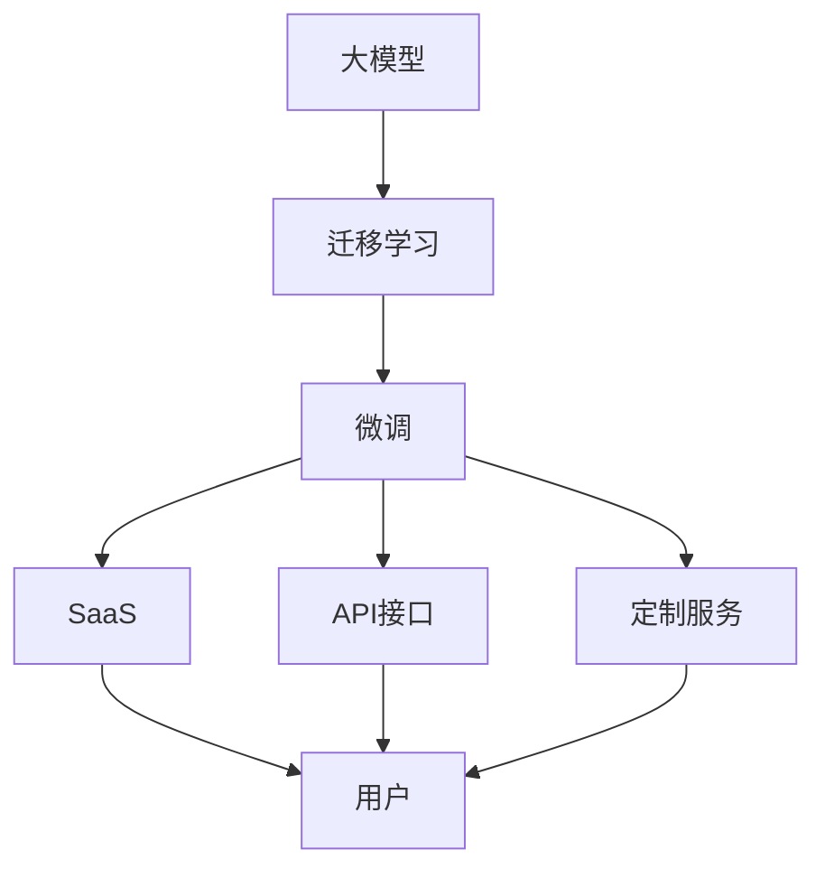

                 

# AI 大模型创业：如何利用经济优势？

> 关键词：大模型创业、经济优势、商业模式、市场竞争、技术壁垒、成本控制、资源利用、数据隐私、法律合规、商业化策略

## 1. 背景介绍

随着人工智能(AI)技术的飞速发展，尤其是近年来深度学习和大规模预训练模型在自然语言处理(NLP)、计算机视觉(CV)、语音识别(SR)等领域的突破，AI大模型正成为创业和技术创新领域的热门话题。然而，要真正将AI大模型商业化落地，并从中获得经济优势，不仅需要强大的技术实力，还需要一系列的商业化策略和运营能力。本文将从经济优势的角度，探讨如何利用AI大模型进行创业，并通过具体的技术和商业模式分析，提供实用的策略建议。

### 1.1 问题由来

大模型的研发和部署涉及巨额资金投入，需要强大的硬件基础设施、数据资源、技术人才等支持。然而，一旦研发成功并投入市场，其潜在的商业价值也无比巨大。如何在大模型创业中利用经济优势，是一个亟需解决的问题。本文将重点从技术、市场、成本、运营等角度，分析AI大模型创业的经济优势和相应的策略建议。

### 1.2 问题核心关键点

大模型创业的经济优势主要体现在以下几个方面：
1. **规模经济效应**：大模型通过大规模的训练数据和计算资源，可以获得更优的性能表现，从而在市场上获得更高的价值。
2. **迁移学习优势**：大模型可以通过迁移学习快速适应新任务，减少重复训练成本。
3. **降低研发成本**：大模型可以帮助创业公司快速构建和部署AI系统，缩短上市时间。
4. **提升用户体验**：大模型的强大性能可以提升用户体验，增加用户黏性和忠诚度。
5. **灵活的商业模式**：大模型可以采用多种商业模式，如SaaS、API接口、定制服务等，满足不同客户的需求。

本文将围绕这些关键点，详细探讨AI大模型创业的经济优势及其具体应用。

## 2. 核心概念与联系

### 2.1 核心概念概述

为了更好地理解AI大模型创业的经济优势，本节将介绍几个关键概念及其相互联系：

1. **大模型**：指通过大规模无标签数据预训练得到的通用或特定领域的预训练语言模型，如BERT、GPT、T5等。
2. **迁移学习**：指将预训练模型在某一领域学习到的知识迁移到另一领域，以提升在特定任务上的性能。
3. **微调**：在大模型的基础上，通过有标签数据进行微调，使其在特定任务上表现更佳。
4. **SaaS**：即软件即服务，通过云端部署AI模型，用户可通过API接口访问和使用。
5. **API接口**：API接口是连接后端模型和前端用户的重要桥梁，用于获取模型的输出结果。
6. **定制服务**：根据客户需求，定制开发特定的AI解决方案。

这些概念之间的联系可以通过以下Mermaid流程图来展示：



该流程图展示了从大模型到最终用户之间的技术路径和商业路径，以及不同的商业模式和服务方式。

## 3. 核心算法原理 & 具体操作步骤
### 3.1 算法原理概述

AI大模型的经济优势主要来源于其规模经济效应和迁移学习能力。具体而言，大模型通过大规模预训练和微调，能够在特定任务上获得更优的性能，同时具备较强的迁移学习能力，可以快速适应新任务。

以NLP领域的BERT为例，其在大规模无标签数据上进行了预训练，学习到了丰富的语言表示，然后在特定任务上通过微调，进一步提升了模型的性能。这种微调过程不仅利用了预训练模型学习到的通用知识，还通过少量有标签数据，对模型进行了任务特定的优化，从而在实际应用中表现优异。

### 3.2 算法步骤详解

AI大模型的创业实践，一般包括以下几个关键步骤：

**Step 1: 选择合适的预训练模型和大规模数据集**
- 根据具体业务需求，选择合适的预训练模型（如BERT、GPT等）。
- 收集大规模无标签数据集（如Wikipedia、Pile等）进行预训练。

**Step 2: 数据预处理和模型微调**
- 对大规模数据进行标注和处理，构建有标签数据集。
- 选择合适的微调任务和损失函数，对预训练模型进行微调。

**Step 3: 部署模型并应用**
- 将微调后的模型部署到云端或本地，提供API接口或SaaS服务。
- 根据客户需求，提供定制服务或API接口访问。

**Step 4: 市场推广和用户获取**
- 通过SEO、社交媒体、合作推广等手段，提升品牌知名度和用户获取率。
- 提供试用服务，吸引客户体验产品，增加用户粘性。

**Step 5: 运营优化和客户服务**
- 收集用户反馈，优化产品功能和用户体验。
- 提供技术支持，确保客户问题及时解决。

### 3.3 算法优缺点

AI大模型的经济优势在于其强大的性能和迁移学习能力，但同时也有一些不足之处：

**优点**：
1. **高性能**：大模型通过大规模预训练和微调，在特定任务上表现优异，能够显著提升用户体验。
2. **低成本**：通过迁移学习和微调，可以快速适应新任务，减少重复训练成本。
3. **灵活性**：可以根据客户需求，提供定制服务或API接口，灵活满足不同业务需求。

**缺点**：
1. **高投入**：预训练和微调过程需要大量计算资源和数据，初期投入成本较高。
2. **数据隐私问题**：大规模数据的使用和存储可能涉及隐私问题，需要严格的数据保护措施。
3. **技术复杂性**：大模型的训练和微调需要强大的技术团队支持，对技术要求较高。

### 3.4 算法应用领域

AI大模型在多个领域都有广泛应用，具体如下：

1. **医疗健康**：通过分析医疗影像、电子病历等数据，提供疾病诊断、治疗建议等服务。
2. **金融服务**：利用大模型进行风险评估、信用评分、投资建议等金融服务。
3. **智能客服**：通过自然语言处理技术，提供智能客服和自动化客服解决方案。
4. **智能制造**：利用大模型进行设备故障预测、生产流程优化等，提高生产效率和质量。
5. **零售电商**：通过分析用户行为数据，提供个性化推荐、购物助手等服务。
6. **内容创作**：利用大模型进行内容生成、内容审核等，提升内容创作效率和质量。

## 4. 数学模型和公式 & 详细讲解 & 举例说明（备注：数学公式请使用latex格式，latex嵌入文中独立段落使用 $$，段落内使用 $)
### 4.1 数学模型构建

假设我们有一个预训练的BERT模型，通过微调来解决一个特定的命名实体识别(NER)任务。其数学模型构建如下：

1. 输入数据：$x = (x_1, x_2, ..., x_n)$，其中$x_i$表示输入的文本。
2. 标签数据：$y = (y_1, y_2, ..., y_n)$，其中$y_i$表示$x_i$对应的标签。
3. 模型参数：$\theta$，包括预训练参数和微调参数。
4. 微调模型：$f(x, \theta)$，表示模型在输入数据$x$上的输出。
5. 损失函数：$\mathcal{L}$，用于衡量模型输出与真实标签之间的差异。

微调的优化目标是最小化损失函数：

$$
\min_{\theta} \mathcal{L}(f(x, \theta), y)
$$

其中，$\mathcal{L}$可以是交叉熵损失、均方误差损失等。

### 4.2 公式推导过程

以二分类任务为例，假设模型在输入$x$上的输出为$\hat{y} = f(x, \theta)$，其中$\hat{y} \in [0,1]$表示模型预测的正类概率。真实标签$y \in \{0,1\}$。则二分类交叉熵损失函数定义为：

$$
\ell(f(x, \theta), y) = -[y\log \hat{y} + (1-y)\log(1-\hat{y})]
$$

将其代入经验风险公式，得：

$$
\mathcal{L}(\theta) = -\frac{1}{N}\sum_{i=1}^N [y_i\log f(x_i, \theta)+(1-y_i)\log(1-f(x_i, \theta))]
$$

根据链式法则，损失函数对参数$\theta$的梯度为：

$$
\frac{\partial \mathcal{L}(\theta)}{\partial \theta} = -\frac{1}{N}\sum_{i=1}^N (\frac{y_i}{f(x_i, \theta)}-\frac{1-y_i}{1-f(x_i, \theta)}) \frac{\partial f(x_i, \theta)}{\partial \theta}
$$

其中，$\frac{\partial f(x_i, \theta)}{\partial \theta}$可以通过自动微分技术高效计算。

### 4.3 案例分析与讲解

以医疗影像分类为例，我们可以利用大模型进行肿瘤检测。首先，通过大规模无标签的医学影像数据集对大模型进行预训练，然后在标注的肿瘤影像数据集上进行微调。微调后的模型可以自动识别肿瘤影像中的异常区域，辅助医生进行诊断。

具体步骤如下：
1. 收集大量无标签的医学影像数据集，对大模型进行预训练。
2. 从医院获取标注的肿瘤影像数据集，对预训练模型进行微调。
3. 部署微调后的模型到云端或本地，提供API接口或SaaS服务。
4. 医院医生可以通过API接口上传影像数据，获取模型预测结果。

## 5. 项目实践：代码实例和详细解释说明
### 5.1 开发环境搭建

在进行大模型创业的实践前，我们需要准备好开发环境。以下是使用Python进行PyTorch开发的环境配置流程：

1. 安装Anaconda：从官网下载并安装Anaconda，用于创建独立的Python环境。

2. 创建并激活虚拟环境：
```bash
conda create -n pytorch-env python=3.8 
conda activate pytorch-env
```

3. 安装PyTorch：根据CUDA版本，从官网获取对应的安装命令。例如：
```bash
conda install pytorch torchvision torchaudio cudatoolkit=11.1 -c pytorch -c conda-forge
```

4. 安装Transformers库：
```bash
pip install transformers
```

5. 安装各类工具包：
```bash
pip install numpy pandas scikit-learn matplotlib tqdm jupyter notebook ipython
```

完成上述步骤后，即可在`pytorch-env`环境中开始大模型创业的实践。

### 5.2 源代码详细实现

下面我们以医疗影像分类任务为例，给出使用Transformers库对BERT模型进行微调的PyTorch代码实现。

首先，定义医疗影像分类任务的数据处理函数：

```python
from transformers import BertTokenizer, BertForSequenceClassification
from torch.utils.data import Dataset
import torch

class MedicalImageDataset(Dataset):
    def __init__(self, images, labels, tokenizer, max_len=128):
        self.images = images
        self.labels = labels
        self.tokenizer = tokenizer
        self.max_len = max_len
        
    def __len__(self):
        return len(self.images)
    
    def __getitem__(self, item):
        image = self.images[item]
        label = self.labels[item]
        
        encoding = self.tokenizer(image, return_tensors='pt', max_length=self.max_len, padding='max_length', truncation=True)
        input_ids = encoding['input_ids'][0]
        attention_mask = encoding['attention_mask'][0]
        
        # 对标签进行编码
        encoded_label = [label2id[label] for label in label2id]
        encoded_label.extend([label2id['O']] * (self.max_len - len(encoded_label)))
        labels = torch.tensor(encoded_label, dtype=torch.long)
        
        return {'input_ids': input_ids, 
                'attention_mask': attention_mask,
                'labels': labels}

# 标签与id的映射
label2id = {'O': 0, 'Tumor': 1}
id2label = {v: k for k, v in label2id.items()}

# 创建dataset
tokenizer = BertTokenizer.from_pretrained('bert-base-cased')

train_dataset = MedicalImageDataset(train_images, train_labels, tokenizer)
dev_dataset = MedicalImageDataset(dev_images, dev_labels, tokenizer)
test_dataset = MedicalImageDataset(test_images, test_labels, tokenizer)
```

然后，定义模型和优化器：

```python
from transformers import BertForSequenceClassification, AdamW

model = BertForSequenceClassification.from_pretrained('bert-base-cased', num_labels=len(label2id))

optimizer = AdamW(model.parameters(), lr=2e-5)
```

接着，定义训练和评估函数：

```python
from torch.utils.data import DataLoader
from tqdm import tqdm
from sklearn.metrics import classification_report

device = torch.device('cuda') if torch.cuda.is_available() else torch.device('cpu')
model.to(device)

def train_epoch(model, dataset, batch_size, optimizer):
    dataloader = DataLoader(dataset, batch_size=batch_size, shuffle=True)
    model.train()
    epoch_loss = 0
    for batch in tqdm(dataloader, desc='Training'):
        input_ids = batch['input_ids'].to(device)
        attention_mask = batch['attention_mask'].to(device)
        labels = batch['labels'].to(device)
        model.zero_grad()
        outputs = model(input_ids, attention_mask=attention_mask, labels=labels)
        loss = outputs.loss
        epoch_loss += loss.item()
        loss.backward()
        optimizer.step()
    return epoch_loss / len(dataloader)

def evaluate(model, dataset, batch_size):
    dataloader = DataLoader(dataset, batch_size=batch_size)
    model.eval()
    preds, labels = [], []
    with torch.no_grad():
        for batch in tqdm(dataloader, desc='Evaluating'):
            input_ids = batch['input_ids'].to(device)
            attention_mask = batch['attention_mask'].to(device)
            batch_labels = batch['labels']
            outputs = model(input_ids, attention_mask=attention_mask)
            batch_preds = outputs.logits.argmax(dim=2).to('cpu').tolist()
            batch_labels = batch_labels.to('cpu').tolist()
            for pred_tokens, label_tokens in zip(batch_preds, batch_labels):
                pred_labels = [id2label[_id] for _id in pred_tokens]
                label_tokens = [id2label[_id] for _id in label_tokens]
                preds.append(pred_labels[:len(label_tokens)])
                labels.append(label_tokens)
                
    print(classification_report(labels, preds))
```

最后，启动训练流程并在测试集上评估：

```python
epochs = 5
batch_size = 16

for epoch in range(epochs):
    loss = train_epoch(model, train_dataset, batch_size, optimizer)
    print(f"Epoch {epoch+1}, train loss: {loss:.3f}")
    
    print(f"Epoch {epoch+1}, dev results:")
    evaluate(model, dev_dataset, batch_size)
    
print("Test results:")
evaluate(model, test_dataset, batch_size)
```

以上就是使用PyTorch对BERT进行医疗影像分类任务微调的完整代码实现。可以看到，得益于Transformers库的强大封装，我们可以用相对简洁的代码完成BERT模型的加载和微调。

### 5.3 代码解读与分析

让我们再详细解读一下关键代码的实现细节：

**MedicalImageDataset类**：
- `__init__`方法：初始化图像、标签、分词器等关键组件。
- `__len__`方法：返回数据集的样本数量。
- `__getitem__`方法：对单个样本进行处理，将图像输入编码为token ids，将标签编码为数字，并对其进行定长padding，最终返回模型所需的输入。

**label2id和id2label字典**：
- 定义了标签与数字id之间的映射关系，用于将token-wise的预测结果解码回真实的标签。

**训练和评估函数**：
- 使用PyTorch的DataLoader对数据集进行批次化加载，供模型训练和推理使用。
- 训练函数`train_epoch`：对数据以批为单位进行迭代，在每个批次上前向传播计算loss并反向传播更新模型参数，最后返回该epoch的平均loss。
- 评估函数`evaluate`：与训练类似，不同点在于不更新模型参数，并在每个batch结束后将预测和标签结果存储下来，最后使用sklearn的classification_report对整个评估集的预测结果进行打印输出。

**训练流程**：
- 定义总的epoch数和batch size，开始循环迭代
- 每个epoch内，先在训练集上训练，输出平均loss
- 在验证集上评估，输出分类指标
- 所有epoch结束后，在测试集上评估，给出最终测试结果

可以看到，PyTorch配合Transformers库使得BERT微调的代码实现变得简洁高效。开发者可以将更多精力放在数据处理、模型改进等高层逻辑上，而不必过多关注底层的实现细节。

当然，工业级的系统实现还需考虑更多因素，如模型的保存和部署、超参数的自动搜索、更灵活的任务适配层等。但核心的微调范式基本与此类似。

## 6. 实际应用场景
### 6.1 医疗影像分类

利用大模型进行医疗影像分类，可以为医院提供智能辅助诊断服务。传统的影像诊断需要大量医学知识，诊断时间和误诊率较高。通过预训练和微调，大模型可以自动学习影像中的特征，并给出相应的分类结果。

在技术实现上，可以收集大量医疗影像数据，对大模型进行预训练，然后通过微调来适应特定病症的诊断需求。微调后的模型可以自动提取影像中的病变区域，辅助医生进行快速诊断。此外，还可以结合专家知识库，进一步提升模型的诊断准确性。

### 6.2 金融风险评估

金融机构利用大模型进行风险评估，可以实时分析客户的信用评分和风险等级，提高金融决策的准确性和效率。通过收集客户的个人信息、历史交易记录等数据，对大模型进行预训练和微调，使其能够自动学习客户的行为特征和风险倾向。

在实际应用中，金融机构可以接入金融交易数据，实时评估客户的风险等级，并进行相应的风险控制措施。此外，大模型还可以结合客户的历史交易记录和行为数据，进行风险预测和预警，减少潜在的金融风险。

### 6.3 智能客服

基于大模型的智能客服系统，可以提升客户服务体验，减少人工客服的负担。传统的客服系统需要配备大量人工客服，高峰期响应速度慢，服务质量难以保证。通过预训练和微调，大模型可以自动理解客户问题，并给出相应的答案。

在实际应用中，可以收集客户的客服记录和常见问题，对大模型进行预训练和微调。微调后的模型可以自动处理客户的咨询，并在无法处理时进行人工转接。此外，大模型还可以结合NLP技术，进行文本摘要、情感分析等任务，提升客服系统的智能化水平。

### 6.4 未来应用展望

随着大模型的不断进步，其在各个领域的应用将更加广泛和深入。未来，AI大模型有望在医疗、金融、客服、制造等多个领域实现大规模落地，为社会带来深远影响。

在医疗领域，大模型可以用于疾病诊断、治疗方案推荐、手术辅助等，提升医疗服务的智能化和精准度。在金融领域，大模型可以用于风险评估、信用评分、投资建议等，提升金融决策的科学性和效率。在客服领域，大模型可以用于智能客服、对话系统、情感分析等，提升客户服务体验和效率。在制造领域，大模型可以用于设备故障预测、生产流程优化、质量控制等，提升生产效率和质量。

## 7. 工具和资源推荐
### 7.1 学习资源推荐

为了帮助开发者系统掌握AI大模型创业的技术基础和实践技巧，这里推荐一些优质的学习资源：

1. 《深度学习框架实战》系列博文：深入浅出地介绍了PyTorch、TensorFlow等深度学习框架的实战技巧和优化策略。

2. 《自然语言处理基础》课程：斯坦福大学开设的NLP入门课程，系统讲解了NLP的基本概念和经典模型。

3. 《AI创业实战》书籍：深入剖析AI创业公司的成功经验和失败教训，提供实用的商业模式和运营策略。

4. 《深度学习应用》书籍：介绍了深度学习在各个领域的应用案例，包括医疗、金融、智能客服等。

5. 《TensorFlow官方文档》：TensorFlow的官方文档，提供了丰富的API接口和示例代码，帮助开发者快速上手开发AI系统。

通过这些资源的学习实践，相信你一定能够快速掌握AI大模型创业的精髓，并用于解决实际的AI问题。

### 7.2 开发工具推荐

高效的开发离不开优秀的工具支持。以下是几款用于AI大模型创业开发的常用工具：

1. PyTorch：基于Python的开源深度学习框架，灵活动态的计算图，适合快速迭代研究。大部分预训练语言模型都有PyTorch版本的实现。

2. TensorFlow：由Google主导开发的开源深度学习框架，生产部署方便，适合大规模工程应用。同样有丰富的预训练语言模型资源。

3. TensorFlow Hub：提供了丰富的预训练模型和组件，可以方便地在大模型基础上进行微调。

4. Weights & Biases：模型训练的实验跟踪工具，可以记录和可视化模型训练过程中的各项指标，方便对比和调优。

5. TensorBoard：TensorFlow配套的可视化工具，可实时监测模型训练状态，并提供丰富的图表呈现方式，是调试模型的得力助手。

6. Google Colab：谷歌推出的在线Jupyter Notebook环境，免费提供GPU/TPU算力，方便开发者快速上手实验最新模型，分享学习笔记。

合理利用这些工具，可以显著提升AI大模型创业的开发效率，加快创新迭代的步伐。

### 7.3 相关论文推荐

AI大模型和微调技术的发展源于学界的持续研究。以下是几篇奠基性的相关论文，推荐阅读：

1. Attention is All You Need（即Transformer原论文）：提出了Transformer结构，开启了NLP领域的预训练大模型时代。

2. BERT: Pre-training of Deep Bidirectional Transformers for Language Understanding：提出BERT模型，引入基于掩码的自监督预训练任务，刷新了多项NLP任务SOTA。

3. Large-Scale and Fully Automated Machine Learning：介绍了通过大规模自动化的方式进行模型训练和微调，减少了人力成本。

4. Can We Perform Well on Imbalanced Data with Predetermined Ordering?：探讨了在样本不平衡的情况下，如何通过有序采样等技术提升模型性能。

5. Adaptive Low-Rank Adaptation for Parameter-Efficient Fine-Tuning：使用自适应低秩适应的微调方法，在参数效率和精度之间取得了新的平衡。

这些论文代表了大模型和微调技术的发展脉络。通过学习这些前沿成果，可以帮助研究者把握学科前进方向，激发更多的创新灵感。

## 8. 总结：未来发展趋势与挑战
### 8.1 总结

本文对AI大模型创业的经济优势进行了全面系统的介绍。首先阐述了AI大模型在创业中的潜在经济价值和优势，明确了创业公司的技术路线和商业路径。其次，从技术、市场、成本、运营等角度，详细讲解了AI大模型的创业实践，并给出了实用的策略建议。

通过本文的系统梳理，可以看到，AI大模型创业不仅需要强大的技术实力，还需要科学合理的商业策略和运营能力。只有充分挖掘大模型的经济优势，才能在市场竞争中占据优势，并实现长期的商业成功。

### 8.2 未来发展趋势

展望未来，AI大模型创业将呈现以下几个发展趋势：

1. **商业模式的创新**：随着技术的进步，新的商业模式和服务方式将不断涌现，如订阅服务、按需付费等，更加灵活地满足客户需求。

2. **技术的进步**：大模型将在更多领域实现商业落地，提升各行业的智能化水平。同时，技术的不断进步将带来更高效的训练和推理方法，减少资源消耗。

3. **数据的利用**：数据的价值将进一步凸显，通过高效的数据利用和数据管理，提升模型的性能和用户体验。

4. **算法的优化**：算法的优化将带来更高的效率和更低的成本，如分布式训练、模型压缩等技术将更加普及。

5. **法规和伦理的规范**：AI大模型将面临更多的法规和伦理挑战，如数据隐私保护、算法透明性等，需要制定相应的规范和标准。

### 8.3 面临的挑战

尽管AI大模型创业具有广阔的市场前景，但在实际落地过程中，仍面临诸多挑战：

1. **技术门槛高**：大模型的研发和微调需要强大的技术团队支持，初期投入成本较高。
2. **数据隐私问题**：大规模数据的使用和存储可能涉及隐私问题，需要严格的数据保护措施。
3. **模型复杂性**：大模型的训练和微调过程较为复杂，需要长时间的优化和调试。
4. **市场竞争激烈**：AI大模型创业的市场竞争日益激烈，需要不断提升产品和服务的竞争力。
5. **法规合规**：AI大模型的应用将面临更多的法规和伦理挑战，需要制定相应的规范和标准。

### 8.4 研究展望

面对AI大模型创业所面临的挑战，未来的研究需要在以下几个方面寻求新的突破：

1. **算法优化**：开发更加高效、灵活的算法，减少资源消耗，提升模型的性能。
2. **数据管理**：探索高效的数据利用和数据管理方法，提升数据隐私保护水平。
3. **模型压缩**：利用模型压缩技术，减少模型大小，提升模型部署效率。
4. **法规合规**：制定AI大模型应用的法规和伦理标准，保障用户隐私和算法透明性。
5. **商业化策略**：探索创新的商业模式，提高产品市场竞争力。

这些研究方向的探索，必将引领AI大模型创业技术迈向更高的台阶，为AI技术在各领域的落地应用提供坚实基础。面向未来，AI大模型创业需要从技术、市场、法规等多个维度协同发力，才能真正实现商业成功，造福社会。

## 9. 附录：常见问题与解答

**Q1：AI大模型创业需要哪些关键资源？**

A: AI大模型创业需要以下关键资源：
1. **强大的技术团队**：包括数据科学家、算法工程师、软件工程师等。
2. **大量的计算资源**：包括GPU/TPU等高性能设备，用于模型的训练和推理。
3. **大规模数据集**：包括结构化和非结构化数据，用于模型的预训练和微调。
4. **资金支持**：初期研发和市场推广需要大量资金支持。
5. **市场渠道**：包括线上和线下的市场推广渠道，用于产品宣传和客户获取。
6. **法规和伦理标准**：需要制定相应的规范和标准，确保产品的合规性和安全性。

**Q2：AI大模型创业如何降低初期成本？**

A: AI大模型创业可以采取以下措施降低初期成本：
1. **开源模型利用**：使用开源大模型和开源工具，减少重复研发成本。
2. **合作共建**：与研究机构、大学等合作共建，共享数据和资源。
3. **预训练和微调优化**：优化预训练和微调过程，减少资源消耗。
4. **梯度压缩和剪枝**：利用模型压缩技术，减少模型大小和计算量。
5. **云服务平台**：使用云服务平台，降低硬件部署和维护成本。

**Q3：AI大模型创业如何提高市场竞争力？**

A: AI大模型创业可以采取以下措施提高市场竞争力：
1. **产品创新**：不断推出新的产品和服务，满足客户多样化需求。
2. **技术领先**：通过技术创新，保持产品领先优势。
3. **用户导向**：深入了解客户需求，提供量身定制的解决方案。
4. **品牌建设**：通过品牌建设，提升市场知名度和客户信任度。
5. **市场推广**：积极进行市场推广，提高客户获取率和市场占有率。

**Q4：AI大模型创业如何应对法规和伦理挑战？**

A: AI大模型创业可以采取以下措施应对法规和伦理挑战：
1. **合规审查**：制定产品合规审查机制，确保产品符合法律法规。
2. **数据保护**：加强数据隐私保护措施，保障用户隐私安全。
3. **透明性**：提高算法透明性和可解释性，确保用户理解模型的决策过程。
4. **伦理审查**：进行伦理审查，确保产品的公平性、公正性和安全性。
5. **用户反馈**：积极收集用户反馈，不断优化产品和服务。

---

作者：禅与计算机程序设计艺术 / Zen and the Art of Computer Programming

